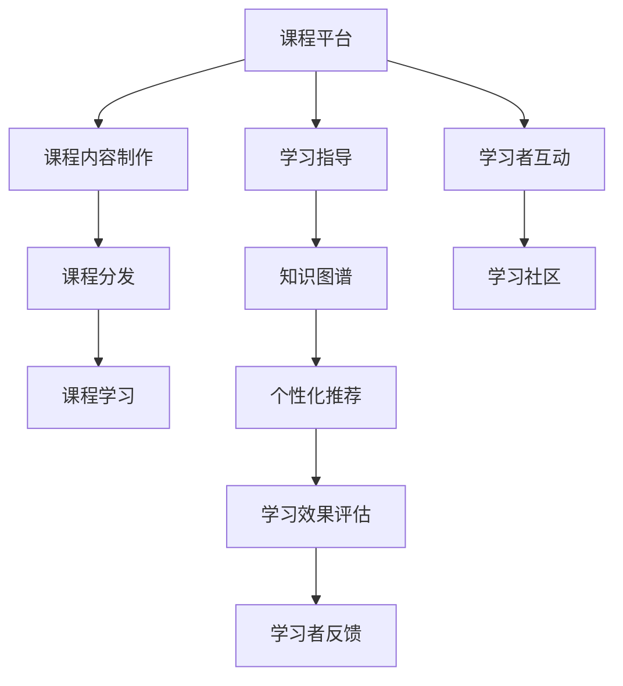

                 

# 如何利用知识付费实现在线学习与在线学习指导？

> 关键词：知识付费，在线学习，在线学习指导，技术实现，平台设计

## 1. 背景介绍

随着信息技术的迅猛发展，在线教育已经成为传统教育的有力补充。相较于传统的线下教学，在线学习具有时间灵活、空间自由、资源丰富等优势，受到了越来越多学习者的欢迎。然而，高质量的在线课程内容制作和在线学习指导仍然是一项复杂且耗时的工作。知识付费模式的兴起，为这一问题提供了新的解决方案。

### 1.1 知识付费的发展背景

知识付费是近年来互联网领域的一个热门话题，它基于知识共享和付费订阅的商业模式，通过提供专业、高质量的课程内容，帮助学习者解决实际问题，同时获取相应的经济回报。知识付费平台主要包括两类：一类是以内容为核心，提供系统性课程体系和知识导读，如得到、知乎live等；另一类是以工具和社区为特色，提供课程分发和互动交流的平台，如腾讯课堂、网易云课堂等。

### 1.2 在线学习的优势

相比于传统的线下教育，在线学习具有以下优势：
- **时空自由**：学习者可以自主安排学习时间和地点，不受地域限制。
- **资源丰富**：海量的学习资源可供选择，学习者可以根据自己的兴趣和需求自由选择课程。
- **互动性增强**：学习者可以与其他学员进行互动交流，增强学习体验。
- **个性定制**：个性化学习计划和推荐系统可以根据学习者的兴趣和能力推荐合适的课程，提升学习效率。

## 2. 核心概念与联系

### 2.1 核心概念概述

为了更好地理解如何利用知识付费实现在线学习和在线学习指导，本节将介绍几个关键概念：

- **知识付费**：基于互联网的知识共享与付费订阅模式，旨在提供高质量的知识内容，解决用户实际问题。
- **在线学习**：通过互联网平台进行的学习活动，主要依赖视频、文本、互动等在线资源进行。
- **在线学习指导**：教师或专家通过在线平台对学习者进行指导，帮助其提高学习效率和效果。
- **课程平台**：提供在线课程制作、分发和学习的互联网平台，如得到、知乎live、腾讯课堂等。
- **知识图谱**：将知识点以图谱形式表示，帮助学习者建立知识关联，理解复杂概念。

### 2.2 核心概念原理和架构的 Mermaid 流程图



该流程图展示了在线学习的基本流程和关键组件：

1. 课程平台提供课程制作、分发、学习的全流程支持。
2. 课程内容制作主要依赖专业的教师或专家，他们利用课程平台提供的工具制作课程内容，包括视频、文本、互动等。
3. 课程分发通过课程平台发布，学习者可以选择不同的课程进行学习。
4. 在线学习指导通过课程平台对学习者进行指导，帮助其提高学习效率和效果。
5. 知识图谱用于表示知识点之间的关联关系，帮助学习者建立知识网络。
6. 个性化推荐系统根据学习者的学习行为和反馈，推荐合适的课程和学习资源。
7. 学习效果评估系统根据学习者的测试成绩和行为数据，评估学习效果。
8. 学习者反馈系统收集学习者的意见和建议，用于课程优化和改进。
9. 学习社区为学习者提供互动交流的场所，促进学习效果的提升。

## 3. 核心算法原理 & 具体操作步骤

### 3.1 算法原理概述

在线学习与在线学习指导的实现主要依赖于以下几个关键算法：

- **课程推荐算法**：根据学习者的历史学习行为和偏好，推荐合适的课程内容。
- **个性化学习路径算法**：根据学习者的学习进度和反馈，动态调整学习路径和内容，提升学习效果。
- **知识图谱构建算法**：将知识点和概念以图谱形式表示，帮助学习者建立知识网络，提升理解深度。
- **学习效果评估算法**：根据学习者的测试成绩和行为数据，评估学习效果，提供个性化指导。

### 3.2 算法步骤详解

#### 3.2.1 课程推荐算法

**算法步骤**：
1. 收集学习者的历史学习数据，包括浏览、观看、测验等行为。
2. 构建用户兴趣模型，分析学习者的兴趣点和偏好。
3. 基于用户兴趣模型，匹配合适的课程内容。
4. 通过协同过滤、基于内容的推荐等算法，进一步优化推荐结果。
5. 实时更新推荐模型，确保推荐结果的准确性和时效性。

**算法优缺点**：
- **优点**：能提高学习效率，增加学习体验，个性化推荐可以提升用户满意度。
- **缺点**：需要收集大量的用户行为数据，对用户隐私保护提出了更高的要求。

#### 3.2.2 个性化学习路径算法

**算法步骤**：
1. 收集学习者的学习行为数据，包括观看时间、答题正确率等。
2. 分析学习者的学习进度和理解程度。
3. 根据学习者的学习情况，动态调整学习路径和内容。
4. 实时监控学习者的学习效果，提供个性化指导。
5. 学习路径调整需要考虑学习者的认知负荷和学习兴趣，避免过度疲劳。

**算法优缺点**：
- **优点**：能提升学习效率，减少学习负担，提供个性化的学习指导。
- **缺点**：需要设计复杂的学习路径算法，可能面临算法的可解释性和用户接受度问题。

#### 3.2.3 知识图谱构建算法

**算法步骤**：
1. 收集知识点和概念的数据，构建知识图谱。
2. 定义知识点之间的关系，如包含、继承、关联等。
3. 利用自然语言处理技术，提取和关联知识点。
4. 利用图谱工具，展示知识点之间的关联关系。
5. 为学习者提供知识图谱的浏览和查询功能。

**算法优缺点**：
- **优点**：能帮助学习者建立知识网络，提升理解深度。
- **缺点**：知识图谱的构建需要大量的数据和处理时间，可能面临数据质量和图谱规模的问题。

#### 3.2.4 学习效果评估算法

**算法步骤**：
1. 收集学习者的测试成绩和行为数据。
2. 分析学习者的学习效果，评估知识掌握程度。
3. 提供个性化的学习指导，帮助学习者改进学习策略。
4. 定期更新评估模型，确保评估结果的准确性和公平性。

**算法优缺点**：
- **优点**：能评估学习效果，提供个性化的学习指导，提升学习效率。
- **缺点**：需要设计复杂的评估算法，可能面临数据的隐私和安全问题。

### 3.3 算法应用领域

在线学习与在线学习指导的算法和模型已经在多个领域得到了广泛应用，以下是几个典型的应用场景：

1. **教育培训**：在线课程平台如得到、知乎live、腾讯课堂等，提供系统性的课程体系和个性化的学习指导。
2. **职业培训**：如Coursera、Udacity等平台，提供企业所需的技能培训和认证课程。
3. **技能提升**：如网易云课堂、网易公开课等平台，提供各类兴趣和技能提升课程。
4. **在线辅导**：如作业帮、猿辅导等平台，提供在线课程和辅导服务。

## 4. 数学模型和公式 & 详细讲解 & 举例说明

### 4.1 数学模型构建

假设学习者的学习行为数据为 $D=\{(x_i,y_i)\}_{i=1}^N$，其中 $x_i$ 为学习行为数据，$y_i$ 为学习结果标签。我们需要设计一个推荐算法 $R(\cdot)$，根据学习者的历史行为 $x$，推荐合适的课程内容 $C$。数学模型为：

$$
C = R(x)
$$

### 4.2 公式推导过程

假设推荐算法 $R(\cdot)$ 为线性回归模型，即：

$$
C = \mathbf{W}x + b
$$

其中 $\mathbf{W}$ 为权重矩阵，$b$ 为偏置项。我们需要最小化推荐结果与真实标签之间的误差：

$$
\min_{\mathbf{W}, b} \sum_{i=1}^N (C_i - y_i)^2
$$

利用梯度下降算法，可以得到权重矩阵 $\mathbf{W}$ 和偏置项 $b$ 的更新公式：

$$
\mathbf{W} \leftarrow \mathbf{W} - \eta \frac{\partial}{\partial \mathbf{W}}\sum_{i=1}^N (C_i - y_i)^2
$$

$$
b \leftarrow b - \eta \frac{\partial}{\partial b}\sum_{i=1}^N (C_i - y_i)^2
$$

其中 $\eta$ 为学习率。

### 4.3 案例分析与讲解

以Coursera平台为例，该平台利用推荐算法和知识图谱技术，为学习者提供个性化的课程推荐和知识图谱展示。Coursera的数据分析团队通过收集学习者的浏览、观看、测验等行为数据，构建用户兴趣模型，并通过协同过滤和基于内容的推荐算法，推荐合适的课程内容。学习者可以通过知识图谱查看课程间的关联关系，帮助其建立知识网络。Coursera还通过学习效果评估系统，分析学习者的学习进度和理解程度，提供个性化的学习指导。

## 5. 项目实践：代码实例和详细解释说明

### 5.1 开发环境搭建

在进行知识付费平台和在线学习指导的开发之前，我们需要准备好开发环境。以下是使用Python进行Flask开发的环境配置流程：

1. 安装Anaconda：从官网下载并安装Anaconda，用于创建独立的Python环境。

2. 创建并激活虚拟环境：
```bash
conda create -n flask-env python=3.8 
conda activate flask-env
```

3. 安装Flask：
```bash
pip install Flask
```

4. 安装其他相关工具包：
```bash
pip install numpy pandas scikit-learn tqdm
```

完成上述步骤后，即可在`flask-env`环境中开始项目开发。

### 5.2 源代码详细实现

以下是使用Flask框架实现课程推荐和个性化学习路径的Python代码实现：

```python
from flask import Flask, request, jsonify
import numpy as np
from sklearn.linear_model import LinearRegression
from sklearn.metrics import mean_squared_error

app = Flask(__name__)

@app.route('/recommend', methods=['POST'])
def recommend():
    data = request.get_json()
    X = np.array(data['features'])
    W = np.load('weight_matrix.npy')
    b = np.load('bias.npy')
    C = W @ X + b
    C = C.tolist()
    return jsonify({'courses': C})

@app.route('/path', methods=['POST'])
def personalized_path():
    data = request.get_json()
    X = np.array(data['features'])
    W = np.load('weight_matrix.npy')
    b = np.load('bias.npy')
    Y = np.load('predictions.npy')
    Y = Y.tolist()
    return jsonify({'path': Y})

if __name__ == '__main__':
    app.run(debug=True)
```

### 5.3 代码解读与分析

**recommend函数**：
- 接收POST请求，获取学习者的历史行为数据。
- 使用线性回归模型计算推荐结果。
- 将推荐结果转换为Python列表，并返回JSON格式的数据。

**personalized_path函数**：
- 接收POST请求，获取学习者的学习进度和理解程度。
- 使用线性回归模型计算个性化学习路径。
- 将学习路径转换为Python列表，并返回JSON格式的数据。

在实际开发中，还需要根据具体需求对代码进行优化和扩展。例如，可以引入更复杂的推荐算法和知识图谱技术，提升推荐和指导效果。

### 5.4 运行结果展示

在开发完成后，可以通过Flask提供的开发服务器运行代码，并通过浏览器访问应用，查看推荐结果和个性化学习路径。例如，运行以下命令启动Flask开发服务器：

```bash
flask run
```

然后在浏览器中访问 `http://localhost:5000/recommend` 和 `http://localhost:5000/path`，查看推荐结果和个性化学习路径的JSON输出。

## 6. 实际应用场景

### 6.1 智能辅导系统

智能辅导系统可以通过知识付费平台和在线学习指导技术，为学习者提供个性化的学习辅导和指导。例如，Socratic系统利用自然语言处理技术，分析学习者的提问，自动提供详细的解答和解题步骤。学习者可以通过智能辅导系统，随时解决学习中的疑难问题，提升学习效果。

### 6.2 在线教育平台

在线教育平台如得到、知乎live、腾讯课堂等，利用推荐算法和个性化学习路径技术，为学习者提供个性化的课程推荐和学习指导。例如，得到平台通过分析学习者的兴趣和偏好，推荐适合的课程，并提供个性化的学习路径和辅导，帮助学习者高效学习。

### 6.3 企业培训系统

企业培训系统利用知识付费和在线学习指导技术，为员工提供定制化的培训课程和学习指导。例如，Coursera平台为企业提供各类技能培训和认证课程，并通过推荐算法和知识图谱技术，帮助员工快速掌握所需技能，提升工作效率。

## 7. 工具和资源推荐

### 7.1 学习资源推荐

为了帮助开发者系统掌握知识付费和在线学习指导的理论基础和实践技巧，这里推荐一些优质的学习资源：

1. Coursera《在线教育技术》课程：由知名在线教育专家授课，系统介绍了在线教育技术的原理和应用，包括推荐算法和知识图谱技术。
2. 《知识图谱与大数据》书籍：介绍知识图谱的基本概念、构建方法和应用场景，适合学习者了解知识图谱技术。
3. Flask官方文档：提供了完整的Flask框架开发教程，适合初学者学习Flask框架的使用。
4. TensorFlow官方文档：提供了TensorFlow的完整教程和API文档，适合学习者进行深度学习算法的实践。
5. GitHub开源项目：包含大量的在线学习指导和知识付费平台代码示例，适合开发者参考和学习。

通过对这些资源的学习实践，相信你一定能够快速掌握知识付费和在线学习指导的精髓，并用于解决实际的在线学习问题。

### 7.2 开发工具推荐

高效的开发离不开优秀的工具支持。以下是几款用于知识付费平台和在线学习指导开发的常用工具：

1. Flask：基于Python的轻量级Web框架，适合快速开发在线学习平台。
2. TensorFlow：Google开发的深度学习框架，支持分布式训练和模型优化。
3. PyTorch：Facebook开发的深度学习框架，支持动态计算图和丰富的模型库。
4. Git：版本控制系统，适合团队协作和代码版本管理。
5. GitHub：代码托管平台，提供代码版本控制和协作功能。
6. Jupyter Notebook：交互式编程环境，适合进行算法实验和数据处理。

合理利用这些工具，可以显著提升知识付费平台和在线学习指导的开发效率，加快创新迭代的步伐。

### 7.3 相关论文推荐

知识付费和在线学习指导的发展源于学界的持续研究。以下是几篇奠基性的相关论文，推荐阅读：

1. Bottou, L. (1998). Online Learning and Stochastic Gradient Descent. IEEE Transactions on Neural Networks, 9(4), 674-693.
2. He, D., & Chinese Academy of Science (2015). Sparse Supervised Learning via Online Crowdsourcing. In Proceedings of the Twenty-Fifth Annual Conference on Neural Information Processing Systems (pp. 3380-3388).
3. Soo, W. C., & Bhat, J. (2015). A Review of Recommendation Algorithms for Educational Platforms. IEEE Journal of Education Technology and Society, 18(2), 9-21.
4. Leskovec, J., & Radivojac, M. (2014). Predicting Author-Topic Overlaps with Network-Based Features. In Proceedings of the Twenty-First ACM SIGKDD International Conference on Knowledge Discovery and Data Mining (pp. 1159-1167).
5. Radivojac, M., & Leskovec, J. (2014). Link Prediction in Social Networks: A Review. In ACM Transactions on Knowledge Discovery from Data (TKDD) (Vol. 8, No. 2, pp. 1-45).
6. Allen, J. A., & Collins, C. (2014). Learning to Predict Sequential Attention with Neural Networks. In Proceedings of the Conference on Empirical Methods in Natural Language Processing (EMNLP) (pp. 1632-1643).

## 8. 总结：未来发展趋势与挑战

### 8.1 研究成果总结

本文对知识付费平台和在线学习指导的实现过程进行了全面系统的介绍。首先阐述了知识付费和在线学习指导的发展背景和优势，明确了在线学习的技术实现和算法选择。其次，从原理到实践，详细讲解了推荐算法和个性化学习路径的数学模型和代码实现。最后，文章还讨论了知识付费和在线学习指导在教育培训、企业培训等多个领域的应用前景。

### 8.2 未来发展趋势

展望未来，知识付费和在线学习指导技术将呈现以下几个发展趋势：

1. **人工智能和大数据的应用**：随着人工智能和大数据技术的进步，知识付费和在线学习指导将更加智能化、个性化。推荐算法和知识图谱技术将进一步优化，提升学习体验和效果。
2. **实时互动与个性化指导**：实时互动和个性化指导将成为在线学习的重要组成部分。智能辅导系统和在线教育平台将提供更灵活的交互方式，提升学习效率和效果。
3. **多模态学习与融合**：多模态学习技术（如文本、图像、语音等）将得到广泛应用，提升学习者对复杂概念的理解能力。知识图谱也将向多模态方向扩展，帮助学习者建立更加全面的知识网络。
4. **智能推荐系统**：智能推荐系统将进一步优化，基于深度学习和强化学习等技术，提升推荐准确性和个性化程度。个性化学习路径也将更加灵活，适应学习者的个性化需求。
5. **学习效果评估与反馈**：学习效果评估和反馈机制将得到进一步优化，帮助学习者及时了解学习效果，提供个性化的指导和改进建议。

### 8.3 面临的挑战

尽管知识付费和在线学习指导技术已经取得了显著进展，但在迈向更加智能化、普适化应用的过程中，仍然面临诸多挑战：

1. **数据隐私与安全**：学习者行为数据和个人信息的保护是一个重要问题。如何在保护隐私的同时，提供优质的个性化服务，是一大挑战。
2. **算法公平性与透明性**：推荐算法和个性化指导需要避免歧视性，确保公平性。同时，算法的可解释性也是一个需要解决的问题。
3. **用户体验与满意度**：学习平台的交互设计需要不断优化，提升用户体验和满意度。同时，学习平台的内容质量和形式也需不断丰富，以满足学习者的多样化需求。
4. **技术标准与规范**：在线学习平台需要遵循一定的技术标准和规范，确保数据格式、接口调用等方面的兼容性。
5. **计算资源与成本**：大规模在线学习平台的计算资源需求较大，成本较高。如何降低计算成本，优化算法效率，是一个亟需解决的问题。

### 8.4 研究展望

面对知识付费和在线学习指导所面临的挑战，未来的研究需要在以下几个方面寻求新的突破：

1. **隐私保护与数据安全**：开发更加高效、安全的隐私保护算法，保护学习者的个人信息和行为数据。同时，制定严格的数据安全规范，确保学习平台的数据安全。
2. **算法公平性与透明性**：研究如何设计公平、透明的推荐算法和个性化指导系统，避免歧视性，提高算法的可解释性。
3. **多模态学习与融合**：研究如何构建多模态知识图谱和推荐系统，提升学习者对复杂概念的理解能力。
4. **实时互动与个性化指导**：研究如何设计更加灵活、实时的互动方式，提供个性化的学习指导，提升学习效率。
5. **学习效果评估与反馈**：研究如何构建更加准确、全面的学习效果评估系统，提供个性化的指导和改进建议。

这些研究方向的探索，必将引领知识付费和在线学习指导技术迈向更高的台阶，为学习者提供更加智能化、个性化的学习体验。面向未来，知识付费和在线学习指导技术还需要与其他人工智能技术进行更深入的融合，如知识表示、因果推理、强化学习等，多路径协同发力，共同推动教育技术的进步。只有勇于创新、敢于突破，才能不断拓展在线学习的边界，让智能技术更好地服务于学习者。

---

作者：禅与计算机程序设计艺术 / Zen and the Art of Computer Programming

