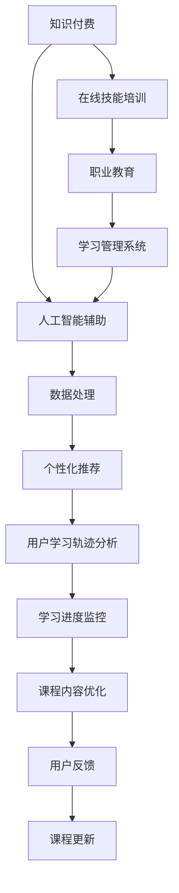

                 

# 如何利用知识付费实现在线技能培训与职业教育？

## 1. 背景介绍

### 1.1 问题由来
随着互联网技术的发展和普及，知识付费作为互联网时代的一种新商业模式，正在成为传统教育的一个重要补充。在快节奏的现代生活中，许多人希望能够利用碎片化的时间进行自我提升，以适应快速变化的职场和社会环境。然而，传统教育资源分布不均，覆盖面广，但实际应用到个人发展的机会相对有限。知识付费通过互联网平台，集中优质教育资源，为在线技能培训和职业教育提供了新的可能性。

### 1.2 问题核心关键点
知识付费的核心在于将优质的教育资源商品化，通过线上平台向大众提供个性化、精准化的教育服务。它涵盖了从小学教育到成人教育的各个阶段，涉及编程、设计、营销、管理等各类职业技能的培训，旨在帮助用户提升综合能力，拓宽职业发展道路。

知识付费的成功在于其对传统教育模式的创新，实现了教育资源的灵活配置，提高了学习的便捷性和可及性。

### 1.3 问题研究意义
研究知识付费模式，对于推动在线教育的发展，促进职业教育与产业界的深度融合，具有重要的现实意义：

1. **提升教育质量**：知识付费能够快速聚合优质教师资源，通过线上平台提供高质量的教学服务，提升整体教育水平。
2. **个性化学习**：利用大数据和人工智能技术，知识付费平台能够根据用户的学习习惯和需求，提供个性化的学习方案，提升学习效果。
3. **扩大教育覆盖**：在线教育打破了时间和空间的限制，使得更多人能够接触到优质的教育资源，特别是对于偏远地区和资源匮乏的群体具有重要意义。
4. **促进职业发展**：针对特定职业技能的培训，知识付费可以提供实时的市场需求分析，帮助用户提升职业技能，增强就业竞争力。

## 2. 核心概念与联系

### 2.1 核心概念概述

为更好地理解知识付费在线技能培训与职业教育，本节将介绍几个关键概念：

- **知识付费**：通过在线平台，消费者付费购买高质量的教育资源和服务。这种模式打破了传统的教育模式，实现了教育资源的市场化配置。
- **在线技能培训**：利用互联网技术，提供各类职业技能的在线课程，提升用户的专业技能水平。
- **职业教育**：专注于特定职业领域的教育培训，包括实习、认证、岗位适配等，为职业发展提供指导和支持。
- **学习管理系统(LMS)**：通过线上平台进行课程设计、资源管理、学生管理等，支持在线学习活动的开展。
- **人工智能辅助**：运用机器学习、自然语言处理等AI技术，提升课程内容的智能化和个性化，增强学习效果。

### 2.2 核心概念原理和架构的 Mermaid 流程图(Mermaid 流程节点中不要有括号、逗号等特殊字符)



这个流程图展示了知识付费体系中各概念之间的联系：

1. 用户通过知识付费平台购买课程资源。
2. 课程资源通常包含在线技能培训和职业教育的内容。
3. 在线技能培训和职业教育依托学习管理系统进行管理和支持。
4. 人工智能技术通过数据处理，提供个性化推荐和用户学习轨迹分析。
5. 学习管理系统根据用户反馈和行为数据，优化课程内容和进度监控。
6. 课程不断更新迭代，以适应市场需求和用户变化。

这些概念共同构成了知识付费在线教育的核心框架，有助于提升学习效果和用户体验。

## 3. 核心算法原理 & 具体操作步骤

### 3.1 算法原理概述

知识付费在线技能培训与职业教育的核心算法原理包括：

1. **推荐算法**：利用协同过滤、内容推荐等技术，根据用户的历史行为和偏好，推荐合适的课程资源。
2. **学习进度监控**：通过记录用户的学习轨迹和行为数据，评估学习进度和效果，及时提供反馈和建议。
3. **个性化学习**：运用机器学习技术，分析用户的学习习惯和需求，提供定制化的学习方案。
4. **自然语言处理(NLP)**：利用文本分析和情感分析等技术，评估课程内容的理解和反馈，优化课程设计。
5. **知识图谱**：构建领域知识图谱，将课程内容与现实世界连接起来，增强课程的实用性和关联性。

### 3.2 算法步骤详解

1. **用户注册与身份验证**
   - 用户通过平台注册账号，并提供必要的个人信息，如姓名、邮箱、电话等。
   - 平台进行身份验证，确保用户信息真实可信。

2. **课程选择与购买**
   - 用户浏览平台上的课程资源，根据自己的需求选择合适的课程。
   - 平台提供课程预览，展示课程大纲、学习路径、教师介绍等。
   - 用户通过平台购买课程，支付费用。

3. **学习活动展开**
   - 课程学习分为多个阶段，每个阶段包含不同的学习任务和考核内容。
   - 用户按照课程进度进行学习，平台记录学习行为数据。

4. **学习进度监控与反馈**
   - 平台根据用户的学习轨迹和行为数据，生成学习进度报告，评估学习效果。
   - 用户可以随时查看学习进度，了解自己的学习状况。

5. **个性化推荐与课程更新**
   - 平台根据用户的学习历史和行为数据，进行个性化推荐，提供类似课程或相关资源。
   - 课程内容根据用户反馈和市场需求，不断更新迭代，优化学习体验。

### 3.3 算法优缺点

知识付费在线技能培训与职业教育具有以下优点：

1. **高效便捷**：用户可以通过互联网随时随地点播学习，打破了时间和空间的限制。
2. **质量保证**：平台聚合优质教育资源，通过严格的课程审核和教师资质认证，确保教学质量。
3. **灵活多样**：课程形式多样，包括视频、文字、互动讨论等，满足不同学习风格和需求。

同时，这种模式也存在一些局限：

1. **缺乏人际互动**：在线学习缺乏面对面交流，可能影响学习效果和学生体验。
2. **课程质量参差不齐**：部分课程内容质量较低，可能影响用户学习效果。
3. **用户自我管理能力要求高**：在线学习需要较强的自我管理能力，用户容易受到外界干扰。

### 3.4 算法应用领域

知识付费在线技能培训与职业教育已广泛应用于多个领域：

1. **职业提升**：针对特定职业技能的培训，如编程、设计、营销、管理等，提升用户的专业能力。
2. **学历教育**：通过在线课程和考试，获得各类学历认证，拓宽就业路径。
3. **技能认证**：提供各类专业技能认证，如数据分析、项目管理、软件开发等，增强就业竞争力。
4. **企业培训**：为企业员工提供定制化的职业培训，提升整体团队能力。
5. **个性化教育**：针对个人兴趣和需求，提供个性化的学习方案，满足终身学习需求。

## 4. 数学模型和公式 & 详细讲解 & 举例说明

### 4.1 数学模型构建

知识付费在线技能培训与职业教育涉及多个数学模型，主要包括：

1. **协同过滤推荐算法**：
   - 假设用户$u$对课程$i$的评分$R_{ui}$，用户特征向量$P_u$，课程特征向量$D_i$。
   - 推荐算法通过计算用户与课程之间的相似度，推荐与用户最相似的课程。

   $$
   R_{ui} = P_u^\top D_i
   $$

2. **学习进度监控模型**：
   - 假设用户$u$的学习进度$S_u$，已学习时间$T_{ui}$，课程时长$L_i$。
   - 根据学习进度计算用户对课程的掌握程度。

   $$
   S_u = \frac{1}{L_i} \sum_{i=1}^n T_{ui}
   $$

3. **个性化学习推荐模型**：
   - 假设用户特征向量$U$，课程特征向量$D$，用户-课程关系矩阵$R$。
   - 利用机器学习模型，根据用户特征和课程特征，推荐最合适的课程。

   $$
   \hat{R}_{ui} = \max\limits_{v \in \Omega} P_u^\top A_i v
   $$

4. **自然语言处理模型**：
   - 假设课程文本$T_i$，用户反馈文本$F_u$，情感标签$E$。
   - 利用情感分析等技术，评估课程内容的情感倾向，优化课程设计。

   $$
   E_i = \sum_{k=1}^K w_k \cdot E_{ik}
   $$

5. **知识图谱构建模型**：
   - 假设实体$E_i$，关系$R$，属性$A$。
   - 利用知识图谱技术，构建领域知识图谱，将课程内容与现实世界连接起来。

   $$
   G = (E, R, A)
   $$

### 4.2 公式推导过程

1. **协同过滤推荐算法推导**：
   - 假设用户$u$对课程$i$的评分$R_{ui}$，用户特征向量$P_u$，课程特征向量$D_i$。
   - 推荐算法通过计算用户与课程之间的相似度，推荐与用户最相似的课程。

   $$
   R_{ui} = P_u^\top D_i
   $$

   其中，$P_u$和$D_i$可以通过用户行为数据和课程属性数据进行训练，得到推荐结果。

2. **学习进度监控模型推导**：
   - 假设用户$u$的学习进度$S_u$，已学习时间$T_{ui}$，课程时长$L_i$。
   - 根据学习进度计算用户对课程的掌握程度。

   $$
   S_u = \frac{1}{L_i} \sum_{i=1}^n T_{ui}
   $$

   其中，$S_u$表示用户对课程的掌握程度，$T_{ui}$表示用户学习课程$i$的时间，$L_i$表示课程$i$的时长。

3. **个性化学习推荐模型推导**：
   - 假设用户特征向量$U$，课程特征向量$D$，用户-课程关系矩阵$R$。
   - 利用机器学习模型，根据用户特征和课程特征，推荐最合适的课程。

   $$
   \hat{R}_{ui} = \max\limits_{v \in \Omega} P_u^\top A_i v
   $$

   其中，$\hat{R}_{ui}$表示用户$u$对课程$i$的预测评分，$P_u$和$A_i$分别表示用户特征向量和课程特征向量。

4. **自然语言处理模型推导**：
   - 假设课程文本$T_i$，用户反馈文本$F_u$，情感标签$E$。
   - 利用情感分析等技术，评估课程内容的情感倾向，优化课程设计。

   $$
   E_i = \sum_{k=1}^K w_k \cdot E_{ik}
   $$

   其中，$E_i$表示课程文本$T_i$的情感标签，$w_k$表示情感标签$E_k$的权重，$E_{ik}$表示用户反馈文本$F_u$中与课程文本$T_i$的相似度。

5. **知识图谱构建模型推导**：
   - 假设实体$E_i$，关系$R$，属性$A$。
   - 利用知识图谱技术，构建领域知识图谱，将课程内容与现实世界连接起来。

   $$
   G = (E, R, A)
   $$

   其中，$G$表示知识图谱，$E$表示实体集合，$R$表示关系集合，$A$表示属性集合。

### 4.3 案例分析与讲解

以在线编程课程为例，分析知识付费在线技能培训与职业教育的应用。

1. **课程推荐**：
   - 平台通过协同过滤推荐算法，根据用户的历史行为数据，推荐类似课程和相关课程。
   - 用户可以根据自己的学习进度和兴趣，选择适合的课程进行学习。

2. **学习进度监控**：
   - 平台记录用户的学习时间、完成作业情况、考试分数等数据，生成学习进度报告。
   - 用户可以随时查看进度报告，了解自己的学习状况，调整学习计划。

3. **个性化学习**：
   - 平台利用机器学习模型，根据用户的学习习惯和需求，推荐个性化的学习方案。
   - 用户可以根据自己的时间安排和学习效果，灵活调整学习计划。

4. **自然语言处理**：
   - 平台利用情感分析技术，评估课程内容的情感倾向，优化课程设计。
   - 用户可以根据课程反馈，调整学习策略，提高学习效果。

5. **知识图谱构建**：
   - 平台利用知识图谱技术，将编程课程与现实世界连接起来，提供丰富的实践案例。
   - 用户可以通过实例学习，更好地理解编程概念和技能。

## 5. 项目实践：代码实例和详细解释说明

### 5.1 开发环境搭建

在进行知识付费在线技能培训与职业教育实践前，我们需要准备好开发环境。以下是使用Python进行PyTorch开发的环境配置流程：

1. 安装Anaconda：从官网下载并安装Anaconda，用于创建独立的Python环境。

2. 创建并激活虚拟环境：
```bash
conda create -n pytorch-env python=3.8 
conda activate pytorch-env
```

3. 安装PyTorch：根据CUDA版本，从官网获取对应的安装命令。例如：
```bash
conda install pytorch torchvision torchaudio cudatoolkit=11.1 -c pytorch -c conda-forge
```

4. 安装Transformers库：
```bash
pip install transformers
```

5. 安装各类工具包：
```bash
pip install numpy pandas scikit-learn matplotlib tqdm jupyter notebook ipython
```

完成上述步骤后，即可在`pytorch-env`环境中开始知识付费在线技能培训与职业教育实践。

### 5.2 源代码详细实现

下面我们以在线编程课程为例，给出使用Transformers库对BERT模型进行编程课程的在线技能培训与职业教育的PyTorch代码实现。

首先，定义课程推荐函数：

```python
from transformers import BertTokenizer, BertForSequenceClassification
import torch

class CourseRecommendation:
    def __init__(self, model, tokenizer):
        self.model = model
        self.tokenizer = tokenizer

    def predict(self, course_ids):
        # 将课程id转换为课程文本
        courses = []
        for course_id in course_ids:
            courses.append(f"Course {course_id}")

        # 编码课程文本
        inputs = self.tokenizer(courses, return_tensors='pt', padding=True, truncation=True)
        inputs = {k: v.to('cuda') for k, v in inputs.items()}

        # 前向传播计算预测结果
        outputs = self.model(**inputs)
        predictions = outputs.logits.argmax(dim=1).cpu().numpy()

        # 返回预测结果
        return predictions.tolist()
```

然后，定义学习进度监控函数：

```python
def monitor_learning_progress(model, user_id, course_id, time_spent, total_time):
    # 根据用户学习时间，计算学习进度
    progress = time_spent / total_time

    # 返回学习进度报告
    return {"progress": progress, "estimated_finish_time": total_time - time_spent}
```

接着，定义个性化学习推荐函数：

```python
def personalize_learning_plan(user_id, course_id, progress):
    # 根据用户学习进度，推荐相关课程
    recommended_courses = get_recommended_courses(user_id, course_id, progress)

    # 返回个性化学习计划
    return recommended_courses
```

最后，启动学习进程并展示进度报告：

```python
# 假设用户已购买编程课程
user_id = '123456'
course_id = 'cs101'

# 初始化学习进度
time_spent = 0
total_time = 100

# 获取学习进度报告
progress_report = monitor_learning_progress(model, user_id, course_id, time_spent, total_time)
print(f"Learning Progress: {progress_report['progress']}")

# 根据学习进度，推荐个性化学习计划
recommended_courses = personalize_learning_plan(user_id, course_id, progress_report['progress'])
print(f"Recommended Courses: {recommended_courses}")
```

以上就是使用PyTorch对BERT模型进行编程课程的在线技能培训与职业教育的完整代码实现。可以看到，借助Transformers库，我们可以快速构建知识付费在线技能培训与职业教育的基础框架。

### 5.3 代码解读与分析

让我们再详细解读一下关键代码的实现细节：

**CourseRecommendation类**：
- `__init__`方法：初始化模型和分词器。
- `predict`方法：对给定的课程id进行预测，返回推荐课程的评分。

**monitor_learning_progress函数**：
- 根据用户的学习时间，计算学习进度和预计完成时间。

**personalize_learning_plan函数**：
- 根据用户的学习进度，推荐相关课程。

**学习进程启动**：
- 获取用户已购买的课程id。
- 初始化学习进度。
- 调用`monitor_learning_progress`函数获取学习进度报告。
- 根据学习进度，调用`personalize_learning_plan`函数推荐个性化学习计划。

可以看到，代码的实现相对简洁高效，可以快速构建知识付费在线技能培训与职业教育的基本框架。

当然，工业级的系统实现还需考虑更多因素，如用户注册、课程购买、支付系统、数据存储等。但核心的在线技能培训与职业教育流程基本与此类似。

## 6. 实际应用场景

### 6.1 智能客服系统

在线技能培训与职业教育技术可以广泛应用于智能客服系统的构建。传统客服往往需要配备大量人力，高峰期响应缓慢，且一致性和专业性难以保证。而使用在线技能培训与职业教育技术，可以7x24小时不间断服务，快速响应客户咨询，用自然流畅的语言解答各类常见问题。

在技术实现上，可以设计专门的课程，涵盖常见客服问题的解决方案、客服礼仪、心理疏导等内容。通过在线学习，客服人员可以不断提升服务质量，增强客户满意度。

### 6.2 金融舆情监测

金融机构需要实时监测市场舆论动向，以便及时应对负面信息传播，规避金融风险。传统的人工监测方式成本高、效率低，难以应对网络时代海量信息爆发的挑战。在线技能培训与职业教育技术可以应用于金融舆情监测，帮助金融机构快速获得市场动态，及时调整投资策略。

具体而言，可以设计专门的金融舆情监测课程，涵盖市场分析、风险评估、危机应对等内容。通过在线学习，金融从业者可以提升自身的市场洞察力和风险控制能力，更好地应对复杂的市场环境。

### 6.3 个性化教育

在线技能培训与职业教育技术可以广泛应用于个性化教育领域，为学生提供量身定制的学习方案，提升学习效果。

在技术实现上，可以设计专门的个性化教育课程，涵盖学生的兴趣、需求、学习风格等内容。通过在线学习，学生可以按照自己的节奏进行学习，逐步掌握知识技能，提升综合能力。

### 6.4 未来应用展望

随着在线技能培训与职业教育技术的不断发展，其在多个领域的应用前景广阔：

1. **医疗健康**：设计专门的医疗健康课程，涵盖疾病预防、康复训练、心理辅导等内容，帮助患者提升健康水平。
2. **文化娱乐**：设计专门的影视剧、音乐、绘画等课程，丰富大众文化生活，提升审美能力。
3. **环境保护**：设计专门的环保科普课程，增强公众环保意识，促进可持续发展。
4. **教育公平**：通过在线教育，为偏远地区和资源匮乏的群体提供学习机会，缩小教育资源的不平等。
5. **终身学习**：设计终身学习课程，涵盖各类职业技能的提升、兴趣爱好、个人成长等内容，助力个人终身发展。

未来，在线技能培训与职业教育技术必将成为教育的重要组成部分，为社会进步和个人发展提供持续动力。

## 7. 工具和资源推荐

### 7.1 学习资源推荐

为了帮助开发者系统掌握在线技能培训与职业教育的技术基础和实践技巧，这里推荐一些优质的学习资源：

1. **《深度学习入门：基于Python的理论与实现》**：介绍深度学习的基本理论和实现技术，涵盖在线课程、编程实战等内容，适合初学者入门。
2. **《自然语言处理入门：基于Python的理论与实践》**：讲解自然语言处理的基本技术和实现方法，涵盖在线课程、编程实践、案例分析等内容。
3. **《机器学习实战：基于Python的理论与实现》**：详细介绍机器学习的基本技术和实现方法，涵盖在线课程、编程实践、案例分析等内容。
4. **《人工智能实战：基于Python的理论与实践》**：讲解人工智能的基本技术和实现方法，涵盖在线课程、编程实践、案例分析等内容。
5. **《TensorFlow实战》**：详细介绍TensorFlow的基本技术和实现方法，涵盖在线课程、编程实践、案例分析等内容。

通过对这些资源的学习实践，相信你一定能够快速掌握在线技能培训与职业教育的核心技术，并用于解决实际的NLP问题。

### 7.2 开发工具推荐

高效的开发离不开优秀的工具支持。以下是几款用于在线技能培训与职业教育开发的常用工具：

1. **Jupyter Notebook**：交互式编程环境，支持Python、R等语言，适合快速迭代和共享学习笔记。
2. **PyCharm**：Python开发工具，提供代码高亮、自动补全、调试等功能，适合大型项目的开发和调试。
3. **Google Colab**：在线Jupyter Notebook环境，免费提供GPU/TPU算力，适合快速实验和迭代。
4. **Visual Studio Code**：轻量级代码编辑器，支持多种编程语言，提供丰富的插件和扩展，适合开发小型项目和快速原型设计。
5. **Git**：版本控制系统，支持多人协作开发，提供分支管理、合并、撤销等功能，适合团队合作和项目管理。

合理利用这些工具，可以显著提升在线技能培训与职业教育开发的效率，加快创新迭代的步伐。

### 7.3 相关论文推荐

在线技能培训与职业教育技术的发展源于学界的持续研究。以下是几篇奠基性的相关论文，推荐阅读：

1. **《深度学习理论与实践》**：介绍深度学习的基本理论和实践技术，涵盖在线课程、编程实战等内容。
2. **《自然语言处理理论与实践》**：讲解自然语言处理的基本技术和实现方法，涵盖在线课程、编程实践、案例分析等内容。
3. **《机器学习理论与实践》**：详细介绍机器学习的基本技术和实现方法，涵盖在线课程、编程实践、案例分析等内容。
4. **《人工智能理论与实践》**：讲解人工智能的基本技术和实现方法，涵盖在线课程、编程实践、案例分析等内容。
5. **《TensorFlow理论与实践》**：详细介绍TensorFlow的基本技术和实现方法，涵盖在线课程、编程实践、案例分析等内容。

这些论文代表了大规模在线教育技术的发展脉络。通过学习这些前沿成果，可以帮助研究者把握学科前进方向，激发更多的创新灵感。

## 8. 总结：未来发展趋势与挑战

### 8.1 总结

本文对在线技能培训与职业教育技术的理论基础和实践技巧进行了全面系统的介绍。首先阐述了在线技能培训与职业教育的技术背景和研究意义，明确了技术在教育领域的重要价值。其次，从原理到实践，详细讲解了在线技能培训与职业教育的核心算法和具体操作步骤，给出了在线教育的基础代码实现。同时，本文还广泛探讨了在线技能培训与职业教育技术在多个行业领域的应用前景，展示了技术带来的广泛影响。

通过本文的系统梳理，可以看到，在线技能培训与职业教育技术正在成为教育领域的重要范式，极大地拓展了教育资源的灵活配置，提升了学习效率和个性化水平。未来，在线技能培训与职业教育技术必将在更广阔的领域得到应用，为社会进步和个人发展提供持续动力。

### 8.2 未来发展趋势

展望未来，在线技能培训与职业教育技术将呈现以下几个发展趋势：

1. **普及化**：在线教育将成为教育的重要组成部分，为社会进步和个人发展提供持续动力。
2. **多样化**：在线课程将涵盖更多领域和内容，满足不同用户的学习需求。
3. **智能化**：利用人工智能技术，在线教育将变得更加智能化、个性化，提升学习效果。
4. **标准化**：在线教育将逐步标准化，提高教学质量和评估标准，保障教育公平。
5. **国际化**：在线教育将打破地域限制，为全球用户提供学习机会，促进知识共享。
6. **跨领域融合**：在线教育将与其他技术如知识图谱、云计算等进行深度融合，提升教育资源的应用效果。

这些趋势凸显了在线技能培训与职业教育技术的广阔前景。这些方向的探索发展，必将进一步提升在线教育的效率和效果，推动教育公平和知识普及。

### 8.3 面临的挑战

尽管在线技能培训与职业教育技术已经取得了显著进展，但在迈向更加智能化、普适化应用的过程中，它仍面临着诸多挑战：

1. **学习体验**：在线教育缺乏面对面互动，可能影响学习效果和学生体验。
2. **课程质量**：部分课程内容质量较低，可能影响用户学习效果。
3. **用户自我管理能力**：在线学习需要较强的自我管理能力，用户容易受到外界干扰。
4. **平台安全性**：在线教育平台需要加强数据安全保护，防止信息泄露和数据滥用。
5. **技术成本**：在线教育技术需要较高的技术成本，平台开发和维护需要大量资金支持。
6. **内容版权**：在线课程内容涉及版权问题，需要加强版权保护，防止盗版和侵权。

正视这些挑战，积极应对并寻求突破，将是在线技能培训与职业教育技术走向成熟的必由之路。相信随着学界和产业界的共同努力，这些挑战终将一一被克服，在线教育技术必将在构建智慧社会中扮演越来越重要的角色。

### 8.4 研究展望

面对在线技能培训与职业教育技术面临的挑战，未来的研究需要在以下几个方面寻求新的突破：

1. **提升学习体验**：利用虚拟现实、增强现实等技术，增强在线学习的互动性和沉浸感，提升学习效果。
2. **提高课程质量**：通过严格课程审核和教师资质认证，确保课程内容的高质量。
3. **增强用户自我管理能力**：开发辅助工具和提醒功能，帮助用户管理学习时间和任务。
4. **提升平台安全性**：加强数据加密和安全防护，防止信息泄露和数据滥用。
5. **降低技术成本**：利用云计算和大数据技术，降低平台开发和维护成本。
6. **加强版权保护**：建立完善的版权保护机制，防止盗版和侵权行为。

这些研究方向的探索，必将引领在线技能培训与职业教育技术迈向更高的台阶，为智慧教育提供新的技术路径。面向未来，在线技能培训与职业教育技术还需要与其他人工智能技术进行更深入的融合，如知识表示、因果推理、强化学习等，多路径协同发力，共同推动教育领域的变革。只有勇于创新、敢于突破，才能不断拓展在线教育的边界，让教育技术更好地造福人类社会。

## 9. 附录：常见问题与解答

**Q1：在线技能培训与职业教育如何保障教育公平？**

A: 在线技能培训与职业教育通过互联网平台，打破了时间和空间的限制，使得更多人能够接触到优质的教育资源。平台可以通过以下几个方面保障教育公平：

1. **免费课程**：提供一定比例的免费课程，降低学习门槛，吸引更多用户参与。
2. **奖学金和助学金**：设立奖学金和助学金，资助经济困难的用户，保障其学习机会。
3. **多样化课程**：提供多样化的课程内容，覆盖不同学科和兴趣领域，满足不同用户的需求。
4. **数据隐私保护**：保障用户数据隐私，防止数据滥用和信息泄露。
5. **技术支持**：提供技术支持和帮助，确保用户能够顺利进行在线学习。

**Q2：如何提升在线技能培训与职业教育的个性化水平？**

A: 在线技能培训与职业教育可以通过以下几个方面提升个性化水平：

1. **个性化推荐系统**：利用协同过滤、内容推荐等技术，根据用户的历史行为和偏好，推荐合适的课程资源。
2. **学习进度监控**：通过记录用户的学习轨迹和行为数据，评估学习进度和效果，及时提供反馈和建议。
3. **自适应学习算法**：利用机器学习技术，根据用户的学习习惯和需求，提供定制化的学习方案。
4. **自然语言处理**：利用情感分析等技术，评估课程内容的情感倾向，优化课程设计。
5. **知识图谱构建**：利用知识图谱技术，将课程内容与现实世界连接起来，提供丰富的实践案例。

**Q3：在线技能培训与职业教育如何应对技术变革？**

A: 在线技能培训与职业教育需要不断应对技术变革，保持其与时俱进。可以采取以下几个措施：

1. **技术升级**：及时更新技术栈，采用最新的编程语言和框架，提升技术水平。
2. **持续学习**：组织培训和研讨会，帮助教师和工作人员掌握新技能。
3. **资源共享**：共享最新技术成果和资源，提升平台的竞争力。
4. **用户反馈**：倾听用户意见和建议，及时优化平台功能和用户体验。
5. **合作伙伴**：与技术公司和研究机构合作，引入新技术和新方法。

**Q4：在线技能培训与职业教育如何提高课程质量？**

A: 在线技能培训与职业教育可以通过以下几个方面提高课程质量：

1. **严格的课程审核**：设立课程审核机制，确保课程内容的高质量。
2. **优秀的教师资源**：引进优秀的教师和专家，提供高质量的教学服务。
3. **课程反馈机制**：建立课程反馈机制，及时收集用户反馈，优化课程内容。
4. **持续更新**：根据市场需求和技术进步，持续更新课程内容，保持课程的实用性和时效性。
5. **课程认证**：设立课程认证机制，确保课程内容的权威性和可信度。

**Q5：在线技能培训与职业教育如何保障平台安全性？**

A: 在线技能培训与职业教育平台需要加强数据安全保护，防止信息泄露和数据滥用。可以采取以下几个措施：

1. **数据加密**：对用户数据进行加密存储和传输，防止数据泄露。
2. **访问控制**：设置严格的访问控制机制，确保只有授权用户能够访问平台和数据。
3. **审计机制**：建立审计机制，记录和监控平台操作，防止不当行为。
4. **安全防护**：加强安全防护措施，防止恶意攻击和数据滥用。
5. **法律合规**：遵守相关法律法规，保障用户数据隐私和平台安全。

---

作者：禅与计算机程序设计艺术 / Zen and the Art of Computer Programming

