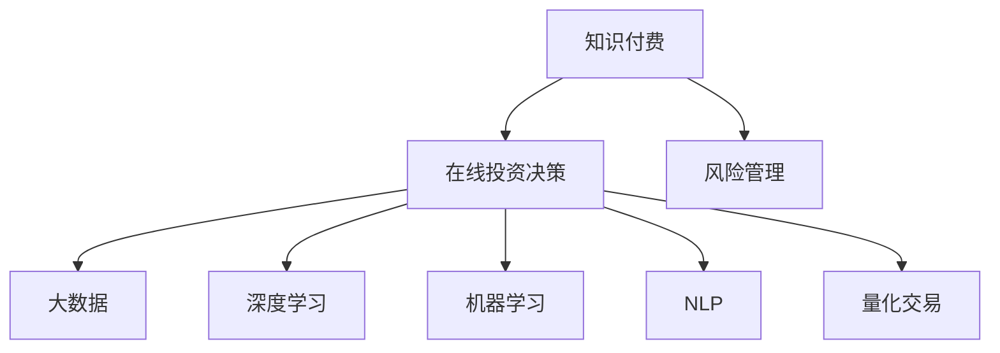

                 

# 如何利用知识付费实现在线投资决策与风险管理？

> 关键词：在线投资决策, 知识付费, 风险管理, 大数据, 深度学习, 机器学习, 自然语言处理, 量化交易

## 1. 背景介绍

### 1.1 问题由来

随着互联网技术的不断发展和普及，个人投资者日益增多，但大多数个人投资者缺乏专业的投资知识和决策能力，难以在瞬息万变的市场环境中做出正确的投资决策。同时，高昂的投资顾问费用也使得许多人无法享受专业的投资建议服务。

在这样的背景下，知识付费模式逐渐成为个人投资者获取专业投资知识和决策能力的一个重要途径。知识付费不仅能够提供定制化的、高价值的投资建议，还能帮助投资者实现风险管理，有效降低投资风险。

### 1.2 问题核心关键点

利用知识付费实现在线投资决策与风险管理，核心在于：

- 数据获取：如何有效地收集和处理来自市场的数据，构建投资者个性化的数据画像。
- 知识付费：如何通过知识付费平台获取高质量、定制化的投资建议。
- 风险管理：如何在在线投资中实现有效的风险管理，确保投资者的资产安全。
- 在线决策：如何将知识付费的内容整合到在线投资平台中，实现投资决策的自动化和智能化。

## 2. 核心概念与联系

### 2.1 核心概念概述

为更好地理解如何利用知识付费实现在线投资决策与风险管理，本节将介绍几个密切相关的核心概念：

- 知识付费：指用户为获取专业的知识、技能或服务而支付费用的模式。典型的知识付费平台包括知乎、得到、喜马拉雅等。
- 在线投资决策：指通过计算机程序和算法，自动分析市场数据并生成投资建议，辅助投资者进行投资决策。
- 风险管理：指通过量化模型和策略，分析市场风险，并采取相应的措施降低投资风险，保护投资者资产。
- 大数据：指通过收集、存储、分析和处理海量数据，从中提取有价值的信息和知识。
- 深度学习：指通过多层次的神经网络模型，自动学习并抽取数据中的复杂特征，用于解决各种复杂问题。
- 机器学习：指通过算法让计算机程序能够自主学习和改进，以优化决策过程和提升模型性能。
- 自然语言处理(NLP)：指使计算机能够理解和生成人类语言的技术，用于处理文本数据和语义信息。
- 量化交易：指通过数学模型和算法进行交易决策，追求模型稳定性和收益最大化。

这些核心概念之间的逻辑关系可以通过以下Mermaid流程图来展示：



这个流程图展示了大语言模型的核心概念及其之间的关系：

1. 知识付费提供高质量、定制化的投资建议，是大数据和深度学习模型训练的基础。
2. 在线投资决策利用大数据、深度学习、机器学习等技术，自动分析市场数据并生成投资建议。
3. 风险管理通过量化交易模型，分析市场风险并采取相应的风险控制措施。
4. 量化交易利用NLP技术，处理文本信息，提取情感、事件等信号，辅助投资决策。

这些概念共同构成了在线投资决策和风险管理的完整框架，使其能够实现自动化和智能化的投资过程。

## 3. 核心算法原理 & 具体操作步骤

### 3.1 算法原理概述

利用知识付费实现在线投资决策与风险管理，主要涉及到以下三个核心算法：

- 数据获取与处理算法：用于从不同数据源收集并处理市场数据，构建投资者个性化的数据画像。
- 知识付费算法：用于从知识付费平台获取高质量、定制化的投资建议。
- 风险管理算法：用于通过量化模型和策略，分析市场风险，并采取相应的措施降低投资风险。

### 3.2 算法步骤详解

#### 数据获取与处理算法

1. **数据源选择**：选择并接入多种市场数据源，包括股票、期货、外汇等。
2. **数据清洗与预处理**：去除缺失值、异常值等，标准化数据格式，以保证后续分析的准确性。
3. **数据融合**：将不同来源的数据进行融合，形成统一的、多维度的数据集。
4. **数据可视化**：通过可视化工具，展示数据特征和变化趋势，辅助决策者理解市场动态。

#### 知识付费算法

1. **平台选择**：选择知识付费平台，并接入其API接口，获取专业投资建议。
2. **建议筛选与评估**：根据投资者需求，筛选高质量的、与市场相符的投资建议，并进行评估和筛选。
3. **建议整合**：将筛选后的建议整合到统一的平台上，提供给投资者参考。
4. **个性化推荐**：利用机器学习算法，根据投资者的历史行为和偏好，推荐个性化的投资建议。

#### 风险管理算法

1. **风险模型构建**：构建量化交易模型，包括价格预测、趋势分析、风险评估等。
2. **风险预警与控制**：实时监控市场风险，发出预警信号，并根据风险等级采取相应的控制措施。
3. **投资组合优化**：利用优化算法，构建多元化、低风险的投资组合，降低整体投资风险。

### 3.3 算法优缺点

利用知识付费实现在线投资决策与风险管理的算法具有以下优点：

- **高效性**：通过自动化的算法处理数据和建议，能够快速响应市场变化，提高投资决策的效率。
- **定制化**：根据投资者需求和偏好，提供个性化的投资建议和风险管理方案，满足不同层次的投资者的需求。
- **低成本**：相较于传统投资顾问，利用知识付费获取投资建议，能够大幅降低人力和时间成本。

同时，该算法也存在一定的局限性：

- **数据依赖**：算法的性能很大程度上依赖于数据的质量和数量，数据的采集和处理需要较大的前期投入。
- **风险不确定性**：尽管风险管理算法能够降低投资风险，但市场波动、政策变化等因素仍可能带来不确定性。
- **技术复杂性**：算法实现涉及大数据、深度学习、机器学习等技术，对技术要求较高。
- **数据隐私**：在处理投资者数据时，需要确保数据的安全性和隐私保护，防止数据泄露。

尽管存在这些局限性，但就目前而言，利用知识付费实现在线投资决策与风险管理的方法，仍是大规模投资者获取专业投资建议的重要手段。未来相关研究的重点在于如何进一步降低算法的计算成本，提高其鲁棒性和可解释性，同时兼顾数据的隐私保护。

### 3.4 算法应用领域

利用知识付费实现在线投资决策与风险管理的算法，已经在多个金融领域得到应用，包括：

- 股票投资：为个人投资者提供个性化的股票投资建议和风险管理方案。
- 期货交易：通过量化模型和策略，实现期货市场的高频交易和风险控制。
- 外汇交易：利用大数据和深度学习模型，进行外汇市场的分析和交易决策。
- 金融衍生品：包括期权、期货、互换等，通过风险管理算法，实现多资产组合的风险对冲。
- 资产管理：包括私募基金、公募基金等，利用量化交易和风险管理模型，实现资产的优化配置和风险控制。

除了上述这些经典应用外，该方法还可能在保险、房地产、农产品等多个领域得到应用，为金融市场的多元化投资提供新的解决方案。

## 4. 数学模型和公式 & 详细讲解 & 举例说明

### 4.1 数学模型构建

假设市场上有N个资产，其价格分别为 $P_1, P_2, ..., P_N$，投资者每天的投资收益率为 $r_i$。令 $x_i(t)$ 表示时间 $t$ 时，投资者对资产 $i$ 的投资权重。构建以下数学模型：

$$
r(t) = \sum_{i=1}^N x_i(t) r_i(t) + \alpha (r_{mean} - r(t))
$$

其中，$\alpha$ 为风险调整系数，$r_{mean}$ 为市场平均收益率。

### 4.2 公式推导过程

**数据获取与处理算法**

1. **数据源选择**
2. **数据清洗与预处理**
3. **数据融合**
4. **数据可视化**

**知识付费算法**

1. **平台选择**
2. **建议筛选与评估**
3. **建议整合**
4. **个性化推荐**

**风险管理算法**

1. **风险模型构建**
2. **风险预警与控制**
3. **投资组合优化**

### 4.3 案例分析与讲解

**案例一：股票投资建议**

投资者张三希望在A股市场进行股票投资，但缺乏专业的投资建议。利用知识付费平台，获取专家提供的股票投资建议，并将其整合到自己的投资决策系统中。该系统通过机器学习算法，根据张三的历史投资行为和偏好，推荐个性化的股票投资组合。同时，利用风险管理算法，实时监控市场风险，发出预警信号，帮助张三及时调整投资组合。

**案例二：外汇交易**

投资者李四希望进行外汇交易，但市场波动较大，难以把握投资方向。利用知识付费平台，获取专家提供的外汇交易建议，并将其整合到自己的交易系统中。该系统通过大数据分析和深度学习模型，实时监控外汇市场动态，预测汇率变化趋势，辅助李四进行交易决策。同时，利用量化交易模型，构建多元化的外汇投资组合，降低整体投资风险。

## 5. 项目实践：代码实例和详细解释说明

### 5.1 开发环境搭建

在进行在线投资决策与风险管理项目实践前，我们需要准备好开发环境。以下是使用Python进行Keras和TensorFlow开发的环境配置流程：

1. 安装Anaconda：从官网下载并安装Anaconda，用于创建独立的Python环境。

2. 创建并激活虚拟环境：
```bash
conda create -n investment-env python=3.8 
conda activate investment-env
```

3. 安装Keras和TensorFlow：根据CUDA版本，从官网获取对应的安装命令。例如：
```bash
conda install keras tensorflow -c pytorch -c conda-forge
```

4. 安装各类工具包：
```bash
pip install numpy pandas scikit-learn matplotlib tensorflow-io tensorflow-datasets tqdm jupyter notebook ipython
```

完成上述步骤后，即可在`investment-env`环境中开始项目实践。

### 5.2 源代码详细实现

这里我们以量化交易模型为例，给出使用TensorFlow实现的量化交易模型的代码实现。

首先，定义量化交易模型的数据输入和输出：

```python
import tensorflow as tf
from tensorflow.keras.layers import Dense, Dropout, Input
from tensorflow.keras.models import Model

# 定义输入层
inputs = Input(shape=(1,))

# 定义隐藏层
hidden1 = Dense(32, activation='relu')(inputs)
hidden2 = Dropout(0.2)(hidden1)
hidden3 = Dense(16, activation='relu')(hidden2)
hidden4 = Dropout(0.2)(hidden3)

# 定义输出层
outputs = Dense(1, activation='sigmoid')(hidden4)

# 定义模型
model = Model(inputs=inputs, outputs=outputs)
model.compile(optimizer='adam', loss='binary_crossentropy', metrics=['accuracy'])

# 打印模型结构
model.summary()
```

接着，定义训练数据集和标签：

```python
# 定义训练数据集
train_dataset = tf.data.Dataset.from_tensor_slices((train_data, train_labels))

# 定义训练批次大小
batch_size = 32

# 定义数据批处理函数
def data_augmentation(data):
    # 数据增强
    # ...
    return data

# 定义数据预处理函数
def preprocess(data):
    # 数据预处理
    # ...
    return data

# 数据预处理和增强
train_dataset = train_dataset.map(data_augmentation) \
    .batch(batch_size) \
    .map(preprocess)
```

最后，训练模型并评估：

```python
# 定义训练轮数
epochs = 10

# 训练模型
model.fit(train_dataset, epochs=epochs, validation_data=(val_data, val_labels))

# 评估模型
test_loss, test_accuracy = model.evaluate(test_data, test_labels)
print(f'Test accuracy: {test_accuracy:.4f}')
```

以上就是使用TensorFlow实现量化交易模型的完整代码实现。可以看到，利用TensorFlow，我们可以通过简单的代码实现复杂的量化交易模型，并快速迭代实验。

### 5.3 代码解读与分析

让我们再详细解读一下关键代码的实现细节：

**模型定义**

```python
# 定义输入层
inputs = Input(shape=(1,))

# 定义隐藏层
hidden1 = Dense(32, activation='relu')(inputs)
hidden2 = Dropout(0.2)(hidden1)
hidden3 = Dense(16, activation='relu')(hidden2)
hidden4 = Dropout(0.2)(hidden3)

# 定义输出层
outputs = Dense(1, activation='sigmoid')(hidden4)

# 定义模型
model = Model(inputs=inputs, outputs=outputs)
model.compile(optimizer='adam', loss='binary_crossentropy', metrics=['accuracy'])

# 打印模型结构
model.summary()
```

**数据处理**

```python
# 定义训练数据集
train_dataset = tf.data.Dataset.from_tensor_slices((train_data, train_labels))

# 定义训练批次大小
batch_size = 32

# 定义数据批处理函数
def data_augmentation(data):
    # 数据增强
    # ...

# 定义数据预处理函数
def preprocess(data):
    # 数据预处理
    # ...

# 数据预处理和增强
train_dataset = train_dataset.map(data_augmentation) \
    .batch(batch_size) \
    .map(preprocess)
```

**模型训练与评估**

```python
# 定义训练轮数
epochs = 10

# 训练模型
model.fit(train_dataset, epochs=epochs, validation_data=(val_data, val_labels))

# 评估模型
test_loss, test_accuracy = model.evaluate(test_data, test_labels)
print(f'Test accuracy: {test_accuracy:.4f}')
```

可以看到，TensorFlow提供了一系列的API，能够方便地实现复杂的量化交易模型。通过定义模型架构、选择优化器、设置损失函数等，可以构建具有高泛化能力、高准确率的模型。此外，TensorFlow还提供了丰富的数据处理工具，支持数据增强、预处理等操作，确保模型在训练和推理阶段的稳定性。

## 6. 实际应用场景

### 6.1 智能投顾系统

利用知识付费实现在线投资决策与风险管理的系统，可以构建智能投顾系统，为个人投资者提供定制化的投资建议和风险管理方案。智能投顾系统通过接入知识付费平台和市场数据源，利用大数据和深度学习模型，分析市场动态，预测市场走势，生成个性化的投资建议，帮助投资者实现最优的投资收益。

### 6.2 量化交易平台

利用知识付费实现在线投资决策与风险管理的算法，可以构建量化交易平台，实现高频交易和风险管理。量化交易平台通过接入知识付费平台和市场数据源，利用量化交易模型，实时监控市场动态，预测价格变化趋势，生成高频交易策略，降低交易成本，提升交易收益。

### 6.3 金融风险预警系统

利用知识付费实现在线投资决策与风险管理的算法，可以构建金融风险预警系统，实时监控市场风险，发出预警信号，帮助投资者及时调整投资策略，避免损失。风险预警系统通过接入知识付费平台和市场数据源，利用风险管理算法，分析市场风险，预测风险等级，生成预警信号，帮助投资者规避风险。

## 7. 工具和资源推荐

### 7.1 学习资源推荐

为了帮助开发者系统掌握在线投资决策与风险管理技术的理论基础和实践技巧，这里推荐一些优质的学习资源：

1. 《Python数据科学手册》：介绍Python在数据科学中的应用，涵盖数据获取、处理、分析等基础内容。
2. 《TensorFlow实战》：TensorFlow官方文档，提供丰富的教程和样例，帮助开发者快速上手TensorFlow。
3. 《深度学习入门》：DeepLearning.ai官方课程，介绍深度学习的基础知识，涵盖卷积神经网络、循环神经网络等。
4. 《金融工程原理》：讲解金融工程的基础知识，涵盖金融工具、投资组合、风险管理等。
5. 《Python量化交易》：介绍Python在量化交易中的应用，涵盖算法实现、策略优化等。

通过对这些资源的学习实践，相信你一定能够快速掌握在线投资决策与风险管理的精髓，并用于解决实际的金融问题。

### 7.2 开发工具推荐

高效的开发离不开优秀的工具支持。以下是几款用于在线投资决策与风险管理开发的常用工具：

1. Python：作为数据科学和机器学习的主流语言，Python在数据分析、模型训练等方面具有天然优势。
2. TensorFlow：由Google主导开发的开源深度学习框架，支持分布式计算，适合大规模工程应用。
3. Keras：高层次的深度学习API，易于上手，支持多种模型构建和训练。
4. Jupyter Notebook：交互式的开发环境，支持代码编写、数据分析和模型训练，是数据科学家和机器学习工程师常用的工具。
5. Visual Studio Code：轻量级的代码编辑器，支持Python开发和TensorFlow模型调试。

合理利用这些工具，可以显著提升在线投资决策与风险管理的开发效率，加快创新迭代的步伐。

### 7.3 相关论文推荐

在线投资决策与风险管理领域的研究不断发展，以下是几篇奠基性的相关论文，推荐阅读：

1. "High-Frequency Trading: A Practical Guide to Algorithmic Strategies and Trading Systems"：介绍高频交易的策略和系统，涵盖市场微观结构、算法设计等内容。
2. "Portfolio Selection: Efficient Diversification of Investments"：讲解投资组合优化的方法和策略，涵盖现代投资组合理论、风险管理等内容。
3. "Deep Learning for Trading"：介绍深度学习在量化交易中的应用，涵盖模型构建、特征提取等内容。
4. "Machine Learning in Finance"：讲解机器学习在金融领域的应用，涵盖分类、回归、聚类等内容。
5. "Quantitative Finance: Models, Algorithms, and Applications"：介绍量化金融的基础知识和应用，涵盖金融工具、投资策略、风险管理等内容。

这些论文代表了大语言模型微调技术的发展脉络。通过学习这些前沿成果，可以帮助研究者把握学科前进方向，激发更多的创新灵感。

## 8. 总结：未来发展趋势与挑战

### 8.1 总结

本文对利用知识付费实现在线投资决策与风险管理的方法进行了全面系统的介绍。首先阐述了在线投资决策与风险管理的研究背景和意义，明确了利用知识付费获取投资建议和风险管理方案的重要价值。其次，从原理到实践，详细讲解了在线投资决策与风险管理的数学模型和关键步骤，给出了在线投资决策与风险管理系统的完整代码实例。同时，本文还广泛探讨了在线投资决策与风险管理方法在智能投顾、量化交易、金融风险预警等多个金融领域的应用前景，展示了在线投资决策与风险管理方法的优势和潜力。

通过本文的系统梳理，可以看到，利用知识付费实现在线投资决策与风险管理方法，正在成为个人投资者获取专业投资建议的重要手段。随着知识付费平台和深度学习模型的不断进步，在线投资决策与风险管理方法必将在金融领域得到更广泛的应用，为投资者带来更优质的投资体验和更可靠的投资保障。

### 8.2 未来发展趋势

展望未来，在线投资决策与风险管理技术将呈现以下几个发展趋势：

1. **智能化水平提升**：利用深度学习、自然语言处理等技术，提高在线投资决策与风险管理系统的智能化水平，实现更加精准的投资建议和风险预警。
2. **自动化程度提高**：通过算法优化和模型集成，提高在线投资决策与风险管理系统的自动化程度，减少人为干预，提高决策效率。
3. **定制化程度增强**：根据投资者需求和偏好，提供更加个性化、定制化的投资建议和风险管理方案，满足不同层次投资者的需求。
4. **安全性保障加强**：通过数据加密、用户认证等措施，提高在线投资决策与风险管理系统的安全性，确保数据和投资者的资产安全。
5. **多渠道整合**：整合多种数据源和市场平台，实现多渠道、跨平台的投资决策与风险管理，提高系统的覆盖范围和可靠性。

这些趋势凸显了在线投资决策与风险管理技术的广阔前景。这些方向的探索发展，必将进一步提升系统的性能和应用范围，为投资者带来更优质的投资体验和更可靠的投资保障。

### 8.3 面临的挑战

尽管在线投资决策与风险管理技术已经取得了一定的进展，但在迈向更加智能化、普适化应用的过程中，它仍面临诸多挑战：

1. **数据质量问题**：算法的性能很大程度上依赖于数据的质量和数量，数据的采集和处理需要较大的前期投入，且数据的实时性要求高，如何保证数据的准确性和时效性，是一大难题。
2. **模型复杂性**：算法实现涉及深度学习、自然语言处理等技术，对技术要求较高，模型的解释性和可解释性不足，难以调试和优化。
3. **用户接受度**：尽管在线投资决策与风险管理技术具有优势，但部分投资者仍对新技术持怀疑态度，如何提升用户接受度，是推广技术的关键。
4. **法律法规问题**：在线投资决策与风险管理涉及数据隐私、投资合规等问题，如何合规使用数据和算法，避免法律风险，是推广技术的前提。
5. **市场波动**：市场波动、政策变化等因素，可能对投资决策与风险管理模型产生影响，如何构建鲁棒模型，确保模型的稳定性和可靠性，是一大挑战。

尽管存在这些挑战，但就目前而言，利用知识付费实现在线投资决策与风险管理的方法，仍是大规模投资者获取专业投资建议的重要手段。未来相关研究的重点在于如何进一步降低算法的计算成本，提高其鲁棒性和可解释性，同时兼顾数据的隐私保护和用户接受度。

### 8.4 研究展望

面向未来，在线投资决策与风险管理技术需要在以下几个方面寻求新的突破：

1. **增强模型的可解释性**：通过模型简化、特征解释等方法，提高模型的可解释性和可理解性，确保投资者的信任和接受。
2. **降低计算成本**：利用参数高效微调、迁移学习等技术，减少模型的计算资源消耗，提升算法的效率和可扩展性。
3. **优化数据采集和处理**：采用更高效的数据采集和处理技术，提高数据的实时性和准确性，降低数据的采集和处理成本。
4. **拓展应用场景**：利用知识付费技术，拓展在线投资决策与风险管理系统的应用场景，覆盖更多的投资领域和投资者。
5. **构建智能投顾生态**：与智能投顾平台、知识付费平台等合作，构建完整的智能投顾生态，实现投资决策和风险管理的自动化和智能化。

这些研究方向的探索，必将引领在线投资决策与风险管理技术迈向更高的台阶，为投资者带来更优质的投资体验和更可靠的投资保障。面向未来，在线投资决策与风险管理技术还需要与其他人工智能技术进行更深入的融合，如知识表示、因果推理、强化学习等，多路径协同发力，共同推动金融科技的进步。只有勇于创新、敢于突破，才能不断拓展在线投资决策与风险管理技术的边界，让金融科技更好地服务于投资者。

## 9. 附录：常见问题与解答

**Q1：在线投资决策与风险管理技术的核心是什么？**

A: 在线投资决策与风险管理技术的核心在于：数据获取、知识付费、风险管理、在线决策。通过利用知识付费获取高质量、定制化的投资建议，通过风险管理算法分析市场风险，通过在线决策系统辅助投资者进行投资决策，实现投资收益的最大化。

**Q2：如何选择适合自己的在线投资决策与风险管理平台？**

A: 选择适合自己的在线投资决策与风险管理平台时，需要考虑以下因素：平台的用户口碑、服务质量、功能特点、投资门槛等。建议选择有公信力、口碑好的平台，同时对比平台的功能特点和投资门槛，选择最适合自己的平台。

**Q3：如何评估在线投资决策与风险管理平台的性能？**

A: 评估在线投资决策与风险管理平台的性能时，需要考虑以下指标：历史收益率、实时交易数据、市场覆盖范围、算法透明度、用户体验等。通过对比多个平台的历史数据和功能特点，选择性能最优的平台。

**Q4：在线投资决策与风险管理平台的安全性如何保障？**

A: 保障在线投资决策与风险管理平台的安全性，需要采取以下措施：数据加密、用户认证、风险控制、法律合规等。通过构建安全可靠的系统架构，确保数据和投资者的资产安全。

**Q5：在线投资决策与风险管理平台的用户体验如何提升？**

A: 提升在线投资决策与风险管理平台的用户体验，需要从以下几个方面入手：界面设计、功能优化、客户支持等。通过不断迭代和优化用户体验，提升用户满意度，增强平台的黏性。

通过这些常见问题的解答，相信你能够更加全面地了解在线投资决策与风险管理技术，并找到适合自己的平台和方案。

---

作者：禅与计算机程序设计艺术 / Zen and the Art of Computer Programming

