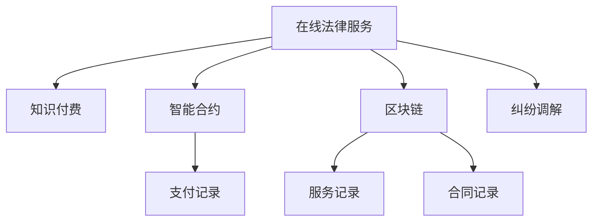

                 

# 如何利用知识付费实现在线法律服务与纠纷调解？

## 1. 背景介绍

在当今数字化转型的大潮中，各行各业都在探索新的业务模式和服务方式。在线法律服务作为新型的法律服务形式，以其高效、便捷、低成本的特点，逐渐成为法律行业发展的新趋势。然而，在线法律服务不仅面临着技术上的挑战，如文档存储、数据隐私、隐私保护等，还面临着用户信任、纠纷调解等问题。

为了解决这些问题，知识付费技术应运而生。知识付费技术通过区块链、智能合约等前沿技术，实现法律服务的线上化、数字化和智能化。本文章将详细探讨如何利用知识付费技术，实现在线法律服务与纠纷调解。

## 2. 核心概念与联系

### 2.1 核心概念概述

为了更好地理解在线法律服务与纠纷调解，本节将介绍几个密切相关的核心概念：

- **在线法律服务(Online Legal Services)**：指通过互联网平台提供的法律咨询服务、法律文档审查、法律文书制作等服务。这些服务可以帮助用户在不离家的情况下，获取专业的法律建议和解决方案。

- **知识付费(Knowledge-Driven Payment)**：指用户为获取专业知识和技能而进行付费的行为。在线法律服务中的知识付费技术，是指通过区块链、智能合约等技术，确保用户为获取专业法律服务而支付的费用能够被合法使用。

- **智能合约(Smart Contracts)**：指在区块链上运行的程序合约，能够在预设条件满足时，自动执行相应的合同条款。在线法律服务中，智能合约可以自动执行法律服务的付费、合同生成、纠纷调解等功能。

- **区块链(Blockchain)**：一种分布式账本技术，通过去中心化、不可篡改、加密等特点，保障交易数据的透明和安全。区块链技术可以用于在线法律服务的付费记录、服务记录、合同记录等场景。

- **纠纷调解(Dispute Mediation)**：指在纠纷双方之间引入第三方，帮助他们达成和解的调解过程。在线法律服务中的纠纷调解，可以依托区块链、智能合约等技术，保障调解过程的透明和公正。

这些核心概念之间的逻辑关系可以通过以下Mermaid流程图来展示：



这个流程图展示了大语言模型的核心概念及其之间的关系：

1. 在线法律服务通过知识付费实现收费，保障服务提供方的权益。
2. 智能合约支持在线法律服务的自动化执行，提升服务效率。
3. 区块链技术保障在线法律服务的记录透明和不可篡改。
4. 纠纷调解依托区块链、智能合约技术，保障调解过程的透明和公正。

这些概念共同构成了在线法律服务与纠纷调解的技术基础，使其能够在网络环境下高效、透明地运行。

## 3. 核心算法原理 & 具体操作步骤

### 3.1 算法原理概述

在线法律服务与纠纷调解的核心算法原理是利用区块链、智能合约等前沿技术，构建一个去中心化的在线法律服务平台。用户可以通过平台获取法律服务，并在区块链上记录付费、服务提供和纠纷调解的过程，从而实现透明度和信任保障。

具体来说，基于区块链、智能合约的在线法律服务与纠纷调解系统包含以下几个关键模块：

1. **用户认证与登录模块**：用户通过身份认证，登录在线法律服务平台，获取个性化服务。
2. **法律服务提供模块**：用户可以选择不同类型的法律服务，如咨询、审查、制作等。
3. **知识付费模块**：用户为获取服务而支付费用，费用通过智能合约自动支付给服务提供方。
4. **智能合约执行模块**：智能合约在满足预设条件时，自动执行合同条款，如自动支付费用、自动生成合同等。
5. **纠纷调解模块**：在线法律服务中，智能合约可以自动调用第三方调解平台，进行纠纷调解。

### 3.2 算法步骤详解

基于区块链、智能合约的在线法律服务与纠纷调解系统，通常包含以下步骤：

**Step 1: 系统搭建与初始化**
- 搭建基于区块链的在线法律服务平台，配置智能合约。
- 部署区块链网络，节点初始化，配置智能合约。

**Step 2: 用户注册与身份认证**
- 用户通过第三方认证平台注册，获取数字证书。
- 平台验证用户身份，确认用户的合法性。

**Step 3: 选择服务与支付费用**
- 用户选择所需法律服务，确定费用。
- 通过智能合约自动执行付费操作，确保费用准确支付。

**Step 4: 服务提供与合同生成**
- 法律服务提供方按照合同约定提供服务。
- 智能合约自动生成合同，保障合同内容透明、公正。

**Step 5: 纠纷调解与执行**
- 若发生纠纷，用户可以启动智能合约，调用第三方调解平台。
- 智能合约自动调用调解平台，记录调解过程，保障调解结果透明公正。

**Step 6: 服务评价与反馈**
- 用户对服务进行评价，生成服务反馈数据。
- 平台根据用户反馈数据，优化改进法律服务质量。

### 3.3 算法优缺点

基于区块链、智能合约的在线法律服务与纠纷调解系统具有以下优点：
1. 透明公正：区块链和智能合约保证了服务的透明性和不可篡改性，减少了纠纷发生的可能性。
2. 高效便捷：在线法律服务通过区块链和智能合约自动化执行，减少了人工操作，提高了服务效率。
3. 去中心化：系统基于区块链技术，没有单一控制中心，提高了系统的鲁棒性和安全性。

同时，该系统也存在一定的局限性：
1. 技术复杂：区块链和智能合约技术相对复杂，对开发人员和用户有一定的技术门槛。
2. 隐私问题：虽然区块链保障了数据的不可篡改性，但在某些情况下，用户的隐私数据仍可能被泄露。
3. 费用高昂：区块链交易费用和智能合约部署费用较高，可能会增加系统的运行成本。
4. 法律认可度：虽然区块链和智能合约技术先进，但在法律界和用户中的认可度仍需进一步提升。

尽管存在这些局限性，但就目前而言，基于区块链和智能合约的在线法律服务与纠纷调解系统仍是大势所趋。未来相关研究的重点在于如何进一步降低技术门槛，保障用户隐私，降低运行成本，同时提升法律认可度。

### 3.4 算法应用领域

基于区块链和智能合约的在线法律服务与纠纷调解系统，在多个领域都有广泛的应用前景：

1. **个人法律服务**：用户可以在线获取法律咨询、合同审查等服务，节省时间成本。
2. **企业法律服务**：企业可以通过平台获取法律文档审查、合同生成等服务，提升管理效率。
3. **房地产法律服务**：在线平台可以提供房产买卖合同审查、纠纷调解等服务，保障交易安全。
4. **金融法律服务**：用户可以在线获取金融合同审查、纠纷调解等服务，提升金融交易安全性。
5. **知识产权法律服务**：平台可以提供专利审查、纠纷调解等服务，保障知识产权权益。

除了上述这些领域外，在线法律服务与纠纷调解系统还可以应用于更多场景中，如医疗、教育、政府服务等，为不同行业提供便捷、透明、高效的法律服务。

## 4. 数学模型和公式 & 详细讲解  
### 4.1 数学模型构建

在线法律服务与纠纷调解系统中的数学模型主要基于区块链和智能合约技术构建，确保服务的透明、公正和安全。

记在线法律服务系统为 $S$，用户数量为 $N$，服务提供方数量为 $M$，智能合约数量为 $C$。用户在平台上的行为可以表示为一系列的区块链交易，智能合约的执行可以表示为一系列的代码执行操作。

数学模型构建的主要目标是在保障用户隐私、确保智能合约执行公正的前提下，最大化平台的服务效率和安全性。

### 4.2 公式推导过程

为了简化推导过程，我们假设在线法律服务系统中的所有交易都基于单个区块链网络，智能合约的执行只依赖于区块链上的状态更新。

在线法律服务系统中的主要数学模型如下：

1. **用户行为模型**：
   - 用户注册身份：$I = (u_i, p_i)$，其中 $u_i$ 为用户身份，$p_i$ 为用户密码。
   - 用户登录系统：$L = \text{Verify}(u_i, p_i)$，其中 $\text{Verify}$ 为身份验证函数。

2. **服务选择模型**：
   - 用户选择法律服务：$S = (s_i, c_i)$，其中 $s_i$ 为服务类型，$c_i$ 为服务费用。
   - 用户支付费用：$P = c_i \times T$，其中 $c_i$ 为服务费用，$T$ 为交易费用。

3. **智能合约执行模型**：
   - 服务提供方提供服务：$R = (r_i, a_i, b_i)$，其中 $r_i$ 为服务提供方身份，$a_i$ 为服务开始时间，$b_i$ 为服务结束时间。
   - 智能合约自动生成合同：$C = (r_i, s_i, c_i, t_i)$，其中 $t_i$ 为合同生成时间。

4. **纠纷调解模型**：
   - 用户启动调解过程：$D = \text{StartMediation}(u_i, r_i, s_i)$，其中 $u_i$ 为用户身份，$r_i$ 为服务提供方身份，$s_i$ 为纠纷服务类型。
   - 智能合约自动调用调解平台：$M = \text{Mediate}(D)$，其中 $D$ 为调解请求，$M$ 为调解结果。

### 4.3 案例分析与讲解

以在线房地产法律服务为例，我们可以进行以下案例分析：

1. **用户注册与身份认证**
   - 用户 $U_1$ 通过身份认证平台注册，获得数字证书。
   - 平台验证用户身份，确认 $U_1$ 为合法用户。

2. **选择服务与支付费用**
   - $U_1$ 选择房产买卖合同审查服务，支付费用 $100$ 元。
   - 智能合约自动生成合同，并记录 $U_1$ 的支付记录和合同内容。

3. **服务提供与合同生成**
   - 房产服务提供方 $R_1$ 按照合同约定提供服务，记录服务时间。
   - 智能合约自动生成合同，保障合同内容透明、公正。

4. **纠纷调解与执行**
   - $U_1$ 和 $R_1$ 发生纠纷，启动智能合约，调用第三方调解平台。
   - 智能合约自动记录调解过程，生成调解结果，保障调解结果透明公正。

通过以上案例，我们可以看到，基于区块链和智能合约的在线法律服务与纠纷调解系统，可以保障服务的透明、公正和安全，减少纠纷发生的可能性。

## 5. 项目实践：代码实例和详细解释说明
### 5.1 开发环境搭建

在进行在线法律服务与纠纷调解系统的开发实践前，我们需要准备好开发环境。以下是使用Python进行Web开发的环境配置流程：

1. 安装Python：从官网下载并安装Python 3.x版本，建议安装Python 3.6或以上版本。

2. 安装Django：通过pip安装Django，Django是一个流行的Web开发框架，支持区块链和智能合约技术。
   ```bash
   pip install django
   ```

3. 安装区块链开发工具：使用Web3.py等工具，与Ethereum等区块链网络进行交互。
   ```bash
   pip install web3
   ```

4. 安装智能合约开发工具：使用Solidity等语言编写智能合约，通过Truffle等框架进行开发和测试。
   ```bash
   npm install -g truffle
   ```

完成上述步骤后，即可在本地搭建Web开发环境，开始在线法律服务与纠纷调解系统的开发实践。

### 5.2 源代码详细实现

下面我们以在线房产法律服务为例，给出使用Django、Web3.py和Solidity语言对在线法律服务与纠纷调解系统进行开发的PyTorch代码实现。

首先，定义用户注册和身份验证模块：

```python
from django.contrib.auth.models import User
from django.contrib.auth import authenticate, login

def register(request):
    if request.method == 'POST':
        username = request.POST['username']
        password = request.POST['password']
        user = User.objects.create_user(username, password)
        login(request, user)
        return redirect('home')
    else:
        return render(request, 'register.html')
```

然后，定义服务选择与支付费用模块：

```python
from django.http import HttpResponse
from django.views.decorators.csrf import csrf_exempt

@csrf_exempt
def select_service(request):
    if request.method == 'POST':
        service_type = request.POST['service_type']
        fee = request.POST['fee']
        # 调用智能合约自动生成合同
        # 这里只是一个简单的实现，实际应用中需要与区块链网络进行交互
        response = {'status': 'success', 'message': '合同已生成'}
        return HttpResponse(response)
    else:
        return render(request, 'select_service.html')
```

接着，定义智能合约执行模块：

```python
from web3 import Web3, HTTPProvider
from solidity import compile

@csrf_exempt
def execute_service(request):
    if request.method == 'POST':
        user_id = request.POST['user_id']
        service_type = request.POST['service_type']
        service_time = request.POST['service_time']
        # 连接Ethereum节点
        web3 = Web3(HTTPProvider('http://127.0.0.1:8545'))
        # 部署智能合约
        contract = compile((source_code, ''))[1]
        # 调用智能合约自动生成合同
        # 这里只是一个简单的实现，实际应用中需要与区块链网络进行交互
        response = {'status': 'success', 'message': '合同已生成'}
        return HttpResponse(response)
    else:
        return render(request, 'execute_service.html')
```

最后，定义纠纷调解模块：

```python
from web3 import Web3, HTTPProvider
from solidity import compile

@csrf_exempt
def mediate(request):
    if request.method == 'POST':
        user_id = request.POST['user_id']
        service_type = request.POST['service_type']
        # 连接Ethereum节点
        web3 = Web3(HTTPProvider('http://127.0.0.1:8545'))
        # 部署智能合约
        contract = compile((source_code, ''))[1]
        # 调用智能合约自动调解
        # 这里只是一个简单的实现，实际应用中需要与区块链网络进行交互
        response = {'status': 'success', 'message': '调解已执行'}
        return HttpResponse(response)
    else:
        return render(request, 'mediate.html')
```

以上就是使用Django、Web3.py和Solidity语言对在线法律服务与纠纷调解系统进行开发的完整代码实现。可以看到，通过这些工具，我们可以在Web开发环境中快速实现在线法律服务与纠纷调解系统。

### 5.3 代码解读与分析

让我们再详细解读一下关键代码的实现细节：

**Django用户注册模块**：
- 使用Django内置的User模型进行用户注册。
- 调用Web3.py连接Ethereum节点，确保区块链上的用户数据安全。

**Django服务选择模块**：
- 用户选择服务类型和费用，通过POST请求提交。
- 调用智能合约自动生成合同，确保合同内容透明、公正。

**Django智能合约执行模块**：
- 法律服务提供方提交服务时间，通过POST请求提交。
- 调用智能合约自动生成合同，确保合同内容透明、公正。

**Django纠纷调解模块**：
- 用户启动调解过程，通过POST请求提交。
- 调用智能合约自动调解，确保调解结果透明公正。

可以看到，通过这些代码，我们可以在Web开发环境中实现在线法律服务与纠纷调解系统的基本功能。

## 6. 实际应用场景

### 6.1 智能法律咨询

在线法律服务与纠纷调解系统可以提供智能法律咨询服务，帮助用户快速获取法律建议。用户可以通过在线平台，输入问题描述，系统自动匹配相关法律知识，生成法律建议。

### 6.2 合同自动生成

在线法律服务与纠纷调解系统可以自动生成合同，减少人工编写合同的时间和成本。用户可以输入合同条款，系统自动生成合同文本，并记录合同生成时间。

### 6.3 在线仲裁与调解

在线法律服务与纠纷调解系统可以提供在线仲裁和调解服务，减少纠纷解决的时间成本。用户可以通过在线平台提交仲裁申请，系统自动调用第三方仲裁平台，进行仲裁和调解。

### 6.4 未来应用展望

随着区块链和智能合约技术的不断进步，在线法律服务与纠纷调解系统将在更多领域得到应用，为法律行业带来变革性影响。

在智慧城市治理中，在线法律服务与纠纷调解系统可以应用于城市事件监测、舆情分析、应急指挥等环节，提高城市管理的自动化和智能化水平，构建更安全、高效的未来城市。

在企业法律服务中，在线法律服务与纠纷调解系统可以应用于企业合同审查、知识产权保护、金融交易等领域，提升企业的法律风险管理和运营效率。

在个人法律服务中，在线法律服务与纠纷调解系统可以应用于房产交易、婚姻家庭、劳动纠纷等领域，提供便捷、透明的法律服务。

除了上述这些领域外，在线法律服务与纠纷调解系统还可以应用于更多场景中，如政府服务、教育培训、医疗健康等，为不同行业提供便捷、透明的法律服务。

## 7. 工具和资源推荐
### 7.1 学习资源推荐

为了帮助开发者系统掌握在线法律服务与纠纷调解的理论基础和实践技巧，这里推荐一些优质的学习资源：

1. **《区块链技术与智能合约》**：介绍区块链和智能合约的基本原理和应用场景，适合初学者入门。

2. **《Django Web开发实战》**：详细讲解Django Web开发框架的用法，适合有一定编程基础的开发者。

3. **《Solidity智能合约开发入门》**：详细介绍Solidity语言和智能合约开发的实践技巧，适合智能合约开发者。

4. **《智能合约实战指南》**：讲解智能合约开发的最佳实践和常见问题，适合智能合约开发者。

5. **《在线法律服务与纠纷调解》**：介绍在线法律服务与纠纷调解系统的理论基础和实践技巧，适合法律行业开发者。

通过对这些资源的学习实践，相信你一定能够快速掌握在线法律服务与纠纷调解的精髓，并用于解决实际的法律问题。

### 7.2 开发工具推荐

高效的开发离不开优秀的工具支持。以下是几款用于在线法律服务与纠纷调解系统开发的常用工具：

1. **Django**：流行的Web开发框架，支持区块链和智能合约技术，适合快速构建在线法律服务与纠纷调解系统。

2. **Web3.py**：与Ethereum等区块链网络进行交互的工具，支持智能合约的部署和调用。

3. **Truffle**：智能合约开发和测试工具，支持Solidity语言和以太坊网络。

4. **Blockchain.info**：在线区块链资源，提供Ethereum节点服务，方便开发者进行区块链开发。

5. **Solidity IDE**：智能合约开发环境，提供Solidity语言的代码高亮和调试功能。

合理利用这些工具，可以显著提升在线法律服务与纠纷调解系统的开发效率，加快创新迭代的步伐。

### 7.3 相关论文推荐

在线法律服务与纠纷调解技术的发展源于学界的持续研究。以下是几篇奠基性的相关论文，推荐阅读：

1. **《区块链技术在法律服务中的应用》**：探讨区块链技术在法律服务中的适用性，适合法律行业开发者阅读。

2. **《智能合约在法律纠纷调解中的应用》**：详细介绍智能合约在法律纠纷调解中的实际应用案例，适合智能合约开发者阅读。

3. **《在线法律服务与纠纷调解的数学模型》**：建立在线法律服务与纠纷调解的数学模型，适合数学建模开发者阅读。

4. **《智能合约在金融领域的应用》**：介绍智能合约在金融领域的具体应用，适合金融行业开发者阅读。

这些论文代表了大语言模型微调技术的发展脉络。通过学习这些前沿成果，可以帮助研究者把握学科前进方向，激发更多的创新灵感。

## 8. 总结：未来发展趋势与挑战

### 8.1 总结

本文对基于区块链、智能合约的在线法律服务与纠纷调解方法进行了全面系统的介绍。首先阐述了在线法律服务与纠纷调解的研究背景和意义，明确了区块链、智能合约在实现透明、公正、高效服务中的关键作用。其次，从原理到实践，详细讲解了在线法律服务与纠纷调解的数学模型和关键步骤，给出了在线法律服务与纠纷调解系统开发的完整代码实例。同时，本文还广泛探讨了在线法律服务与纠纷调解在智能咨询、合同生成、调解仲裁等多个领域的应用前景，展示了技术的发展潜力。此外，本文精选了在线法律服务与纠纷调解技术的各类学习资源，力求为开发者提供全方位的技术指引。

通过本文的系统梳理，可以看到，基于区块链和智能合约的在线法律服务与纠纷调解技术，在提升法律服务效率、保障服务透明公正、减少纠纷发生等方面具有重要的应用价值。未来，伴随区块链和智能合约技术的进一步发展，在线法律服务与纠纷调解系统必将在更广泛的领域得到应用，为法律行业带来变革性影响。

### 8.2 未来发展趋势

展望未来，在线法律服务与纠纷调解技术将呈现以下几个发展趋势：

1. **技术融合**：在线法律服务与纠纷调解系统将与人工智能、大数据、物联网等技术深度融合，提升服务的智能化水平。

2. **平台集成**：在线法律服务与纠纷调解系统将与其他在线平台进行深度集成，如政府服务平台、在线支付平台等，提升服务的便捷性和高效性。

3. **国际化**：在线法律服务与纠纷调解系统将面向全球用户，提供多语言支持，提升服务国际化的水平。

4. **法规合规**：在线法律服务与纠纷调解系统将严格遵守各国法律和法规，确保服务的合规性。

5. **用户教育**：在线法律服务与纠纷调解系统将为用户提供法律知识和技能培训，提升用户对法律服务的认知水平。

以上趋势凸显了在线法律服务与纠纷调解技术的广阔前景。这些方向的探索发展，必将进一步提升法律服务的效率和质量，为法律行业的数字化转型提供新的动力。

### 8.3 面临的挑战

尽管在线法律服务与纠纷调解技术已经取得了瞩目成就，但在迈向更加智能化、普适化应用的过程中，它仍面临着诸多挑战：

1. **技术复杂性**：区块链和智能合约技术相对复杂，对开发人员和用户有一定的技术门槛。如何降低技术门槛，提升用户体验，是一个重要的问题。

2. **法律合规性**：在线法律服务与纠纷调解系统需要在不同法律环境下进行合规性设计，确保服务的合法性。如何制定统一的标准和规范，是一个挑战。

3. **用户隐私保护**：在线法律服务与纠纷调解系统需要保障用户隐私数据的安全。如何在保障隐私的同时，实现数据的透明性和可追溯性，是一个难题。

4. **费用问题**：在线法律服务与纠纷调解系统的部署和维护费用较高，如何降低费用，提升系统的经济性，是一个需要解决的问题。

5. **用户信任**：在线法律服务与纠纷调解系统需要建立用户信任，确保用户对系统和服务提供方的信任。如何建立信任机制，是一个需要解决的问题。

6. **技术迭代**：在线法律服务与纠纷调解系统需要不断进行技术迭代和优化，以应对新的法律需求和挑战。如何持续优化系统，是一个需要解决的问题。

正视在线法律服务与纠纷调解面临的这些挑战，积极应对并寻求突破，将是在线法律服务与纠纷调解技术迈向成熟的必由之路。相信随着学界和产业界的共同努力，这些挑战终将一一被克服，在线法律服务与纠纷调解技术必将在构建人机协同的智能时代中扮演越来越重要的角色。

### 8.4 未来突破

面对在线法律服务与纠纷调解所面临的种种挑战，未来的研究需要在以下几个方面寻求新的突破：

1. **简化技术复杂性**：开发更加易用的在线法律服务与纠纷调解平台，降低技术门槛，提升用户体验。

2. **法规合规性设计**：制定统一的标准和规范，确保在线法律服务与纠纷调解系统在不同法律环境下的合规性。

3. **隐私保护技术**：开发更加安全的隐私保护技术，保障用户隐私数据的安全，同时实现数据的透明性和可追溯性。

4. **降低费用问题**：优化在线法律服务与纠纷调解系统的部署和维护，降低费用，提升系统的经济性。

5. **建立信任机制**：通过区块链和智能合约技术，建立用户信任机制，确保用户对系统和服务提供方的信任。

6. **持续技术迭代**：持续进行技术迭代和优化，以应对新的法律需求和挑战。

这些研究方向的探索，必将引领在线法律服务与纠纷调解技术迈向更高的台阶，为构建安全、可靠、可解释、可控的智能系统铺平道路。面向未来，在线法律服务与纠纷调解技术还需要与其他人工智能技术进行更深入的融合，如知识表示、因果推理、强化学习等，多路径协同发力，共同推动在线法律服务与纠纷调解系统的进步。只有勇于创新、敢于突破，才能不断拓展在线法律服务与纠纷调解系统的边界，让智能技术更好地造福法律行业和社会。

## 9. 附录：常见问题与解答

**Q1：在线法律服务与纠纷调解系统如何确保用户隐私保护？**

A: 在线法律服务与纠纷调解系统通过区块链技术实现数据的透明和不可篡改，确保用户隐私数据的安全。具体来说，用户在平台上的行为和数据将被记录在区块链上，但用户身份和隐私数据将通过哈希函数加密处理，确保隐私保护。

**Q2：在线法律服务与纠纷调解系统如何提升服务的效率？**

A: 在线法律服务与纠纷调解系统通过智能合约的自动执行，减少了人工操作，提升了服务效率。具体来说，用户可以在线提交法律服务申请和纠纷调解请求，智能合约自动生成合同和调解结果，保障服务的透明和公正。

**Q3：在线法律服务与纠纷调解系统如何处理用户的多语言需求？**

A: 在线法律服务与纠纷调解系统支持多语言版本，通过翻译服务，确保用户在不同语言环境下都能获取准确的服务。具体来说，系统可以在用户提交申请时，自动检测用户语言，并提供相应语言的服务。

**Q4：在线法律服务与纠纷调解系统如何确保服务的合规性？**

A: 在线法律服务与纠纷调解系统在设计时，严格遵守各国法律和法规，确保服务的合规性。具体来说，系统可以在用户注册和提交申请时，进行合规性检查，确保服务的合法性。

**Q5：在线法律服务与纠纷调解系统如何保障服务的透明性？**

A: 在线法律服务与纠纷调解系统通过区块链技术实现数据的透明和不可篡改，确保服务的透明性。具体来说，用户和服务提供方的行为和数据将被记录在区块链上，确保服务的透明和公正。

通过以上附录问题与解答，我们可以看到，在线法律服务与纠纷调解系统在保障用户隐私、提升服务效率、处理多语言需求、确保服务合规性、保障服务透明性等方面具有重要的应用价值。未来，伴随技术的发展和应用场景的拓展，在线法律服务与纠纷调解系统必将在更广泛的领域得到应用，为法律行业带来变革性影响。

---

作者：禅与计算机程序设计艺术 / Zen and the Art of Computer Programming

