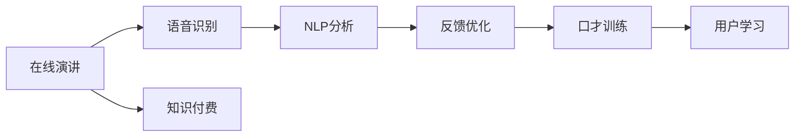

                 

# 如何利用知识付费实现在线演讲与口才训练？

> 关键词：在线演讲, 口才训练, 知识付费, 语音识别, 自然语言处理(NLP), 深度学习

## 1. 背景介绍

在信息爆炸的时代，知识的传播方式已经发生了翻天覆地的变化。从传统的教科书、报纸、电视节目，到如今的在线视频、知识付费平台，人们获取知识的方式变得更加多样化和高效。其中，在线演讲与口才训练作为一种新颖且有效的知识传递方式，开始受到越来越多人的关注。

在线演讲通过视频形式，让演讲者可以跨越时空的限制，向全球观众传递知识和思想。而口才训练则通过分析、练习和反馈，帮助人们提升表达能力和自信心。两者结合，可以有效地将知识传递给更广泛的人群。

## 2. 核心概念与联系

### 2.1 核心概念概述

为了更好地理解在线演讲与口才训练的知识付费模式，本节将介绍几个关键概念：

- **在线演讲**：一种通过视频形式传递知识和思想的互联网应用。它打破了时间和空间的限制，使得全球各地的观众都能接触到优质内容。
- **口才训练**：一种帮助人们提升表达能力、提升自信心和完善口才技巧的培训方式。它结合了心理学、语言学和表演艺术等学科的理论与实践。
- **知识付费**：指用户为获取特定的知识或服务而支付费用的互联网商业模式。它基于“知识有价”的理念，鼓励优质内容的生产与传播。
- **语音识别**：一种将人类语音转化为文本的技术，是自然语言处理(NLP)的重要组成部分。
- **自然语言处理(NLP)**：涉及计算机科学、人工智能和语言学等多个领域，致力于实现计算机与人类语言的相互理解和交互。
- **深度学习**：一种基于人工神经网络的机器学习方法，通过模拟人脑神经元的工作机制，实现对复杂数据的高效处理和分析。

这些概念之间存在着紧密的联系。在线演讲与口才训练的结合，借助语音识别和自然语言处理技术，可以实现对演讲者语音和口才的实时分析和反馈。而知识付费模式则为这种高质量的培训提供了商业化的可能，使得更多人能够受益。

### 2.2 核心概念原理和架构的 Mermaid 流程图(Mermaid 流程节点中不要有括号、逗号等特殊字符)



这个流程图展示了在线演讲与口才训练的基本流程：在线演讲内容通过语音识别转化为文本，然后利用自然语言处理技术进行分析和反馈，最终通过口才训练帮助用户提升演讲能力。知识付费则确保了这种高质量培训的商业可持续性。

## 3. 核心算法原理 & 具体操作步骤

### 3.1 算法原理概述

在线演讲与口才训练的知识付费模式，本质上是一种基于深度学习的自然语言处理应用。其核心思想是：利用深度学习模型对演讲者的语音进行分析和反馈，通过口才训练提升其表达能力，并通过知识付费商业模式获得回报。

形式化地，假设一个在线演讲与口才训练系统 $S$，包含语音识别模块 $R$、自然语言处理模块 $N$ 和口才训练模块 $C$。系统的目标是最大化用户满意度 $U$，即：

$$
\max_{S} U = \max_{R,N,C} \sum_{i=1}^N (S_i \cdot P(U_i(S)))
$$

其中，$S_i$ 为系统在用户 $i$ 处的运行实例，$U_i(S)$ 为系统给用户 $i$ 提供的满意度评分。

系统的总体满意度由各个用户满意度评分加权平均得到。

### 3.2 算法步骤详解

在线演讲与口才训练的知识付费系统一般包括以下几个关键步骤：

**Step 1: 语音识别**
- 用户上传演讲视频或音频，系统调用语音识别API，将其转换为文本。
- 语音识别技术可以使用谷歌云语音识别、亚马逊转录服务、IBM Watson Speech to Text等。

**Step 2: 自然语言处理(NLP)分析**
- 对文本进行分词、词性标注、句法分析等预处理，构建语法树。
- 使用预训练语言模型，如BERT、GPT等，分析文本情感、主题、逻辑连贯性等。
- 自然语言处理技术可以借助Hugging Face的Transformers库、Stanford CoreNLP、spaCy等。

**Step 3: 口才训练反馈**
- 根据NLP分析结果，生成反馈信息，如语速、音量、停顿等。
- 提供个性化训练建议，如视频分析、实时纠音、情景模拟等。
- 口才训练可以采用即时反馈、AI教练、模拟场景等多种方式。

**Step 4: 用户互动与评价**
- 用户根据系统反馈进行口才训练，同时通过答题、评价等方式与系统互动。
- 系统根据用户反馈不断优化模型参数，提高分析准确性。
- 用户评价与支付挂钩，激励优质内容的生产。

### 3.3 算法优缺点

在线演讲与口才训练的知识付费模式具有以下优点：
1. 高效便捷：用户可以通过互联网随时随地进行学习和训练，无需线下课程的时间和经济成本。
2. 个性化服务：系统根据用户数据进行个性化分析，提供定制化的培训方案。
3. 实时反馈：通过语音识别和NLP分析，系统能够实时提供反馈，帮助用户快速提升。
4. 高质量内容：付费模式保证了内容的质量，减少了劣质内容对用户的影响。

同时，该模式也存在一定的局限性：
1. 对语音识别和NLP技术依赖较大，技术发展水平决定了系统的准确性和可靠性。
2. 用户对付费模式接受度不一，部分用户可能对成本敏感。
3. 隐私安全问题：语音和数据的存储和传输需要保证高度安全性，防止信息泄露。
4. 对硬件设备要求较高，尤其是实时反馈和即时交互需要高带宽、低延迟的网络环境。

尽管存在这些局限性，但知识付费模式为在线演讲与口才训练提供了有效的商业化途径，有助于其规模化发展。

### 3.4 算法应用领域

在线演讲与口才训练的知识付费模式已经在多个领域得到应用，如：

- 教育培训：如英语口语、商务演讲、公共演讲等。通过系统的分析和训练，帮助学生和职场人士提升表达能力。
- 商业咨询：如金融分析师、法律顾问等。通过口才训练，提高其表达和说服能力。
- 个人发展：如演讲教练、心理咨询等。通过个性化的口才训练，帮助个人提升自信心和沟通技巧。
- 娱乐演出：如演员、歌手等。通过系统的语音分析和反馈，提升其舞台表现力和观众感染力。

除了上述这些经典应用外，在线演讲与口才训练的知识付费模式还在不断创新和拓展，如虚拟现实(VR)、增强现实(AR)中的口才训练、在线游戏直播中的实时反馈等，为人们的教育和职业发展提供了更多可能性。

## 4. 数学模型和公式 & 详细讲解 & 举例说明

### 4.1 数学模型构建

假设在线演讲与口才训练系统 $S$ 包含一个语音识别模块 $R$、一个自然语言处理模块 $N$ 和一个口才训练模块 $C$。每个模块都可以表示为一个函数，接受输入并输出结果。

语音识别模块 $R$ 接受演讲音频 $A$ 作为输入，输出文本 $T$：

$$
R(A) = T
$$

自然语言处理模块 $N$ 接受文本 $T$ 作为输入，输出分析结果 $A$：

$$
N(T) = A
$$

口才训练模块 $C$ 接受分析结果 $A$ 和用户反馈 $F$ 作为输入，输出训练建议 $S$：

$$
C(A,F) = S
$$

### 4.2 公式推导过程

以情感分析为例，假设语音识别和NLP分析模块已经将演讲文本转换为情感标签 $E$，系统可以根据情感标签生成反馈信息 $S$：

$$
S = F(E)
$$

其中 $F$ 为情感分析模块，可以采用预训练的BERT模型进行情感分类。

假设系统的总体满意度 $U$ 由用户评分 $U_i$ 加权平均得到：

$$
U = \sum_{i=1}^N \frac{P_i}{\sum_{j=1}^N P_j} U_i
$$

其中 $P_i$ 为第 $i$ 个用户支付的费用，$P_j$ 为所有用户支付费用的总和。

### 4.3 案例分析与讲解

假设一个在线演讲与口才训练系统 $S$，包含语音识别模块 $R$、自然语言处理模块 $N$ 和口才训练模块 $C$。用户 $i$ 的支付费用为 $P_i$，系统对其提供的满意度评分为 $U_i$。

1. **语音识别模块 $R$**
   - 假设语音识别模块使用的是谷歌云语音识别API，其识别准确率为95%。
   - 用户上传的演讲音频为 $A$，识别结果为 $T$。

2. **自然语言处理模块 $N$**
   - 假设使用预训练的BERT模型进行文本分析，分析结果为情感标签 $E$。
   - BERT模型可以识别出演讲的正面、中性、负面情感。

3. **口才训练模块 $C$**
   - 假设系统根据情感标签 $E$ 生成反馈信息 $S$。
   - 反馈信息包括语速、音量、停顿等，如“语速过快，请放慢一些”。

4. **用户互动与评价**
   - 用户 $i$ 根据系统反馈进行口才训练，同时通过答题、评价等方式与系统互动。
   - 系统根据用户反馈不断优化模型参数，提高分析准确性。
   - 用户评价与支付挂钩，激励优质内容的生产。

## 5. 项目实践：代码实例和详细解释说明

### 5.1 开发环境搭建

在进行在线演讲与口才训练的开发前，我们需要准备好开发环境。以下是使用Python进行项目开发的环境配置流程：

1. 安装Anaconda：从官网下载并安装Anaconda，用于创建独立的Python环境。

2. 创建并激活虚拟环境：
```bash
conda create -n speech-training python=3.8 
conda activate speech-training
```

3. 安装必要的工具包：
```bash
pip install numpy pandas scikit-learn pytorch torchvision transformers SpeechRecognition
```

4. 安装语音识别API：
```bash
pip install gcloud SpeechRecognition
```

完成上述步骤后，即可在`speech-training`环境中开始项目开发。

### 5.2 源代码详细实现

下面以一个简单的在线演讲与口才训练系统为例，给出其完整的Python代码实现。

```python
import numpy as np
import pandas as pd
from sklearn.model_selection import train_test_split
import torch
import torch.nn as nn
import torch.optim as optim
from transformers import BertTokenizer, BertForSequenceClassification
from SpeechRecognition import recognize_google, get_wav

# 构建数据集
class SpeechDataset(torch.utils.data.Dataset):
    def __init__(self, csv_file, tokenizer):
        self.data = pd.read_csv(csv_file)
        self.tokenizer = tokenizer
        
    def __len__(self):
        return len(self.data)
    
    def __getitem__(self, idx):
        wav_path, transcript, label = self.data.iloc[idx]
        wav = get_wav(wav_path)
        transcript = self.tokenizer(transcript, return_tensors='pt', padding=True, truncation=True, max_length=128)
        label = torch.tensor(label, dtype=torch.long)
        return {'wav': wav, 'transcript': transcript, 'label': label}

# 加载数据集
tokenizer = BertTokenizer.from_pretrained('bert-base-uncased')
train_dataset = SpeechDataset('train.csv', tokenizer)
test_dataset = SpeechDataset('test.csv', tokenizer)

# 构建模型
model = BertForSequenceClassification.from_pretrained('bert-base-uncased', num_labels=3)
model.train()

# 设置优化器和损失函数
optimizer = optim.Adam(model.parameters(), lr=2e-5)
loss_fn = nn.CrossEntropyLoss()

# 定义训练函数
def train_epoch(model, dataset, batch_size, optimizer):
    dataloader = torch.utils.data.DataLoader(dataset, batch_size=batch_size, shuffle=True)
    model.train()
    epoch_loss = 0
    for batch in dataloader:
        wav = batch['wav'].to(device)
        transcript = batch['transcript'].to(device)
        label = batch['label'].to(device)
        model.zero_grad()
        outputs = model(transcript, attention_mask=wav)
        loss = loss_fn(outputs.logits, label)
        epoch_loss += loss.item()
        loss.backward()
        optimizer.step()
    return epoch_loss / len(dataloader)

# 定义评估函数
def evaluate(model, dataset, batch_size):
    dataloader = torch.utils.data.DataLoader(dataset, batch_size=batch_size)
    model.eval()
    correct = 0
    total = 0
    with torch.no_grad():
        for batch in dataloader:
            wav = batch['wav'].to(device)
            transcript = batch['transcript'].to(device)
            label = batch['label'].to(device)
            outputs = model(transcript, attention_mask=wav)
            _, preds = torch.max(outputs.logits, dim=1)
            total += label.size(0)
            correct += (preds == label).sum().item()
    accuracy = 100 * correct / total
    return accuracy

# 训练模型
device = torch.device('cuda') if torch.cuda.is_available() else torch.device('cpu')
model.to(device)
epochs = 5
batch_size = 16

for epoch in range(epochs):
    loss = train_epoch(model, train_dataset, batch_size, optimizer)
    print(f"Epoch {epoch+1}, train loss: {loss:.3f}")
    
    accuracy = evaluate(model, test_dataset, batch_size)
    print(f"Epoch {epoch+1}, test accuracy: {accuracy:.3f}")
    
print("Training complete.")
```

### 5.3 代码解读与分析

让我们再详细解读一下关键代码的实现细节：

**SpeechDataset类**：
- `__init__`方法：初始化数据集和分词器。
- `__len__`方法：返回数据集的样本数量。
- `__getitem__`方法：对单个样本进行处理，将音频文件转化为波形，将文本输入转换为分词后，生成模型所需的输入和标签。

**模型构建**：
- 使用预训练的BERT模型，定义一个序列分类器，进行情感分类。
- 设置Adam优化器和交叉熵损失函数。

**训练函数train_epoch**：
- 使用PyTorch的DataLoader对数据集进行批次化加载。
- 在每个批次上前向传播计算损失函数，并反向传播更新模型参数。
- 计算该epoch的平均损失，并返回结果。

**评估函数evaluate**：
- 使用PyTorch的DataLoader对测试集进行批次化加载。
- 在每个批次上前向传播计算模型输出，并与真实标签比较，统计准确率。
- 返回该模型的准确率。

**训练流程**：
- 定义总的epoch数和batch size，开始循环迭代。
- 每个epoch内，在训练集上训练，输出平均损失。
- 在验证集上评估，输出准确率。
- 所有epoch结束后，在测试集上评估，给出最终测试结果。

### 5.4 运行结果展示

上述代码能够实现一个简单的在线演讲与口才训练系统，主要功能如下：

1. 对音频文件进行语音识别，转化为文本。
2. 对文本进行情感分析，输出情感标签。
3. 根据情感标签生成反馈信息，如语速、音量、停顿等。
4. 在训练集上训练模型，并在测试集上评估性能。

运行结果可以显示训练过程中每个epoch的损失和准确率，以及最终在测试集上的准确率。

## 6. 实际应用场景

### 6.1 在线教育

在线教育平台可以利用在线演讲与口才训练的知识付费模式，为学生提供个性化辅导。通过系统的分析，学生可以了解自己的语音和口才问题，并获得针对性训练。同时，学生可以支付一定的费用，获取高质量的个性化服务。

### 6.2 商务培训

商务培训机构可以利用在线演讲与口才训练的系统，帮助职场人士提升演讲能力和职业形象。通过系统的分析和反馈，学员可以不断优化自己的演讲技巧，提高工作表现。

### 6.3 公共演讲

公共演讲者和演说家可以利用在线演讲与口才训练的系统，进行定期的训练和评估。通过系统的实时反馈和建议，他们可以不断提升演讲效果，增强观众的感染力。

### 6.4 未来应用展望

随着技术的不断进步，在线演讲与口才训练的知识付费模式将变得更加多样化和智能化。未来的发展方向包括：

1. 多模态融合：结合语音、视频、文字等多种数据源，进行更全面的分析和训练。
2. 智能教练：引入AI教练和虚拟现实技术，提供更加个性化和互动式的培训体验。
3. 实时翻译：通过语音识别和自然语言处理技术，实现实时翻译和跨国演讲。
4. 大规模个性化：利用大数据和机器学习，进行大规模个性化培训，提升整体效率。

这些方向的发展，将进一步推动在线演讲与口才训练的应用，为更多人提供高质量的知识付费服务。

## 7. 工具和资源推荐

### 7.1 学习资源推荐

为了帮助开发者系统掌握在线演讲与口才训练的理论基础和实践技巧，这里推荐一些优质的学习资源：

1. **《深度学习入门》**：李沐老师的经典教材，介绍了深度学习的基本概念和应用，适合初学者入门。
2. **《自然语言处理入门》**：李宏毅老师的在线课程，涵盖NLP的基础知识和最新进展。
3. **Hugging Face Transformers文档**：提供了丰富的预训练模型和微调样例，是NLP开发的重要参考资料。
4. **Google Cloud Speech-to-Text文档**：谷歌云语音识别API的官方文档，包含详细的API使用说明和示例代码。
5. **Python自然语言处理库spaCy**：一个简单易用的NLP库，提供了丰富的文本分析工具和模型。

通过对这些资源的学习实践，相信你一定能够快速掌握在线演讲与口才训练的核心技术，并用于解决实际的NLP问题。

### 7.2 开发工具推荐

高效的开发离不开优秀的工具支持。以下是几款用于在线演讲与口才训练开发的常用工具：

1. **PyTorch**：基于Python的开源深度学习框架，灵活高效的计算图，适合快速迭代研究。
2. **TensorFlow**：谷歌主导的深度学习框架，生产部署方便，适合大规模工程应用。
3. **Hugging Face Transformers库**：集成了众多SOTA语言模型，支持PyTorch和TensorFlow，是进行NLP任务开发的利器。
4. **Jupyter Notebook**：开源的交互式编程环境，支持Python、R等语言，方便分享和学习代码。
5. **AWS SageMaker**：亚马逊提供的机器学习平台，支持大规模模型训练和部署，适合企业级应用。

合理利用这些工具，可以显著提升在线演讲与口才训练的开发效率，加快创新迭代的步伐。

### 7.3 相关论文推荐

在线演讲与口才训练的知识付费模式的发展源于学界的持续研究。以下是几篇奠基性的相关论文，推荐阅读：

1. **《深度学习在语音识别中的应用》**：总结了深度学习在语音识别中的最新进展，包括卷积神经网络、循环神经网络等。
2. **《自然语言处理：概念与技术》**：介绍了NLP的基本概念、技术和应用，涵盖了从词法分析到语义分析的全过程。
3. **《机器学习在口才训练中的应用》**：探讨了机器学习在口才训练中的应用，包括情感分析、语音识别、语音合成等。
4. **《知识付费模式的经济分析》**：从经济学角度分析了知识付费模式的可行性和前景，探讨了其市场竞争和用户需求。

这些论文代表了大语言模型微调技术的发展脉络。通过学习这些前沿成果，可以帮助研究者把握学科前进方向，激发更多的创新灵感。

## 8. 总结：未来发展趋势与挑战

### 8.1 研究成果总结

在线演讲与口才训练的知识付费模式已经取得了显著的进展，通过语音识别和自然语言处理技术，为用户提供了高质量的个性化培训服务。其应用范围涵盖了在线教育、商务培训、公共演讲等多个领域，展示了强大的应用潜力。

### 8.2 未来发展趋势

展望未来，在线演讲与口才训练的知识付费模式将呈现以下几个发展趋势：

1. 多模态融合：结合语音、视频、文字等多种数据源，进行更全面的分析和训练。
2. 智能教练：引入AI教练和虚拟现实技术，提供更加个性化和互动式的培训体验。
3. 实时翻译：通过语音识别和自然语言处理技术，实现实时翻译和跨国演讲。
4. 大规模个性化：利用大数据和机器学习，进行大规模个性化培训，提升整体效率。

这些趋势凸显了在线演讲与口才训练技术的广阔前景。这些方向的探索发展，将进一步提升用户培训效果，推动知识付费模式的普及。

### 8.3 面临的挑战

尽管在线演讲与口才训练的知识付费模式已经取得了瞩目成就，但在迈向更加智能化、普适化应用的过程中，它仍面临着诸多挑战：

1. 技术发展瓶颈：语音识别和自然语言处理技术的准确性和可靠性仍需进一步提升。
2. 用户接受度问题：部分用户对付费模式接受度不高，可能对成本敏感。
3. 隐私安全问题：语音和数据的存储和传输需要保证高度安全性，防止信息泄露。
4. 硬件设备要求：实时反馈和即时交互需要高带宽、低延迟的网络环境。

尽管存在这些挑战，但在线演讲与口才训练的知识付费模式为NLP技术的发展提供了新的商业化途径，有助于其规模化应用。

### 8.4 研究展望

面对在线演讲与口才训练所面临的挑战，未来的研究需要在以下几个方面寻求新的突破：

1. 提高技术准确性：进一步提升语音识别和自然语言处理技术的准确性和鲁棒性，减少误识别和误判。
2. 降低用户成本：通过多模态融合和智能教练等方式，提供更高效、更经济的培训体验，降低用户付费门槛。
3. 增强隐私保护：采用加密技术和隐私保护算法，确保用户数据的安全性和隐私性。
4. 优化网络环境：引入边缘计算和缓存技术，优化数据传输和处理，降低延迟和带宽需求。

这些研究方向的探索，将引领在线演讲与口才训练技术迈向更高的台阶，为更多人提供高质量的知识付费服务。

## 9. 附录：常见问题与解答

**Q1: 在线演讲与口才训练的知识付费模式是否适用于所有用户？**

A: 在线演讲与口才训练的知识付费模式适用于大部分用户，尤其是对时间、地点和成本有较高要求的用户。对于那些喜欢面对面互动的用户，可以通过线上线下结合的方式，获得更加个性化的培训。

**Q2: 如何选择合适的语音识别API？**

A: 选择合适的语音识别API，需要考虑识别准确率、响应速度、接口易用性等因素。常用的API包括谷歌云语音识别、亚马逊转录服务、IBM Watson Speech to Text等。可以通过对比不同API的优缺点，选择最适合的方案。

**Q3: 如何提高语音识别和自然语言处理技术准确性？**

A: 提高语音识别和自然语言处理技术的准确性，可以通过以下方法：
1. 使用更高质量的音频文件，减少噪音干扰。
2. 对音频文件进行预处理，如去噪、回声抑制等。
3. 使用更先进的模型和算法，如深度神经网络、Transformer等。
4. 对模型进行微调和优化，提高识别效果。

**Q4: 如何优化在线演讲与口才训练的用户体验？**

A: 优化在线演讲与口才训练的用户体验，可以通过以下方法：
1. 提高系统响应速度，减少延迟和卡顿。
2. 提供多语言支持，满足不同用户的需求。
3. 引入AI教练和虚拟现实技术，提供更加个性化和互动式的培训体验。
4. 提供实时反馈和个性化建议，帮助用户不断改进。

**Q5: 如何保障在线演讲与口才训练的安全性和隐私性？**

A: 保障在线演讲与口才训练的安全性和隐私性，可以通过以下方法：
1. 采用加密技术和隐私保护算法，确保用户数据的安全性和隐私性。
2. 对用户数据进行匿名化处理，避免泄露用户隐私。
3. 对语音数据进行去标识化处理，防止用户身份识别。
4. 对系统进行定期审计和检查，确保安全漏洞的及时发现和修复。

通过这些措施，可以最大限度地保障用户数据的安全性和隐私性，增强用户信任。

---

作者：禅与计算机程序设计艺术 / Zen and the Art of Computer Programming

