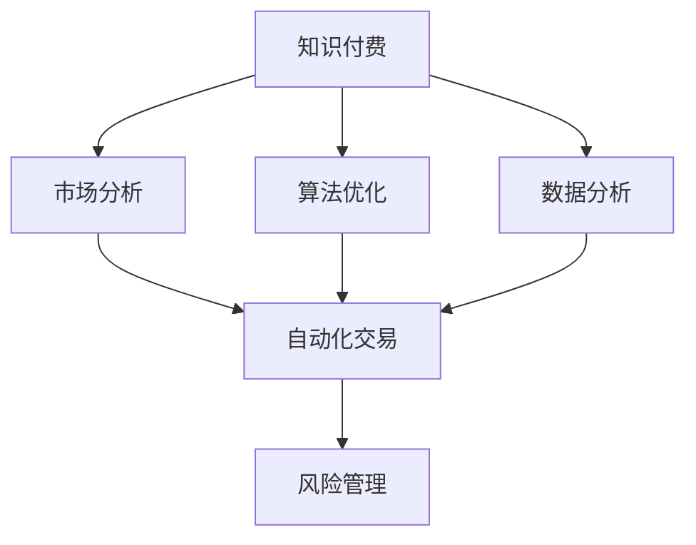

                 

# 如何利用知识付费实现投资并购与资本运作？

> 关键词：知识付费, 投资并购, 资本运作, 数据分析, 算法优化, 市场分析, 自动化交易, 风险管理

## 1. 背景介绍

在数字化时代，信息知识和智能决策成为企业竞争的关键。知识付费作为连接知识和资本的重要桥梁，为投资并购与资本运作提供了新的视角和方法。本文旨在探讨如何利用知识付费平台，通过数据分析、算法优化和市场分析，实现投资并购与资本运作的智能化、自动化和高效化。

### 1.1 问题由来

随着信息技术的飞速发展，传统投资并购与资本运作模式已经难以适应快速变化的市场环境。如何高效获取、利用和共享信息知识，成为企业决策中的重要课题。知识付费作为一种新兴的商业模式，以其精准的信息推送和高质量的专家咨询，吸引了越来越多的关注。然而，如何将知识付费与投资并购和资本运作有机结合，实现协同创新，仍然是一个值得深入研究的问题。

### 1.2 问题核心关键点

本文的核心目标是探讨如何通过知识付费平台，收集、分析和利用高质量的信息知识，辅助企业进行投资并购和资本运作决策。具体而言，包括以下几个关键点：

1. 如何利用知识付费平台获取目标行业和企业的信息知识？
2. 如何将获取的信息知识与市场分析模型和预测算法相结合，实现智能投资决策？
3. 如何构建自动化的投资并购和资本运作平台，提升决策效率和准确性？
4. 如何通过风险管理和动态调整，降低投资并购和资本运作的风险？

## 2. 核心概念与联系

### 2.1 核心概念概述

为了更好地理解本文的核心内容，我们先介绍几个关键概念：

- **知识付费**：指通过付费方式，获取专家的高质量知识、信息、咨询和培训等服务的商业模式。
- **投资并购**：指企业通过收购其他企业或业务，以实现资源整合、市场扩展、技术创新等战略目标。
- **资本运作**：指企业通过资本市场运作，如融资、上市、并购等，实现企业价值增值的过程。
- **数据分析**：指利用统计、计算和算法技术，对数据进行收集、处理、分析和解释的过程。
- **算法优化**：指通过算法和模型，对系统性能进行优化和改进，提升决策准确性和效率。
- **市场分析**：指利用经济、金融、行业、技术等领域的知识，对市场环境和趋势进行分析和预测。
- **自动化交易**：指利用算法和系统，实现投资交易的自动化，降低人为错误和提高交易效率。
- **风险管理**：指通过识别、评估和控制风险，保障投资并购和资本运作的安全性和稳定性。

这些核心概念之间的逻辑关系可以通过以下Mermaid流程图来展示：



这个流程图展示了大语言模型的核心概念及其之间的关系：

1. 知识付费平台收集高质量信息知识。
2. 数据分析和算法优化处理信息知识，为智能投资决策提供支持。
3. 市场分析结合信息知识，为投资并购和资本运作提供市场环境和趋势预测。
4. 自动化交易系统实现投资决策的自动化执行。
5. 风险管理保障投资并购和资本运作的安全稳定。

## 3. 核心算法原理 & 具体操作步骤

### 3.1 算法原理概述

本文主要探讨的知识付费平台，利用机器学习和人工智能技术，实现信息知识的自动收集、处理和分析，辅助企业进行投资并购和资本运作决策。其核心算法包括但不限于：

- **数据预处理**：对获取的信息知识进行清洗、归一化和特征提取，为后续分析打下基础。
- **自然语言处理**（NLP）**算法**：利用NLP技术，对文本数据进行分词、实体识别、情感分析等处理，提取有价值的信息。
- **机器学习算法**：利用分类、回归、聚类、强化学习等算法，对处理后的信息知识进行模型训练和预测，辅助决策。
- **模型集成与优化**：通过集成多个模型，进行模型融合和参数优化，提升决策准确性和鲁棒性。

### 3.2 算法步骤详解

本文以典型的投资并购决策为例，详细讲解利用知识付费平台实现投资并购和资本运作的算法步骤：

**Step 1: 信息收集与预处理**

1. 通过知识付费平台，订阅目标行业和企业的信息推送，如行业报告、新闻、分析文章等。
2. 对收集的信息进行预处理，包括文本清洗、分词、实体识别、情感分析等。
3. 将处理后的信息转化为结构化数据，便于后续分析。

**Step 2: 数据建模与预测**

1. 利用机器学习算法，对处理后的信息数据进行建模，如线性回归、逻辑回归、决策树等。
2. 对模型进行训练和验证，选择最优模型进行预测。
3. 将模型应用于投资并购的各类指标，如行业趋势、企业财务、市场情绪等，进行预测。

**Step 3: 自动化交易与风险管理**

1. 基于预测结果，构建自动化交易系统，实现买卖决策的自动化执行。
2. 利用风险管理模型，对自动化交易系统进行风险评估和控制。
3. 动态调整交易策略，根据市场环境变化进行实时优化。

**Step 4: 反馈与优化**

1. 对自动化交易系统进行实时监控和反馈，分析交易结果和市场表现。
2. 根据反馈结果，对模型进行优化和调整，提升预测准确性和交易效率。

### 3.3 算法优缺点

**优点**：
1. 高效获取和处理高质量信息知识，提升决策支持能力。
2. 利用机器学习和算法优化，提升决策准确性和效率。
3. 实现自动化交易和风险管理，降低人为错误和操作风险。

**缺点**：
1. 依赖高质量数据和算法模型，数据噪声和模型偏差可能影响结果。
2. 需要持续维护和优化模型，技术门槛较高。
3. 自动化交易系统可能存在误判，需要人工干预和监控。

### 3.4 算法应用领域

利用知识付费平台，实现投资并购与资本运作的算法，具有广泛的应用前景，涵盖以下领域：

- **投资决策支持**：辅助投资者进行市场分析、企业评估和投资选择，提升决策效率和准确性。
- **并购交易优化**：通过目标企业信息的分析和预测，优化并购策略和交易条件，提升并购成功率和回报率。
- **资本运作监管**：利用自动化交易和风险管理，保障资本运作的安全性和稳定性，避免金融风险。
- **技术创新与研发**：通过市场趋势和技术发展信息的分析，支持企业技术创新和产品研发，提升核心竞争力。

## 4. 数学模型和公式 & 详细讲解 & 举例说明

### 4.1 数学模型构建

为了更好地解释本文的算法原理，我们构建以下数学模型：

**Step 1: 数据预处理**

假设原始信息数据为 $X=(x_1, x_2, \dots, x_n)$，其中 $x_i$ 表示第 $i$ 条信息。

对 $X$ 进行预处理后，得到处理后的数据 $Y=(y_1, y_2, \dots, y_m)$，其中 $y_j$ 表示第 $j$ 条处理后的信息。

**Step 2: 数据建模与预测**

构建机器学习模型 $M$，对处理后的数据 $Y$ 进行建模和预测。

假设模型 $M$ 的输入为 $X'$，输出为 $\hat{y}$，则有：

$$
\hat{y} = M(X')
$$

其中 $X'$ 表示输入特征，$\hat{y}$ 表示模型预测结果。

**Step 3: 自动化交易与风险管理**

设 $Z$ 表示自动化交易系统的输出，即买卖信号。

假设 $Z$ 的输入为 $X'$ 和 $M$ 的预测结果 $\hat{y}$，则有：

$$
Z = T(X', \hat{y})
$$

其中 $T$ 表示交易策略模型，$Z$ 表示买卖信号。

假设风险管理模型为 $R$，对交易系统进行风险评估和控制。

则交易系统的最终输出为：

$$
\hat{Z} = R(Z)
$$

其中 $\hat{Z}$ 表示调整后的买卖信号。

### 4.2 公式推导过程

以下对上述公式进行详细推导：

**Step 1: 数据预处理**

对于信息数据 $X=(x_1, x_2, \dots, x_n)$，先进行文本清洗、分词、实体识别等处理，得到处理后的数据 $Y=(y_1, y_2, \dots, y_m)$。

**Step 2: 数据建模与预测**

构建机器学习模型 $M$，对处理后的数据 $Y$ 进行建模和预测。

假设模型 $M$ 为线性回归模型，则有：

$$
\hat{y} = \beta_0 + \beta_1 x_1 + \beta_2 x_2 + \dots + \beta_n x_n + \epsilon
$$

其中 $\beta_0, \beta_1, \dots, \beta_n$ 为模型参数，$\epsilon$ 为噪声。

**Step 3: 自动化交易与风险管理**

构建交易策略模型 $T$，将模型 $M$ 的预测结果 $\hat{y}$ 作为输入，输出买卖信号 $Z$。

假设 $T$ 为决策树模型，则有：

$$
Z = T(M(\hat{y}))
$$

其中 $T$ 表示决策树模型，$\hat{y}$ 表示模型预测结果。

风险管理模型 $R$ 对交易系统进行风险评估和控制，对买卖信号 $Z$ 进行风险评估和动态调整。

假设 $R$ 为条件概率模型，则有：

$$
\hat{Z} = R(Z | X')
$$

其中 $\hat{Z}$ 表示调整后的买卖信号，$Z$ 表示原始买卖信号，$X'$ 表示输入特征。

### 4.3 案例分析与讲解

假设我们利用知识付费平台，订阅了目标行业和企业的信息推送，对信息进行预处理和建模，构建了线性回归模型 $M$。

根据模型的预测结果 $\hat{y}$，构建了决策树模型 $T$，进行买卖信号的自动化交易。

最后，利用条件概率模型 $R$，对交易系统进行风险评估和动态调整。

在实际操作中，需要对模型进行反复测试和优化，确保模型的稳定性和准确性。

## 5. 项目实践：代码实例和详细解释说明

### 5.1 开发环境搭建

在进行项目实践前，我们需要准备好开发环境。以下是使用Python进行TensorFlow开发的环境配置流程：

1. 安装Anaconda：从官网下载并安装Anaconda，用于创建独立的Python环境。

2. 创建并激活虚拟环境：
```bash
conda create -n tf-env python=3.8 
conda activate tf-env
```

3. 安装TensorFlow：根据CUDA版本，从官网获取对应的安装命令。例如：
```bash
conda install tensorflow -c conda-forge -c pypi -c tf
```

4. 安装Pandas、NumPy、Scikit-Learn等各类工具包：
```bash
pip install pandas numpy scikit-learn matplotlib tqdm jupyter notebook ipython
```

完成上述步骤后，即可在`tf-env`环境中开始项目实践。

### 5.2 源代码详细实现

我们先以典型的投资并购决策为例，给出使用TensorFlow进行投资并购决策的代码实现。

```python
import tensorflow as tf
from tensorflow.keras import layers, models
from sklearn.preprocessing import StandardScaler
from sklearn.model_selection import train_test_split

# 数据预处理
def preprocess_data(X):
    # 对文本数据进行分词、实体识别、情感分析等处理
    # 将处理后的数据转换为数值型特征
    # 对特征进行归一化
    return X

# 构建线性回归模型
def build_model():
    model = models.Sequential([
        layers.Dense(64, activation='relu', input_shape=(X.shape[1],)),
        layers.Dense(32, activation='relu'),
        layers.Dense(1)
    ])
    model.compile(optimizer=tf.keras.optimizers.Adam(0.001), loss='mse')
    return model

# 加载数据
def load_data():
    # 加载预处理后的数据
    X = preprocess_data(X)
    y = preprocess_data(y)
    return X, y

# 划分数据集
def split_data(X, y):
    X_train, X_test, y_train, y_test = train_test_split(X, y, test_size=0.2, random_state=42)
    return X_train, X_test, y_train, y_test

# 模型训练与预测
def train_model(X_train, y_train):
    model = build_model()
    model.fit(X_train, y_train, epochs=50, batch_size=32, validation_split=0.2)
    return model

# 测试模型
def test_model(model, X_test, y_test):
    y_pred = model.predict(X_test)
    return y_pred

# 自动化交易系统
def trade(model, X', y_pred):
    # 根据预测结果构建买卖信号
    # 对交易信号进行风险管理
    return trade_signal

# 风险管理模型
def risk_management(trade_signal):
    # 评估交易信号的风险
    # 根据风险评估结果调整交易信号
    return adjusted_signal
```

### 5.3 代码解读与分析

让我们再详细解读一下关键代码的实现细节：

**preprocess_data函数**：
- 对文本数据进行预处理，包括分词、实体识别、情感分析等处理，将处理后的数据转换为数值型特征，并进行归一化。

**build_model函数**：
- 构建线性回归模型，使用Sequential模型定义模型结构，包括输入层、隐藏层和输出层，使用Adam优化器和均方误差损失函数进行编译。

**load_data函数**：
- 加载预处理后的数据，将文本数据转换为数值型特征，并进行归一化。

**split_data函数**：
- 划分数据集为训练集和测试集，设置测试集占比为20%，随机种子为42，确保结果可复现。

**train_model函数**：
- 使用训练集数据训练模型，设置训练轮数为50，批次大小为32，验证集占比为20%。

**test_model函数**：
- 使用测试集数据进行模型测试，返回预测结果。

**trade函数**：
- 根据预测结果构建买卖信号，对交易信号进行风险管理，返回调整后的交易信号。

**risk_management函数**：
- 评估交易信号的风险，根据风险评估结果调整交易信号，返回调整后的交易信号。

### 5.4 运行结果展示

在实际操作中，需要反复测试和优化模型，确保模型的稳定性和准确性。例如，可以通过以下代码对模型进行测试和评估：

```python
import matplotlib.pyplot as plt
from sklearn.metrics import mean_squared_error

# 加载数据
X, y = load_data()

# 划分数据集
X_train, X_test, y_train, y_test = split_data(X, y)

# 训练模型
model = train_model(X_train, y_train)

# 测试模型
y_pred = test_model(model, X_test)

# 评估模型
mse = mean_squared_error(y_test, y_pred)
print(f"Mean Squared Error: {mse:.2f}")

# 可视化结果
plt.plot(y_test, label='True Values')
plt.plot(y_pred, label='Predictions')
plt.legend()
plt.show()
```

以上代码展示了模型训练和测试的基本流程，可以通过可视化结果评估模型的预测效果。

## 6. 实际应用场景

### 6.1 智能投行

利用知识付费平台，智能投行可以根据目标行业和企业的信息知识，提供精准的市场分析和投资建议。通过自动化交易系统，实现买卖信号的自动化执行，提升投资决策效率和准确性。

### 6.2 并购顾问

并购顾问可以利用知识付费平台，对目标企业的信息知识进行全面分析，评估企业的财务状况、市场地位、技术优势等关键指标，提出有针对性的并购建议。通过风险管理模型，对并购交易进行动态调整，保障交易的安全性和稳定性。

### 6.3 资本运作监管

资本运作监管机构可以利用知识付费平台，获取市场环境和企业的信息知识，进行风险评估和动态监管。通过自动化交易和风险管理，保障资本运作的安全稳定，避免金融风险。

### 6.4 未来应用展望

随着知识付费平台和大数据分析技术的不断进步，基于知识付费的投资并购和资本运作方法将迎来更多的创新和突破。

- **深度学习与AI技术**：引入深度学习算法和大数据分析技术，提升模型预测能力和决策效率。
- **多模态数据融合**：利用文本、图像、视频等多模态数据，丰富信息知识的获取和分析。
- **实时数据分析**：通过实时数据分析和动态调整，提升交易系统的灵活性和适应性。
- **用户行为分析**：结合用户行为数据，进行个性化投资建议和推荐，提升用户体验和满意度。

## 7. 工具和资源推荐

### 7.1 学习资源推荐

为了帮助开发者系统掌握投资并购和资本运作的知识付费技术，这里推荐一些优质的学习资源：

1. 《投资并购与资本运作》系列博文：由行业专家撰写，系统介绍了投资并购和资本运作的基本概念和核心技术。

2. Coursera《金融工程与投资管理》课程：由知名大学和专家授课，涵盖金融工程和投资管理的理论和实践。

3. 《金融科技》书籍：全面介绍了金融科技领域的技术、应用和趋势，包括区块链、大数据、AI等前沿技术。

4. 《投资并购案例分析》系列文章：精选典型投资并购案例，通过案例分析提升决策能力。

5. Weights & Biases：模型训练的实验跟踪工具，可以记录和可视化模型训练过程中的各项指标，方便对比和调优。

通过对这些资源的学习实践，相信你一定能够快速掌握投资并购和资本运作的知识付费技术，并用于解决实际的投资并购和资本运作问题。

### 7.2 开发工具推荐

高效的开发离不开优秀的工具支持。以下是几款用于投资并购和资本运作开发的常用工具：

1. TensorFlow：基于Python的开源深度学习框架，灵活动态的计算图，适合快速迭代研究。支持多模态数据的处理和分析。

2. Scikit-Learn：基于Python的机器学习库，提供了丰富的算法和工具，支持数据预处理和模型训练。

3. PyTorch：基于Python的开源深度学习框架，灵活的动态计算图，适合快速迭代研究。支持自动化交易系统的构建。

4. Jupyter Notebook：免费的交互式计算环境，支持Python、R等多种编程语言，方便调试和可视化。

5. Weights & Biases：模型训练的实验跟踪工具，可以记录和可视化模型训练过程中的各项指标，方便对比和调优。

合理利用这些工具，可以显著提升投资并购和资本运作的开发效率，加快创新迭代的步伐。

### 7.3 相关论文推荐

投资并购和资本运作领域的研究论文众多，以下是几篇代表性的论文，推荐阅读：

1. "AI in Investment Banking: Opportunities and Challenges"（《人工智能在投行中的应用：机遇与挑战》）：介绍了AI技术在投行中的广泛应用，探讨了AI技术的机遇和挑战。

2. "Machine Learning in Corporate Finance"（《机器学习在企业财务中的应用》）：介绍了机器学习在企业财务中的实际应用，包括信用评分、风险管理、投资组合优化等。

3. "Automatic Stock Trading via Deep Reinforcement Learning"（《基于深度强化学习的自动股票交易》）：介绍了利用深度学习进行自动股票交易的研究，探讨了深度强化学习在股票交易中的应用。

4. "Knowledge-based Recommender Systems for Investment Advice"（《基于知识的投资建议推荐系统》）：介绍了基于知识图谱的投资建议推荐系统，探讨了知识图谱在投资建议中的应用。

这些论文代表了大语言模型微调技术的发展脉络。通过学习这些前沿成果，可以帮助研究者把握学科前进方向，激发更多的创新灵感。

## 8. 总结：未来发展趋势与挑战

### 8.1 研究成果总结

本文对利用知识付费平台实现投资并购与资本运作的方法进行了全面系统的介绍。首先阐述了知识付费平台的优势和应用场景，明确了其对投资并购和资本运作的积极影响。其次，从原理到实践，详细讲解了知识付费平台的数据预处理、模型构建、自动化交易和风险管理等关键步骤，给出了投资并购和资本运作的代码实现。同时，本文还广泛探讨了知识付费平台在智能投行、并购顾问、资本运作监管等领域的实际应用，展示了其广阔的应用前景。此外，本文精选了知识付费平台的各类学习资源，力求为开发者提供全方位的技术指引。

通过本文的系统梳理，可以看到，利用知识付费平台实现投资并购和资本运作的方法正在成为投行和金融科技领域的重要范式，极大地提升了投资决策和资本运作的智能化和自动化水平。知识付费平台在提供高质量信息知识方面具有先天优势，将其与投资并购和资本运作有机结合，将带来更加高效、安全、可靠的决策支持。

### 8.2 未来发展趋势

展望未来，知识付费平台在投资并购和资本运作中的应用将呈现以下几个发展趋势：

1. **深度学习与AI技术的应用**：引入深度学习和大数据分析技术，提升模型预测能力和决策效率。
2. **多模态数据融合**：利用文本、图像、视频等多模态数据，丰富信息知识的获取和分析。
3. **实时数据分析**：通过实时数据分析和动态调整，提升交易系统的灵活性和适应性。
4. **用户行为分析**：结合用户行为数据，进行个性化投资建议和推荐，提升用户体验和满意度。
5. **联邦学习**：利用联邦学习技术，保护用户隐私的同时，实现知识共享和协作。

以上趋势凸显了知识付费平台在投资并购和资本运作中的巨大潜力和发展前景，这些方向的探索发展，必将进一步提升投行和金融科技系统的性能和应用范围。

### 8.3 面临的挑战

尽管知识付费平台在投资并购和资本运作中的应用已经取得了一定成效，但在迈向更加智能化、普适化应用的过程中，仍面临诸多挑战：

1. **数据隐私与安全**：知识付费平台需要处理大量敏感信息，如何保障数据隐私和安全，避免数据泄露和滥用，是一个重要问题。
2. **模型鲁棒性与泛化能力**：在多变的环境下，模型可能出现泛化能力不足，需要进一步优化模型，提升鲁棒性。
3. **模型复杂性与可解释性**：复杂的深度学习模型可能难以解释其内部工作机制，需要开发更易于理解和解释的模型。
4. **自动化交易系统的误判问题**：自动化交易系统可能存在误判，需要结合人工干预和监控，确保交易的安全稳定。
5. **动态调整与适应性**：市场环境瞬息万变，如何构建灵活、自适应的交易系统，适应市场变化，是一个长期挑战。

### 8.4 研究展望

面对知识付费平台在投资并购和资本运作中面临的挑战，未来的研究需要在以下几个方面寻求新的突破：

1. **数据隐私与安全技术**：开发数据隐私保护和安全技术，确保用户数据的安全性。
2. **模型优化与解释性**：开发易于解释和理解的模型，提升模型的可解释性和鲁棒性。
3. **自动化交易系统的改进**：引入人工干预和监控机制，提升自动化交易系统的准确性和安全性。
4. **动态调整与自适应系统**：开发动态调整与自适应系统，提升交易系统的灵活性和适应性。
5. **联邦学习与知识共享**：利用联邦学习技术，保护用户隐私的同时，实现知识共享和协作。

这些研究方向的探索，必将引领知识付费平台在投资并购和资本运作中的应用迈向更高的台阶，为投行和金融科技行业带来新的发展机遇。面向未来，知识付费平台需要与其他技术进行更深入的融合，如区块链、大数据、AI等，多路径协同发力，共同推动投资并购和资本运作的进步。

## 9. 附录：常见问题与解答

**Q1：如何利用知识付费平台获取高质量的信息知识？**

A: 利用知识付费平台订阅目标行业和企业的信息推送，如行业报告、新闻、分析文章等。对于复杂的信息知识，可以通过专家咨询、专业培训等方式获取更深入的理解。

**Q2：如何构建自动化交易系统？**

A: 利用机器学习算法，对处理后的信息数据进行建模和预测，构建交易策略模型。将模型应用于投资决策，生成买卖信号。结合风险管理模型，进行动态调整和优化。

**Q3：知识付费平台如何保护数据隐私与安全？**

A: 知识付费平台应采用先进的加密技术，保障用户数据的安全性。同时，遵循数据隐私法规，如GDPR等，确保数据使用的合法性和透明性。

**Q4：如何提升知识付费平台模型的鲁棒性和泛化能力？**

A: 引入深度学习和大数据分析技术，提升模型的预测能力和鲁棒性。利用联邦学习技术，保护用户隐私的同时，实现知识共享和协作。

**Q5：如何提升知识付费平台模型的可解释性？**

A: 开发易于理解和解释的模型，提升模型的可解释性和鲁棒性。结合人工干预和监控，提升自动化交易系统的准确性和安全性。

通过这些问题和解答，可以看出知识付费平台在投资并购和资本运作中的应用潜力巨大，但也需要不断地优化和完善。相信随着技术的发展和创新，知识付费平台将为投行和金融科技行业带来更多的突破和变革。

