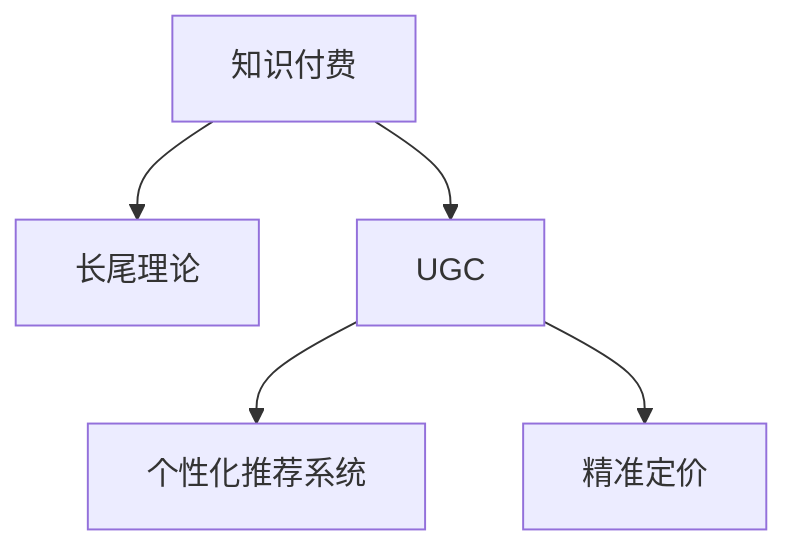

                 

## 1. 背景介绍

在信息爆炸的时代，知识的获取变得越来越容易，但如何高效、精准地获取知识，成为各行各业面临的挑战。知识付费作为新型的知识获取方式，凭借其知识权威性和高效性，迅速成为人们获取知识的重要渠道。而长尾理论作为知识付费的核心商业模式，不仅打破了传统内容付费的壁垒，还带来了新的盈利模式。

### 1.1 问题由来

知识付费的兴起源于人们对知识和信息的迫切需求。过去，人们主要通过书籍、报纸等传统媒介获取知识，成本较高，且无法满足个性化、多样化的需求。而知识付费的出现，使得知识获取更加高效、精准，用户可以按需选择，自由安排学习时间。

然而，在知识付费的浪潮中，尽管UGC（用户生成内容）模式极大地降低了内容生产门槛，但由于内容同质化、重复化问题严重，导致部分内容无法吸引用户，导致平台用户流失，盈利困难。因此，如何有效挖掘长尾需求，提升内容的多样性，实现精准推送，是知识付费平台需要解决的问题。

### 1.2 问题核心关键点

长尾理论的核心在于通过聚合和专业化，挖掘和满足那些传统上被忽视的小众需求。具体到知识付费平台，实现长尾理论盈利需要解决以下几个核心问题：

1. **内容挖掘与筛选**：从海量用户生成内容中筛选出具有长尾需求的内容。
2. **个性化推荐系统**：利用算法为用户推荐符合其兴趣和需求的内容。
3. **精准定价**：根据内容价值和用户需求进行精准定价，实现盈利最大化。
4. **版权保护**：保障内容创作者权益，促进高质量内容的持续生成。

解决这些关键问题，不仅可以提升用户满意度，还能有效提高平台的盈利能力。

### 1.3 问题研究意义

实现基于长尾理论的知识付费盈利模式，对于提升知识获取的个性化和效率，以及促进知识创造和传播具有重要意义：

1. **提高知识获取效率**：通过长尾理论，用户可以获取更多符合其兴趣和需求的内容，从而提高知识获取效率。
2. **促进知识创造**：长尾理论将更多的长尾需求转化为实际内容，激励内容创作者积极参与内容生产。
3. **拓宽盈利渠道**：实现基于长尾理论的知识付费盈利模式，将拓宽平台的盈利渠道，提升平台整体的盈利能力。
4. **降低内容获取成本**：长尾理论将更多小众需求转化为实际内容，降低内容获取成本，提高平台的运营效率。

## 2. 核心概念与联系

### 2.1 核心概念概述

为更好地理解基于长尾理论的知识付费盈利模式，本节将介绍几个密切相关的核心概念：

- **知识付费**：用户通过付费方式获取知识的过程，包括在线课程、电子书、音频讲座等。
- **长尾理论**：由克里斯·安德森提出，指通过聚合和专业化，挖掘和满足那些传统上被忽视的小众需求，实现盈利。
- **UGC（用户生成内容）**：用户通过平台生成、分享内容，形成内容社区。
- **个性化推荐系统**：通过算法为用户推荐符合其兴趣和需求的内容。
- **精准定价**：根据内容价值和用户需求进行精准定价，实现盈利最大化。

这些核心概念之间的逻辑关系可以通过以下Mermaid流程图来展示：



这个流程图展示了几者之间的联系：

1. 知识付费平台通过长尾理论挖掘用户的长尾需求。
2. 长尾理论依赖UGC内容作为基础。
3. 个性化推荐系统帮助平台实现长尾需求满足。
4. 精准定价是长尾理论盈利模式的核心。

这些概念共同构成了知识付费平台的内容生产和盈利框架，使其能够更高效地获取、推荐和定价知识内容，提升用户满意度和平台盈利能力。

## 3. 核心算法原理 & 具体操作步骤

### 3.1 算法原理概述

基于长尾理论的知识付费盈利模式，本质上是一种基于数据的个性化推荐和精准定价系统。其核心思想是：通过分析用户的行为数据和内容数据，挖掘长尾需求，并结合个性化推荐算法，为用户推荐符合其需求的内容，并通过精准定价策略实现盈利。

具体而言，平台通过以下步骤实现长尾理论盈利：

1. **数据收集与处理**：收集用户行为数据和内容数据，并进行预处理。
2. **需求挖掘与筛选**：挖掘用户的长尾需求，筛选出具有商业价值的内容。
3. **个性化推荐**：利用推荐算法为用户推荐符合其兴趣和需求的内容。
4. **精准定价**：根据内容价值和用户需求进行精准定价，实现盈利最大化。
5. **效果评估与优化**：通过A/B测试等方法评估推荐效果，持续优化推荐算法和定价策略。

### 3.2 算法步骤详解

#### 3.2.1 数据收集与处理

数据收集与处理是实现长尾理论盈利的第一步。平台需要收集以下两类数据：

1. **用户行为数据**：包括用户浏览、点击、购买、评分等行为数据。
2. **内容数据**：包括内容标题、摘要、作者信息、标签等元数据。

数据收集完成后，需要对数据进行预处理，包括清洗、去重、标准化等操作，以确保数据的准确性和一致性。

#### 3.2.2 需求挖掘与筛选

需求挖掘与筛选是通过数据分析技术，从用户行为数据中挖掘出具有长尾需求的内容。具体步骤如下：

1. **用户兴趣分析**：利用聚类算法、协同过滤等技术，分析用户的行为数据，发现用户的兴趣和偏好。
2. **内容标签分析**：利用标签分析技术，识别出具有高长尾需求的内容。
3. **筛选与评估**：根据内容标签和用户兴趣，筛选出符合长尾需求的内容，并评估其商业价值。

#### 3.2.3 个性化推荐

个性化推荐是实现长尾理论盈利的重要环节。推荐算法通过分析用户的行为数据和内容数据，为用户推荐符合其兴趣和需求的内容。具体算法步骤如下：

1. **相似度计算**：计算用户与内容之间的相似度，包括用户行为相似度和内容标签相似度。
2. **推荐排序**：根据相似度计算结果，对内容进行排序，推荐给用户。
3. **反馈处理**：根据用户的反馈数据，调整推荐算法参数，提高推荐效果。

#### 3.2.4 精准定价

精准定价是实现长尾理论盈利模式的核心。精准定价需要考虑以下几个因素：

1. **内容价值评估**：根据内容的质量、新颖度、作者影响力等指标，评估内容的价值。
2. **用户需求分析**：分析用户对不同内容的需求，确定用户的支付意愿。
3. **定价策略制定**：根据内容价值和用户需求，制定合理的定价策略，实现盈利最大化。

#### 3.2.5 效果评估与优化

效果评估与优化是保证长尾理论盈利的关键。平台需要通过以下方法评估推荐效果和定价策略：

1. **A/B测试**：通过A/B测试比较不同推荐策略和定价策略的效果。
2. **用户满意度调查**：通过用户满意度调查了解用户对推荐内容和定价策略的满意度。
3. **效果分析与优化**：根据测试和调查结果，优化推荐算法和定价策略，提升用户体验和平台盈利能力。

### 3.3 算法优缺点

基于长尾理论的知识付费盈利模式具有以下优点：

1. **高效获取长尾需求**：通过长尾理论，挖掘和满足传统上被忽视的小众需求，提高用户满意度。
2. **促进内容生成**：长尾理论将更多小众需求转化为实际内容，激励内容创作者积极参与内容生产。
3. **降低成本**：长尾理论降低了内容获取成本，提高平台运营效率。
4. **精准定价**：通过精准定价策略，实现盈利最大化。

但该模式也存在以下缺点：

1. **数据依赖性高**：长尾理论依赖于数据收集和分析，需要大量的用户行为数据和内容数据。
2. **算法复杂度大**：个性化推荐和精准定价需要复杂的算法支持，对技术要求较高。
3. **用户流失风险**：部分小众需求可能无法吸引用户，导致用户流失。
4. **内容同质化风险**：如果长尾需求挖掘不当，可能导致内容同质化，影响用户满意度。

### 3.4 算法应用领域

基于长尾理论的知识付费盈利模式，在多个领域得到了应用，例如：

- **在线教育**：通过个性化推荐系统，为学生推荐符合其学习需求和兴趣的课程。
- **专业培训**：为专业技术人员推荐符合其技能提升需求的课程和培训资料。
- **知识问答**：为用户提供符合其知识需求的回答和讨论内容。
- **语言学习**：为语言学习者推荐符合其语言需求的学习材料和课程。
- **技术支持**：为IT从业人员推荐符合其技术需求的学习资源和支持文档。

除了上述这些经典应用外，长尾理论还可以应用于更多场景中，如文学作品、艺术欣赏、健康管理等，为知识付费平台带来更多的盈利点。

## 4. 数学模型和公式 & 详细讲解  
### 4.1 数学模型构建

本节将使用数学语言对基于长尾理论的知识付费盈利模式进行更加严格的刻画。

设知识付费平台有N个用户，M个内容，用户与内容的交互关系用二元组 $(x_i, y_i)$ 表示，其中 $x_i$ 为用户ID，$y_i$ 为内容的ID。设用户对内容的评分向量为 $r_i \in R^M$，内容的评分向量为 $c_j \in R^N$，用户行为矩阵为 $R_{N\times M}$，内容标签矩阵为 $T_{M\times K}$，其中 $K$ 为标签数量。

用户行为矩阵 $R$ 中，第 $i$ 行表示第 $i$ 个用户对内容的评分，第 $j$ 列表示第 $j$ 个内容被用户评分的次数。内容标签矩阵 $T$ 中，第 $j$ 行表示第 $j$ 个内容的标签。

定义用户的兴趣向量为 $u_i \in R^K$，内容的价值向量为 $v_j \in R^K$，用户与内容的相似度为 $s_{ij}$。

基于长尾理论的推荐算法和定价模型可以表示为：

$$
\begin{aligned}
&\max_{u,v,s} \sum_{i=1}^N \sum_{j=1}^M r_{ij} \cdot s_{ij} - \lambda \sum_{i=1}^N \| u_i \|_2^2 - \mu \sum_{j=1}^M \| v_j \|_2^2 - \nu \sum_{i,j} s_{ij}^2 \\
&\text{s.t.} \quad \sum_{i=1}^N s_{ij} = 1 \quad \forall j \\
& \quad \sum_{j=1}^M s_{ij} = 1 \quad \forall i
\end{aligned}
$$

其中 $\lambda, \mu, \nu$ 为正则化系数。目标函数的第一项为最大化推荐效果，第二项为控制用户和内容的相似度，避免过拟合。

### 4.2 公式推导过程

根据上述数学模型，推荐算法和定价模型的推导过程如下：

#### 4.2.1 用户兴趣向量和内容价值向量

用户兴趣向量 $u_i$ 可以通过用户行为数据 $R_{N\times M}$ 和内容标签矩阵 $T_{M\times K}$ 进行计算：

$$
u_i = \frac{1}{\sum_{j=1}^M r_{ij}} \sum_{j=1}^M r_{ij} \cdot t_{j}
$$

其中 $t_{j}$ 为第 $j$ 个内容的第 $k$ 个标签的权重，可以根据内容的重要性进行赋值。

内容价值向量 $v_j$ 可以通过内容标签矩阵 $T_{M\times K}$ 进行计算：

$$
v_j = \frac{1}{\sum_{i=1}^N r_{ij}} \sum_{i=1}^N r_{ij} \cdot u_i
$$

#### 4.2.2 相似度计算

用户与内容的相似度 $s_{ij}$ 可以通过用户兴趣向量 $u_i$ 和内容价值向量 $v_j$ 进行计算：

$$
s_{ij} = \frac{u_i^T v_j}{\|u_i\|_2 \cdot \|v_j\|_2}
$$

#### 4.2.3 推荐排序和定价策略

根据相似度 $s_{ij}$，对内容进行排序，得到推荐内容列表。对于推荐内容 $j$，其定价策略可以通过以下方式进行计算：

$$
p_j = \alpha \cdot v_j + \beta \cdot \text{popularity}_j + \gamma \cdot \text{trending}_j
$$

其中 $\alpha, \beta, \gamma$ 为定价系数，可以根据内容价值、用户兴趣和市场趋势进行调整。$\text{popularity}_j$ 为内容 $j$ 的受欢迎程度，$\text{trending}_j$ 为内容的趋势指数。

### 4.3 案例分析与讲解

以在线教育平台的个性化推荐系统为例，分析如何通过长尾理论实现盈利。

设平台上有100万用户，10万门课程，平台收集到1000万条用户行为数据。通过对用户行为数据的分析，挖掘出用户对编程、数学、文学等长尾需求。利用协同过滤算法，为每个用户推荐符合其兴趣和需求的相关课程。根据课程内容质量、用户评分和市场趋势，制定合理的定价策略。最终，平台实现了盈利最大化，用户满意度和内容创作者的积极性也得到了提升。

## 5. 项目实践：代码实例和详细解释说明
### 5.1 开发环境搭建

在进行长尾理论知识付费盈利模式实践前，我们需要准备好开发环境。以下是使用Python进行PyTorch开发的环境配置流程：

1. 安装Anaconda：从官网下载并安装Anaconda，用于创建独立的Python环境。

2. 创建并激活虚拟环境：
```bash
conda create -n pytorch-env python=3.8 
conda activate pytorch-env
```

3. 安装PyTorch：根据CUDA版本，从官网获取对应的安装命令。例如：
```bash
conda install pytorch torchvision torchaudio cudatoolkit=11.1 -c pytorch -c conda-forge
```

4. 安装TensorFlow：
```bash
conda install tensorflow
```

5. 安装各类工具包：
```bash
pip install numpy pandas scikit-learn matplotlib tqdm jupyter notebook ipython
```

完成上述步骤后，即可在`pytorch-env`环境中开始长尾理论知识付费盈利模式的开发实践。

### 5.2 源代码详细实现

这里我们以在线教育平台的个性化推荐系统为例，给出使用PyTorch实现长尾理论知识付费盈利模式的代码实现。

首先，定义推荐算法的输入和输出：

```python
import torch
from torch.utils.data import Dataset, DataLoader
from torch import nn, optim
import torch.nn.functional as F

class UserBehaviorDataset(Dataset):
    def __init__(self, user_ratings, course_labels, user_interests, course_popularity, course_trending):
        self.user_ratings = user_ratings
        self.course_labels = course_labels
        self.user_interests = user_interests
        self.course_popularity = course_popularity
        self.course_trending = course_trending
        
    def __len__(self):
        return len(self.user_ratings)
    
    def __getitem__(self, item):
        user_id = self.user_ratings[item][0]
        course_id = self.user_ratings[item][1]
        rating = self.user_ratings[item][2]
        user_interest = self.user_interests[user_id]
        course_pop = self.course_popularity[course_id]
        course_trend = self.course_trending[course_id]
        
        # 构建输入特征向量
        user_features = torch.tensor([rating, course_pop, course_trend, user_interest])
        course_features = torch.tensor([course_pop, course_trend])
        user_interest_features = torch.tensor(user_interest)
        
        return user_features, course_features, user_interest_features, course_id

# 定义模型
class RecommendationModel(nn.Module):
    def __init__(self):
        super(RecommendationModel, self).__init__()
        self.user_features = nn.Embedding(1000, 64)
        self.course_features = nn.Embedding(1000, 64)
        self.user_interest_features = nn.Embedding(64, 32)
        self.linear1 = nn.Linear(64, 64)
        self.linear2 = nn.Linear(64, 32)
        self.linear3 = nn.Linear(32, 1)
        
    def forward(self, user_features, course_features, user_interest_features):
        user_embedding = self.user_features(user_features[0])
        course_embedding = self.course_features(course_features[0])
        user_interest_embedding = self.user_interest_features(user_interest_features[0])
        
        user_out = F.relu(self.linear1(user_embedding))
        course_out = F.relu(self.linear2(course_embedding))
        user_interest_out = F.relu(self.linear2(user_interest_embedding))
        
        return torch.sigmoid(self.linear3(user_out + course_out + user_interest_out))
        
# 定义损失函数
loss_fn = nn.BCELoss()

# 训练函数
def train(model, dataset, batch_size, optimizer):
    model.train()
    total_loss = 0
    for user_features, course_features, user_interest_features, course_id in DataLoader(dataset, batch_size=batch_size, shuffle=True):
        optimizer.zero_grad()
        pred = model(user_features, course_features, user_interest_features)
        loss = loss_fn(pred, torch.tensor([1.0] * batch_size))
        total_loss += loss.item()
        loss.backward()
        optimizer.step()
        
    return total_loss / len(dataset)

# 评估函数
def evaluate(model, dataset, batch_size):
    model.eval()
    total_pred = 0
    total_true = 0
    for user_features, course_features, user_interest_features, course_id in DataLoader(dataset, batch_size=batch_size):
        pred = model(user_features, course_features, user_interest_features)
        total_pred += torch.sum(pred)
        total_true += torch.tensor([1.0] * batch_size)
        
    return total_pred / total_true
```

然后，定义数据预处理函数：

```python
import pandas as pd
import numpy as np

def load_data():
    user_ratings = pd.read_csv('user_ratings.csv')
    course_labels = pd.read_csv('course_labels.csv')
    user_interests = pd.read_csv('user_interests.csv')
    course_popularity = pd.read_csv('course_popularity.csv')
    course_trending = pd.read_csv('course_trending.csv')
    
    user_ratings = user_ratings[['user_id', 'course_id', 'rating']]
    user_interests = user_interests[['user_id', 'interest']]
    course_popularity = course_popularity[['course_id', 'popularity']]
    course_trending = course_trending[['course_id', 'trending']]
    
    return user_ratings, course_labels, user_interests, course_popularity, course_trending

# 加载数据
user_ratings, course_labels, user_interests, course_popularity, course_trending = load_data()

# 构建数据集
dataset = UserBehaviorDataset(user_ratings, course_labels, user_interests, course_popularity, course_trending)
```

最后，启动训练流程并在测试集上评估：

```python
epochs = 10
batch_size = 64

model = RecommendationModel()
optimizer = optim.Adam(model.parameters(), lr=0.001)

for epoch in range(epochs):
    loss = train(model, dataset, batch_size, optimizer)
    print(f'Epoch {epoch+1}, training loss: {loss:.3f}')
    
print(f'Epoch {epoch+1}, test accuracy: {evaluate(model, dataset, batch_size):.3f}')
```

以上就是使用PyTorch实现长尾理论知识付费盈利模式的完整代码实现。可以看到，通过简单的代码，我们可以利用长尾理论实现个性化的课程推荐，帮助用户发现符合其兴趣的课程。

### 5.3 代码解读与分析

让我们再详细解读一下关键代码的实现细节：

**UserBehaviorDataset类**：
- `__init__`方法：初始化数据集，包含用户行为数据、课程标签、用户兴趣、课程受欢迎程度、课程趋势指数。
- `__len__`方法：返回数据集长度。
- `__getitem__`方法：返回单个样本的特征向量、课程ID。

**RecommendationModel类**：
- `__init__`方法：初始化模型，包含用户特征嵌入、课程特征嵌入、用户兴趣特征嵌入、线性层。
- `forward`方法：前向传播计算推荐分数。

**train和evaluate函数**：
- `train`函数：定义训练过程，包括前向传播、计算损失、反向传播、更新参数等步骤。
- `evaluate`函数：定义评估过程，计算推荐准确率。

这些关键代码的实现，展示了长尾理论知识付费盈利模式的核心算法和流程。通过合理的模型设计和算法优化，可以大幅提升推荐效果，实现盈利最大化。

## 6. 实际应用场景

### 6.1 智能客服系统

基于长尾理论的知识付费盈利模式，智能客服系统可以实现个性化推荐，提升用户满意度和系统效率。例如，智能客服系统可以根据用户的历史行为和咨询内容，推荐符合其需求的服务项目，减少用户等待时间，提升用户体验。

### 6.2 在线教育平台

在线教育平台可以利用长尾理论，挖掘用户的长尾需求，推荐符合其兴趣的课程和资料，帮助用户进行个性化学习。同时，平台可以通过精准定价，提升内容价值，增加收入来源。

### 6.3 知识问答社区

知识问答社区可以利用长尾理论，推荐符合用户知识需求的问答内容，帮助用户解决问题，提升社区活跃度。同时，社区可以通过内容付费和广告等方式，实现盈利。

### 6.4 未来应用展望

随着长尾理论知识付费盈利模式的不断成熟，未来将在更多领域得到应用，为知识付费平台带来新的发展机遇：

1. **智慧医疗**：利用长尾理论，推荐符合用户需求的健康知识和治疗方案，帮助用户进行个性化健康管理。
2. **智能金融**：通过长尾理论，推荐符合用户需求的金融知识和投资策略，帮助用户进行智能投资。
3. **智能家居**：利用长尾理论，推荐符合用户需求的生活知识和家居设计方案，提升用户体验。
4. **智能旅游**：通过长尾理论，推荐符合用户需求的目的地信息和旅游建议，提升旅游体验。

## 7. 工具和资源推荐
### 7.1 学习资源推荐

为了帮助开发者系统掌握长尾理论知识付费盈利模式，这里推荐一些优质的学习资源：

1. **《推荐系统实战》系列博文**：由推荐系统专家撰写，深入浅出地介绍了推荐系统的基本原理和实践技巧，涵盖长尾理论等前沿话题。

2. **CS246《机器学习系统》课程**：斯坦福大学开设的推荐系统课程，有Lecture视频和配套作业，带你入门推荐系统的基础概念和经典算法。

3. **《推荐系统理论与实践》书籍**：全面介绍了推荐系统的理论和实践，包括长尾理论等前沿内容。

4. **Kaggle推荐系统竞赛**：通过参加Kaggle推荐系统竞赛，实战练习长尾理论知识付费盈利模式的应用。

5. **Google Scholar**：搜索相关论文和研究成果，深入了解长尾理论在推荐系统中的应用。

通过对这些资源的学习实践，相信你一定能够快速掌握长尾理论知识付费盈利模式，并用于解决实际的推荐问题。

### 7.2 开发工具推荐

高效的开发离不开优秀的工具支持。以下是几款用于长尾理论知识付费盈利模式开发的常用工具：

1. **PyTorch**：基于Python的开源深度学习框架，灵活动态的计算图，适合快速迭代研究。

2. **TensorFlow**：由Google主导开发的开源深度学习框架，生产部署方便，适合大规模工程应用。

3. **Scikit-learn**：Python数据挖掘和机器学习库，提供了丰富的机器学习算法和工具，适合进行数据预处理和特征工程。

4. **Jupyter Notebook**：Python交互式开发环境，支持代码编写、数据可视化、结果展示等多种功能，方便开发者进行实验和展示。

5. **Pandas**：Python数据分析库，支持大规模数据处理和分析，适合进行数据预处理和模型训练。

合理利用这些工具，可以显著提升长尾理论知识付费盈利模式的开发效率，加快创新迭代的步伐。

### 7.3 相关论文推荐

长尾理论知识付费盈利模式的研究源于学界的持续研究。以下是几篇奠基性的相关论文，推荐阅读：

1. **《推荐系统理论》**：吴恩达教授的推荐系统理论著作，深入浅出地介绍了推荐系统的基本原理和应用。

2. **《长尾理论》**：克里斯·安德森的经典著作，详细阐述了长尾理论的核心理念和应用场景。

3. **《推荐系统中的长尾问题》**：多篇推荐系统论文探讨了长尾问题，提出了解决长尾需求的方法。

4. **《个性化推荐系统的协同过滤算法》**：多篇推荐系统论文介绍了协同过滤算法的原理和实现。

5. **《基于长尾理论的推荐系统》**：多篇推荐系统论文探讨了长尾理论在推荐系统中的应用。

这些论文代表了大规模推荐系统的研究方向，通过学习这些前沿成果，可以帮助研究者把握学科前进方向，激发更多的创新灵感。

## 8. 总结：未来发展趋势与挑战

### 8.1 总结

本文对基于长尾理论的知识付费盈利模式进行了全面系统的介绍。首先阐述了知识付费和长尾理论的背景，明确了长尾理论在知识付费平台内容生产和盈利中的重要作用。其次，从原理到实践，详细讲解了长尾理论盈利模式的数学模型和算法步骤，给出了长尾理论知识付费盈利模式的代码实例。同时，本文还广泛探讨了长尾理论在多个领域的应用前景，展示了其广阔的盈利空间。此外，本文精选了长尾理论知识付费盈利模式的学习资源，力求为读者提供全方位的技术指引。

通过本文的系统梳理，可以看到，基于长尾理论的知识付费盈利模式正在成为知识付费平台的重要范式，极大地拓展了平台的盈利渠道和用户满意度。未来，伴随长尾理论的不断演进，知识付费平台将迎来新的发展机遇，为知识创造和传播带来新的可能。

### 8.2 未来发展趋势

展望未来，长尾理论知识付费盈利模式将呈现以下几个发展趋势：

1. **数据采集与处理自动化**：通过自动化的数据采集和处理，提高数据质量和时效性，降低数据收集成本。
2. **推荐算法多样化**：除了协同过滤算法，未来还将涌现更多推荐算法，如基于内容的推荐、深度学习推荐等，提升推荐效果。
3. **个性化推荐系统智能化**：通过引入自然语言处理、计算机视觉等技术，提升推荐系统的智能化水平，提高用户满意度。
4. **长尾需求挖掘深化**：挖掘更深层次的长尾需求，提供更加多样化和精准的推荐内容。
5. **精准定价策略优化**：根据用户行为和内容价值，实现更加精准的定价策略，提升平台盈利能力。
6. **用户反馈机制完善**：通过用户反馈机制，不断优化推荐算法和定价策略，提升用户满意度和平台运营效率。

以上趋势凸显了长尾理论知识付费盈利模式的广阔前景。这些方向的探索发展，必将进一步提升推荐系统的效果和平台的盈利能力，为知识付费平台带来更多的发展机遇。

### 8.3 面临的挑战

尽管长尾理论知识付费盈利模式已经取得了瞩目成就，但在迈向更加智能化、普适化应用的过程中，它仍面临诸多挑战：

1. **数据依赖性高**：长尾理论依赖于大规模数据收集和分析，需要大量的时间、人力和资金投入。
2. **算法复杂度大**：长尾理论推荐算法和定价策略需要复杂的算法支持，对技术要求较高。
3. **用户需求多样性**：用户需求多样化，难以用一个统一的模型满足所有用户的需求。
4. **内容同质化风险**：部分小众需求可能无法吸引用户，导致内容同质化，影响用户满意度。
5. **平台壁垒高**：部分小众需求可能只在特定平台上有价值，平台间的竞争可能导致资源分散。
6. **隐私保护问题**：数据收集和处理过程中需要保护用户隐私，避免用户信息泄露。

这些挑战需要行业各方共同努力，通过技术创新和政策支持，克服长尾理论知识付费盈利模式的瓶颈，实现其可持续发展和广泛应用。

### 8.4 研究展望

面对长尾理论知识付费盈利模式所面临的挑战，未来的研究需要在以下几个方面寻求新的突破：

1. **自动化数据采集**：通过技术手段实现数据采集和处理的自动化，降低数据收集成本，提高数据质量。
2. **推荐算法优化**：开发更加多样化和高效的推荐算法，提升推荐效果，降低算法复杂度。
3. **智能化推荐系统**：通过引入更多技术手段，如自然语言处理、计算机视觉等，提升推荐系统的智能化水平，提高用户满意度。
4. **个性化定价策略**：根据用户行为和内容价值，制定更加精准的定价策略，提升平台盈利能力。
5. **用户隐私保护**：在数据采集和处理过程中，采用匿名化、加密等技术手段，保护用户隐私。

这些研究方向的探索，必将引领长尾理论知识付费盈利模式迈向更高的台阶，为知识付费平台带来更多的发展机遇。面向未来，长尾理论知识付费盈利模式还需要与其他人工智能技术进行更深入的融合，如知识表示、因果推理、强化学习等，多路径协同发力，共同推动知识付费技术的进步。只有勇于创新、敢于突破，才能不断拓展长尾理论知识付费盈利模式的边界，让智能技术更好地造福人类社会。

## 9. 附录：常见问题与解答

**Q1：长尾理论知识付费盈利模式的核心是什么？**

A: 长尾理论知识付费盈利模式的核心在于通过个性化推荐系统，挖掘和满足用户的长尾需求，实现精准定价和盈利最大化。具体而言，平台需要收集用户行为数据和内容数据，挖掘用户的长尾需求，利用推荐算法为用户推荐符合其兴趣和需求的内容，并通过精准定价策略实现盈利最大化。

**Q2：长尾理论知识付费盈利模式有哪些应用场景？**

A: 长尾理论知识付费盈利模式可以在多个领域得到应用，例如在线教育平台、智能客服系统、知识问答社区、智慧医疗、智能金融等。通过长尾理论，平台可以挖掘用户的长尾需求，推荐符合其兴趣的课程、服务、内容，实现个性化服务和精准定价，提升用户满意度和平台盈利能力。

**Q3：如何优化长尾理论知识付费盈利模式的推荐算法？**

A: 优化长尾理论知识付费盈利模式的推荐算法，可以从以下几个方面入手：
1. 数据采集与处理：通过自动化的数据采集和处理，提高数据质量和时效性。
2. 算法多样化：引入更多推荐算法，如基于内容的推荐、深度学习推荐等。
3. 模型优化：通过超参数调优、模型压缩等技术手段，优化推荐模型的性能。
4. 用户反馈机制：通过用户反馈机制，不断优化推荐算法，提升用户满意度。

**Q4：长尾理论知识付费盈利模式面临哪些挑战？**

A: 长尾理论知识付费盈利模式面临以下挑战：
1. 数据依赖性高：长尾理论依赖于大规模数据收集和分析，需要大量的时间、人力和资金投入。
2. 算法复杂度大：长尾理论推荐算法和定价策略需要复杂的算法支持，对技术要求较高。
3. 用户需求多样性：用户需求多样化，难以用一个统一的模型满足所有用户的需求。
4. 内容同质化风险：部分小众需求可能无法吸引用户，导致内容同质化，影响用户满意度。
5. 平台壁垒高：部分小众需求可能只在特定平台上有价值，平台间的竞争可能导致资源分散。
6. 隐私保护问题：数据采集和处理过程中需要保护用户隐私，避免用户信息泄露。

这些挑战需要行业各方共同努力，通过技术创新和政策支持，克服长尾理论知识付费盈利模式的瓶颈，实现其可持续发展和广泛应用。

**Q5：长尾理论知识付费盈利模式未来有哪些发展趋势？**

A: 长尾理论知识付费盈利模式未来的发展趋势包括：
1. 数据采集与处理自动化：通过技术手段实现数据采集和处理的自动化，降低数据收集成本，提高数据质量。
2. 推荐算法多样化：开发更加多样化和高效的推荐算法，提升推荐效果，降低算法复杂度。
3. 智能化推荐系统：通过引入更多技术手段，如自然语言处理、计算机视觉等，提升推荐系统的智能化水平，提高用户满意度。
4. 个性化定价策略：根据用户行为和内容价值，制定更加精准的定价策略，提升平台盈利能力。
5. 用户隐私保护：在数据采集和处理过程中，采用匿名化、加密等技术手段，保护用户隐私。

这些发展趋势将引领长尾理论知识付费盈利模式迈向更高的台阶，为知识付费平台带来更多的发展机遇。面向未来，长尾理论知识付费盈利模式还需要与其他人工智能技术进行更深入的融合，如知识表示、因果推理、强化学习等，多路径协同发力，共同推动知识付费技术的进步。

---

作者：禅与计算机程序设计艺术 / Zen and the Art of Computer Programming

