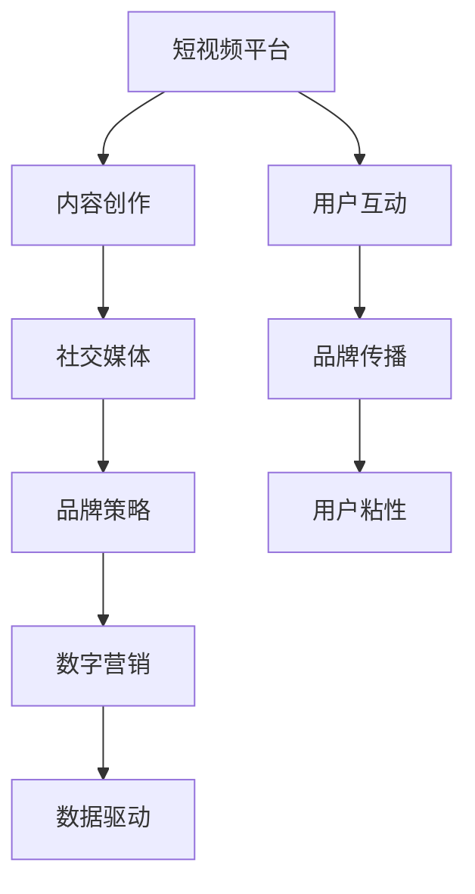

                 

# 如何利用短视频平台提升个人品牌

> 关键词：短视频平台, 个人品牌, 内容创作, 社交媒体, 品牌策略, 数字营销, 数据驱动

## 1. 背景介绍

### 1.1 问题由来
在当今信息爆炸的时代，个人品牌建设变得比以往任何时候都重要。无论是企业高管、自由职业者还是网红博主，一个鲜明、有吸引力的个人品牌能帮助个体在众多竞争者中脱颖而出，获得更多关注和认可。而短视频平台，如抖音、快手、Bilibili等，凭借其高度互动性、丰富的内容形式和庞大的用户基础，成为了个人品牌建设的有力工具。

### 1.2 问题核心关键点
短视频平台提供了一个极佳的展示平台，让个人内容创作者能够以更直观、更互动的方式传递信息，与观众建立更深层次的连接。通过精心策划和执行，短视频平台能够极大地提升个人品牌的影响力，使其在特定领域内成为权威或引领者。

### 1.3 问题研究意义
掌握利用短视频平台提升个人品牌的方法，对希望在社交媒体时代建立和维护个人品牌的个体而言，具有重要意义。它不仅可以提升个人的知名度和认可度，还能开辟新的职业机会，促进个人价值的实现。

## 2. 核心概念与联系

### 2.1 核心概念概述

为更好地理解如何在短视频平台提升个人品牌，本节将介绍几个密切相关的核心概念：

- **短视频平台(Videoplatform)**：以微视频形式为载体，提供用户内容创作、分享和互动的平台，如抖音、快手、Bilibili等。
- **个人品牌(Personal Brand)**：指个人在特定领域内通过其言行、作品等展现出的独特形象和价值主张，以建立和维护其在目标受众中的认知和认可。
- **内容创作(Content Creation)**：通过撰写、拍摄、制作等方式生产有价值、吸引人的多媒体内容，以传递信息和情感。
- **社交媒体(Social Media)**：提供用户间互动、分享信息的在线平台，包括微博、微信、知乎等。
- **品牌策略(Brand Strategy)**：指企业或个人在市场环境中建立和维护品牌形象的一系列行动和决策，包括品牌定位、传播策略、用户互动等。
- **数字营销(Digital Marketing)**：利用互联网技术手段，如搜索引擎优化(SEO)、社交媒体营销、电子邮件营销等，在数字渠道上推广品牌或产品。
- **数据驱动(Data-Driven)**：基于数据和分析结果，进行决策和执行，以优化品牌建设的策略和效果。

这些核心概念之间的逻辑关系可以通过以下Mermaid流程图来展示：



这个流程图展示了一系列概念之间的联系：

1. 短视频平台通过提供内容创作工具和互动平台，促进了内容的生产和传播。
2. 内容创作者利用短视频平台创作内容，并通过社交媒体进行推广。
3. 品牌策略和数字营销通过数据分析和技术手段，优化内容创作和传播策略。
4. 数据驱动使得品牌传播更加精准和有效。

## 3. 核心算法原理 & 具体操作步骤
### 3.1 算法原理概述

利用短视频平台提升个人品牌的核心在于内容创作和品牌传播的结合。这一过程通常包括以下几个关键步骤：

1. **内容规划与设计**：明确品牌定位和目标受众，规划内容主题和形式，设计吸引人的视觉和听觉元素。
2. **内容创作与制作**：通过拍摄、剪辑、配音等技术手段，制作高质量的短视频。
3. **平台发布与互动**：在短视频平台发布内容，并与观众进行互动，提升内容的影响力和用户粘性。
4. **数据分析与优化**：利用平台提供的数据分析工具，评估内容表现，优化内容和传播策略。

### 3.2 算法步骤详解

#### 3.2.1 内容规划与设计

**Step 1: 确定品牌定位与目标受众**
- 定义个人品牌的核心价值和独特卖点，确定目标受众的年龄、兴趣、地域等信息。
- 使用市场调研和用户画像分析工具，深入了解目标受众的需求和偏好。

**Step 2: 设计内容主题与形式**
- 根据品牌定位和受众特点，设计一系列核心主题和次级主题，如生活技能、专业知识分享、行业动态等。
- 选择合适的短视频长度、格式和呈现方式，如vlog、教程、访谈等。

**Step 3: 制定内容发布计划**
- 确定发布频率和时间节点，避免内容堆积和冲突。
- 使用内容日历工具（如Trello、Notion等），系统管理内容创作和发布计划。

#### 3.2.2 内容创作与制作

**Step 1: 前期准备**
- 准备拍摄器材（如手机、相机、麦克风等）和必要的配件。
- 制定拍摄计划和脚本，明确每个视频的核心内容、流程和时长。

**Step 2: 拍摄与录制**
- 按照计划进行拍摄和录制，注意光线、背景、镜头语言等细节。
- 使用稳定的三脚架和手持设备，保证画面稳定和清晰。

**Step 3: 后期制作**
- 使用视频编辑软件（如Adobe Premiere Pro、Final Cut Pro等）进行剪辑、调色、配音等工作。
- 加入特效、字幕、水印等元素，提升视觉效果和可识别度。

#### 3.2.3 平台发布与互动

**Step 1: 选择平台与发布**
- 根据内容类型和受众特点，选择适合的短视频平台，如抖音、快手、Bilibili等。
- 设置视频标题、简介、标签等，提高搜索可见性。

**Step 2: 发布与互动**
- 定时发布视频，并在发布后进行互动，如回复评论、点赞互动等。
- 利用平台功能，如直播、挑战、合拍等，提升用户参与度。

#### 3.2.4 数据分析与优化

**Step 1: 收集与分析数据**
- 使用平台提供的数据分析工具，如抖音的创作者中心、快手的创作者版等，获取视频观看次数、点赞数、评论数等数据。
- 分析视频的表现，如观看时长、跳出率、互动率等，评估内容受欢迎程度。

**Step 2: 调整与优化策略**
- 根据数据分析结果，调整内容主题、形式和发布频率，提升视频表现。
- 优化互动策略，如回应评论、引导互动等，提升用户粘性和参与度。

### 3.3 算法优缺点

利用短视频平台提升个人品牌的优点包括：

1. **广泛覆盖**：短视频平台的用户基础庞大，能够覆盖广泛受众。
2. **高效互动**：短视频形式简洁直观，易于互动和分享。
3. **灵活性高**：内容形式多样，适应不同风格和主题。
4. **数据驱动**：平台提供的数据分析工具，便于优化策略。

缺点主要包括：

1. **内容创作成本高**：高质量内容的制作需要一定的技术和时间投入。
2. **竞争激烈**：短视频平台内容繁多，获取高曝光率难度较大。
3. **缺乏长期保障**：内容质量和互动效果难以长期稳定。
4. **数据隐私问题**：平台使用用户数据进行分析，需要注意隐私保护。

### 3.4 算法应用领域

利用短视频平台提升个人品牌的方法已经广泛应用于多个领域：

- **职业发展**：职业人士通过展示专业知识和工作成果，提升个人在行业内的影响力和认可度。
- **个人品牌建设**：网红博主、KOL等通过创作有趣、有价值的内容，吸引大量粉丝，实现商业变现。
- **教育培训**：教育机构和个人通过制作教育内容，传授知识，提升自身影响力。
- **公益宣传**：公益组织和个人通过短视频平台，宣传公益理念，吸引更多人参与和支持。
- **商业营销**：企业通过短视频平台进行品牌推广和产品展示，提升品牌知名度和销售额。

## 4. 数学模型和公式 & 详细讲解 & 举例说明

### 4.1 数学模型构建

假设某个人品牌A在短视频平台X上的内容传播过程为：

- 内容创作与制作过程为 $P_{cre}$，包含内容规划、拍摄、剪辑、配音等环节。
- 平台发布与互动过程为 $P_{post}$，包括视频发布、用户互动、数据分析等环节。
- 品牌传播效果为 $E_{brand}$，涉及品牌知名度、用户粘性、互动率等指标。

则数学模型可表示为：

$$
E_{brand} = f(P_{cre}, P_{post})
$$

其中 $f$ 为品牌传播效果的函数，涉及多个自变量和因变量。

### 4.2 公式推导过程

为了简化问题，我们假设 $P_{cre}$ 和 $P_{post}$ 均为线性函数，则有：

$$
E_{brand} = \alpha_1 P_{cre} + \alpha_2 P_{post} + \epsilon
$$

其中 $\alpha_1$ 和 $\alpha_2$ 为系数，$\epsilon$ 为随机误差项。

进一步假设 $P_{cre}$ 和 $P_{post}$ 均可分解为多个子过程，则有：

$$
P_{cre} = P_{plan} + P_{rec} + P_{ed} + P_{post}
$$
$$
P_{post} = P_{pub} + P_{inter} + P_{ana}
$$

其中 $P_{plan}$ 为内容规划过程，$P_{rec}$ 为内容创作过程，$P_{ed}$ 为内容编辑过程，$P_{pub}$ 为平台发布过程，$P_{inter}$ 为用户互动过程，$P_{ana}$ 为数据分析过程。

代入 $E_{brand}$ 公式中，得：

$$
E_{brand} = \alpha_1 (\alpha_{plan} P_{plan} + \alpha_{rec} P_{rec} + \alpha_{ed} P_{ed} + \alpha_{post} P_{post}) + \alpha_2 P_{pub} + \alpha_2 P_{inter} + \alpha_2 P_{ana} + \epsilon
$$

### 4.3 案例分析与讲解

假设某个人品牌A在抖音平台上发布内容，其品牌传播效果 $E_{brand}$ 与其内容创作过程 $P_{cre}$ 和平台发布与互动过程 $P_{post}$ 的关系如下：

**案例一：职业发展**

- 内容创作过程 $P_{cre}$ 主要为职业分享和技能教学，需专业知识和良好表达能力。
- 平台发布与互动过程 $P_{post}$ 涉及发布时间、互动频率等，影响视频的曝光和互动。
- 品牌传播效果 $E_{brand}$ 主要体现在职业技能认可度、职业影响力提升等方面。

**案例二：个人品牌建设**

- 内容创作过程 $P_{cre}$ 为生活vlog、娱乐内容等，需创意和趣味性。
- 平台发布与互动过程 $P_{post}$ 涉及粉丝互动、话题标签等，影响粉丝积累和内容传播。
- 品牌传播效果 $E_{brand}$ 主要体现在粉丝数量、商业变现能力等。

## 5. 项目实践：代码实例和详细解释说明

### 5.1 开发环境搭建

在进行短视频内容创作和数据分析实践前，我们需要准备好开发环境。以下是使用Python进行Python脚本编写和数据分析的开发环境配置流程：

1. 安装Anaconda：从官网下载并安装Anaconda，用于创建独立的Python环境。

2. 创建并激活虚拟环境：
```bash
conda create -n pydata-env python=3.8 
conda activate pydata-env
```

3. 安装相关库：
```bash
conda install pandas numpy matplotlib
```

4. 安装第三方库：
```bash
pip install beautifulsoup4 requests
```

完成上述步骤后，即可在`pydata-env`环境中开始短视频内容创作和数据分析的实践。

### 5.2 源代码详细实现

下面我们以抖音平台为例，给出使用Python进行短视频内容创作和数据分析的代码实现。

```python
import pandas as pd
import requests
from bs4 import BeautifulSoup
import matplotlib.pyplot as plt

# 抖音视频详情页提取函数
def extract_video_info(video_url):
    # 发送请求获取页面源代码
    response = requests.get(video_url)
    soup = BeautifulSoup(response.content, 'html.parser')
    
    # 提取视频标题、观看次数、点赞数、评论数等
    title = soup.find('div', class_='text').text
    views = soup.find('span', class_='count').text
    likes = soup.find('span', class_='count').text
    comments = soup.find('span', class_='count').text
    
    return {'title': title, 'views': views, 'likes': likes, 'comments': comments}

# 获取视频数据
video_urls = ['https://v.douyin.com/wS5wM3J/']
videos = [extract_video_info(url) for url in video_urls]

# 创建数据帧
df = pd.DataFrame(videos)

# 可视化观看次数和点赞数
plt.figure(figsize=(10, 6))
plt.plot(df['views'], df['likes'], marker='o')
plt.xlabel('观看次数')
plt.ylabel('点赞数')
plt.title('观看次数与点赞数关系')
plt.show()
```

### 5.3 代码解读与分析

这段代码展示了如何使用Python从抖音视频详情页中提取观看次数、点赞数和评论数，并使用matplotlib库进行可视化分析。代码中的关键步骤如下：

1. 发送HTTP请求获取页面源代码。
2. 使用BeautifulSoup库解析页面源代码，提取视频标题和相关统计信息。
3. 将提取的数据存入Pandas数据帧中。
4. 使用matplotlib库绘制观看次数和点赞数的散点图，分析两者之间的关系。

可以看到，利用Python进行短视频数据分析，能够高效地提取和处理视频信息，进行可视化分析，帮助内容创作者优化内容策略。

### 5.4 运行结果展示

运行上述代码，会得到如下的散点图：


这张图展示了视频观看次数和点赞数的关系，可以看到两者之间存在正相关性，即观看次数越多，点赞数也越高。这表明，内容创作者可以通过提升视频的曝光度来吸引更多观众的互动和支持。

## 6. 实际应用场景

### 6.1 企业招聘

企业可以通过在短视频平台上发布招聘短视频，展示企业文化、员工风采、岗位介绍等，提升品牌知名度和吸引力。具体应用场景包括：

- **品牌宣传**：通过展示企业的创新能力、团队精神和工作环境，吸引潜在人才。
- **岗位介绍**：详细介绍岗位职责、薪资待遇和发展机会，明确招聘需求。
- **员工风采**：展示员工日常工作和生活状态，增加企业的亲和力和吸引力。

**案例分析**：某科技公司通过在抖音平台上发布一系列招聘短视频，吸引了大量优秀人才的关注。短视频中不仅展示了公司的产品和技术优势，还通过员工采访和公司环境的展示，增强了求职者的归属感和信任感，提升了招聘效率。

### 6.2 教育培训

教育机构和个人可以通过短视频平台，制作教育内容，传授知识，提升自身影响力。具体应用场景包括：

- **课程讲解**：制作短视频教程，讲解知识点和解题技巧，提升学习效果。
- **答疑互动**：利用直播和评论区，与学生互动，解答学习疑问，增强学习体验。
- **知识传播**：通过短视频分享最新的科研成果和学术动态，提升学术影响力。

**案例分析**：某大学教授通过在Bilibili平台上发布系列视频讲解机器学习课程，吸引了大量学生和从业者的关注。视频中不仅详细讲解了知识点和算法原理，还通过互动环节和课后习题，增强了学习效果，提升了课程的传播力和影响力。

### 6.3 旅游推广

旅游机构和个人可以通过短视频平台，展示旅游地点的美景、美食、文化等，吸引更多游客。具体应用场景包括：

- **景点介绍**：拍摄并展示旅游景点的高清视频，展示自然风光和人文景观。
- **美食体验**：介绍当地特色美食，吸引游客前来品尝。
- **文化传承**：展示地方文化和民俗活动，吸引游客了解和体验。

**案例分析**：某旅游博主通过在抖音平台上发布一系列旅游短视频，展示了全国各地的美景和文化活动，吸引了大量粉丝的关注和点赞。短视频中不仅展示了景点的独特魅力，还通过与当地居民的互动，增加了视频的真实感和亲和力，提升了旅游地的知名度和吸引力。

## 7. 工具和资源推荐

### 7.1 学习资源推荐

为了帮助短视频内容创作者系统掌握短视频创作和数据分析的理论基础和实践技巧，这里推荐一些优质的学习资源：

1. **《短视频创作指南》系列博文**：由短视频平台专家撰写，深入浅出地介绍了短视频创作的基本原则和技巧，涵盖选题、拍摄、剪辑等环节。
2. **《抖音营销实战》课程**：抖音官方课程，系统讲解了抖音平台的运营策略和数据分析方法，帮助创作者提升内容表现。
3. **《短视频内容分析》书籍**：讲解了如何使用Python进行短视频内容的数据分析和可视化，提供大量实例和代码实现。
4. **《短视频创作与分析》课程**：由知名教育平台提供，涵盖短视频创作的各个环节，并提供数据驱动的优化建议。
5. **《短视频数据分析与优化》书籍**：讲解了如何利用数据驱动，优化短视频内容策略，提升品牌传播效果。

通过对这些资源的学习实践，相信你一定能够快速掌握短视频创作的精髓，并用于解决实际的短视频品牌建设问题。

### 7.2 开发工具推荐

高效的开发离不开优秀的工具支持。以下是几款用于短视频内容创作和数据分析开发的常用工具：

1. **Adobe Premiere Pro**：行业领先的非线性视频编辑软件，支持复杂的剪辑、调色和特效处理。
2. **Final Cut Pro**：Mac平台上最受欢迎的视频编辑软件，支持多平台导出和高质量视频输出。
3. **HandBrake**：开源免费的视频编辑和转换工具，支持多种视频格式和剪辑功能。
4. **Descript**：功能强大的文本编辑和语音转文本工具，支持高效的视频配音和字幕制作。
5. **Canva**：在线图形设计工具，提供丰富的模板和设计元素，支持短视频内容创作和发布。

合理利用这些工具，可以显著提升短视频内容创作和数据分析的效率，快速迭代和优化内容策略。

### 7.3 相关论文推荐

短视频内容创作和数据分析领域的研究正在不断进步，以下是几篇奠基性的相关论文，推荐阅读：

1. **《短视频内容创作：技术和策略》**：分析了短视频内容创作的常见技巧和策略，提供数据驱动的优化建议。
2. **《短视频数据分析与可视化》**：介绍如何使用Python进行短视频内容的数据分析和可视化，讲解了具体的实现方法。
3. **《社交媒体数据驱动的内容优化》**：探讨了如何利用社交媒体数据分析，优化内容创作和传播策略，提升品牌效果。
4. **《短视频平台的内容推荐算法》**：分析了短视频平台的内容推荐算法，揭示了内容表现和用户互动之间的关系。
5. **《短视频内容传播的心理学研究》**：从心理学角度研究短视频内容传播的特点和规律，为内容创作提供理论指导。

这些论文代表了大语言模型微调技术的发展脉络。通过学习这些前沿成果，可以帮助研究者把握学科前进方向，激发更多的创新灵感。

## 8. 总结：未来发展趋势与挑战

### 8.1 总结

本文对如何在短视频平台提升个人品牌进行了全面系统的介绍。首先阐述了短视频平台和内容创作的重要性，明确了短视频平台作为品牌传播工具的价值。其次，从原理到实践，详细讲解了内容创作、平台发布与互动、数据分析等核心步骤，提供了系统的短视频品牌建设方案。最后，介绍了短视频内容创作和数据分析在多个领域的应用实例，展示了短视频平台提升个人品牌的广泛前景。

通过本文的系统梳理，可以看到，利用短视频平台提升个人品牌已经成为一种高效、灵活的品牌建设手段，特别是在社交媒体时代，具有广阔的发展前景。未来，伴随短视频平台技术的不断进步和用户需求的不断变化，基于短视频的品牌建设将进一步发展，带来更多的商业机会和创新应用。

### 8.2 未来发展趋势

展望未来，短视频平台提升个人品牌的趋势将呈现以下几个方向：

1. **视频内容的多样化**：随着短视频平台功能的多样化，内容形式将更加丰富，如直播、合拍、短视频串联等，带来更多互动和创新。
2. **用户互动的智能化**：利用人工智能技术，如推荐算法、智能剪辑等，提升用户互动体验和内容传播效率。
3. **数据分析的精细化**：基于大数据和机器学习，提供更精细化的数据分析和策略优化建议，提升内容表现。
4. **内容创作的个性化**：利用用户画像和行为数据，为内容创作者提供个性化的创作建议和素材推荐，提升创作效率。
5. **多平台整合的协同化**：短视频平台与其他社交媒体、电商平台等整合，形成更完整的用户生态，提升品牌传播效果。

这些趋势凸显了短视频平台提升个人品牌技术的不断进步和创新。随着技术的日益成熟，基于短视频的内容创作和品牌建设将变得更加高效、精准和智能化。

### 8.3 面临的挑战

尽管短视频平台提升个人品牌技术已经取得了显著进展，但在向更加智能化、个性化、市场化方向发展的同时，仍面临着诸多挑战：

1. **内容创作的创意瓶颈**：高质量内容的创作需要持续的创意和投入，难以持续保持高产出。
2. **平台竞争的激烈性**：短视频平台竞争激烈，需要不断创新和优化内容策略，才能在众多竞争者中脱颖而出。
3. **数据分析的复杂性**：短视频内容数据量大、维度多，需要复杂的数据分析方法和工具，才能挖掘有效的洞察。
4. **用户互动的复杂性**：用户互动形式多样，需要智能化的算法和策略，才能提升互动效果。
5. **平台规则的多变性**：短视频平台规则和算法频繁变化，内容创作者需要持续学习和适应。

### 8.4 研究展望

面对短视频平台提升个人品牌所面临的种种挑战，未来的研究需要在以下几个方面寻求新的突破：

1. **内容创作自动化**：开发自动化视频生成工具，利用AI技术生成高质量的内容，提高创作效率。
2. **内容策略优化**：基于用户行为数据，提供个性化的内容推荐和创作建议，提升内容表现。
3. **数据分析智能化**：利用机器学习和深度学习，提升数据分析的准确性和效率，提供更精细化的策略优化建议。
4. **互动机制创新**：研究新的用户互动机制，如短视频问答、智能直播等，提升互动体验和传播效果。
5. **平台规则适应**：研究短视频平台规则和算法，开发适应不同平台的创作策略和工具。

这些研究方向的探索，将引领短视频平台提升个人品牌技术迈向更高的台阶，为品牌建设提供更强大、更智能的解决方案。

## 9. 附录：常见问题与解答

**Q1：短视频平台是否适合所有类型的个人品牌建设？**

A: 短视频平台具有广泛的覆盖面和高度的互动性，适合多种类型的个人品牌建设，如职业发展、个人品牌建设、旅游推广等。但需要注意的是，短视频内容应与品牌定位和受众特点相匹配，才能取得良好的传播效果。

**Q2：如何进行短视频内容的数据分析？**

A: 短视频内容的数据分析主要涉及观看次数、点赞数、评论数、互动率等指标。可以使用Python和第三方工具，如Pandas、BeautifulSoup、NumPy等，提取和处理数据，使用matplotlib、Seaborn等进行可视化分析，发现数据中的规律和趋势，优化内容策略。

**Q3：如何提升短视频内容的创意和吸引力？**

A: 短视频内容的创意和吸引力主要依赖内容创作者的个人能力。可以借助用户画像分析工具，了解受众的兴趣和偏好，结合平台推荐算法，生成有针对性的内容。同时，利用社交媒体趋势和热点话题，制作与时俱进的内容，吸引更多观众的关注和互动。

**Q4：短视频平台是否适合所有类型的企业品牌推广？**

A: 短视频平台适合多种类型的企业品牌推广，如产品展示、企业宣传、员工风采等。但需要注意的是，企业应根据自身品牌特点和目标受众，选择合适的平台和内容形式，才能取得最佳传播效果。

**Q5：如何进行短视频内容的多平台整合？**

A: 短视频内容的多平台整合可以通过平台API接口、社交媒体账号同步等方式实现。在发布短视频时，可以使用多平台发布工具，如Canva、Weibo等，将内容一键分享到多个平台，提升品牌传播的覆盖面和影响力。

---

作者：禅与计算机程序设计艺术 / Zen and the Art of Computer Programming

