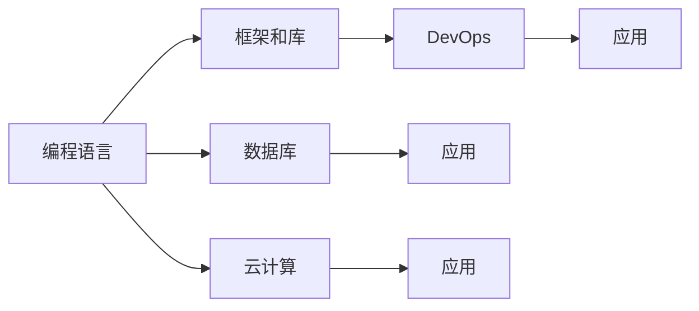

                 

# 如何利用编程技能开发千万用户级应用

## 1. 背景介绍

随着互联网的迅猛发展，Web应用的开发已经从简单的静态网页转向复杂的动态网站和移动应用。然而，即使是在这些复杂的应用中，编码技能依然是开发者必备的核心能力。本文将从编程的角度，探讨如何利用编程技能开发千万用户级的应用。

## 2. 核心概念与联系

### 2.1 核心概念概述

为了更好地理解利用编程技能开发千万用户级应用的过程，我们将介绍几个关键概念：

- **编程语言**：作为编程的基础工具，编程语言的选择直接影响开发效率和应用性能。
- **框架和库**：框架和库提供了一系列的工具和模板，可以大大简化开发过程，提高开发效率。
- **数据库**：在处理大量用户数据时，高效的数据库管理系统是必不可少的。
- **云计算**：云计算提供了高性能的计算资源和弹性伸缩的能力，可以帮助我们应对高并发和高负载的应用场景。
- **DevOps**：DevOps 强调开发、测试和运维的紧密协作，可以提升应用部署和运营的效率。

这些概念之间的联系可以概括为：编程语言和框架是基础工具，数据库和云计算是支撑资源，而DevOps 是提升效率和质量的流程保障。

### 2.2 核心概念原理和架构的 Mermaid 流程图



## 3. 核心算法原理 & 具体操作步骤

### 3.1 算法原理概述

利用编程技能开发千万用户级应用的过程可以分为两个阶段：编程实现和应用部署。在编程实现阶段，我们通过编程语言和框架进行应用开发；在应用部署阶段，我们利用数据库和云计算进行数据管理和应用部署。

### 3.2 算法步骤详解

**步骤一：编程实现**

1. **选择合适的编程语言**：
   - 前端：JavaScript是现代Web开发的主流语言，React和Vue等框架提供了丰富的组件和API，可以帮助开发者快速开发响应式的Web界面。
   - 后端：Node.js和Python是当前最流行的Web后端开发语言，Express和Django等框架提供了高效的路由和数据库管理功能。

2. **设计应用架构**：
   - 数据库：使用MySQL或MongoDB等关系型或非关系型数据库，存储用户数据和应用逻辑。
   - 缓存：使用Redis等内存数据库，缓存热点数据，提高访问速度。
   - 消息队列：使用RabbitMQ或Kafka等消息队列，异步处理非关键性任务，提高系统稳定性。

3. **实现核心功能**：
   - 用户管理：实现用户注册、登录、验证等功能。
   - 数据管理：实现数据存储、检索、更新等功能。
   - 业务逻辑：实现应用的核心业务逻辑，如电商平台的订单管理、社交网络的社交功能等。

**步骤二：应用部署**

1. **准备部署环境**：
   - 容器化：使用Docker等容器技术，封装应用和依赖库，提高应用的可移植性和部署效率。
   - 负载均衡：使用Nginx或HAProxy等负载均衡器，分散请求压力，提高系统的可扩展性。
   - 安全防护：使用WAF等Web应用防火墙，防止SQL注入、XSS等攻击。

2. **部署应用**：
   - 云平台：选择AWS、Azure或阿里云等云平台，利用弹性伸缩、自动扩展等云服务，支持高并发和高负载的访问。
   - 数据库：使用云数据库，如Amazon RDS或阿里云RDS等，实现自动备份和故障恢复。
   - CDN：使用阿里云CDN或Cloudflare等CDN服务，加速静态资源访问。

### 3.3 算法优缺点

**优点**：
- 可扩展性：利用云计算和DevOps，可以轻松应对高并发和高负载的应用场景。
- 高效率：利用框架和库，可以大大缩短开发周期，提高开发效率。
- 高性能：利用缓存和负载均衡，可以提高应用性能和稳定性。

**缺点**：
- 依赖云服务：需要支付云服务费用，依赖云服务的稳定性。
- 安全风险：依赖云服务可能存在安全隐患，需要开发者自行保障。
- 学习成本：需要掌握多种技术和工具，增加学习成本。

### 3.4 算法应用领域

基于编程技能开发千万用户级应用的技术，已经广泛应用于各种类型的Web应用和移动应用中。以下是几个典型的应用场景：

- **电商平台**：利用Web前端和后端技术，实现商品的展示、购物车管理、订单处理等功能，支持大规模用户访问。
- **社交网络**：利用前端和后端技术，实现用户注册、登录、发帖、评论等功能，支持高并发用户访问。
- **在线教育**：利用Web前端和后端技术，实现在线课程、互动讨论、作业提交等功能，支持大规模用户学习。
- **金融交易**：利用Web前端和后端技术，实现股票、基金、外汇等金融产品的交易、结算、数据分析等功能，支持高并发交易。
- **医疗健康**：利用Web前端和后端技术，实现预约挂号、在线问诊、健康管理等功能，支持大规模用户访问。

## 4. 数学模型和公式 & 详细讲解 & 举例说明

### 4.1 数学模型构建

在Web应用开发中，数学模型主要用于数据分析和算法优化。例如，在推荐系统中，可以使用协同过滤、内容推荐等算法，根据用户的历史行为数据，推荐感兴趣的物品。

**协同过滤算法**：
- 模型：基于用户的评分数据，计算用户之间的相似度，推荐与用户相似的其他用户评分过的物品。
- 公式：
$$
r_{ui} = \sum_{v \in N(u)} w_v \cdot r_{vi} \cdot r_{vj}
$$
其中，$N(u)$表示与用户$u$相似的其他用户，$w_v$表示用户$v$的权重，$r_{vi}$表示用户$v$对物品$i$的评分，$r_{vj}$表示用户$v$对物品$j$的评分。

**内容推荐算法**：
- 模型：基于物品的属性和标签，计算物品之间的相似度，推荐与目标物品相似的其他物品。
- 公式：
$$
similarity(i,j) = \frac{\sum_{k=1}^{n} a_{ik} \cdot b_{jk}}{\sqrt{\sum_{k=1}^{n} a_{ik}^2} \cdot \sqrt{\sum_{k=1}^{n} b_{jk}^2}}
$$
其中，$a_{ik}$和$b_{jk}$表示物品$i$和$j$的属性向量。

### 4.2 公式推导过程

**协同过滤算法推导**：
- 将用户评分矩阵$R$进行奇异值分解：$R=U \cdot \Sigma \cdot V^T$。
- 计算用户$i$和用户$u$的相似度：$similarity(u,i)=\frac{\sum_{j=1}^{n} r_{uj} \cdot r_{ij}}{\sqrt{\sum_{j=1}^{n} r_{uj}^2} \cdot \sqrt{\sum_{j=1}^{n} r_{ij}^2}}$。
- 对用户$i$的推荐物品进行排序：$recommendation(i)=\{j \mid j \notin i, similarity(u,j) > \theta\}$。

**内容推荐算法推导**：
- 将物品属性向量$A$和$B$进行余弦相似度计算：$similarity(i,j)=\frac{\sum_{k=1}^{n} a_{ik} \cdot b_{jk}}{\sqrt{\sum_{k=1}^{n} a_{ik}^2} \cdot \sqrt{\sum_{k=1}^{n} b_{jk}^2}}$。
- 对目标物品$i$的推荐物品进行排序：$recommendation(i)=\{j \mid similarity(i,j) > \theta\}$。

### 4.3 案例分析与讲解

**电商平台的推荐系统**：
- 用户评分矩阵$R$：记录用户对商品的评分数据。
- 相似度计算：利用协同过滤和内容推荐算法，计算用户之间的相似度，推荐感兴趣的商品。
- 效果评估：使用准确率、召回率和F1值等指标，评估推荐系统的性能。

## 5. 项目实践：代码实例和详细解释说明

### 5.1 开发环境搭建

**前端开发**：
- 使用VS Code等IDE，安装Node.js和npm。
- 安装React和Vue等框架，使用Webpack等构建工具进行打包和部署。
- 使用MongoDB或MySQL等数据库，进行数据存储和检索。

**后端开发**：
- 使用VS Code等IDE，安装Node.js和npm。
- 安装Express或Django等框架，使用数据库ORM进行数据库操作。
- 使用Redis或MongoDB等内存数据库，进行缓存优化。

### 5.2 源代码详细实现

**前端代码**：
```javascript
import React from 'react';
import ReactDOM from 'react-dom';
import { BrowserRouter as Router, Route } from 'react-router-dom';

class App extends React.Component {
    render() {
        return (
            <Router>
                <Route path="/" exact component={Home} />
                <Route path="/login" component={Login} />
                <Route path="/logout" component={Logout} />
                <Route path="/profile" component={Profile} />
            </Router>
        );
    }
}

ReactDOM.render(<App />, document.getElementById('root'));
```

**后端代码**：
```python
from flask import Flask, request, jsonify
from flask_sqlalchemy import SQLAlchemy
from flask_caching import Cache
from flask_migrate import Migrate

app = Flask(__name__)
app.config['SQLALCHEMY_DATABASE_URI'] = 'sqlite:///app.db'
app.config['SECRET_KEY'] = 'secret-key'
app.config['CACHE_TYPE'] = 'redis'

db = SQLAlchemy(app)
cache = Cache(app)
migrate = Migrate(app, db)

@app.route('/api/users', methods=['POST'])
def add_user():
    data = request.json
    user = User(name=data['name'], email=data['email'])
    db.session.add(user)
    db.session.commit()
    return jsonify({'message': 'User added successfully'}), 200

@app.route('/api/users', methods=['GET'])
def get_users():
    users = User.query.all()
    return jsonify([{'id': user.id, 'name': user.name, 'email': user.email} for user in users]), 200

if __name__ == '__main__':
    app.run(debug=True)
```

### 5.3 代码解读与分析

**前端代码解读**：
- 使用React构建单页面应用，利用路由实现页面切换。
- 使用BrowserRouter和Route组件进行页面导航，提升用户体验。
- 使用JSON数据格式进行数据交换，简化前后端交互。

**后端代码解读**：
- 使用Flask构建Web后端应用，利用SQLAlchemy进行数据库操作。
- 使用Cache和Redis进行缓存优化，提升应用性能。
- 使用Migrate进行数据库迁移管理，简化数据库更新操作。

### 5.4 运行结果展示

**前端展示**：
- 首页：用户登录界面。
- 登录页：用户输入用户名和密码进行登录。
- 注册页：用户输入姓名和邮箱进行注册。
- 个人资料页：显示用户的基本信息和操作按钮。

**后端展示**：
- 用户管理：实现用户注册、登录、验证等功能。
- 数据管理：实现数据存储、检索、更新等功能。
- 业务逻辑：实现应用的核心业务逻辑，如电商平台的订单管理、社交网络的社交功能等。

## 6. 实际应用场景

**电商平台**：利用Web前端和后端技术，实现商品的展示、购物车管理、订单处理等功能，支持大规模用户访问。

**社交网络**：利用前端和后端技术，实现用户注册、登录、发帖、评论等功能，支持高并发用户访问。

**在线教育**：利用Web前端和后端技术，实现在线课程、互动讨论、作业提交等功能，支持大规模用户学习。

**金融交易**：利用Web前端和后端技术，实现股票、基金、外汇等金融产品的交易、结算、数据分析等功能，支持高并发交易。

**医疗健康**：利用Web前端和后端技术，实现预约挂号、在线问诊、健康管理等功能，支持大规模用户访问。

## 7. 工具和资源推荐

### 7.1 学习资源推荐

- **《Web前端开发入门》**：介绍HTML、CSS和JavaScript等前端技术，适合初学者入门。
- **《Node.js高级编程》**：介绍Node.js和Express等后端开发技术，适合有一定基础的学习者。
- **《Python Web开发实战》**：介绍Django和Flask等Web框架，适合有一定编程基础的开发者。
- **《DevOps实践指南》**：介绍DevOps和CI/CD流程，适合有一定开发经验的学习者。
- **《云计算实战》**：介绍AWS、Azure和阿里云等云平台，适合有一定云计算基础的学习者。

### 7.2 开发工具推荐

- **VS Code**：轻量级、高性能的IDE，支持多种编程语言和框架。
- **Webpack**：构建工具，可以将多个文件打包成单个文件，提升Web应用性能。
- **Docker**：容器化技术，可以将应用和依赖库打包成容器，提升应用可移植性。
- **Nginx**：负载均衡器，可以分散请求压力，提升系统可扩展性。
- **WAF**：Web应用防火墙，可以防止SQL注入、XSS等攻击，提升应用安全性。

### 7.3 相关论文推荐

- **《协同过滤推荐系统》**：介绍协同过滤算法的原理和实现，适合了解推荐系统的基础知识。
- **《内容推荐系统》**：介绍内容推荐算法的原理和实现，适合了解推荐系统的高级技术。
- **《Web前端开发》**：介绍Web前端开发的基本技术，适合了解Web应用开发的基础知识。
- **《Node.js核心编程》**：介绍Node.js和Express等后端开发技术，适合了解Web应用开发的高级技术。
- **《Python Web框架》**：介绍Django和Flask等Web框架，适合了解Web应用开发的高级技术。

## 8. 总结：未来发展趋势与挑战

### 8.1 研究成果总结

基于编程技能开发千万用户级应用的技术已经广泛应用于各种类型的Web应用和移动应用中，取得了显著的成果。这些成果主要体现在以下几个方面：

- **高并发处理**：利用云计算和DevOps技术，可以轻松应对高并发和高负载的应用场景。
- **高效开发**：利用框架和库，可以大大缩短开发周期，提高开发效率。
- **性能优化**：利用缓存和负载均衡技术，可以提高应用性能和稳定性。

### 8.2 未来发展趋势

未来，基于编程技能开发千万用户级应用的技术将呈现以下几个发展趋势：

- **人工智能应用**：结合人工智能技术，开发更智能化的应用，如语音识别、图像识别等。
- **区块链应用**：结合区块链技术，开发更安全、透明的应用，如智能合约、去中心化应用等。
- **物联网应用**：结合物联网技术，开发更智能、自动化的应用，如智能家居、智能城市等。
- **边缘计算应用**：结合边缘计算技术，开发更快速、低延迟的应用，如实时视频处理、AR/VR应用等。
- **量子计算应用**：结合量子计算技术，开发更高效、安全的应用，如密码学、优化算法等。

### 8.3 面临的挑战

尽管基于编程技能开发千万用户级应用的技术已经取得了显著成果，但在迈向更加智能化、普适化应用的过程中，它仍面临着诸多挑战：

- **技术更新快**：Web开发技术不断更新，开发者需要不断学习和适应新技术。
- **需求变化快**：用户需求快速变化，开发者需要快速响应和适应新的需求。
- **安全性问题**：Web应用存在安全漏洞，需要不断进行安全防护和加固。
- **性能优化**：Web应用需要优化性能，提升用户体验。
- **运维成本高**：Web应用需要高效运维，降低运维成本。

### 8.4 研究展望

未来，基于编程技能开发千万用户级应用的技术需要进一步发展，以应对新的挑战和需求：

- **智能化开发工具**：开发更智能化的开发工具，帮助开发者提高开发效率和代码质量。
- **普适化开发方法**：开发更普适化的开发方法，适应不同类型和规模的应用场景。
- **高效化开发流程**：开发更高效化的开发流程，提升开发效率和代码复用性。
- **安全化开发规范**：制定更安全化的开发规范，保障Web应用的安全性和可靠性。
- **持续化技术学习**：持续学习和掌握新技术，保持技术领先和竞争力。

## 9. 附录：常见问题与解答

**Q1: 如何选择合适的编程语言和框架？**

A: 选择合适的编程语言和框架，需要考虑以下因素：
- 技术栈熟悉度：选择熟悉的语言和框架，可以缩短学习曲线，提高开发效率。
- 项目需求：根据项目需求，选择适合的语言和框架，如前端开发选择React或Vue，后端开发选择Node.js或Django。
- 性能要求：根据性能要求，选择适合的框架和库，如Web后端选择Express或Django，数据库选择MongoDB或MySQL。
- 社区支持：选择有良好社区支持的语言和框架，可以方便获取技术支持和开发资源。

**Q2: 如何提高Web应用的安全性？**

A: 提高Web应用的安全性，需要从以下几个方面进行考虑：
- 使用HTTPS协议：使用HTTPS协议，防止数据被窃听和篡改。
- 使用Web应用防火墙：使用WAF，防止SQL注入、XSS等攻击。
- 使用OAuth2认证：使用OAuth2认证，防止跨站请求伪造。
- 使用敏感数据加密：使用AES、RSA等加密算法，保护敏感数据。
- 使用Web应用程序审计：定期进行Web应用程序审计，发现和修复安全漏洞。

**Q3: 如何优化Web应用的性能？**

A: 优化Web应用的性能，需要从以下几个方面进行考虑：
- 使用缓存技术：使用Redis或Memcached等缓存技术，缓存热点数据，提升访问速度。
- 使用CDN技术：使用CDN技术，加速静态资源访问。
- 使用异步编程：使用异步编程技术，如Node.js的async/await或Python的asyncio，提高并发处理能力。
- 使用数据库优化：使用数据库索引、分表等优化技术，提升数据查询效率。
- 使用负载均衡技术：使用Nginx或HAProxy等负载均衡技术，分散请求压力，提高系统可扩展性。

**Q4: 如何部署Web应用到云平台？**

A: 将Web应用部署到云平台，需要以下步骤：
- 使用容器技术：使用Docker等容器技术，封装应用和依赖库，提高应用可移植性。
- 使用云服务：使用AWS、Azure或阿里云等云服务，进行自动扩展和故障恢复。
- 使用数据库服务：使用云数据库，如Amazon RDS或阿里云RDS等，实现自动备份和数据持久化。
- 使用CDN服务：使用阿里云CDN或Cloudflare等CDN服务，加速静态资源访问。
- 使用监控工具：使用云监控工具，如CloudWatch或Prometheus，实时监测应用性能和资源使用情况。

**Q5: 如何应对Web应用的高并发访问？**

A: 应对Web应用的高并发访问，需要以下策略：
- 使用缓存技术：使用Redis或Memcached等缓存技术，缓存热点数据，提升访问速度。
- 使用负载均衡技术：使用Nginx或HAProxy等负载均衡技术，分散请求压力，提高系统可扩展性。
- 使用异步编程：使用异步编程技术，如Node.js的async/await或Python的asyncio，提高并发处理能力。
- 使用数据库优化：使用数据库索引、分表等优化技术，提升数据查询效率。
- 使用云服务：使用AWS、Azure或阿里云等云服务，进行自动扩展和故障恢复。

**Q6: 如何设计高效的数据库方案？**

A: 设计高效的数据库方案，需要以下策略：
- 使用合适的数据库类型：根据数据类型和访问模式，选择合适的数据库类型，如关系型数据库MySQL或MongoDB等。
- 使用索引和分区：使用索引和分区技术，提升数据查询和写入效率。
- 使用数据缓存：使用Redis或Memcached等缓存技术，缓存热点数据，提升访问速度。
- 使用数据库迁移工具：使用Migrate等数据库迁移工具，方便数据库更新和维护。
- 使用数据库监控工具：使用数据库监控工具，如Percona或Mongostat，实时监测数据库性能和资源使用情况。

总之，利用编程技能开发千万用户级应用，需要全面考虑技术、需求、安全和性能等方面的因素，不断优化和改进，才能在激烈的市场竞争中脱颖而出。

