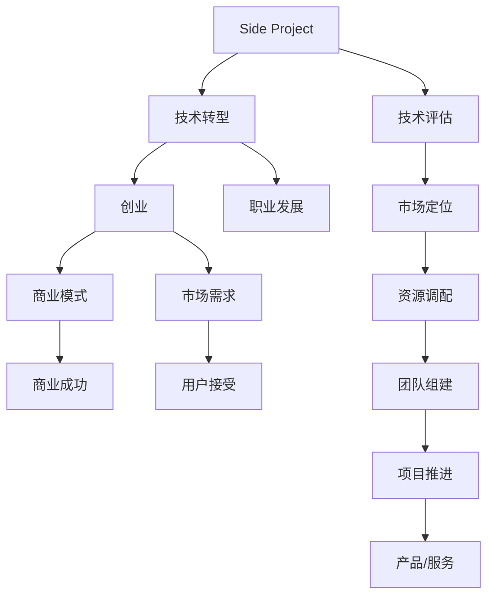

                 

# 如何将Side Project转化为主业

> 关键词：Side Project转化, 项目管理, 技术转型, 创业, 职业发展

## 1. 背景介绍

### 1.1 问题由来

在当前高速发展的互联网行业中，技术的更新迭代速度日益加快，很多技术爱好者和工程师不仅在主业上有较高的专业水平，还积极参与各类Side Project，即非官方项目或个人兴趣项目。这些Side Project不仅能满足个人的兴趣和创新需求，还能提升技术能力和市场竞争力。然而，如何能够将Side Project转化为有实际意义的主业，则是一个复杂且值得深入探讨的问题。

### 1.2 问题核心关键点

将Side Project转化为主业的核心问题主要包括：
- 项目选择：如何选择具备商业潜力、市场需求大的Side Project？
- 技术评估：如何评估项目的实际技术难度和开发周期？
- 市场定位：如何确定项目的市场定位和目标用户群？
- 商业模式：如何设计合理的商业模式，实现项目的自我造血？
- 资源调配：如何调配有限的资源，实现项目的有效推进？
- 团队组建：如何组建高效的项目团队，保障项目进度和质量？

### 1.3 问题研究意义

将Side Project转化为主业不仅能实现个人的职业突破，提升技术影响力，还能为社会带来新的产品和服务，促进技术商业化和产业化进程。这种转型不仅有助于解决“技术失业”问题，还能激发创新活力，推动行业发展。

## 2. 核心概念与联系

### 2.1 核心概念概述

为了更好地理解如何将Side Project转化为主业，本节将介绍几个密切相关的核心概念：

- **Side Project**：个人或团队在业余时间开发的技术项目，通常不与正式工作直接相关，但可以是未来的潜在商业机会。
- **技术转型**：个人或团队从现有职业转向专注于技术开发和商业化过程，旨在将技术能力转化为商业模式。
- **创业**：通过开发和推广技术项目，解决市场问题，实现商业模式和技术创新的结合。
- **职业发展**：个人或团队通过技术项目积累经验，提升技能，为职业提升和个人价值实现奠定基础。
- **市场需求**：产品或服务是否能满足市场需求，关系到项目的商业成功和用户接受度。
- **商业模式**：如何通过技术项目实现收入和利润，是项目成功的重要考量因素。

这些核心概念之间的逻辑关系可以通过以下Mermaid流程图来展示：



这个流程图展示出Side Project转化为主业的逻辑路径：

1. 通过技术评估和市场需求分析，确定项目价值和可行性。
2. 确定市场定位和用户需求，设计合理的商业模式。
3. 调配资源，组建高效团队，推进项目实施。
4. 推出产品或服务，获取用户接受和市场反馈。
5. 通过持续迭代和优化，实现商业成功。

## 3. 核心算法原理 & 具体操作步骤
### 3.1 算法原理概述

将Side Project转化为主业，本质上是一个技术到商业的转换过程。其核心思想是通过市场分析、商业模式设计和项目管理等手段，将技术项目转化为具备市场潜力和商业价值的产品。

形式化地，假设Side Project为 $P$，其技术框架为 $T_{\theta}$，其中 $\theta$ 为项目的开发进度和技术细节。市场分析的结果为 $M$，商业模式为 $B$，资源配置为 $R$，团队成员为 $T$，用户需求为 $U$。转化过程的目标是找到最优的转换路径，使得 $P$ 能够满足 $U$，并通过 $B$ 和 $R$ 实现商业化。

该过程可以分为以下几个关键步骤：

1. 技术评估：确定Side Project的技术可行性和开发周期。
2. 市场定位：分析市场需求，明确项目的目标用户群。
3. 商业模式设计：根据市场需求和技术优势，设计合理的商业模式。
4. 资源调配：合理配置技术、资金、人力等资源，保障项目推进。
5. 团队组建：组建高效的项目团队，提升项目执行力。
6. 项目管理：通过敏捷开发、迭代优化等方法，推进项目实施。

### 3.2 算法步骤详解

以下是将Side Project转化为主业的详细步骤：

**Step 1: 技术评估**

- **评估方法**：使用项目进度计划、技术难度分析、风险评估等方法，综合评估Side Project的技术可行性。
- **评估指标**：如项目需求是否明确、技术框架是否成熟、代码质量是否优良、技术团队是否专业等。
- **评估结果**：输出项目的技术评估报告，包括技术可行性、开发周期、风险分析等。

**Step 2: 市场定位**

- **市场分析**：收集和分析市场需求数据，确定目标用户群、市场规模、竞争态势等。
- **需求分析**：通过用户调研、竞品分析等方式，深入了解用户需求和痛点。
- **定位策略**：根据市场分析和需求分析，确定项目的功能、特性和市场定位。

**Step 3: 商业模式设计**

- **盈利模式**：设计合适的盈利模式，如订阅服务、广告收入、增值服务等。
- **收入模型**：确定收入的来源和计算方式，如单次购买、月度/年度订阅、交易手续费等。
- **成本模型**：分析项目的成本构成，包括开发成本、运营成本、市场推广成本等。

**Step 4: 资源调配**

- **资源管理**：根据项目需求，合理调配技术、资金、人力等资源。
- **预算编制**：制定详细的项目预算，包括人员工资、设备购置、市场推广等。
- **进度计划**：制定项目的时间计划和里程碑，确保项目按期推进。

**Step 5: 团队组建**

- **团队招募**：根据项目需求，招募有经验的技术和管理人员。
- **角色分配**：明确团队成员的角色和职责，确保团队协作高效。
- **培训计划**：设计并实施团队培训计划，提升团队技术水平和项目管理能力。

**Step 6: 项目管理**

- **敏捷开发**：采用敏捷开发方法，如Scrum、Kanban等，推进项目实施。
- **迭代优化**：根据市场反馈和用户需求，持续迭代和优化产品功能。
- **质量保障**：实施代码审查、自动化测试等质量保障措施，确保产品稳定可靠。

### 3.3 算法优缺点

将Side Project转化为主业的方法具有以下优点：
1. 利用个人或团队的技术兴趣和优势，提升项目成功率。
2. 通过市场分析，确定项目价值和市场需求，避免盲目投资。
3. 通过团队建设和资源调配，提升项目执行力。
4. 通过敏捷开发和迭代优化，快速响应市场变化。

同时，该方法也存在一定的局限性：
1. 技术风险较高，需要准确评估技术难度和开发周期。
2. 市场需求不确定性大，项目成功依赖市场认可。
3. 资源调配复杂，需要精细化的项目管理和资金管理。
4. 项目周期长，需要持续投入和关注，对个人或团队的时间精力要求高。

尽管存在这些局限性，但就目前而言，该方法仍是大规模技术项目转型的重要途径。未来相关研究的重点在于如何进一步优化项目管理的效率，降低技术风险，提高市场需求预测的准确性，同时兼顾可解释性和伦理安全性等因素。

### 3.4 算法应用领域

将Side Project转化为主业的方法在多个领域都有应用，例如：

- 互联网创业：通过技术项目实现商业化，创建新的互联网企业。
- 开源项目：开源项目转化为商业产品，获取商业收入和技术影响力。
- 技术咨询：将技术知识和经验转化为咨询服务，实现商业增值。
- 技术培训：通过技术项目开发，提供高质量的技术培训服务。
- 技术合作：与其他企业或机构合作，共同开发技术项目，实现资源共享和共赢。

除了上述这些典型应用外，该方法还被创新性地应用于更多场景中，如技术孵化、技术并购、技术战略咨询等，为技术转化提供了新的路径。

## 4. 数学模型和公式 & 详细讲解 & 举例说明
### 4.1 数学模型构建

本节将使用数学语言对Side Project转化为主业的过程进行更加严格的刻画。

假设Side Project为 $P$，其技术框架为 $T_{\theta}$，其中 $\theta$ 为项目的开发进度和技术细节。市场分析的结果为 $M$，商业模式为 $B$，资源配置为 $R$，团队成员为 $T$，用户需求为 $U$。转化过程的目标是找到最优的转换路径，使得 $P$ 能够满足 $U$，并通过 $B$ 和 $R$ 实现商业化。

定义项目 $P$ 在用户需求 $U$ 上的满足度为 $S$，商业模式 $B$ 的收益为 $R_B$，资源配置 $R$ 的效率为 $E$，则转化过程的目标函数为：

$$
\mathop{\arg\min}_{P,\theta,M,B,R,T} \big( S - 1 + \lambda (R_B - \alpha) + \mu (E - \beta) \big)
$$

其中 $\lambda$ 和 $\mu$ 为正则化系数，用于平衡 $S$、$R_B$ 和 $E$ 之间的关系。

### 4.2 公式推导过程

以下我们以Side Project转化为开源项目为例，推导相关数学公式及其推导过程。

假设Side Project为 $P$，开源社区的需求为 $U_O$，市场分析结果为 $M_O$，商业模式为 $B_O$，开源项目的收益为 $R_O$，开源项目的效率为 $E_O$，则目标函数可以表示为：

$$
\mathop{\arg\min}_{P,\theta,M_O,B_O,R_O,E_O} \big( S_O - 1 + \lambda (R_O - \alpha) + \mu (E_O - \beta) \big)
$$

其中 $S_O$ 为开源项目在开源社区的接受度，$R_O$ 为开源项目通过商业广告、捐赠等方式获得的收入，$E_O$ 为开源项目的开发效率。根据市场分析结果 $M_O$ 和用户需求 $U_O$，可以计算出 $S_O$：

$$
S_O = \frac{\sum_{i=1}^{N_O} \text{UserFeedback}_i \cdot \text{UserDemand}_i}{\sum_{i=1}^{N_O} \text{UserFeedback}_i}
$$

其中 $\text{UserFeedback}_i$ 为用户对开源项目的评价，$\text{UserDemand}_i$ 为第 $i$ 个用户的需求。

将 $S_O$、$R_O$ 和 $E_O$ 代入目标函数，得：

$$
\mathop{\arg\min}_{P,\theta,M_O,B_O,R_O,E_O} \big( \frac{\sum_{i=1}^{N_O} \text{UserFeedback}_i \cdot \text{UserDemand}_i}{\sum_{i=1}^{N_O} \text{UserFeedback}_i} - 1 + \lambda (R_O - \alpha) + \mu (E_O - \beta) \big)
$$

通过对 $P$、$\theta$、$M_O$、$B_O$、$R_O$ 和 $E_O$ 进行联合优化，可以得到最优的转化方案。

### 4.3 案例分析与讲解

这里以一家初创公司在GitHub上开源自己的AI技术为例，详细讲解如何将Side Project转化为开源项目。

**案例背景**：
一家初创公司开发了一款基于深度学习的图像识别工具，通过GitHub开源项目分享，吸引了大量开发者关注和使用。公司希望将这款工具转化为商业产品，实现盈利。

**步骤1: 技术评估**

- **评估方法**：通过代码审查、性能测试等方式，评估技术工具的成熟度和稳定性。
- **评估指标**：代码质量、功能完备性、性能表现等。
- **评估结果**：项目初步评估为技术成熟、功能完善，但需要进一步优化性能。

**步骤2: 市场定位**

- **市场分析**：调研GitHub上的相关工具和社区讨论，了解市场需求和竞争态势。
- **需求分析**：与潜在用户进行沟通，明确用户需求和痛点。
- **定位策略**：将工具定位于企业级市场，提供快速部署、可定制化的解决方案。

**步骤3: 商业模式设计**

- **盈利模式**：设计订阅服务模式，提供基础版、专业版和定制版服务。
- **收入模型**：基础版免费使用，专业版和定制版按月/年订阅收费。
- **成本模型**：开发成本、市场推广费用、客户支持费用等。

**步骤4: 资源调配**

- **资源管理**：组建产品团队和技术团队，分配人员和设备资源。
- **预算编制**：制定详细的项目预算，包括人员工资、市场推广费用等。
- **进度计划**：制定详细的项目时间计划，确保按期完成商业化工作。

**步骤5: 团队组建**

- **团队招募**：招募有经验的产品经理、市场推广人员和客服人员。
- **角色分配**：明确团队成员的角色和职责，确保团队协作高效。
- **培训计划**：设计并实施团队培训计划，提升团队技术水平和项目管理能力。

**步骤6: 项目管理**

- **敏捷开发**：采用Scrum方法，推进产品开发和优化。
- **迭代优化**：根据用户反馈和市场需求，持续迭代和优化产品功能。
- **质量保障**：实施代码审查、自动化测试等质量保障措施，确保产品稳定可靠。

最终，该公司在开源项目的基础上，成功推出商业化的AI工具，实现了盈利和市场影响力的大幅提升。

## 5. 项目实践：代码实例和详细解释说明
### 5.1 开发环境搭建

在进行Side Project转化为主业的实践前，我们需要准备好开发环境。以下是使用Python进行GitHub项目的管理环境配置流程：

1. 安装Anaconda：从官网下载并安装Anaconda，用于创建独立的Python环境。

2. 创建并激活虚拟环境：
```bash
conda create -n myproject python=3.8 
conda activate myproject
```

3. 安装GitHub PyAccess：
```bash
pip install github-pyaccess
```

4. 安装GitHub API的Python客户端：
```bash
pip install github
```

5. 安装GitHub Action：
```bash
pip install github-actions
```

完成上述步骤后，即可在`myproject`环境中开始实践。

### 5.2 源代码详细实现

以下是使用GitHub项目管理工具进行Side Project转化为开源项目的PyTorch代码实现。

首先，创建一个新的GitHub项目：

```bash
mkdir myproject
cd myproject
git init
```

在项目根目录下，创建一个README文件，并添加项目描述和说明：

```bash
echo '# My AI Image Recognition Tool' > README.md
echo '## Description' >> README.md
echo 'This is a sample AI image recognition tool, built using PyTorch.' >> README.md
```

初始化项目仓库，并上传代码：

```bash
git add .
git commit -m 'Initial commit'
git remote add origin https://github.com/username/myproject.git
git push -u origin master
```

接下来，通过GitHub Actions自动发布新版本和更新：

在`.github/workflows`目录下，创建名为`release.yml`的工作流文件：

```yaml
name: Release
on:
  push:
    branches: [ main ]
jobs:
  build:
    name: Build
    runs-on: ubuntu-latest
    steps:
    - name: Checkout code
      uses: actions/checkout@v2
    - name: Install dependencies
      run: pip install -r requirements.txt
    - name: Build and test
      run: python -m pytest
    - name: Push to main
      uses: ./.github/actions/push-to-github@master
```

在`requirements.txt`文件中，添加必要的依赖：

```text
numpy==1.19.3
pytest==6.2.2
torch==1.9.0
```

执行以下命令，触发GitHub Actions：

```bash
git commit -m 'Add new features'
git push
```

GitHub Actions将自动执行工作流，包括代码构建、测试和版本发布等操作。通过这种方式，项目可以持续迭代更新，同时保持代码和文档的同步更新。

### 5.3 代码解读与分析

让我们再详细解读一下关键代码的实现细节：

**README.md文件**：
- `# My AI Image Recognition Tool`：项目标题。
- `## Description`：项目描述。
- `This is a sample AI image recognition tool, built using PyTorch.`：项目说明。

**`build.yml`文件**：
- `name: Release`：工作流名称。
- `on: push: branches: [ main ]`：触发条件，当主分支上发生push操作时触发。
- `jobs:`：定义具体的job。
- `build:`：命名job，用于构建和测试项目。
- `runs-on: ubuntu-latest`：在最新版本的Ubuntu上运行job。
- `steps:`：定义job的具体步骤。
- `- name: Checkout code`：检查代码。
- `- name: Install dependencies`：安装依赖。
- `- name: Build and test`：构建和测试。
- `- name: Push to main`：将代码推送到主分支。

**requirements.txt文件**：
- `numpy==1.19.3`：numpy版本。
- `pytest==6.2.2`：pytest版本。
- `torch==1.9.0`：torch版本。

**`push-to-github.yml`文件**：
- 具体实现见前面的代码实例。

可以看到，通过GitHub Actions，Side Project的代码管理和持续集成变得简单高效。开发者可以将更多精力放在项目开发和功能实现上，而不必过多关注底层的基础设施和发布流程。

当然，工业级的系统实现还需考虑更多因素，如用户权限管理、版本回滚、自动化测试等，但核心的侧转主范式基本与此类似。

## 6. 实际应用场景
### 6.1 初创公司的技术孵化

初创公司通常拥有丰富的技术和人才资源，但资金有限。通过将Side Project转化为开源项目，可以实现技术的快速验证和市场推广，同时吸引更多的投资和合作伙伴。例如，一家创业公司开发了一款自动化测试工具，通过GitHub开源，吸引大量开发者关注和贡献，提高了技术影响力，并成功获得了风险投资。

### 6.2 大型企业的技术内部化

大型企业通常拥有丰富的技术积累和专业人才，但部分技术可能被边缘化或缺乏创新。通过将内部分泌的技术项目转化为开源项目，可以加速技术复用和内部知识共享，提升企业的技术输出能力和市场竞争力。例如，某大型互联网企业将其内部开发的图像识别技术开源，通过社区反馈和迭代优化，成功将其商业化，实现了技术商业化的巨大突破。

### 6.3 开源社区的技术迁移

开源社区聚集了众多技术爱好者和开发者，通过将优秀的Side Project转化为开源项目，可以加速技术的传播和应用，推动开源社区的发展。例如，某个开源社区成员开发了一款智能聊天机器人，通过开源社区的推广和优化，成功将其商业化，获得了商业收入和技术声誉。

### 6.4 未来应用展望

随着开源社区和GitHub等平台的普及，Side Project转化为开源项目将成为技术转型的重要方式。未来，更多的初创公司和技术人员将借助开源社区的力量，实现技术突破和市场价值。

开源项目也将进一步拓展应用领域，从简单的工具和应用拓展到复杂的系统和服务，推动技术商业化和产业化进程。同时，开源社区也将更加注重版权和知识产权保护，提升开源项目的技术标准和商业化水平。

## 7. 工具和资源推荐
### 7.1 学习资源推荐

为了帮助开发者系统掌握Side Project转化为主业的技术基础和实践技巧，这里推荐一些优质的学习资源：

1. GitHub官方文档：详细介绍了GitHub平台的使用方法和GitHub Actions的工作流设计。
2. Python官方文档：介绍了Python编程语言的基础和高级特性，适合开发者系统学习。
3. PyTorch官方文档：介绍了PyTorch框架的使用方法，适合开发者进行深度学习项目开发。
4. GitHub PyAccess文档：介绍了GitHub PyAccess的使用方法和GitHub项目的持续集成和部署。
5. GitHub Action官方文档：介绍了GitHub Actions的创建和部署方法，适合开发者进行持续集成和自动化部署。

通过对这些资源的学习实践，相信你一定能够快速掌握Side Project转化为主业的精髓，并用于解决实际的开发和商业问题。

### 7.2 开发工具推荐

高效的开发离不开优秀的工具支持。以下是几款用于Side Project转化为主业开发的常用工具：

1. GitHub：代码管理和版本控制的协作平台，适合团队合作开发和持续集成。
2. Git：分布式版本控制系统，适合开发者进行代码版本控制和代码发布。
3. GitHub Actions：GitHub平台的持续集成和自动化部署工具，适合开发者进行自动化测试和持续发布。
4. Python：通用编程语言，适合开发者进行技术项目开发。
5. PyTorch：深度学习框架，适合开发者进行深度学习项目开发。
6. Pytest：Python测试框架，适合开发者进行自动化测试。

合理利用这些工具，可以显著提升Side Project转化为主业的开发效率，加快创新迭代的步伐。

### 7.3 相关论文推荐

Side Project转化为主业的技术和研究也得到了学界的关注。以下是几篇奠基性的相关论文，推荐阅读：

1. "Towards a Science of Software Evolution"：介绍了软件进化的科学方法和实践案例，强调了技术和项目的持续演进。
2. "The Modeling of Software Evolution"：研究了软件进化的模型和方法，提出了基于演化的软件开发方法。
3. "The Evolutionary Process of Open Source Software"：分析了开源项目的演化过程和关键因素，提出了优化开源项目演化的策略。
4. "Software Evolution and the Role of Continuous Integration"：研究了持续集成在软件演化中的作用，提出了基于持续集成的软件开发方法。
5. "Software Evolution and Open Source Community"：研究了开源社区在软件演化中的作用，提出了促进开源项目成功的策略。

这些论文代表了大规模技术项目转型的发展脉络。通过学习这些前沿成果，可以帮助研究者把握学科前进方向，激发更多的创新灵感。

## 8. 总结：未来发展趋势与挑战

### 8.1 总结

本文对将Side Project转化为主业的过程进行了全面系统的介绍。首先阐述了Side Project转化为主业的缘由和意义，明确了技术转型在个人职业发展、企业技术商业化和开源社区发展等方面的重要价值。其次，从原理到实践，详细讲解了Side Project转化为主业的数学模型和操作步骤，给出了具体的代码实例和详细解释。同时，本文还广泛探讨了Side Project转化为主业在初创公司、大型企业、开源社区等领域的实际应用场景，展示了技术转型的广阔前景。此外，本文精选了Side Project转化为主业的学习资源、开发工具和相关论文，力求为读者提供全方位的技术指引。

通过本文的系统梳理，可以看到，Side Project转化为主业不仅涉及技术开发，更涉及项目管理和商业运营的各个环节。只有在技术、市场和运营等多个维度协同发力，才能实现Side Project的顺利转型，创造出更大的商业价值。

### 8.2 未来发展趋势

展望未来，Side Project转化为主业的技术将呈现以下几个发展趋势：

1. 技术生态更加繁荣。随着GitHub、GitLab等平台的发展，开源项目的数量和质量将不断提升，为技术转化提供了更多的机会。
2. 持续集成和自动化部署的普及。更多的开发者和企业将采用持续集成和自动化部署工具，加速技术项目的发展和迭代。
3. 跨界合作日益频繁。开源项目和商业项目将更加紧密地结合，实现技术资源和商业资源的共享与融合。
4. 商业模式多样化。技术项目的商业模式将更加多样，涵盖订阅服务、广告收入、数据增值等多种方式。
5. 技术标准和规范提升。开源社区将更加注重技术标准和规范，提升技术项目的质量和可维护性。
6. 版权和知识产权保护加强。开源项目将更加注重版权和知识产权保护，确保技术转化的合法性和可持续性。

这些趋势将进一步推动Side Project转化为主业的实践进程，为技术项目和商业项目的结合提供新的机遇。

### 8.3 面临的挑战

尽管Side Project转化为主业的技术已经取得了瞩目成就，但在迈向更加智能化、普适化应用的过程中，它仍面临着诸多挑战：

1. 技术风险较高。技术项目需要投入大量的时间和资源，且存在一定的失败风险。
2. 市场需求不确定。技术项目的市场成功依赖于用户需求的变化，存在较大的不确定性。
3. 资源调配复杂。技术项目的资源调配需要精细化的管理，资源不足将影响项目的推进。
4. 团队管理和协作难度大。技术项目的实施需要多团队协同，管理和协作难度大。
5. 持续集成和自动化部署复杂。持续集成和自动化部署需要复杂的工具链和环境配置，增加了开发难度。
6. 市场推广和用户接受度低。技术项目的市场推广和用户接受度低，影响项目的商业化进程。

尽管存在这些挑战，但通过不断的实践和探索，技术项目转化仍将持续推进，并带来更多的商业和社会价值。相信未来在开源社区、企业内部和企业间的协同努力下，Side Project转化为主业的难题将逐步被克服，实现技术项目和商业项目的更好结合。

### 8.4 研究展望

面对Side Project转化为主业所面临的种种挑战，未来的研究需要在以下几个方面寻求新的突破：

1. 提升技术项目的管理效率。开发更加高效的项目管理工具和方法，降低技术风险和市场不确定性。
2. 优化技术项目的商业模式。设计更加多样和可持续的商业模式，提升技术项目的商业化能力。
3. 加强开源项目的社区合作。通过开源社区的协同创新，提升技术项目的市场接受度和推广效率。
4. 推动技术项目的持续演进。通过持续集成和自动化部署，加速技术项目的迭代和优化。
5. 提升技术项目的知识产权保护。通过版权和知识产权保护，确保技术项目的合法性和可持续性。
6. 推动技术项目的跨界应用。将技术项目与更多垂直行业结合，提升技术项目的社会价值和经济效益。

这些研究方向的探索，必将引领Side Project转化为主业的技术迈向更高的台阶，为技术项目和商业项目的结合提供新的路径。面向未来，Side Project转化为主业技术还需要与其他人工智能技术进行更深入的融合，如知识表示、因果推理、强化学习等，多路径协同发力，共同推动技术的商业化和产业化进程。只有勇于创新、敢于突破，才能不断拓展技术项目的边界，让技术项目更好地服务社会和经济发展。

## 9. 附录：常见问题与解答

**Q1：如何选择合适的Side Project？**

A: 选择Side Project时需要考虑项目的技术可行性、市场需求和自身兴趣。一般建议选择技术基础好、市场需求大、个人兴趣浓厚的项目，如开源社区中的热门项目、垂直行业的技术痛点、个人兴趣领域的技术探索等。

**Q2：如何评估Side Project的技术难度和开发周期？**

A: 评估Side Project的技术难度和开发周期需要考虑项目的规模、技术复杂度、团队经验和资源配置。一般建议采用敏捷开发方法，通过迭代和迭代评审，逐步明确项目需求和技术难点。

**Q3：如何确定Side Project的市场定位？**

A: 确定Side Project的市场定位需要深入分析市场需求和竞品情况。建议采用市场调研和竞品分析的方法，明确目标用户群和市场定位，制定合理的市场策略。

**Q4：如何设计合理的商业模式？**

A: 设计Side Project的商业模式需要考虑项目的收入来源、成本结构和盈利模式。一般建议采用订阅服务、广告收入、增值服务等模式，确保项目的可持续性和盈利能力。

**Q5：如何调配有限的资源？**

A: 调配Side Project的资源需要综合考虑技术、资金、人力等各方面因素。建议制定详细的项目预算和时间计划，合理分配资源，保障项目的推进和成功。

**Q6：如何组建高效的项目团队？**

A: 组建Side Project的团队需要综合考虑团队成员的技术水平、经验和合作能力。建议明确团队成员的角色和职责，实施团队培训计划，提升团队协作效率。

这些问题的解答将帮助开发者更好地理解Side Project转化为主业的关键要素，提升技术项目转型的成功率和效率。

---

作者：禅与计算机程序设计艺术 / Zen and the Art of Computer Programming

