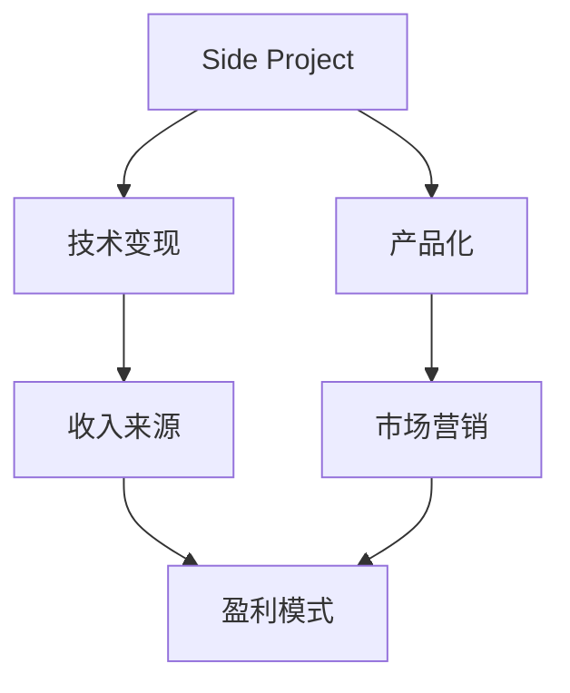

                 

# 如何将Side Project转化为主要收入来源

> 关键词：side project, 商业化, 收入来源, 技术变现, 创业

## 1. 背景介绍

在当今的创业环境中，侧项(侧项目，Side Project)往往不是创业者的主要收入来源。然而，这些侧项目却可能蕴含巨大的商业潜力。如何发掘这些潜力，将侧项目转化为主要收入来源，是每个创业者和技术开发者都需要面对的挑战。本文将探讨将侧项目商业化的关键步骤，并给出具体的策略和实例。

## 2. 核心概念与联系

### 2.1 核心概念概述

将侧项目转化为主要收入来源，涉及一系列涉及产品开发、市场营销、商业策略等领域的复杂过程。本节将介绍几个密切相关的核心概念：

- **侧项目**：指创业者或开发者利用业余时间开发的具有潜力的项目，通常非其主业所涉。
- **商业化**：将非商业性产品或服务转化为商业活动，实现盈利的过程。
- **收入来源**：指从商业活动获得的持续收入，包括产品销售、订阅、广告、数据分析等。
- **技术变现**：通过将技术转化为商业工具或服务，实现技术价值的商业应用。

这些概念之间的逻辑关系可以通过以下Mermaid流程图来展示：



这个流程图展示了许多概念之间的关系：

1. 侧项目可以转化为产品，实现技术变现。
2. 市场营销是推广产品、获取用户的关键环节。
3. 盈利模式则决定了收入来源的具体形式。
4. 市场营销和盈利模式共同构成商业化的主要部分。

## 3. 核心算法原理 & 具体操作步骤

### 3.1 算法原理概述

将侧项目转化为主要收入来源，本质上是一个产品开发和市场营销的过程。其核心思想是：

1. 产品开发：选择有潜力的侧项目，进行需求分析和功能设计，实现产品化。
2. 市场营销：通过各种渠道推广产品，吸引用户，获取收入。

### 3.2 算法步骤详解

#### 3.2.1 产品开发

1. **需求分析**：确定目标用户群体和市场需求。调研用户需求、竞品分析、商业模式设计。
2. **功能设计**：设计产品核心功能和附加功能。绘制产品原型，制定功能优先级。
3. **技术实现**：选择合适的技术栈和开发工具，进行编码和测试。
4. **迭代优化**：获取用户反馈，不断迭代产品功能和用户体验。

#### 3.2.2 市场营销

1. **品牌建设**：制定品牌策略，设计品牌标识、宣传语、官网等。
2. **渠道选择**：选择合适的网络和社交媒体平台，进行推广。
3. **内容营销**：发布有价值的内容，如博客、视频、白皮书等，吸引潜在用户。
4. **用户获取**：运用各种手段（SEO、PPC、社交媒体营销等）吸引新用户。

### 3.3 算法优缺点

将侧项目转化为主要收入来源的优势和劣势分别如下：

#### 优势

1. **低风险高收益**：侧项目通常成本低，失败风险小。
2. **技术积累**：有助于技术积累和团队成长。
3. **市场验证**：通过小规模试验，快速验证市场需求。

#### 劣势

1. **时间成本**：需要花费大量业余时间，分散精力。
2. **资源限制**：缺乏专门的开发和营销团队，可能难以形成规模。
3. **市场竞争**：侧项目可能面临较大竞争压力。

### 3.4 算法应用领域

基于上述算法原理，可以将侧项目转化为主要收入来源，适用于以下领域：

1. **创业公司**：帮助初创公司快速推出低成本、高效率的产品。
2. **技术开发者**：帮助技术开发者验证市场需求，实现技术价值。
3. **自由职业者**：帮助自由职业者实现多渠道收入，增强市场竞争力。

## 4. 数学模型和公式 & 详细讲解 & 举例说明

### 4.1 数学模型构建

假设侧项目为 $P$，市场规模为 $M$，用户获取成本为 $C$，用户生命周期价值为 $V$，则收入 $I$ 可以表示为：

$$
I = V \times \frac{M}{C}
$$

### 4.2 公式推导过程

1. **市场规模 $M$**：通过对目标市场的调研，获取潜在用户数量和购买能力。
2. **用户获取成本 $C$**：计算获取每个用户的平均成本，包括营销、销售、客服等成本。
3. **用户生命周期价值 $V$**：估算每个用户在生命周期内的平均消费，包括首次购买和后续复购。
4. **收入 $I$**：通过上述公式，计算目标收入。

### 4.3 案例分析与讲解

**案例一：社交媒体分析工具**

- **背景**：一家初创公司希望开发一款社交媒体分析工具，帮助用户分析自己的社交媒体表现。
- **需求分析**：主要面向社交媒体用户，提供用户互动分析、趋势预测等功能。
- **功能设计**：包括用户数据导入、分析报告生成、用户互动跟踪等核心功能。
- **技术实现**：采用Python、Django等技术栈开发。
- **市场营销**：通过SEO、社交媒体广告、KOL合作等手段进行推广。
- **用户获取**：利用免费试用和订阅制模式吸引用户。
- **收入来源**：每月订阅费用，数据导出高级报告费用。

**案例二：在线学习平台**

- **背景**：一家技术团队开发了一款针对编程初学者的在线学习平台。
- **需求分析**：面向编程初学者，提供视频课程、实战项目等学习资源。
- **功能设计**：包括课程制作、用户互动、进度追踪等功能。
- **技术实现**：采用Python、Django等技术栈开发。
- **市场营销**：通过SEO、社交媒体营销、用户推荐等手段进行推广。
- **用户获取**：提供免费课程和付费高级课程，以吸引用户。
- **收入来源**：高级课程订阅费用、广告和品牌合作费用。

## 5. 项目实践：代码实例和详细解释说明

### 5.1 开发环境搭建

在进行侧项目商业化实践前，我们需要准备好开发环境。以下是使用Python进行Django开发的环境配置流程：

1. 安装Anaconda：从官网下载并安装Anaconda，用于创建独立的Python环境。

2. 创建并激活虚拟环境：
```bash
conda create -n myproject python=3.8 
conda activate myproject
```

3. 安装Django和其他依赖包：
```bash
pip install django numpy pandas scikit-learn matplotlib tqdm jupyter notebook ipython
```

完成上述步骤后，即可在`myproject`环境中开始商业化实践。

### 5.2 源代码详细实现

这里我们以社交媒体分析工具为例，给出使用Django开发和部署的PyTorch代码实现。

首先，定义Django应用：

```python
# settings.py
INSTALLED_APPS = [
    'django.contrib.admin',
    'django.contrib.auth',
    'django.contrib.contenttypes',
    'django.contrib.sessions',
    'django.contrib.messages',
    'django.contrib.staticfiles',
    'analyze',
]
```

然后，定义模型和视图：

```python
# models.py
from django.db import models

class User(models.Model):
    name = models.CharField(max_length=255)
    email = models.EmailField(unique=True)

class Post(models.Model):
    user = models.ForeignKey(User, on_delete=models.CASCADE)
    content = models.TextField()
    created_at = models.DateTimeField(auto_now_add=True)

# views.py
from django.shortcuts import render, redirect
from .models import User, Post

def home(request):
    posts = Post.objects.all().order_by('-created_at')
    return render(request, 'home.html', {'posts': posts})

def post_detail(request, pk):
    post = Post.objects.get(pk=pk)
    return render(request, 'post_detail.html', {'post': post})

def create_post(request):
    if request.method == 'POST':
        post = Post(
            user=request.user,
            content=request.POST['content']
        )
        post.save()
        return redirect('home')
    return render(request, 'create_post.html')
```

接着，定义URL映射和模板：

```python
# urls.py
from django.urls import path
from . import views

urlpatterns = [
    path('', views.home, name='home'),
    path('post/<int:pk>/', views.post_detail, name='post_detail'),
    path('create/', views.create_post, name='create_post'),
]
```

最后，定义静态文件和模板：

```html
<!-- templates/home.html -->
<h1>Welcome to Social Media Analysis Tool</h1>
<ul>

    <li><a href="">{{ post.user.name }} - {{ post.content }}</a></li>

</ul>

<!-- templates/create_post.html -->
<form method="POST">
    
    {{ form.as_p }}
    <button type="submit">Publish</button>
</form>
```

以上就是使用Django开发和部署社交媒体分析工具的完整代码实现。可以看到，通过Django的封装和支持，我们可以快速构建起一个完整的Web应用。

### 5.3 代码解读与分析

让我们再详细解读一下关键代码的实现细节：

**settings.py**：
- 设置Django应用和中间件，配置数据库、静态文件等基础信息。

**models.py**：
- 定义User和Post两个模型，分别代表用户和社交媒体帖子。
- 使用Django的内置ORM（对象关系映射），方便数据库操作。

**views.py**：
- 定义 home、post_detail 和 create_post 三个视图函数，对应不同的URL请求。
- 在 create_post 函数中，利用 POST 请求获取表单数据，并保存到数据库。

**urls.py**：
- 定义URL映射，将视图函数与URL关联起来。
- 利用 Django 的 URL 框架，方便路由请求。

**templates/**：
- 定义HTML模板，用于渲染视图函数返回的数据。
- 使用 Django 的模板语法，方便动态生成HTML页面。

可以看到，Django提供了完整的Web开发框架，开发者可以专注于核心业务逻辑的实现，而不必过多关注底层细节。这大大提升了开发效率，加快了产品迭代速度。

当然，工业级的系统实现还需考虑更多因素，如认证、权限、部署、监控等。但核心的商业化流程基本与此类似。

## 6. 实际应用场景

### 6.1 电子商务

社交媒体分析工具可以帮助电子商务平台分析用户行为，优化商品推荐和广告投放策略。例如，某电商平台可以通过分析用户的社交媒体互动，预测其购买意向，从而优化广告定向和商品推荐。

在技术实现上，可以收集用户的社交媒体数据，提取用户互动信息，如点赞、评论、分享等。将用户互动数据与电商平台用户数据进行关联，利用社交媒体分析工具进行深度分析，生成用户画像，用于个性化推荐和广告投放。

### 6.2 在线教育

在线学习平台可以为用户提供定制化的学习资源，帮助其提升职业技能。例如，某IT培训机构可以通过在线学习平台，分析用户的学习行为，推荐适合的课程，并提供个性化的学习路径。

在技术实现上，可以收集用户的学习数据，如课程观看次数、学习时间、测试成绩等。利用在线学习平台进行数据分析，生成学习报告，用于推荐课程和优化学习路径。同时，平台可以提供在线客服和社群支持，帮助用户解决学习中的问题。

### 6.3 健康医疗

健康管理平台可以为用户提供个性化的健康建议，帮助其改善生活习惯。例如，某健康管理平台可以通过社交媒体分析工具，分析用户的健康数据和社交媒体互动，提供个性化的健康建议和运动计划。

在技术实现上，可以收集用户的社交媒体数据，提取用户健康数据，如运动量、饮食习惯等。利用社交媒体分析工具进行深度分析，生成健康报告，用于健康建议和运动计划。同时，平台可以提供在线咨询和健康监测功能，帮助用户跟踪健康状况。

### 6.4 未来应用展望

随着侧项目商业化的不断演进，基于侧项目的技术变现将带来更大的商业价值。未来，在更多领域将出现基于侧项目的创新应用，为传统行业带来变革性影响。

在智慧城市治理中，社交媒体分析工具可以用于实时监测和分析市民反馈，帮助城市管理者更好地应对公共事件和市民需求。在金融科技中，在线学习平台可以提供智能投顾服务，帮助用户进行智能理财和投资。在环保科技中，健康管理平台可以提供环境监测和健康建议，帮助用户改善生活习惯。

## 7. 工具和资源推荐

### 7.1 学习资源推荐

为了帮助开发者系统掌握侧项目商业化的理论基础和实践技巧，这里推荐一些优质的学习资源：

1. **《商业驱动的Python开发》系列博文**：由商业化技术专家撰写，深入浅出地介绍了如何利用Python进行商业开发，包括Web应用、数据分析、商业智能等。

2. **Coursera《Python for Data Science and Machine Learning Bootcamp》课程**：由著名数据科学家编写，通过Python进行数据科学和机器学习的实战练习，涵盖商业化开发的各种技能。

3. **《商业化项目实战指南》书籍**：详细介绍了商业化项目的开发流程和案例分析，适合商业化技术开发的从业人员阅读。

4. **Django官方文档**：Django的官方文档，提供了详细的Web开发教程和案例代码，是Web开发入门的必备资料。

5. **Django Girls**：Django社区的官方教育平台，提供免费的Web开发课程，适合初学者入门。

通过这些资源的学习实践，相信你一定能够快速掌握侧项目商业化的精髓，并用于解决实际的商业问题。

### 7.2 开发工具推荐

高效的开发离不开优秀的工具支持。以下是几款用于侧项目商业化开发的常用工具：

1. **Django**：Python的Web框架，提供了完整的Web开发框架，快速实现后端逻辑和界面渲染。

2. **Flask**：轻量级的Web框架，适合小型Web应用开发，灵活高效。

3. **Django REST framework**：用于构建RESTful API的Django扩展，方便前后端分离和API开发。

4. **AWS**：亚马逊云服务，提供丰富的计算、存储和网络资源，支持大规模部署和数据存储。

5. **Heroku**：快速部署和托管Web应用的PaaS平台，方便云端运行和扩展。

6. **GitHub**：代码托管和版本控制平台，方便代码管理和协作。

合理利用这些工具，可以显著提升侧项目商业化的开发效率，加快创新迭代的步伐。

### 7.3 相关论文推荐

侧项目商业化的发展源于学界的持续研究。以下是几篇奠基性的相关论文，推荐阅读：

1. **《Web应用开发：使用Django》书籍**：Django的作者所著，全面介绍了如何使用Django进行Web应用开发，包括商业化开发的各种技能。

2. **《基于Django的企业级Web应用开发》论文**：详细介绍Django在企业级Web应用开发中的应用，涵盖商业化开发的各种技巧。

3. **《商业化开发：成功之路》论文**：介绍成功商业化开发的关键要素和成功案例，适合商业化技术开发的从业人员阅读。

这些论文代表了大语言模型微调技术的发展脉络。通过学习这些前沿成果，可以帮助研究者把握学科前进方向，激发更多的创新灵感。

## 8. 总结：未来发展趋势与挑战

### 8.1 总结

本文对侧项目商业化的关键步骤进行了全面系统的介绍。首先阐述了侧项目商业化的背景和意义，明确了商业化的主要环节和关键策略。其次，从产品开发到市场营销，详细讲解了侧项目商业化的核心内容，给出了具体的策略和实例。

通过本文的系统梳理，可以看到，侧项目商业化是一个涉及多个环节的复杂过程，但只要明确目标，合理规划，逐步推进，最终都能将侧项目转化为主要收入来源。未来，随着技术的不断进步和市场的不断扩大，侧项目商业化将迎来更广阔的发展前景。

### 8.2 未来发展趋势

展望未来，侧项目商业化将呈现以下几个发展趋势：

1. **技术融合**：侧项目商业化将与大数据、人工智能、物联网等技术融合，形成更为复杂和智能的商业系统。
2. **市场细分**：基于用户需求的多样性，侧项目商业化将逐渐细分市场，提供更个性化的服务。
3. **服务升级**：侧项目商业化将注重服务的升级和优化，提升用户体验和满意度。
4. **资源整合**：侧项目商业化将整合更多资源，形成更加完整的商业生态系统。
5. **全球化扩展**：侧项目商业化将拓展至全球市场，利用国际化资源和市场。

这些趋势凸显了侧项目商业化的广阔前景，未来将涌现更多基于侧项目的创新应用，为传统行业带来变革性影响。

### 8.3 面临的挑战

尽管侧项目商业化已经取得了不少成功案例，但在迈向更加智能化、普适化应用的过程中，仍面临诸多挑战：

1. **技术门槛**：技术开发者需要掌握多种技术栈和工具，学习成本高。
2. **市场竞争**：侧项目可能面临较大竞争压力，难以突出市场定位。
3. **用户体验**：需要不断优化用户体验，提升用户黏性。
4. **资源投入**：侧项目商业化需要大量资源投入，包括时间、人力、资金等。
5. **法律风险**：需要合理规避法律风险，确保商业化的合规性。

正视侧项目商业化面临的这些挑战，积极应对并寻求突破，将是大规模项目商业化的必由之路。

### 8.4 研究展望

面对侧项目商业化所面临的种种挑战，未来的研究需要在以下几个方面寻求新的突破：

1. **跨领域融合**：将侧项目商业化与跨领域技术融合，形成更全面和完整的商业解决方案。
2. **个性化优化**：利用大数据和人工智能技术，实现更个性化的用户体验。
3. **市场细分策略**：针对不同用户群体，设计定制化的商业化策略。
4. **资源高效管理**：提高资源利用率，优化商业化开发流程。
5. **法律合规**：制定合规规范，确保商业化活动的合法合规。

这些研究方向的探索，必将引领侧项目商业化技术迈向更高的台阶，为构建安全、可靠、可解释、可控的智能系统铺平道路。面向未来，侧项目商业化技术还需要与其他人工智能技术进行更深入的融合，如知识表示、因果推理、强化学习等，多路径协同发力，共同推动自然语言理解和智能交互系统的进步。只有勇于创新、敢于突破，才能不断拓展技术边界，让智能技术更好地造福人类社会。

## 9. 附录：常见问题与解答

**Q1：如何选择合适的侧项目进行商业化？**

A: 选择具有市场潜力、技术难度适中的侧项目，进行商业化。通常选择具有以下特质的项目：
1. **市场需求大**：面向广泛用户群体，解决实际问题。
2. **技术成熟度高**：具备较好的技术基础，开发成本低。
3. **商业前景好**：具备明确的盈利模式，潜力大。

**Q2：如何评估侧项目的商业化潜力？**

A: 评估侧项目的商业化潜力需要从市场、技术、财务等多个维度综合考虑：
1. **市场调研**：了解目标市场的大小、竞争程度、用户需求等。
2. **技术评估**：评估技术实现难度、所需资源、技术风险等。
3. **财务分析**：估算初始投入、预期收入、运营成本等。
4. **用户反馈**：获取早期用户反馈，验证市场接受度。

**Q3：侧项目商业化需要哪些关键资源？**

A: 侧项目商业化需要以下关键资源：
1. **技术团队**：具备开发、测试、运维等能力的团队。
2. **市场营销**：具备市场推广、用户获取等能力的团队。
3. **资金支持**：充足的资金支持，用于产品开发、市场推广、运营维护等。
4. **法律合规**：确保商业化活动的合法合规。

**Q4：侧项目商业化过程中如何规避法律风险？**

A: 规避法律风险需要关注以下几个方面：
1. **知识产权**：确保产品无侵权风险，保护自身知识产权。
2. **隐私保护**：保护用户隐私，遵守相关法律法规。
3. **数据安全**：确保数据存储和传输的安全性。
4. **合规审查**：建立合规审查机制，规避法律风险。

**Q5：侧项目商业化过程中如何获取用户反馈？**

A: 获取用户反馈需要多种渠道和方法：
1. **用户测试**：在产品开发早期进行用户测试，获取反馈意见。
2. **在线调研**：利用问卷、访谈等手段获取用户意见。
3. **社交媒体**：利用社交媒体平台，收集用户反馈和意见。
4. **用户社区**：建立用户社区，鼓励用户积极参与产品改进。

通过以上方法和渠道，可以获取全面、真实、有用的用户反馈，帮助优化产品设计和用户体验。

---

作者：禅与计算机程序设计艺术 / Zen and the Art of Computer Programming

