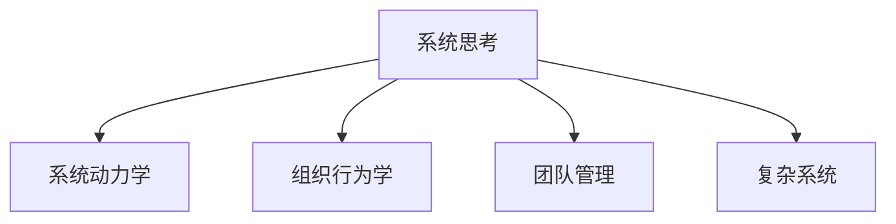

                 

# 如何将系统思考应用于团队管理

> 关键词：系统思考,系统动力学,组织行为学,团队管理,复杂系统

## 1. 背景介绍

### 1.1 问题由来
在信息技术高速发展的今天，团队管理已经成为企业成功的关键因素之一。然而，由于信息技术项目的复杂性、不确定性和多样性，团队管理面临着诸多挑战。传统的团队管理方法往往关注局部问题，难以应对系统性的问题和风险。系统思考的提出为团队管理提供了一种全局视角的分析方法，有助于理解复杂系统中的交互关系和因果关系，从而更有效地解决问题。

### 1.2 问题核心关键点
系统思考是一种基于系统动力学理论的思维方式，强调整体性与全局视角。系统动力学主要研究系统的行为和反馈机制，通过构建和分析系统的数学模型来理解系统内部的因果关系和动态变化。应用系统思考于团队管理，可以更全面地理解团队运作机制，识别关键问题，并设计解决方案。

## 2. 核心概念与联系

### 2.1 核心概念概述

为更好地理解系统思考在团队管理中的应用，本节将介绍几个密切相关的核心概念：

- 系统思考(System Thinking)：一种以系统动力学为基础的思维方式，强调整体性与全局视角，关注系统内部的因果关系和动态变化。
- 系统动力学(System Dynamics)：研究系统行为和反馈机制的科学，通过构建和分析系统的数学模型来理解系统的内部结构和动态行为。
- 组织行为学(Organizational Behavior)：研究个体和群体在组织中的行为、态度及其影响的学科，关注员工之间的交互关系和组织结构对行为的影响。
- 团队管理(Team Management)：通过协调和激励团队成员，实现团队目标的过程。强调沟通、合作和资源分配等关键要素。
- 复杂系统(Complex Systems)：由多个相互作用的子系统构成的系统，具有高度复杂性和非线性特征。系统思考是理解和分析复杂系统行为的有效工具。

这些核心概念之间的逻辑关系可以通过以下Mermaid流程图来展示：



这个流程图展示了一系列相关概念及其之间的关系：

1. 系统思考是应用系统动力学理论，理解复杂系统的思维方式。
2. 系统动力学通过数学模型分析系统内部的反馈机制和动态变化。
3. 组织行为学研究个体和群体在组织中的行为及其影响。
4. 团队管理涉及协调和激励团队成员，实现团队目标。
5. 复杂系统是由多个相互作用的子系统构成的系统，具有高度复杂性和非线性特征。

这些概念共同构成了团队管理的基础理论框架，系统思考在此框架中起到桥梁作用，帮助理解团队运作的因果关系和动态变化。

## 3. 核心算法原理 & 具体操作步骤
### 3.1 算法原理概述

系统思考在团队管理中的应用，主要基于系统动力学理论，通过构建和分析系统的因果关系和反馈机制，帮助理解团队内部的运作机制和行为模式，从而设计有效的管理策略。系统思考的应用包括以下几个关键步骤：

1. 识别系统中的关键变量：识别团队中的关键变量，如团队成员的行为、工作流程、沟通模式等。
2. 分析变量间的因果关系：通过因果图或仿真模型，分析这些关键变量之间的因果关系和动态变化。
3. 识别系统中的反馈机制：理解系统内部的反馈循环，识别正反馈和负反馈，帮助预测系统的未来行为。
4. 设计管理策略：基于系统分析结果，设计针对关键变量的管理策略，如激励措施、沟通机制、目标设定等。

### 3.2 算法步骤详解

系统思考在团队管理中的应用步骤详解如下：

**Step 1: 构建因果图**
- 识别团队中的关键变量，包括团队成员的行为、工作流程、沟通模式等。
- 通过因果图的形式，描述这些关键变量之间的因果关系。例如，成员的工作满意度影响其工作效率，工作效率影响项目的完成时间，项目完成时间影响团队绩效等。

**Step 2: 建立仿真模型**
- 根据因果图，构建系统的仿真模型，使用软件工具如SteadyState、Vensim等。
- 在模型中设置变量、参数、状态变量和算法，模拟团队运作的动态行为。

**Step 3: 仿真与分析**
- 运行仿真模型，观察系统内部的动态变化和反馈机制。
- 通过灵敏度分析、稳态分析等方法，理解关键变量的影响和系统动态行为。

**Step 4: 设计管理策略**
- 根据仿真结果，识别系统中的正反馈和负反馈，设计有效的管理策略。例如，增强正反馈，抑制负反馈，调整关键变量的参数，优化团队运作的效率和效果。
- 在实际管理中，实施这些策略，并持续监控系统的运行情况。

**Step 5: 评估与改进**
- 定期评估管理策略的效果，根据仿真结果和实际反馈进行调整和优化。
- 持续改进团队管理策略，适应组织和环境的变化。

### 3.3 算法优缺点

系统思考在团队管理中的应用具有以下优点：
1. 全局视角：系统思考提供了一种全局视角，有助于理解团队运作的复杂性和动态变化。
2. 数据驱动：通过仿真模型和数据分析，系统思考提供了科学的管理依据。
3. 预见性：系统思考帮助预测系统的未来行为，提前发现潜在问题并采取预防措施。
4. 适应性：系统思考强调持续改进和适应性管理，能够应对环境变化和不确定性。

同时，系统思考也存在一些局限性：
1. 复杂度高：系统思考需要构建和分析复杂的因果图和仿真模型，对团队管理者的要求较高。
2. 资源消耗大：系统分析需要大量的时间和计算资源，成本较高。
3. 可操作性差：系统思考强调全局视角，但在具体实施中可能难以操作。
4. 存在偏差：系统分析模型可能存在模型选择偏差、参数选择偏差等问题，影响分析结果的准确性。

尽管存在这些局限性，但系统思考为团队管理提供了一种全新的思维方式，能够有效应对复杂系统中的问题，具有广泛的应用前景。

### 3.4 算法应用领域

系统思考在团队管理中的应用广泛，主要包括以下几个领域：

- 项目管理和项目管理：通过理解项目运作的因果关系和反馈机制，设计有效的项目管理策略，提高项目完成效率和质量。
- 组织变革和组织发展：理解组织内部的动态变化和反馈机制，设计有效的组织变革策略，促进组织发展和创新。
- 员工激励和管理：通过理解员工行为和团队运作的因果关系，设计有效的员工激励和管理策略，提升员工满意度和工作效率。
- 领导力和决策制定：通过系统思考分析领导力的影响和决策制定的后果，提高领导力和决策质量。
- 团队协作和沟通：通过理解团队协作和沟通的因果关系，设计有效的沟通机制和协作策略，提高团队协作效率。

此外，系统思考还可以应用于企业战略管理、市场竞争、供应链管理等多个领域，为复杂系统问题的解决提供了科学的方法。

## 4. 数学模型和公式 & 详细讲解 & 举例说明

### 4.1 数学模型构建

系统思考在团队管理中的应用，主要通过因果图和仿真模型来构建数学模型。因果图是一种图形化的表示方法，用于描述系统内部的因果关系。仿真模型则通过数学公式和算法，模拟系统内部的动态行为。

**因果图构建**
因果图通常包括多个节点和边，每个节点表示一个变量，边表示因果关系。例如，考虑一个项目管理的因果图，可能包括以下节点：
- 节点1：团队成员的工作满意度
- 节点2：工作效率
- 节点3：项目完成时间
- 节点4：团队绩效

其中，节点1和节点2之间存在正向因果关系（工作满意度影响工作效率），节点2和节点3之间存在正向因果关系（工作效率影响项目完成时间），节点3和节点4之间存在正向因果关系（项目完成时间影响团队绩效）。因果图如下所示：

```
团队成员的工作满意度 -> 工作效率 -> 项目完成时间 -> 团队绩效
```

**仿真模型构建**
仿真模型通常使用系统动力学软件来构建，如SteadyState、Vensim等。模型通常包括以下组件：

1. 变量：系统中的关键变量，如团队成员的工作满意度、工作效率、项目完成时间、团队绩效等。
2. 参数：影响系统行为的参数，如团队激励水平、工作强度、项目目标等。
3. 状态变量：表示系统状态或状态的变量，如团队满意度水平、工作效率水平、项目完成时间等。
4. 算法：描述系统动态行为的算法，如差分方程、代数方程等。

以项目管理为例，可以使用以下差分方程来描述系统内部的动态变化：

$$
Sat_{i,t+1} = f(Sat_{i,t}, Eff_{i,t}, Mot_{i,t})
$$

$$
Eff_{i,t+1} = g(Eff_{i,t}, Sat_{i,t}, Pj_{i,t})
$$

$$
Pj_{i,t+1} = h(Pj_{i,t}, Eff_{i,t}, Comm_{i,t})
$$

$$
Comm_{i,t+1} = i(Comm_{i,t}, Pj_{i,t}, Impact_{i,t})
$$

其中，$Sat_{i,t}$ 表示第 $i$ 个成员在时间 $t$ 的工作满意度，$Eff_{i,t}$ 表示第 $i$ 个成员在时间 $t$ 的工作效率，$Pj_{i,t}$ 表示第 $i$ 个成员在时间 $t$ 的项目完成时间，$Comm_{i,t}$ 表示第 $i$ 个成员在时间 $t$ 的沟通效率。

### 4.2 公式推导过程

以项目管理为例，推导以下公式的计算过程：

**工作满意度更新公式**
$$
Sat_{i,t+1} = f(Sat_{i,t}, Eff_{i,t}, Mot_{i,t})
$$

其中，$f$ 表示满意度更新函数，通常包括工作满意度对工作效率和激励水平的响应关系。例如：

$$
Sat_{i,t+1} = Sat_{i,t} + k \times (Eff_{i,t} - Eff_{i,avg}) + Mot_{i,t}
$$

其中，$k$ 表示满意度的响应系数，$Eff_{i,avg}$ 表示团队平均工作效率，$Mot_{i,t}$ 表示第 $i$ 个成员在时间 $t$ 的激励水平。

**工作效率更新公式**
$$
Eff_{i,t+1} = g(Eff_{i,t}, Sat_{i,t}, Pj_{i,t})
$$

其中，$g$ 表示工作效率更新函数，通常包括工作效率对工作满意度和项目进度的响应关系。例如：

$$
Eff_{i,t+1} = Eff_{i,t} + l \times (Sat_{i,t} - Sat_{i,avg}) + p \times (Pj_{i,t} - Pj_{i,avg})
$$

其中，$l$ 表示工作效率的响应系数，$Sat_{i,avg}$ 表示团队平均满意度，$Pj_{i,avg}$ 表示项目平均进度。

**项目完成时间更新公式**
$$
Pj_{i,t+1} = h(Pj_{i,t}, Eff_{i,t}, Comm_{i,t})
$$

其中，$h$ 表示项目完成时间更新函数，通常包括项目进度对工作效率和沟通效率的响应关系。例如：

$$
Pj_{i,t+1} = Pj_{i,t} + m \times (Eff_{i,t} - Eff_{i,avg}) + n \times (Comm_{i,t} - Comm_{i,avg})
$$

其中，$m$ 表示项目进度的响应系数，$Comm_{i,avg}$ 表示团队平均沟通效率。

**沟通效率更新公式**
$$
Comm_{i,t+1} = i(Comm_{i,t}, Pj_{i,t}, Impact_{i,t})
$$

其中，$i$ 表示沟通效率更新函数，通常包括沟通效率对项目进度和影响效果的响应关系。例如：

$$
Comm_{i,t+1} = Comm_{i,t} + o \times (Pj_{i,t} - Pj_{i,avg}) + q \times Impact_{i,t}
$$

其中，$o$ 表示沟通效率的响应系数，$Impact_{i,t}$ 表示第 $i$ 个成员在时间 $t$ 的项目影响效果。

### 4.3 案例分析与讲解

以一个项目管理的仿真模型为例，进行系统思考的应用分析。假设一个软件开发团队，成员数量固定，项目时间固定，项目目标固定。通过系统思考分析，可以识别出以下几个关键变量及其因果关系：

- 成员工作满意度：工作满意度影响工作效率。
- 工作效率：工作效率影响项目完成时间。
- 项目完成时间：项目完成时间影响团队绩效。
- 团队绩效：团队绩效影响成员满意度。

根据上述因果关系，构建如下因果图：

```
成员工作满意度 -> 工作效率 -> 项目完成时间 -> 团队绩效 -> 成员工作满意度
```

然后，使用系统动力学软件，如SteadyState或Vensim，建立仿真模型。模型中包括工作满意度、工作效率、项目完成时间和团队绩效等变量，以及对应的参数和状态变量。通过设置不同的参数值，运行仿真模型，观察系统的动态行为和反馈机制。例如，当团队激励水平较高时，成员工作满意度较高，工作效率也较高，项目完成时间较短，团队绩效较好，从而形成正反馈循环。

## 5. 项目实践：代码实例和详细解释说明
### 5.1 开发环境搭建

在进行系统思考的实践前，我们需要准备好开发环境。以下是使用Python进行Sympy、SteadyState等系统动力学工具开发的环境配置流程：

1. 安装Anaconda：从官网下载并安装Anaconda，用于创建独立的Python环境。

2. 创建并激活虚拟环境：
```bash
conda create -n sysdyn-env python=3.8 
conda activate sysdyn-env
```

3. 安装必要的软件包：
```bash
conda install sympy sympy-steadystate scipy numpy pandas jupyter notebook ipython
```

4. 下载并导入系统动力学仿真软件：
```bash
conda install steady-state-statespace
```

5. 安装可视化工具：
```bash
conda install plotly
```

完成上述步骤后，即可在`sysdyn-env`环境中开始系统思考实践。

### 5.2 源代码详细实现

下面我们以一个项目管理的系统动力学模型为例，给出使用Python和Sympy进行系统思考分析的代码实现。

首先，定义模型的变量、参数和函数：

```python
import sympy as sp
import steady_state as ss

# 定义模型变量
Sat = sp.Symbol('Sat', positive=True)
Eff = sp.Symbol('Eff', positive=True)
Pj = sp.Symbol('Pj', positive=True)
Comm = sp.Symbol('Comm', positive=True)

# 定义模型参数
k = sp.Symbol('k', positive=True)
l = sp.Symbol('l', positive=True)
m = sp.Symbol('m', positive=True)
o = sp.Symbol('o', positive=True)
q = sp.Symbol('q', positive=True)

# 定义模型函数
def f(Sat, Eff, Mot):
    return Sat + k * (Eff - sp.Rational(1, 2)) + Mot

def g(Eff, Sat, Pj):
    return Eff + l * (Sat - sp.Rational(1, 2)) + m * (Pj - sp.Rational(1, 2))

def h(Pj, Eff, Comm):
    return Pj + m * (Eff - sp.Rational(1, 2)) + n * (Comm - sp.Rational(1, 2))

def i(Comm, Pj, Impact):
    return Comm + o * (Pj - sp.Rational(1, 2)) + q * Impact

# 创建系统动力学模型
model = ss.DynamicModel()
model.add_states(Sat, Eff, Pj, Comm)
model.add_functions(f, g, h, i)
```

然后，设置模型的初始状态和参数，并运行仿真：

```python
# 设置模型参数
k = 0.5
l = 0.3
m = 0.4
o = 0.2
q = 0.1

# 设置模型初始状态
initial_states = {Sat: 0.5, Eff: 0.5, Pj: 0.5, Comm: 0.5}

# 运行仿真模型
results = model.run(states=initial_states, time_spans=100, step_size=0.01)
```

最后，绘制仿真结果并进行分析：

```python
# 绘制工作满意度、工作效率、项目完成时间和沟通效率的仿真结果
sp.plot(results[Sat], label='工作满意度')
sp.plot(results[Eff], label='工作效率')
sp.plot(results[Pj], label='项目完成时间')
sp.plot(results[Comm], label='沟通效率')
sp.legend()
sp.show()
```

以上就是使用Python和Sympy进行系统思考实践的完整代码实现。可以看到，通过简单的代码，我们能够构建和管理一个系统动力学模型，并观察系统的动态行为和反馈机制。

### 5.3 代码解读与分析

让我们再详细解读一下关键代码的实现细节：

**变量定义**
- 使用Sympy库定义模型的关键变量，如工作满意度、工作效率、项目完成时间和沟通效率。
- 使用Sympy符号变量，确保变量具有明确的数学意义和计算规则。

**参数定义**
- 使用Sympy符号变量定义模型的参数，如响应系数和增益系数。
- 使用Sympy符号变量，方便在后续仿真中灵活调整参数值。

**函数定义**
- 定义模型中各个变量的更新函数，如工作满意度的更新函数$f$、工作效率的更新函数$g$、项目完成时间的更新函数$h$和沟通效率的更新函数$i$。
- 使用Sympy和SteadyState库的函数功能，实现各个变量的动态更新。

**模型创建**
- 使用SteadyState库创建系统动力学模型，并添加变量、函数和参数。
- 通过add_functions和add_states方法，方便定义模型的结构和动态行为。

**仿真运行**
- 设置模型的初始状态和参数，使用run方法运行仿真模型。
- 运行仿真的时间跨度和步长，确保仿真结果的精度和稳定性。

**结果绘制**
- 使用Sympy库的plot函数，绘制工作满意度、工作效率、项目完成时间和沟通效率的仿真结果。
- 使用label参数为每个变量指定标签，方便后续分析。
- 使用legend和show方法，展示仿真结果并进行操作。

通过以上步骤，我们能够构建并运行一个系统动力学模型，观察系统的动态行为和反馈机制。在实际应用中，需要根据具体的团队管理问题，定义合适的变量和参数，构建和运行仿真模型，并分析仿真结果，设计有效的管理策略。

## 6. 实际应用场景
### 6.1 智能客服系统

智能客服系统是大规模应用系统思考的典型案例。智能客服系统通常需要处理海量用户请求，并提供快速、准确的回复。通过系统思考，可以全面分析智能客服系统中的因果关系和动态行为，设计有效的管理策略，提升客服系统的性能和用户体验。

具体而言，可以构建智能客服系统的因果图，识别关键变量及其因果关系。例如，用户满意度、响应时间、平均处理时间和系统负载等。通过仿真模型，分析这些变量之间的动态行为和反馈机制。例如，响应时间较长会影响用户满意度，用户满意度较高会激励客服人员提高工作效率，从而降低平均处理时间。根据仿真结果，设计优化策略，如调整客服人员配置、优化响应流程、引入自动化工具等，提升客服系统的整体性能。

### 6.2 金融舆情监测

金融舆情监测系统需要实时监测社交媒体、新闻报道、财经论坛等数据，及时发现和分析金融市场的舆情变化。通过系统思考，可以全面分析金融舆情监测系统的因果关系和动态行为，设计有效的管理策略，提升舆情监测的准确性和及时性。

具体而言，可以构建金融舆情监测系统的因果图，识别关键变量及其因果关系。例如，舆情数据、舆情分析结果、舆情预测结果和舆情报告等。通过仿真模型，分析这些变量之间的动态行为和反馈机制。例如，舆情数据的质量和完整性会影响舆情分析结果的准确性，舆情分析结果的及时性会影响舆情预测结果的可靠性。根据仿真结果，设计优化策略，如优化数据采集和清洗流程、引入高级分析算法、加强舆情报告的及时性等，提升金融舆情监测系统的整体性能。

### 6.3 个性化推荐系统

个性化推荐系统需要根据用户的历史行为和当前需求，推荐符合用户兴趣的个性化内容。通过系统思考，可以全面分析个性化推荐系统中的因果关系和动态行为，设计有效的管理策略，提升推荐系统的个性化程度和用户满意度。

具体而言，可以构建个性化推荐系统的因果图，识别关键变量及其因果关系。例如，用户历史行为、用户兴趣、推荐内容质量和用户满意度等。通过仿真模型，分析这些变量之间的动态行为和反馈机制。例如，用户历史行为和用户兴趣会影响推荐内容的个性化程度，推荐内容的个性化程度会影响用户满意度和用户停留时间。根据仿真结果，设计优化策略，如优化推荐算法、引入用户反馈机制、加强个性化内容的质量控制等，提升个性化推荐系统的整体性能。

### 6.4 未来应用展望

随着系统思考理论的不断发展和应用，未来在系统管理领域将会有更多的创新和突破。以下是系统思考在未来应用中的几个重要方向：

1. 复杂系统管理：系统思考在复杂系统管理中的应用将不断扩展，涵盖更多领域和场景，如智能城市、智慧医疗、智能制造等。系统思考将帮助理解和优化复杂系统中的因果关系和动态行为。

2. 人工智能融合：系统思考与人工智能技术的融合将更加紧密，系统思考将帮助设计和管理基于人工智能的应用，如智能客服、智能推荐、智能医疗等。系统思考将提供全局视角，帮助理解和优化人工智能系统的行为和性能。

3. 社会系统分析：系统思考将应用于社会系统的分析和管理，如社会网络、城市规划、政策制定等。系统思考将帮助理解社会系统的复杂性和动态行为，设计有效的管理策略。

4. 组织变革优化：系统思考将应用于组织变革和组织发展的优化，如企业文化建设、组织结构调整、领导力提升等。系统思考将帮助理解和优化组织内部的因果关系和动态行为，设计有效的变革策略。

5. 跨学科融合：系统思考将与其他学科进行跨学科融合，如与心理学、经济学、生态学等学科进行结合，形成更加全面和深入的系统分析和管理方法。系统思考将帮助理解跨学科系统中的因果关系和动态行为，设计有效的管理策略。

## 7. 工具和资源推荐
### 7.1 学习资源推荐

为了帮助开发者系统掌握系统思考的理论基础和实践技巧，这里推荐一些优质的学习资源：

1. 《系统思考：用系统动力学和复杂性思维设计组织》：这本书详细介绍了系统思考的基本概念和应用方法，是系统思考学习的必读书籍。

2. 《系统动力学：理解系统行为和反馈机制》：这本书介绍了系统动力学的基本理论和应用方法，是系统思考学习的经典教材。

3. 《复杂系统与系统思考》：这本书介绍了复杂系统的基本理论和系统思考的应用方法，是系统思考学习的宝贵资源。

4. 《系统思考与创新》：这本书介绍了系统思考在创新管理中的应用，帮助理解系统思考在组织创新中的作用。

5. 《系统思考与组织变革》：这本书介绍了系统思考在组织变革中的应用，帮助理解系统思考在组织变革中的作用。

通过对这些资源的学习实践，相信你一定能够快速掌握系统思考的精髓，并用于解决实际的团队管理问题。

### 7.2 开发工具推荐

高效的开发离不开优秀的工具支持。以下是几款用于系统思考开发和分析的工具：

1. Sympy：Python库，用于符号计算和数学建模，支持方程求解、函数定义、符号变量等。

2. StadyState：系统动力学仿真工具，支持因果图和仿真模型的构建，支持多种仿真算法。

3. Vensim：系统动力学仿真工具，支持因果图和仿真模型的构建，支持多种仿真算法。

4. Python NetworkX：用于网络分析的Python库，支持复杂系统的建模和分析。

5. Plotly：可视化工具，支持绘制复杂系统的仿真结果和因果图。

6. TensorBoard：可视化工具，支持绘制复杂系统的仿真结果和因果图。

合理利用这些工具，可以显著提升系统思考的开发效率，加快创新迭代的步伐。

### 7.3 相关论文推荐

系统思考的研究源于学界的持续研究。以下是几篇奠基性的相关论文，推荐阅读：

1. 《系统思考：理解复杂系统的核心》：这篇论文系统介绍了系统思考的基本概念和应用方法，是系统思考研究的经典文献。

2. 《系统动力学：理解系统行为和反馈机制》：这篇论文详细介绍了系统动力学的基本理论和应用方法，是系统思考研究的经典文献。

3. 《复杂系统与系统思考》：这篇论文介绍了复杂系统的基本理论和系统思考的应用方法，是系统思考研究的宝贵资源。

4. 《系统思考与组织变革》：这篇论文介绍了系统思考在组织变革中的应用，帮助理解系统思考在组织变革中的作用。

5. 《系统思考与创新管理》：这篇论文介绍了系统思考在创新管理中的应用，帮助理解系统思考在组织创新中的作用。

这些论文代表了大系统思考的发展脉络。通过学习这些前沿成果，可以帮助研究者把握学科前进方向，激发更多的创新灵感。

## 8. 总结：未来发展趋势与挑战

### 8.1 总结

本文对系统思考在团队管理中的应用进行了全面系统的介绍。首先阐述了系统思考的理论基础和应用意义，明确了系统思考在理解复杂系统行为和优化系统管理策略方面的独特价值。其次，从原理到实践，详细讲解了系统思考的数学模型和仿真方法，给出了系统思考任务开发的完整代码实例。同时，本文还广泛探讨了系统思考在智能客服、金融舆情、个性化推荐等多个领域的应用前景，展示了系统思考的广泛应用潜力。此外，本文精选了系统思考学习的各类资源，力求为读者提供全方位的技术指引。

通过本文的系统梳理，可以看到，系统思考为团队管理提供了一种全新的思维方式，能够有效应对复杂系统中的问题，具有广泛的应用前景。未来，伴随系统思考理论的不断发展和应用，系统管理领域将会有更多的创新和突破，推动系统管理技术不断成熟和完善。

### 8.2 未来发展趋势

展望未来，系统思考在团队管理中的应用将呈现以下几个发展趋势：

1. 复杂系统管理：系统思考在复杂系统管理中的应用将不断扩展，涵盖更多领域和场景，如智能城市、智慧医疗、智能制造等。系统思考将帮助理解和优化复杂系统中的因果关系和动态行为。

2. 人工智能融合：系统思考与人工智能技术的融合将更加紧密，系统思考将帮助设计和管理基于人工智能的应用，如智能客服、智能推荐、智能医疗等。系统思考将提供全局视角，帮助理解和优化人工智能系统的行为和性能。

3. 社会系统分析：系统思考将应用于社会系统的分析和管理，如社会网络、城市规划、政策制定等。系统思考将帮助理解社会系统的复杂性和动态行为，设计有效的管理策略。

4. 跨学科融合：系统思考将与其他学科进行跨学科融合，如与心理学、经济学、生态学等学科进行结合，形成更加全面和深入的系统分析和管理方法。系统思考将帮助理解跨学科系统中的因果关系和动态行为，设计有效的管理策略。

这些趋势凸显了系统思考理论的广阔前景。这些方向的探索发展，必将进一步提升系统思考技术的管理效能，为复杂系统问题的解决提供科学的方法。

### 8.3 面临的挑战

尽管系统思考在团队管理中已经取得了显著成效，但在迈向更加智能化、普适化应用的过程中，它仍面临着诸多挑战：

1. 数据质量问题：系统思考需要大量的数据支持，数据的准确性、完整性和及时性直接影响仿真模型的精度。如何获取和处理高质量的数据，仍然是一个重要问题。

2. 模型复杂度：系统思考需要构建和分析复杂的因果图和仿真模型，对团队管理者的要求较高。如何简化模型结构，提高模型的可操作性，需要更多的创新和实践。

3. 实际应用难度：系统思考的理论方法在实际应用中可能存在操作难度和实施成本，难以大规模推广。如何降低应用门槛，提高应用效果，是未来研究的重点。

4. 跨学科协作：系统思考需要跨学科的协作和合作，如何整合不同学科的知识和方法，形成全面的系统分析和管理方法，需要更多的探索和实践。

5. 系统学习与适应：系统思考强调持续学习和适应，如何设计有效的学习机制，帮助系统动态适应环境变化，需要更多的理论和实践支持。

这些挑战需要研究者和实践者共同面对和解决，通过不断的理论创新和实践探索，提升系统思考的实际应用效果和推广范围。

### 8.4 研究展望

面向未来，系统思考在团队管理中的应用将面临更多的机遇和挑战。以下是几个值得关注的研究方向：

1. 跨学科方法：系统思考将与其他学科进行更深层次的融合，形成更加全面和深入的系统分析和管理方法。

2. 实时分析和动态优化：系统思考将引入实时分析和动态优化技术，提升系统管理的实时性和适应性。

3. 多模态数据融合：系统思考将与其他数据源进行融合，如传感器数据、社交媒体数据等，提供更全面的系统分析视角。

4. 伦理和社会影响：系统思考将关注伦理和社会影响问题，确保系统管理决策的公正性和可持续性。

5. 跨部门协同：系统思考将促进跨部门的协同管理，提升组织内部的协作效率和决策质量。

6. 人机协同：系统思考将结合人工智能技术，推动人机协同的智能系统发展，提升系统管理的智能化水平。

这些研究方向将进一步拓展系统思考的应用范围，提升系统管理的效能和效果。

## 9. 附录：常见问题与解答

**Q1：系统思考与传统管理方法有何不同？**

A: 系统思考与传统管理方法的最大不同在于全局视角的应用。传统管理方法往往关注局部问题，难以理解复杂系统中的因果关系和动态变化。而系统思考通过全局视角，理解和优化复杂系统中的因果关系和动态行为，能够更全面地解决问题。

**Q2：系统思考在实际应用中需要注意哪些问题？**

A: 系统思考在实际应用中需要注意以下几个问题：
1. 数据质量问题：确保数据的准确性、完整性和及时性，避免数据噪声对仿真模型的影响。
2. 模型复杂度问题：简化模型结构，提高模型的可操作性，避免过度复杂的仿真模型。
3. 跨学科协作问题：促进跨学科的协作和合作，整合不同学科的知识和方法，形成全面的系统分析和管理方法。
4. 系统学习与适应问题：设计有效的学习机制，帮助系统动态适应环境变化，提升系统的实时性和适应性。

**Q3：系统思考在团队管理中如何应用？**

A: 系统思考在团队管理中的应用主要包括以下几个步骤：
1. 构建因果图：识别团队中的关键变量及其因果关系。
2. 建立仿真模型：使用系统动力学软件构建仿真模型，模拟团队运作的动态行为和反馈机制。
3. 仿真与分析：运行仿真模型，观察系统内部的动态行为和反馈机制，识别关键变量及其影响。
4. 设计管理策略：基于仿真结果，设计针对关键变量的管理策略，如激励措施、沟通机制、目标设定等。
5. 评估与改进：定期评估管理策略的效果，根据仿真结果和实际反馈进行调整和优化。

通过以上步骤，可以系统思考的方法全面理解团队运作的因果关系和动态行为，设计有效的管理策略，提升团队管理的整体效果。

通过本文的系统梳理，可以看到，系统思考为团队管理提供了一种全新的思维方式，能够有效应对复杂系统中的问题，具有广泛的应用前景。未来，伴随系统思考理论的不断发展和应用，系统管理领域将会有更多的创新和突破，推动系统管理技术不断成熟和完善。相信通过不断的理论创新和实践探索，系统思考将能够更好地应用于实际管理场景，提升组织的管理效能和绩效。

