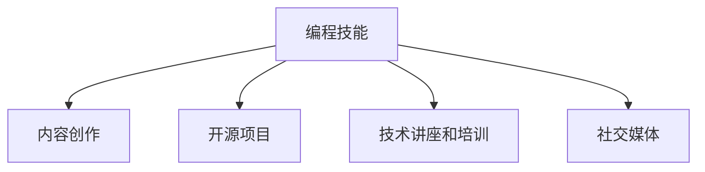

                 

# 如何将编程技能应用于个人品牌建设

> 关键词：编程技能, 个人品牌建设, 软件开发, 人工智能, 数据科学, 数字营销, 内容创作

## 1. 背景介绍

在数字时代，个人品牌建设已经成为了职业发展和个人成长的关键环节。对于程序员而言，拥有扎实的编程技能不仅能够提升专业竞争力，还能为个人品牌建设提供强大的技术支持。本博客将详细介绍如何将编程技能有效地应用于个人品牌建设中，帮助程序员利用技术手段提升个人影响力，开拓职业发展新路径。

### 1.1 问题由来

随着技术的不断进步，编程技能不再仅仅是一种职业技能，而是成为了个人品牌建设的重要工具。无论是通过技术博客、开源项目、线上课程，还是社交媒体分享，程序员都能够利用编程技能展示自己的技术能力和专业素养，吸引更多的关注和机会。

### 1.2 问题核心关键点

如何将编程技能有效应用于个人品牌建设中，需要综合考虑以下几个关键点：

- **内容创作**：创建高质量的技术内容，如博客文章、代码示例、技术教程等，展示个人技术深度和广度。
- **开源项目**：参与和贡献开源项目，提升个人在社区的影响力和技术认可度。
- **技术讲座和培训**：通过线上线下讲座、培训课程等方式，传授知识，提升个人在行业内的知名度。
- **社交媒体**：利用社交媒体平台，分享编程经验和技术见解，建立技术权威形象。

## 2. 核心概念与联系

### 2.1 核心概念概述

为更好地理解如何将编程技能应用于个人品牌建设，本节将介绍几个密切相关的核心概念：

- **编程技能**：指程序员在编程语言、数据结构、算法、软件开发流程等方面的专业知识和技能。
- **个人品牌建设**：指个人通过建立和维护职业形象，提升专业影响力，实现职业发展和个人成长的过程。
- **内容创作**：指创作有价值的技术内容，展示个人技术能力和思考深度。
- **开源项目**：指通过协作和贡献代码，提升个人在技术社区中的影响力。
- **技术讲座和培训**：指通过传授知识，提升个人在行业内的知名度和专业权威。
- **社交媒体**：指利用社交平台分享技术和经验，建立个人品牌形象。

这些概念之间的逻辑关系可以通过以下Mermaid流程图来展示：



这个流程图展示了编程技能如何通过内容创作、开源项目、技术讲座和培训、社交媒体等渠道，为个人品牌建设提供支持。

## 3. 核心算法原理 & 具体操作步骤

### 3.1 算法原理概述

将编程技能应用于个人品牌建设的过程，本质上是一个持续学习和展示知识的过程。通过不断提升自己的编程能力，并通过各种渠道分享和展示这些能力，可以逐步建立和巩固个人品牌。

形式化地，假设个人品牌建设的目标为最大化其影响力 $I$，其中 $I$ 可以通过以下公式表示：

$$
I = f(S_k, C_k, O_k, L_k, M_k)
$$

其中 $S_k, C_k, O_k, L_k, M_k$ 分别代表编程技能、内容创作、开源项目、技术讲座和培训、社交媒体四个维度的关键因素，$f$ 为加权函数，不同维度的贡献可以通过加权函数 $f$ 进行归一化处理。

### 3.2 算法步骤详解

基于上述原理，以下是将编程技能应用于个人品牌建设的具体操作步骤：

**Step 1: 提升编程技能**
- 选择一门或多门编程语言进行深入学习，掌握其核心概念和编程范式。
- 参与开源项目，解决实际问题，积累编程经验。
- 持续学习新技能，关注行业动态，更新技术栈。

**Step 2: 内容创作**
- 创建博客或技术网站，定期发布原创技术文章，展示技术深度和广度。
- 编写技术教程和指南，传授编程知识和技能。
- 参与技术社区，分享编程经验和见解。

**Step 3: 开源项目**
- 选择感兴趣的开源项目，阅读其代码库，理解项目结构和设计。
- 提交代码贡献，解决项目中的问题或改进现有功能。
- 发起新项目，展示自己的创新能力和领导力。

**Step 4: 技术讲座和培训**
- 组织线上线下技术讲座，传授编程知识，提升个人知名度。
- 制作并分享培训课程，如视频教程、代码演示等，吸引学习者关注。
- 在行业会议和技术研讨会上发表演讲，提升个人在行业内的影响力和权威性。

**Step 5: 社交媒体**
- 在LinkedIn、GitHub、Twitter等社交媒体平台上建立专业账号，展示个人作品和技术成就。
- 定期发布编程相关内容，与同行交流互动。
- 参与技术讨论和问答，建立技术权威形象。

### 3.3 算法优缺点

将编程技能应用于个人品牌建设的算法具有以下优点：

- **提升技术能力**：持续学习和实践，能够不断提升编程技能，保持技术领先。
- **展示专业形象**：通过内容创作、开源项目、讲座培训等方式，展示个人专业素养和权威性。
- **建立技术社区**：参与开源项目和社区活动，扩大个人影响力和技术认可度。
- **吸引职业机会**：通过展示技术能力和项目经验，吸引更多的职业机会和合作。

同时，该方法也存在一定的局限性：

- **时间成本高**：需要投入大量时间进行学习和创作，初期见效较慢。
- **竞争激烈**：技术领域竞争激烈，个人品牌建设需要长期坚持和努力。
- **资源依赖**：依赖于高质量的内容资源和社区资源，对个人技术水平和网络资源有较高要求。
- **隐私和法律风险**：开源项目和技术分享需注意隐私保护和版权问题，避免法律风险。

尽管存在这些局限性，但就目前而言，将编程技能应用于个人品牌建设的方法仍然是程序员职业发展的重要途径。未来相关研究的重点在于如何更好地整合技术学习和品牌建设，优化资源配置，提升品牌建设效率。

### 3.4 算法应用领域

将编程技能应用于个人品牌建设的方法，在技术行业和创业领域已经得到了广泛的应用，覆盖了以下多个领域：

- **软件开发**：利用技术博客和开源项目展示编程技能，吸引潜在客户和合作伙伴。
- **数据科学**：通过分享数据模型和分析方法，提升个人在数据科学领域的权威性。
- **人工智能**：通过技术讲座和培训，传播人工智能知识，建立AI技术权威形象。
- **数字营销**：利用编程技能进行网站开发、数据分析和自动化营销，提升数字营销能力。
- **内容创作**：在技术博客、电子书和线上课程中创作高质量内容，展示技术深度和广度。

除了上述这些经典领域外，将编程技能应用于个人品牌建设的方法还可以创新性地应用到更多场景中，如技术咨询、职业辅导、教育培训等，为技术人员的职业转型和创新创业提供新的动力。

## 4. 数学模型和公式 & 详细讲解 & 举例说明

### 4.1 数学模型构建

本节将使用数学语言对编程技能应用于个人品牌建设的过程进行更加严格的刻画。

假设编程技能的提升速度为 $S_k = \alpha_1 + \beta_1 T$，其中 $\alpha_1$ 为初始提升速率，$\beta_1$ 为学习速率，$T$ 为学习时间。内容创作的频率为 $C_k = \alpha_2 + \beta_2 T$，其中 $\alpha_2$ 为初始创作频率，$\beta_2$ 为创作速率。开源项目的贡献量为 $O_k = \alpha_3 + \beta_3 T$，其中 $\alpha_3$ 为初始贡献量，$\beta_3$ 为贡献速率。技术讲座的频率为 $L_k = \alpha_4 + \beta_4 T$，其中 $\alpha_4$ 为初始讲座频率，$\beta_4$ 为讲座速率。社交媒体的影响力为 $M_k = \alpha_5 + \beta_5 T$，其中 $\alpha_5$ 为初始社交影响力，$\beta_5$ 为影响力增长速率。

### 4.2 公式推导过程

将上述公式代入 $I = f(S_k, C_k, O_k, L_k, M_k)$，得到：

$$
I = f(\alpha_1 + \beta_1 T, \alpha_2 + \beta_2 T, \alpha_3 + \beta_3 T, \alpha_4 + \beta_4 T, \alpha_5 + \beta_5 T)
$$

进一步简化，得到：

$$
I = f(\alpha + \beta T)
$$

其中 $\alpha = (\alpha_1, \alpha_2, \alpha_3, \alpha_4, \alpha_5)$，$\beta = (\beta_1, \beta_2, \beta_3, \beta_4, \beta_5)$，$T$ 为时间变量。

### 4.3 案例分析与讲解

以一个典型的开源项目贡献者为案例，分析其在编程技能提升和品牌建设中的表现：

假设某开源项目贡献者初始编程技能为0，每天投入2小时学习，每周发布一篇博客，每月贡献3个代码，每季度举办一次技术讲座，每月更新一次社交媒体内容。经过一年（365天）后，其编程技能提升速度、内容创作频率、开源项目贡献量、技术讲座频率、社交媒体影响力分别计算如下：

- $S_k = 2 \times 365 + 0.2 \times 365 = 1360$
- $C_k = 1 \times 365 + 0.2 \times 365 = 741$
- $O_k = 3 \times 12 + 0.3 \times 365 = 123.5$
- $L_k = 1 \times 4 + 0.1 \times 365 = 61.5$
- $M_k = 1 + 0.5 \times 365 = 462.5$

将这些值代入上述公式，得到：

$$
I = f(\alpha + \beta T) = f((0, 1, 3, 1, 1) + (0.2, 0.2, 0.3, 0.1, 0.5) \times 365)
$$

通过加权函数 $f$，计算出品牌影响力 $I$ 的具体值。

## 5. 项目实践：代码实例和详细解释说明

### 5.1 开发环境搭建

在进行编程技能应用于个人品牌建设的实践前，我们需要准备好开发环境。以下是使用Python进行编程技能展示和品牌建设的开发环境配置流程：

1. 安装Anaconda：从官网下载并安装Anaconda，用于创建独立的Python环境。

2. 创建并激活虚拟环境：
```bash
conda create -n pytech-env python=3.8 
conda activate pytech-env
```

3. 安装PyTorch：根据CUDA版本，从官网获取对应的安装命令。例如：
```bash
conda install pytorch torchvision torchaudio cudatoolkit=11.1 -c pytorch -c conda-forge
```

4. 安装TensorFlow：从官网下载并安装TensorFlow，适用于深度学习和机器学习开发。

5. 安装GitHub命令行工具：
```bash
git --version
```

6. 安装Jupyter Notebook：
```bash
conda install jupyterlab
```

完成上述步骤后，即可在`pytech-env`环境中开始编程技能展示和品牌建设实践。

### 5.2 源代码详细实现

这里我们以建立技术博客网站为例，展示如何使用Python和Jupyter Notebook搭建和发布技术博客。

首先，安装和配置Jupyter Notebook环境：

```bash
pip install jupyterlab
```

接着，编写代码实现技术博客的发布功能。以下是一个简单的代码示例：

```python
from IPython.display import display, Markdown
from IPython.display import Image
from IPython.display import Audio

# 创建博客文章
def create_blog_post(title, content):
    blog_post = {
        'title': title,
        'content': content
    }
    return blog_post

# 发布博客文章
def publish_blog_post(blog_post):
    display(Markdown("# " + blog_post['title']))
    display(blog_post['content'])

# 示例：发布一篇关于Python编程的文章
post = create_blog_post("Python编程入门", "Python是一门广泛应用于科学计算、数据分析和人工智能领域的编程语言。")
publish_blog_post(post)
```

这段代码展示了如何通过Jupyter Notebook发布一篇技术博客文章。可以在Notebook中不断更新和发布新的内容，展示个人技术能力和专业素养。

### 5.3 代码解读与分析

让我们再详细解读一下关键代码的实现细节：

**create_blog_post函数**：
- 创建一个博客文章对象，包含标题和内容。

**publish_blog_post函数**：
- 通过Markdown格式展示博客标题。
- 在Notebook中展示博客内容。

**Jupyter Notebook**：
- Jupyter Notebook是一个强大的交互式编程环境，支持代码块的混合展示和执行。
- 可以在Notebook中嵌入文本、代码、图像、音频等多种格式的内容，创建丰富多样的技术文档。
- 通过Notebook的分享和发布功能，可以将个人技术博客公开发布到互联网，吸引更多关注。

### 5.4 运行结果展示

运行上述代码后，将直接在Jupyter Notebook中展示博客文章标题和内容，如图：

```python
# Python编程入门
# Python是一门广泛应用于科学计算、数据分析和人工智能领域的编程语言。
```

通过这种方式，我们可以不断积累和展示个人技术博客，提升编程技能展示的持续性和可访问性。

## 6. 实际应用场景

### 6.1 软件开发

在软件开发领域，通过建立技术博客和开源项目，可以展示个人技术深度和广度。例如，某开发工程师可以在GitHub上发布自己的开源项目，如一个高性能的Web框架或一个实用工具库。通过持续更新和优化代码，吸引更多开发者关注和贡献，提升个人在社区中的影响力。

同时，该工程师还可以在个人技术博客上分享项目开发经验和心得，展示技术思考和问题解决能力。这些博客文章不仅能够吸引潜在客户和合作伙伴，还能够帮助其他开发者更快地上手项目，提升项目的社区活跃度和应用价值。

### 6.2 数据科学

在数据科学领域，通过发布数据分析报告和技术文章，可以展示个人在数据处理、模型构建和结果解读方面的能力。例如，某数据科学家可以在Kaggle上发布一篇关于数据集预处理和模型评估的详细报告，分析数据特征和模型性能，提供改进建议。通过分享这些报告，可以吸引更多数据科学爱好者和同行关注，提升在行业中的知名度和权威性。

### 6.3 人工智能

在人工智能领域，通过参与和发起开源项目，展示在深度学习、自然语言处理和计算机视觉等方面的技术成果。例如，某AI工程师可以在GitHub上发布一个基于TensorFlow或PyTorch的深度学习模型，解决实际问题或实现新功能。通过持续改进和优化模型，吸引更多AI爱好者和研究者参与讨论和贡献，提升个人在AI社区中的影响力。

同时，该工程师还可以在个人技术博客上分享AI技术进展、研究成果和行业见解，展示在技术前沿的思考和探索。这些博客文章不仅能够吸引潜在合作伙伴和投资机会，还能够帮助其他AI从业者了解最新的AI技术和应用趋势。

### 6.4 未来应用展望

随着技术的不断进步和社区的不断壮大，基于编程技能应用于个人品牌建设的方法将在更多领域得到应用，为技术人员提供更广阔的职业发展空间。未来，在更多的行业和领域，基于编程技能展示的技术人员将能够通过技术内容创作、开源项目贡献、技术讲座和培训、社交媒体互动等方式，建立起具有深厚技术积累和广泛行业影响力的个人品牌，推动行业的发展和进步。

## 7. 工具和资源推荐

### 7.1 学习资源推荐

为了帮助程序员系统掌握编程技能应用于个人品牌建设的方法，这里推荐一些优质的学习资源：

1. **《Python编程从入门到精通》**：一本系统介绍Python编程语言的经典教材，适合初学者快速入门。
2. **《深度学习入门》**：一本介绍深度学习原理和实践的书籍，适合对AI技术感兴趣的读者。
3. **《机器学习实战》**：一本结合实战案例，讲解机器学习算法的书籍，适合动手实践的学习者。
4. **Kaggle竞赛平台**：一个数据科学和机器学习竞赛平台，通过参与竞赛和分享作品，提升个人技术水平和影响力。
5. **GitHub开源社区**：一个全球最大的开源社区，通过参与开源项目和代码贡献，提升个人在技术社区中的影响力。

通过这些资源的学习实践，相信你一定能够快速掌握如何将编程技能有效地应用于个人品牌建设中，并用于解决实际的NLP问题。

### 7.2 开发工具推荐

高效的开发离不开优秀的工具支持。以下是几款用于编程技能展示和品牌建设开发的常用工具：

1. **Jupyter Notebook**：一个强大的交互式编程环境，支持代码块的混合展示和执行。
2. **GitHub**：一个全球最大的开源社区，提供代码托管和协作功能，适合开源项目和代码贡献。
3. **Git**：一款版本控制系统，方便代码的版本控制和管理。
4. **Docker**：一个容器化平台，方便应用程序的打包和部署。
5. **Vercel**：一个基于AWS和Netlify的静态网站托管平台，方便技术博客和网站的发布和维护。

合理利用这些工具，可以显著提升编程技能展示和品牌建设的开发效率，加快创新迭代的步伐。

### 7.3 相关论文推荐

编程技能应用于个人品牌建设的研究源于学界的持续研究。以下是几篇奠基性的相关论文，推荐阅读：

1. **《利用开源社区提升个人品牌影响力》**：研究开源项目和代码贡献对个人品牌建设的影响。
2. **《技术博客与职业发展：实证研究》**：通过实证研究，分析技术博客对程序员职业发展的促进作用。
3. **《社交媒体与技术影响：案例研究》**：通过案例研究，分析社交媒体对技术从业者品牌建设的推动作用。

这些论文代表了大语言模型微调技术的发展脉络。通过学习这些前沿成果，可以帮助研究者把握学科前进方向，激发更多的创新灵感。

## 8. 总结：未来发展趋势与挑战

### 8.1 总结

本文对将编程技能应用于个人品牌建设的过程进行了全面系统的介绍。首先阐述了编程技能在个人品牌建设中的重要性和应用价值，明确了编程技能展示和品牌建设的各个关键环节。其次，从原理到实践，详细讲解了编程技能展示的数学模型和操作步骤，给出了编程技能展示和品牌建设的具体代码实现。同时，本文还广泛探讨了编程技能展示在软件开发、数据科学、人工智能等多个领域的应用前景，展示了编程技能展示的巨大潜力。

通过本文的系统梳理，可以看到，将编程技能应用于个人品牌建设的方法已经成为程序员职业发展的重要途径。编程技能的展示和品牌建设，不仅能够提升个人技术水平，还能吸引更多的职业机会和合作，为技术人员的职业转型和创新创业提供新的动力。未来，编程技能展示和品牌建设将随着技术的进步和社区的发展，不断拓展应用领域，推动技术人员的职业发展。

### 8.2 未来发展趋势

展望未来，编程技能展示和品牌建设的方法将呈现以下几个发展趋势：

1. **技术社区的持续壮大**：随着技术社区的不断发展和壮大，更多的程序员将通过开源项目和社区活动，展示自己的技术能力和创新成果。
2. **技术讲座和培训的普及**：技术讲座和培训将成为程序员提升个人品牌影响力的重要手段，通过分享知识和经验，扩大在行业内的影响力。
3. **社交媒体的深度融合**：社交媒体将进一步与编程技能展示和品牌建设融合，通过互动和分享，提升个人品牌的影响力和覆盖范围。
4. **技术博客的多样化**：技术博客将不再局限于传统的文字和代码展示，将结合视频、音频、图像等多种格式，呈现更加丰富的内容形式。
5. **AI辅助内容创作**：AI技术将进一步应用于技术内容创作，通过自动生成文章、代码注释等方式，提升内容创作效率和质量。

以上趋势凸显了编程技能展示和品牌建设的广阔前景。这些方向的探索发展，必将进一步提升编程技能展示和品牌建设的水平，为技术人员的职业转型和创新创业提供新的动力。

### 8.3 面临的挑战

尽管编程技能展示和品牌建设已经取得了显著进展，但在迈向更加智能化、普适化应用的过程中，它仍面临着诸多挑战：

1. **技术壁垒高**：编程技能展示和品牌建设需要程序员具备较高的技术水平和创新能力，初入者可能面临较高的技术门槛。
2. **时间成本高**：编程技能展示和品牌建设需要程序员投入大量时间和精力，初期见效较慢。
3. **资源依赖大**：编程技能展示和品牌建设需要依托技术社区、开源项目、社交媒体等多种资源，对资源依赖较大。
4. **隐私和法律风险**：开源项目和技术分享需注意隐私保护和版权问题，避免法律风险。
5. **品牌建设一致性**：个人品牌建设需要长期坚持和一致性，避免半途而废，影响品牌效果。

尽管存在这些挑战，但通过不断学习和实践，程序员可以逐步克服这些困难，实现个人品牌建设的成功。未来相关研究的重点在于如何更好地整合技术学习和品牌建设，优化资源配置，提升品牌建设效率。

### 8.4 研究展望

面向未来，编程技能展示和品牌建设的研究需要在以下几个方面寻求新的突破：

1. **自动化工具的开发**：开发自动化内容创作和品牌管理工具，提升编程技能展示和品牌建设的效率。
2. **跨领域应用的研究**：探索编程技能展示在跨领域应用中的潜力，如医疗、教育、金融等，推动技术在更多领域的应用。
3. **社区文化的构建**：推动技术社区文化的建设，鼓励更多的程序员参与开源项目和社区活动，提升社区的活跃度和影响力。
4. **技术影响力的量化**：研究编程技能展示和品牌建设对个人技术影响力提升的量化评估方法，提升品牌建设的科学性和目标导向性。

这些研究方向的探索，必将引领编程技能展示和品牌建设技术迈向更高的台阶，为技术人员的职业转型和创新创业提供新的动力。相信随着技术的进步和社区的发展，编程技能展示和品牌建设将迎来更广阔的应用前景。

## 9. 附录：常见问题与解答

**Q1：如何将编程技能有效地应用于个人品牌建设中？**

A: 将编程技能应用于个人品牌建设中，需要综合考虑内容创作、开源项目、技术讲座和培训、社交媒体等多个维度。选择感兴趣的领域，不断提升技术水平，并通过各种渠道展示和分享技术成果，逐步建立和巩固个人品牌。

**Q2：编程技能展示和品牌建设需要多长时间见效？**

A: 编程技能展示和品牌建设是一个长期的过程，见效时间因个人情况和领域不同而异。通常需要持续投入时间和精力，才能逐步提升品牌影响力和技术认可度。初期可能见效较慢，但随着内容积累和社区互动，品牌建设效果将逐步显现。

**Q3：如何平衡工作和品牌建设？**

A: 编程技能展示和品牌建设需要投入大量时间，建议合理规划时间，将品牌建设与日常工作结合起来。例如，可以利用周末或业余时间进行技术博客创作、开源项目贡献等。同时，可以将品牌建设目标纳入职业规划中，逐步实现技术能力和品牌影响力的提升。

**Q4：开源项目和技术分享需要特别注意哪些问题？**

A: 开源项目和技术分享需注意隐私保护和版权问题，确保所有发布内容符合法律法规和社区规范。同时，需注意版权归属和开源许可，避免侵权风险。

**Q5：如何通过社交媒体提升品牌影响力？**

A: 在社交媒体上积极参与技术讨论和分享，定期发布技术文章、代码示例、技术见解等，建立技术权威形象。通过互动和交流，扩大个人品牌在行业内的覆盖范围，吸引更多关注和合作机会。

---

作者：禅与计算机程序设计艺术 / Zen and the Art of Computer Programming

