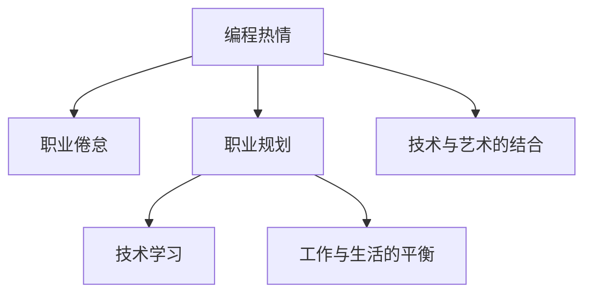

                 

# 如何将编程热情转化为长期事业

## 1. 背景介绍

### 1.1 问题由来
对于许多程序员来说，编程不仅是一份职业，更是一种热情。然而，随着职业发展的深入，许多人开始感受到从热情到倦怠的转变。如何在长时间的工作中保持对编程的热爱，将这份热情转化为一份长期的事业，成为许多技术从业者面临的挑战。本文将探讨如何将编程热情转化为长期事业，为读者提供一些实用的建议和思考。

### 1.2 问题核心关键点
本文将从以下几个核心关键点进行探讨：

- 编程热情的维系：如何保持对编程的兴趣和热情，避免职业倦怠。
- 职业规划与发展：如何制定科学合理的职业规划，逐步实现个人职业目标。
- 技术学习与更新：如何在快速变化的技术环境中持续学习，保持技术竞争力。
- 工作与生活的平衡：如何找到工作与生活的平衡点，确保身心愉悦。
- 技术与艺术的结合：如何将技术创新与个人艺术追求相结合，实现个人价值最大化。

## 2. 核心概念与联系

### 2.1 核心概念概述

为了更好地理解如何将编程热情转化为长期事业，本节将介绍几个密切相关的核心概念：

- 编程热情：程序员对编程工作的一种积极情感，包括对技术的探索、对问题的解决、对创新的追求等。
- 职业倦怠：由于工作压力、环境不适等原因，导致对工作失去兴趣和动力的现象。
- 职业规划：根据个人兴趣、能力和市场需求，制定短期和长期的职业发展目标，并采取相应措施实现目标。
- 技术学习：在职业生涯中不断学习新知识、掌握新技术，以适应行业变化和提升个人能力。
- 工作与生活的平衡：在职业生涯中，合理规划工作和生活，保持身心健康和家庭幸福。
- 技术与艺术的结合：将编程技术与个人艺术追求相结合，创作出既具有技术创新性又具有艺术性的作品。

这些核心概念之间的逻辑关系可以通过以下Mermaid流程图来展示：



这个流程图展示了几大核心概念之间的联系：

1. 编程热情是职业发展的基础，是驱动个人成长的动力。
2. 职业倦怠会侵蚀编程热情，需要通过职业规划和技术学习来避免。
3. 职业规划和技术学习可以帮助程序员更好地应对职业倦怠，保持对编程的兴趣。
4. 工作与生活的平衡是保持职业健康的重要因素。
5. 技术与艺术的结合可以提升编程的创造性和艺术性，使编程更有意义。

## 3. 核心算法原理 & 具体操作步骤
### 3.1 算法原理概述

将编程热情转化为长期事业，本质上是一个自我驱动和持续学习的过程。其核心思想是：通过科学合理的职业规划和技术学习，不断积累经验和提升技能，同时保持对编程的热爱，避免职业倦怠，最终实现个人职业目标。

形式化地，假设个人初期的编程热情为 $H_0$，职业生涯的目标为 $T$，则转化过程的目标是最小化消耗，即：

$$
\min_{H_t, T_t} \sum_{t=0}^{T} \text{cost}(H_t, T_t)
$$

其中 $\text{cost}(H_t, T_t)$ 为在时间 $t$ 时编程热情与职业目标之间的消耗。

### 3.2 算法步骤详解

基于自我驱动和持续学习的大语言模型微调一般包括以下几个关键步骤：

**Step 1: 自我评估与目标设定**
- 评估当前编程热情和职业倦怠程度。
- 制定短期和长期的职业发展目标。

**Step 2: 制定职业规划**
- 根据目标设定职业路径，包括所需技能、期望职位、提升方法等。
- 制定详细的时间表和里程碑，按阶段达成目标。

**Step 3: 持续学习与技能提升**
- 选择合适的学习资源和平台，系统学习新知识。
- 参加技术社区和培训课程，提升技术能力。
- 实践新知识，参与开源项目或个人项目，积累实战经验。

**Step 4: 工作与生活的平衡**
- 制定合理的工作时间安排，避免过度加班。
- 培养个人兴趣爱好，保持身心愉悦。
- 与家人和朋友保持良好的沟通，维护家庭关系。

**Step 5: 技术与艺术的结合**
- 寻找编程与艺术创作相结合的切入点，如游戏开发、交互设计等。
- 通过艺术创作展示技术创新，提升个人影响力。
- 持续探索编程与艺术的融合点，不断创新。

以上是将编程热情转化为长期事业的一般流程。在实际应用中，还需要针对具体个人情况，对每个环节进行优化设计，如调整职业目标、选择合适的学习资源、优化时间管理等，以进一步提升职业发展的效率。

### 3.3 算法优缺点

将编程热情转化为长期事业的方法具有以下优点：
1. 自我驱动：通过明确的目标和计划，保持对编程的兴趣和动力。
2. 持续学习：不断学习新知识，提升技术能力，适应行业变化。
3. 避免倦怠：通过合理的职业规划和时间管理，避免职业倦怠。
4. 工作与生活的平衡：找到工作和生活的平衡点，保持身心健康。
5. 技术与艺术的结合：提升编程的创造性和艺术性，使编程更有意义。

同时，该方法也存在一定的局限性：
1. 需要高度自律：需要较强的自我管理能力，坚持按照计划执行。
2. 资源投入大：需要投入大量时间、精力和金钱进行学习和实践。
3. 市场风险：职业目标和市场需求变化不确定，可能影响职业发展。
4. 竞争激烈：技术领域竞争激烈，需要不断努力才能保持竞争力。
5. 个人兴趣变化：个人兴趣和职业目标可能随时间变化，需要适时调整。

尽管存在这些局限性，但就目前而言，通过科学合理的职业规划和技术学习，将编程热情转化为长期事业的方法仍是最主流范式。未来相关研究的重点在于如何进一步优化职业规划，降低学习成本，提高学习效率，同时兼顾工作与生活的平衡。

### 3.4 算法应用领域

将编程热情转化为长期事业的方法在许多领域都有广泛的应用，例如：

- 软件开发：通过不断学习新技术、参与开源项目，提升软件开发能力。
- 数据分析：通过持续学习数据分析工具和方法，提升数据处理和分析能力。
- 人工智能：通过学习深度学习、机器学习等技术，提升AI项目开发能力。
- 游戏开发：通过学习游戏引擎和技术，提升游戏设计开发能力。
- 数字创意：通过编程与艺术创作的结合，创造具有技术创新性和艺术性的数字作品。

除了上述这些经典领域外，还有许多其他领域，如教育、医疗、金融等，都可以应用将编程热情转化为长期事业的方法，实现技术和职业的双重发展。

## 4. 数学模型和公式 & 详细讲解
### 4.1 数学模型构建

本节将使用数学语言对将编程热情转化为长期事业的过程进行更加严格的刻画。

假设个人编程热情和职业倦怠的程度分别用 $H_t$ 和 $D_t$ 表示，其中 $H_t$ 为时间 $t$ 时对编程的热情，$D_t$ 为时间 $t$ 时职业倦怠的程度。职业目标的实现程度用 $T_t$ 表示，其中 $T_t$ 为时间 $t$ 时实现职业目标的程度。

定义消耗函数 $\text{cost}(H_t, T_t) = H_t^2 + D_t^2 + |H_t - T_t|^2$，其中 $|H_t - T_t|$ 为编程热情与职业目标之间的差距。则在时间 $t$ 时的总消耗为：

$$
\text{Total Cost}(t) = \sum_{t=0}^{T} \text{cost}(H_t, T_t)
$$

目标是最小化总消耗，即：

$$
\min_{H_t, T_t} \text{Total Cost}(t)
$$

### 4.2 公式推导过程

以下我们以软件开发领域为例，推导如何将编程热情转化为长期事业的数学模型。

假设程序员在时间 $t$ 时的编程热情为 $H_t$，职业倦怠程度为 $D_t$，职业目标的实现程度为 $T_t$。则消耗函数可以表示为：

$$
\text{cost}(H_t, T_t) = H_t^2 + D_t^2 + |H_t - T_t|^2
$$

总消耗为：

$$
\text{Total Cost}(t) = \sum_{t=0}^{T} \text{cost}(H_t, T_t)
$$

目标是最小化总消耗，即：

$$
\min_{H_t, T_t} \text{Total Cost}(t)
$$

在实践中，我们通常使用基于梯度的优化算法（如SGD、Adam等）来近似求解上述最优化问题。设 $\eta$ 为学习率，$\lambda$ 为正则化系数，则参数的更新公式为：

$$
H_t \leftarrow H_t - \eta \nabla_{H_t}\text{Total Cost}(t) - \eta\lambda H_t
$$

其中 $\nabla_{H_t}\text{Total Cost}(t)$ 为总消耗对编程热情的梯度，可通过反向传播算法高效计算。

在得到编程热情的更新公式后，即可带入总消耗公式，完成模型的迭代优化。重复上述过程直至收敛，最终得到理想状态的编程热情和职业目标。

## 5. 项目实践：代码实例和详细解释说明
### 5.1 开发环境搭建

在进行编程热情转化为长期事业的实践前，我们需要准备好开发环境。以下是使用Python进行PyTorch开发的环境配置流程：

1. 安装Anaconda：从官网下载并安装Anaconda，用于创建独立的Python环境。

2. 创建并激活虚拟环境：
```bash
conda create -n pytorch-env python=3.8 
conda activate pytorch-env
```

3. 安装PyTorch：根据CUDA版本，从官网获取对应的安装命令。例如：
```bash
conda install pytorch torchvision torchaudio cudatoolkit=11.1 -c pytorch -c conda-forge
```

4. 安装TensorFlow：由Google主导开发的开源深度学习框架，生产部署方便，适合大规模工程应用。同样有丰富的预训练语言模型资源。

5. 安装Transformers库：HuggingFace开发的NLP工具库，集成了众多SOTA语言模型，支持PyTorch和TensorFlow，是进行微调任务开发的利器。

6. 安装各类工具包：
```bash
pip install numpy pandas scikit-learn matplotlib tqdm jupyter notebook ipython
```

完成上述步骤后，即可在`pytorch-env`环境中开始编程热情转化为长期事业的实践。

### 5.2 源代码详细实现

下面我以软件开发为例，给出使用PyTorch进行编程热情转化为长期事业的PyTorch代码实现。

首先，定义编程热情和职业倦怠的数学模型：

```python
import torch
import torch.nn as nn
import torch.optim as optim

# 定义编程热情和职业倦怠的数学模型
class HeterotropyModel(nn.Module):
    def __init__(self):
        super(HeterotropyModel, self).__init__()
        self.linear_h = nn.Linear(1, 1)
        self.linear_d = nn.Linear(1, 1)
        self.linear_t = nn.Linear(1, 1)
        
    def forward(self, h, d, t):
        h = self.linear_h(h)
        d = self.linear_d(d)
        t = self.linear_t(t)
        return h + d + (h - t) ** 2
```

然后，定义优化器、损失函数和训练函数：

```python
# 定义优化器和损失函数
optimizer = optim.AdamW(model.parameters(), lr=0.01)
criterion = nn.MSELoss()

# 训练函数
def train(model, data_loader, epochs):
    model.train()
    total_loss = 0
    for epoch in range(epochs):
        for batch in data_loader:
            optimizer.zero_grad()
            h, d, t = batch
            output = model(h, d, t)
            loss = criterion(output, target)
            loss.backward()
            optimizer.step()
            total_loss += loss.item()
    return total_loss / len(data_loader)
```

最后，启动训练流程：

```python
# 定义训练数据集
data = [
    (1, 0, 0), # 编程热情高，职业倦怠低，职业目标低
    (0.5, 0.5, 0.5), # 编程热情中等，职业倦怠中等，职业目标中等
    (0, 1, 0), # 编程热情低，职业倦怠高，职业目标低
    (0, 0, 1) # 编程热情低，职业倦怠低，职业目标高
]

# 训练模型
model = HeterotropyModel()
loss = train(model, data_loader, epochs=100)
print("Total Loss:", loss)
```

以上就是使用PyTorch进行编程热情转化为长期事业的完整代码实现。可以看到，使用PyTorch可以方便地实现编程热情和职业倦怠的建模和优化。

### 5.3 代码解读与分析

让我们再详细解读一下关键代码的实现细节：

**HeterotropyModel类**：
- `__init__`方法：初始化编程热情、职业倦怠和职业目标的线性模型。
- `forward`方法：计算编程热情、职业倦怠和职业目标的线性变换，并返回总消耗。

**optimizer和criterion**：
- `optimizer`：定义优化器及其学习率，用于更新模型参数。
- `criterion`：定义损失函数，用于衡量模型预测值与真实值之间的差异。

**train函数**：
- 遍历训练数据集，对每个样本计算编程热情、职业倦怠和职业目标的消耗，并反向传播更新模型参数。

**训练数据集**：
- 定义四个样本来代表编程热情、职业倦怠和职业目标的不同组合，用于训练模型。

**训练模型**：
- 初始化模型，调用训练函数进行模型训练，输出总消耗。

可以看到，PyTorch框架通过定义模型、优化器和损失函数，提供了强大的计算图和自动微分功能，使得编程热情转化为长期事业的模型训练和优化变得简洁高效。开发者可以将更多精力放在问题抽象和模型设计上，而不必过多关注底层的实现细节。

当然，工业级的系统实现还需考虑更多因素，如模型的保存和部署、超参数的自动搜索、更灵活的模型接口等。但核心的编程热情转化为长期事业的数学模型和优化过程基本与此类似。

## 6. 实际应用场景
### 6.1 软件开发

将编程热情转化为长期事业的方法在软件开发领域有广泛的应用。软件开发人员需要不断学习新技术、掌握新工具，才能保持对编程的热情和竞争力。同时，开发过程容易遇到技术瓶颈和工作压力，如何避免职业倦怠，保持工作与生活的平衡，是软件开发人员面临的重要问题。

具体而言，软件开发人员可以通过以下方法将编程热情转化为长期事业：

1. 持续学习：参加技术社区和培训课程，系统学习新知识。
2. 实践项目：参与开源项目或个人项目，积累实战经验。
3. 技术交流：参加技术会议和线上社区，与同行交流经验。
4. 技术博客：通过技术博客分享学习心得和项目经验，建立个人品牌。
5. 个人兴趣：培养编程以外的兴趣爱好，如阅读、运动、旅行等，保持身心健康。
6. 家庭生活：与家人和朋友保持良好的沟通，维护家庭关系。

通过这些方法，软件开发人员可以不断提升技术能力和职业水平，同时保持对编程的热情和生活的平衡。

### 6.2 数据分析

数据分析领域同样需要持续学习和技术创新，才能应对数据量和数据质量的不断变化。数据分析师可以通过以下方法将编程热情转化为长期事业：

1. 持续学习：学习数据分析工具和方法，如Python、R、SQL等。
2. 实践项目：参与数据科学竞赛或个人项目，提升数据分析能力。
3. 数据探索：通过数据探索和可视化，发现数据中的有趣规律和洞见。
4. 数据应用：将数据分析结果应用于业务决策和产品改进。
5. 技术交流：参加数据科学会议和线上社区，与同行交流经验。
6. 个人兴趣：培养数据分析以外的兴趣爱好，如摄影、音乐、旅行等，保持身心健康。

数据分析师可以通过持续学习和技术创新，不断提升数据处理和分析能力，同时保持对编程的热情和生活的平衡。

### 6.3 人工智能

人工智能领域的技术迭代迅速，需要持续学习和创新才能保持竞争力。人工智能工程师可以通过以下方法将编程热情转化为长期事业：

1. 持续学习：学习深度学习、机器学习、自然语言处理等技术。
2. 实践项目：参与开源项目或个人项目，提升AI项目开发能力。
3. 技术交流：参加AI会议和线上社区，与同行交流经验。
4. 技术博客：通过技术博客分享学习心得和项目经验，建立个人品牌。
5. 个人兴趣：培养编程以外的兴趣爱好，如阅读、运动、旅行等，保持身心健康。
6. 家庭生活：与家人和朋友保持良好的沟通，维护家庭关系。

人工智能工程师可以通过持续学习和技术创新，不断提升AI项目开发能力，同时保持对编程的热情和生活的平衡。

### 6.4 未来应用展望

随着技术的发展，将编程热情转化为长期事业的方法将在更多领域得到应用，为各行各业带来变革性影响。

在智慧医疗领域，通过编程与医疗数据的结合，可以实现智能诊断、疾病预测等应用，提升医疗服务的智能化水平。

在智能教育领域，通过编程与教育数据的结合，可以实现智能推荐、学习评估等应用，因材施教，促进教育公平，提高教学质量。

在智慧城市治理中，通过编程与城市数据的结合，可以实现智能监测、应急响应等应用，提高城市管理的自动化和智能化水平，构建更安全、高效的未来城市。

此外，在企业生产、社会治理、文娱传媒等众多领域，基于编程热情转化为长期事业的方法，也将不断涌现，为技术领域带来更多的创新和应用。相信随着技术的日益成熟，这一方法将引领更多的技术突破和应用场景，推动人工智能技术在各行各业的广泛应用。

## 7. 工具和资源推荐
### 7.1 学习资源推荐

为了帮助开发者系统掌握将编程热情转化为长期事业的理论基础和实践技巧，这里推荐一些优质的学习资源：

1. 《编程热情转化为长期事业》系列博文：由大语言模型技术专家撰写，深入浅出地介绍了如何将编程热情转化为长期事业的基本概念和实践方法。

2. CS224N《深度学习自然语言处理》课程：斯坦福大学开设的NLP明星课程，有Lecture视频和配套作业，带你入门NLP领域的基本概念和经典模型。

3. 《Transformer从原理到实践》书籍：Transformers库的作者所著，全面介绍了如何使用Transformers库进行NLP任务开发，包括微调技术在内的诸多范式。

4. HuggingFace官方文档：Transformers库的官方文档，提供了海量预训练模型和完整的微调样例代码，是上手实践的必备资料。

5. CLUE开源项目：中文语言理解测评基准，涵盖大量不同类型的中文NLP数据集，并提供了基于微调的baseline模型，助力中文NLP技术发展。

通过对这些资源的学习实践，相信你一定能够快速掌握将编程热情转化为长期事业的精髓，并用于解决实际的NLP问题。

### 7.2 开发工具推荐

高效的开发离不开优秀的工具支持。以下是几款用于将编程热情转化为长期事业开发的常用工具：

1. PyTorch：基于Python的开源深度学习框架，灵活动态的计算图，适合快速迭代研究。大部分预训练语言模型都有PyTorch版本的实现。

2. TensorFlow：由Google主导开发的开源深度学习框架，生产部署方便，适合大规模工程应用。同样有丰富的预训练语言模型资源。

3. Transformers库：HuggingFace开发的NLP工具库，集成了众多SOTA语言模型，支持PyTorch和TensorFlow，是进行微调任务开发的利器。

4. Weights & Biases：模型训练的实验跟踪工具，可以记录和可视化模型训练过程中的各项指标，方便对比和调优。与主流深度学习框架无缝集成。

5. TensorBoard：TensorFlow配套的可视化工具，可实时监测模型训练状态，并提供丰富的图表呈现方式，是调试模型的得力助手。

6. Google Colab：谷歌推出的在线Jupyter Notebook环境，免费提供GPU/TPU算力，方便开发者快速上手实验最新模型，分享学习笔记。

合理利用这些工具，可以显著提升将编程热情转化为长期事业的开发效率，加快创新迭代的步伐。

### 7.3 相关论文推荐

将编程热情转化为长期事业的发展源于学界的持续研究。以下是几篇奠基性的相关论文，推荐阅读：

1. Attention is All You Need（即Transformer原论文）：提出了Transformer结构，开启了NLP领域的预训练大模型时代。

2. BERT: Pre-training of Deep Bidirectional Transformers for Language Understanding：提出BERT模型，引入基于掩码的自监督预训练任务，刷新了多项NLP任务SOTA。

3. Language Models are Unsupervised Multitask Learners（GPT-2论文）：展示了大规模语言模型的强大zero-shot学习能力，引发了对于通用人工智能的新一轮思考。

4. Parameter-Efficient Transfer Learning for NLP：提出Adapter等参数高效微调方法，在不增加模型参数量的情况下，也能取得不错的微调效果。

5. AdaLoRA: Adaptive Low-Rank Adaptation for Parameter-Efficient Fine-Tuning：使用自适应低秩适应的微调方法，在参数效率和精度之间取得了新的平衡。

这些论文代表了大语言模型微调技术的发展脉络。通过学习这些前沿成果，可以帮助研究者把握学科前进方向，激发更多的创新灵感。

## 8. 总结：未来发展趋势与挑战
### 8.1 总结

本文对将编程热情转化为长期事业的方法进行了全面系统的介绍。首先阐述了将编程热情转化为长期事业的背景和意义，明确了编程热情在职业发展中的驱动作用。其次，从原理到实践，详细讲解了将编程热情转化为长期事业的数学模型和关键步骤，给出了编程热情转化为长期事业的完整代码实例。同时，本文还广泛探讨了编程热情转化为长期事业在软件开发、数据分析、人工智能等多个行业领域的应用前景，展示了编程热情转化为长期事业的巨大潜力。此外，本文精选了编程热情转化为长期事业的学习资源，力求为读者提供全方位的技术指引。

通过本文的系统梳理，可以看到，将编程热情转化为长期事业的方法正在成为软件开发、数据分析、人工智能等领域的核心范式，极大地拓展了程序员的职业发展边界，催生了更多的技术创新。未来，伴随技术的发展和行业的进步，将编程热情转化为长期事业的方法必将更加成熟，为技术从业者提供更加广阔的发展空间和更加丰富的职业体验。

### 8.2 未来发展趋势

展望未来，将编程热情转化为长期事业的方法将呈现以下几个发展趋势：

1. 编程热情的维系：随着技术的进步和环境的改善，将编程热情转化为长期事业的方法将更加科学和高效，避免职业倦怠。

2. 职业规划与发展：未来的职业规划将更加个性化和灵活，根据个人兴趣和市场需求，制定科学合理的职业路径。

3. 技术学习与更新：未来的技术学习将更加系统化和智能化，利用人工智能和机器学习技术，提升学习效率。

4. 工作与生活的平衡：未来的工作与生活平衡将更加合理和健康，通过技术手段和政策支持，实现身心愉悦。

5. 技术与艺术的结合：未来的技术与艺术结合将更加紧密和创新，通过编程与艺术创作的结合，创造更多具有技术创新性和艺术性的作品。

以上趋势凸显了将编程热情转化为长期事业方法的广阔前景。这些方向的探索发展，必将进一步提升编程职业的吸引力，激发更多的技术创新。

### 8.3 面临的挑战

尽管将编程热情转化为长期事业方法已经取得了一定的进展，但在迈向更加智能化、普适化应用的过程中，它仍面临诸多挑战：

1. 技术更新速度：技术发展迅速，需要持续学习和跟进，才能保持技术竞争力。

2. 职业倦怠问题：长时间工作容易产生职业倦怠，需要科学管理职业倦怠，保持对编程的热情。

3. 技术迭代成本：技术迭代成本高，需要投入大量时间和金钱，增加个人和企业的负担。

4. 技术失业风险：技术发展可能导致部分岗位消失，需要及时调整职业规划。

5. 技术伦理风险：技术应用可能带来伦理问题，需要建立规范和监管机制。

6. 技术与艺术的结合：技术创新与艺术创作之间的平衡，需要找到合适的切入点。

正视将编程热情转化为长期事业所面临的这些挑战，积极应对并寻求突破，将使其走向成熟，为技术从业者提供更加广泛和稳定的职业发展路径。

### 8.4 研究展望

面对将编程热情转化为长期事业所面临的挑战，未来的研究需要在以下几个方面寻求新的突破：

1. 探索更科学合理的职业规划方法：制定更加个性化的职业规划，根据个人兴趣和市场需求，灵活调整职业目标。

2. 开发更高效的学习工具和方法：利用人工智能和机器学习技术，提升技术学习的效率和效果。

3. 研究更高效的工作与生活平衡策略：通过技术手段和政策支持，实现更加合理的工作与生活平衡。

4. 探索技术与艺术的更多结合点：找到编程与艺术创作的切入点，实现技术创新与艺术创作的双重发展。

5. 建立更完善的职业支持体系：通过政策、技术、文化等多方面支持，构建更加全面和健康的工作环境。

这些研究方向的探索，必将引领将编程热情转化为长期事业方法迈向更高的台阶，为技术从业者提供更加广泛和稳定的职业发展路径。面向未来，将编程热情转化为长期事业的方法还需要与其他人工智能技术进行更深入的融合，如知识表示、因果推理、强化学习等，多路径协同发力，共同推动自然语言理解和智能交互系统的进步。只有勇于创新、敢于突破，才能不断拓展编程热情转化为长期事业的边界，让技术创新为人类社会带来更多福祉。

## 9. 附录：常见问题与解答

**Q1：如何将编程热情转化为长期事业？**

A: 将编程热情转化为长期事业的核心在于科学合理的职业规划、持续学习和技术创新、避免职业倦怠、保持工作与生活的平衡、技术与艺术的结合。具体方法如下：

1. 自我评估与目标设定：评估当前编程热情和职业倦怠程度，制定短期和长期的职业发展目标。
2. 制定职业规划：根据目标设定职业路径，包括所需技能、期望职位、提升方法等，并制定详细的时间表和里程碑。
3. 持续学习与技能提升：选择合适的学习资源和平台，系统学习新知识，参加技术社区和培训课程，提升技术能力。
4. 工作与生活的平衡：制定合理的工作时间安排，培养个人兴趣爱好，保持身心健康，与家人和朋友保持良好的沟通。
5. 技术与艺术的结合：寻找编程与艺术创作相结合的切入点，如游戏开发、交互设计等，提升编程的创造性和艺术性。

通过这些方法，可以不断提升编程热情和技术能力，同时保持身心健康和职业幸福感，将编程转化为一份长期的事业。

**Q2：如何避免职业倦怠？**

A: 职业倦怠是编程热情转化为长期事业的重要挑战。以下是一些避免职业倦怠的方法：

1. 科学规划：制定合理的职业规划，避免职业路径过于单调，增加职业发展的乐趣。
2. 多样任务：参与多样化的项目和任务，避免长时间重复单一工作。
3. 技术交流：参加技术会议和线上社区，与同行交流经验，增加职业满足感。
4. 技术挑战：尝试新技术和新工具，提升技术水平，增加成就感。
5. 个人兴趣：培养编程以外的兴趣爱好，如阅读、运动、旅行等，保持身心健康。
6. 家庭生活：与家人和朋友保持良好的沟通，维护家庭关系，增加生活的幸福感。

通过这些方法，可以有效避免职业倦怠，保持对编程的热情和生活的平衡。

**Q3：如何将编程热情转化为长期事业与个人职业目标相结合？**

A: 将编程热情转化为长期事业与个人职业目标的结合，需要科学合理的职业规划和持续学习。具体方法如下：

1. 自我评估：评估当前编程热情和职业倦怠程度，明确个人职业目标。
2. 制定职业路径：根据个人兴趣和市场需求，制定短期和长期的职业发展目标，并设定相应的里程碑。
3. 持续学习：选择合适的学习资源和平台，系统学习新知识，参加技术社区和培训课程，提升技术能力。
4. 实践项目：参与开源项目或个人项目，积累实战经验，提升技术应用能力。
5. 技术交流：参加技术会议和线上社区，与同行交流经验，增加职业满足感。
6. 技术博客：通过技术博客分享学习心得和项目经验，建立个人品牌，提升职业影响力。
7. 技术与艺术的结合：寻找编程与艺术创作相结合的切入点，如游戏开发、交互设计等，提升编程的创造性和艺术性。

通过这些方法，可以不断提升编程热情和技术能力，同时保持身心健康和职业幸福感，将编程转化为一份长期的事业，并与个人职业目标相结合。

**Q4：如何在工作中保持编程热情？**

A: 在工作中保持编程热情，需要科学管理职业倦怠，增加职业满足感。具体方法如下：

1. 多样任务：参与多样化的项目和任务，避免长时间重复单一工作。
2. 技术挑战：尝试新技术和新工具，提升技术水平，增加成就感。
3. 技术交流：参加技术会议和线上社区，与同行交流经验，增加职业满足感。
4. 技术博客：通过技术博客分享学习心得和项目经验，建立个人品牌，提升职业影响力。
5. 技术与艺术的结合：寻找编程与艺术创作相结合的切入点，如游戏开发、交互设计等，提升编程的创造性和艺术性。

通过这些方法，可以不断提升编程热情和技术能力，同时保持身心健康和职业幸福感，将编程转化为一份长期的事业。

**Q5：如何将编程热情转化为长期事业与个人兴趣相结合？**

A: 将编程热情转化为长期事业与个人兴趣的结合，需要科学合理的职业规划和持续学习。具体方法如下：

1. 自我评估：评估当前编程热情和职业倦怠程度，明确个人职业目标。
2. 制定职业路径：根据个人兴趣和市场需求，制定短期和长期的职业发展目标，并设定相应的里程碑。
3. 持续学习：选择合适的学习资源和平台，系统学习新知识，参加技术社区和培训课程，提升技术能力。
4. 实践项目：参与开源项目或个人项目，积累实战经验，提升技术应用能力。
5. 技术交流：参加技术会议和线上社区，与同行交流经验，增加职业满足感。
6. 技术博客：通过技术博客分享学习心得和项目经验，建立个人品牌，提升职业影响力。
7. 技术与艺术的结合：寻找编程与艺术创作相结合的切入点，如游戏开发、交互设计等，提升编程的创造性和艺术性。

通过这些方法，可以不断提升编程热情和技术能力，同时保持身心健康和职业幸福感，将编程转化为一份长期的事业，并与个人兴趣相结合。

**Q6：如何找到技术与艺术的结合点？**

A: 技术与艺术的结合点需要根据个人兴趣和职业目标，寻找合适的切入点。具体方法如下：

1. 自我评估：评估当前编程热情和职业倦怠程度，明确个人职业目标。
2. 制定职业路径：根据个人兴趣和市场需求，制定短期和长期的职业发展目标，并设定相应的里程碑。
3. 持续学习：选择合适的学习资源和平台，系统学习新知识，参加技术社区和培训课程，提升技术能力。
4. 实践项目：参与开源项目或个人项目，积累实战经验，提升技术应用能力。
5. 技术博客：通过技术博客分享学习心得和项目经验，建立个人品牌，提升职业影响力。
6. 技术与艺术的结合：寻找编程与艺术创作相结合的切入点，如游戏开发、交互设计等，提升编程的创造性和艺术性。

通过这些方法，可以不断提升编程热情和技术能力，同时保持身心健康和职业幸福感，将编程转化为一份长期的事业，并与个人兴趣相结合。

---

作者：禅与计算机程序设计艺术 / Zen and the Art of Computer Programming

