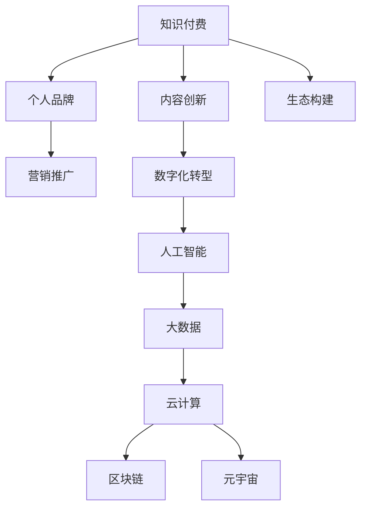

                 

# 如何打造个人知识付费商业帝国

> 关键词：知识付费,个人品牌建设,数字化转型,人工智能,大数据,云计算,区块链,元宇宙

## 1. 背景介绍

### 1.1 问题由来
在互联网时代，知识已成为一种重要资产。随着信息爆炸和终身学习的浪潮，越来越多的人愿意为获取优质知识而付费。知识付费市场迅速崛起，吸引了大批内容创作者和个人品牌打造者。如何在这个新赛道中脱颖而出，打造个人知识付费商业帝国，成为众多创业者所面临的重要课题。

### 1.2 问题核心关键点
本节将重点介绍知识付费的核心关键点，涵盖以下几个方面：

- **内容创新**：创作原创、高质量的内容是知识付费商业帝国的基石。
- **品牌建设**：打造个人品牌，提升知名度和影响力。
- **营销推广**：运用多种渠道和方法，有效推广个人品牌和内容。
- **数据驱动**：利用大数据和人工智能技术，优化内容策略和用户体验。
- **技术支持**：采用云计算、区块链、元宇宙等前沿技术，提高内容质量和平台效率。
- **生态构建**：建立完善的生态系统，吸引更多用户和合作伙伴。

## 2. 核心概念与联系

### 2.1 核心概念概述

为更好地理解知识付费商业帝国的构建，本节将介绍几个关键概念：

- **知识付费**：基于互联网，以知识为产品，通过付费方式提供给用户的过程。
- **内容创新**：创作新颖、有价值的原创内容，吸引用户订阅和付费。
- **个人品牌**：通过内容输出和社交媒体互动，建立自己的品牌形象和粉丝群体。
- **数字化转型**：将传统知识传播方式转换为数字化的在线模式。
- **人工智能**：利用AI技术，如自然语言处理、图像识别等，提升内容质量和用户体验。
- **大数据**：通过分析用户行为数据，优化内容推荐和平台运营。
- **云计算**：利用云平台的高性能计算资源，支持大规模内容处理和用户服务。
- **区块链**：采用区块链技术，保障内容版权和交易安全。
- **元宇宙**：利用虚拟现实技术，构建沉浸式的知识传播和学习环境。

这些核心概念之间的逻辑关系可以通过以下Mermaid流程图来展示：



这个流程图展示了许多关键概念及其之间的关系：

1. 知识付费以内容创新为基础。
2. 个人品牌建设是核心，通过内容输出和营销推广提升知名度。
3. 数字化转型和人工智能是技术支撑，提升内容和服务的质量。
4. 大数据和云计算提供数据支持和计算资源。
5. 区块链和元宇宙为知识付费生态提供新的平台和形态。

这些概念共同构成了知识付费商业帝国的构建框架，使得个人品牌能够更好地与用户连接，提供高质量的内容和服务。

## 3. 核心算法原理 & 具体操作步骤
### 3.1 算法原理概述

知识付费商业帝国的构建，本质上是将优质内容数字化、智能化、品牌化，并有效推广至目标用户的过程。这涉及内容创作、品牌建设、平台运营等多个环节，需要综合运用多种技术和方法。

### 3.2 算法步骤详解

**Step 1: 内容创作与创新**
- 确定内容主题和形式，如文字文章、视频课程、音频播客等。
- 收集和整理相关资料，确保内容的准确性和深度。
- 利用AI技术进行内容辅助创作，如语法检查、情感分析、推荐系统等。

**Step 2: 品牌建设与推广**
- 在社交媒体、专业论坛等平台上积极互动，建立个人品牌形象。
- 通过SEO、社交媒体广告、KOL合作等手段推广内容。
- 利用数据分析工具，优化推广策略和投放效果。

**Step 3: 平台搭建与运营**
- 选择合适的知识付费平台，如知乎、腾讯课堂、得到等。
- 搭建个人知识店铺，上架内容，并设置付费门槛。
- 利用云计算资源，实现内容的快速发布和高效维护。

**Step 4: 用户互动与反馈**
- 与用户互动，及时回复评论和反馈，提升用户粘性。
- 通过用户行为数据，分析用户需求和偏好，优化内容推荐。
- 定期更新内容，保持平台活跃度和用户满意度。

### 3.3 算法优缺点

知识付费商业帝国构建的算法具有以下优点：
1. 精准定位目标用户，提供有针对性的内容。
2. 利用技术手段，提高内容质量和用户体验。
3. 通过品牌建设和营销推广，扩大影响力和用户群体。

但同时也存在一些局限性：
1. 高质量内容的创作和维护成本高。
2. 市场竞争激烈，需要持续创新才能保持竞争力。
3. 技术和运营的复杂性，需要跨领域专业知识。
4. 用户需求多样，难以满足所有用户的期望。

尽管存在这些局限性，但只要把握好内容、品牌、技术、数据等多个维度，知识付费商业帝国的构建仍然具有广阔的发展前景。

### 3.4 算法应用领域

知识付费商业帝国的构建，在教育、医疗、科技、文化等多个领域均有应用，具体包括：

- **教育培训**：提供各类学科知识和职业技能培训课程，如编程、金融、语言学习等。
- **健康医疗**：分享健康生活方式、疾病预防和治疗知识，提供线上咨询和诊断服务。
- **科技资讯**：提供科技前沿、产品评测、开发者教程等内容，帮助用户了解最新技术动态。
- **文化创意**：分享艺术、文学、音乐等文化作品，提供创作灵感和专业知识。
- **财经投资**：分享股票、基金、加密货币等投资建议，帮助用户做出明智的投资决策。
- **生活百科**：提供生活技巧、家庭管理、旅行攻略等实用信息，提升生活质量。

这些领域都有大量潜在用户，为知识付费提供了丰富的市场机会。

## 4. 数学模型和公式 & 详细讲解 & 举例说明

### 4.1 数学模型构建

本节将使用数学语言对知识付费商业帝国的构建过程进行更加严格的刻画。

设知识付费平台用户总数为 $N$，每天新增用户数为 $\Delta N$，用户流失率为 $r$。设平台每天新增内容数为 $C$，用户日均观看/学习时长为 $T$。假设用户观看/学习时长与内容质量成正比，与价格成反比，即：

$$
T = k \cdot \text{content quality} / \text{price}
$$

其中 $k$ 为比例常数。设单次购买内容的价格为 $p$，单次观看/学习内容获得的收益为 $R$。平台总收益为：

$$
\text{Revenue} = \Delta N \cdot p \cdot T + C \cdot R
$$

为了最大化收益，需要对用户和内容进行优化。

### 4.2 公式推导过程

假设平台进行价格歧视，将用户分为 $n$ 个价格层次，第 $i$ 层的用户价格为 $p_i$，观看/学习时长为 $T_i$。根据价格歧视原理，最大化收益的定价策略为：

$$
p_i = T_i / \Delta N
$$

即第 $i$ 层用户的价格与其观看/学习时长成正比。

假设内容质量由用户评分 $s$ 决定，内容推荐系统根据评分进行推荐。设内容质量与用户评分成正比，即：

$$
\text{content quality} = s
$$

代入总收益公式，得：

$$
\text{Revenue} = \Delta N \cdot p \cdot T + C \cdot R = \Delta N \cdot (T / \Delta N) \cdot (k \cdot s / \Delta N) + C \cdot R = k \cdot s / \Delta N + C \cdot R
$$

为了最大化收益，需要优化用户评分和内容推荐。

### 4.3 案例分析与讲解

**案例1: 教育培训课程**
- 目标用户：各类学科学生和职业人士。
- 内容形式：视频课程、在线辅导、电子书等。
- 品牌建设：通过社交媒体和教育机构合作推广。
- 用户互动：提供答疑、社群互动等增强用户粘性。
- 数据分析：利用大数据分析用户学习行为，优化课程推荐。
- 技术支持：采用AI进行个性化推荐，提升学习效果。

**案例2: 健康医疗咨询**
- 目标用户：健康关注者、病患。
- 内容形式：视频科普、在线诊疗、健康手册等。
- 品牌建设：通过健康博主、医院合作推广。
- 用户互动：提供实时问答、健康数据监测等增强信任。
- 数据分析：利用健康数据分析用户需求，优化内容策略。
- 技术支持：采用区块链保护用户数据隐私，利用人工智能进行疾病预测。

## 5. 项目实践：代码实例和详细解释说明
### 5.1 开发环境搭建

在进行知识付费项目开发前，需要先搭建开发环境。以下是使用Python进行Flask开发的环境配置流程：

1. 安装Anaconda：从官网下载并安装Anaconda，用于创建独立的Python环境。

2. 创建并激活虚拟环境：
```bash
conda create -n flask-env python=3.8 
conda activate flask-env
```

3. 安装Flask：
```bash
pip install flask
```

4. 安装Werkzeug库：
```bash
pip install werkzeug
```

5. 安装SQLAlchemy库：
```bash
pip install sqlalchemy
```

6. 安装Flask-RESTful库：
```bash
pip install flask-restful
```

7. 安装Jinja2库：
```bash
pip install jinja2
```

完成上述步骤后，即可在`flask-env`环境中开始项目开发。

### 5.2 源代码详细实现

下面是一个简单的Flask知识付费平台，支持用户注册、登录、订阅内容等功能。

```python
from flask import Flask, request, render_template, redirect, url_for
from flask_sqlalchemy import SQLAlchemy

app = Flask(__name__)
app.config['SQLALCHEMY_DATABASE_URI'] = 'sqlite:////tmp/test.db'
app.config['SECRET_KEY'] = 'secret-key'
db = SQLAlchemy(app)

class User(db.Model):
    id = db.Column(db.Integer, primary_key=True)
    username = db.Column(db.String(50))
    password = db.Column(db.String(100))
    email = db.Column(db.String(100))
    is_admin = db.Column(db.Boolean, default=False)
    
class Content(db.Model):
    id = db.Column(db.Integer, primary_key=True)
    title = db.Column(db.String(200))
    description = db.Column(db.String(500))
    price = db.Column(db.Float)
    user_id = db.Column(db.Integer, db.ForeignKey('user.id'))

@app.route('/')
def index():
    return render_template('index.html')

@app.route('/login', methods=['GET', 'POST'])
def login():
    if request.method == 'POST':
        username = request.form['username']
        password = request.form['password']
        user = User.query.filter_by(username=username, password=password).first()
        if user:
            return redirect(url_for('dashboard'))
        else:
            return render_template('login.html', error='Invalid credentials')
    else:
        return render_template('login.html')

@app.route('/register', methods=['GET', 'POST'])
def register():
    if request.method == 'POST':
        username = request.form['username']
        password = request.form['password']
        email = request.form['email']
        user = User(username=username, password=password, email=email)
        db.session.add(user)
        db.session.commit()
        return redirect(url_for('login'))
    else:
        return render_template('register.html')

@app.route('/dashboard')
def dashboard():
    user = User.query.first()
    if not user:
        return redirect(url_for('login'))
    contents = Content.query.all()
    return render_template('dashboard.html', user=user, contents=contents)

@app.route('/subscribe', methods=['POST'])
def subscribe():
    content_id = request.form['content_id']
    user = User.query.first()
    if not user:
        return redirect(url_for('login'))
    content = Content.query.get(content_id)
    if content:
        user.subscriptions.append(content)
        db.session.commit()
        return redirect(url_for('dashboard'))
    else:
        return redirect(url_for('dashboard'))

if __name__ == '__main__':
    db.create_all()
    app.run(debug=True)
```

### 5.3 代码解读与分析

让我们再详细解读一下关键代码的实现细节：

**Flask应用初始化**：
- `app = Flask(__name__)`：创建Flask应用对象。
- `app.config`：配置应用环境，如数据库连接地址、密钥等。

**用户模型**：
- `User`类定义了用户的基本属性，如用户名、密码、邮箱等。
- `is_admin`属性用于标识管理员用户。

**内容模型**：
- `Content`类定义了内容的基本属性，如标题、描述、价格等。
- `user_id`属性用于关联用户和内容。

**路由定义**：
- `/`：显示首页。
- `/login`：用户登录页面，包括获取和提交登录表单。
- `/register`：用户注册页面，包括获取和提交注册表单。
- `/dashboard`：用户登录后显示个人中心，包括内容列表。
- `/subscribe`：用户订阅内容，包括提交表单。

**模板渲染**：
- `render_template`：渲染HTML模板，将数据传递给前端展示。

**数据库操作**：
- `db`：Flask SQLAlchemy对象，用于操作SQLite数据库。
- `db.create_all()`：创建数据库表。
- `db.session.add()`：添加新记录到数据库。
- `db.session.commit()`：提交数据库变更。

该Flask应用虽然功能简单，但涵盖了知识付费平台的基本模块：用户管理、内容管理、订阅功能。可以根据需求进一步扩展和优化。

### 5.4 运行结果展示

在运行该Flask应用后，可以在浏览器中访问`http://localhost:5000/`，进入知识付费平台。用户可以进行注册、登录、浏览内容和订阅。

## 6. 实际应用场景
### 6.1 智能教育
知识付费在智能教育领域有着广阔的应用前景。在线教育平台可以利用微调和深度学习技术，提供个性化、互动式、智能化的教学服务。

具体而言，可以收集学生的历史学习数据和行为数据，利用机器学习进行模型训练，生成个性化学习计划和推荐系统。同时，利用自然语言处理技术，提供自动答疑、智能翻译等服务，提升教学效果和学生体验。

### 6.2 医疗健康
医疗知识付费平台可以通过知识付费的形式，向公众普及健康知识，帮助患者进行自我管理。利用大数据和人工智能技术，可以对患者的健康数据进行分析，提供个性化的健康建议和治疗方案。

例如，平台可以提供在线健康咨询、远程医疗服务、健康数据分析等功能。利用区块链技术，可以保障用户健康数据的隐私和安全。

### 6.3 职场培训
职场知识付费平台可以为职场人士提供各类职业培训课程，如编程、财务管理、项目管理等。通过知识付费，可以激励专业人士分享实战经验，提升行业水平。

平台可以整合线上线下资源，提供直播、录播、互动课程等多种形式，满足不同用户的需求。同时，利用AI技术进行内容推荐和用户画像分析，提升学习效率和效果。

### 6.4 未来应用展望
随着知识付费平台的不断发展和技术的进步，未来将会有更多创新的应用场景和商业模式。例如：

- **虚拟现实(VR)**：利用虚拟现实技术，提供沉浸式的学习体验，如虚拟教室、虚拟实验室等。
- **增强现实(AR)**：结合增强现实技术，进行可视化学习和互动，如AR教材、AR远程指导等。
- **人工智能(AI)**：利用AI进行内容生成和个性化推荐，提升学习效果和用户体验。
- **大数据(Big Data)**：利用大数据分析用户行为和需求，优化平台运营和内容策略。
- **区块链(Blockchain)**：利用区块链技术，保障内容版权和用户隐私，提升平台信任度。
- **元宇宙(Metaverse)**：利用元宇宙技术，构建虚拟知识社区，提供多元化、互动式学习环境。

这些前沿技术的应用，将极大地提升知识付费平台的用户体验和服务质量，推动知识付费行业的持续创新和发展。

## 7. 工具和资源推荐
### 7.1 学习资源推荐

为了帮助开发者系统掌握知识付费的相关技术，这里推荐一些优质的学习资源：

1. **《Python网络编程》**：这本书全面介绍了Python网络编程的基础知识和高级技术，适合初学者和进阶者。
2. **《Flask Web开发》**：这是一本关于Flask框架的权威指南，涵盖了从入门到高级的各个方面。
3. **《机器学习实战》**：这本书通过实际案例，介绍了机器学习和深度学习的常用算法和技术，适合实践学习。
4. **《人工智能伦理与治理》**：这是一本关于AI伦理和治理的权威书籍，涵盖了许多前沿的伦理和法律问题。
5. **Coursera和edX**：这两个在线教育平台提供了丰富的课程和资源，涵盖计算机科学、数据科学、人工智能等多个领域。

通过对这些资源的学习实践，相信你一定能够快速掌握知识付费平台的关键技术，并用于解决实际的业务问题。

### 7.2 开发工具推荐

高效的开发离不开优秀的工具支持。以下是几款用于知识付费平台开发的常用工具：

1. **Flask**：轻量级的Python Web框架，简单易用，适合快速迭代开发。
2. **SQLAlchemy**：Python的ORM框架，支持多种数据库，方便数据管理和查询。
3. **Jinja2**：Python的模板引擎，方便构建动态HTML页面。
4. **Docker**：容器化技术，方便应用部署和运维。
5. **Kubernetes**：容器编排工具，支持大规模应用部署和扩展。
6. **AWS和Azure**：云服务提供商，提供高性能计算资源和云数据库服务。

合理利用这些工具，可以显著提升知识付费平台的开发效率，加快创新迭代的步伐。

### 7.3 相关论文推荐

知识付费平台的构建源于学界的持续研究。以下是几篇奠基性的相关论文，推荐阅读：

1. **《深度学习在自然语言处理中的应用》**：介绍深度学习在文本分类、情感分析、机器翻译等NLP任务中的应用。
2. **《机器学习在推荐系统中的应用》**：介绍机器学习在个性化推荐系统中的常用算法和技术。
3. **《区块链技术在数字版权保护中的应用》**：介绍区块链技术在数字版权保护中的应用，保障内容版权和交易安全。
4. **《虚拟现实在教育中的应用》**：介绍虚拟现实技术在教育领域的应用，提升学习效果和互动性。
5. **《人工智能在医疗中的应用》**：介绍人工智能技术在医疗诊断、健康管理等方面的应用，提升医疗水平和患者体验。

这些论文代表了大数据和人工智能技术在知识付费领域的进展，为知识付费平台的构建提供了理论基础和技术支持。

## 8. 总结：未来发展趋势与挑战
### 8.1 总结

本文对知识付费平台的构建进行了全面系统的介绍。首先阐述了知识付费的核心关键点，明确了内容创新、品牌建设、营销推广、数据驱动等各个环节的重要性和方法。其次，从原理到实践，详细讲解了知识付费平台的数学模型和算法步骤，给出了具体实现和运行结果展示。最后，探讨了知识付费平台在教育、医疗、职场培训等多个领域的应用前景，展望了未来发展的趋势和挑战。

通过本文的系统梳理，可以看到，知识付费平台构建的技术涉及内容创作、品牌建设、平台运营等多个方面，需要综合运用多种技术和方法。只要把握好各个环节的关键点，积极探索和应用前沿技术，知识付费平台必将在教育、医疗、职场培训等领域大放异彩，为社会带来深远的影响。

### 8.2 未来发展趋势

展望未来，知识付费平台的构建将呈现以下几个发展趋势：

1. **智能化升级**：利用人工智能技术，提供更加个性化、智能化的服务和体验。
2. **多模态融合**：结合文本、图像、音频等多种模态数据，提升内容的丰富度和吸引力。
3. **虚拟现实应用**：利用虚拟现实技术，提供沉浸式的学习体验，如虚拟教室、虚拟实验室等。
4. **区块链技术应用**：利用区块链技术，保障内容版权和用户隐私，提升平台信任度。
5. **元宇宙生态构建**：利用元宇宙技术，构建虚拟知识社区，提供多元化、互动式学习环境。
6. **跨领域融合**：与其他领域的技术和平台进行深度融合，如医疗、教育、金融等，拓展知识付费平台的覆盖范围。

这些趋势将推动知识付费平台向更加智能化、个性化、安全化的方向发展，为用户带来更好的体验和服务质量。

### 8.3 面临的挑战

尽管知识付费平台发展前景广阔，但在构建过程中仍面临诸多挑战：

1. **内容质量保障**：高质量内容的创作和维护成本高，需要持续投入人力和资金。
2. **市场竞争激烈**：知识付费平台竞争激烈，需要不断创新才能保持竞争力。
3. **技术复杂性**：平台涉及多种技术，需要跨领域专业知识，技术实现复杂。
4. **用户体验优化**：平台需要不断优化用户体验，提升用户粘性和满意度。
5. **数据安全和隐私**：平台需要保障用户数据安全和隐私，防止数据泄露和滥用。
6. **法律法规遵守**：平台需要遵守相关法律法规，避免侵权和不当内容传播。

面对这些挑战，需要综合运用多种技术和手段，不断优化平台策略和运营方式，才能成功构建知识付费平台，实现商业价值的最大化。

### 8.4 研究展望

未来的研究需要进一步探索和应用以下技术：

1. **自然语言处理(NLP)**：利用NLP技术，提供更精准的内容推荐和智能客服。
2. **计算机视觉(CV)**：结合CV技术，提供图像识别、视频分析等服务。
3. **区块链技术**：利用区块链技术，保障内容版权和用户隐私，提升平台信任度。
4. **虚拟现实技术**：利用VR和AR技术，提供沉浸式的学习体验和互动。
5. **人工智能伦理**：研究AI伦理和治理问题，提升平台的道德和社会责任。
6. **元宇宙生态**：构建元宇宙生态系统，提供多元化、互动式学习环境。

这些技术的应用，将极大地提升知识付费平台的用户体验和服务质量，推动知识付费行业的持续创新和发展。

## 9. 附录：常见问题与解答

**Q1: 如何选择合适的知识付费平台？**

A: 选择合适的知识付费平台需要考虑以下因素：

- **平台规模和用户量**：选择用户规模较大、平台稳定的平台，能够提供更好的服务保障。
- **平台功能和特色**：选择具备个性化推荐、智能客服等功能的平台，提升用户体验。
- **平台合作机构和专家**：选择与知名机构和专家合作的平台，内容质量更有保障。
- **平台收费模式**：选择适合自己的付费模式，如包月、单次购买等。

**Q2: 如何提升平台的用户粘性和留存率？**

A: 提升平台的用户粘性和留存率需要从多个方面入手：

- **内容质量**：提供高质量、有价值的内容，吸引用户订阅和付费。
- **互动体验**：提供实时互动功能，如在线答疑、社群讨论等，增强用户粘性。
- **个性化推荐**：利用推荐算法，为用户推荐相关内容，提升用户体验。
- **用户体验优化**：优化平台UI/UX设计，提升用户使用便捷性和舒适性。
- **用户激励机制**：设置奖励机制，如积分、优惠券等，激励用户积极参与。

**Q3: 如何进行用户数据分析和行为预测？**

A: 进行用户数据分析和行为预测，需要利用大数据和机器学习技术：

- **数据收集**：收集用户注册、登录、购买、观看等行为数据。
- **数据清洗**：对数据进行清洗和预处理，去除噪声和异常数据。
- **数据建模**：利用机器学习算法，构建用户行为预测模型，如回归、分类等。
- **模型评估**：评估模型的准确性和泛化能力，优化模型参数。
- **行为预测**：利用预测模型，预测用户的行为和需求，优化推荐策略和运营决策。

**Q4: 如何保障用户数据安全和隐私？**

A: 保障用户数据安全和隐私需要采取以下措施：

- **数据加密**：对用户数据进行加密存储和传输，防止数据泄露。
- **访问控制**：对用户数据进行权限控制，只允许授权人员访问。
- **匿名化处理**：对用户数据进行匿名化处理，保护用户隐私。
- **安全审计**：定期进行安全审计，发现和修复潜在的安全漏洞。
- **合规遵循**：遵守相关法律法规，如GDPR、CCPA等，保护用户数据隐私。

**Q5: 如何构建元宇宙生态系统？**

A: 构建元宇宙生态系统需要从多个方面入手：

- **虚拟世界构建**：构建虚拟世界环境，如虚拟教室、虚拟实验室等。
- **用户交互设计**：设计丰富的用户交互方式，提升沉浸式体验。
- **元宇宙平台选择**：选择适合的平台，如VR头显、AR眼镜等，提供更好的体验。
- **内容创作支持**：提供内容创作工具和平台，支持用户创作和发布内容。
- **社区管理机制**：建立社区管理机制，保障平台秩序和用户安全。

通过这些措施，可以构建一个充满活力的元宇宙生态系统，为用户提供多元化、互动式、沉浸式的学习体验。

---

作者：禅与计算机程序设计艺术 / Zen and the Art of Computer Programming

