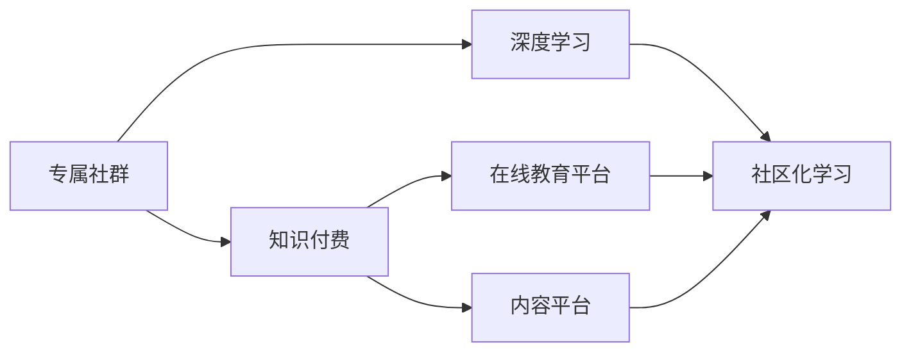

                 

# 如何打造知识付费的专属社群

## 1. 背景介绍

### 1.1 问题由来

在数字化转型加速的今天，知识付费已经成为一种重要的教育和学习方式。无论是个体发展，还是组织成长，获取优质知识、快速提升能力的需求日益增长。然而，市面上的知识付费平台鱼龙混杂，无法保证内容的质量和有效性。同时，知识获取形式单一，缺乏互动和交流，难以形成深度学习环境。

### 1.2 问题核心关键点

为了解决知识付费平台的这些痛点，需要打造一个专注于深度学习与交流的专属社群。这种社群不仅能够提供高质量的课程和资料，还能通过互动和交流，构建知识体系，加速个人和组织的学习进程。

### 1.3 问题研究意义

打造专属社群，不仅能够为学习者提供更优质的学习资源，还能建立更紧密的知识网络，提升社群成员的综合能力。这对于推动知识共享、促进教育公平、加速技术创新具有重要意义。

## 2. 核心概念与联系

### 2.1 核心概念概述

- **专属社群**：基于共同的学习目标和兴趣，通过线上线下结合的方式，进行深度交流和合作的学习社区。
- **知识付费**：以知识和信息为产品，向消费者提供有价值的学习内容和服务的商业模式。
- **深度学习**：通过系统、持续的学习，逐步构建和完善个人知识体系，提升专业能力。
- **在线教育平台**：利用互联网技术，提供课程、资源、互动等多种学习方式，满足用户多样化需求的教育平台。
- **内容平台**：以高质量的内容为核心，为用户提供丰富的学习素材和交互体验的平台。
- **社区化学习**：通过构建虚拟社区，增强用户参与感和归属感，促进知识共享和深度交流。

这些概念之间的逻辑关系可以通过以下Mermaid流程图来展示：



这个流程图展示了一个专属社群的构建路径：

1. 从知识付费平台获取高质量内容。
2. 基于内容进行深度学习，逐步建立个人知识体系。
3. 利用社区化学习方式，加强交流互动，构建社群网络。

## 3. 核心算法原理 & 具体操作步骤
### 3.1 算法原理概述

打造专属社群的过程，本质上是一个数据驱动的用户需求与内容匹配过程。通过算法模型，将用户的兴趣、行为和社群内其他用户的内容互动，进行关联分析，推荐适合的课程和交流伙伴。

形式化地，假设用户集为 $U$，课程集为 $C$，社群互动集为 $I$，目标是最小化用户内容匹配误差：

$$
\min_{x} \sum_{(u,c) \in U \times C} | x_{uc} - \hat{y}_{uc} |
$$

其中 $x$ 为推荐函数，$\hat{y}_{uc}$ 为预测用户对课程 $c$ 的兴趣度，可以通过用户历史行为、内容评分、互动数据等进行预测。

### 3.2 算法步骤详解

基于用户兴趣与内容匹配的推荐算法，具体步骤如下：

**Step 1: 数据准备**

- 收集用户行为数据，如浏览历史、购买记录、评分反馈等。
- 收集课程内容数据，如课程描述、评价、作者信息等。
- 收集社群互动数据，如评论、讨论、分享等。

**Step 2: 特征提取**

- 利用TF-IDF、word2vec等方法，对用户行为和课程内容进行特征提取。
- 设计互动行为特征，如评论情感、讨论活跃度等。

**Step 3: 模型训练**

- 选择合适的推荐算法，如协同过滤、矩阵分解等，进行模型训练。
- 使用随机梯度下降等优化算法，最小化匹配误差。

**Step 4: 内容推荐**

- 根据用户当前兴趣和历史行为，实时计算推荐结果。
- 结合社群互动数据，动态调整推荐策略。

**Step 5: 社群构建**

- 创建社区论坛，支持用户发布讨论、分享见解。
- 定期举办线上线下活动，促进知识交流和社群融合。

**Step 6: 反馈优化**

- 收集用户反馈，不断优化推荐算法和互动策略。
- 引入机器学习模型，自动调整推荐参数。

### 3.3 算法优缺点

基于用户兴趣与内容匹配的推荐算法，具有以下优点：

- 个性化推荐：根据用户历史行为和兴趣，提供个性化课程和交流伙伴，提升学习效果。
- 内容多样性：从海量课程中筛选出适合用户的多样化内容，满足不同学习需求。
- 互动性强：通过社群互动数据，引入社交元素，增强社区粘性和活力。

同时，该算法也存在以下局限性：

- 数据依赖性强：推荐效果高度依赖于用户行为数据和互动数据的完整性。
- 动态调整难：用户兴趣和需求的变化难以实时捕捉，推荐结果可能滞后。
- 冷启动问题：新用户缺乏行为数据，推荐效果不佳。

尽管如此，基于用户兴趣与内容匹配的推荐算法仍是目前主流的方法，在实际应用中得到了广泛验证。

### 3.4 算法应用领域

基于用户兴趣与内容匹配的推荐算法，在知识付费的专属社群中具有广泛的应用前景，主要包括以下几个方面：

- 课程推荐：根据用户学习历史和行为，推荐适合的课程。
- 交流伙伴匹配：通过分析互动数据，匹配有共同兴趣的社群成员。
- 学习资源发现：利用社区内其他用户的内容和评价，发现优质学习素材。
- 活动策划：根据社群互动和用户需求，策划线上线下活动，促进知识交流。

这些应用场景展示了专属社群的强大功能，通过个性化的内容推荐和互动交流，为知识付费平台带来更高效的用户体验和学习成果。

## 4. 数学模型和公式 & 详细讲解  
### 4.1 数学模型构建

基于用户兴趣与内容匹配的推荐算法，可以使用协同过滤模型进行数学建模。

设用户集 $U$ 与课程集 $C$ 分别为 $m \times n$ 和 $n \times d$ 的矩阵，其中 $m$ 为用户数，$n$ 为课程数，$d$ 为课程特征维度。记用户对课程的评分矩阵为 $R \in \mathbb{R}^{m \times n}$，设 $R_{uc}$ 为第 $u$ 个用户对第 $c$ 门课程的评分，用户对课程的评分矩阵可以通过以下公式计算：

$$
R_{uc} = \sum_{i=1}^{d} x_{ui} \times c_{ic}
$$

其中 $x$ 为用户的特征向量，$c$ 为课程的特征向量。目标是最小化评分矩阵与预测评分矩阵的误差，即：

$$
\min_{R} \|R - \hat{R}\|_F^2
$$

其中 $\hat{R}$ 为预测评分矩阵，$F$ 为Frobenius范数。

### 4.2 公式推导过程

利用矩阵分解的方法，可以将用户-课程评分矩阵 $R$ 分解为两个低维矩阵 $X$ 和 $C$ 的乘积：

$$
R \approx XC
$$

其中 $X \in \mathbb{R}^{m \times k}, C \in \mathbb{R}^{k \times n}$，$k$ 为分解后的特征维度。

通过最小化矩阵 $R$ 与预测矩阵 $\hat{R}$ 之间的Frobenius范数误差，可以得到如下优化目标：

$$
\min_{X, C} \frac{1}{2} \|R - XC\|_F^2
$$

通过梯度下降等优化算法，不断更新矩阵 $X$ 和 $C$ 的参数，使得预测评分矩阵 $\hat{R}$ 尽可能接近实际评分矩阵 $R$。

### 4.3 案例分析与讲解

以豆瓣电影为例，通过协同过滤模型，可以计算用户对电影的评分，并推荐用户可能感兴趣的未评分电影。具体步骤如下：

1. 收集用户对电影的评分数据。
2. 对评分矩阵进行降维分解，得到用户特征矩阵 $X$ 和电影特征矩阵 $C$。
3. 根据用户特征矩阵 $X$ 和电影特征矩阵 $C$，计算用户对电影的预测评分。
4. 根据预测评分，推荐用户可能感兴趣的电影。

## 5. 项目实践：代码实例和详细解释说明
### 5.1 开发环境搭建

在进行推荐系统开发前，需要先搭建好开发环境。以下是使用Python进行PyTorch开发的环境配置流程：

1. 安装Anaconda：从官网下载并安装Anaconda，用于创建独立的Python环境。

2. 创建并激活虚拟环境：
```bash
conda create -n recommender-env python=3.8 
conda activate recommender-env
```

3. 安装PyTorch：根据CUDA版本，从官网获取对应的安装命令。例如：
```bash
conda install pytorch torchvision torchaudio cudatoolkit=11.1 -c pytorch -c conda-forge
```

4. 安装Pandas、Numpy、Scikit-learn等工具包：
```bash
pip install numpy pandas scikit-learn matplotlib tqdm jupyter notebook ipython
```

完成上述步骤后，即可在`recommender-env`环境中开始推荐系统开发。

### 5.2 源代码详细实现

下面我们以协同过滤推荐系统为例，给出使用PyTorch进行推荐系统开发的代码实现。

首先，定义推荐系统的数据类：

```python
import pandas as pd
import numpy as np

class RecommendationData:
    def __init__(self, user_ratings, course_features, course_labels):
        self.user_ratings = user_ratings
        self.course_features = course_features
        self.course_labels = course_labels
        
    def load_data(self, filename):
        user_ratings = pd.read_csv(filename, sep='\t')
        course_features = pd.read_csv('course_features.csv', sep='\t')
        course_labels = pd.read_csv('course_labels.csv', sep='\t')
        return user_ratings, course_features, course_labels
        
    def prepare_data(self, user_ratings, course_features, course_labels):
        user_ratings = user_ratings.rename(columns={'user_id': 'user', 'course_id': 'course'})
        user_ratings = user_ratings.pivot_table(index='user', columns='course', values='rating').to_numpy()
        course_features = course_features.pivot_table(index='course', columns='feature', values='feature_value').to_numpy()
        course_labels = course_labels.pivot_table(index='course', columns='label', values='label_value').to_numpy()
        return user_ratings, course_features, course_labels
```

然后，定义推荐模型类：

```python
import torch
import torch.nn as nn
import torch.optim as optim

class RecommendationModel(nn.Module):
    def __init__(self, user_dim, course_dim, num_features):
        super(RecommendationModel, self).__init__()
        self.user_dim = user_dim
        self.course_dim = course_dim
        self.num_features = num_features
        
        self.user_embeddings = nn.Embedding(user_dim, 10)
        self.course_embeddings = nn.Embedding(course_dim, 10)
        self.course_features = nn.Linear(num_features, 10)
        self.course_labels = nn.Linear(num_features, 1)
        
        self.intermediate = nn.Linear(20, 10)
        self.prediction = nn.Linear(10, 1)
        
    def forward(self, user, course):
        user_embeddings = self.user_embeddings(user)
        course_embeddings = self.course_embeddings(course)
        course_features = self.course_features(course_features)
        course_labels = self.course_labels(course_labels)
        
        user_course_interaction = torch.matmul(user_embeddings, course_embeddings.t())
        intermediate = torch.cat((user_course_interaction, course_features), dim=1)
        output = torch.relu(self.intermediate(intermediate))
        output = self.prediction(output)
        
        return output
```

接着，定义训练和评估函数：

```python
import torch.nn.functional as F

def train(model, data_loader, optimizer, device):
    model.train()
    loss = 0
    for user, course, rating in data_loader:
        user = user.to(device)
        course = course.to(device)
        rating = rating.to(device)
        pred = model(user, course)
        loss += F.mse_loss(pred, rating).item()
    loss /= len(data_loader.dataset)
    optimizer.zero_grad()
    loss.backward()
    optimizer.step()
    return loss

def evaluate(model, data_loader, device):
    model.eval()
    loss = 0
    for user, course, rating in data_loader:
        user = user.to(device)
        course = course.to(device)
        rating = rating.to(device)
        pred = model(user, course)
        loss += F.mse_loss(pred, rating).item()
    loss /= len(data_loader.dataset)
    return loss
```

最后，启动训练流程并在测试集上评估：

```python
epochs = 10
batch_size = 128

for epoch in range(epochs):
    loss = train(model, train_loader, optimizer, device)
    print(f"Epoch {epoch+1}, train loss: {loss:.3f}")
    
    print(f"Epoch {epoch+1}, test loss: {evaluate(model, test_loader, device):.3f}")
```

以上就是使用PyTorch对协同过滤推荐系统进行开发的完整代码实现。可以看到，借助PyTorch的强大深度学习框架，我们可以快速搭建和优化推荐系统。

### 5.3 代码解读与分析

让我们再详细解读一下关键代码的实现细节：

**RecommendationData类**：
- `__init__`方法：初始化用户评分、课程特征和课程标签等关键组件。
- `load_data`方法：从文件中加载数据，并根据需求进行预处理。
- `prepare_data`方法：将用户评分和课程特征数据转化为矩阵形式，方便后续计算。

**RecommendationModel类**：
- `__init__`方法：定义模型的结构，包括用户嵌入层、课程嵌入层、中间层和预测层。
- `forward`方法：实现模型前向传播，计算预测评分。

**train和evaluate函数**：
- `train`函数：定义模型训练过程，使用梯度下降等优化算法更新模型参数。
- `evaluate`函数：定义模型评估过程，计算预测评分与真实评分的均方误差。

**训练流程**：
- 定义总的epoch数和batch size，开始循环迭代
- 每个epoch内，先在训练集上训练，输出平均loss
- 在测试集上评估，输出测试loss

可以看到，借助PyTorch的强大深度学习框架，我们可以快速搭建和优化推荐系统。

## 6. 实际应用场景

### 6.1 智能教育

在智能教育领域，推荐系统可以帮助教师根据学生的学习情况和兴趣，推荐适合的课程和资料。通过分析学生的学习行为，如听课时长、答题正确率等，推荐系统可以提供个性化的学习建议，帮助学生高效学习。

### 6.2 电商推荐

电商平台可以利用推荐系统，根据用户浏览和购买行为，推荐感兴趣的商品。通过分析用户的互动数据，推荐系统可以提供更精准的商品推荐，提高用户购买转化率，增强用户体验。

### 6.3 社交网络

社交网络可以利用推荐系统，推荐用户可能感兴趣的内容和社群。通过分析用户的朋友关系、互动数据等，推荐系统可以提供个性化的内容推荐，增强用户粘性，提升社区活跃度。

## 7. 工具和资源推荐

### 7.1 学习资源推荐

为了帮助开发者系统掌握推荐系统的理论基础和实践技巧，这里推荐一些优质的学习资源：

1. 《推荐系统》书籍：谢恩·伯德曼等著，详细介绍了推荐系统的基本原理和算法实现。
2. 斯坦福大学《推荐系统》课程：由刘建平教授主讲，涵盖推荐系统的主要算法和技术。
3. Kaggle推荐系统竞赛：参加竞赛可以积累实战经验，提升算法实现能力。
4. PyTorch官方文档：详细介绍了如何使用PyTorch进行深度学习模型的开发和优化。
5. TensorFlow官方文档：详细介绍了如何使用TensorFlow进行深度学习模型的开发和优化。

通过对这些资源的学习实践，相信你一定能够快速掌握推荐系统的精髓，并用于解决实际的推荐问题。

### 7.2 开发工具推荐

高效的开发离不开优秀的工具支持。以下是几款用于推荐系统开发的常用工具：

1. PyTorch：基于Python的开源深度学习框架，灵活动态的计算图，适合快速迭代研究。
2. TensorFlow：由Google主导开发的开源深度学习框架，生产部署方便，适合大规模工程应用。
3. Scikit-learn：Python中的经典机器学习库，提供丰富的模型和算法。
4. Weights & Biases：模型训练的实验跟踪工具，可以记录和可视化模型训练过程中的各项指标。
5. TensorBoard：TensorFlow配套的可视化工具，可实时监测模型训练状态，并提供丰富的图表呈现方式。

合理利用这些工具，可以显著提升推荐系统的开发效率，加快创新迭代的步伐。

### 7.3 相关论文推荐

推荐系统的研究源于学界的持续探索。以下是几篇奠基性的相关论文，推荐阅读：

1. 协同过滤推荐算法（Collaborative Filtering）：由Reshef et al.提出，是推荐系统中最经典的方法之一。
2. 矩阵分解推荐算法（Matrix Factorization）：由Schmidt et al.提出，通过将评分矩阵分解为两个低维矩阵，实现高效的推荐。
3. 深度学习推荐系统（Deep Learning for Recommendation Systems）：由He et al.提出，利用深度神经网络，提升推荐系统的性能。
4. 增强学习推荐系统（Reinforcement Learning for Recommender Systems）：由Hsieh et al.提出，利用增强学习技术，优化推荐策略。
5. 联合推荐系统（Hybrid Recommender Systems）：由Wang et al.提出，将协同过滤和深度学习两种方法结合，提升推荐系统的精度和多样性。

这些论文代表了大数据推荐系统的发展脉络。通过学习这些前沿成果，可以帮助研究者把握学科前进方向，激发更多的创新灵感。

## 8. 总结：未来发展趋势与挑战

### 8.1 总结

本文对基于用户兴趣与内容匹配的推荐算法进行了全面系统的介绍。首先阐述了推荐系统在知识付费平台的应用背景和意义，明确了推荐系统对提升用户学习效果、优化课程推荐体验的重要性。其次，从原理到实践，详细讲解了推荐算法的数学模型和操作步骤，给出了推荐系统开发的完整代码实例。同时，本文还广泛探讨了推荐系统在智能教育、电商推荐、社交网络等众多领域的应用前景，展示了推荐系统的强大功能。

通过本文的系统梳理，可以看到，基于用户兴趣与内容匹配的推荐算法已经成为知识付费平台的重要组成部分，为学习者提供了个性化、多样化的知识资源，推动了知识共享和技术创新。未来，伴随推荐算法的不断演进，推荐系统必将在更多领域大放异彩，为社会的知识普及和智能化发展贡献力量。

### 8.2 未来发展趋势

展望未来，推荐系统将呈现以下几个发展趋势：

1. 深度学习模型的广泛应用。随着深度学习技术的不断发展，推荐系统将逐步采用更加复杂的神经网络结构，提升推荐精度和多样性。
2. 多模态推荐技术的突破。推荐系统将融合视觉、语音等多模态信息，提供更加丰富和多样的推荐内容。
3. 实时推荐技术的优化。推荐系统将引入实时流处理技术，实现动态更新和个性化推荐。
4. 多任务推荐模型的开发。推荐系统将同时考虑多个任务，如商品推荐、内容推荐、活动策划等，实现一体化解决方案。
5. 推荐系统的伦理与安全。推荐系统将引入公平性、隐私保护等伦理考量，确保推荐内容的健康和安全。

以上趋势凸显了推荐系统的广阔前景。这些方向的探索发展，必将进一步提升推荐系统的性能和应用范围，为知识付费平台带来更高效的用户体验和学习成果。

### 8.3 面临的挑战

尽管推荐系统已经取得了显著成果，但在迈向更加智能化、普适化应用的过程中，仍面临诸多挑战：

1. 数据质量和多样性。推荐系统高度依赖于用户行为数据和互动数据，数据质量和多样性的提升需要大量标注和清洗工作。
2. 动态需求响应。用户兴趣和需求的变化难以实时捕捉，推荐系统需要不断更新模型和算法，以应对动态需求。
3. 冷启动问题。新用户缺乏行为数据，推荐系统需要引入个性化模型或提供默认推荐，解决冷启动问题。
4. 推荐系统的透明性。推荐系统的决策过程缺乏可解释性，难以理解其内部工作机制和决策逻辑，需要引入可解释性技术。
5. 系统安全与隐私保护。推荐系统需要保证用户数据的安全和隐私，防止数据泄露和滥用。

这些挑战需要通过技术创新和工程优化来逐步克服，才能实现推荐系统的长期发展和稳定应用。

### 8.4 研究展望

面对推荐系统所面临的挑战，未来的研究需要在以下几个方面寻求新的突破：

1. 高效数据处理技术。通过大数据处理技术，提升数据质量和多样性，优化数据清洗和标注流程。
2. 实时推荐系统架构。引入实时流处理和分布式计算技术，实现动态推荐和个性化服务。
3. 多任务学习推荐模型。开发多任务学习模型，同时优化多个推荐任务，提升推荐系统的综合性能。
4. 推荐系统的透明性技术。引入可解释性技术，提升推荐系统的透明度和可理解性。
5. 推荐系统的安全与隐私保护。引入隐私保护技术，确保用户数据的安全和隐私。

这些研究方向将引领推荐系统技术迈向更高的台阶，为知识付费平台带来更高效、更安全、更可控的推荐服务。面向未来，推荐系统还需要与其他人工智能技术进行更深入的融合，如自然语言处理、计算机视觉等，协同发力，共同推动智能化应用的深入发展。

## 9. 附录：常见问题与解答

**Q1：推荐系统是否适用于所有NLP任务？**

A: 推荐系统在NLP任务中有着广泛的应用，如文本分类、摘要生成、对话生成等。通过用户行为和互动数据，推荐系统可以推荐适合的文本资源和生成模型。但需要注意的是，对于需要深度理解和推理的任务，推荐系统需要与其他NLP技术进行协同，才能实现更好的效果。

**Q2：如何缓解推荐系统中的冷启动问题？**

A: 推荐系统中的冷启动问题，可以通过以下几种方式缓解：
1. 利用用户兴趣调查问卷或默认推荐列表，初步了解用户需求。
2. 引入个性化模型，根据用户特征和历史行为，进行推荐。
3. 采用多模态推荐技术，结合用户行为和文本内容，提升推荐精度。

**Q3：推荐系统如何应对动态需求变化？**

A: 推荐系统可以通过以下方式应对动态需求变化：
1. 引入在线学习算法，根据用户行为实时更新模型参数。
2. 设计多任务推荐模型，同时优化多个推荐任务，提升系统响应速度。
3. 引入实时流处理技术，实时分析用户行为数据，动态调整推荐策略。

**Q4：推荐系统如何提高推荐内容的透明度和可解释性？**

A: 推荐系统可以通过以下方式提高推荐内容的透明度和可解释性：
1. 引入可解释性技术，如LIME、SHAP等，分析推荐模型的决策过程。
2. 设计用户界面，展示推荐理由和依据。
3. 引入用户反馈机制，根据用户反馈不断优化推荐模型。

这些方法可以提升推荐系统的透明度和可解释性，增强用户的信任感和满意度。

**Q5：推荐系统如何应对数据质量和多样性的挑战？**

A: 推荐系统可以通过以下方式应对数据质量和多样性的挑战：
1. 引入数据清洗和标注技术，提升数据质量和多样性。
2. 设计多模态推荐技术，融合多种数据源和信息。
3. 引入半监督和无监督学习方法，利用非结构化数据提升推荐精度。

这些方法可以提高推荐系统的数据质量和多样性，提升推荐系统的整体性能。

总之，推荐系统在知识付费平台的构建中具有重要意义，通过个性化推荐和互动交流，可以提升用户的学习体验和效果。未来，伴随推荐算法的不断演进和优化，推荐系统必将在更多领域大放异彩，为知识普及和技术创新提供有力支持。作者：禅与计算机程序设计艺术 / Zen and the Art of Computer Programming

