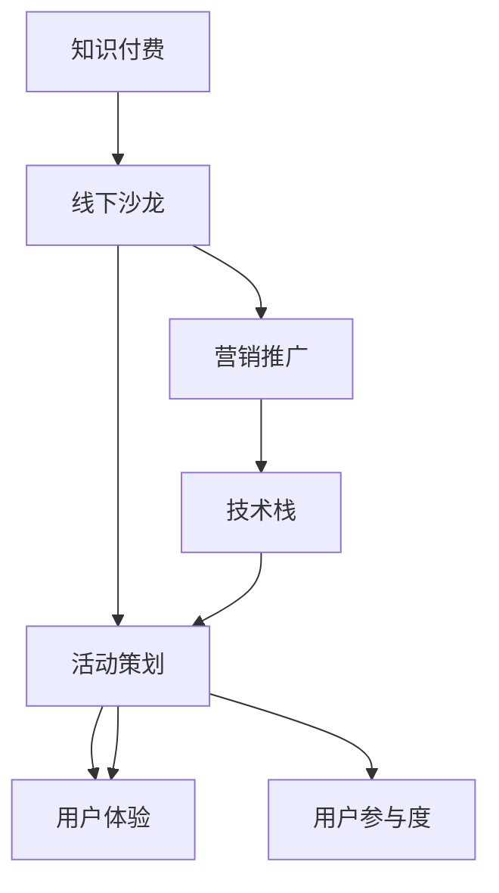

                 

# 如何打造知识付费的线下沙龙活动

> 关键词：知识付费,线下沙龙,项目管理,用户参与,活动策划,营销策略,技术栈,用户体验

## 1. 背景介绍

### 1.1 问题由来
随着互联网的发展，知识付费逐渐成为互联网内容消费的新模式。知识付费平台如得到、分答、知乎Live等，让越来越多人对知识付费有了更深的认识和体验。然而，线下的交流互动仍然是人们获取知识的重要方式之一。线下沙龙活动因其互动性强、氛围好、专业性高等特点，在知识传播和人际交流中具有不可替代的作用。然而，组织一场成功的线下沙龙并非易事，既要注重内容质量，也要考虑参与者的体验。本文旨在探讨如何打造一场优质的知识付费线下沙龙活动，通过提升活动的专业性和参与感，增强知识传播的效果。

### 1.2 问题核心关键点
线下沙龙活动的成功与否，取决于多方面因素，包括主题选择、演讲者选择、活动流程设计、用户参与度、技术支持、营销推广等。通过系统地规划和细致的执行，可以大幅提升线下沙龙的品质，增强用户的参与感和获得感，从而实现知识付费的线上线下融合。

### 1.3 问题研究意义
线下沙龙活动是知识付费领域的重要组成部分，为线上平台用户提供了线下面对面的交流和学习机会，有助于提升用户对平台和内容的信任度。成功的线下沙龙活动不仅可以吸引新用户，还能增强老用户的粘性，为平台带来长期稳定的收益。

## 2. 核心概念与联系

### 2.1 核心概念概述

为更好地理解线下沙龙活动的组织和策划，本节将介绍几个关键概念：

- **知识付费**：基于互联网技术的知识变现模式，用户通过付费购买内容，获得有价值的知识信息。

- **线下沙龙**：以面对面交流为主要形式的知识分享活动，具有较强的互动性和社区感。

- **活动策划**：通过精心设计活动流程和内容，吸引目标受众，实现活动目标。

- **用户体验**：指用户参与活动过程中的感受和反馈，包括活动场所的环境、活动的组织、互动环节的设计等。

- **用户参与度**：用户对活动内容的参与度和互动性，直接关系到活动的效果和参与感。

- **营销推广**：通过线上线下的多种渠道，推广活动信息，吸引目标受众。

- **技术栈**：支撑线下沙龙活动的技术平台，包括在线报名系统、互动投票系统、直播系统等。

这些概念之间的逻辑关系可以通过以下Mermaid流程图来展示：



这个流程图展示出知识付费线下沙龙活动的主要组成部分及其相互关系：

1. 知识付费提供活动资金支持，线下沙龙则为其用户提供了线下面对面的交流和学习机会。
2. 活动策划是线下沙龙的核心环节，通过精心设计，吸引目标受众，增强参与感。
3. 用户体验和用户参与度是衡量活动效果的重要指标，需要通过良好的活动设计和组织来提升。
4. 营销推广是活动的“敲门砖”，通过多渠道推广，吸引更多用户参与。
5. 技术栈是活动落地的基础，需要支持在线报名、互动投票、直播等核心功能。

这些核心概念共同构成了线下沙龙活动的框架，使得线下沙龙不仅是一场知识分享，更是用户交流和社区建设的平台。

## 3. 核心算法原理 & 具体操作步骤

### 3.1 算法原理概述

线下沙龙活动的组织和策划，本质上是一个多目标优化问题。其核心思想是：通过合理的活动策划和流程设计，最大限度地提升用户体验和用户参与度，同时利用技术手段提升活动的运营效率和参与感。

形式化地，假设活动目标为 $T=\{用户体验(U), 用户参与度(P), 营销效果(M)\}$，则活动策划的目标函数为：

$$
\max_{P_1,P_2,...,P_n} \sum_{t \in T} w_t P_t
$$

其中 $P_t$ 为第 $t$ 个目标 $T$ 的优化变量，$w_t$ 为该目标的权重，反映了其在活动中的重要性。

优化过程需要考虑多方面因素，包括但不限于：

- 目标受众的需求和兴趣。
- 演讲者和嘉宾的知名度和影响力。
- 活动流程的设计和执行。
- 技术支持的水平和稳定性。
- 营销推广的渠道和效果。

### 3.2 算法步骤详解

线下沙龙活动的组织和策划一般包括以下几个关键步骤：

**Step 1: 确定活动目标和受众**

- 明确活动的核心目标，如知识分享、技术交流、品牌推广等。
- 确定目标受众，包括专业背景、兴趣爱好、参与动机等，通过调查问卷、用户分析等手段收集信息。

**Step 2: 选择合适的演讲者和嘉宾**

- 根据目标受众的需求和兴趣，选择适合的演讲者和嘉宾，如知名专家、行业领袖、技术达人等。
- 通过邮件、电话、社交媒体等多种渠道联系演讲者和嘉宾，确定其参与意愿和行程安排。

**Step 3: 制定详细的活动流程**

- 设计活动日程，确定主题、开场白、中间环节、闭幕等关键节点。
- 设计互动环节，如问答、讨论、投票等，增强用户参与感。

**Step 4: 技术支持**

- 选择合适的技术平台，支持在线报名、互动投票、直播等功能。
- 进行技术测试，确保系统的稳定性和响应速度。

**Step 5: 营销推广**

- 通过多渠道推广活动信息，如社交媒体、邮件营销、线下海报等。
- 设计吸引人的活动文案和宣传素材，提高用户的兴趣和参与意愿。

**Step 6: 活动执行**

- 活动当天，严格执行活动流程，确保各项环节顺利进行。
- 通过技术手段记录用户行为数据，进行后续分析和优化。

**Step 7: 活动评估**

- 收集用户反馈，评估活动效果。
- 分析用户行为数据，找出改进点，优化后续活动。

以上是线下沙龙活动组织和策划的一般流程。在实际应用中，还需要针对具体活动的特点，对各环节进行优化设计，如改进活动流程、引入更多互动元素、提升技术平台的性能等，以进一步提升活动品质。

### 3.3 算法优缺点

线下沙龙活动组织和策划的优势在于：

1. 增强用户参与感。通过线下面对面的交流，提升用户对知识的理解深度和参与度。
2. 增强社区感。线下活动有助于建立和巩固社区关系，形成稳定的知识交流群体。
3. 提升品牌知名度。通过邀请知名嘉宾，增加活动的曝光率和影响力。
4. 增强用户体验。活动场所的环境、互动环节的设计等，都能提升用户的整体体验。

同时，该方法也存在一定的局限性：

1. 组织成本高。线下活动的组织和策划需要投入大量人力、物力和财力，成本较高。
2. 受时间地点限制。线下活动的参与度受时间和地点的影响较大，难以大规模推广。
3. 技术支持复杂。线下活动的技术支持需要多方面的配合，涉及在线报名、互动投票、直播等环节，技术复杂度较高。
4. 用户参与度受限。由于时间和地点限制，难以覆盖到所有的目标受众，用户参与度可能受限。

尽管存在这些局限性，但就目前而言，线下沙龙活动仍是大知识付费平台的重要组成部分。未来相关研究的重点在于如何进一步降低线下活动的成本和复杂度，提高活动的覆盖率和参与度，同时兼顾用户体验和品牌推广效果。

### 3.4 算法应用领域

线下沙龙活动已经广泛应用于知识付费、技术交流、品牌推广等多个领域，取得了显著的效果：

- **知识付费平台**：通过线下沙龙活动，平台可以增强用户粘性，提升品牌影响力，吸引更多新用户。
- **技术交流活动**：线下沙龙提供了一个面对面的交流平台，有助于技术爱好者和从业者分享经验，共同进步。
- **品牌推广活动**：线下沙龙可以成为品牌宣传的重要渠道，通过知名嘉宾的参与，增加品牌的曝光度和可信度。

此外，线下沙龙活动在企业内部培训、学术交流、公共科普等方面也有广泛应用。随着知识付费和线下的进一步融合，未来线下沙龙活动将发挥更大的作用。

## 4. 数学模型和公式 & 详细讲解 & 举例说明（备注：数学公式请使用latex格式，latex嵌入文中独立段落使用 $$，段落内使用 $)
### 4.1 数学模型构建

线下沙龙活动的优化目标可以表示为多目标优化问题，假设目标函数为：

$$
\max_{P_1,P_2,...,P_n} \sum_{t \in T} w_t P_t
$$

其中 $P_t$ 为第 $t$ 个目标 $T$ 的优化变量，$w_t$ 为该目标的权重，反映了其在活动中的重要性。例如，用户体验 $U$ 和用户参与度 $P$ 的优化目标可以分别表示为：

$$
U = \sum_{i=1}^{N_u} u_i \cdot \text{满意度评分}
$$

$$
P = \sum_{i=1}^{N_p} p_i \cdot \text{互动次数}
$$

其中 $u_i$ 和 $p_i$ 分别为用户满意度和互动次数的权重。

### 4.2 公式推导过程

通过多目标优化问题，可以设计出一系列的决策变量和约束条件，用于指导活动策划和执行。例如，在活动流程设计中，可以通过以下优化模型来确定各个环节的时间和资源分配：

$$
\begin{aligned}
\max_{t_1,t_2,...,t_n} & \sum_{i=1}^{n} w_i t_i \\
\text{s.t.} & \sum_{j=1}^{n} t_j \leq T_{total} \\
& t_i \geq 0, i=1,...,n
\end{aligned}
$$

其中 $T_{total}$ 为活动总时长，$w_i$ 为第 $i$ 个环节的重要性权重。通过优化上述模型，可以得出最优的活动流程安排，最大化用户体验和用户参与度。

### 4.3 案例分析与讲解

假设某知识付费平台组织一场技术交流沙龙，邀请了3位知名嘉宾进行演讲，主题分别为“人工智能基础”、“深度学习应用”和“大数据分析”。以下是该沙龙的优化目标和决策变量：

- 用户体验 $U$：通过问卷调查，获取用户对活动整体满意度评分的期望值。
- 用户参与度 $P$：通过互动投票，获取用户对演讲环节的期望互动次数。
- 营销效果 $M$：通过活动宣传，获取活动的预期报名人数。

在活动中，可以通过以下公式来计算各目标的优化值：

$$
U = \frac{1}{N_u} \sum_{i=1}^{N_u} \text{满意度评分}
$$

$$
P = \frac{1}{N_p} \sum_{i=1}^{N_p} \text{互动次数}
$$

$$
M = \text{预期报名人数}
$$

通过上述公式，可以计算出各目标的优化值，进而调整活动流程和内容，提升整体效果。

## 5. 项目实践：代码实例和详细解释说明
### 5.1 开发环境搭建

在进行线下沙龙活动的技术支持开发前，我们需要准备好开发环境。以下是使用Python进行Django开发的环境配置流程：

1. 安装Anaconda：从官网下载并安装Anaconda，用于创建独立的Python环境。

2. 创建并激活虚拟环境：
```bash
conda create -n django-env python=3.8 
conda activate django-env
```

3. 安装Django：从官网下载并安装Django框架，版本应为3.2.x。
```bash
pip install Django==3.2.8
```

4. 安装必要的第三方库：
```bash
pip install Pillow django-crispy-forms django-select2
```

5. 安装其他依赖：
```bash
pip install requests beautifulsoup4
```

完成上述步骤后，即可在`django-env`环境中开始开发。

### 5.2 源代码详细实现

这里我们以一个简化的线上报名系统为例，给出Django框架的代码实现。

首先，定义用户模型和报名表单：

```python
from django.db import models
from django import forms
from django.contrib.auth.models import User

class User(models.Model):
    username = models.CharField(max_length=255)
    email = models.EmailField()
    # 其他用户信息...

class RegistrationForm(forms.ModelForm):
    class Meta:
        model = User
        fields = ['username', 'email', 'password']

class ReportForm(forms.Form):
    speakers = forms.ModelMultipleChoiceField(queryset=Speaker.objects.all(), label="Speakers")
    topics = forms.ModelMultipleChoiceField(queryset=Topic.objects.all(), label="Topics")
```

然后，定义演讲者和主题模型：

```python
class Speaker(models.Model):
    name = models.CharField(max_length=255)
    title = models.CharField(max_length=255)
    # 其他演讲者信息...

class Topic(models.Model):
    name = models.CharField(max_length=255)
    description = models.TextField()
    # 其他主题信息...
```

接着，定义报名和活动页面视图：

```python
from django.shortcuts import render
from django.views.generic import ListView, DetailView
from .models import User, Speaker, Topic
from .forms import RegistrationForm, ReportForm

def index(request):
    return render(request, 'index.html')

def registration(request):
    if request.method == 'POST':
        form = RegistrationForm(request.POST)
        if form.is_valid():
            form.save()
            return redirect('home')
    else:
        form = RegistrationForm()
    return render(request, 'registration.html', {'form': form})

def report(request):
    if request.method == 'POST':
        form = ReportForm(request.POST)
        if form.is_valid():
            # 处理表单数据
            return redirect('home')
    else:
        form = ReportForm()
    return render(request, 'report.html', {'form': form})

def topic_list(request):
    topics = Topic.objects.all()
    return render(request, 'topic_list.html', {'topics': topics})

def topic_detail(request, pk):
    topic = Topic.objects.get(pk=pk)
    return render(request, 'topic_detail.html', {'topic': topic})
```

最后，定义数据迁移和数据库初始化：

```python
from django.db import migrations, models
import django.db.models.deletion

class Migration(migrations.Migration):
    dependencies = [
        ('api', '0001_initial'),
    ]

    operations = [
        migrations.CreateModel(
            name='Topic',
            fields=[
                ('id', models.AutoField(auto_created=True, primary_key=True, serialize=False, verbose_name='ID')),
                ('name', models.CharField(max_length=255)),
                ('description', models.TextField()),
            ],
        ),
        migrations.AddField(
            model_name='speaker',
            name='topic',
            field=models.ForeignKey(to='topic', on_delete=django.db.models.deletion.CASCADE),
        ),
    ]
```

以上代码实现了基本的用户注册、演讲者和主题选择、活动报名等功能。在实际开发中，还需要根据具体需求进一步扩展和优化。

### 5.3 代码解读与分析

让我们再详细解读一下关键代码的实现细节：

**User模型**：
- 定义了用户的基本信息，包括用户名、邮箱等。

**RegistrationForm表单**：
- 使用Django的ModelForm，继承自User模型，用于用户注册。

**Speaker和Topic模型**：
- 定义了演讲者和主题的基本信息，用于记录活动内容。

**index视图**：
- 显示活动首页，提供用户登录和注册入口。

**report视图**：
- 处理用户提交的报名表单，进行数据处理和保存。

**topic_list和topic_detail视图**：
- 显示活动主题列表和具体主题详情，供用户选择和了解。

以上是使用Django框架进行线下沙龙活动的技术支持的代码实现。可以看到，Django提供了强大的数据模型和视图功能，可以方便地实现用户管理、数据存储和展示等功能。

当然，实际的开发中还需要考虑更多的因素，如安全性、数据验证、异常处理等。通过合理设计和使用Django等技术框架，可以显著提升开发效率和系统稳定性。

## 6. 实际应用场景
### 6.1 智能客服系统

线下沙龙活动可以在智能客服系统中发挥重要作用，通过与用户的面对面交流，提升服务质量和客户满意度。例如，某客服系统可以通过线下沙龙活动，收集用户反馈和需求，改进客服策略和服务流程，增强用户的粘性和忠诚度。

### 6.2 金融舆情监测

金融机构可以通过线下沙龙活动，邀请专家学者进行金融市场分析和投资策略分享，提升员工的金融知识和技能。同时，通过活动互动环节，收集员工的意见和建议，优化内部流程和风险管理，增强金融决策的科学性和准确性。

### 6.3 个性化推荐系统

电商平台可以通过线下沙龙活动，了解用户的购物偏好和需求，提升推荐系统的个性化和精准度。例如，某电商平台的线下沙龙活动可以邀请用户参与，收集用户的购物体验和意见，进而改进推荐算法和商品推荐策略，提升用户体验和销售额。

### 6.4 未来应用展望

随着技术的发展和应用场景的拓展，线下沙龙活动将发挥更大的作用：

- **智慧医疗**：医疗机构可以通过线下沙龙活动，邀请专家进行医学知识和技能分享，提升医生的专业能力和服务质量。
- **教育培训**：教育机构可以通过线下沙龙活动，邀请名师进行知识分享和交流，提升学生的学习兴趣和效果。
- **城市治理**：政府可以通过线下沙龙活动，听取市民的意见和建议，优化城市管理和公共服务，提升市民的满意度和参与感。

此外，随着AI技术的进步，线下沙龙活动也将越来越多地采用智能技术手段，如虚拟现实(VR)、增强现实(AR)、人工智能等，提升活动体验和效果。

## 7. 工具和资源推荐
### 7.1 学习资源推荐

为了帮助开发者系统掌握线下沙龙活动的组织和策划，这里推荐一些优质的学习资源：

1. **Django官方文档**：Django框架的官方文档，提供了全面的开发教程和API参考，是学习Django框架的最佳资源。

2. **Django Girl**：Django社区发起的女性开发者学习资源，提供了大量的教程、文章和项目，适合新手入门。

3. **《Django实战》**：一本实战型的Django开发指南，提供了丰富的开发案例和最佳实践，适合进阶学习。

4. **《Python Web开发实战》**：一本深入浅出的Python Web开发教程，介绍了Django、Flask等主流Web框架的使用方法和技巧。

5. **Coursera上的Django课程**：由Coursera提供的Django课程，由知名讲师授课，适合系统学习Django框架。

通过对这些资源的学习实践，相信你一定能够快速掌握Django框架的使用，并用于开发线下沙龙活动的技术支持平台。

### 7.2 开发工具推荐

高效的开发离不开优秀的工具支持。以下是几款用于线下沙龙活动开发的常用工具：

1. **Django**：基于Python的Web框架，提供了强大的数据模型和视图功能，支持多种模板语言，适合Web应用开发。

2. **SQLAlchemy**：Python的ORM框架，提供了数据模型和数据库交互的灵活性，适合数据库设计和操作。

3. **Redis**：开源的内存数据库，支持数据缓存、队列、发布/订阅等常见功能，适合高并发的系统开发。

4. **Gunicorn**：Python的Web服务器，支持多进程、多线程，适合处理高并发请求。

5. **Docker**：容器化技术，支持应用的无缝部署和扩展，适合系统集成和部署。

合理利用这些工具，可以显著提升线下沙龙活动的技术支持平台开发效率，加快创新迭代的步伐。

### 7.3 相关论文推荐

线下沙龙活动的组织和策划源于学界的持续研究。以下是几篇奠基性的相关论文，推荐阅读：

1. **《Django for Beginners》**：Django框架的入门教程，适合新手快速上手。

2. **《Django 2: Unleashing the Power of Python》**：一本深入介绍Django 2.0版本的实战教程，适合进阶学习。

3. **《Django REST Framework》**：Django的RESTful API开发指南，适合开发API驱动的应用。

4. **《Django Models and ORM》**：Django数据模型和ORM的详细讲解，适合数据管理和交互。

5. **《Django Comprehensive Companion》**：Django框架的全面教程，适合系统学习。

这些论文代表了大语言模型微调技术的发展脉络。通过学习这些前沿成果，可以帮助研究者把握学科前进方向，激发更多的创新灵感。

## 8. 总结：未来发展趋势与挑战

### 8.1 总结

本文对线下沙龙活动的组织和策划方法进行了全面系统的介绍。首先阐述了线下沙龙活动在知识付费中的重要性，明确了活动策划和执行的关键环节。其次，从原理到实践，详细讲解了活动组织和策划的数学模型和操作步骤，给出了具体的代码实现。同时，本文还广泛探讨了线下沙龙活动在多个行业领域的应用前景，展示了其广泛的适用性和重要性。

通过本文的系统梳理，可以看到，线下沙龙活动不仅是一场知识分享，更是用户交流和社区建设的平台。随着技术的发展和应用场景的拓展，线下沙龙活动必将在更多领域发挥作用，为知识付费平台和知识传播注入新的活力。

### 8.2 未来发展趋势

展望未来，线下沙龙活动将呈现以下几个发展趋势：

1. **智能化和数字化**：随着AI技术的进步，线下沙龙活动将越来越多地采用智能技术手段，如虚拟现实(VR)、增强现实(AR)、人工智能等，提升活动体验和效果。

2. **线上线下融合**：线上线下的融合将使得线下沙龙活动更加灵活和多样化，提供更加丰富的参与方式和互动体验。

3. **用户体验优化**：通过数据分析和反馈机制，不断优化活动流程和内容，提升用户的整体体验和满意度。

4. **社区化建设**：线下沙龙活动将成为社区建设的重要平台，通过建立和巩固社区关系，形成稳定的知识交流群体。

5. **活动专业化**：随着行业的发展和技术的进步，线下沙龙活动将越来越专业化，涵盖更多专业领域和主题。

以上趋势凸显了线下沙龙活动的广阔前景。这些方向的探索发展，将使得线下沙龙活动在知识付费领域发挥更大的作用，提升用户参与度和活动效果。

### 8.3 面临的挑战

尽管线下沙龙活动已经取得了显著成效，但在迈向更加智能化、普适化应用的过程中，它仍面临诸多挑战：

1. **组织成本高**：线下活动的组织和策划需要投入大量人力、物力和财力，成本较高。如何在降低成本的同时提升活动效果，是一个重要的研究方向。

2. **技术复杂度高**：线下活动的技术支持需要多方面的配合，涉及在线报名、互动投票、直播等环节，技术复杂度较高。如何简化技术栈，提升系统稳定性，是一个亟待解决的问题。

3. **用户参与度受限**：由于时间和地点限制，难以覆盖到所有的目标受众，用户参与度可能受限。如何扩大覆盖范围，提高用户参与度，是一个重要的研究方向。

4. **用户体验不统一**：线下沙龙活动在不同地点和场合下，用户体验可能存在差异。如何提供统一的体验，是一个重要的挑战。

5. **数据收集难度大**：通过线下沙龙活动收集用户反馈和数据，需要耗费大量人力和时间，难度较大。如何简化数据收集流程，提高数据质量，是一个亟待解决的问题。

正视线下沙龙活动面临的这些挑战，积极应对并寻求突破，将使线下沙龙活动在知识付费领域发挥更大的作用。相信随着技术的发展和应用场景的拓展，线下沙龙活动必将迎来更加广阔的发展前景。

### 8.4 未来突破

面对线下沙龙活动所面临的种种挑战，未来的研究需要在以下几个方面寻求新的突破：

1. **智能化技术应用**：引入更多智能化技术手段，如虚拟现实(VR)、增强现实(AR)、人工智能等，提升活动体验和效果。

2. **线上线下融合**：将线下沙龙活动与线上平台进行深度整合，提供更加灵活和多样化的参与方式。

3. **数据驱动优化**：通过数据分析和反馈机制，不断优化活动流程和内容，提升用户的整体体验和满意度。

4. **社区化建设**：通过线下沙龙活动，建立和巩固社区关系，形成稳定的知识交流群体，增强社区黏性。

5. **技术栈优化**：简化技术栈，提升系统稳定性，提高活动组织和执行的效率。

这些研究方向的探索，将引领线下沙龙活动走向更高的台阶，为知识付费平台和知识传播注入新的活力。面向未来，线下沙龙活动还需要与其他人工智能技术进行更深入的融合，如知识表示、因果推理、强化学习等，多路径协同发力，共同推动知识付费领域的发展。只有勇于创新、敢于突破，才能不断拓展线下沙龙活动的边界，让知识付费技术更好地造福人类社会。

## 9. 附录：常见问题与解答

**Q1：如何选择合适的线下沙龙活动主题？**

A: 选择合适的线下沙龙活动主题，需要考虑以下几个方面：
1. 目标受众的需求和兴趣。通过调研和问卷，了解受众关注的领域和问题。
2. 行业趋势和热点。选择与行业发展趋势和热点问题相关的议题。
3. 资源和场地情况。考虑活动组织和场地资源的可用性，选择可行的主题。

**Q2：如何提高线下沙龙活动的参与度？**

A: 提高线下沙龙活动的参与度，需要考虑以下几个方面：
1. 活动宣传。通过多渠道推广活动信息，吸引更多目标受众。
2. 活动内容。提供有价值、有趣味的内容，增强用户的参与感和获得感。
3. 互动环节。设计互动环节，如问答、讨论、投票等，增强用户的互动性。

**Q3：如何选择和邀请合适的演讲者和嘉宾？**

A: 选择和邀请合适的演讲者和嘉宾，需要考虑以下几个方面：
1. 演讲者的知名度和影响力。选择知名专家、行业领袖、技术达人等，增加活动的吸引力和可信度。
2. 演讲者与主题的契合度。选择与主题相关的演讲者，确保内容的连贯性和专业性。
3. 演讲者的亲和力和互动性。选择亲和力强、互动性好的演讲者，提升活动氛围和参与感。

**Q4：线下沙龙活动的技术支持有哪些关键环节？**

A: 线下沙龙活动的技术支持关键环节包括：
1. 在线报名系统。支持用户在线报名和信息提交，提高报名效率和用户体验。
2. 互动投票系统。支持用户参与互动投票，提升用户的参与感和互动性。
3. 直播系统。支持现场直播，实时传输活动内容，增加活动的覆盖面和参与度。

**Q5：如何评估线下沙龙活动的效果？**

A: 评估线下沙龙活动的效果，需要考虑以下几个方面：
1. 用户反馈。通过问卷调查、在线评价等方式，收集用户的反馈和意见。
2. 用户行为数据。通过分析用户的报名、互动、评价等行为数据，评估活动效果和改进点。
3. 营销效果。通过活动宣传和报名情况，评估活动的曝光度和吸引力。

通过对这些问题的解答，相信你能够更好地理解和组织线下沙龙活动，提升活动效果和用户体验。

---

作者：禅与计算机程序设计艺术 / Zen and the Art of Computer Programming

