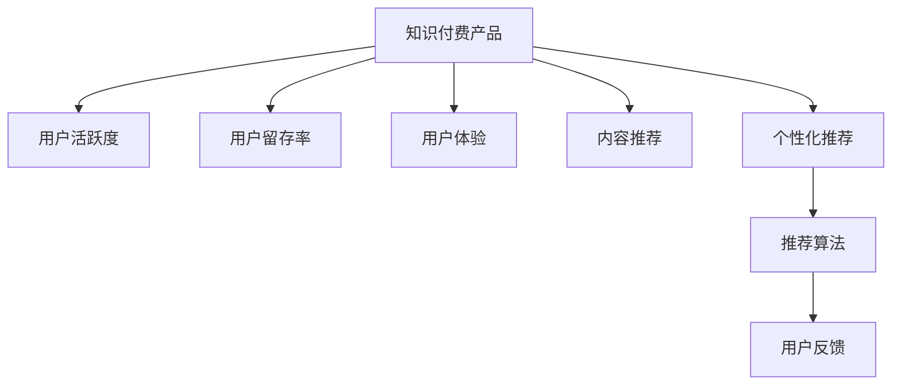

                 

# 如何提高知识付费产品的用户活跃度

> 关键词：知识付费、用户活跃度、用户留存、用户体验、内容推荐、个性化推荐

## 1. 背景介绍

### 1.1 问题由来
随着互联网技术的迅猛发展和普及，在线教育与知识付费成为人们获取新知的重要渠道。然而，面对市场上琳琅满目的知识付费产品，用户往往难以做出选择，且在长期使用后容易流失。因此，如何提升知识付费产品的用户活跃度，特别是用户留存率，成为了教育科技公司关注的焦点。

### 1.2 问题核心关键点
用户活跃度主要体现在用户对知识付费产品的使用频率、持续时间、付费转化等方面。影响用户活跃度的因素多种多样，包括产品功能、内容质量、用户体验、价格策略、推荐系统等。本文将系统梳理这些问题点，深入探讨如何通过技术和策略手段提高知识付费产品的用户活跃度。

### 1.3 问题研究意义
通过提升用户活跃度，知识付费产品可以最大化发挥其价值，减少用户的流失，增加用户粘性，提高收入。这对于构建可持续发展的教育科技生态系统，促进社会知识的广泛传播，具有重要意义。

## 2. 核心概念与联系

### 2.1 核心概念概述

为了更好地理解如何提高知识付费产品的用户活跃度，本节将介绍几个密切相关的核心概念：

- **知识付费产品**：基于互联网平台，提供知识内容和服务的付费产品，如在线课程、专栏、电子书等。
- **用户活跃度**：用户对知识付费产品的使用频率和持续性，通常通过访问次数、使用时长、付费比例等指标来衡量。
- **用户留存率**：新用户在注册或购买后的续留比例，反映了产品的长期吸引力和用户满意度。
- **用户体验**：用户在使用知识付费产品时的情感体验，包括界面美观、交互流畅、内容易懂等方面。
- **内容推荐**：基于用户行为数据和偏好，为用户推荐相关课程和文章，提升用户体验和留存率。
- **个性化推荐**：根据用户历史行为和偏好，动态调整推荐内容，提高用户满意度。

这些核心概念之间的逻辑关系可以通过以下Mermaid流程图来展示：



这个流程图展示了这个系统的主要流程和相互作用：

1. 知识付费产品作为基础，用户活跃度、用户留存率、用户体验、内容推荐和个性化推荐都是产品功能和用户体验的一部分。
2. 内容推荐和个性化推荐需要通过推荐算法实现，以精准推送用户感兴趣的内容。
3. 用户反馈可以用于改进推荐算法和产品设计，进一步提升用户体验。

## 3. 核心算法原理 & 具体操作步骤
### 3.1 算法原理概述

提高知识付费产品用户活跃度的核心在于用户对内容的满意度和使用体验。具体来说，可以通过以下几种方法：

1. **个性化推荐**：通过分析用户行为数据，为用户推荐个性化内容，提升用户满意度和使用频率。
2. **内容丰富化**：增加内容的广度和深度，满足不同用户的学习需求。
3. **用户体验优化**：优化界面设计、交互流程，提升用户使用的流畅性。
4. **社群建设**：通过社区和社交功能，增强用户粘性，促进知识交流。
5. **激励机制**：通过积分、奖励、排名等方式，激励用户持续使用和付费。

### 3.2 算法步骤详解

为了实现上述目标，知识付费产品通常采用以下步骤进行用户活跃度提升：

**Step 1: 数据收集与预处理**
- 收集用户行为数据，包括访问时间、点击次数、学习进度、付费记录等。
- 数据预处理，清洗无效数据，构建用户画像。

**Step 2: 推荐系统设计**
- 选择合适的推荐算法，如协同过滤、内容推荐、混合推荐等。
- 设计推荐系统的框架，包括推荐引擎、数据存储和用户界面等。

**Step 3: 个性化推荐实现**
- 基于用户画像和行为数据，设计推荐算法模型。
- 进行模型训练和测试，调整模型参数。
- 将推荐结果融入用户界面，实时更新推荐内容。

**Step 4: 用户体验优化**
- 对用户界面进行视觉和交互优化，提升用户体验。
- 增加互动元素，如社区讨论、学习小组、评论反馈等。
- 实时监控用户反馈，快速迭代改进产品功能。

**Step 5: 社群建设与激励机制**
- 建立社区论坛或学习小组，促进用户之间的交流和分享。
- 设计积分系统、排行榜、挑战赛等激励机制，鼓励用户持续学习和分享。
- 提供高质量内容的付费订阅，提升用户价值感和忠诚度。

### 3.3 算法优缺点

个性化推荐和用户体验优化是提升知识付费产品用户活跃度的关键，但它们也有自身的优缺点：

**优点**：
1. **提升用户满意度**：个性化推荐和内容丰富化能显著提高用户对内容的满意度，从而增加使用频率。
2. **增加用户粘性**：社群建设和激励机制可以增加用户粘性，降低流失率。
3. **提高转化率**：通过精准推荐，提升用户购买意愿，提高转化率。

**缺点**：
1. **数据依赖性高**：个性化推荐依赖大量的用户行为数据，收集和处理成本较高。
2. **内容同质化**：过度依赖推荐算法可能导致内容同质化，影响用户体验。
3. **算法复杂度高**：推荐算法复杂，需要较强的技术支持和持续优化。
4. **用户体验门槛高**：用户界面和交互设计复杂，可能影响初次使用体验。

### 3.4 算法应用领域

个性化推荐和用户体验优化在多个领域得到应用，如电商平台、在线视频、新闻网站等。在知识付费领域，它们尤其重要，因为内容本身即为产品核心价值，如何有效呈现和推荐内容，直接影响用户的留存和活跃度。

## 4. 数学模型和公式 & 详细讲解 & 举例说明

### 4.1 数学模型构建

在知识付费产品中，推荐系统是一个关键的组件。一个典型的推荐系统由以下模块组成：

- 用户画像：包括用户的基本信息、行为数据、兴趣偏好等。
- 内容画像：包括内容的属性、标签、相关性等。
- 推荐引擎：基于用户画像和内容画像，通过算法模型计算推荐结果。
- 存储系统：用于存储用户画像、内容画像和推荐结果。

### 4.2 公式推导过程

以协同过滤算法为例，假设用户集为 $U$，物品集为 $I$，用户对物品的评分矩阵为 $R_{UI}$，用户与物品的相似度矩阵为 $S_{UI}$，推荐算法的基本流程如下：

1. 计算用户-物品的相似度矩阵 $S_{UI} = S_{UI}(R_{UI})$
2. 计算用户对物品的推荐评分 $\hat{R}_U(i) = \frac{1}{N_i} \sum_{j \in I} S_{UI}(j,i) R_{UI}(j) = \sum_{j \in I} S_{UI}(i,j) R_{UI}(j)$

其中 $N_i$ 为物品 $i$ 的评分数量。

### 4.3 案例分析与讲解

假设某知识付费平台上有一个用户 $u_1$，访问了以下内容：
- 课程 $i_1$ 评分 5
- 课程 $i_2$ 评分 4
- 课程 $i_3$ 评分 2

用户 $u_1$ 与其他用户 $u_2$ 的相似度为 0.8，用户 $u_2$ 对课程 $i_1$ 的评分 3，课程 $i_3$ 的评分 2。

根据上述公式，可以计算出用户 $u_1$ 对课程 $i_2$ 的推荐评分：

$$
\hat{R}_{u_1}(i_2) = \frac{0.8 \times (5 + 3) + 0.8 \times (4 + 2)}{5 + 4 + 2} = 4.16
$$

由于用户 $u_1$ 已经评分过 $i_1$，该推荐结果可以作为进一步推荐的基础，或者用于更新用户画像，进一步优化推荐算法。

## 5. 项目实践：代码实例和详细解释说明
### 5.1 开发环境搭建

要进行推荐系统开发，首先需要配置开发环境。以下是使用Python进行TensorFlow和PyTorch开发的环境配置流程：

1. 安装Anaconda：从官网下载并安装Anaconda，用于创建独立的Python环境。

2. 创建并激活虚拟环境：
```bash
conda create -n recommender-env python=3.8 
conda activate recommender-env
```

3. 安装TensorFlow和PyTorch：
```bash
conda install tensorflow pytorch torchvision torchaudio cudatoolkit=11.1 -c pytorch -c conda-forge
```

4. 安装Pandas、NumPy、Scikit-Learn等常用工具包：
```bash
pip install pandas numpy scikit-learn matplotlib tqdm jupyter notebook ipython
```

完成上述步骤后，即可在`recommender-env`环境中进行推荐系统开发。

### 5.2 源代码详细实现

下面是使用TensorFlow实现协同过滤推荐系统的示例代码：

```python
import tensorflow as tf
import pandas as pd
import numpy as np

# 读取用户行为数据
data = pd.read_csv('user_behavior.csv')

# 构建用户画像和内容画像
users = data['user_id'].unique()
items = data['item_id'].unique()

user_based = data.groupby('user_id').mean()
item_based = data.groupby('item_id').mean()

# 计算用户-物品相似度矩阵
S = user_based.dot(item_based.T)

# 定义评分矩阵
R = np.random.randint(1, 5, size=(len(users), len(items)))

# 构建推荐引擎
model = tf.keras.Sequential([
    tf.keras.layers.Dense(128, activation='relu', input_shape=(len(items),)),
    tf.keras.layers.Dense(1, activation='sigmoid')
])

# 编译模型
model.compile(optimizer=tf.keras.optimizers.Adam(0.001), loss='mse', metrics=['mae'])

# 训练模型
model.fit(S.to_numpy(), R, epochs=50, validation_split=0.2)

# 预测推荐评分
preds = model.predict(S.to_numpy())
```

以上代码实现了一个简单的协同过滤推荐系统，通过TensorFlow实现了评分矩阵的预测。在实际应用中，还需要进行更复杂的推荐算法设计和数据预处理，以提升推荐效果。

### 5.3 代码解读与分析

代码中的关键步骤包括：

- **数据读取与预处理**：通过Pandas读取用户行为数据，并进行初步处理，构建用户画像和内容画像。
- **相似度矩阵计算**：计算用户-物品的相似度矩阵，作为推荐模型的输入。
- **模型构建与训练**：使用TensorFlow定义推荐模型，并进行训练，得到推荐评分预测模型。
- **模型预测**：使用训练好的模型对用户-物品相似度矩阵进行预测，得到推荐评分。

需要注意的是，实际应用中还需要对用户行为数据进行进一步分析，如热门课程、用户兴趣变化等，以提高推荐精度。

## 6. 实际应用场景
### 6.1 在线教育平台

在线教育平台是知识付费产品的典型应用场景。通过个性化推荐和用户体验优化，平台能够为用户提供定制化的学习方案，提升学习效果和满意度。具体而言，平台可以通过以下方式提升用户活跃度：

- 课程推荐：根据用户学习进度和行为数据，推荐相关课程和资源。
- 学习路径优化：根据用户目标和兴趣，设计个性化学习路径，提高学习效率。
- 学习社区：建立学习小组、论坛等社区功能，促进用户交流和互动。
- 学习反馈：收集用户反馈，及时调整课程内容和学习体验。

### 6.2 企业培训平台

企业培训平台需要根据员工的实际需求，提供个性化的学习内容，提高培训效果和员工的满意度。具体措施包括：

- 岗位课程推荐：根据员工的岗位和职业发展路径，推荐相关培训课程。
- 学习进度监控：实时监控员工的学习进度和反馈，提供个性化辅导。
- 知识分享：建立知识分享平台，鼓励员工分享和交流学习心得。
- 绩效激励：将培训效果与员工绩效挂钩，激励员工持续学习和提升。

### 6.3 公共学习平台

公共学习平台需要为不同层次和背景的用户提供丰富的学习资源，提高社会知识普及率。具体措施包括：

- 课程分级推荐：根据用户的学习基础和兴趣，推荐不同难度的课程。
- 资源共享：提供免费的公开课和资料，促进社会知识的传播。
- 互动教学：利用社区和社交功能，促进用户之间的互动和互助。
- 公益活动：组织公益学习活动，激发社会公众的学习热情。

### 6.4 未来应用展望

随着推荐技术和数据分析技术的不断发展，知识付费产品的用户活跃度将得到进一步提升。未来可能的发展趋势包括：

1. **多模态推荐**：将文字、图像、视频等多模态信息结合，提升推荐效果。
2. **实时推荐**：通过实时数据流处理技术，提供动态的个性化推荐。
3. **深度学习应用**：利用深度学习算法，提升推荐精度和多样性。
4. **社交网络集成**：将社交网络功能与推荐系统结合，增加用户粘性和互动性。
5. **教育数据分析**：利用大数据分析技术，深入理解用户学习行为和需求，提供更精准的个性化服务。

## 7. 工具和资源推荐
### 7.1 学习资源推荐

为了帮助开发者掌握推荐系统理论和实践技巧，这里推荐一些优质的学习资源：

1. 《推荐系统实战》系列博文：由大模型技术专家撰写，介绍了推荐系统的理论基础、实践技巧和最新进展。

2. CS229《机器学习》课程：斯坦福大学开设的经典课程，涵盖推荐系统的理论和算法。

3. 《Recommender Systems》书籍：书籍深入浅出地介绍了推荐系统的原理、算法和应用，是推荐系统领域的重要参考资料。

4. Kaggle推荐系统竞赛：参与推荐系统竞赛，积累实践经验，提升算法设计能力。

5. Weights & Biases：模型训练的实验跟踪工具，可以记录和可视化模型训练过程中的各项指标，方便对比和调优。

通过学习这些资源，相信你一定能够掌握推荐系统的精髓，并用于解决实际的推荐问题。

### 7.2 开发工具推荐

推荐的开发工具包括：

1. TensorFlow：基于Python的开源深度学习框架，灵活动态的计算图，适合快速迭代研究。

2. PyTorch：基于Python的开源深度学习框架，支持动态计算图，适合研究和实验。

3. Jupyter Notebook：开源的交互式笔记本，支持Python代码块和数学公式，方便进行研究。

4. Weights & Biases：模型训练的实验跟踪工具，可以记录和可视化模型训练过程中的各项指标，方便对比和调优。

5. Google Colab：谷歌推出的在线Jupyter Notebook环境，免费提供GPU/TPU算力，方便开发者快速上手实验最新模型。

合理利用这些工具，可以显著提升推荐系统的开发效率，加快创新迭代的步伐。

### 7.3 相关论文推荐

推荐系统是一个快速发展的领域，以下是几篇奠基性的相关论文，推荐阅读：

1. The BellKor 2008 Recommendation Challenge：KDD竞赛的推荐系统推荐，详细介绍了协同过滤、矩阵分解等经典算法。

2. BPR: Bayesian Personalized Ranking from Click-Through Data：提出基于隐式反馈的贝叶斯个性化排序算法，提升了推荐精度。

3. DeepRank：利用深度学习提升推荐精度，引入了神经网络模型。

4. FFM: Factorization Machines for Recommender Systems：提出因子分解机模型，提升了推荐系统的效果和速度。

5. W&D: Deep & Dense Hybrid Recommendation Model：将深度学习和矩阵分解结合，进一步提升了推荐效果。

这些论文代表了大规模推荐系统的发展脉络，通过学习这些前沿成果，可以帮助研究者把握学科前进方向，激发更多的创新灵感。

## 8. 总结：未来发展趋势与挑战
### 8.1 总结

本文对如何提高知识付费产品的用户活跃度进行了全面系统的介绍。首先阐述了用户活跃度的重要性，明确了个性化推荐和用户体验优化的关键作用。其次，从原理到实践，详细讲解了推荐算法的核心步骤，给出了推荐系统开发的完整代码实现。同时，本文还探讨了推荐系统在多个领域的应用，展示了推荐技术的前景和潜力。

通过本文的系统梳理，可以看到，个性化推荐和用户体验优化是提升知识付费产品用户活跃度的重要手段。这些技术的不断发展和应用，将为教育科技领域带来更广泛的变革和创新。

### 8.2 未来发展趋势

展望未来，推荐系统将呈现以下几个发展趋势：

1. **多模态融合**：将文字、图像、视频等多模态信息结合，提升推荐效果。
2. **实时推荐**：通过实时数据流处理技术，提供动态的个性化推荐。
3. **深度学习应用**：利用深度学习算法，提升推荐精度和多样性。
4. **社交网络集成**：将社交网络功能与推荐系统结合，增加用户粘性和互动性。
5. **教育数据分析**：利用大数据分析技术，深入理解用户学习行为和需求，提供更精准的个性化服务。

以上趋势凸显了推荐系统的广阔前景，这些方向的探索发展，必将进一步提升知识付费产品的用户活跃度，为教育科技生态系统带来更多的创新和应用。

### 8.3 面临的挑战

尽管推荐系统已经取得了显著进展，但在迈向更加智能化、普适化应用的过程中，它仍面临着诸多挑战：

1. **数据稀疏性**：推荐系统依赖大量的用户行为数据，但在实际应用中，数据往往存在稀疏性，影响了推荐效果。
2. **算法复杂性**：推荐算法复杂，需要较强的技术支持和持续优化，且难以解释和调试。
3. **用户隐私**：推荐系统需要收集用户行为数据，如何保护用户隐私是一个重要问题。
4. **冷启动问题**：新用户或新物品没有足够的行为数据，难以进行推荐，需要采取特殊策略。
5. **算法公平性**：推荐系统可能存在推荐偏差，需要设计和优化算法，确保公平性。

### 8.4 研究展望

面对推荐系统面临的种种挑战，未来的研究需要在以下几个方面寻求新的突破：

1. **多源数据融合**：将多种数据源融合，增加数据量和多样性，提升推荐精度。
2. **对抗攻击防御**：研究对抗攻击方法，提升推荐系统的鲁棒性和安全性。
3. **稀疏数据处理**：研究和应用稀疏矩阵分解、多目标优化等方法，提升推荐系统处理稀疏数据的能力。
4. **算法解释性**：研究和应用可解释性方法，提升推荐系统的透明性和可信度。
5. **隐私保护**：研究和应用隐私保护技术，如差分隐私、联邦学习等，确保用户隐私安全。

这些研究方向的探索，必将引领推荐系统技术迈向更高的台阶，为构建安全、可靠、可解释、可控的智能系统铺平道路。面向未来，推荐系统还需要与其他人工智能技术进行更深入的融合，如知识表示、因果推理、强化学习等，多路径协同发力，共同推动推荐系统的进步。只有勇于创新、敢于突破，才能不断拓展推荐系统的边界，让智能技术更好地服务于社会。

## 9. 附录：常见问题与解答

**Q1：推荐系统是否适用于所有知识付费产品？**

A: 推荐系统在多数知识付费产品上都能取得不错的效果，特别是对于内容丰富且用户行为数据充足的平台。但对于内容较为单一或用户行为数据稀疏的产品，推荐系统的效果可能不佳，需要结合其他手段来提升用户活跃度。

**Q2：如何选择合适的推荐算法？**

A: 推荐算法的选择应根据具体应用场景和数据特征来决定。常见的推荐算法包括协同过滤、内容推荐、混合推荐等。对于小型数据集，协同过滤和内容推荐可能更为合适；对于大数据集，混合推荐和深度学习方法可能更为有效。

**Q3：推荐系统如何处理冷启动问题？**

A: 冷启动问题可以通过以下方式解决：
1. 利用先验知识进行推荐，如利用专家知识库、社会关系等。
2. 使用基于内容的推荐，通过物品属性和用户兴趣进行推荐。
3. 采用增量式学习，逐步增加数据量，提高推荐精度。

**Q4：推荐系统如何保护用户隐私？**

A: 保护用户隐私可以通过以下方式实现：
1. 数据匿名化：对用户数据进行去标识化处理，保护用户隐私。
2. 差分隐私：在推荐模型中加入噪声，防止用户行为数据泄露。
3. 联邦学习：在本地设备上进行模型训练，避免数据集中存储。
4. 用户控制：让用户自主选择是否参与推荐系统，增加用户信任。

**Q5：推荐系统如何优化用户体验？**

A: 优化用户体验可以从以下方面入手：
1. 界面设计：优化用户界面，提升交互流畅性和美观度。
2. 内容推荐：通过个性化推荐，提供符合用户兴趣的内容。
3. 互动元素：增加互动元素，如评论、分享、打分等，增加用户参与度。
4. 社区建设：建立社区论坛或学习小组，促进用户之间的交流和互动。

这些措施需要结合实际应用情况，进行综合优化，提升用户满意度和活跃度。

---

作者：禅与计算机程序设计艺术 / Zen and the Art of Computer Programming

