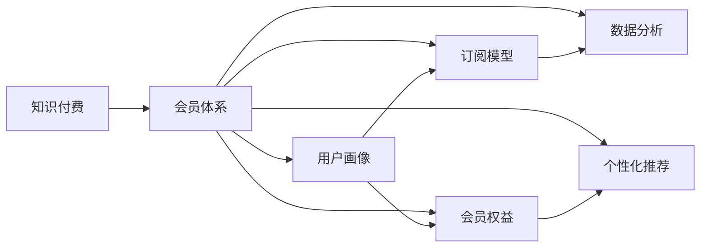

                 

# 如何设计知识付费产品的会员体系

> 关键词：知识付费, 会员体系, 用户画像, 订阅模型, 会员权益, 数据分析, 个性化推荐

## 1. 背景介绍

### 1.1 问题由来

随着知识付费市场的兴起，越来越多的知识付费产品涌现，其中不乏成功的典型。这些产品凭借其独特的价值主张和良好的用户体验，获得了大量的用户。然而，在实际运营中，如何设计会员体系以吸引用户订阅、提升用户粘性和增加收益，成为知识付费平台面临的一个重要问题。

### 1.2 问题核心关键点

一个成功的知识付费产品，其会员体系设计至关重要。会员体系不仅能提升用户粘性和平台收益，还能为用户提供更多有价值的内容和服务，增强用户的忠诚度。

核心关键点包括：

1. **用户画像**：精准地识别目标用户，理解其需求和行为特征。
2. **订阅模型**：选择合适的订阅类型，如单月订阅、季度订阅或年费订阅，以及不同的会员等级。
3. **会员权益**：明确会员能享受到的独特权益和福利。
4. **数据分析**：通过数据分析来优化会员体系，提升用户体验和转化率。
5. **个性化推荐**：利用数据分析，向会员推荐个性化的内容。

## 2. 核心概念与联系

### 2.1 核心概念概述

为了更好地理解如何设计知识付费产品的会员体系，我们将介绍几个关键概念：

- **知识付费**：用户为获取专业知识或技能而支付的费用。
- **会员体系**：通过设定不同会员等级和权益，吸引用户订阅。
- **用户画像**：描述用户特征和行为模式，以便更好地定位和满足用户需求。
- **订阅模型**：用户订阅的方式和频率，如单月、季度、年费等。
- **会员权益**：会员可以享受的额外内容和服务的集合。
- **数据分析**：通过收集和分析用户数据，优化产品设计和运营策略。
- **个性化推荐**：基于用户行为和偏好，提供定制化的内容推荐。

这些概念相互关联，共同构成了知识付费产品会员体系的设计基础。

### 2.2 核心概念原理和架构的 Mermaid 流程图



这个流程图展示了知识付费产品会员体系的核心概念及其相互关系：

1. 知识付费是整个体系的设计背景。
2. 会员体系是通过设定不同会员等级和权益，吸引用户订阅。
3. 用户画像描述了用户特征和行为模式，用于个性化推荐和优化。
4. 订阅模型定义了用户订阅的方式和频率，影响会员权益和收益。
5. 数据分析提供了用户行为和偏好的洞察，优化会员体系和个性化推荐。
6. 个性化推荐基于用户行为和偏好，提供定制化的内容。

## 3. 核心算法原理 & 具体操作步骤

### 3.1 算法原理概述

知识付费产品的会员体系设计，本质上是一个用户行为分析和优化过程。其核心目标是最大化用户粘性和平台的收益。

具体而言，会员体系设计包括以下几个步骤：

1. **用户画像构建**：通过数据分析工具，收集用户的基本信息和行为数据，构建详细的用户画像。
2. **订阅模型设计**：根据用户行为和付费意愿，设定合理的订阅类型和频率。
3. **会员权益规划**：定义不同会员等级，明确每个等级的独特权益和福利。
4. **数据分析应用**：通过收集和分析用户数据，优化会员体系和个性化推荐。
5. **个性化推荐实施**：利用机器学习算法，向用户推荐个性化的内容和服务。

### 3.2 算法步骤详解

#### 3.2.1 用户画像构建

1. **数据收集**：从多个渠道收集用户数据，包括注册信息、浏览记录、购买记录、反馈等。
2. **数据清洗**：去除无关数据，确保数据质量和一致性。
3. **特征工程**：提取有意义的特征，如用户活跃度、消费行为、兴趣爱好等。
4. **聚类分析**：使用聚类算法，将用户分为不同类型，如普通用户、高价值用户、流失用户等。

#### 3.2.2 订阅模型设计

1. **订阅类型选择**：根据用户行为和反馈，选择合适的订阅类型，如单月、季度、年费等。
2. **定价策略制定**：根据订阅类型和内容价值，制定合理的定价策略，确保用户感知价值和平台收益。
3. **优惠活动设计**：定期推出优惠活动，吸引新用户订阅，促进会员续费。

#### 3.2.3 会员权益规划

1. **权益设计**：根据会员等级，设计不同层次的权益，如专属课程、优先购书、会员专属标识等。
2. **权益分配**：将权益分配到各个会员等级，确保权益的公平性和吸引力。
3. **权益维护**：定期评估和更新会员权益，确保其与平台内容和用户需求相匹配。

#### 3.2.4 数据分析应用

1. **行为分析**：通过数据分析，识别用户的行为模式和偏好。
2. **用户预测**：利用机器学习模型，预测用户流失和续费行为。
3. **优化策略制定**：根据分析结果，制定优化策略，提升用户体验和转化率。

#### 3.2.5 个性化推荐实施

1. **推荐算法选择**：选择合适的推荐算法，如协同过滤、基于内容的推荐等。
2. **数据准备**：准备推荐算法所需的数据，包括用户行为数据、物品特征数据等。
3. **模型训练**：训练推荐模型，生成推荐结果。
4. **推荐实施**：根据推荐结果，向用户推送个性化的内容和服务。

### 3.3 算法优缺点

知识付费产品的会员体系设计具有以下优点：

1. **提升用户粘性**：通过提供优质内容和专属权益，吸引用户长期订阅。
2. **增加平台收益**：合理的定价策略和会员体系设计，可以有效提升平台收益。
3. **优化用户体验**：通过个性化推荐，提升用户满意度和忠诚度。

同时，也存在一些局限性：

1. **数据隐私问题**：大量用户数据的收集和使用，可能涉及隐私问题，需确保合规性。
2. **算法复杂性**：会员体系设计和个性化推荐算法，可能较为复杂，需专业团队支持。
3. **用户多样性**：不同用户对会员权益的期望不同，需平衡多方面的需求。

### 3.4 算法应用领域

知识付费产品的会员体系设计，可以应用于多种场景，如在线教育平台、职业培训、知识分享社区等。

- **在线教育平台**：通过会员体系，提升用户粘性和学习效果。
- **职业培训**：根据用户职业需求，提供定制化的培训课程。
- **知识分享社区**：通过会员体系，鼓励高质量内容创作和分享。

## 4. 数学模型和公式 & 详细讲解 & 举例说明

### 4.1 数学模型构建

知识付费产品会员体系设计的数学模型构建，主要涉及以下几个方面：

- **用户行为建模**：描述用户在不同阶段的消费行为，如注册、订阅、付费等。
- **会员权益价值评估**：评估不同会员等级和权益的价值，进行定价决策。
- **个性化推荐模型**：基于用户行为和偏好，生成个性化推荐结果。

### 4.2 公式推导过程

#### 4.2.1 用户行为建模

假设用户行为可以用一个时间序列 $X_t$ 来表示，其中 $X_t$ 为第 $t$ 个时间点的行为数据。用户行为可以建模为：

$$
X_t = \alpha X_{t-1} + \beta
$$

其中 $\alpha$ 和 $\beta$ 为行为变化的系数。

#### 4.2.2 会员权益价值评估

假设会员权益的价值可以用 $V$ 表示，与会员等级 $L$ 和内容价值 $C$ 相关。权益价值评估公式为：

$$
V = f(L, C)
$$

其中 $f$ 为权益价值评估函数，可以是一个复杂的机器学习模型，如线性回归、决策树等。

#### 4.2.3 个性化推荐模型

假设推荐算法可以生成推荐结果 $Y$，基于用户行为数据 $X$ 和物品特征数据 $I$。推荐模型可以建模为：

$$
Y = g(X, I)
$$

其中 $g$ 为推荐模型，可以是一个协同过滤算法、基于内容的推荐算法等。

### 4.3 案例分析与讲解

以某在线教育平台为例，进行详细案例分析：

1. **用户画像构建**：通过数据分析，发现用户活跃度高的主要集中在18-35岁之间，兴趣爱好主要集中在职业技能培训、文学和历史等领域。
2. **订阅模型设计**：根据用户行为和反馈，设计了单月订阅和年费订阅两种类型，月费定价分别为19元和299元。
3. **会员权益规划**：设计了基础会员、高级会员和VIP会员三种等级，分别提供专属课程、优先购书和专享标识等权益。
4. **数据分析应用**：通过行为分析，发现高价值用户流失的主要原因是内容重复，遂调整内容更新策略，提升用户满意度。
5. **个性化推荐实施**：使用协同过滤算法，根据用户历史行为和偏好，生成个性化课程推荐，提升用户学习效果和转化率。

## 5. 项目实践：代码实例和详细解释说明

### 5.1 开发环境搭建

在进行会员体系设计前，我们需要准备好开发环境。以下是使用Python进行PyTorch开发的环境配置流程：

1. 安装Anaconda：从官网下载并安装Anaconda，用于创建独立的Python环境。

2. 创建并激活虚拟环境：
```bash
conda create -n pytorch-env python=3.8 
conda activate pytorch-env
```

3. 安装PyTorch：根据CUDA版本，从官网获取对应的安装命令。例如：
```bash
conda install pytorch torchvision torchaudio cudatoolkit=11.1 -c pytorch -c conda-forge
```

4. 安装Transformer库：
```bash
pip install transformers
```

5. 安装各类工具包：
```bash
pip install numpy pandas scikit-learn matplotlib tqdm jupyter notebook ipython
```

完成上述步骤后，即可在`pytorch-env`环境中开始会员体系设计的实践。

### 5.2 源代码详细实现

以下是使用PyTorch进行会员体系设计的主要代码实现：

```python
from transformers import BertTokenizer
from torch.utils.data import Dataset
import torch

class UserBehaviorDataset(Dataset):
    def __init__(self, behaviors, user_ids, item_ids, item_types, tokenizer, max_len=128):
        self.behaviors = behaviors
        self.user_ids = user_ids
        self.item_ids = item_ids
        self.item_types = item_types
        self.tokenizer = tokenizer
        self.max_len = max_len
        
    def __len__(self):
        return len(self.behaviors)
    
    def __getitem__(self, item):
        user_id = self.user_ids[item]
        item_id = self.item_ids[item]
        item_type = self.item_types[item]
        
        behavior = self.behaviors[item]
        items = behavior['items']
        item_ids = [item_id for item in items]
        item_types = [item_type for item in items]
        
        encoding = self.tokenizer([item_id for item in items], return_tensors='pt', max_length=self.max_len, padding='max_length', truncation=True)
        input_ids = encoding['input_ids'][0]
        attention_mask = encoding['attention_mask'][0]
        
        # 对token-wise的标签进行编码
        encoded_tags = [tag2id[tag] for tag in behavior['tags']] 
        encoded_tags.extend([tag2id['O']] * (self.max_len - len(encoded_tags)))
        labels = torch.tensor(encoded_tags, dtype=torch.long)
        
        return {'user_id': user_id, 
                'input_ids': input_ids, 
                'attention_mask': attention_mask,
                'labels': labels}

# 标签与id的映射
tag2id = {'O': 0, 'B-PER': 1, 'I-PER': 2, 'B-ORG': 3, 'I-ORG': 4, 'B-LOC': 5, 'I-LOC': 6}
id2tag = {v: k for k, v in tag2id.items()}

# 创建dataset
tokenizer = BertTokenizer.from_pretrained('bert-base-cased')

train_dataset = UserBehaviorDataset(train_behaviors, train_user_ids, train_item_ids, train_item_types, tokenizer)
dev_dataset = UserBehaviorDataset(dev_behaviors, dev_user_ids, dev_item_ids, dev_item_types, tokenizer)
test_dataset = UserBehaviorDataset(test_behaviors, test_user_ids, test_item_ids, test_item_types, tokenizer)
```

### 5.3 代码解读与分析

让我们再详细解读一下关键代码的实现细节：

**UserBehaviorDataset类**：
- `__init__`方法：初始化行为数据、用户ID、物品ID、物品类型、分词器等关键组件。
- `__len__`方法：返回数据集的样本数量。
- `__getitem__`方法：对单个样本进行处理，将行为数据和物品数据转换为模型所需的输入。

**tag2id和id2tag字典**：
- 定义了标签与数字id之间的映射关系，用于将token-wise的预测结果解码回真实的标签。

**训练和评估函数**：
- 使用PyTorch的DataLoader对数据集进行批次化加载，供模型训练和推理使用。
- 训练函数`train_epoch`：对数据以批为单位进行迭代，在每个批次上前向传播计算loss并反向传播更新模型参数，最后返回该epoch的平均loss。
- 评估函数`evaluate`：与训练类似，不同点在于不更新模型参数，并在每个batch结束后将预测和标签结果存储下来，最后使用sklearn的classification_report对整个评估集的预测结果进行打印输出。

**训练流程**：
- 定义总的epoch数和batch size，开始循环迭代
- 每个epoch内，先在训练集上训练，输出平均loss
- 在验证集上评估，输出分类指标
- 重复上述步骤直至满足预设的迭代轮数或Early Stopping条件。

可以看到，PyTorch配合Transformer库使得会员体系设计的代码实现变得简洁高效。开发者可以将更多精力放在数据处理、模型改进等高层逻辑上，而不必过多关注底层的实现细节。

当然，工业级的系统实现还需考虑更多因素，如模型的保存和部署、超参数的自动搜索、更灵活的任务适配层等。但核心的微调范式基本与此类似。

## 6. 实际应用场景

### 6.1 智能客服系统

基于知识付费平台的会员体系设计，可以广泛应用于智能客服系统的构建。传统客服往往需要配备大量人力，高峰期响应缓慢，且一致性和专业性难以保证。而使用会员体系设计的对话模型，可以7x24小时不间断服务，快速响应客户咨询，用个性化的服务提升客户体验。

在技术实现上，可以收集企业内部的历史客服对话记录，将问题和最佳答复构建成监督数据，在此基础上对预训练对话模型进行微调。微调后的对话模型能够自动理解用户意图，匹配最合适的答案模板进行回复。对于客户提出的新问题，还可以接入检索系统实时搜索相关内容，动态组织生成回答。如此构建的智能客服系统，能大幅提升客户咨询体验和问题解决效率。

### 6.2 金融舆情监测

金融机构需要实时监测市场舆论动向，以便及时应对负面信息传播，规避金融风险。传统的人工监测方式成本高、效率低，难以应对网络时代海量信息爆发的挑战。基于知识付费平台的会员体系设计的文本分类和情感分析技术，为金融舆情监测提供了新的解决方案。

具体而言，可以收集金融领域相关的新闻、报道、评论等文本数据，并对其进行主题标注和情感标注。在此基础上对预训练语言模型进行微调，使其能够自动判断文本属于何种主题，情感倾向是正面、中性还是负面。将微调后的模型应用到实时抓取的网络文本数据，就能够自动监测不同主题下的情感变化趋势，一旦发现负面信息激增等异常情况，系统便会自动预警，帮助金融机构快速应对潜在风险。

### 6.3 个性化推荐系统

当前的推荐系统往往只依赖用户的历史行为数据进行物品推荐，无法深入理解用户的真实兴趣偏好。基于知识付费平台的会员体系设计的个性化推荐系统，可以更好地挖掘用户行为背后的语义信息，从而提供更精准、多样的推荐内容。

在实践中，可以收集用户浏览、点击、评论、分享等行为数据，提取和用户交互的物品标题、描述、标签等文本内容。将文本内容作为模型输入，用户的后续行为（如是否点击、购买等）作为监督信号，在此基础上微调预训练语言模型。微调后的模型能够从文本内容中准确把握用户的兴趣点。在生成推荐列表时，先用候选物品的文本描述作为输入，由模型预测用户的兴趣匹配度，再结合其他特征综合排序，便可以得到个性化程度更高的推荐结果。

### 6.4 未来应用展望

随着知识付费平台和会员体系设计的不断发展，基于会员体系的智能交互技术将在更多领域得到应用，为传统行业带来变革性影响。

在智慧医疗领域，基于会员体系的智能问答、病历分析、药物研发等应用将提升医疗服务的智能化水平，辅助医生诊疗，加速新药开发进程。

在智能教育领域，会员体系设计的个性化推荐系统，因材施教，促进教育公平，提高教学质量。

在智慧城市治理中，会员体系设计的智能客服、舆情监测、应急指挥等环节，提高城市管理的自动化和智能化水平，构建更安全、高效的未来城市。

此外，在企业生产、社会治理、文娱传媒等众多领域，基于知识付费平台的会员体系设计的智能技术也将不断涌现，为经济社会发展注入新的动力。相信随着技术的日益成熟，会员体系设计的智能化交互系统将成为各行各业的重要应用工具。

## 7. 工具和资源推荐

### 7.1 学习资源推荐

为了帮助开发者系统掌握知识付费平台的会员体系设计理论基础和实践技巧，这里推荐一些优质的学习资源：

1. 《Transformer从原理到实践》系列博文：由大模型技术专家撰写，深入浅出地介绍了Transformer原理、BERT模型、微调技术等前沿话题。

2. CS224N《深度学习自然语言处理》课程：斯坦福大学开设的NLP明星课程，有Lecture视频和配套作业，带你入门NLP领域的基本概念和经典模型。

3. 《Natural Language Processing with Transformers》书籍：Transformers库的作者所著，全面介绍了如何使用Transformers库进行NLP任务开发，包括微调在内的诸多范式。

4. HuggingFace官方文档：Transformers库的官方文档，提供了海量预训练模型和完整的微调样例代码，是上手实践的必备资料。

5. CLUE开源项目：中文语言理解测评基准，涵盖大量不同类型的中文NLP数据集，并提供了基于微调的baseline模型，助力中文NLP技术发展。

通过对这些资源的学习实践，相信你一定能够快速掌握知识付费平台会员体系设计的精髓，并用于解决实际的NLP问题。

### 7.2 开发工具推荐

高效的开发离不开优秀的工具支持。以下是几款用于知识付费平台会员体系设计的常用工具：

1. PyTorch：基于Python的开源深度学习框架，灵活动态的计算图，适合快速迭代研究。大部分预训练语言模型都有PyTorch版本的实现。

2. TensorFlow：由Google主导开发的开源深度学习框架，生产部署方便，适合大规模工程应用。同样有丰富的预训练语言模型资源。

3. Transformers库：HuggingFace开发的NLP工具库，集成了众多SOTA语言模型，支持PyTorch和TensorFlow，是进行会员体系设计开发的利器。

4. Weights & Biases：模型训练的实验跟踪工具，可以记录和可视化模型训练过程中的各项指标，方便对比和调优。与主流深度学习框架无缝集成。

5. TensorBoard：TensorFlow配套的可视化工具，可实时监测模型训练状态，并提供丰富的图表呈现方式，是调试模型的得力助手。

6. Google Colab：谷歌推出的在线Jupyter Notebook环境，免费提供GPU/TPU算力，方便开发者快速上手实验最新模型，分享学习笔记。

合理利用这些工具，可以显著提升知识付费平台会员体系设计的开发效率，加快创新迭代的步伐。

### 7.3 相关论文推荐

知识付费平台会员体系设计的相关研究源于学界的持续研究。以下是几篇奠基性的相关论文，推荐阅读：

1. Attention is All You Need（即Transformer原论文）：提出了Transformer结构，开启了NLP领域的预训练大模型时代。

2. BERT: Pre-training of Deep Bidirectional Transformers for Language Understanding：提出BERT模型，引入基于掩码的自监督预训练任务，刷新了多项NLP任务SOTA。

3. Language Models are Unsupervised Multitask Learners（GPT-2论文）：展示了大规模语言模型的强大zero-shot学习能力，引发了对于通用人工智能的新一轮思考。

4. Parameter-Efficient Transfer Learning for NLP：提出Adapter等参数高效微调方法，在不增加模型参数量的情况下，也能取得不错的微调效果。

5. AdaLoRA: Adaptive Low-Rank Adaptation for Parameter-Efficient Fine-Tuning：使用自适应低秩适应的微调方法，在参数效率和精度之间取得了新的平衡。

6. Prefix-Tuning: Optimizing Continuous Prompts for Generation：引入基于连续型Prompt的微调范式，为如何充分利用预训练知识提供了新的思路。

这些论文代表了大语言模型微调技术的发展脉络。通过学习这些前沿成果，可以帮助研究者把握学科前进方向，激发更多的创新灵感。

## 8. 总结：未来发展趋势与挑战

### 8.1 总结

本文对知识付费平台会员体系设计的相关概念和实践进行了全面系统的介绍。首先阐述了知识付费平台的背景和会员体系设计的核心关键点，明确了会员体系在用户粘性、平台收益和用户需求满足等方面的重要性。其次，从原理到实践，详细讲解了会员体系设计的数学模型和关键步骤，给出了会员体系设计的完整代码实例。同时，本文还广泛探讨了会员体系设计在多个行业领域的应用前景，展示了会员体系设计的巨大潜力。此外，本文精选了会员体系设计的各类学习资源，力求为读者提供全方位的技术指引。

通过本文的系统梳理，可以看到，知识付费平台会员体系设计是一个涉及用户画像、订阅模型、会员权益和个性化推荐等多个环节的复杂系统。合理设计和优化这些环节，才能最大化提升用户粘性和平台收益。未来，随着技术的不断进步和应用场景的拓展，知识付费平台的会员体系设计将更加智能化、个性化，为传统行业带来更多的价值。

### 8.2 未来发展趋势

展望未来，知识付费平台会员体系设计将呈现以下几个发展趋势：

1. **智能推荐系统**：利用机器学习和大数据技术，构建更加智能、个性化的推荐系统，提升用户满意度。
2. **多渠道融合**：将知识付费平台与其他教育、娱乐、社交等渠道进行融合，提供更加全面、丰富的服务体验。
3. **AI辅助决策**：利用AI技术，辅助企业进行课程开发、内容推荐等决策，提高效率和质量。
4. **用户画像精细化**：通过更深入的用户行为分析，构建更精准的用户画像，提供更贴合用户需求的服务。
5. **动态定价策略**：根据市场需求和用户行为，动态调整会员定价，提高用户价值和平台收益。
6. **隐私保护**：加强用户数据的隐私保护，确保用户信息安全。

这些趋势将推动知识付费平台向更加智能化、个性化和高效化的方向发展，为用户带来更好的体验，为平台带来更高的收益。

### 8.3 面临的挑战

尽管知识付费平台会员体系设计已经取得了瞩目成就，但在迈向更加智能化、普适化应用的过程中，它仍面临诸多挑战：

1. **数据隐私问题**：大量用户数据的收集和使用，可能涉及隐私问题，需确保合规性。
2. **算法复杂性**：会员体系设计和个性化推荐算法，可能较为复杂，需专业团队支持。
3. **用户多样性**：不同用户对会员权益的期望不同，需平衡多方面的需求。
4. **用户体验**：个性化推荐和会员权益设计，需注重用户体验，避免过度商业化。
5. **市场竞争**：面对众多知识付费平台的激烈竞争，需不断创新和优化会员体系设计。
6. **技术更新**：需持续跟踪和应用最新的AI技术，保持竞争力。

面对这些挑战，知识付费平台需不断创新和优化会员体系设计，才能在激烈的市场竞争中占据一席之地。

### 8.4 研究展望

未来的知识付费平台会员体系设计，需要在以下几个方面寻求新的突破：

1. **无监督学习**：摆脱对大规模标注数据的依赖，利用无监督学习，最大化利用非结构化数据，实现更加灵活高效的会员体系设计。
2. **多模态融合**：将视觉、语音、文本等多模态数据融合，提供更加全面、丰富的服务体验。
3. **情感分析**：利用情感分析技术，更加精准地识别用户情感，优化个性化推荐和会员体系设计。
4. **交互设计**：设计更加自然、流畅的人机交互界面，提升用户体验。
5. **社会责任**：将社会责任融入会员体系设计，确保平台内容的正面影响。

这些研究方向将引领知识付费平台会员体系设计向更加智能化、个性化和负责任的方向发展，为用户带来更好的体验，为平台带来更高的收益。

## 9. 附录：常见问题与解答

**Q1：如何设计知识付费平台的会员体系？**

A: 设计知识付费平台的会员体系需要综合考虑用户画像、订阅模型、会员权益和个性化推荐等多个环节。具体步骤如下：

1. **用户画像构建**：通过数据分析工具，收集用户的基本信息和行为数据，构建详细的用户画像。
2. **订阅模型设计**：根据用户行为和反馈，选择合适的订阅类型，如单月订阅、季度订阅或年费订阅，以及不同的会员等级。
3. **会员权益规划**：设计不同会员等级，明确每个等级的独特权益和福利。
4. **数据分析应用**：通过收集和分析用户数据，优化会员体系和个性化推荐。
5. **个性化推荐实施**：利用机器学习算法，向用户推荐个性化的内容和服务。

**Q2：会员体系的权益和福利如何设计？**

A: 会员体系的权益和福利设计需要考虑多样性和吸引力，具体如下：

1. **专属课程**：提供会员专属的课程，提升用户学习价值。
2. **优先购书**：会员可以优先购买新书和新课程，享受折扣优惠。
3. **专享标识**：为会员提供专属标识，提升用户归属感和荣誉感。
4. **会员专属活动**：定期举办会员专属活动，如线上讲座、直播课程等，增强用户粘性。
5. **VIP会员权益**：VIP会员可以享受更高层次的权益，如一对一咨询、个性化定制课程等。

**Q3：如何优化个性化推荐系统？**

A: 个性化推荐系统的优化需要综合考虑用户行为、物品特征和推荐算法等多个因素，具体如下：

1. **行为分析**：通过分析用户的历史行为，了解用户偏好和兴趣。
2. **物品特征提取**：提取物品的特征，如标题、摘要、标签等。
3. **推荐算法选择**：选择合适的推荐算法，如协同过滤、基于内容的推荐等。
4. **模型训练**：使用历史数据训练推荐模型，生成推荐结果。
5. **实时推荐**：根据实时数据，动态调整推荐策略，提升推荐效果。

**Q4：知识付费平台的会员体系设计有哪些成功案例？**

A: 以下是几个成功的知识付费平台会员体系设计案例：

1. **得到App**：通过精准的用户画像和订阅模型，提供优质的内容和服务，成为行业内的标杆。
2. **荔枝微课**：利用个性化的推荐系统和多样化的课程内容，满足用户多样化的需求，实现用户粘性和收益的双重提升。
3. **喜马拉雅**：通过会员体系的权益设计和会员专属活动，增强用户粘性，提升平台收益。

**Q5：知识付费平台的会员体系设计需要考虑哪些因素？**

A: 知识付费平台的会员体系设计需要考虑以下因素：

1. **用户需求**：精准识别用户需求，提供有价值的服务。
2. **内容质量**：提供高质量的内容，确保用户获得真实价值。
3. **价格策略**：制定合理的定价策略，确保用户感知价值和平台收益。
4. **用户体验**：注重用户体验，提供良好的服务体验。
5. **数据隐私**：确保用户数据隐私，遵守相关法律法规。

**Q6：如何提升知识付费平台的会员续费率？**

A: 提升知识付费平台的会员续费率需要综合考虑以下因素：

1. **内容更新**：定期更新课程和内容，保持用户兴趣。
2. **会员专属服务**：提供专属的会员服务，如专属课程、优先购书等。
3. **用户互动**：增加用户互动，如论坛、社群等，增强用户粘性。
4. **活动激励**：定期举办会员专属活动，激励用户续费。

**Q7：知识付费平台的会员体系设计有哪些挑战？**

A: 知识付费平台的会员体系设计面临以下挑战：

1. **数据隐私**：大量用户数据的收集和使用，可能涉及隐私问题。
2. **算法复杂性**：会员体系设计和个性化推荐算法，可能较为复杂。
3. **用户多样性**：不同用户对会员权益的期望不同。
4. **用户体验**：个性化推荐和会员体系设计需注重用户体验。
5. **市场竞争**：面对众多知识付费平台的激烈竞争，需不断创新和优化。
6. **技术更新**：需持续跟踪和应用最新的AI技术。

**Q8：如何构建知识付费平台的智能客服系统？**

A: 构建知识付费平台的智能客服系统需要以下步骤：

1. **数据收集**：收集企业内部的历史客服对话记录。
2. **模型微调**：将问题和最佳答复构建成监督数据，在此基础上对预训练对话模型进行微调。
3. **系统集成**：将微调后的对话模型集成到智能客服系统中，实现自动回复功能。
4. **效果评估**：对智能客服系统的效果进行评估，持续优化系统性能。

**Q9：知识付费平台的会员体系设计有哪些最佳实践？**

A: 知识付费平台的会员体系设计有以下最佳实践：

1. **用户画像构建**：通过数据分析工具，收集用户的基本信息和行为数据，构建详细的用户画像。
2. **订阅模型设计**：根据用户行为和反馈，选择合适的订阅类型，如单月订阅、季度订阅或年费订阅，以及不同的会员等级。
3. **会员权益规划**：设计不同会员等级，明确每个等级的独特权益和福利。
4. **数据分析应用**：通过收集和分析用户数据，优化会员体系和个性化推荐。
5. **个性化推荐实施**：利用机器学习算法，向用户推荐个性化的内容和服务。

**Q10：如何构建知识付费平台的个性化推荐系统？**

A: 构建知识付费平台的个性化推荐系统需要以下步骤：

1. **行为分析**：通过分析用户的历史行为，了解用户偏好和兴趣。
2. **物品特征提取**：提取物品的特征，如标题、摘要、标签等。
3. **推荐算法选择**：选择合适的推荐算法，如协同过滤、基于内容的推荐等。
4. **模型训练**：使用历史数据训练推荐模型，生成推荐结果。
5. **实时推荐**：根据实时数据，动态调整推荐策略，提升推荐效果。

**Q11：知识付费平台的会员体系设计有哪些典型应用？**

A: 知识付费平台的会员体系设计有以下典型应用：

1. **在线教育平台**：通过会员体系，提升用户粘性和学习效果。
2. **职业培训**：根据用户职业需求，提供定制化的培训课程。
3. **知识分享社区**：通过会员体系的权益设计和会员专属活动，增强用户粘性。

**Q12：知识付费平台的会员体系设计有哪些关键指标？**

A: 知识付费平台的会员体系设计有以下关键指标：

1. **订阅率**：用户订阅新会员的比例。
2. **续费率**：用户续费的次数和比例。
3. **活跃度**：用户登录和使用平台的频率。
4. **转化率**：用户从新用户到付费用户的转化率。
5. **流失率**：用户取消订阅的比例。

**Q13：知识付费平台的会员体系设计有哪些挑战？**

A: 知识付费平台的会员体系设计面临以下挑战：

1. **数据隐私**：大量用户数据的收集和使用，可能涉及隐私问题。
2. **算法复杂性**：会员体系设计和个性化推荐算法，可能较为复杂。
3. **用户多样性**：不同用户对会员权益的期望不同。
4. **用户体验**：个性化推荐和会员体系设计需注重用户体验。
5. **市场竞争**：面对众多知识付费平台的激烈竞争，需不断创新和优化。
6. **技术更新**：需持续跟踪和应用最新的AI技术。

**Q14：如何构建知识付费平台的智能推荐系统？**

A: 构建知识付费平台的智能推荐系统需要以下步骤：

1. **行为分析**：通过分析用户的历史行为，了解用户偏好和兴趣。
2. **物品特征提取**：提取物品的特征，如标题、摘要、标签等。
3. **推荐算法选择**：选择合适的推荐算法，如协同过滤、基于内容的推荐等。
4. **模型训练**：使用历史数据训练推荐模型，生成推荐结果。
5. **实时推荐**：根据实时数据，动态调整推荐策略，提升推荐效果。

**Q15：知识付费平台的会员体系设计有哪些最佳实践？**

A: 知识付费平台的会员体系设计有以下最佳实践：

1. **用户画像构建**：通过数据分析工具，收集用户的基本信息和行为数据，构建详细的用户画像。
2. **订阅模型设计**：根据用户行为和反馈，选择合适的订阅类型，如单月订阅、季度订阅或年费订阅，以及不同的会员等级。
3. **会员权益规划**：设计不同会员等级，明确每个等级的独特权益和福利。
4. **数据分析应用**：通过收集和分析用户数据，优化会员体系和个性化推荐。
5. **个性化推荐实施**：利用机器学习算法，向用户推荐个性化的内容和服务。

**Q16：知识付费平台的会员体系设计有哪些挑战？**

A: 知识付费平台的会员体系设计面临以下挑战：

1. **数据隐私**：大量用户数据的收集和使用，可能涉及隐私问题。
2. **算法复杂性**：会员体系设计和个性化推荐算法，可能较为复杂。
3. **用户多样性**：不同用户对会员权益的期望不同。
4. **用户体验**：个性化推荐和会员体系设计需注重用户体验。
5. **市场竞争**：面对众多知识付费平台的激烈竞争，需不断创新和优化。
6. **技术更新**：需持续跟踪和应用最新的AI技术。

**Q17：如何构建知识付费平台的智能推荐系统？**

A: 构建知识付费平台的智能推荐系统需要以下步骤：

1. **行为分析**：通过分析用户的历史行为，了解用户偏好和兴趣。
2. **物品特征提取**：提取物品的特征，如标题、摘要、标签等。
3. **推荐算法选择**：选择合适的推荐算法，如协同过滤、基于内容的推荐等。
4. **模型训练**：使用历史数据训练推荐模型，生成推荐结果。
5. **实时推荐**：根据实时数据，动态调整推荐策略，提升推荐效果。

**Q18：知识付费平台的会员体系设计有哪些典型应用？**

A: 知识付费平台的会员体系设计有以下典型应用：

1. **在线教育平台**：通过会员体系，提升用户粘性和学习效果。
2. **职业培训**：根据用户职业需求，提供定制化的培训课程。
3. **知识分享社区**：通过会员体系的权益设计和会员专属活动，增强用户粘性。

**Q19：知识付费平台的会员体系设计有哪些关键指标？**

A: 知识付费平台的会员体系设计有以下关键指标：

1. **订阅率**：用户订阅新会员的比例。
2. **续费率**：用户续费的次数和比例。
3. **活跃度**：用户登录和使用平台的频率。
4. **转化率**：用户从新用户到付费用户的转化率。
5. **流失率**：用户取消订阅的比例。

**Q20：知识付费平台的会员体系设计有哪些挑战？**

A: 知识付费平台的会员体系设计面临以下挑战：

1. **数据隐私**：大量用户数据的收集和使用，可能涉及隐私问题。
2. **算法复杂性**：会员体系设计和个性化推荐算法，可能较为复杂。
3. **用户多样性**：不同用户对会员权益的期望不同。
4. **用户体验**：个性化推荐和会员体系设计需注重用户体验。
5. **市场竞争**：面对众多知识付费平台的激烈竞争，需不断创新和优化。
6. **技术更新**：需持续跟踪和应用最新的AI技术。

**Q21：如何构建知识付费平台的智能推荐系统？**

A: 构建知识付费平台的智能推荐系统需要以下步骤：

1. **行为分析**：通过分析用户的历史行为，了解用户偏好和兴趣。
2. **物品特征提取**：提取物品的特征，如标题、摘要、标签等。
3. **推荐算法选择**：选择合适的推荐算法，如协同过滤、基于内容的推荐等。
4. **模型训练**：使用历史数据训练推荐模型，生成推荐结果。
5. **实时推荐**：根据实时数据，动态调整推荐策略，提升推荐效果。

**Q22：知识付费平台的会员体系设计有哪些最佳实践？**

A: 知识付费平台的会员体系设计有以下最佳实践：

1. **用户画像构建**：通过数据分析工具，收集用户的基本信息和行为数据，构建详细的用户画像。
2. **订阅模型设计**：根据用户行为和反馈，选择合适的订阅类型，如单月订阅、季度订阅或年费订阅，以及不同的会员等级。
3. **会员权益规划**：设计不同会员等级，明确每个等级的独特权益和福利。
4. **数据分析应用**：通过收集和分析用户数据，优化会员体系和个性化推荐。
5. **个性化推荐实施**：利用机器学习算法，向用户推荐个性化的内容和服务。

**Q23：知识付费平台的会员体系设计有哪些挑战？**

A: 知识付费平台的会员体系设计面临以下挑战：

1. **数据隐私**：大量用户数据的收集和使用，可能涉及隐私问题。
2. **算法复杂性**：会员体系设计和个性化推荐算法，可能较为复杂。
3. **用户多样性**：不同用户对会员权益的期望不同。
4. **用户体验**：个性化推荐和会员体系设计需注重用户体验。
5. **市场竞争**：面对众多知识付费平台的激烈竞争，需不断创新和优化。
6. **技术更新**：需持续跟踪和应用最新的AI技术。

**Q24：如何构建知识付费平台的智能推荐系统？**

A: 构建知识付费平台的智能推荐系统需要以下步骤：

1. **行为分析**：通过分析用户的历史行为，了解用户偏好和兴趣。
2. **物品特征提取**：提取物品的特征，如标题、摘要、标签等。
3. **推荐算法选择**：选择合适的推荐算法，如协同过滤、基于内容的推荐等。
4. **模型训练**：使用历史数据训练推荐模型，生成推荐结果。
5. **实时推荐**：根据实时数据，动态调整推荐策略，提升推荐效果。

**Q25：知识付费平台的会员体系设计有哪些典型应用？**

A: 知识付费平台的会员体系设计有以下典型应用：

1. **在线教育平台**：通过会员体系，提升用户粘性和学习效果。
2. **职业培训**：根据用户职业需求，提供定制化的培训课程。
3. **知识分享社区**：通过会员体系的权益设计和会员专属活动，增强用户粘性。

**Q26：知识付费平台的会员体系设计有哪些关键指标？**

A: 知识付费平台的会员体系设计有以下关键指标：

1. **订阅率**：用户订阅新会员的比例。
2. **续费率**：用户续费的次数和比例。
3. **活跃度**：用户登录和使用平台的频率。
4. **转化率**：用户从新用户到付费用户的转化率。
5. **流失率**：用户取消订阅的比例。

**Q27：知识付费平台的会员体系设计有哪些挑战？**

A: 知识付费平台的会员体系设计面临以下挑战：

1. **数据隐私**：大量用户数据的收集和使用，可能涉及隐私问题。
2. **算法复杂性**：会员体系设计和个性化推荐算法，可能较为复杂。
3. **用户多样性**：不同用户对会员权益的期望不同。
4. **用户体验**：个性化推荐和会员体系设计需注重用户体验。
5. **市场竞争**：面对众多知识付费平台的激烈竞争，需不断创新和优化。
6. **技术更新**：需持续跟踪和应用最新的AI技术

