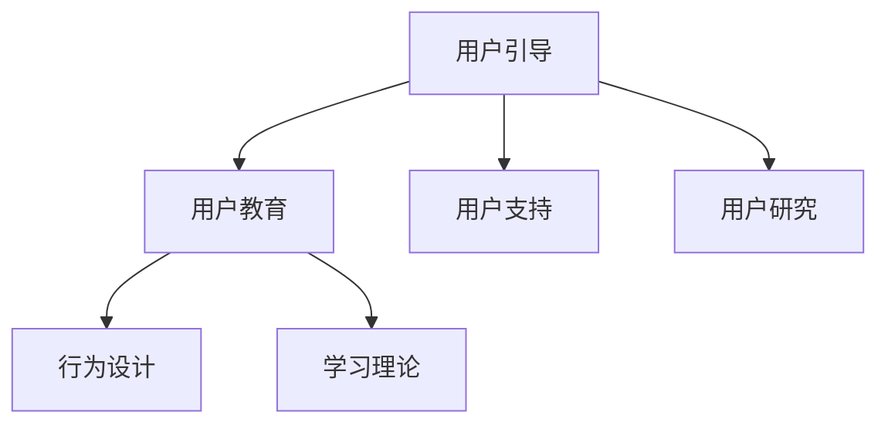

                 

# 如何进行有效的用户引导和教育

## 1. 背景介绍

### 1.1 问题由来

在当今数字化和信息化的社会中，用户引导和教育变得尤为重要。随着技术的快速发展，各种新兴应用、工具和服务的复杂性日益增加，许多用户对如何有效使用它们感到困惑。用户引导和教育不仅是提升用户体验的关键，也是推动技术普及和创新的重要手段。

### 1.2 问题核心关键点

有效用户引导和教育的核心关键点包括：
- **用户需求理解**：明确目标用户的需求、痛点和期望，确保教育内容贴合实际使用场景。
- **内容设计和呈现**：采用用户友好的方式设计和呈现教育内容，使其易于理解和接受。
- **互动与反馈**：通过互动和及时反馈，提升用户的学习效果和参与度。
- **个性化与适应性**：根据用户的学习进度和反馈，调整教育内容，提供个性化指导。
- **技术整合与集成**：将教育内容与实际应用工具和服务紧密结合，实现无缝集成。

## 2. 核心概念与联系

### 2.1 核心概念概述

为更好地理解如何进行有效的用户引导和教育，本节将介绍几个密切相关的核心概念：

- **用户引导(User Guidance)**：通过明确的步骤和指导，帮助用户理解和掌握新应用或服务的使用方法。
- **用户教育(User Education)**：通过系统化的知识传授和技能培训，提升用户对新工具或服务的理解与使用能力。
- **用户支持(User Support)**：在用户使用过程中提供即时帮助和解决问题，提升用户满意度和体验。
- **用户研究(User Research)**：通过调查、访谈等方式了解用户需求和行为，优化引导和教育内容。
- **行为设计(Designing Behavior)**：通过设计合理的交互流程和反馈机制，引导用户产生期望的行为。
- **学习理论(Theory of Learning)**：教育心理学、认知科学等领域的学习理论，指导教育内容的构建和用户学习过程的设计。

这些核心概念之间的逻辑关系可以通过以下Mermaid流程图来展示：



这个流程图展示了几大核心概念及其之间的关系：

1. **用户引导**是教育用户的基础，通过明确的步骤和指导帮助用户上手使用。
2. **用户教育**在用户引导的基础上，系统化地传授知识，提升用户的理解和操作能力。
3. **用户支持**在用户使用过程中提供即时帮助，解决用户遇到的问题，提升用户满意度。
4. **用户研究**通过调研和访谈了解用户需求，为引导和教育提供数据支持。
5. **行为设计**通过设计合理的交互流程和反馈机制，增强用户的学习效果和持续使用意愿。
6. **学习理论**为教育内容的设计和用户学习过程提供科学指导，确保教育内容的有效性。

## 3. 核心算法原理 & 具体操作步骤

### 3.1 算法原理概述

有效的用户引导和教育方法，本质上是一个系统化、迭代化的过程，需要结合用户研究、内容设计、交互设计、学习理论等多方面的知识。以下是该过程的核心算法原理：

1. **用户需求分析**：通过问卷调查、访谈等方式，深入了解用户需求、痛点和期望，确定教育内容的方向和重点。
2. **内容设计和开发**：根据用户需求，设计用户友好的教育内容，包括文本、视频、交互式教程等形式，确保内容易于理解和接受。
3. **互动与反馈机制**：在教育过程中引入互动和反馈机制，如小测验、问答、模拟操作等，及时评估用户的学习效果，并根据反馈调整内容。
4. **个性化与自适应**：根据用户的学习进度和表现，提供个性化的指导和调整教育内容，帮助用户更好地掌握知识和技能。
5. **技术整合与集成**：将教育内容与实际应用工具和服务紧密结合，实现无缝集成，提升用户的整体体验。

### 3.2 算法步骤详解

#### 3.2.1 用户需求分析

1. **调查与访谈**：通过问卷调查、深度访谈等方式，收集目标用户的需求、痛点和期望。
2. **数据分析**：对收集到的数据进行分析，识别共性需求和个性需求，确定教育内容的核心主题。
3. **优先级排序**：根据需求的重要性和紧急性，对教育内容进行优先级排序，确定教育内容的主要方向和重点。

#### 3.2.2 内容设计和开发

1. **内容规划**：根据用户需求和优先级排序，规划教育内容的主题和结构，确保内容的逻辑性和系统性。
2. **内容创作**：采用多样化的内容形式，如文本、视频、动画、交互式教程等，确保内容易于理解和接受。
3. **内容评估**：通过用户测试和反馈，评估教育内容的有效性和用户体验，不断优化和改进内容。

#### 3.2.3 互动与反馈机制

1. **互动设计**：在教育内容中引入互动元素，如小测验、问答、模拟操作等，提升用户的学习兴趣和参与度。
2. **反馈机制**：建立及时反馈机制，通过提示、提醒等方式，及时告知用户的学习进度和表现，并提供改进建议。
3. **数据分析**：通过数据分析工具，收集用户的学习数据和行为数据，评估学习效果，指导内容调整。

#### 3.2.4 个性化与自适应

1. **个性化推荐**：根据用户的学习进度和表现，推荐个性化的学习内容和资源，提供针对性的指导。
2. **自适应算法**：使用机器学习算法，分析用户的学习数据，动态调整教育内容的难度和形式，提升学习效果。

#### 3.2.5 技术整合与集成

1. **集成设计**：将教育内容与实际应用工具和服务紧密结合，设计无缝集成的用户体验。
2. **API集成**：通过API接口，实现教育内容与应用的动态交互，提升用户的学习效率。
3. **数据同步**：建立用户数据同步机制，确保教育内容和应用数据的同步更新，提升用户的学习体验。

### 3.3 算法优缺点

#### 3.3.1 优点

- **系统化设计**：结合用户研究、内容设计、学习理论等多方面知识，系统化设计教育过程，提升教育效果。
- **用户中心**：以用户需求和体验为中心，设计教育内容和交互流程，确保教育内容的实用性和用户友好性。
- **动态调整**：通过互动和反馈机制，实时调整教育内容，提升学习效果和用户参与度。
- **技术集成**：将教育内容与实际应用工具和服务紧密结合，提升用户的学习体验和满意度。

#### 3.3.2 缺点

- **资源需求高**：设计和开发高质量的教育内容需要大量时间和资源，可能面临成本和时间的压力。
- **复杂度高**：涉及多方面的知识和技能，设计和实现复杂度较高，需要跨学科团队合作。
- **用户多样性**：不同用户的需求和背景差异较大，需要定制化的教育内容和指导，增加设计和实施难度。

## 4. 数学模型和公式 & 详细讲解 & 举例说明

### 4.1 数学模型构建

用户引导和教育的数学模型可以通过以下公式表示：

$$
\text{Effectiveness} = f(\text{Content}, \text{Interactivity}, \text{Feedback}, \text{Personalization}, \text{Integration})
$$

其中：
- $\text{Content}$：教育内容的有效性和质量。
- $\text{Interactivity}$：互动机制的有效性和设计。
- $\text{Feedback}$：反馈机制的及时性和有效性。
- $\text{Personalization}$：个性化指导的有效性和个性化推荐的精准度。
- $\text{Integration}$：技术与应用的集成和同步。

### 4.2 公式推导过程

教育内容、互动机制、反馈机制、个性化指导和应用集成之间的关系可以通过以下公式推导：

1. **内容有效性和质量**：

$$
\text{Content} = \text{Relevance} + \text{Clarity} + \text{Comprehensiveness}
$$

其中：
- $\text{Relevance}$：内容的针对性和相关性。
- $\text{Clarity}$：内容的清晰度和易于理解性。
- $\text{Comprehensiveness}$：内容的全面性和系统性。

2. **互动机制有效性**：

$$
\text{Interactivity} = \text{Engagement} + \text{Interactivity Level} + \text{Usability}
$$

其中：
- $\text{Engagement}$：用户参与度和兴趣。
- $\text{Interactivity Level}$：互动的复杂度和挑战性。
- $\text{Usability}$：互动操作的便捷性和直观性。

3. **反馈机制及时性**：

$$
\text{Feedback} = \text{Timeliness} + \text{Accuracy} + \text{Actionability}
$$

其中：
- $\text{Timeliness}$：反馈的及时性和响应速度。
- $\text{Accuracy}$：反馈的准确性和可靠性。
- $\text{Actionability}$：反馈的可操作性和指导性。

4. **个性化指导精准度**：

$$
\text{Personalization} = \text{Recommendation Quality} + \text{Adaptability} + \text{User Engagement}
$$

其中：
- $\text{Recommendation Quality}$：个性化推荐的准确性和相关性。
- $\text{Adaptability}$：个性化指导的动态调整能力。
- $\text{User Engagement}$：个性化指导的用户参与度和满意度。

5. **应用集成效果**：

$$
\text{Integration} = \text{Seamlessness} + \text{Synchronization} + \text{User Experience}
$$

其中：
- $\text{Seamlessness}$：应用的集成无缝性和自然性。
- $\text{Synchronization}$：数据和内容的同步更新能力。
- $\text{User Experience}$：用户在使用过程中的整体体验和满意度。

### 4.3 案例分析与讲解

以在线学习平台为例，分析其如何结合用户需求、内容设计、互动和反馈机制、个性化指导和应用集成，提升用户学习效果和满意度。

1. **用户需求分析**：
   - 通过问卷调查和访谈，了解用户的学习目标、痛点和期望。
   - 分析用户的学习历史数据，识别常见问题和需求。

2. **内容设计和开发**：
   - 根据用户需求，设计系统化的课程内容和结构，确保内容的全面性和系统性。
   - 采用多样化的内容形式，如视频、动画、互动练习等，确保内容易于理解和接受。

3. **互动与反馈机制**：
   - 在课程中引入互动元素，如小测验、问答、模拟操作等，提升用户的学习兴趣和参与度。
   - 建立及时反馈机制，通过提示、提醒等方式，及时告知用户的学习进度和表现，并提供改进建议。

4. **个性化与自适应**：
   - 根据用户的学习进度和表现，推荐个性化的学习内容和资源，提供针对性的指导。
   - 使用机器学习算法，分析用户的学习数据，动态调整课程难度和形式，提升学习效果。

5. **技术整合与集成**：
   - 将课程内容与实际应用工具和服务紧密结合，设计无缝集成的用户体验。
   - 通过API接口，实现课程内容与应用的动态交互，提升用户的学习效率。

## 5. 项目实践：代码实例和详细解释说明

### 5.1 开发环境搭建

在进行用户引导和教育项目实践前，我们需要准备好开发环境。以下是使用Python进行Flask开发的环境配置流程：

1. 安装Anaconda：从官网下载并安装Anaconda，用于创建独立的Python环境。

2. 创建并激活虚拟环境：
```bash
conda create -n flask-env python=3.8 
conda activate flask-env
```

3. 安装Flask：
```bash
pip install Flask
```

4. 安装相关库：
```bash
pip install flask-login flask-wtf wtforms flask-sqlalchemy
```

完成上述步骤后，即可在`flask-env`环境中开始用户引导和教育项目的开发。

### 5.2 源代码详细实现

接下来，我们通过一个简单的在线学习平台项目，演示如何使用Flask框架实现用户引导和教育功能。

```python
from flask import Flask, render_template, redirect, request
from flask_login import LoginManager, UserMixin, login_user, login_required, logout_user
from flask_wtf import FlaskForm
from wtforms import StringField, PasswordField, SubmitField
from wtforms.validators import DataRequired, Length
from flask_sqlalchemy import SQLAlchemy

app = Flask(__name__)
app.config['SECRET_KEY'] = 'super secret key'
app.config['SQLALCHEMY_DATABASE_URI'] = 'sqlite:///users.db'
db = SQLAlchemy(app)
login_manager = LoginManager(app)
login_manager.login_view = 'login'

class User(UserMixin, db.Model):
    id = db.Column(db.Integer, primary_key=True)
    username = db.Column(db.String(20), unique=True, nullable=False)
    password = db.Column(db.String(60), nullable=False)

class LoginForm(FlaskForm):
    username = StringField('Username', validators=[DataRequired(), Length(min=2, max=20)])
    password = PasswordField('Password', validators=[DataRequired(), Length(min=6, max=60)])
    submit = SubmitField('Log In')

@app.route('/')
@login_required
def home():
    return 'Welcome to the Home Page'

@app.route('/login', methods=['GET', 'POST'])
def login():
    form = LoginForm()
    if form.validate_on_submit():
        user = User.query.filter_by(username=form.username.data).first()
        if user:
            if user.password == form.password.data:
                login_user(user)
                return redirect('/')
            else:
                return 'Invalid Password'
        else:
            return 'Invalid Username'
    return render_template('login.html', title='Log In', form=form)

@app.route('/logout')
@login_required
def logout():
    logout_user()
    return redirect('/')

@app.route('/signup', methods=['GET', 'POST'])
def signup():
    form = SignupForm()
    if form.validate_on_submit():
        user = User(username=form.username.data, password=form.password.data)
        db.session.add(user)
        db.session.commit()
        login_user(user)
        return redirect('/')
    return render_template('signup.html', title='Sign Up', form=form)

@login_manager.user_loader
def load_user(user_id):
    return User.query.get(int(user_id))

if __name__ == '__main__':
    db.create_all()
    app.run(debug=True)
```

### 5.3 代码解读与分析

让我们再详细解读一下关键代码的实现细节：

**User类**：
- 定义用户信息的数据库模型，包含用户名和密码两个字段。

**LoginForm类**：
- 定义用户登录表单，包含用户名、密码和提交按钮，并验证输入数据的合法性。

**home函数**：
- 首页路由，仅用户登录后才能访问。

**login函数**：
- 登录路由，处理用户提交的登录信息，验证用户名和密码，并在用户信息验证通过后使用login_user函数登录。

**logout函数**：
- 登出路由，使用logout_user函数登出当前用户。

**signup函数**：
- 注册路由，处理用户提交的注册表单，创建新用户并使用login_user函数登录。

**load_user函数**：
- 用户装载函数，用于从数据库中加载用户信息，以便在用户登录时验证用户身份。

**app.run(debug=True)**：
- 启动Flask应用，并在开发模式下运行，方便调试。

## 6. 实际应用场景

### 6.1 智能客服系统

在智能客服系统中，用户引导和教育至关重要。系统需要根据用户的不同问题，提供针对性的指导和教育内容，确保用户能够快速上手并有效使用。

通过分析用户历史对话数据，识别常见问题和需求，智能客服系统可以设计个性化的引导和教育内容，帮助用户解决实际问题。同时，系统还可以通过互动和反馈机制，及时了解用户的学习进度和反馈，动态调整教育内容，提升用户体验。

### 6.2 在线教育平台

在线教育平台需要为用户提供系统化的教育内容和个性化的指导，确保用户能够高效、有效地掌握知识。

平台可以根据用户的学习进度和表现，推荐个性化的学习内容和资源，提供针对性的指导和建议。同时，平台还可以通过互动和反馈机制，及时评估用户的学习效果，提供改进建议，提升学习效果和用户满意度。

### 6.3 医疗健康应用

在医疗健康应用中，用户引导和教育尤为重要。用户需要了解如何使用应用，以便更好地管理和监控自己的健康状况。

应用可以通过互动和反馈机制，提供详细的健康指导和操作步骤，确保用户能够正确、安全地使用应用。同时，应用还可以通过个性化推荐和动态调整，帮助用户逐步掌握健康管理的知识和技能。

## 7. 工具和资源推荐

### 7.1 学习资源推荐

为了帮助开发者系统掌握用户引导和教育的方法和技巧，这里推荐一些优质的学习资源：

1. **《设计心理学与用户体验》**：一本经典的用户体验设计书籍，深入探讨了用户体验设计的原理和方法。
2. **《认知心理学与教育》**：介绍了认知心理学在教育中的应用，帮助开发者理解用户学习的过程和机制。
3. **Coursera《用户研究和用户体验设计》课程**：斯坦福大学开设的课程，涵盖用户体验设计的基本概念和实践技巧。
4. **Udemy《UX Design Fundamentals》课程**：Udemy平台的用户体验设计课程，通过实例讲解用户体验设计的关键点和最佳实践。
5. **Nielsen Norman Group**：用户体验研究和教育领域的权威机构，提供大量专业的研究和报告，帮助开发者提升用户体验设计水平。

通过对这些资源的学习实践，相信你一定能够快速掌握用户引导和教育的方法和技巧，并将其应用于实际项目中。

### 7.2 开发工具推荐

高效的开发离不开优秀的工具支持。以下是几款用于用户引导和教育开发的常用工具：

1. **Flask**：基于Python的开源Web框架，灵活易用，适合快速迭代研究。
2. **React**：流行的前端开发框架，支持复杂的交互设计，适合构建动态的用户引导和教育界面。
3. **Adobe XD**：专业的设计工具，支持用户引导和教育内容的快速原型设计和交互设计。
4. **Sketch**：另一款流行的设计工具，适用于界面设计，支持高效协作和版本管理。
5. **Axure RP**：流程建模和原型设计工具，支持复杂的交互和逻辑设计，适合构建复杂的用户引导和教育流程。

合理利用这些工具，可以显著提升用户引导和教育项目的开发效率，加快创新迭代的步伐。

### 7.3 相关论文推荐

用户引导和教育技术的发展源于学界的持续研究。以下是几篇奠基性的相关论文，推荐阅读：

1. **《UX Design for Dummies》**：一本用户引导和教育设计的入门书籍，介绍了用户体验设计的基本概念和方法。
2. **《Learning and Instruction》**：一本教育心理学经典书籍，详细介绍了学习理论和教育设计的原理和实践。
3. **《A Framework for Active Learning》**：提出了基于活动的学习模型，通过互动和反馈机制，提升学习效果和用户参与度。
4. **《Adaptive Learning Systems》**：介绍了自适应学习系统，通过个性化推荐和动态调整，提升学习效果和用户体验。

这些论文代表了大语言模型微调技术的发展脉络。通过学习这些前沿成果，可以帮助研究者把握学科前进方向，激发更多的创新灵感。

## 8. 总结：未来发展趋势与挑战

### 8.1 总结

本文对如何进行有效的用户引导和教育方法进行了全面系统的介绍。首先阐述了用户引导和教育在数字化社会中的重要性，明确了教育内容设计和用户支持的关键要素。其次，从原理到实践，详细讲解了用户引导和教育的核心算法和操作步骤，给出了教育项目开发的完整代码实例。同时，本文还广泛探讨了用户引导和教育方法在智能客服、在线教育、医疗健康等多个行业领域的应用前景，展示了引导和教育技术的广阔前景。

通过本文的系统梳理，可以看到，有效的用户引导和教育方法正在成为用户体验设计的重要范式，极大地提升了用户的学习效果和满意度。未来，伴随用户体验设计的发展和技术进步，引导和教育技术还将进一步拓展其应用边界，为人类认知智能的进化带来深远影响。

### 8.2 未来发展趋势

展望未来，用户引导和教育技术将呈现以下几个发展趋势：

1. **技术集成**：通过技术手段，将教育内容与实际应用工具和服务紧密结合，实现无缝集成，提升用户的学习体验和满意度。
2. **个性化与自适应**：结合用户需求和行为数据，提供个性化的教育内容和动态调整机制，提升学习效果和用户参与度。
3. **交互设计与反馈**：通过设计合理的交互流程和反馈机制，增强用户的学习效果和持续使用意愿，提升用户引导和教育的整体效果。
4. **用户研究与数据驱动**：通过深入的用户研究和数据分析，优化教育内容和引导流程，确保教育内容的实用性和用户友好性。
5. **技术革新**：随着人工智能和机器学习技术的发展，引导和教育技术也将不断进步，提升教育内容的个性化和自适应能力。

以上趋势凸显了用户引导和教育技术的广阔前景。这些方向的探索发展，必将进一步提升用户体验设计的效果，为构建安全、可靠、可解释、可控的智能系统铺平道路。

### 8.3 面临的挑战

尽管用户引导和教育技术已经取得了瞩目成就，但在迈向更加智能化、普适化应用的过程中，它仍面临着诸多挑战：

1. **用户多样性**：不同用户的需求和背景差异较大，需要定制化的教育内容和指导，增加设计和实施难度。
2. **数据隐私和安全**：在用户研究和使用过程中，如何保护用户隐私和数据安全，是一个重要的挑战。
3. **技术复杂度**：涉及多方面的知识和技能，设计和实现复杂度较高，需要跨学科团队合作。
4. **教育内容的有效性和可达性**：如何设计高质量的教育内容，确保其有效性和可达性，是一个需要持续优化的难题。
5. **学习效果评估**：如何评估用户的学习效果和反馈，及时调整教育内容，是一个重要的挑战。

### 8.4 研究展望

面对用户引导和教育技术所面临的挑战，未来的研究需要在以下几个方面寻求新的突破：

1. **多模态引导和教育**：结合图像、音频等多模态数据，提升用户引导和教育的效果和体验。
2. **自适应学习算法**：结合机器学习算法，实现动态调整和个性化推荐，提升学习效果和用户体验。
3. **智能代理和推荐系统**：通过智能代理和推荐系统，提供个性化的教育内容和指导，提升学习效果和用户参与度。
4. **用户行为预测**：通过分析用户行为数据，预测用户的学习需求和偏好，提升教育内容的针对性和实用性。
5. **用户反馈机制**：建立及时有效的用户反馈机制，优化教育内容和引导流程，提升用户满意度。

这些研究方向的探索，必将引领用户引导和教育技术迈向更高的台阶，为构建更加智能化、普适化的用户体验系统奠定基础。面向未来，用户引导和教育技术还需要与其他人工智能技术进行更深入的融合，如自然语言处理、机器学习等，共同推动用户体验设计的进步和发展。只有勇于创新、敢于突破，才能不断拓展用户引导和教育技术的边界，让智能技术更好地造福人类社会。

---

作者：禅与计算机程序设计艺术 / Zen and the Art of Computer Programming

