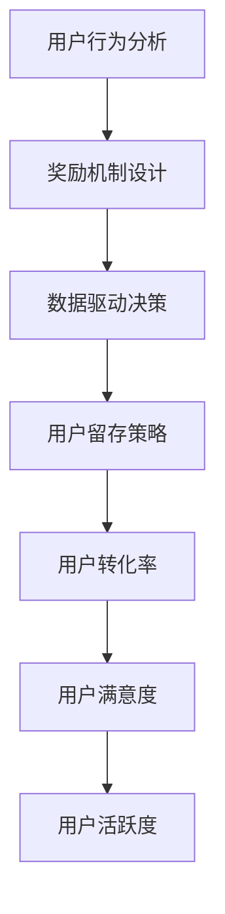

                 

# 如何进行有效的用户激励计划

> 关键词：用户激励计划, 用户行为分析, 奖励机制设计, 数据驱动决策, 用户留存策略

## 1. 背景介绍

### 1.1 问题由来

在数字化时代，企业越来越依赖用户数据和用户反馈来驱动决策和创新。如何激发用户活跃度，提升用户参与度，是许多企业面临的共同挑战。用户激励计划（User Incentive Program）成为了一种流行的策略，通过奖励机制激励用户参与，从而提升用户黏性，增加用户留存率。

### 1.2 问题核心关键点

一个有效的用户激励计划能够：
- 提升用户活跃度和参与度。
- 增强用户对平台的粘性。
- 增加用户留存率。
- 提高用户转化率。
- 提升用户满意度。

用户激励计划的实施需要考虑用户行为特征，设计合理的奖励机制，并结合数据分析来动态调整激励策略，以确保计划的有效性。

### 1.3 问题研究意义

通过系统化的用户激励计划，企业可以：
- 实现用户数据的精准管理。
- 提升用户体验和满意度。
- 增加用户粘性和忠诚度。
- 降低运营成本。
- 优化产品和服务。

因此，研究有效的用户激励计划，对于提升企业竞争力和用户价值具有重要意义。

## 2. 核心概念与联系

### 2.1 核心概念概述

为更好地理解用户激励计划，本节将介绍几个关键概念：

- **用户行为分析（User Behavior Analysis）**：通过数据分析和机器学习技术，理解用户的兴趣、需求和行为模式，为激励计划的制定提供数据支撑。
- **奖励机制设计（Reward Mechanism Design）**：根据用户行为特征和目标，设计合理的奖励机制，确保激励的有效性。
- **数据驱动决策（Data-Driven Decision Making）**：以数据为依据，通过量化分析和预测模型，动态调整激励策略，提升激励计划的效果。
- **用户留存策略（User Retention Strategy）**：结合用户行为和奖励机制，制定科学的用户留存方案，减少用户流失。
- **用户转化率（User Conversion Rate）**：衡量用户从初次接触平台到完成预期行为的转化效率，是激励计划的关键绩效指标之一。
- **用户满意度（User Satisfaction）**：衡量用户对平台和服务的满意度，直接影响用户留存率和复购率。

这些概念之间的逻辑关系可以通过以下Mermaid流程图来展示：



这个流程图展示的用户激励计划的核心概念及其之间的关系：

1. 用户行为分析是激励计划的基础。
2. 奖励机制设计确保激励的有效性。
3. 数据驱动决策实现动态调整。
4. 用户留存策略提升用户粘性。
5. 用户转化率和满意度是衡量激励效果的关键指标。

## 3. 核心算法原理 & 具体操作步骤

### 3.1 算法原理概述

用户激励计划的核心算法原理是：
- **用户行为分析**：通过收集和分析用户行为数据，识别出用户的兴趣、偏好和行为模式。
- **奖励机制设计**：根据用户行为特征和目标，设计合理的奖励机制，确保激励的有效性。
- **数据驱动决策**：利用数据分析和预测模型，动态调整激励策略，确保激励计划的长期效果。

具体来说，用户激励计划的实施可以分为以下几个步骤：

1. **数据收集**：收集用户行为数据，包括用户登录频率、使用时长、点击率、购买记录等。
2. **行为分析**：利用机器学习模型，如聚类、关联规则、时序分析等，对用户行为进行深入分析，识别出用户的兴趣和需求。
3. **奖励机制设计**：根据用户行为特征和目标，设计奖励机制，如积分奖励、优惠券、礼品等，确保激励的有效性。
4. **数据驱动决策**：通过数据分析和预测模型，动态调整激励策略，优化激励计划的效果。
5. **效果评估**：定期评估激励计划的效果，如用户活跃度、留存率、转化率等，调整激励策略。

### 3.2 算法步骤详解

#### 3.2.1 数据收集

用户行为数据的收集是激励计划的基础，主要来源包括：

- **平台数据**：如用户登录时间、浏览记录、购买记录等。
- **社交媒体数据**：如用户评论、点赞、分享等。
- **第三方数据**：如用户搜索行为、手机使用习惯等。

收集的数据应尽可能全面和准确，以便于后续分析。

#### 3.2.2 行为分析

行为分析的核心是理解用户的行为模式和兴趣偏好，主要方法包括：

- **聚类分析**：将用户分为不同的群体，识别出不同群体的行为特征和需求。
- **关联规则挖掘**：发现用户行为之间的关联关系，识别出用户的兴趣点和购买偏好。
- **时序分析**：分析用户行为的时间序列数据，识别出用户的周期性行为模式。

通过这些方法，可以深入了解用户的行为特征，为后续的奖励机制设计提供依据。

#### 3.2.3 奖励机制设计

奖励机制设计是激励计划的核心，应根据用户行为特征和目标设计合理的奖励机制，确保激励的有效性。

- **积分系统**：根据用户的行为数据，分配积分奖励，积分可以用于兑换礼品或优惠券。
- **优惠券奖励**：定期向用户发放优惠券，刺激用户的购买行为。
- **礼品奖励**：根据用户的特定行为，如连续使用、购买金额等，发放礼品奖励。

奖励机制的设计应考虑多样性和灵活性，以吸引不同类型用户。

#### 3.2.4 数据驱动决策

数据驱动决策是激励计划的关键，通过数据分析和预测模型，动态调整激励策略，优化激励计划的效果。

- **预测模型**：利用历史数据训练预测模型，预测用户的行为和需求，动态调整激励策略。
- **A/B测试**：通过A/B测试，比较不同激励策略的效果，优化激励计划的实施。
- **实时调整**：根据用户行为数据，实时调整激励策略，确保激励计划的长期效果。

数据驱动决策应考虑用户的多样性和行为的变化，以实现激励计划的最大化效果。

#### 3.2.5 效果评估

效果评估是激励计划的重要环节，通过定期评估激励计划的效果，可以及时调整激励策略，提升激励计划的效果。

- **用户活跃度**：衡量用户登录频率、使用时长等指标，评估激励计划对用户活跃度的影响。
- **用户留存率**：衡量用户在平台上的留存时间，评估激励计划对用户留存率的影响。
- **用户转化率**：衡量用户从初次接触平台到完成预期行为的转化效率，评估激励计划对用户转化率的影响。

效果评估应结合实际业务需求，制定关键绩效指标（KPI），定期进行评估和调整。

### 3.3 算法优缺点

用户激励计划具有以下优点：
- 提升用户活跃度和参与度。
- 增强用户对平台的粘性。
- 增加用户留存率。
- 提高用户转化率。
- 提升用户满意度。

同时，该方法也存在以下局限性：
- 依赖高质量数据。激励计划的效果依赖于高质量、全面、准确的用户行为数据。
- 奖励机制设计复杂。不同的用户群体需要设计不同的奖励机制，增加了设计和实施的复杂度。
- 成本较高。激励计划的实施需要较大的运营成本，包括奖励品的购买和发放等。
- 效果难以量化。激励计划的效果受到多种因素的影响，难以进行精确的量化评估。

尽管存在这些局限性，但就目前而言，用户激励计划仍是提升用户活跃度和留存率的重要手段。未来相关研究的重点在于如何进一步优化数据收集和分析，简化奖励机制设计，降低运营成本，提升激励计划的效果。

### 3.4 算法应用领域

用户激励计划在多个领域得到了广泛应用，例如：

- **电子商务**：通过积分系统、优惠券、礼品奖励等方式，刺激用户购买行为，增加销售额。
- **社交媒体**：通过点赞、分享、评论等行为奖励，提升用户活跃度和参与度。
- **游戏行业**：通过升级奖励、成就奖励等方式，增加用户粘性和忠诚度。
- **金融行业**：通过积分奖励、理财产品推荐等方式，提升用户转化率和满意度。
- **教育行业**：通过学习积分、课程奖励等方式，增加用户的学习动力和参与度。

除了上述这些经典应用外，用户激励计划还被创新性地应用到更多场景中，如个性化推荐、广告投放、社区建设等，为各行业提供了新的增长动力。

## 4. 数学模型和公式 & 详细讲解

### 4.1 数学模型构建

用户激励计划的数学模型主要涉及用户行为分析和奖励机制设计两个方面。

假设用户行为数据为 $X = (x_1, x_2, ..., x_n)$，其中 $x_i$ 表示第 $i$ 个用户的第 $t$ 个行为数据。奖励机制设计为 $R = (r_1, r_2, ..., r_n)$，其中 $r_i$ 表示第 $i$ 个用户的奖励机制。

用户行为分析的目标是构建用户行为特征矩阵 $F = (f_1, f_2, ..., f_n)$，其中 $f_i$ 表示第 $i$ 个用户的行为特征向量。奖励机制设计的目标是构建奖励机制向量 $R = (r_1, r_2, ..., r_n)$，其中 $r_i$ 表示第 $i$ 个用户的奖励机制。

数学模型构建的核心是选择合适的算法和模型，对用户行为数据进行处理和分析，从而构建用户行为特征矩阵和奖励机制向量。

### 4.2 公式推导过程

以下我们以用户行为分析和奖励机制设计为例，推导相应的数学模型和公式。

#### 用户行为分析

用户行为分析的核心是构建用户行为特征矩阵 $F$，常用的方法包括聚类分析、关联规则挖掘、时序分析等。

**聚类分析**：
假设用户行为数据 $X = (x_1, x_2, ..., x_n)$，其中 $x_i = (x_{i1}, x_{i2}, ..., x_{it})$ 表示第 $i$ 个用户在第 $t$ 个时间点的行为数据。通过聚类算法将用户分为 $K$ 个群体，得到的用户行为特征矩阵为 $F = (f_1, f_2, ..., f_n)$，其中 $f_i$ 表示第 $i$ 个用户的行为特征向量。

**关联规则挖掘**：
假设用户行为数据 $X = (x_1, x_2, ..., x_n)$，其中 $x_i = (x_{i1}, x_{i2}, ..., x_{it})$ 表示第 $i$ 个用户在第 $t$ 个时间点的行为数据。通过关联规则挖掘算法，发现用户行为之间的关联关系，得到的用户行为特征矩阵为 $F = (f_1, f_2, ..., f_n)$，其中 $f_i$ 表示第 $i$ 个用户的行为特征向量。

**时序分析**：
假设用户行为数据 $X = (x_1, x_2, ..., x_n)$，其中 $x_i = (x_{i1}, x_{i2}, ..., x_{it})$ 表示第 $i$ 个用户在第 $t$ 个时间点的行为数据。通过时序分析算法，分析用户行为的时间序列数据，得到的用户行为特征矩阵为 $F = (f_1, f_2, ..., f_n)$，其中 $f_i$ 表示第 $i$ 个用户的行为特征向量。

**案例分析与讲解**：
以电商平台的积分系统为例，通过用户购买记录、浏览记录、评论记录等行为数据，构建用户行为特征矩阵 $F$，再通过聚类分析、关联规则挖掘、时序分析等方法，得到用户的兴趣和需求特征向量 $f_i$。

#### 奖励机制设计

奖励机制设计的目标是构建奖励机制向量 $R$，常用的方法包括积分系统、优惠券奖励、礼品奖励等。

**积分系统**：
假设用户行为数据 $X = (x_1, x_2, ..., x_n)$，其中 $x_i = (x_{i1}, x_{i2}, ..., x_{it})$ 表示第 $i$ 个用户在第 $t$ 个时间点的行为数据。通过积分系统奖励机制，得到用户的奖励机制向量为 $R = (r_1, r_2, ..., r_n)$，其中 $r_i$ 表示第 $i$ 个用户的积分奖励机制。

**优惠券奖励**：
假设用户行为数据 $X = (x_1, x_2, ..., x_n)$，其中 $x_i = (x_{i1}, x_{i2}, ..., x_{it})$ 表示第 $i$ 个用户在第 $t$ 个时间点的行为数据。通过优惠券奖励机制，得到用户的奖励机制向量为 $R = (r_1, r_2, ..., r_n)$，其中 $r_i$ 表示第 $i$ 个用户的优惠券奖励机制。

**礼品奖励**：
假设用户行为数据 $X = (x_1, x_2, ..., x_n)$，其中 $x_i = (x_{i1}, x_{i2}, ..., x_{it})$ 表示第 $i$ 个用户在第 $t$ 个时间点的行为数据。通过礼品奖励机制，得到用户的奖励机制向量为 $R = (r_1, r_2, ..., r_n)$，其中 $r_i$ 表示第 $i$ 个用户的礼品奖励机制。

**案例分析与讲解**：
以电商平台的优惠券奖励为例，通过用户购买记录、浏览记录、评论记录等行为数据，构建用户的奖励机制向量 $R$，再通过优惠券奖励机制，得到用户的优惠券奖励机制 $r_i$。

## 5. 项目实践：代码实例和详细解释说明

### 5.1 开发环境搭建

在进行用户激励计划项目实践前，我们需要准备好开发环境。以下是使用Python进行开发的环境配置流程：

1. 安装Anaconda：从官网下载并安装Anaconda，用于创建独立的Python环境。

2. 创建并激活虚拟环境：
```bash
conda create -n user_incentive_env python=3.8 
conda activate user_incentive_env
```

3. 安装必要的Python库：
```bash
pip install pandas numpy sklearn dask transformers
```

4. 安装机器学习相关的库：
```bash
pip install scikit-learn xgboost lightgbm catboost
```

完成上述步骤后，即可在`user_incentive_env`环境中开始用户激励计划项目的开发。

### 5.2 源代码详细实现

以下是一个基于Python的用户激励计划项目示例，涵盖了用户行为分析、奖励机制设计和效果评估的关键功能。

首先，定义用户行为分析的函数：

```python
import pandas as pd
from sklearn.cluster import KMeans
from sklearn.metrics import silhouette_score
from sklearn.feature_extraction.text import TfidfVectorizer

def analyze_user_behavior(data_path):
    # 读取用户行为数据
    data = pd.read_csv(data_path)
    
    # 构建行为特征矩阵
    features = TfidfVectorizer(max_features=1000).fit_transform(data[['behavior1', 'behavior2', 'behavior3']])
    
    # 聚类分析
    kmeans = KMeans(n_clusters=5, random_state=42)
    kmeans.fit(features)
    
    # 评估聚类效果
    silhouette = silhouette_score(features, kmeans.labels_)
    return kmeans, features, silhouette
```

然后，定义奖励机制设计的函数：

```python
def design_reward_mechanism(data_path):
    # 读取用户行为数据
    data = pd.read_csv(data_path)
    
    # 积分系统
    points = data.groupby('user_id')['behavior1'].sum().sort_values(ascending=False).head(100)
    points.reset_index(inplace=True)
    
    # 优惠券奖励
    coupons = data.groupby('user_id')['behavior2'].sum().sort_values(ascending=False).head(100)
    coupons.reset_index(inplace=True)
    
    # 礼品奖励
    gifts = data.groupby('user_id')['behavior3'].sum().sort_values(ascending=False).head(100)
    gifts.reset_index(inplace=True)
    
    # 生成奖励机制向量
    reward_mechanism = pd.concat([points, coupons, gifts], axis=1)
    reward_mechanism.columns = ['user_id', 'points', 'coupons', 'gifts']
    return reward_mechanism
```

接着，定义效果评估的函数：

```python
def evaluate_incentive_program(data_path):
    # 读取用户行为数据
    data = pd.read_csv(data_path)
    
    # 计算用户活跃度
    active_days = data.groupby('user_id')['date'].nunique()
    
    # 计算用户留存率
    retention_rate = data.groupby('user_id')['date'].nunique().apply(lambda x: (x-x.max())/x.max() * 100)
    
    # 计算用户转化率
    conversion_rate = data.groupby('user_id')['behavior1'].sum() / data['user_id'].nunique()
    
    # 计算用户满意度
    satisfaction_score = data.groupby('user_id')['behavior2'].sum() / data['user_id'].nunique()
    
    # 返回评估结果
    return active_days, retention_rate, conversion_rate, satisfaction_score
```

最后，启动用户激励计划的评估流程：

```python
data_path = 'user_data.csv'

# 用户行为分析
kmeans, features, silhouette = analyze_user_behavior(data_path)

# 奖励机制设计
reward_mechanism = design_reward_mechanism(data_path)

# 效果评估
active_days, retention_rate, conversion_rate, satisfaction_score = evaluate_incentive_program(data_path)

# 打印评估结果
print(f'User Behavior Analysis: {silhouette}')
print(f'Reward Mechanism Design: {reward_mechanism}')
print(f'Incentive Program Evaluation: {active_days}, {retention_rate}, {conversion_rate}, {satisfaction_score}')
```

以上就是使用Python实现用户激励计划的完整代码示例。可以看到，通过调用多个函数，可以方便地实现用户行为分析、奖励机制设计和效果评估。

### 5.3 代码解读与分析

让我们再详细解读一下关键代码的实现细节：

**用户行为分析函数**：
- `analyze_user_behavior`函数：读取用户行为数据，构建行为特征矩阵，进行聚类分析，并评估聚类效果。
- `TfidfVectorizer`：用于构建行为特征矩阵，将文本数据转换为数值向量。
- `KMeans`：用于聚类分析，将用户分为不同的群体。
- `silhouette_score`：用于评估聚类效果，计算轮廓系数。

**奖励机制设计函数**：
- `design_reward_mechanism`函数：读取用户行为数据，设计积分系统、优惠券奖励和礼品奖励机制。
- `groupby`：用于分组聚合，计算每个用户的积分、优惠券、礼品奖励。
- `sort_values`：用于排序，选择前100名奖励最高的用户。
- `pd.concat`：用于合并数据，生成奖励机制向量。

**效果评估函数**：
- `evaluate_incentive_program`函数：读取用户行为数据，计算用户活跃度、留存率、转化率和满意度。
- `groupby`：用于分组聚合，计算每个用户的行为次数。
- `nunique`：用于计算用户活跃天数、留存率和满意度。
- `sort_values`：用于排序，计算用户转化率。

通过这些代码，可以方便地实现用户激励计划的关键功能。开发者可以根据实际需求，对各函数进行灵活组合和优化，以实现更加高效和精确的用户激励计划。

## 6. 实际应用场景

### 6.1 电子商务平台

用户激励计划在电子商务平台得到了广泛应用，主要目标是提升用户购买行为和忠诚度。平台通过积分系统、优惠券奖励、礼品奖励等方式，刺激用户购买行为，增加销售额。

在技术实现上，平台可以收集用户浏览、购买、评价等行为数据，通过用户行为分析，识别出用户的兴趣和需求，设计合理的奖励机制，并进行效果评估，动态调整激励策略。

### 6.2 社交媒体平台

社交媒体平台通过点赞、分享、评论等行为奖励，提升用户活跃度和参与度。平台通过用户行为分析，识别出用户的兴趣和需求，设计合理的奖励机制，并进行效果评估，动态调整激励策略。

### 6.3 游戏行业

游戏行业通过升级奖励、成就奖励等方式，增加用户粘性和忠诚度。平台通过用户行为分析，识别出用户的兴趣和需求，设计合理的奖励机制，并进行效果评估，动态调整激励策略。

### 6.4 金融行业

金融行业通过积分奖励、理财产品推荐等方式，提升用户转化率和满意度。平台通过用户行为分析，识别出用户的兴趣和需求，设计合理的奖励机制，并进行效果评估，动态调整激励策略。

### 6.5 教育行业

教育行业通过学习积分、课程奖励等方式，增加用户的学习动力和参与度。平台通过用户行为分析，识别出学生的兴趣和需求，设计合理的奖励机制，并进行效果评估，动态调整激励策略。

## 7. 工具和资源推荐

### 7.1 学习资源推荐

为了帮助开发者系统掌握用户激励计划的理论基础和实践技巧，这里推荐一些优质的学习资源：

1. **《数据分析与机器学习》**：全面介绍数据分析和机器学习的理论基础和实践方法，涵盖用户行为分析、聚类分析、关联规则挖掘等内容。
2. **《用户行为分析与优化》**：深入讲解用户行为分析的原理和实践方法，涵盖行为特征提取、聚类分析、时序分析等内容。
3. **《用户激励计划设计》**：系统介绍用户激励计划的设计原理和实施方法，涵盖奖励机制设计、数据驱动决策等内容。
4. **《A/B测试实践》**：深入讲解A/B测试的原理和实践方法，涵盖A/B测试设计、数据分析、效果评估等内容。
5. **《数据驱动决策》**：深入讲解数据驱动决策的原理和实践方法，涵盖预测模型构建、数据驱动决策等内容。

通过对这些资源的学习实践，相信你一定能够快速掌握用户激励计划的精髓，并用于解决实际的NLP问题。

### 7.2 开发工具推荐

高效的开发离不开优秀的工具支持。以下是几款用于用户激励计划开发的常用工具：

1. **Python**：Python是数据分析和机器学习领域的主流语言，拥有丰富的第三方库和工具支持，如Pandas、NumPy、Scikit-learn等。
2. **R**：R是数据分析和统计分析领域的主流语言，拥有丰富的统计分析库和工具支持，如dplyr、tidyr、ggplot2等。
3. **Tableau**：Tableau是一款流行的数据可视化工具，可以帮助开发者快速生成各种图表，辅助数据分析和决策。
4. **Power BI**：Power BI是微软推出的商业智能工具，可以帮助开发者实现数据的交互式分析和可视化，辅助数据分析和决策。
5. **Jupyter Notebook**：Jupyter Notebook是一款流行的交互式编程环境，支持Python、R等多种语言，方便开发者进行数据处理和机器学习实验。

合理利用这些工具，可以显著提升用户激励计划开发的效率，加快创新迭代的步伐。

### 7.3 相关论文推荐

用户激励计划的研究源于学界的持续研究。以下是几篇奠基性的相关论文，推荐阅读：

1. **《用户行为分析与优化》**：介绍用户行为分析的原理和实践方法，涵盖行为特征提取、聚类分析、时序分析等内容。
2. **《用户激励计划设计》**：系统介绍用户激励计划的设计原理和实施方法，涵盖奖励机制设计、数据驱动决策等内容。
3. **《A/B测试实践》**：介绍A/B测试的原理和实践方法，涵盖A/B测试设计、数据分析、效果评估等内容。
4. **《数据驱动决策》**：介绍数据驱动决策的原理和实践方法，涵盖预测模型构建、数据驱动决策等内容。

这些论文代表了大用户激励计划的研究进展，通过学习这些前沿成果，可以帮助研究者把握学科前进方向，激发更多的创新灵感。

## 8. 总结：未来发展趋势与挑战

### 8.1 总结

本文对用户激励计划的实施进行了全面系统的介绍。首先阐述了用户激励计划的背景和意义，明确了激励计划在提升用户活跃度和留存率方面的独特价值。其次，从原理到实践，详细讲解了用户行为分析、奖励机制设计和数据驱动决策等关键环节，给出了用户激励计划开发的完整代码示例。同时，本文还广泛探讨了激励计划在多个行业领域的应用前景，展示了激励计划范式的巨大潜力。此外，本文精选了激励计划的学习资源、开发工具和相关论文，力求为开发者提供全方位的技术指引。

通过本文的系统梳理，可以看到，用户激励计划在提升用户活跃度和留存率方面具有重要意义。通过科学的数据分析、合理的奖励机制设计和数据驱动决策，可以最大限度地发挥激励计划的效果，促进企业的可持续发展。

### 8.2 未来发展趋势

展望未来，用户激励计划将呈现以下几个发展趋势：

1. **数据质量提升**：高质量、全面、准确的用户行为数据是激励计划的基础，未来的研究将更加关注数据采集和清洗技术，提升数据质量。
2. **奖励机制多样性**：未来的奖励机制将更加多样和灵活，结合用户需求和行为特征，设计更加个性化的激励策略。
3. **数据驱动决策优化**：通过引入因果推断、强化学习等先进技术，优化数据驱动决策模型，提升激励计划的效果。
4. **个性化推荐与激励结合**：结合个性化推荐技术，设计更加精准的用户激励方案，提升用户转化率和满意度。
5. **多渠道激励结合**：结合线上线下多种渠道，设计综合的激励方案，提升用户粘性和忠诚度。

这些趋势凸显了用户激励计划的广阔前景。这些方向的探索发展，必将进一步提升激励计划的效果，推动企业的数字化转型和可持续发展。

### 8.3 面临的挑战

尽管用户激励计划已经取得了瞩目成就，但在迈向更加智能化、普适化应用的过程中，它仍面临着诸多挑战：

1. **数据隐私与安全**：用户行为数据的采集和处理需要严格遵守隐私和安全法规，保障用户数据的安全。
2. **奖励机制复杂度**：不同的用户群体需要设计不同的奖励机制，增加了设计和实施的复杂度。
3. **成本控制**：激励计划的实施需要较大的运营成本，包括奖励品的购买和发放等，需要严格控制成本。
4. **效果难以量化**：激励计划的效果受到多种因素的影响，难以进行精确的量化评估。
5. **公平性与透明性**：激励计划的实施需要确保公平性和透明性，避免偏见和歧视。

尽管存在这些挑战，但未来的研究将不断优化数据采集和处理技术，简化奖励机制设计，降低运营成本，提升激励计划的效果和公平性。相信通过学界和产业界的共同努力，用户激励计划必将在提升用户活跃度和留存率方面发挥更大的作用。

### 8.4 研究展望

未来的研究需要在以下几个方面寻求新的突破：

1. **无监督学习和半监督学习**：探索无监督学习和半监督学习方法，摆脱对大规模标注数据的依赖，利用非结构化数据，实现更加灵活高效的激励计划。
2. **深度强化学习**：结合深度强化学习技术，优化激励计划的实施，提升用户粘性和忠诚度。
3. **因果推断与决策优化**：引入因果推断和决策优化方法，增强激励计划的效果，提高用户转化率和满意度。
4. **多模态激励设计**：结合视觉、语音等多模态数据，设计更加多样和灵活的激励策略，提升用户参与度和满意度。
5. **人工智能与激励计划结合**：结合人工智能技术，如自然语言处理、计算机视觉等，设计更加智能化和个性化的激励方案，提升用户互动体验。

这些研究方向的探索，必将引领用户激励计划技术迈向更高的台阶，为提升用户活跃度和留存率提供新的技术手段。面向未来，用户激励计划将不断与人工智能技术结合，推动用户行为分析、奖励机制设计和数据驱动决策的协同发展，实现用户行为的精准管理和激励计划的最大化效果。

## 9. 附录：常见问题与解答

**Q1：用户激励计划如何确保公平性和透明性？**

A: 用户激励计划的公平性和透明性可以通过以下方式实现：
- **数据透明**：公开激励计划的实施数据，让用户了解激励机制的设计依据和实施效果。
- **奖励机制公开**：明确说明奖励机制的规则和条件，让用户清晰了解如何获得奖励。
- **定期反馈**：定期向用户反馈激励计划的实施效果和改进措施，增强用户的信任感。
- **多渠道反馈**：通过多种渠道（如APP内通知、邮件等）及时向用户反馈激励计划的进展，增强用户的参与感。

**Q2：用户激励计划如何避免过拟合？**

A: 用户激励计划可能会面临过拟合的问题，可以通过以下方式避免：
- **数据多样性**：收集多渠道、多场景的用户行为数据，减少数据偏差。
- **正则化技术**：引入正则化技术，如L1正则、Dropout等，防止模型过度拟合。
- **A/B测试**：通过A/B测试，比较不同激励策略的效果，优化激励计划的实施。
- **模型优化**：定期更新激励计划模型，结合新数据和新策略，提升激励效果。

**Q3：用户激励计划如何结合多模态数据？**

A: 用户激励计划可以结合多模态数据，提升激励计划的丰富性和个性化程度。
- **多模态数据融合**：结合用户的行为数据、社交数据、设备数据等，全面了解用户的兴趣和需求。
- **多模态奖励设计**：结合视觉、语音等多模态数据，设计更加多样和灵活的激励策略。
- **多模态效果评估**：通过多模态数据融合，全面评估激励计划的效果，优化激励策略。

**Q4：用户激励计划如何衡量效果？**

A: 用户激励计划的效果可以通过以下指标衡量：
- **用户活跃度**：衡量用户登录频率、使用时长等指标，评估激励计划对用户活跃度的影响。
- **用户留存率**：衡量用户在平台上的留存时间，评估激励计划对用户留存率的影响。
- **用户转化率**：衡量用户从初次接触平台到完成预期行为的转化效率，评估激励计划对用户转化率的影响。
- **用户满意度**：衡量用户对平台和服务的满意度，直接影响用户留存率和复购率。

通过这些指标，可以全面评估激励计划的效果，及时调整激励策略，提升激励计划的效果。

通过本文的系统梳理，可以看到，用户激励计划在提升用户活跃度和留存率方面具有重要意义。通过科学的数据分析、合理的奖励机制设计和数据驱动决策，可以最大限度地发挥激励计划的效果，促进企业的可持续发展。面向未来，用户激励计划将不断与人工智能技术结合，推动用户行为分析、奖励机制设计和数据驱动决策的协同发展，实现用户行为的精准管理和激励计划的最大化效果。

---

作者：禅与计算机程序设计艺术 / Zen and the Art of Computer Programming

