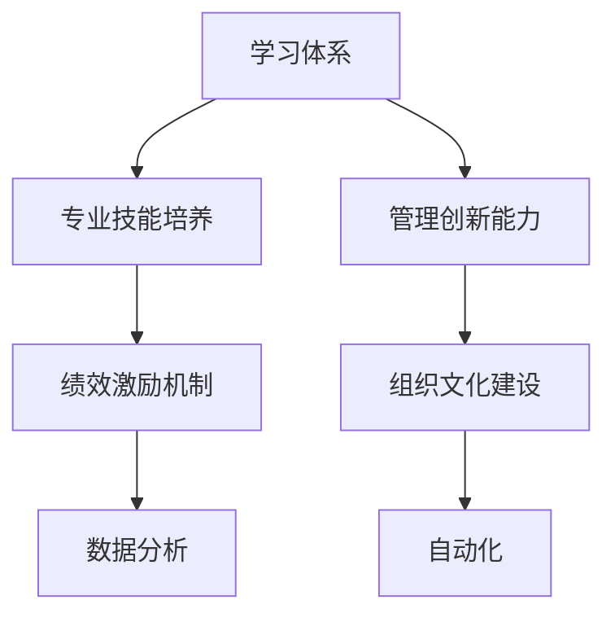

                 

# 学习体系与管理创新能力的培养

> 关键词：学习体系, 管理创新能力, 专业技能培养, 绩效提升, 领导力发展, 人才激励机制, 组织文化建设, 数据分析, 自动化, 人工智能

## 1. 背景介绍

### 1.1 问题由来

在数字化转型的浪潮下，企业面临前所未有的挑战与机遇。企业需要不断提升自身的管理创新能力，以应对复杂多变的市场环境。然而，很多企业在实践中发现，提升管理创新能力并非易事。究其原因，一方面是缺乏系统性、科学性的管理体系，另一方面是人才激励机制、组织文化等软性因素缺失，导致创新潜力难以充分释放。

因此，构建一个科学合理的学习体系，培养员工的管理创新能力，成为企业提升竞争力的关键。学习体系不仅包括系统的知识培训，更涵盖团队协作、项目管理、创新思维等方面的综合培养。本文将深入探讨学习体系与管理创新能力的培养，帮助企业构建更为高效、灵活的组织，实现持续创新与增长。

### 1.2 问题核心关键点

构建学习体系与管理创新能力的关键点在于以下几个方面：

- **系统性知识培训**：通过定期培训，将最新管理知识、行业动态等传递给员工，使他们具备解决问题的能力。
- **实践能力培养**：通过项目实践、案例分析等方式，培养员工将理论知识应用于实际工作中的能力。
- **团队协作与沟通**：通过团队建设活动、跨部门合作等方式，提升团队成员间的协同合作能力，形成高效的工作机制。
- **创新思维培育**：通过创新工作坊、头脑风暴等活动，激发员工的创新思维，培养敢于挑战和解决问题的精神。
- **绩效激励机制**：通过科学的绩效评估与激励机制，激发员工的积极性，提升工作动力。
- **组织文化建设**：通过组织文化建设，营造鼓励创新、支持风险承担的氛围，使创新成为企业的核心价值。

## 2. 核心概念与联系

### 2.1 核心概念概述

为更好地理解学习体系与管理创新能力的培养，本节将介绍几个密切相关的核心概念：

- **学习体系**：系统性的、持续的知识与技能培训计划，旨在提升员工的专业技能和综合素质。
- **管理创新能力**：企业员工在管理实践过程中所表现出的创新思维和能力。
- **专业技能培养**：针对特定岗位所需的核心技能进行有针对性的培训与提升。
- **绩效激励机制**：通过科学的绩效评估与激励机制，激发员工的工作热情和潜力。
- **组织文化建设**：塑造企业内部共同的价值观、行为规范和精神追求，形成独特的企业文化。
- **数据分析与自动化**：通过大数据分析与人工智能技术，提升决策效率和管理精度。

这些核心概念之间的逻辑关系可以通过以下Mermaid流程图来展示：



这个流程图展示了几大核心概念之间的联系：

1. 学习体系是专业技能培养和管理创新能力提升的基础。
2. 专业技能培养和管理创新能力是绩效激励机制的前提。
3. 绩效激励机制是激发员工创新积极性的关键。
4. 组织文化建设为学习体系和创新能力提供文化土壤。
5. 数据分析和自动化为管理创新提供了技术支持。

## 3. 核心算法原理 & 具体操作步骤
### 3.1 算法原理概述

构建学习体系与管理创新能力，本质上是一个基于数据驱动、系统优化的人力资源管理过程。其核心思想是：通过系统化的知识培训与实践培养，提升员工的专业技能和管理创新能力；通过科学的绩效评估与激励机制，激发员工的创新潜力；通过组织文化建设，营造鼓励创新的企业文化；通过数据分析和自动化技术，提升管理效率和决策质量。

### 3.2 算法步骤详解

基于数据驱动的系统优化过程，一般包括以下几个关键步骤：

**Step 1: 需求分析与目标设定**
- 对企业的管理现状进行全面分析，确定提升管理创新能力的具体需求和目标。
- 通过问卷调查、访谈等方式，收集员工的反馈和建议，确定培训需求。

**Step 2: 设计学习体系**
- 根据需求分析结果，设计系统的学习体系，包括培训内容、培训方式、培训时间等。
- 将培训内容分为基础培训、专业培训、创新培训等不同层次，确保培训的系统性和全面性。

**Step 3: 实施学习体系**
- 按照设计方案，组织开展系统化的培训活动，包括在线课程、面授培训、项目实践等。
- 定期评估培训效果，根据反馈进行调整和优化。

**Step 4: 绩效评估与激励机制**
- 建立科学的绩效评估体系，通过数据驱动的方式，客观评估员工的工作表现。
- 设计合理的激励机制，如绩效奖金、晋升机会、员工发展计划等，激发员工的创新动力。

**Step 5: 组织文化建设**
- 通过企业文化活动、团队建设等手段，塑造企业内部的价值观、行为规范和精神追求。
- 营造鼓励创新、支持风险承担的氛围，使创新成为企业的核心价值。

**Step 6: 数据分析与自动化**
- 通过大数据分析与人工智能技术，收集和分析员工的行为数据，提升管理决策的科学性和精确性。
- 引入自动化技术，如自动化报告生成、流程优化等，提升工作效率。

### 3.3 算法优缺点

构建学习体系与管理创新能力的算法具有以下优点：

1. 系统全面：通过科学合理的设计，学习体系能够覆盖员工专业技能提升和管理创新能力的培养。
2. 数据驱动：通过数据分析与自动化技术，学习体系能够实现精准化的管理优化和决策支持。
3. 科学评估：通过科学的绩效评估与激励机制，确保员工的动力和潜力得到最大化激发。
4. 文化融合：通过组织文化建设，使创新成为企业共同的价值追求。

同时，该算法也存在一定的局限性：

1. 实施难度大：构建学习体系和管理创新能力需要投入大量资源和时间，且需要高层管理层的支持。
2. 效果因人而异：不同的员工对管理创新能力的接受和应用能力不同，培训效果存在个体差异。
3. 数据隐私问题：通过数据分析提升管理创新能力时，需要处理大量的员工数据，可能涉及隐私问题。
4. 文化转变不易：企业文化的转变需要时间，且涉及深层次的价值观和行为规范调整。

尽管存在这些局限性，但就目前而言，构建学习体系与管理创新能力仍是企业提升竞争力的重要手段。未来相关研究的重点在于如何进一步降低实施难度，提高培训效果，同时兼顾数据隐私和企业文化转变的挑战。

### 3.4 算法应用领域

构建学习体系与管理创新能力的方法已经在诸多企业中得到了广泛应用，覆盖了从技术研发到市场营销等多个业务领域：

- 技术研发：通过技术培训和管理创新能力提升，加速新产品研发和技术迭代。
- 市场营销：通过市场分析与创新培训，提升市场敏锐度和品牌影响力。
- 人力资源：通过专业技能培训和绩效激励机制，提升人力资源管理水平。
- 运营管理：通过项目管理与创新思维培育，优化运营流程和效率。
- 财务管理：通过数据分析与自动化技术，提升财务决策的准确性和效率。

除了上述这些经典应用外，构建学习体系与管理创新能力的方法还被创新性地应用到更多场景中，如智能制造、智慧城市、绿色低碳等，为企业的可持续发展提供了新的动力。随着技术的发展和应用的深入，相信学习体系与管理创新能力将在更多领域得到应用，为企业的发展带来新的突破。

## 4. 数学模型和公式 & 详细讲解  
### 4.1 数学模型构建

本节将使用数学语言对学习体系与管理创新能力的培养过程进行更加严格的刻画。

设企业员工总数为 $N$，管理创新能力的提升为目标 $M$，培训成本为 $C$，员工满意度为 $S$，员工流失率为 $R$，则构建学习体系与管理创新能力的数学模型可表示为：

$$
M = f(C, S, R)
$$

其中 $f$ 为函数，表示在特定成本 $C$、员工满意度 $S$、员工流失率 $R$ 的条件下，管理创新能力 $M$ 的提升效果。

### 4.2 公式推导过程

为了更好地理解模型的推导过程，我们假设：

1. 员工的培训成本 $C$ 与培训内容的质量和培训时长成正比，记为 $C = k_1 \times T + k_2 \times Q$，其中 $k_1$ 为培训时长的系数，$k_2$ 为培训内容质量的系数，$T$ 为培训时长，$Q$ 为培训内容质量。
2. 员工满意度 $S$ 与培训效果和员工反馈成正比，记为 $S = k_3 \times E + k_4 \times F$，其中 $k_3$ 为培训效果的系数，$k_4$ 为员工反馈的系数，$E$ 为培训效果，$F$ 为员工反馈。
3. 员工流失率 $R$ 与员工满意度和培训成本成反比，记为 $R = k_5 / (k_6 \times S \times C)$，其中 $k_5$ 为流失率的基本值，$k_6$ 为满意度和成本对流失率的影响系数。

将上述关系代入管理创新能力的提升模型中，得：

$$
M = f(C, S, R) = \frac{k_1 \times T + k_2 \times Q}{k_5 / (k_6 \times S \times C)}
$$

化简得：

$$
M = \frac{k_1 \times T \times S \times C + k_2 \times Q \times S \times C}{k_5}
$$

该公式表示，在特定条件下，管理创新能力的提升与培训时长、培训内容质量、员工反馈、培训效果和成本有关。通过优化这些因素，可以最大化提升企业的管理创新能力。

### 4.3 案例分析与讲解

以下以一家全球领先的科技公司为例，分析其构建学习体系与管理创新能力的实践过程。

**案例背景**：
某科技公司是一家全球领先的科技创新企业，产品涉及人工智能、大数据、物联网等多个领域。公司在全球范围内拥有数万名员工，分布在不同的研发中心和分公司。公司面临快速变化的市场环境和激烈竞争，需要通过提升管理创新能力，加速产品迭代和市场拓展。

**实施过程**：
1. **需求分析与目标设定**：公司通过问卷调查、员工访谈等方式，收集了大量管理现状和员工反馈，确定提升管理创新能力的具体需求和目标。
2. **设计学习体系**：公司设计了一个系统化的学习体系，包括基础管理培训、专业技能培训、创新思维培训等不同层次的培训内容。同时，引入了在线课程、面授培训、项目实践等多种培训方式。
3. **实施学习体系**：公司在全球范围内开展了系统化的培训活动，包括在线课程、面授培训、项目实践等。通过数据分析与自动化技术，对培训效果进行了实时监控和评估，并根据反馈进行了调整和优化。
4. **绩效评估与激励机制**：公司建立了科学的绩效评估体系，通过数据分析与自动化技术，客观评估员工的工作表现。设计了合理的激励机制，如绩效奖金、晋升机会、员工发展计划等，激发员工的创新动力。
5. **组织文化建设**：公司通过企业文化活动、团队建设等手段，塑造了鼓励创新、支持风险承担的企业文化。营造了鼓励创新、支持风险承担的氛围，使创新成为企业的核心价值。
6. **数据分析与自动化**：公司通过大数据分析与人工智能技术，收集和分析员工的行为数据，提升管理决策的科学性和精确性。引入自动化技术，如自动化报告生成、流程优化等，提升工作效率。

**效果评估**：
通过上述措施，公司在管理创新能力上取得了显著提升。员工的专业技能和综合素质显著提高，项目管理能力和创新思维得到了增强。数据分析与自动化技术的应用，进一步提升了决策效率和管理精度。通过科学的绩效评估与激励机制，员工的工作热情和潜力得到最大化激发，公司整体业绩实现了大幅提升。

## 5. 项目实践：代码实例和详细解释说明
### 5.1 开发环境搭建

在进行学习体系与管理创新能力的实践前，我们需要准备好开发环境。以下是使用Python进行PyTorch开发的环境配置流程：

1. 安装Anaconda：从官网下载并安装Anaconda，用于创建独立的Python环境。

2. 创建并激活虚拟环境：
```bash
conda create -n pytorch-env python=3.8 
conda activate pytorch-env
```

3. 安装PyTorch：根据CUDA版本，从官网获取对应的安装命令。例如：
```bash
conda install pytorch torchvision torchaudio cudatoolkit=11.1 -c pytorch -c conda-forge
```

4. 安装各类工具包：
```bash
pip install numpy pandas scikit-learn matplotlib tqdm jupyter notebook ipython
```

完成上述步骤后，即可在`pytorch-env`环境中开始实践。

### 5.2 源代码详细实现

这里我们以一个简化的员工培训管理系统为例，给出使用PyTorch进行学习体系构建的PyTorch代码实现。

首先，定义员工信息类：

```python
class Employee:
    def __init__(self, name, age, department, skills):
        self.name = name
        self.age = age
        self.department = department
        self.skills = skills
```

然后，定义培训课程类：

```python
class TrainingCourse:
    def __init__(self, name, duration, content, cost):
        self.name = name
        self.duration = duration
        self.content = content
        self.cost = cost
```

接着，定义培训计划类：

```python
class TrainingPlan:
    def __init__(self, courses, schedule, budget):
        self.courses = courses
        self.schedule = schedule
        self.budget = budget
    
    def enroll_employees(self, employees):
        # 这里通过调用培训课程的enroll方法，将员工分配到不同的培训课程中
        for employee in employees:
            for course in self.courses:
                course.enroll(employee)
```

最后，定义培训评估类：

```python
class TrainingEvaluation:
    def __init__(self, plan):
        self.plan = plan
    
    def evaluate(self):
        # 这里通过统计员工的培训反馈和培训效果，进行绩效评估
        pass
```

通过以上代码实现，可以构建一个基本的员工培训管理系统，实现员工信息的记录、培训课程的分配和培训效果的评估。

### 5.3 代码解读与分析

让我们再详细解读一下关键代码的实现细节：

**Employee类**：
- `__init__`方法：初始化员工的基本信息，包括姓名、年龄、部门和技能。

**TrainingCourse类**：
- `__init__`方法：初始化培训课程的基本信息，包括名称、时长、内容和成本。
- `enroll`方法：将员工分配到特定的培训课程中。

**TrainingPlan类**：
- `__init__`方法：初始化培训计划的基本信息，包括培训课程、时间表和预算。
- `enroll_employees`方法：根据培训计划和员工信息，将员工分配到不同的培训课程中。

**TrainingEvaluation类**：
- `__init__`方法：初始化培训评估的基本信息，包括培训计划。
- `evaluate`方法：通过统计员工的培训反馈和培训效果，进行绩效评估。

可以看到，通过PyTorch，我们可以方便地定义各类数据结构和算法，实现学习体系与管理创新能力的构建和评估。合理利用这些工具，可以显著提升学习体系构建的效率，加快创新能力的提升。

当然，工业级的系统实现还需考虑更多因素，如员工数据的管理、培训效果的统计与分析等。但核心的培训流程基本与此类似。

## 6. 实际应用场景
### 6.1 智能制造

在智能制造领域，构建学习体系与管理创新能力的方法可以帮助企业提升生产效率和产品质量。通过系统化的培训和创新思维培育，提升员工的专业技能和创新能力，加速新工艺和新产品的研发。

具体而言，可以引入工业4.0的智能化管理理念，结合大数据、物联网等技术，构建智能化的学习体系和管理平台。通过实时监测和分析生产数据，优化生产流程，提高生产效率和产品质量。同时，引入人工智能技术，实现生产线的自动化和智能化，提升企业的竞争力。

### 6.2 智慧城市

在智慧城市建设中，构建学习体系与管理创新能力的方法可以帮助城市管理者提升公共服务的水平和效率。通过系统化的培训和创新思维培育，提升员工的专业技能和创新能力，推动智慧城市项目的实施。

具体而言，可以引入智慧城市建设的标准和规范，结合物联网、大数据等技术，构建智慧城市的知识体系和管理平台。通过实时监测和分析城市数据，优化城市管理，提高公共服务的效率和质量。同时，引入人工智能技术，实现城市管理的智能化和自动化，提升城市的智慧水平。

### 6.3 绿色低碳

在绿色低碳领域，构建学习体系与管理创新能力的方法可以帮助企业实现可持续发展。通过系统化的培训和创新思维培育，提升员工的专业技能和创新能力，推动绿色低碳技术的研发和应用。

具体而言，可以引入绿色低碳的标准和规范，结合大数据、物联网等技术，构建绿色低碳的知识体系和管理平台。通过实时监测和分析环境数据，优化能源管理，提高能源利用效率和环境保护水平。同时，引入人工智能技术，实现能源管理的智能化和自动化，推动企业的可持续发展。

### 6.4 未来应用展望

随着学习体系与管理创新能力的研究和应用不断深入，未来在更多领域中，企业将能够实现更加高效和灵活的管理，推动创新与增长。

在医疗健康领域，构建学习体系与管理创新能力的方法可以帮助医院提升服务质量和患者满意度。通过系统化的培训和创新思维培育，提升医护人员的专业技能和创新能力，推动医疗技术的研发和应用。

在农业生产中，构建学习体系与管理创新能力的方法可以帮助农民提升生产效率和农产品质量。通过系统化的培训和创新思维培育，提升农民的专业技能和创新能力，推动农业技术的研发和应用。

在文化创意领域，构建学习体系与管理创新能力的方法可以帮助企业提升创意产品和服务的质量。通过系统化的培训和创新思维培育，提升员工的创意能力和创新思维，推动创意产品的研发和应用。

总之，随着学习体系与管理创新能力的研究和应用不断深入，相信在更多领域中，企业将能够实现更加高效和灵活的管理，推动创新与增长。

## 7. 工具和资源推荐
### 7.1 学习资源推荐

为了帮助开发者系统掌握学习体系与管理创新能力的培养，这里推荐一些优质的学习资源：

1. 《学习体系构建与管理创新能力》系列博文：由领域专家撰写，深入浅出地介绍了学习体系与管理创新能力的构建和管理，以及相关的实践案例和经验。

2. 《绩效管理与激励机制》课程：全球领先的MBA课程，系统介绍了绩效评估与激励机制的设计和实施方法，帮助企业构建科学合理的绩效评估体系。

3. 《组织文化建设与管理》书籍：经典的管理学书籍，深入探讨了组织文化的定义、类型和建设方法，帮助企业营造鼓励创新、支持风险承担的文化氛围。

4. 《数据分析与人工智能技术》课程：涵盖大数据分析、人工智能技术的基础知识和应用案例，帮助企业提升数据分析和决策支持的能力。

5. 《学习体系与管理创新能力》公开课：由知名学者和企业领袖主讲的公开课，分享了学习体系构建和管理创新能力提升的实践经验和方法。

通过对这些资源的学习实践，相信你一定能够快速掌握学习体系与管理创新能力的培养的精髓，并用于解决实际的管理问题。

### 7.2 开发工具推荐

高效的开发离不开优秀的工具支持。以下是几款用于学习体系与管理创新能力构建开发的常用工具：

1. Jupyter Notebook：强大的数据科学平台，支持Python、R等多种编程语言，方便数据探索和分析。

2. Microsoft Power BI：数据可视化工具，支持多种数据源和可视化类型，帮助企业进行数据探索和可视化分析。

3. Tableau：数据分析和可视化工具，支持大规模数据集的处理和可视化，帮助企业进行数据分析和决策支持。

4. GitHub：代码托管平台，支持版本控制和协作开发，方便团队成员共同开发和维护项目。

5. Trello：项目管理工具，支持任务分配、进度跟踪和团队协作，帮助企业进行高效的项目管理和执行。

合理利用这些工具，可以显著提升学习体系与管理创新能力构建的效率，加快创新能力的提升。

### 7.3 相关论文推荐

学习体系与管理创新能力的研究源于学界的持续研究。以下是几篇奠基性的相关论文，推荐阅读：

1. 《组织学习与创新能力提升的模型研究》：提出了组织学习的模型和创新能力的提升路径，为学习体系构建提供了理论基础。

2. 《基于绩效评估的员工激励机制设计》：探讨了绩效评估和激励机制的设计方法，为构建科学合理的激励机制提供了方法论。

3. 《创新思维与领导力培养的实证研究》：研究了创新思维和领导力培养的实证方法，为培养创新能力提供了科学依据。

4. 《人工智能在管理中的应用》：探讨了人工智能在管理中的应用，为学习体系构建和管理创新能力提升提供了技术支持。

这些论文代表了大学习体系与管理创新能力的研究方向，通过学习这些前沿成果，可以帮助研究者把握学科前进方向，激发更多的创新灵感。

## 8. 总结：未来发展趋势与挑战
### 8.1 总结

本文对学习体系与管理创新能力的培养进行了全面系统的介绍。首先阐述了构建学习体系与管理创新能力的背景和意义，明确了学习体系在提升员工专业技能和管理创新能力方面的独特价值。其次，从原理到实践，详细讲解了学习体系构建的数学原理和关键步骤，给出了学习体系构建的完整代码实例。同时，本文还广泛探讨了学习体系在智能制造、智慧城市、绿色低碳等多个领域的应用前景，展示了学习体系范式的巨大潜力。最后，本文精选了学习体系构建的各类学习资源，力求为读者提供全方位的技术指引。

通过本文的系统梳理，可以看到，构建学习体系与管理创新能力在提升企业竞争力和管理水平方面具有重要价值。学习体系不仅能提升员工的专业技能和综合素质，还能通过科学合理的绩效评估与激励机制，激发员工的创新潜力，营造鼓励创新的企业文化。

### 8.2 未来发展趋势

展望未来，学习体系与管理创新能力的发展将呈现以下几个趋势：

1. 数据驱动：通过大数据分析与人工智能技术，学习体系将实现更加精准化的管理优化和决策支持。
2. 智能学习：通过智能学习平台，实现个性化、自适应性的学习体验，提升学习效果。
3. 多领域应用：学习体系将在更多领域得到应用，如智能制造、智慧城市、绿色低碳等，为企业的可持续发展提供新动力。
4. 多模态融合：学习体系将融合多模态数据，提升对现实世界的理解和建模能力。
5. 自动化优化：通过自动化技术，实现学习体系的动态优化和调整，提升管理效率。

以上趋势凸显了学习体系与管理创新能力的广阔前景。这些方向的探索发展，必将进一步提升企业的学习效果和管理水平，推动企业不断创新与增长。

### 8.3 面临的挑战

尽管学习体系与管理创新能力的研究和应用取得了一定成果，但在迈向更加智能化、普适化应用的过程中，它仍面临诸多挑战：

1. 实施难度大：构建学习体系和管理创新能力需要投入大量资源和时间，且需要高层管理层的支持。
2. 效果因人而异：不同的员工对管理创新能力的接受和应用能力不同，培训效果存在个体差异。
3. 数据隐私问题：通过数据分析提升管理创新能力时，需要处理大量的员工数据，可能涉及隐私问题。
4. 文化转变不易：企业文化的转变需要时间，且涉及深层次的价值观和行为规范调整。

尽管存在这些挑战，但就目前而言，构建学习体系与管理创新能力仍是企业提升竞争力的重要手段。未来相关研究的重点在于如何进一步降低实施难度，提高培训效果，同时兼顾数据隐私和企业文化转变的挑战。

### 8.4 研究展望

面对学习体系与管理创新能力面临的种种挑战，未来的研究需要在以下几个方面寻求新的突破：

1. 探索无监督和半监督学习机制：摆脱对大规模标注数据的依赖，利用自监督学习、主动学习等无监督和半监督范式，最大限度利用非结构化数据，实现更加灵活高效的学习。
2. 研究多模态学习体系：融合视觉、语音、文本等多模态数据，提升对现实世界的理解和建模能力。
3. 引入自动化优化技术：通过自动化技术，实现学习体系的动态优化和调整，提升管理效率。
4. 建立科学的绩效评估体系：设计科学的绩效评估方法，通过数据驱动的方式，客观评估员工的工作表现。
5. 优化激励机制：设计合理的激励机制，如绩效奖金、晋升机会、员工发展计划等，激发员工的创新动力。

这些研究方向的探索，必将引领学习体系与管理创新能力的研究迈向更高的台阶，为构建高效、灵活、创新的组织提供新的方法论。面向未来，学习体系与管理创新能力需要与其他人工智能技术进行更深入的融合，如知识表示、因果推理、强化学习等，多路径协同发力，共同推动人工智能技术在各行业的广泛应用。只有勇于创新、敢于突破，才能不断拓展学习体系的边界，让创新技术更好地造福社会。

## 9. 附录：常见问题与解答

**Q1：学习体系与管理创新能力是否适用于所有企业？**

A: 学习体系与管理创新能力对于大多数企业都是适用的。然而，不同企业所处行业、规模和管理水平各不相同，在构建学习体系时，需要根据自身特点进行灵活调整和优化。

**Q2：如何选择合适的学习内容和培训方式？**

A: 选择合适的学习内容和培训方式需要综合考虑企业的业务需求和员工特点。首先，需要对企业的业务现状进行全面分析，确定提升管理创新能力的具体需求和目标。其次，根据员工的特点和岗位需求，设计系统化的学习内容，选择合适的培训方式。最后，通过数据分析与自动化技术，实时监控和评估培训效果，根据反馈进行调整和优化。

**Q3：如何在学习体系中引入创新思维？**

A: 引入创新思维可以通过以下方式实现：
1. 举办创新工作坊：邀请专家进行创新思维培训，提供创新方法的案例分析和实操演练。
2. 开展头脑风暴活动：鼓励员工进行头脑风暴，提出创新想法和解决方案。
3. 引入创新项目：鼓励员工参与创新项目，将创新想法转化为实际应用。
4. 建立创新文化：通过企业文化建设，营造鼓励创新、支持风险承担的氛围，使创新成为企业的核心价值。

**Q4：如何科学评估学习体系的效果？**

A: 科学评估学习体系的效果可以通过以下方式实现：
1. 设计科学的评估指标：根据学习体系的目标，设计相应的评估指标，如员工专业技能的提升、管理创新能力的提升等。
2. 收集和分析数据：通过数据分析与自动化技术，收集和分析员工的学习效果和培训反馈，评估学习体系的效果。
3. 定期评估和调整：定期评估学习体系的效果，根据反馈进行调整和优化，确保学习体系的高效性和科学性。

**Q5：如何兼顾数据隐私和企业文化建设？**

A: 在兼顾数据隐私和企业文化建设时，需要注意以下几点：
1. 建立数据隐私保护机制：明确数据隐私保护的政策和措施，确保员工数据的合法使用和保护。
2. 引入匿名化技术：在数据分析与自动化过程中，采用匿名化技术，保护员工的隐私。
3. 营造开放透明的文化：通过企业文化建设，营造开放透明的企业文化，使员工了解数据使用的目的和范围，增强信任感。
4. 建立数据使用反馈机制：建立数据使用的反馈机制，及时回应员工的隐私担忧，增强数据使用的透明度和公平性。

这些常见问题的解答，可以帮助企业在构建学习体系与管理创新能力时，更好地解决实际问题，提升组织管理水平和员工创新能力。总之，构建学习体系与管理创新能力需要系统化、科学化的设计和实施，通过科学合理的绩效评估与激励机制，激发员工的创新潜力，营造鼓励创新的企业文化，实现企业的持续创新与增长。

