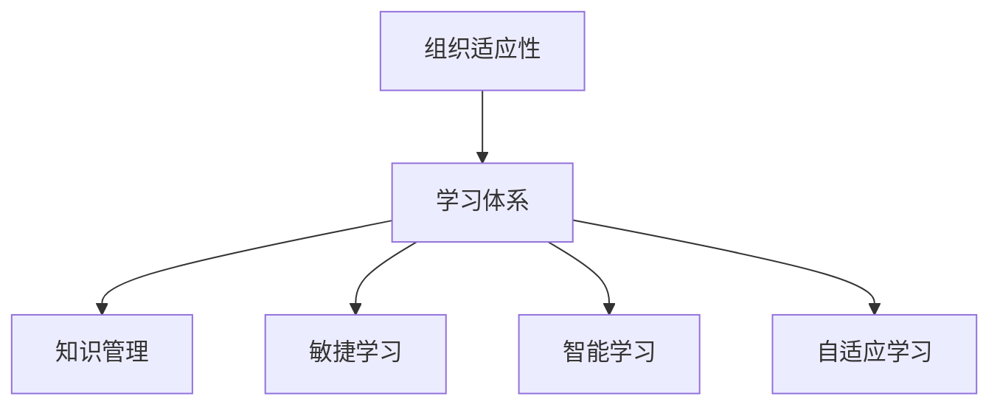

                 

# 学习体系对组织适应性的提升作用

## 1. 背景介绍

在数字化转型加速的今天，组织面临的环境日趋复杂多变，技术的快速演进和市场的瞬息万变要求组织必须具备高度的适应性和灵活性。传统的组织架构和学习模式往往难以适应这种快速变化的需求。为此，构建高效的学习体系，成为提升组织适应性的关键。

## 2. 核心概念与联系

### 2.1 核心概念概述

为了深入理解学习体系对组织适应性的提升作用，本节将介绍几个核心概念：

- **组织适应性**：指组织快速响应环境变化、灵活调整策略的能力。适应性强的组织能够更快适应市场变化，持续创新，保持竞争优势。
- **学习体系**：指组织内部知识获取、传播、应用、创新的系统化过程。包括培训、知识管理、学习平台等。
- **知识管理**：指对组织内部知识的收集、整理、分享、应用和创新的过程。旨在最大化知识的价值，促进组织的创新与发展。
- **敏捷学习**：指快速响应市场变化，灵活调整学习策略和学习内容的过程。强调以用户为中心，及时、精准、灵活地提供学习资源。
- **智能学习**：指利用人工智能技术，如机器学习、深度学习等，自动化地分析用户行为和需求，推荐个性化学习内容。
- **自适应学习**：指根据学习者个人能力和学习风格，自动调整学习路径和资源的过程。

这些概念之间的逻辑关系可以通过以下Mermaid流程图来展示：



这个流程图展示了一个组织通过构建学习体系，提升适应性的过程：

1. 组织通过学习体系获取新知识，增强内部知识库。
2. 知识管理作为学习体系的核心，确保知识的收集和传播。
3. 敏捷学习利用外部环境变化，灵活调整学习策略和内容。
4. 智能学习利用人工智能技术，精准推荐个性化学习内容。
5. 自适应学习根据学习者个体差异，调整学习路径和资源，最大化学习效果。

## 3. 核心算法原理 & 具体操作步骤
### 3.1 算法原理概述

构建高效学习体系的核心在于如何系统化地组织、传播和应用知识，提升组织成员的学习效率和效果。以下将详细阐述学习体系的核心算法原理及具体操作步骤：

- **知识获取**：从内部和外部渠道获取知识，如文档、会议、培训等。
- **知识存储**：构建知识库，保存组织内部的知识，便于检索和分享。
- **知识传播**：利用内部网络和社交媒体，分享知识，促进组织成员间的交流。
- **知识应用**：将知识应用到实际工作中，如项目管理、产品开发、客户服务等。
- **知识创新**：鼓励员工提出创新方案，利用知识库进行迭代优化。

### 3.2 算法步骤详解

构建高效学习体系一般包括以下关键步骤：

**Step 1: 准备知识库与学习平台**
- 选择合适的知识管理平台，如Confluence、SharePoint等，搭建知识库。
- 设计合理的数据结构，便于知识分类、检索和分享。
- 部署学习管理系统(LMS)，如Moodle、Canvas等，支持在线学习、讨论、评估等。

**Step 2: 设计知识地图与学习路径**
- 根据组织战略和岗位需求，设计知识地图，明确各岗位的知识要求。
- 制定学习路径，包含课程、书籍、培训等，帮助员工系统学习。

**Step 3: 实施个性化学习与推荐**
- 收集员工的学习数据，如学习行为、偏好等。
- 利用机器学习模型，生成个性化学习推荐，如推荐系统、智能搜索等。
- 定期评估推荐效果，优化模型参数。

**Step 4: 持续改进与反馈机制**
- 定期收集员工的学习反馈，评估学习效果。
- 根据反馈数据，调整学习策略和内容。
- 建立持续改进机制，保持知识库和学习平台的活力。

**Step 5: 推广与培训**
- 通过内部宣传和培训，提升员工对学习体系的认知和应用能力。
- 定期举行知识分享会、在线讨论等活动，促进知识传播。

通过上述步骤，组织可以系统化地构建高效的学习体系，提升适应性。

### 3.3 算法优缺点

构建高效学习体系具有以下优点：
1. 提升知识获取效率：通过系统化的知识管理平台，提升知识收集和传播的效率。
2. 促进知识共享与协作：建立知识库和学习平台，促进员工间的知识交流与协作。
3. 提高学习效果：利用个性化推荐和自适应学习，最大化学习效果。
4. 支持持续改进：建立反馈机制，定期评估学习效果，持续改进学习体系。

同时，该方法也存在一定的局限性：
1. 初始成本高：搭建知识库和学习平台需要一定的技术投入和资源。
2. 需要持续维护：知识库和平台需要定期更新和维护，保证数据的准确性和完整性。
3. 可能存在数据孤岛：不同部门和团队之间可能存在知识孤岛，难以形成统一的视图。
4. 依赖员工积极性：员工的积极性和参与度对学习体系的运行效果有重要影响。

尽管存在这些局限性，但构建高效学习体系仍然是提升组织适应性的重要手段。未来相关研究的重点在于如何进一步降低初始成本，提高系统的可扩展性和灵活性，同时兼顾员工积极性和知识共享的效果。

### 3.4 算法应用领域

构建高效学习体系的算法原理在多个领域都得到了广泛应用，例如：

- 教育培训：学校、大学等机构通过系统化的学习平台，提升教学效果和学生学习体验。
- 企业培训：企业通过内部学习管理系统，提升员工技能和绩效，支持企业战略实施。
- 医疗教育：医疗机构通过知识管理平台，提升医生和护士的知识水平和诊疗能力。
- 政府信息化：政府部门通过知识库和学习平台，提升公务员的知识更新和业务能力。
- 公共服务：公共机构通过在线学习平台，提升员工的专业技能和服务水平。

这些领域的学习体系建设，不仅提升了组织成员的学习效果，还促进了组织知识的积累和传播，进一步增强了组织的适应性和创新能力。

## 4. 数学模型和公式 & 详细讲解 & 举例说明
### 4.1 数学模型构建

构建学习体系的数学模型主要关注知识传播和应用的效果。以下定义几个关键变量：

- $K$：知识库中的知识量。
- $E$：每个员工的知识需求量。
- $R$：知识推荐系统的推荐效果。
- $C$：员工的知识应用效果。

学习体系的效果可以用以下模型表示：

$$
E_{total} = K \times R \times C
$$

其中，$E_{total}$为组织总体的学习效果，$K$为知识库的知识量，$R$为推荐系统的推荐效果，$C$为员工的知识应用效果。

### 4.2 公式推导过程

利用最大化组织学习效果的模型，可以推导出以下公式：

$$
\max_{K, R, C} E_{total}
$$

通过优化上述目标函数，最大化组织学习效果。具体优化方法包括：

- 优化知识库：通过系统化收集和整理知识，增加$K$值。
- 优化推荐系统：通过算法改进和参数调整，提高$R$值。
- 优化知识应用：通过培训和激励机制，提升$C$值。

### 4.3 案例分析与讲解

以某企业的学习体系为例，分析其知识获取、传播和应用的效果：

1. **知识获取**：
   - 企业构建了内部的知识管理系统，集中存储了公司内部的业务流程、技术文档、培训材料等。
   - 通过定期组织内部培训和交流会，不断增加知识库的知识量。

2. **知识传播**：
   - 利用企业内部的社交网络平台，鼓励员工分享知识，如通过企业内网、微信群、知识问答平台等。
   - 通过内部知识分享会、公开课等形式，定期组织员工进行知识交流。

3. **知识应用**：
   - 企业通过项目管理工具，将知识应用到具体的项目中，如业务流程优化、产品开发等。
   - 定期组织业务评估和流程改进，提升知识应用效果。

通过上述措施，企业有效提升了员工的知识水平和技能，增强了组织适应性和创新能力。

## 5. 项目实践：代码实例和详细解释说明
### 5.1 开发环境搭建

在进行学习体系构建前，我们需要准备好开发环境。以下是使用Python进行知识管理系统的环境配置流程：

1. 安装Anaconda：从官网下载并安装Anaconda，用于创建独立的Python环境。

2. 创建并激活虚拟环境：
```bash
conda create -n learning-env python=3.8 
conda activate learning-env
```

3. 安装知识管理系统相关工具：
```bash
conda install pydot pygraphviz graphviz
```

4. 安装其他必要的Python库：
```bash
pip install pandas numpy matplotlib seaborn scikit-learn
```

5. 安装Python Web框架：
```bash
pip install Flask
```

完成上述步骤后，即可在`learning-env`环境中开始学习体系构建的实践。

### 5.2 源代码详细实现

以下是一个简单的知识管理系统代码实现，包括知识库、推荐系统、知识应用等核心模块。

```python
from flask import Flask, request, jsonify
from sklearn.model_selection import train_test_split
from sklearn.linear_model import LogisticRegression
from sklearn.metrics import accuracy_score
from pydot import graph_from_dot_data

# 定义知识库和推荐系统
class KnowledgeSystem:
    def __init__(self):
        self.knowledge_base = []
        self.recommender = None

    def add_knowledge(self, knowledge):
        self.knowledge_base.append(knowledge)

    def train_recommender(self, data):
        X, y = data['features'], data['labels']
        X_train, X_test, y_train, y_test = train_test_split(X, y, test_size=0.2, random_state=42)
        self.recommender = LogisticRegression()
        self.recommender.fit(X_train, y_train)
        y_pred = self.recommender.predict(X_test)
        accuracy = accuracy_score(y_test, y_pred)
        print(f"Recommender accuracy: {accuracy}")

    def recommend_knowledge(self, user):
        # 根据用户历史行为生成推荐列表
        user_history = user['history']
        features = [user_history[i] for i in range(len(user_history))]
        y_pred = self.recommender.predict(features)
        return y_pred.tolist()

# 定义知识应用
class KnowledgeApplication:
    def __init__(self):
        self.knowledge_base = []
        self.used_knowledge = []

    def apply_knowledge(self, user, knowledge_id):
        if knowledge_id in self.knowledge_base:
            self.used_knowledge.append(knowledge_id)
            return True
        else:
            return False

# 定义知识管理系统
app = Flask(__name__)

@app.route('/add_knowledge', methods=['POST'])
def add_knowledge():
    knowledge = request.get_json()
    knowledge_system.add_knowledge(knowledge)
    return jsonify({'message': 'Knowledge added successfully'})

@app.route('/train_recommender', methods=['POST'])
def train_recommender():
    data = request.get_json()
    knowledge_system.train_recommender(data)
    return jsonify({'message': 'Recommender trained successfully'})

@app.route('/recommend_knowledge', methods=['POST'])
def recommend_knowledge():
    user = request.get_json()
    knowledge_ids = knowledge_system.recommend_knowledge(user)
    return jsonify({'knowledge_ids': knowledge_ids})

@app.route('/apply_knowledge', methods=['POST'])
def apply_knowledge():
    user = request.get_json()
    knowledge_id = user['knowledge_id']
    knowledge_system.apply_knowledge(user, knowledge_id)
    return jsonify({'message': 'Knowledge applied successfully'})

if __name__ == '__main__':
    app.run(debug=True)
```

### 5.3 代码解读与分析

让我们再详细解读一下关键代码的实现细节：

**KnowledgeSystem类**：
- `__init__`方法：初始化知识库和推荐系统。
- `add_knowledge`方法：将新的知识添加到知识库中。
- `train_recommender`方法：训练推荐系统模型，并评估其精度。
- `recommend_knowledge`方法：根据用户历史行为，推荐新的知识。

**KnowledgeApplication类**：
- `__init__`方法：初始化知识应用模块。
- `apply_knowledge`方法：应用指定知识，返回是否成功。

**app变量**：
- 使用Flask框架定义了多个API接口，用于知识库管理、推荐系统训练和知识应用。

**Flask框架**：
- Flask是一个轻量级的Python Web框架，用于搭建Web应用。
- 通过Flask的API接口，用户可以方便地进行知识库管理、推荐系统训练和知识应用。

通过上述代码实现，可以初步构建一个基于Web的知识管理系统，用于组织内部的知识传播和应用。开发者可以将更多精力放在学习体系的优化上，如改进推荐算法、增加知识库的丰富性等。

当然，工业级的系统实现还需考虑更多因素，如用户界面设计、数据安全性、系统性能优化等。但核心的学习体系构建思想基本与此类似。

## 6. 实际应用场景
### 6.1 智能客服系统

基于知识管理系统的智能客服系统，可以广泛应用于企业内部和外部服务。通过构建知识库，将客户咨询常见的问答对、业务流程、产品介绍等知识进行整理和存储，提升客服的响应速度和质量。

在技术实现上，可以构建一个基于机器学习推荐系统的智能客服平台，根据客户的历史对话记录和常见问题，推荐合适的答案。同时，系统还可以通过日志分析，不断优化推荐模型，提升服务效果。

### 6.2 企业培训体系

企业可以通过知识管理系统构建系统化的培训体系，提升员工的技能和绩效。通过系统化的培训课程和知识点，结合员工的学习行为数据，定制个性化的学习路径，实现按需培训。

在实际应用中，可以定期收集员工的学习反馈，评估培训效果，并根据反馈数据，调整培训内容和策略，持续改进培训体系。

### 6.3 医疗知识管理

医疗机构可以通过知识管理系统，构建系统的医疗知识库，提升医生的诊疗能力和研究水平。通过系统化的医疗知识整理和传播，帮助医生及时获取最新的研究成果和诊疗指南，提高医疗质量。

在应用中，可以结合AI技术，开发智能推荐系统，根据医生的学习行为和诊疗需求，推荐相关的研究论文、诊疗指南、病例分析等。

### 6.4 未来应用展望

随着知识管理系统的不断演进，未来的学习体系将呈现以下几个发展趋势：

1. **数据驱动**：通过大数据分析和机器学习，实现更精准的知识推荐和应用效果。
2. **知识图谱**：结合知识图谱技术，构建更全面的知识体系，提升知识检索和传播的效率。
3. **自适应学习**：根据学习者个体差异，动态调整学习路径和资源，提升学习效果。
4. **持续学习**：通过知识迭代和持续改进，保持知识库和系统的活力。
5. **跨领域融合**：结合多领域知识，实现更全面的知识管理。

这些趋势凸显了知识管理系统在提升组织适应性方面的潜力，未来将有更多创新技术涌现，推动学习体系的进一步发展。

## 7. 工具和资源推荐
### 7.1 学习资源推荐

为了帮助开发者系统掌握知识管理系统构建的理论基础和实践技巧，这里推荐一些优质的学习资源：

1. 《Knowledge Management: The Complete Guide》书籍：系统介绍了知识管理的理论、实践和技术，是知识管理系统构建的入门必读。
2. CS580《信息科学与技术导论》课程：麻省理工学院开设的课程，涵盖信息科学的基本概念和技术，为知识管理系统构建提供理论基础。
3. Udemy《Knowledge Management and Organizational Learning》课程：提供系统化的知识管理与组织学习知识，涵盖多个实战案例。
4. Coursera《Knowledge Management in Organizations》课程：由斯坦福大学和杜克大学联合开设，深入讲解知识管理系统构建的关键技术和应用案例。

通过对这些资源的学习实践，相信你一定能够快速掌握知识管理系统构建的精髓，并用于解决实际的组织适应性问题。
###  7.2 开发工具推荐

高效的开发离不开优秀的工具支持。以下是几款用于知识管理系统构建的常用工具：

1. Apache Kafka：分布式消息系统，用于实现知识库和推荐系统的数据同步和传播。
2. Apache Spark：大数据处理引擎，用于处理大规模数据和实时数据流。
3. Elasticsearch：搜索引擎，用于实现高效的知识检索和推荐。
4. Apache Hadoop：分布式计算框架，用于存储和处理大规模知识库数据。
5. Apache Cassandra：分布式数据库，用于存储和处理大规模知识库数据。
6. Apache Sphinx：搜索引擎，用于实现高效的知识检索和推荐。

合理利用这些工具，可以显著提升知识管理系统的开发效率，加快创新迭代的步伐。

### 7.3 相关论文推荐

知识管理系统和组织学习的研究源于学界的持续研究。以下是几篇奠基性的相关论文，推荐阅读：

1. "Knowledge Management and Organizational Memory" by Moller (1992)：介绍了知识管理的概念和理论基础。
2. "Organizational Knowledge as a Dynamic Capability" by Spender et al. (2001)：提出了组织知识作为动态能力的概念，强调知识管理在组织竞争中的重要性。
3. "Organizational Learning: Social, Technological, and Computational Perspectives" by Nonaka et al. (1995)：探讨了组织学习的多维度视角，为知识管理提供了理论支撑。
4. "Knowledge Management for Work: Shifting from a Static to a Dynamic View" by Nonaka et al. (1997)：提出了动态知识管理的概念，强调知识管理过程的动态性和复杂性。
5. "Learning and Knowledge Management" by Noe et al. (2006)：系统介绍了学习与知识管理的关系，为知识管理提供了实践指导。

这些论文代表了大语言模型微调技术的发展脉络。通过学习这些前沿成果，可以帮助研究者把握学科前进方向，激发更多的创新灵感。

## 8. 总结：未来发展趋势与挑战
### 8.1 总结

本文对知识管理系统的构建及其对组织适应性的提升作用进行了全面系统的介绍。首先阐述了知识管理系统的重要性和构建关键，明确了知识管理在提升组织适应性方面的独特价值。其次，从原理到实践，详细讲解了知识管理系统的核心算法原理及具体操作步骤，给出了知识管理系统构建的完整代码实例。同时，本文还广泛探讨了知识管理系统在多个领域的应用前景，展示了知识管理系统构建的巨大潜力。

通过本文的系统梳理，可以看到，构建高效的知识管理系统对于提升组织适应性具有重要意义。通过系统化的知识获取、传播和应用，组织能够更快适应市场变化，提升创新能力，保持竞争优势。未来，伴随知识管理系统和相关技术的不断演进，相信组织学习体系将进一步发展，推动组织向更加智能化、灵活化的方向迈进。

### 8.2 未来发展趋势

展望未来，知识管理系统的构建将呈现以下几个发展趋势：

1. **数据驱动**：通过大数据分析和机器学习，实现更精准的知识推荐和应用效果。
2. **知识图谱**：结合知识图谱技术，构建更全面的知识体系，提升知识检索和传播的效率。
3. **自适应学习**：根据学习者个体差异，动态调整学习路径和资源，提升学习效果。
4. **持续学习**：通过知识迭代和持续改进，保持知识库和系统的活力。
5. **跨领域融合**：结合多领域知识，实现更全面的知识管理。

这些趋势凸显了知识管理系统在提升组织适应性方面的潜力，未来将有更多创新技术涌现，推动知识管理系统的进一步发展。

### 8.3 面临的挑战

尽管知识管理系统和相关技术已经取得了一定的成果，但在迈向更加智能化、普适化应用的过程中，它仍面临诸多挑战：

1. **数据隐私与安全**：知识管理系统的数据隐私和安全问题不容忽视，如何保障数据安全和隐私，是一个重要的研究方向。
2. **系统复杂性**：知识管理系统涉及多个系统模块和复杂的技术栈，如何构建稳定、高效的系统，是一个难题。
3. **用户参与度**：知识管理系统的运行效果依赖于用户的主动参与，如何激发用户积极性，是一个挑战。
4. **知识孤岛**：不同部门和团队之间可能存在知识孤岛，难以形成统一的视图，如何实现知识共享，是一个重要的研究课题。
5. **知识更新与迭代**：知识库和系统的持续更新和迭代，需要不断投入资源，如何提升知识更新效率，是一个重要的研究方向。

尽管存在这些挑战，但知识管理系统仍然是提升组织适应性的重要手段。未来相关研究的重点在于如何进一步降低系统复杂性，提升系统可扩展性和灵活性，同时兼顾数据隐私和用户参与度，实现知识的高效传播和应用。

### 8.4 研究展望

面对知识管理系统构建所面临的种种挑战，未来的研究需要在以下几个方面寻求新的突破：

1. **数据隐私保护**：引入隐私保护技术，如差分隐私、联邦学习等，保障知识管理系统的数据安全和隐私。
2. **系统架构优化**：结合云计算和微服务架构，优化知识管理系统的架构，提升系统的可扩展性和灵活性。
3. **用户行为分析**：利用数据分析和机器学习，深入分析用户行为，实现个性化推荐和自适应学习。
4. **知识图谱构建**：结合知识图谱技术，构建更全面的知识体系，提升知识检索和传播的效率。
5. **跨领域知识融合**：结合多领域知识，实现更全面的知识管理，提升系统的综合能力。

这些研究方向将推动知识管理系统的不断演进，为组织适应性提供更强大的技术支撑。面向未来，知识管理系统的研究将进一步融合更多先进技术，实现更全面、高效的知识管理。

## 9. 附录：常见问题与解答

**Q1：知识管理系统的初始成本是否很高？**

A: 知识管理系统的初始成本确实较高，主要体现在硬件和软件设施的投入。但随着技术的不断演进和系统化的管理，后续的运维和优化成本会逐渐降低。通过系统化的知识管理，组织可以获得显著的长期收益，如提高员工绩效、提升创新能力等。

**Q2：知识管理系统的运行效果依赖于用户的主动参与，如何激发用户积极性？**

A: 通过建立激励机制和知识共享文化，可以激发用户的主动参与。例如，定期举行知识分享会和比赛，表彰知识贡献者，提升用户的学习积极性。同时，通过个性化的知识推荐，提高用户的学习体验，使其更愿意参与到知识管理系统中。

**Q3：如何缓解知识管理系统的数据隐私和安全问题？**

A: 引入差分隐私和联邦学习等技术，可以在保障数据隐私的同时，实现知识共享和传播。具体措施包括数据匿名化、加密传输、访问控制等，确保知识管理系统的数据安全和隐私。

**Q4：如何提升知识管理系统的运行效率？**

A: 利用大数据和机器学习技术，实现知识的自动标注和分类，提升知识管理的效率。同时，通过系统化的知识库和推荐系统，实现知识的高效检索和传播。定期进行系统优化和更新，确保知识管理系统的稳定运行。

**Q5：如何实现知识管理系统的跨领域融合？**

A: 结合多领域知识，构建更全面的知识体系，提升知识管理系统的综合能力。例如，结合医疗、法律、金融等多领域知识，实现跨领域的知识融合和应用。同时，通过多模态知识管理技术，如文本、图像、音频等，提升知识管理系统的适应性。

这些问题的解答，为知识管理系统的实际应用提供了指导，帮助组织更好地构建高效的学习体系，提升适应性。

---

作者：禅与计算机程序设计艺术 / Zen and the Art of Computer Programming

