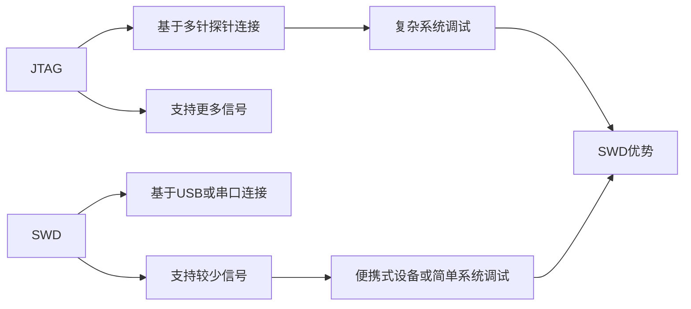

                 

# 嵌入式调试技巧：使用 JTAG 和 SWD

## 1. 背景介绍

随着嵌入式系统规模的不断扩大和复杂度的不断提升，有效的调试手段变得尤为重要。调试不仅帮助开发者诊断系统中的问题，还能提高生产效率。本文将探讨嵌入式系统中最常见的两种调试方式：JTAG和SWD，并详细介绍其原理、使用方法及应用场景。

## 2. 核心概念与联系

### 2.1 核心概念概述

JTAG（Joint Test Action Group）和SWD（Serial Wire Debug）是两种常用的嵌入式调试方式，均基于IEEE标准。它们通过调试接口，实现对嵌入式系统硬件和软件的实时监控和调试。JTAG使用多针探针连接系统，SWD则使用标准USB或串口连接。

- **JTAG**：标准IEEE 1149.1定义的接口协议，采用多针探针连接，可同时监测多个信号，适用于复杂的系统调试。
- **SWD**：IEEE 1149.4定义的接口协议，通过USB或串口连接，通常支持较少的信号，适用于便携式设备或功能简单的系统调试。

两者的主要区别在于连接方式和支持的信号数量，但共享的调试协议使得它们可以相互替代或结合使用。

### 2.2 核心概念原理和架构的 Mermaid 流程图



## 3. 核心算法原理 & 具体操作步骤

### 3.1 算法原理概述

JTAG和SWD的调试原理基于IEEE标准的调试协议。以JTAG为例，其核心协议包括TDI（测试数据输入）、TCK（测试时钟）、TMS（测试模式选择）和TDO（测试数据输出）四个信号线。这些信号线通过调试探针与目标系统连接，调试器发送测试指令，目标系统响应并执行相应的测试操作，最终将测试结果返回调试器。

SWD协议类似，但通过USB或串口连接，通常只使用TCK、TDI和TDO三条信号线，简化连接方式，适用于便携设备。

### 3.2 算法步骤详解

#### 3.2.1 JTAG调试步骤

1. **连接探针**：将JTAG调试探针与目标系统连接。
2. **初始化调试环境**：通过调试软件（如JTAG调试器）初始化调试环境，配置调试参数。
3. **进入调试模式**：通过调试器发送测试指令，使目标系统进入调试模式。
4. **进行调试**：通过调试器发送各种测试命令，如寄存器读写、内存读写等，实时监控系统状态。
5. **保存调试结果**：调试完成后，保存调试结果，分析问题原因。

#### 3.2.2 SWD调试步骤

1. **连接设备**：将SWD调试器与目标系统连接。
2. **初始化调试环境**：通过调试软件（如SWD调试器）初始化调试环境，配置调试参数。
3. **进入调试模式**：通过调试器发送测试指令，使目标系统进入调试模式。
4. **进行调试**：通过调试器发送各种测试命令，如寄存器读写、内存读写等，实时监控系统状态。
5. **保存调试结果**：调试完成后，保存调试结果，分析问题原因。

### 3.3 算法优缺点

#### 3.3.1 JTAG调试优点

- **信号丰富**：支持多个信号线，可以同时监测多个状态，适合复杂系统。
- **多平台支持**：广泛应用于嵌入式系统、FPGA等领域。
- **强大的调试功能**：支持多种调试操作，如断点设置、寄存器访问等。

#### 3.3.2 JTAG调试缺点

- **探针复杂**：需要使用多针探针，连接复杂，维护成本高。
- **硬件要求**：目标系统需要具备JTAG接口，增加了硬件成本。
- **物理限制**：探针连接方式限制了系统的便携性。

#### 3.3.3 SWD调试优点

- **连接简便**：使用USB或串口连接，设备易于携带。
- **硬件要求低**：目标系统只需具备SWD接口，硬件成本低。
- **扩展性强**：适用于多种嵌入式平台，支持多种调试功能。

#### 3.3.4 SWD调试缺点

- **信号有限**：仅支持有限的信号线，调试功能有限。
- **物理限制**：连接方式可能受物理环境影响，如设备移动或振动。

### 3.4 算法应用领域

JTAG和SWD广泛应用于嵌入式系统、微控制器、FPGA、DSP等领域的开发和调试。它们在产品开发、系统维护、故障排查等场景中发挥着重要作用。

- **嵌入式开发**：用于开发和调试复杂的嵌入式系统，如智能家居、工业控制等。
- **FPGA设计**：用于FPGA的调试和验证，支持复杂的硬件设计和逻辑验证。
- **DSP应用**：用于数字信号处理系统的调试和优化，支持实时信号采集和处理。
- **系统维护**：用于嵌入式系统的后期维护和故障排查，保障系统稳定运行。

## 4. 数学模型和公式 & 详细讲解 & 举例说明

### 4.1 数学模型构建

JTAG和SWD的调试主要依赖于调试协议，这些协议定义了调试器与目标系统之间的数据传输格式和操作指令。以JTAG协议为例，其数据传输格式包括TAP模式、JTAG命令和响应数据。

- **TAP模式**：JTAG协议定义的四种模式，分别为Run模式、Test模式、Debug模式和Idle模式，用于控制调试操作。
- **JTAG命令**：调试器发送的指令，包括单步执行、断点设置、寄存器读写等。
- **响应数据**：目标系统返回的调试结果，如寄存器值、内存状态等。

### 4.2 公式推导过程

JTAG协议的核心在于TDI、TCK、TMS和TDO四个信号线的操作。以单步执行命令为例，其操作过程如下：

1. 调试器发送单步执行指令 `U`，其中 `U` 表示单步执行。
2. 目标系统接收到指令后，进入Run模式，开始执行下一条指令。
3. 调试器通过TCK时钟信号触发TDI发送指令，目标系统接收并执行。
4. 目标系统通过TDO返回执行结果，调试器接收并分析。

### 4.3 案例分析与讲解

假设目标系统为STM32单片机，需要调试其内存访问功能。调试过程如下：

1. **连接探针**：将JTAG调试探针与STM32单片机连接。
2. **初始化调试环境**：使用JTAG调试软件初始化调试环境，配置调试参数。
3. **进入调试模式**：通过调试器发送指令，使STM32进入调试模式。
4. **进行调试**：通过调试器发送内存读写命令，实时监控内存状态。
5. **保存调试结果**：调试完成后，保存调试结果，分析内存访问功能。

## 5. 项目实践：代码实例和详细解释说明

### 5.1 开发环境搭建

#### 5.1.1 硬件环境

- **目标系统**：STM32单片机开发板。
- **调试器**：JTAG调试探针或SWD调试器。
- **设备连接**：USB接口或串口。

#### 5.1.2 软件环境

- **调试软件**：ST-LINK/V2（适用于STM32单片机）、GDB、OpenOCD等。
- **开发工具**：IAR Embedded Studio、Keil MDK等。

### 5.2 源代码详细实现

#### 5.2.1 JTAG调试代码实现

```c
#include "stm32f7xx.h"
#include "stm32f7xx_jtag.h"

void JTAG_Init(void)
{
    JTAG_InitTypeDef JTAGInitStructure;
    JTAG_DeInit(JTAG);
    JTAGInitStructure.JTDID = 0x0; // 设备标识
    JTAGInitStructure.JTMS = JTMS_2; // JTMS信号配置
    JTAGInitStructure.JTCK = JTCK_0; // JTCK信号配置
    JTAGInitStructure.JTDI = JTDI_1; // JTDI信号配置
    JTAGInitStructure.JTDO = JTDO_1; // JTDO信号配置
    JTAGInitStructure.JTCK_Freq = JTCK_Freq_200KHz; // JTCK时钟频率
    JTAG_Init(&JTAGInitStructure);
}

int main(void)
{
    JTAG_Init();
    // 调试器连接目标系统，进行调试操作
    // ...
}
```

#### 5.2.2 SWD调试代码实现

```c
#include "stm32f7xx.h"
#include "stm32f7xx_swd.h"

void SWD_Init(void)
{
    SWD_InitTypeDef SWDInitStructure;
    SWD_DeInit(SWD);
    SWDInitStructure.SWD_DebugMode = SWD_DebugMode_SWD; // SWD调试模式
    SWDInitStructure.SWD_OverflowDisable = SWD_OverflowDisable_Enable; // SWD溢出禁止
    SWDInitStructure.SWD_SWDJN = SWD_SWDJN_2; // SWD调试方式
    SWDInitStructure.SWD_ExternalSWDCLK = SWD_ExternalSWDCLK_Enable; // 外部SWD时钟
    SWDInitStructure.SWD_ExternalSWDn = SWD_ExternalSWDn_Enable; // 外部SWDn信号
    SWD_Init(&SWDInitStructure);
}

int main(void)
{
    SWD_Init();
    // 调试器连接目标系统，进行调试操作
    // ...
}
```

### 5.3 代码解读与分析

#### 5.3.1 JTAG调试代码分析

- **JTAG_Init**：初始化JTAG协议，配置调试参数。
- **主函数**：连接探针，进行调试操作，实现单片机的内存读写。

#### 5.3.2 SWD调试代码分析

- **SWD_Init**：初始化SWD协议，配置调试参数。
- **主函数**：连接设备，进行调试操作，实现单片机的寄存器访问。

### 5.4 运行结果展示

#### 5.4.1 JTAG调试结果展示

- **内存读写**：通过JTAG调试器，监控STM32单片机的内存状态，实时获取内存内容，确认内存读写功能正常。

#### 5.4.2 SWD调试结果展示

- **寄存器访问**：通过SWD调试器，访问STM32单片机的寄存器，读取和设置寄存器值，确认寄存器访问功能正常。

## 6. 实际应用场景

### 6.1 嵌入式开发

JTAG和SWD在嵌入式开发中广泛应用，用于调试复杂的嵌入式系统，如智能家居、工业控制等。开发者可以通过调试器进行功能验证、错误排查，加速产品开发进程。

#### 6.1.1 智能家居

在智能家居系统中，嵌入式控制器需要监控家居环境，控制家电设备。通过JTAG或SWD调试，可以快速验证控制器功能，优化系统稳定性，保障用户体验。

#### 6.1.2 工业控制

在工业控制系统中，嵌入式控制器需要实时监控生产环境，控制设备运行。通过JTAG或SWD调试，可以及时发现系统异常，快速修复故障，提升生产效率。

### 6.2 产品维护

JTAG和SWD在产品维护中也有广泛应用，用于系统故障排查、设备升级等。

#### 6.2.1 故障排查

当产品出现问题时，可以通过JTAG或SWD调试，快速定位问题原因，进行故障排查。例如，在嵌入式设备维护中，可以通过调试器获取系统状态，诊断故障，进行修复。

#### 6.2.2 设备升级

在设备升级过程中，可以通过JTAG或SWD调试，更新固件或配置信息，实现设备的快速升级。例如，在智能家居设备的固件更新中，通过调试器更新固件，确保设备功能正常。

### 6.3 实验室测试

JTAG和SWD在实验室测试中也得到广泛应用，用于测试嵌入式系统，验证硬件设计。

#### 6.3.1 硬件设计验证

在嵌入式硬件设计中，通过JTAG或SWD调试，可以验证硬件电路的稳定性，检测信号传输的准确性，确保硬件设计的正确性。例如，在FPGA设计的测试中，可以通过调试器检测电路功能，确认设计正确。

#### 6.3.2 功能测试

在嵌入式系统功能测试中，通过JTAG或SWD调试，可以全面测试系统功能，确保系统的完整性和正确性。例如，在DSP应用测试中，可以通过调试器测试信号处理功能，确认系统功能正常。

## 7. 工具和资源推荐

### 7.1 学习资源推荐

- **《嵌入式系统调试与故障诊断》**：详细介绍了JTAG和SWD调试原理及应用，适合初学者入门。
- **《嵌入式系统设计与开发》**：深入讲解了嵌入式系统的设计与开发流程，包括调试、测试等环节。
- **《STM32嵌入式开发实战》**：实战教程，详细讲解了STM32单片机的JTAG和SWD调试。

### 7.2 开发工具推荐

- **JTAG调试工具**：ST-LINK/V2、GDB、OpenOCD等。
- **SWD调试工具**：LLD调试器、OpenOCD等。
- **开发工具链**：IAR Embedded Studio、Keil MDK等。

### 7.3 相关论文推荐

- **《嵌入式系统中的调试与故障诊断》**：介绍了嵌入式系统中的调试技术，包括JTAG和SWD的原理与应用。
- **《基于SWD的嵌入式系统实时调试技术》**：研究了基于SWD的实时调试技术，提出了多种优化策略。

## 8. 总结：未来发展趋势与挑战

### 8.1 总结

本文系统介绍了JTAG和SWD两种嵌入式调试方式，详细讲解了其原理、操作步骤及应用场景。通过具体案例，展示了JTAG和SWD在嵌入式开发、产品维护和实验室测试中的应用。

JTAG和SWD作为嵌入式系统调试的重要工具，具有丰富的功能和广泛的适用性，帮助开发者高效排查问题，提升系统性能。未来，随着嵌入式系统复杂度的增加和硬件成本的降低，JTAG和SWD的应用将更加广泛。

### 8.2 未来发展趋势

#### 8.2.1 高精度调试

随着嵌入式系统功能的增强，对调试精度的要求也越来越高。未来的调试工具将具备更高的分辨率和更精确的控制能力，能够更细腻地监测和调整系统状态。

#### 8.2.2 智能化调试

未来的调试工具将具备更高的智能化水平，能够自动检测和定位问题，提供更详细的错误报告和调试建议。例如，通过机器学习技术，自动分析系统状态，提供最优的调试方案。

#### 8.2.3 无线调试

随着物联网技术的发展，无线调试将成为未来调试技术的重要方向。通过Wi-Fi、蓝牙等无线方式连接目标系统，实现远距离调试，提高调试便捷性和灵活性。

#### 8.2.4 多平台兼容性

未来的调试工具将具备更强的多平台兼容性，支持多种嵌入式系统、FPGA和DSP等设备。通过统一的调试协议和工具接口，简化调试过程，提高调试效率。

### 8.3 面临的挑战

#### 8.3.1 调试效率

尽管JTAG和SWD调试技术已较为成熟，但在复杂系统中，调试效率仍然是一个瓶颈。未来的挑战在于提高调试速度，减少调试时间，提高生产效率。

#### 8.3.2 调试成本

JTAG和SWD调试器通常价格较高，增加了硬件成本。未来的挑战在于降低调试成本，使更多开发者能够轻松使用调试工具。

#### 8.3.3 硬件适配

不同的嵌入式系统有不同的硬件接口和协议，调试工具需要具备更强的适应性，支持多种硬件平台。未来的挑战在于提高工具的通用性和兼容性，减少硬件适配成本。

## 9. 附录：常见问题与解答

**Q1: JTAG和SWD调试的原理是什么？**

A: JTAG和SWD调试的原理基于IEEE标准的调试协议。通过调试器发送测试指令，目标系统响应并执行相应的测试操作，最终将测试结果返回调试器。JTAG协议定义了四种调试模式（Run、Test、Debug、Idle）和多种调试命令，支持复杂的调试操作。SWD协议简化了连接方式，使用USB或串口连接，通常只支持有限的信号线。

**Q2: JTAG和SWD调试的优缺点是什么？**

A: JTAG调试优点包括丰富的信号线支持、强大的调试功能和广泛的应用范围，适用于复杂系统。缺点包括连接复杂、硬件成本高和便携性差。SWD调试优点包括连接简便、硬件成本低和便携性强。缺点包括信号线有限、调试功能有限和物理限制。

**Q3: JTAG和SWD调试在嵌入式开发中有哪些应用场景？**

A: JTAG和SWD调试在嵌入式开发中广泛应用于系统调试、功能验证、错误排查和设备升级等环节。例如，在智能家居系统开发中，用于调试控制器功能；在工业控制系统中，用于实时监控和故障排查；在嵌入式系统测试中，用于验证硬件设计和功能测试。

**Q4: 如何提高JTAG和SWD调试的效率？**

A: 提高JTAG和SWD调试效率的方法包括优化调试协议、使用高效的调试工具和改进调试策略。例如，使用断点调试、远程调试和动态监控等功能，提高调试的灵活性和准确性。同时，优化调试参数和配置，减少调试时间，提高生产效率。

**Q5: 未来调试技术的发展方向有哪些？**

A: 未来调试技术的发展方向包括高精度调试、智能化调试、无线调试和多平台兼容性。例如，通过机器学习技术自动分析系统状态，提供最优的调试方案；使用Wi-Fi、蓝牙等无线方式连接目标系统，实现远距离调试；支持多种嵌入式系统、FPGA和DSP等设备，提高工具的通用性和兼容性。

---

作者：禅与计算机程序设计艺术 / Zen and the Art of Computer Programming

