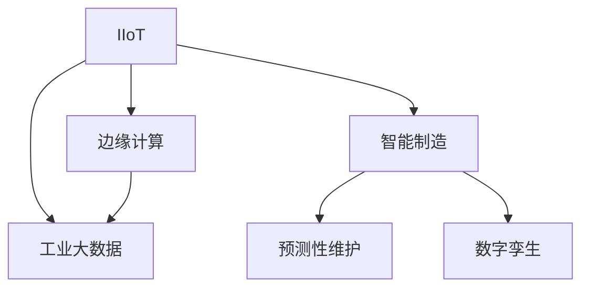
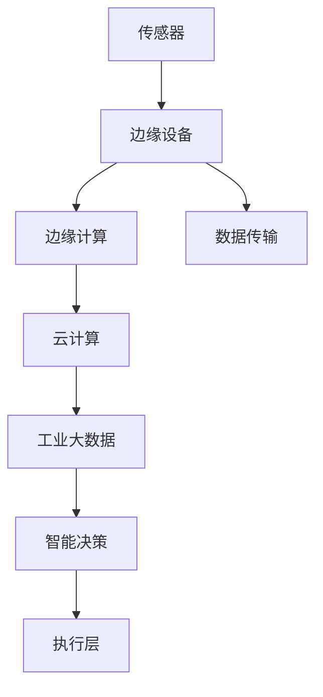

                 

## 1. 背景介绍

### 1.1 问题由来
随着全球工业化进程的推进，制造业面临愈发严峻的挑战：生产效率低、能耗高、质量波动大、运营成本高等问题日益凸显。为了解决这些问题，制造业迫切需要一场以数字化、网络化和智能化为特征的变革。工业物联网（Industrial Internet of Things, IIoT）应运而生，以全新的视角和方法推动工业生产模式的创新，为智能制造的实现提供了强有力的技术支撑。

### 1.2 问题核心关键点
IIoT的核心在于将物理世界的数据进行采集、传输、存储和分析，形成全生命周期的智能管理系统，使得生产流程更加透明、高效、灵活。IIoT的核心技术包括传感器技术、云计算、大数据分析、机器学习等，通过数据驱动的方式优化生产过程，实现预测性维护、质量控制、供应链优化、智能设备管理等功能，推动制造业的智能化转型。

### 1.3 问题研究意义
IIoT技术对于提升制造业的竞争力、保障生产安全、降低运营成本、推动可持续发展具有重要意义。智能制造通过IIoT技术实现了生产过程的精细化管理，提高了生产效率，减少了资源浪费，促进了产业升级。同时，IIoT技术还能够有效应对突发事件，保障生产安全，减少环境污染，实现绿色制造。

## 2. 核心概念与联系

### 2.1 核心概念概述

为更好地理解IIoT技术及其在智能制造中的应用，本节将介绍几个关键概念：

- **工业物联网（IIoT）**：通过传感器、标签、RFID、摄像头等技术将物理设备连接到互联网，实现设备与设备、设备与人的互联互通，以提升生产效率和产品质量。
- **工业大数据**：指制造业在生产、设计、运维、管理等各环节产生的大量结构化和非结构化数据，通过数据清洗、分析挖掘等手段，为智能决策提供依据。
- **边缘计算**：指在数据源附近进行数据处理、存储和分析，减少数据传输延时，提高数据处理的实时性。
- **智能制造**：通过互联网、物联网、大数据、云计算、人工智能等技术手段，实现制造全过程的数字化、网络化和智能化，提升制造效率和产品质量，优化资源配置，降低运营成本。
- **预测性维护**：基于传感器数据和机器学习算法，预测设备故障，提前进行维护，减少生产中断，延长设备使用寿命。
- **数字孪生**：通过3D建模和仿真技术，构建虚拟的制造系统，实现虚拟与现实的同步更新，提升生产规划和决策的科学性和精确性。

这些核心概念之间的逻辑关系可以通过以下Mermaid流程图来展示：



### 2.2 核心概念原理和架构的 Mermaid 流程图



## 3. 核心算法原理 & 具体操作步骤
### 3.1 算法原理概述

IIoT的核心算法原理可以归结为数据的采集、传输、存储和分析四个环节。在这一过程中，传感器技术、边缘计算、大数据分析和机器学习等技术被广泛应用于各个环节，实现了对物理世界的数字化和智能化管理。

### 3.2 算法步骤详解

**Step 1: 传感器数据采集**
在工业生产中，传感器被广泛应用于各类物理设备和生产环境中，用于实时监测设备的运行状态和生产环境参数。传感器采集的数据包括温度、湿度、振动、压力、流量等，涵盖了从设备、生产环境到产品质量的各个方面。这些数据经过边缘计算平台处理后，上传至云端。

**Step 2: 数据传输和存储**
采集到的数据需要经过边缘计算平台进行初步处理和分析，以减少数据传输延时和网络带宽消耗。边缘计算平台通常具备高效的数据压缩和本地存储能力，能够快速响应生产现场的实时需求。处理后的数据通过5G、Wi-Fi、WiMAX等网络传输至云端。

**Step 3: 数据分析和决策**
在云端，工业大数据平台对采集到的数据进行清洗、分析和挖掘，形成结构化和非结构化数据，供智能决策支持。数据存储在云数据库中，可以使用Hadoop、Spark等分布式计算框架进行高效处理。数据分析和挖掘主要采用机器学习算法，如聚类、分类、回归、预测等，为生产优化、设备维护、供应链管理等提供决策支持。

**Step 4: 智能决策与执行**
基于数据分析的结果，通过智能决策系统生成生产计划、设备维护方案、质量控制指令等，驱动生产执行层实施相应的操作。执行层包括自动化生产线和智能设备，可以自动调整生产参数、调度资源、进行预测性维护等。

### 3.3 算法优缺点

IIoT技术在推动智能制造方面具有以下优点：
1. **高效实时性**：通过边缘计算和云计算的结合，数据处理和决策分析的实时性大大提升，能够及时响应生产现场的变化。
2. **数据驱动决策**：工业大数据平台能够提供全面、准确的生产数据，支持基于数据的决策，提升决策的科学性和精确性。
3. **资源优化配置**：通过数据驱动的生产优化和设备维护，能够有效降低资源浪费，提高资源利用率。
4. **系统协同管理**：通过IIoT平台，实现了设备和设备、设备与人之间的协同管理，提升了系统整体的运营效率。

同时，IIoT技术也存在一些缺点：
1. **初始投资高**：IIoT系统的搭建和维护需要较高的初期投资，特别是在硬件设备和网络基础设施方面。
2. **数据安全问题**：工业数据包含大量敏感信息，数据传输和存储过程中存在被窃取、篡改的风险。
3. **技术复杂度高**：IIoT系统的建设和运行需要跨学科的技术支撑，涉及传感器技术、网络通信、数据处理、机器学习等多方面的知识。
4. **数据隐私保护**：在数据分析过程中，需要保护数据的隐私性和安全性，防止数据泄露和滥用。

尽管存在这些缺点，但IIoT技术的综合优势使其成为推动智能制造不可或缺的核心驱动力。

### 3.4 算法应用领域

IIoT技术广泛应用于智能制造的各个环节，包括但不限于以下领域：

- **预测性维护**：通过对设备运行数据的实时监控和分析，预测设备故障，提前进行维护，减少生产中断。
- **质量控制**：通过传感器采集生产过程中的数据，实时监测产品质量，及时发现和纠正缺陷。
- **供应链优化**：通过物联网技术对供应链各环节进行实时监控，优化物流、库存管理，提升供应链的灵活性和响应速度。
- **智能设备管理**：通过IIoT平台对生产设备进行远程监控和维护，实现设备状态的全方位管理。
- **能效管理**：通过对生产过程中能耗数据的监控和分析，实现能源的合理利用，降低能耗和成本。
- **环境监测**：通过对生产现场的环境数据进行监测，保障生产环境的稳定和安全性。

## 4. 数学模型和公式 & 详细讲解 & 举例说明

### 4.1 数学模型构建

在IIoT系统中，数据采集、传输、存储和分析的过程可以抽象为以下几个数学模型：

- **传感器数据采集模型**：
  \[
  \begin{aligned}
  s_t &= f(x_t, \theta) \\
  y_t &= h(s_t)
  \end{aligned}
  \]
  其中，$s_t$ 表示传感器在时间$t$采集的数据，$f(x_t, \theta)$ 表示数据采集函数，$x_t$ 为传感器输入，$\theta$ 为传感器参数，$y_t$ 为传感器的输出信号。

- **数据传输模型**：
  \[
  y'_t = g(y_t)
  \]
  其中，$y'_t$ 表示经过传输后的数据，$g(y_t)$ 表示数据传输函数，$y_t$ 为原始数据。

- **数据存储模型**：
  \[
  D = \{d_t\}_{t=1}^T
  \]
  其中，$D$ 表示存储在云数据库中的数据集，$d_t$ 为时间$t$采集到的数据。

- **数据分析和决策模型**：
  \[
  \hat{y} = m(d_t, \alpha)
  \]
  其中，$\hat{y}$ 表示数据分析和挖掘后的结果，$m(d_t, \alpha)$ 表示数据分析函数，$d_t$ 为存储在数据库中的数据，$\alpha$ 为模型参数。

### 4.2 公式推导过程

以预测性维护为例，假设传感器采集到的设备运行数据为$s_t$，经过传输后得到$y'_t$，存储在数据库$D$中。通过机器学习算法，可以对设备故障进行预测，生成预测结果$\hat{y}$。具体推导过程如下：

1. 数据预处理：将原始数据$s_t$进行清洗、去噪、归一化等预处理，得到处理后的数据$d_t$。
2. 特征提取：从预处理后的数据中提取有用的特征，如温度变化、振动信号、设备参数等。
3. 模型训练：使用历史数据集$D$进行模型训练，得到预测模型$m$。
4. 预测结果：将当前采集到的数据$s_t$输入模型$m$中，得到预测结果$\hat{y}$。

### 4.3 案例分析与讲解

以某制造业生产线为例，生产线上的传感器实时监测设备运行数据。采集到的数据包括设备温度、振动、电流等信号。通过对这些数据进行特征提取和机器学习训练，可以实现对设备故障的预测，提前进行维护。具体步骤如下：

1. 数据采集：生产线上的传感器实时监测设备温度、振动等参数，并将数据上传至边缘计算平台。
2. 数据传输：边缘计算平台对采集到的数据进行初步处理，并将处理后的数据上传至云端。
3. 数据分析：云端的大数据分析平台对上传的数据进行清洗、去噪和特征提取，得到设备运行状态的特征向量。
4. 模型训练：使用历史设备故障数据进行机器学习模型训练，生成预测模型$m$。
5. 预测结果：将当前采集到的设备运行状态特征向量输入模型$m$中，得到设备故障预测结果$\hat{y}$。
6. 执行维护：根据预测结果$\hat{y}$，调度维护人员进行设备维护，减少生产中断。

## 5. 项目实践：代码实例和详细解释说明

### 5.1 开发环境搭建

在进行IIoT系统开发前，需要准备好开发环境。以下是使用Python进行IIoT开发的流程：

1. 安装Python：从官网下载并安装Python，选择适合的版本和安装路径。
2. 安装相关依赖库：使用pip安装必要的库，如TensorFlow、Pandas、Scikit-learn等。
3. 配置传感器和边缘计算设备：根据实际需求，选择合适的传感器和边缘计算平台，并进行配置和连接。
4. 搭建云平台：使用AWS、Azure、阿里云等云服务搭建数据存储和分析平台。

### 5.2 源代码详细实现

以下是一个简单的IIoT系统代码实现示例，用于采集传感器数据、进行数据处理和传输、最终生成预测结果。

```python
import pandas as pd
import numpy as np
from sklearn.ensemble import RandomForestRegressor
import paho.mqtt.client as mqtt

# 传感器数据采集
class SensorData:
    def __init__(self, sensor_id):
        self.sensor_id = sensor_id
        self.data = []
        self.client = mqtt.Client()
        self.client.on_connect = self.on_connect
        self.client.on_message = self.on_message

    def on_connect(self, client, userdata, flags, rc):
        client.subscribe("sensor/" + self.sensor_id)

    def on_message(self, client, userdata, msg):
        data = msg.payload.decode()
        self.data.append(float(data))

    def get_data(self):
        return np.array(self.data)

# 数据传输
class DataTransmitter:
    def __init__(self):
        self.client = mqtt.Client()
        self.client.on_connect = self.on_connect
        self.client.on_message = self.on_message

    def on_connect(self, client, userdata, flags, rc):
        client.connect("broker", 1883, 1883)

    def on_message(self, client, userdata, msg):
        data = msg.payload.decode()
        self.client.publish("data", data)

    def send_data(self, sensor_data):
        for data in sensor_data:
            self.client.publish("sensor/data", str(data))

# 数据存储和分析
class DataStorage:
    def __init__(self, database_url):
        self.database_url = database_url
        self.data = []

    def save_data(self, data):
        self.data.append(data)
        pd.DataFrame(self.data).to_csv(self.database_url, index=False)

    def load_data(self):
        return pd.read_csv(self.database_url)

    def analyze_data(self, data):
        model = RandomForestRegressor()
        model.fit(data)
        return model.predict(data)

# 主程序
if __name__ == "__main__":
    sensor = SensorData("temperature")
    transmitter = DataTransmitter()
    storage = DataStorage("data.csv")

    # 连接传感器和边缘计算平台
    sensor.client.connect("broker", 1883, 1883)
    sensor.client.loop_start()

    # 连接数据传输平台
    transmitter.client.connect("broker", 1883, 1883)
    transmitter.client.loop_start()

    # 连接云平台
    storage.save_data(sensor.get_data())

    # 数据分析和预测
    data = storage.load_data()
    model = storage.analyze_data(data)

    # 输出预测结果
    print(model)
```

### 5.3 代码解读与分析

在上述代码示例中，我们使用了Python的Paho MQTT库进行传感器数据的采集和传输，以及pandas库进行数据的存储和分析。具体分析如下：

**SensorData类**：
- `__init__`方法：初始化传感器ID和数据列表，创建MQTT客户端。
- `on_connect`方法：连接MQTT服务器，订阅传感器数据。
- `on_message`方法：接收传感器数据，添加到数据列表中。
- `get_data`方法：返回传感器数据列表。

**DataTransmitter类**：
- `__init__`方法：创建MQTT客户端。
- `on_connect`方法：连接MQTT服务器。
- `on_message`方法：接收传感器数据，发布至数据传输平台。
- `send_data`方法：将传感器数据发送至数据传输平台。

**DataStorage类**：
- `__init__`方法：初始化云数据库连接。
- `save_data`方法：将传感器数据存储到云数据库中。
- `load_data`方法：从云数据库中读取数据。
- `analyze_data`方法：使用随机森林算法进行数据分析，生成预测模型。

**主程序**：
- 创建传感器、数据传输平台和云平台。
- 连接传感器和数据传输平台。
- 连接云平台，保存传感器数据。
- 从云平台读取数据，进行数据分析和预测。
- 输出预测结果。

通过这个简单的示例，可以看到，IIoT系统开发的基本流程包括数据采集、传输、存储和分析。开发者可以根据实际需求，进一步扩展和优化这些功能。

## 6. 实际应用场景

### 6.1 智能制造

在智能制造领域，IIoT技术的应用已经取得了显著成效。通过实时监控设备运行状态和生产环境参数，可以实现设备预测性维护、生产过程优化、供应链管理等功能。

**案例分析**：某汽车制造企业通过部署IIoT系统，实现了对生产线的实时监控和预测性维护。通过采集设备运行数据，实现了设备故障的及时预警和预测，减少了生产中断，提高了设备利用率和生产效率。

### 6.2 智慧能源

智慧能源是IIoT技术的重要应用领域。通过实时监测能源设备的运行状态和能耗数据，可以优化能源管理，降低能耗和运营成本。

**案例分析**：某电力公司通过部署IIoT系统，实现了对电网设备的实时监控和能耗优化。通过采集设备运行数据，实时分析设备运行状态，优化设备运行参数，减少了能源浪费，降低了运营成本。

### 6.3 智慧城市

智慧城市是IIoT技术的另一大应用场景。通过实时监测城市基础设施和公共环境数据，可以实现城市管理智能化、安全监控、交通优化等功能。

**案例分析**：某智慧城市通过部署IIoT系统，实现了对城市交通和公共环境的实时监控和管理。通过采集交通流量、环境污染等数据，实时分析城市运行状态，优化交通管理和公共服务，提升了城市管理效率。

### 6.4 未来应用展望

未来，IIoT技术将在更多领域得到应用，推动各行各业的智能化转型：

1. **智能农业**：通过实时监测土壤、气候等环境数据，优化农业生产过程，提高农作物产量和质量。
2. **智能物流**：通过实时监控物流环节数据，优化物流管理和配送，提高物流效率和用户体验。
3. **智能医疗**：通过实时监测患者生命体征和医疗设备状态，实现个性化医疗和精准医疗，提升医疗服务质量。
4. **智能家居**：通过实时监测家居环境数据，优化家居设备控制和家庭管理，提升居住舒适度和安全性。

随着IIoT技术的不断发展和完善，其应用场景将更加广泛，推动各行各业的智能化转型和升级。

## 7. 工具和资源推荐

### 7.1 学习资源推荐

为了帮助开发者掌握IIoT技术的原理和实践，以下是一些推荐的资源：

1. **《工业物联网》（工业物联网与智能制造）**：系统介绍IIoT技术和应用，涵盖传感器、边缘计算、云计算、大数据、人工智能等多个方面。
2. **《IIoT（工业物联网）实战指南》**：实战指导IIoT系统的开发和部署，提供详细的代码示例和技术栈推荐。
3. **工业物联网（IIoT）课程**：在线课程，涵盖IIoT技术的原理、应用和实践，适合初学者和进阶开发者。
4. **开源IIoT平台**：如ThingWorx、ThingLink、IoT Exchange等，提供完整的IIoT系统架构和开发工具。

### 7.2 开发工具推荐

为了提高IIoT系统的开发效率，以下是一些推荐的工具：

1. **MQTT**：轻量级消息传输协议，广泛用于传感器数据传输。
2. **TensorFlow**：开源深度学习框架，适合进行机器学习模型的训练和优化。
3. **Pandas**：数据分析库，适合进行数据清洗、处理和分析。
4. **Scikit-learn**：机器学习库，适合进行数据分析和模型训练。
5. **IoT平台**：如ThingWorx、ThingLink、IoT Exchange等，提供完整的IIoT系统开发和部署工具。

### 7.3 相关论文推荐

IIoT技术的发展离不开学术界的持续研究。以下是几篇相关的经典论文，推荐阅读：

1. **《工业物联网：现状、挑战与未来》**：系统介绍IIoT技术的现状、挑战和未来发展方向。
2. **《智能制造与IIoT技术》**：探讨IIoT技术在智能制造中的应用，提出基于IIoT的智能制造模型。
3. **《基于IIoT的能源管理与优化》**：研究IIoT技术在能源管理中的应用，提出基于IIoT的能源优化模型。
4. **《基于IIoT的城市智能管理》**：探讨IIoT技术在智慧城市中的应用，提出基于IIoT的城市管理模型。

## 8. 总结：未来发展趋势与挑战

### 8.1 研究成果总结

IIoT技术在推动智能制造和智慧城市等方面取得了显著成效，为各行各业提供了智能化转型的新思路和解决方案。未来，IIoT技术将更加广泛地应用于各个领域，推动社会的智能化转型。

### 8.2 未来发展趋势

IIoT技术的未来发展趋势如下：

1. **技术融合**：IIoT技术将与人工智能、区块链、云计算等技术进行深度融合，形成更加智能化的解决方案。
2. **边缘计算**：边缘计算将成为IIoT系统的重要支撑，提升数据处理的实时性和安全性。
3. **数据治理**：数据隐私和安全问题将更加重要，数据治理和隐私保护技术将得到广泛应用。
4. **跨行业应用**：IIoT技术将广泛应用于农业、物流、医疗等多个行业，推动各行各业的智能化转型。
5. **自适应系统**：基于IIoT的自适应系统将更加普及，提升系统的灵活性和适应性。

### 8.3 面临的挑战

尽管IIoT技术在推动智能化转型方面取得了显著进展，但仍面临一些挑战：

1. **技术标准不统一**：IIoT系统的技术标准尚未统一，导致系统互操作性差，影响了系统的部署和应用。
2. **数据安全和隐私**：IIoT系统包含大量敏感数据，数据安全和隐私保护问题亟待解决。
3. **数据处理和存储**：IIoT系统产生的数据量巨大，数据处理和存储需求高，需要高效的数据管理技术。
4. **技术复杂性**：IIoT系统的开发和部署需要跨学科的知识和技术，存在较高的技术门槛。
5. **设备兼容性和互操作性**：IIoT设备种类繁多，兼容性问题影响系统的整体效率。

### 8.4 研究展望

未来的IIoT技术研究将主要集中在以下几个方面：

1. **统一技术标准**：推动IIoT技术的标准化，提升系统互操作性，降低开发和部署成本。
2. **数据安全和隐私**：研究和开发高效的数据加密和隐私保护技术，确保数据安全。
3. **边缘计算和云计算融合**：探索边缘计算和云计算的融合应用，提升数据处理的实时性和安全性。
4. **跨行业应用**：研究和开发适用于不同行业的IIoT解决方案，推动各行各业的智能化转型。
5. **自适应系统**：研究和开发基于IIoT的自适应系统，提升系统的灵活性和适应性。

## 9. 附录：常见问题与解答

**Q1: IIoT和IoT有什么区别？**

A: IIoT是IoT的高级形式，是物联网在工业领域的应用。IIoT系统主要应用于制造业、能源、交通、城市管理等领域，通过实时监控和分析设备运行数据，实现设备的预测性维护、生产优化、能效管理等功能，推动行业的智能化转型。

**Q2: IIoT系统需要哪些技术支持？**

A: IIoT系统需要传感器技术、边缘计算、大数据分析、云计算、机器学习等多种技术支持。传感器用于实时采集设备运行数据，边缘计算用于数据初步处理和本地存储，大数据分析用于数据清洗和分析挖掘，云计算用于数据存储和模型训练，机器学习用于数据分析和预测。

**Q3: 部署IIoT系统需要哪些硬件设备？**

A: 部署IIoT系统需要传感器、边缘计算设备、云计算服务器、数据库等多种硬件设备。传感器用于实时采集数据，边缘计算设备用于数据处理和本地存储，云计算服务器用于数据存储和模型训练，数据库用于存储和分析数据。

**Q4: IIoT系统面临哪些挑战？**

A: IIoT系统面临技术标准不统一、数据安全和隐私、数据处理和存储、技术复杂性、设备兼容性和互操作性等挑战。解决这些挑战需要标准化、安全技术、高效数据管理、跨学科技术、设备兼容性等多方面的努力。

**Q5: IIoT技术在智能制造中的应用有哪些？**

A: IIoT技术在智能制造中的应用包括设备预测性维护、生产过程优化、供应链管理、智能设备管理、能效管理等。通过实时监控设备运行状态和生产环境参数，实现设备故障的及时预警和预测，优化生产过程，提高生产效率和产品质量。

---

作者：禅与计算机程序设计艺术 / Zen and the Art of Computer Programming

