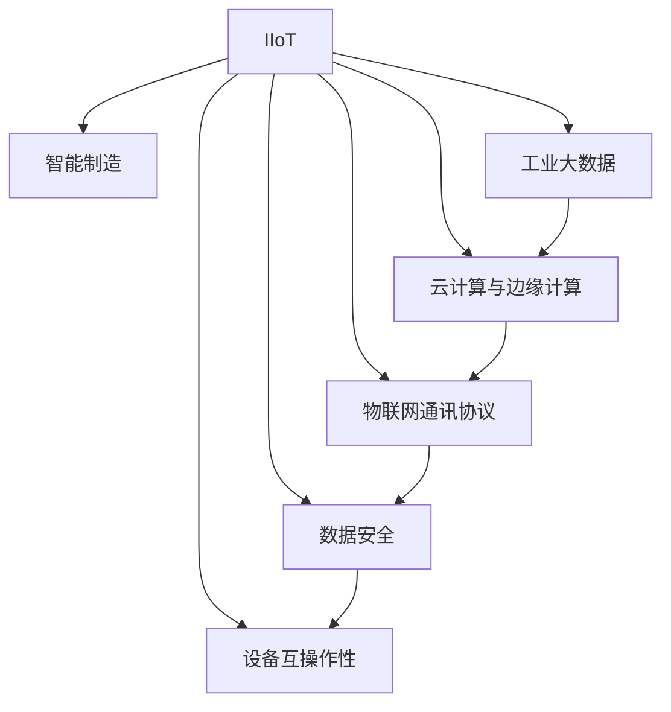

                 

# 工业物联网（IIoT）：智能制造的核心驱动力

## 1. 背景介绍

### 1.1 问题由来
工业物联网（Industrial Internet of Things，IIoT）作为第四次工业革命的重要组成部分，正在推动制造业向智能化、数字化方向转型升级。传统制造业通过机械自动化实现了生产的流水线化和规模化，但缺乏对生产全生命周期的管理和优化。基于物联网（IoT）和互联网（Internet）的集成，IIoT赋予了制造过程以网络化、智能化特征，从设计、生产、物流、运维等环节，形成了无缝连接，实现了数据的实时采集、分析、共享与反馈。

IIoT的引入为智能制造带来了深远影响，不仅大幅提升了生产效率、降低了成本，还大大改善了产品质量和用户服务。然而，IIoT的落地应用仍面临诸多挑战，如数据安全、系统复杂度、设备互操作性等。如何克服这些挑战，充分发挥IIoT的潜力，成为智能制造发展亟待解决的问题。本文将从IIoT的概念、核心技术、应用场景等多个方面，系统梳理IIoT的核心驱动力及其关键技术实现。

## 2. 核心概念与联系

### 2.1 核心概念概述

为更好地理解IIoT的核心驱动力，本节将介绍几个关键概念：

- **工业物联网（IIoT）**：将物联网技术引入工业生产领域，通过传感器、通讯协议、智能设备等，实现生产数据的网络化、实时化和可视化，提升制造效率和质量。

- **工业4.0**：德国政府提出的智能制造战略，旨在通过信息技术和网络技术，促进制造业的数字化、网络化和智能化，实现虚拟与现实的融合。

- **智能制造（Smart Manufacturing）**：利用物联网、大数据、人工智能等技术，实现从设计、生产到运维的全生命周期管理，提高制造过程的自动化、智能化水平。

- **工业大数据**：指在工业生产过程中，通过传感器、监控设备、人机交互等方式采集的大量数据，经过清洗、处理后形成的可用于分析、优化和决策的数据集。

- **云计算与边缘计算**：云计算提供海量计算资源和存储能力，边缘计算将数据处理从云端移到靠近数据源的本地设备，实现实时处理和分析，提升系统响应速度和可靠性。

- **物联网通讯协议（IoT Protocols）**：包括MQTT、CoAP、AMQP等，用于工业设备间的数据传输和通信，是IIoT系统互联互通的基石。

- **数据安全（Data Security）**：IIoT系统涉及大量敏感的生产数据，需要通过加密、认证等手段保障数据安全，避免数据泄露和篡改。

- **设备互操作性（Device Interoperability）**：工业设备的种类繁多，接口标准不一，需要通过统一的标准和协议，实现设备间的无缝对接。

这些核心概念之间的逻辑关系可以通过以下Mermaid流程图来展示：



这个流程图展示了大语言模型的核心概念及其之间的关系：

1. IIoT通过传感器、通讯协议等手段，实现了数据的采集和传输。
2. 工业大数据为智能制造提供数据支持，云计算与边缘计算实现数据的存储与处理。
3. 物联网通讯协议保证了设备间的互联互通，数据安全与设备互操作性是IIoT系统高效运行的基础。

这些概念共同构成了IIoT的工作框架，使得制造过程在数字化、网络化和智能化的基础上，进一步实现了全生命周期的优化。

## 3. 核心算法原理 & 具体操作步骤
### 3.1 算法原理概述

IIoT的核心算法原理主要围绕数据采集、传输、处理、分析和应用进行设计。其核心思想是通过集成传感器、边缘计算和云计算技术，实现生产数据的实时采集、存储、分析和应用，从而实现智能制造。

具体来说，IIoT系统的运行流程包括数据采集、数据传输、数据处理和数据应用四个阶段。其中，数据采集阶段通过传感器、摄像头、RFID等设备，实时收集生产现场的各项数据；数据传输阶段利用物联网通讯协议，将采集的数据传输到边缘计算设备和云平台；数据处理阶段在云端对数据进行清洗、分析、建模和优化；数据应用阶段将处理后的数据反馈到生产线，用于生产过程的监控、优化和决策支持。

### 3.2 算法步骤详解

IIoT的核心算法步骤如下：

1. **数据采集**：在生产现场布设传感器、监控设备、RFID标签等，实时采集生产过程中的各项数据，包括温度、湿度、压力、振动、能耗、人流等。

2. **数据传输**：将采集到的数据通过工业物联网通讯协议，如MQTT、CoAP、AMQP等，传输到边缘计算设备和云平台。边缘计算设备负责对数据进行初步处理和分析，云平台则进行大规模数据存储和复杂分析。

3. **数据处理**：在云平台对数据进行清洗、去噪、过滤、分析和建模。常用的数据处理方法包括时间序列分析、预测模型、异常检测、故障诊断等。

4. **数据应用**：将处理后的数据反馈到生产线，用于生产过程的监控、优化和决策支持。具体应用场景包括设备状态预测、工艺优化、质量控制、能源管理等。

### 3.3 算法优缺点

IIoT算法具有以下优点：

1. **实时性**：通过边缘计算和云计算的结合，实现了数据的实时采集、处理和反馈，提升了制造过程的灵活性和响应速度。

2. **数据融合**：将多源异构数据进行融合，形成了统一的数据视图，为智能制造提供了全面的决策依据。

3. **自动化**：通过自动化设备和系统集成，实现了制造过程的智能化，大幅提升了生产效率和质量。

4. **灵活性**：IIoT系统可以根据生产需求，灵活配置传感器和通讯协议，支持多种生产场景和工艺流程。

但同时也存在一些局限性：

1. **系统复杂性**：IIoT系统集成了多种技术，如传感器、通讯协议、云计算、边缘计算等，系统架构复杂，部署和维护成本较高。

2. **数据安全性**：IIoT系统涉及大量敏感的生产数据，数据泄露和篡改风险较高，需要严格的数据安全措施。

3. **设备互操作性**：工业设备的种类繁多，接口标准不一，设备间的互操作性仍需进一步提升。

4. **数据处理能力**：大规模数据处理和分析需要强大的计算资源和存储能力，云平台的数据处理能力需进一步提升。

5. **成本高**：部署和维护IIoT系统需要投入大量的硬件和软件资源，初期成本较高。

### 3.4 算法应用领域

IIoT技术已经在多个领域得到了广泛应用，包括：

1. **智能工厂**：通过传感器、监控设备等，实时采集生产现场的数据，实现设备状态监控、工艺优化、质量控制等功能，提升生产效率和质量。

2. **设备维护**：通过预测性维护技术，实时监测设备的运行状态，预测设备的故障和维护需求，减少停机时间和维护成本。

3. **能耗管理**：通过能耗监控系统，实时采集和分析生产过程中的能耗数据，优化能源使用，降低能耗成本。

4. **供应链管理**：通过物联网技术，实时监控物流信息，优化库存管理，提高供应链的效率和响应速度。

5. **产品质量控制**：通过传感器和监控设备，实时采集产品质量数据，进行质量检测和分析，确保产品符合质量标准。

6. **环境监测**：通过环境监测设备，实时采集环境数据，优化生产环境，减少环境污染。

除了上述这些经典应用外，IIoT还被创新性地应用到更多场景中，如智能仓储、智能物流、智能交通等，为智能制造技术带来了全新的突破。

## 4. 数学模型和公式 & 详细讲解  
### 4.1 数学模型构建

IIoT的数学模型主要涉及数据采集、传输、处理和应用的数学方法。其中，数据采集和传输是物理层面的问题，可以通过传感器和通信协议进行建模；数据处理和应用是计算层面的问题，可以通过机器学习、预测模型、优化算法等进行建模。

以设备状态监测为例，假设设备状态由若干传感器监测，传感器数据为 $x_1, x_2, \ldots, x_n$，设备状态为 $y$。通过线性回归模型进行建模，有：

$$
y = \sum_{i=1}^n w_i x_i + b
$$

其中 $w_i$ 为第 $i$ 个传感器的权重，$b$ 为截距。通过对历史数据进行训练，可以求得 $w_i$ 和 $b$ 的值，从而实现对设备状态的预测。

### 4.2 公式推导过程

以预测性维护为例，假设设备状态监测数据为 $x_1, x_2, \ldots, x_n$，设备故障时间为 $t$，设备运行时间为 $T$。通过马尔科夫模型进行建模，有：

$$
P(t) = \sum_{i=1}^n w_i P(x_i, t)
$$

其中 $P(x_i, t)$ 表示在时间 $t$ 设备状态为 $x_i$ 的概率。通过对历史数据进行训练，可以求得 $w_i$ 和 $P(x_i, t)$ 的值，从而实现对设备故障时间的预测。

### 4.3 案例分析与讲解

假设某生产线上有若干台机器，每台机器都有一个传感器用于监测其运行状态。传感器数据 $x_1, x_2, \ldots, x_n$ 实时采集，设备状态 $y$ 表示是否发生故障。

通过线性回归模型进行建模，有：

$$
y = w_1 x_1 + w_2 x_2 + \ldots + w_n x_n + b
$$

其中 $w_i$ 表示第 $i$ 个传感器的权重，$b$ 表示截距。通过对历史数据进行训练，可以求得 $w_i$ 和 $b$ 的值，从而实现对设备状态的预测。

例如，假设某台机器的传感器数据为 $x_1=0.5$，$x_2=0.8$，$x_3=0.1$。通过训练，得到 $w_1=0.2$，$w_2=0.3$，$w_3=0.5$，$b=0.1$。

代入模型公式，计算设备状态 $y$：

$$
y = 0.2 \times 0.5 + 0.3 \times 0.8 + 0.5 \times 0.1 + 0.1 = 0.63
$$

如果 $y$ 大于某个阈值，则表示设备可能发生故障，需要进行维护。

## 5. 项目实践：代码实例和详细解释说明
### 5.1 开发环境搭建

在进行IIoT项目开发前，我们需要准备好开发环境。以下是使用Python进行IoT项目开发的环境配置流程：

1. 安装Anaconda：从官网下载并安装Anaconda，用于创建独立的Python环境。

2. 创建并激活虚拟环境：
```bash
conda create -n iot-env python=3.8 
conda activate iot-env
```

3. 安装IoT相关库：
```bash
pip install paho-mqtt
pip install iotmaker
```

4. 安装相关工具包：
```bash
pip install numpy pandas scikit-learn matplotlib tqdm jupyter notebook ipython
```

完成上述步骤后，即可在`iot-env`环境中开始IIoT项目开发。

### 5.2 源代码详细实现

下面我们以设备状态监测项目为例，给出使用Python进行IIoT项目的代码实现。

首先，定义设备状态监测的类：

```python
import numpy as np
import pandas as pd
from sklearn.linear_model import LinearRegression
from sklearn.model_selection import train_test_split

class DeviceStatusMonitor:
    def __init__(self, sensors, weights, bias):
        self.sensors = sensors
        self.weights = weights
        self.bias = bias
        self.model = LinearRegression()
    
    def predict(self, sensor_values):
        predicted_status = self.model.predict([sensor_values])
        return predicted_status[0]
```

然后，加载历史数据并进行模型训练：

```python
data = pd.read_csv('device_status.csv')
sensors = data[['Sensor1', 'Sensor2', 'Sensor3']]
labels = data['Status']

X_train, X_test, y_train, y_test = train_test_split(sensors, labels, test_size=0.2)

# 训练模型
self.model.fit(X_train, y_train)

# 预测设备状态
predicted_status = self.predict([0.5, 0.8, 0.1])
print(predicted_status)
```

最后，启动设备状态监测服务：

```python
from iotmaker import MQTTBroker

broker = MQTTBroker('localhost')
broker.subscribe('sensor1', self.handle_sensor1)
broker.subscribe('sensor2', self.handle_sensor2)
broker.subscribe('sensor3', self.handle_sensor3)

def handle_sensor1(self, message):
    sensor1_value = float(message.payload)
    self.sensor_values[0] = sensor1_value

def handle_sensor2(self, message):
    sensor2_value = float(message.payload)
    self.sensor_values[1] = sensor2_value

def handle_sensor3(self, message):
    sensor3_value = float(message.payload)
    self.sensor_values[2] = sensor3_value

predicted_status = self.predict(self.sensor_values)
print(predicted_status)
```

以上就是使用Python进行IIoT设备状态监测的完整代码实现。可以看到，通过IoT库和机器学习库的结合，我们可以很容易地实现设备状态的实时监测和预测。

### 5.3 代码解读与分析

让我们再详细解读一下关键代码的实现细节：

**DeviceStatusMonitor类**：
- `__init__`方法：初始化传感器数据、传感器权重、截距等关键组件。
- `predict`方法：将传感器数据输入模型，预测设备状态。

**数据加载和模型训练**：
- 使用pandas加载历史数据，分为训练集和测试集。
- 通过train_test_split方法进行数据划分。
- 使用sklearn的LinearRegression模型进行训练。
- 在训练完成后，使用训练好的模型进行预测。

**设备状态监测服务**：
- 使用iotmaker库的MQTTBroker实现设备状态的实时监测。
- 订阅各个传感器的主题，将传感器数据存储到self.sensor_values中。
- 使用预测模型对传感器数据进行预测，得到设备状态。

可以看到，IIoT项目的开发过程相对复杂，需要同时处理传感器数据、模型训练、实时监测等多个环节。但通过合理的代码设计，可以有效地实现项目的各项功能。

## 6. 实际应用场景
### 6.1 智能工厂

IIoT技术在智能工厂中的应用非常广泛，通过传感器、监控设备等，实时采集生产现场的数据，实现设备状态监控、工艺优化、质量控制等功能，提升生产效率和质量。

例如，某智能工厂通过传感器实时监测生产设备的状态，通过设备状态预测模型，预测设备是否发生故障。一旦预测到故障，系统会立即发出警报，调度维修人员进行维护。这种预测性维护技术，大幅降低了设备故障率和维护成本，提高了生产效率。

### 6.2 设备维护

IIoT技术在设备维护中的应用，主要通过预测性维护技术实现。通过实时监测设备运行数据，预测设备故障和维护需求，减少停机时间和维护成本。

例如，某制药厂通过IIoT系统实时监测设备运行状态，使用预测模型预测设备故障时间。当预测到设备可能发生故障时，系统自动通知维修人员进行预防性维护，避免设备故障对生产造成影响。这种预测性维护技术，不仅提高了设备可靠性，还显著降低了维护成本。

### 6.3 能耗管理

IIoT技术在能耗管理中的应用，主要通过实时监测和优化生产过程中的能耗，降低能耗成本。

例如，某化工厂通过IIoT系统实时监测生产过程中的能耗数据，使用优化算法对生产工艺进行优化，降低能源消耗。这种能耗管理技术，不仅提高了能源使用效率，还减少了企业的能耗成本。

### 6.4 未来应用展望

随着IIoT技术的不断发展和应用，未来在智能制造领域将呈现以下几个发展趋势：

1. **边缘计算**：边缘计算将数据处理从云端移到本地设备，实现实时处理和分析，提升系统响应速度和可靠性。

2. **5G技术**：5G技术提供更高的通信带宽和更低的延迟，支持更高效的物联网设备和数据传输，促进IIoT系统的普及和应用。

3. **人工智能**：AI技术进一步融入IIoT系统，提升数据处理和分析的智能化水平，实现更精准的生产优化和决策支持。

4. **数据安全**：随着IIoT系统的普及，数据安全和隐私保护将成为重要的研究方向。需通过加密、认证等手段保障数据安全，避免数据泄露和篡改。

5. **标准规范**：制定统一的IIoT标准和规范，提高设备的互操作性和系统的可扩展性，促进IIoT系统的普及和应用。

6. **人机协作**：IIoT系统将更多地融入人机协作场景，通过人机交互提升系统的智能化水平，实现更高效的生产和运维。

这些趋势将推动IIoT技术不断向前发展，为智能制造提供更强大、更智能、更安全的技术支持。

## 7. 工具和资源推荐
### 7.1 学习资源推荐

为了帮助开发者系统掌握IIoT的理论基础和实践技巧，这里推荐一些优质的学习资源：

1. **《IoT实战指南》**：这本书全面介绍了IoT技术的原理、实现和应用，适合初学者和实践者。

2. **《工业物联网与智能制造》**：这本书深入探讨了IIoT系统的架构、技术和应用，提供了丰富的案例和实践经验。

3. **Coursera《物联网技术》课程**：由知名大学和公司联合开设的IoT课程，涵盖IoT技术的各个方面，适合进阶学习。

4. **edX《智能制造》课程**：由MIT等名校开设的智能制造课程，深入讲解了智能制造的理论和实践。

5. **IoT Developer Community**：一个IoT开发者社区，提供丰富的学习资源、技术交流和实战经验分享。

通过对这些资源的学习实践，相信你一定能够快速掌握IIoT的精髓，并用于解决实际的智能制造问题。

### 7.2 开发工具推荐

高效的开发离不开优秀的工具支持。以下是几款用于IIoT项目开发的常用工具：

1. **Eclipse IoT Platform**：开源的IoT开发平台，提供多种物联网协议支持和开发工具。

2. **MQTT**：广泛使用的工业物联网通讯协议，支持多种设备类型和数据传输方式。

3. **ThingWorx**：Microsoft推出的工业物联网平台，提供设备管理、数据采集和分析等功能。

4. **OPC UA**：工业自动化领域的主流协议，支持设备的互操作性和数据交换。

5. **Node-RED**：一款开源的IoT开发工具，支持多种物联网设备和协议，提供可视化编程接口。

6. **AWS IoT**：亚马逊推出的IoT平台，提供设备管理、数据存储和分析等功能。

合理利用这些工具，可以显著提升IIoT项目的开发效率，加快创新迭代的步伐。

### 7.3 相关论文推荐

IIoT技术的发展源于学界的持续研究。以下是几篇奠基性的相关论文，推荐阅读：

1. **《物联网：现状、挑战和未来趋势》**：这篇综述论文全面介绍了IoT技术的现状、挑战和未来趋势，适合了解IoT技术的基本概念和研究方向。

2. **《智能制造系统：现状、挑战和未来趋势》**：这篇综述论文深入探讨了智能制造系统的现状、挑战和未来趋势，提供了丰富的理论和实践经验。

3. **《基于物联网的设备状态监测与预测》**：这篇论文研究了基于IIoT系统的设备状态监测和预测方法，提出了多种预测模型和优化算法。

4. **《工业物联网的数据处理与分析》**：这篇论文探讨了IIoT系统中的数据处理和分析技术，提供了丰富的案例和实验结果。

这些论文代表了大语言模型微调技术的发展脉络。通过学习这些前沿成果，可以帮助研究者把握学科前进方向，激发更多的创新灵感。

## 8. 总结：未来发展趋势与挑战

### 8.1 总结

本文对IIoT的核心驱动力及其关键技术实现进行了全面系统的介绍。首先阐述了IIoT的概念、核心技术和应用场景，明确了IIoT在智能制造中的重要作用。其次，从原理到实践，详细讲解了IIoT的数学模型和操作步骤，给出了IIoT项目开发的完整代码实例。同时，本文还广泛探讨了IIoT技术在智能工厂、设备维护、能耗管理等多个领域的应用前景，展示了IIoT技术的巨大潜力。最后，本文精选了IIoT技术的各类学习资源，力求为开发者提供全方位的技术指引。

通过本文的系统梳理，可以看到，IIoT技术正在成为智能制造的重要驱动力，为制造过程的数字化、网络化和智能化提供了坚实的基础。未来，伴随IIoT技术的不断发展，必将进一步推动智能制造的转型升级，为经济社会发展带来深远影响。

### 8.2 未来发展趋势

展望未来，IIoT技术将呈现以下几个发展趋势：

1. **边缘计算普及**：边缘计算将数据处理从云端移到本地设备，实现实时处理和分析，提升系统响应速度和可靠性。

2. **5G技术普及**：5G技术提供更高的通信带宽和更低的延迟，支持更高效的物联网设备和数据传输，促进IIoT系统的普及和应用。

3. **人工智能融合**：AI技术进一步融入IIoT系统，提升数据处理和分析的智能化水平，实现更精准的生产优化和决策支持。

4. **数据安全提升**：随着IIoT系统的普及，数据安全和隐私保护将成为重要的研究方向。需通过加密、认证等手段保障数据安全，避免数据泄露和篡改。

5. **标准规范制定**：制定统一的IIoT标准和规范，提高设备的互操作性和系统的可扩展性，促进IIoT系统的普及和应用。

6. **人机协作增强**：IIoT系统将更多地融入人机协作场景，通过人机交互提升系统的智能化水平，实现更高效的生产和运维。

这些趋势凸显了IIoT技术的发展前景。这些方向的探索发展，必将进一步提升IIoT系统的性能和应用范围，为智能制造提供更强大、更智能、更安全的技术支持。

### 8.3 面临的挑战

尽管IIoT技术已经取得了瞩目成就，但在迈向更加智能化、普适化应用的过程中，它仍面临诸多挑战：

1. **系统复杂性**：IIoT系统集成了多种技术，如传感器、通讯协议、云计算、边缘计算等，系统架构复杂，部署和维护成本较高。

2. **数据安全性**：IIoT系统涉及大量敏感的生产数据，数据泄露和篡改风险较高，需要严格的数据安全措施。

3. **设备互操作性**：工业设备的种类繁多，接口标准不一，设备间的互操作性仍需进一步提升。

4. **数据处理能力**：大规模数据处理和分析需要强大的计算资源和存储能力，云平台的数据处理能力需进一步提升。

5. **成本高**：部署和维护IIoT系统需要投入大量的硬件和软件资源，初期成本较高。

### 8.4 研究展望

面对IIoT面临的挑战，未来的研究需要在以下几个方面寻求新的突破：

1. **边缘计算优化**：优化边缘计算架构，提升数据处理和分析的效率和可靠性，降低云平台负载。

2. **设备互操作性增强**：制定统一的IIoT标准和规范，提高设备的互操作性和系统的可扩展性。

3. **数据安全提升**：引入先进的加密、认证技术，保障IIoT系统的数据安全和隐私保护。

4. **云计算与边缘计算协同**：优化云计算与边缘计算的协同机制，实现数据的高效存储和处理。

5. **低成本方案**：探索低成本的硬件和软件解决方案，降低IIoT系统的部署和维护成本。

6. **智能分析与决策**：通过AI技术提升IIoT系统的智能化水平，实现更精准的生产优化和决策支持。

这些研究方向的探索，必将引领IIoT技术迈向更高的台阶，为智能制造提供更强大、更智能、更安全的技术支持。面向未来，IIoT技术还需要与其他人工智能技术进行更深入的融合，如知识表示、因果推理、强化学习等，多路径协同发力，共同推动智能制造的进步。只有勇于创新、敢于突破，才能不断拓展IIoT的边界，让智能技术更好地造福人类社会。

## 9. 附录：常见问题与解答

**Q1：IIoT技术在智能制造中的应用有哪些？**

A: IIoT技术在智能制造中的应用非常广泛，主要包括以下几个方面：

1. **设备状态监测**：通过传感器实时监测设备运行状态，实现设备状态预测和维护。

2. **工艺优化**：通过实时监测和分析生产过程中的各项数据，优化生产工艺，提高生产效率和产品质量。

3. **质量控制**：通过实时监测和分析产品质量数据，实现质量检测和分析，确保产品符合质量标准。

4. **能源管理**：通过实时监测和优化生产过程中的能耗，降低能源消耗，提高能源使用效率。

5. **供应链管理**：通过物联网技术，实时监控物流信息，优化库存管理，提高供应链的效率和响应速度。

6. **智能工厂**：通过传感器、监控设备等，实时采集生产现场的数据，实现设备状态监控、工艺优化、质量控制等功能，提升生产效率和质量。

这些应用场景展示了IIoT技术的广泛应用前景。

**Q2：如何提升IIoT系统的安全性？**

A: 提升IIoT系统的安全性，可以从以下几个方面入手：

1. **加密技术**：使用先进的加密算法，保护数据在传输和存储过程中的安全性，防止数据泄露和篡改。

2. **认证机制**：引入认证机制，验证设备和用户身份，确保数据来源的可信性和可靠性。

3. **访问控制**：设置严格的访问控制策略，限制设备的访问权限，防止未授权访问。

4. **监控和审计**：通过日志记录和监控，实时检测和防范异常行为，保障系统的安全性。

5. **故障恢复**：制定应急预案，当系统发生故障时，能够快速恢复，保障系统的稳定性和可靠性。

通过综合运用这些技术手段，可以有效提升IIoT系统的安全性，保障数据和系统的安全。

**Q3：IIoT系统如何实现实时数据处理？**

A: IIoT系统通过边缘计算和云计算的结合，实现实时数据处理。

1. **边缘计算**：将数据处理从云端移到本地设备，实现实时处理和分析，提升系统响应速度和可靠性。

2. **云计算**：提供海量计算资源和存储能力，支持大规模数据存储和复杂分析，优化系统性能。

3. **协同机制**：优化云计算与边缘计算的协同机制，实现数据的高效存储和处理。

通过这些技术手段，IIoT系统能够实现实时数据处理，满足智能制造对数据实时性的需求。

**Q4：IIoT系统如何实现设备互操作性？**

A: 实现IIoT系统的设备互操作性，主要通过以下几个方面：

1. **统一标准**：制定统一的IIoT标准和规范，提高设备的互操作性和系统的可扩展性。

2. **协议支持**：引入多种工业物联网协议，如MQTT、CoAP、AMQP等，支持多种设备类型和数据传输方式。

3. **API接口**：提供标准化的API接口，支持设备之间的数据交换和协同工作。

4. **中间件**：引入中间件技术，实现设备间的通信和数据交换，提高系统的互操作性。

通过这些技术手段，IIoT系统能够实现设备互操作性，支持多种设备类型和数据传输方式，提升系统的可扩展性和灵活性。

**Q5：IIoT系统如何实现低成本部署？**

A: IIoT系统的低成本部署，可以从以下几个方面入手：

1. **开源解决方案**：使用开源的IoT平台和工具，降低开发和部署成本。

2. **硬件优化**：选择低成本、高性能的硬件设备，如Raspberry Pi、Arduino等，降低硬件成本。

3. **云平台选择**：选择性价比高的云平台，降低云服务成本。

4. **边缘计算**：通过边缘计算，将数据处理从云端移到本地设备，降低数据传输成本。

5. **优化算法**：优化算法和数据处理流程，提高系统的效率和性能，降低计算成本。

通过这些技术手段，可以有效降低IIoT系统的部署和维护成本，实现低成本部署。

---

作者：禅与计算机程序设计艺术 / Zen and the Art of Computer Programming

