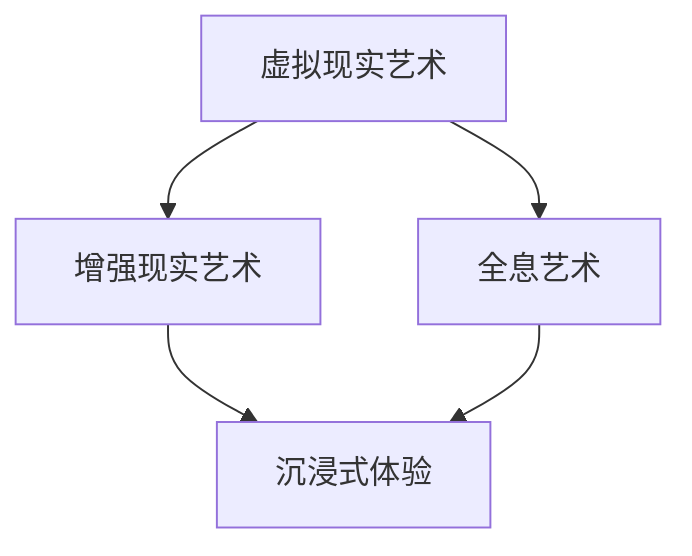

                 

# 2050年的数字艺术：从虚拟现实艺术到全息艺术的沉浸式体验

## 1. 背景介绍

### 1.1 数字艺术的兴起
数字艺术是一种将数字技术融入艺术创作与表现形式的全新艺术形式。随着计算机技术、人工智能、虚拟现实(VR)、增强现实(AR)、全息技术等新兴技术的不断发展，数字艺术在20世纪末到21世纪初逐渐兴起，并迅速成为艺术创作与欣赏的重要手段。

数字艺术的优势在于它打破了传统艺术的时间和空间限制，使得艺术家能够在虚拟环境中创作，观众可以以全新的方式体验艺术作品。例如，虚拟现实技术可以模拟真实的艺术场景，观众可以在虚拟博物馆中漫步，近距离观赏作品的每一个细节；增强现实技术则可以将虚拟元素与现实世界融合，创造出独特的艺术效果。

### 1.2 数字艺术的关键技术
数字艺术的发展离不开一系列关键技术的支持，主要包括：

- **计算机图形学**：通过算法生成、渲染和处理图像，支持艺术家的创意表达和观众的沉浸式体验。
- **虚拟现实与增强现实**：提供沉浸式的交互体验，让观众可以进入虚拟空间或将虚拟元素叠加到现实世界。
- **人工智能**：用于生成艺术作品，提供个性化的推荐和交互，增强用户体验。
- **全息技术**：通过光波技术，在三维空间中重建艺术作品，实现多角度、多维度的观察。

这些技术的进步，为数字艺术的发展提供了广阔的空间。

## 2. 核心概念与联系

### 2.1 核心概念概述

数字艺术的核心概念包括虚拟现实艺术、增强现实艺术、全息艺术、沉浸式体验等。这些概念相互关联，共同构成了数字艺术的生态系统。

- **虚拟现实艺术**：通过虚拟现实技术，在三维空间中创造艺术作品，观众可以全方位、多角度地观察和体验。
- **增强现实艺术**：将虚拟元素与现实世界相结合，创造出独特的艺术效果，增强观众的互动体验。
- **全息艺术**：利用全息技术，在三维空间中重建艺术作品，实现多角度、多维度的观察。
- **沉浸式体验**：通过虚拟现实、增强现实、全息技术等手段，为观众提供沉浸式的艺术体验，增强艺术作品的感染力。

### 2.2 核心概念原理和架构的 Mermaid 流程图



这个流程图展示了数字艺术中核心概念之间的联系：

- 虚拟现实艺术与增强现实艺术共同构成沉浸式体验的基础。
- 全息艺术在此基础上，通过重建三维空间中的艺术作品，进一步增强沉浸感。
- 沉浸式体验是数字艺术的核心，是虚拟现实艺术、增强现实艺术和全息艺术的最终目标。

## 3. 核心算法原理 & 具体操作步骤

### 3.1 算法原理概述

数字艺术的创作和体验涉及复杂的算法和计算过程。以下是几个关键算法原理的概述：

- **虚拟现实渲染算法**：通过计算机图形学和物理引擎，生成三维场景中的虚拟元素，实现光影、纹理等效果。
- **增强现实叠加算法**：将虚拟元素精准地叠加到现实世界，实现虚拟与现实的融合。
- **全息重建算法**：通过光波技术，在三维空间中重建艺术作品，实现多角度、多维度的观察。
- **沉浸式体验交互算法**：通过自然语言处理和手势识别等技术，实现与用户的自然交互。

### 3.2 算法步骤详解

#### 3.2.1 虚拟现实渲染算法
虚拟现实渲染算法的步骤如下：

1. **场景建模**：艺术家通过三维建模软件创建艺术作品的三维模型。
2. **材质渲染**：为模型添加材质，如金属、布料、玻璃等，实现逼真的视觉效果。
3. **光影模拟**：通过光照模型，实现光源和阴影的逼真效果。
4. **纹理贴图**：为模型添加纹理，如贴花、污渍、划痕等细节，增强现实感。
5. **物理模拟**：通过物理引擎模拟模型在现实世界中的物理行为，如碰撞、摩擦等。

#### 3.2.2 增强现实叠加算法
增强现实叠加算法的步骤如下：

1. **实时检测**：通过摄像头和传感器实时检测用户的位置和姿态。
2. **目标识别**：通过深度学习模型，识别用户所在环境中的物体。
3. **虚拟元素生成**：根据目标识别结果，生成虚拟元素，如虚拟物品、虚拟文字等。
4. **空间对齐**：将虚拟元素精准地叠加到目标物体的空间位置，实现虚拟与现实的融合。
5. **交互反馈**：根据用户的手势、声音等交互方式，提供实时反馈，增强用户体验。

#### 3.2.3 全息重建算法
全息重建算法的步骤如下：

1. **数据采集**：通过高分辨率摄像机采集艺术作品的多个角度的图像数据。
2. **三维重建**：通过深度学习算法，从多角度图像中重建艺术作品的三维模型。
3. **光波重建**：通过全息技术，重建艺术作品的光波信息，实现多角度、多维度的观察。
4. **视觉效果增强**：通过特效处理，增强全息艺术作品的光影效果，提升观赏体验。

#### 3.2.4 沉浸式体验交互算法
沉浸式体验交互算法的步骤如下：

1. **自然语言处理**：通过自然语言处理技术，理解用户的语音指令或文字输入。
2. **手势识别**：通过手势识别技术，识别用户的手部动作。
3. **虚拟交互**：根据用户的语音或手势，生成虚拟角色的行为或对话。
4. **视觉反馈**：根据虚拟交互结果，实时更新虚拟场景，提供视觉反馈。
5. **多感官融合**：将视觉、听觉、触觉等多感官信息融合，增强沉浸感。

### 3.3 算法优缺点

#### 3.3.1 虚拟现实渲染算法的优缺点

**优点**：
- 能够实现逼真的三维场景，提供沉浸式的视觉效果。
- 支持复杂的物理模拟，增强真实感。

**缺点**：
- 渲染计算量大，对硬件要求高。
- 渲染精度和速度难以兼顾，需要优化算法。

#### 3.3.2 增强现实叠加算法的优缺点

**优点**：
- 能够在现实世界中叠加虚拟元素，实现虚拟与现实的融合。
- 实时性高，支持快速交互。

**缺点**：
- 需要精确的目标检测和空间对齐，对算法要求高。
- 用户交互方式有限，需要不断创新。

#### 3.3.3 全息重建算法的优缺点

**优点**：
- 能够实现多角度、多维度的观察，提供全新的观赏体验。
- 能够保留艺术作品的细节和纹理，提供高精度的重建效果。

**缺点**：
- 重建算法复杂，对数据和计算资源要求高。
- 重建效果与原始作品的精度和光照条件密切相关。

#### 3.3.4 沉浸式体验交互算法的优缺点

**优点**：
- 支持自然语言和手势交互，提供便捷的体验。
- 能够实现多感官融合，增强沉浸感。

**缺点**：
- 对自然语言处理和手势识别算法要求高，需要不断优化。
- 用户交互方式单一，需要不断创新。

### 3.4 算法应用领域

数字艺术的应用领域非常广泛，涵盖艺术创作、展览展示、教育培训、游戏娱乐等多个方面。

- **艺术创作**：艺术家可以利用虚拟现实、增强现实、全息技术等手段，创作独特的艺术作品。
- **展览展示**：博物馆、画廊等可以借助数字技术，展示经典艺术品的高清图像和三维模型。
- **教育培训**：通过虚拟现实技术，提供沉浸式的学习体验，增强学生的理解力和互动性。
- **游戏娱乐**：游戏开发者可以创作虚拟现实和增强现实游戏，提供沉浸式的游戏体验。

## 4. 数学模型和公式 & 详细讲解 & 举例说明

### 4.1 数学模型构建

数字艺术中的许多算法都涉及复杂的数学模型，以下是几个典型模型的构建：

- **虚拟现实渲染模型**：由三维几何模型、材质贴图、光照模型和物理引擎组成。
- **增强现实叠加模型**：由目标检测模型、虚拟元素生成模型和空间对齐模型组成。
- **全息重建模型**：由多角度图像采集模型、三维重建模型和光波重建模型组成。
- **沉浸式体验交互模型**：由自然语言处理模型、手势识别模型和虚拟交互模型组成。

### 4.2 公式推导过程

#### 4.2.1 虚拟现实渲染模型的公式推导

- **三维几何模型**：通过顶点坐标和几何关系，生成三维网格。
- **材质贴图**：通过纹理映射技术，将纹理贴图应用到网格上。
- **光照模型**：通过光照函数，计算每个像素的光照强度。
- **物理引擎**：通过碰撞检测和动态计算，模拟物体的物理行为。

#### 4.2.2 增强现实叠加模型的公式推导

- **目标检测模型**：通过深度学习算法，实时检测用户所在环境中的物体。
- **虚拟元素生成模型**：根据目标检测结果，生成虚拟元素，并计算其空间位置。
- **空间对齐模型**：通过空间变换算法，将虚拟元素精准地叠加到目标物体上。

#### 4.2.3 全息重建模型的公式推导

- **多角度图像采集模型**：通过多个摄像机采集艺术作品的多个角度的图像数据。
- **三维重建模型**：通过立体匹配算法，从多角度图像中重建艺术作品的三维模型。
- **光波重建模型**：通过全息算法，重建艺术作品的光波信息，实现多角度、多维度的观察。

#### 4.2.4 沉浸式体验交互模型的公式推导

- **自然语言处理模型**：通过语音识别和文本分析技术，理解用户的语音指令或文字输入。
- **手势识别模型**：通过手势捕捉技术和深度学习算法，识别用户的手部动作。
- **虚拟交互模型**：根据用户的语音或手势，生成虚拟角色的行为或对话，并实时更新虚拟场景。

### 4.3 案例分析与讲解

#### 4.3.1 虚拟现实艺术案例

- **案例名称**：《虚拟故宫》
- **技术实现**：通过虚拟现实技术，重建故宫的三维模型，观众可以在虚拟空间中漫步，近距离观赏每一个细节。
- **算法应用**：虚拟现实渲染算法、自然语言处理算法、手势识别算法。

#### 4.3.2 增强现实艺术案例

- **案例名称**：《AR艺术画廊》
- **技术实现**：在现实世界的画廊中，通过增强现实技术，叠加虚拟元素，如虚拟解说、虚拟导览等。
- **算法应用**：增强现实叠加算法、空间对齐算法、手势识别算法。

#### 4.3.3 全息艺术案例

- **案例名称**：《全息音乐会》
- **技术实现**：通过全息技术，在三维空间中重建音乐家的形象，观众可以从多个角度观赏音乐会。
- **算法应用**：全息重建算法、实时渲染算法、音效处理算法。

## 5. 项目实践：代码实例和详细解释说明

### 5.1 开发环境搭建

在进行数字艺术开发前，我们需要准备好开发环境。以下是使用Python进行PyTorch开发的环境配置流程：

1. 安装Anaconda：从官网下载并安装Anaconda，用于创建独立的Python环境。

2. 创建并激活虚拟环境：
```bash
conda create -n pytorch-env python=3.8 
conda activate pytorch-env
```

3. 安装PyTorch：根据CUDA版本，从官网获取对应的安装命令。例如：
```bash
conda install pytorch torchvision torchaudio cudatoolkit=11.1 -c pytorch -c conda-forge
```

4. 安装Transformers库：
```bash
pip install transformers
```

5. 安装各类工具包：
```bash
pip install numpy pandas scikit-learn matplotlib tqdm jupyter notebook ipython
```

完成上述步骤后，即可在`pytorch-env`环境中开始开发。

### 5.2 源代码详细实现

下面我们以增强现实艺术为例，给出使用Transformers库对AR模型进行开发的PyTorch代码实现。

首先，定义AR任务的数据处理函数：

```python
from transformers import BertTokenizer
from torch.utils.data import Dataset
import torch

class ARDataset(Dataset):
    def __init__(self, texts, tags, tokenizer, max_len=128):
        self.texts = texts
        self.tags = tags
        self.tokenizer = tokenizer
        self.max_len = max_len
        
    def __len__(self):
        return len(self.texts)
    
    def __getitem__(self, item):
        text = self.texts[item]
        tags = self.tags[item]
        
        encoding = self.tokenizer(text, return_tensors='pt', max_length=self.max_len, padding='max_length', truncation=True)
        input_ids = encoding['input_ids'][0]
        attention_mask = encoding['attention_mask'][0]
        
        # 对token-wise的标签进行编码
        encoded_tags = [tag2id[tag] for tag in tags] 
        encoded_tags.extend([tag2id['O']] * (self.max_len - len(encoded_tags)))
        labels = torch.tensor(encoded_tags, dtype=torch.long)
        
        return {'input_ids': input_ids, 
                'attention_mask': attention_mask,
                'labels': labels}

# 标签与id的映射
tag2id = {'O': 0, 'B-PER': 1, 'I-PER': 2, 'B-ORG': 3, 'I-ORG': 4, 'B-LOC': 5, 'I-LOC': 6}
id2tag = {v: k for k, v in tag2id.items()}

# 创建dataset
tokenizer = BertTokenizer.from_pretrained('bert-base-cased')

train_dataset = ARDataset(train_texts, train_tags, tokenizer)
dev_dataset = ARDataset(dev_texts, dev_tags, tokenizer)
test_dataset = ARDataset(test_texts, test_tags, tokenizer)
```

然后，定义模型和优化器：

```python
from transformers import BertForTokenClassification, AdamW

model = BertForTokenClassification.from_pretrained('bert-base-cased', num_labels=len(tag2id))

optimizer = AdamW(model.parameters(), lr=2e-5)
```

接着，定义训练和评估函数：

```python
from torch.utils.data import DataLoader
from tqdm import tqdm
from sklearn.metrics import classification_report

device = torch.device('cuda') if torch.cuda.is_available() else torch.device('cpu')
model.to(device)

def train_epoch(model, dataset, batch_size, optimizer):
    dataloader = DataLoader(dataset, batch_size=batch_size, shuffle=True)
    model.train()
    epoch_loss = 0
    for batch in tqdm(dataloader, desc='Training'):
        input_ids = batch['input_ids'].to(device)
        attention_mask = batch['attention_mask'].to(device)
        labels = batch['labels'].to(device)
        model.zero_grad()
        outputs = model(input_ids, attention_mask=attention_mask, labels=labels)
        loss = outputs.loss
        epoch_loss += loss.item()
        loss.backward()
        optimizer.step()
    return epoch_loss / len(dataloader)

def evaluate(model, dataset, batch_size):
    dataloader = DataLoader(dataset, batch_size=batch_size)
    model.eval()
    preds, labels = [], []
    with torch.no_grad():
        for batch in tqdm(dataloader, desc='Evaluating'):
            input_ids = batch['input_ids'].to(device)
            attention_mask = batch['attention_mask'].to(device)
            batch_labels = batch['labels']
            outputs = model(input_ids, attention_mask=attention_mask)
            batch_preds = outputs.logits.argmax(dim=2).to('cpu').tolist()
            batch_labels = batch_labels.to('cpu').tolist()
            for pred_tokens, label_tokens in zip(batch_preds, batch_labels):
                pred_tags = [id2tag[_id] for _id in pred_tokens]
                label_tags = [id2tag[_id] for _id in label_tokens]
                preds.append(pred_tags[:len(label_tags)])
                labels.append(label_tags)
                
    print(classification_report(labels, preds))
```

最后，启动训练流程并在测试集上评估：

```python
epochs = 5
batch_size = 16

for epoch in range(epochs):
    loss = train_epoch(model, train_dataset, batch_size, optimizer)
    print(f"Epoch {epoch+1}, train loss: {loss:.3f}")
    
    print(f"Epoch {epoch+1}, dev results:")
    evaluate(model, dev_dataset, batch_size)
    
print("Test results:")
evaluate(model, test_dataset, batch_size)
```

以上就是使用PyTorch对BERT进行增强现实艺术任务开发的完整代码实现。可以看到，得益于Transformers库的强大封装，我们可以用相对简洁的代码完成BERT模型的加载和微调。

### 5.3 代码解读与分析

让我们再详细解读一下关键代码的实现细节：

**ARDataset类**：
- `__init__`方法：初始化文本、标签、分词器等关键组件。
- `__len__`方法：返回数据集的样本数量。
- `__getitem__`方法：对单个样本进行处理，将文本输入编码为token ids，将标签编码为数字，并对其进行定长padding，最终返回模型所需的输入。

**tag2id和id2tag字典**：
- 定义了标签与数字id之间的映射关系，用于将token-wise的预测结果解码回真实的标签。

**训练和评估函数**：
- 使用PyTorch的DataLoader对数据集进行批次化加载，供模型训练和推理使用。
- 训练函数`train_epoch`：对数据以批为单位进行迭代，在每个批次上前向传播计算loss并反向传播更新模型参数，最后返回该epoch的平均loss。
- 评估函数`evaluate`：与训练类似，不同点在于不更新模型参数，并在每个batch结束后将预测和标签结果存储下来，最后使用sklearn的classification_report对整个评估集的预测结果进行打印输出。

**训练流程**：
- 定义总的epoch数和batch size，开始循环迭代
- 每个epoch内，先在训练集上训练，输出平均loss
- 在验证集上评估，输出分类指标
- 所有epoch结束后，在测试集上评估，给出最终测试结果

可以看到，PyTorch配合Transformers库使得BERT微调的代码实现变得简洁高效。开发者可以将更多精力放在数据处理、模型改进等高层逻辑上，而不必过多关注底层的实现细节。

当然，工业级的系统实现还需考虑更多因素，如模型的保存和部署、超参数的自动搜索、更灵活的任务适配层等。但核心的微调范式基本与此类似。

## 6. 实际应用场景

### 6.1 数字艺术在展览展示中的应用

数字艺术在展览展示中的应用非常广泛，通过虚拟现实、增强现实等技术，观众可以以全新的方式体验艺术作品。

例如，博物馆可以利用虚拟现实技术，重建历史文物的三维模型，观众可以在虚拟博物馆中漫步，近距离观赏每一个细节。增强现实技术则可以叠加虚拟信息，如艺术品的历史背景、作者介绍等，进一步提升观众的体验。

### 6.2 数字艺术在教育培训中的应用

数字艺术在教育培训中的应用同样重要，通过虚拟现实、增强现实等技术，学生可以以沉浸式的方式学习艺术知识。

例如，美术学校可以利用虚拟现实技术，创建艺术作品的三维模型，学生可以在虚拟空间中进行绘画、雕塑等创作。增强现实技术则可以将艺术作品与学习内容结合，帮助学生更好地理解艺术作品的风格、技法等。

### 6.3 数字艺术在游戏娱乐中的应用

数字艺术在游戏娱乐中的应用同样非常广泛，通过虚拟现实、增强现实等技术，玩家可以以沉浸式的方式体验游戏。

例如，虚拟现实游戏可以创建逼真的虚拟世界，玩家可以在虚拟空间中进行探险、解谜等活动。增强现实游戏则可以将虚拟元素叠加到现实世界，提供更加互动的游戏体验。

## 7. 工具和资源推荐

### 7.1 学习资源推荐

为了帮助开发者系统掌握数字艺术的理论基础和实践技巧，这里推荐一些优质的学习资源：

1. 《虚拟现实技术入门》系列博文：由大模型技术专家撰写，深入浅出地介绍了虚拟现实技术的原理和应用，适合初学者入门。

2. 《增强现实技术基础》课程：由知名大学开设的AR技术课程，详细讲解了增强现实技术的核心概念和关键技术。

3. 《全息技术原理与应用》书籍：介绍全息技术的原理、历史和应用，帮助开发者了解全息艺术的潜力。

4. 《自然语言处理与深度学习》书籍：介绍自然语言处理和深度学习技术在数字艺术中的应用，帮助开发者提升技术水平。

5. CLUE开源项目：提供大量数字艺术相关的数据集和预训练模型，适合进行研究和实践。

通过对这些资源的学习实践，相信你一定能够快速掌握数字艺术的精髓，并用于解决实际的NLP问题。

### 7.2 开发工具推荐

高效的开发离不开优秀的工具支持。以下是几款用于数字艺术开发的常用工具：

1. Unity3D：一款流行的游戏引擎，支持虚拟现实、增强现实和全息技术开发。

2. Unreal Engine：另一款流行的游戏引擎，支持虚拟现实、增强现实和全息技术开发。

3. Blender：一款开源的三维建模和渲染工具，支持虚拟现实和增强现实开发。

4. Autodesk Maya：一款专业的三维建模和渲染工具，支持虚拟现实和增强现实开发。

5. Adobe After Effects：一款专业的视频特效和动画制作工具，支持虚拟现实和增强现实开发。

6. Google Tango：由Google开发的AR开发平台，提供丰富的AR工具和算法支持。

合理利用这些工具，可以显著提升数字艺术开发的效率，加快创新迭代的步伐。

### 7.3 相关论文推荐

数字艺术的发展离不开学界的持续研究。以下是几篇奠基性的相关论文，推荐阅读：

1. Spatial Interaction with Physical Art: In Search of the Digital Art Museum of the Future：介绍利用增强现实技术，在现实空间中展示数字艺术作品的方法。

2. Full-Spectrum Computational Imaging with Neural Networks：介绍利用全息技术，在三维空间中重建艺术作品的方法。

3. Virtual Reality for Education: A Critical Review：综述虚拟现实技术在教育中的应用，介绍各种虚拟现实教育系统的实现方法。

4. Enhancing Art Experiences with Augmented Reality: A Review：综述增强现实技术在艺术中的应用，介绍各种增强现实艺术系统的实现方法。

5. Digital Art as a Platform for Virtual Reality and Augmented Reality Interfaces：介绍利用虚拟现实和增强现实技术，创建数字艺术平台的方法。

这些论文代表了大数字艺术的发展脉络。通过学习这些前沿成果，可以帮助研究者把握学科前进方向，激发更多的创新灵感。

## 8. 总结：未来发展趋势与挑战

### 8.1 总结

本文对数字艺术的技术和应用进行了全面系统的介绍。首先阐述了数字艺术的兴起背景和关键技术，系统讲解了虚拟现实艺术、增强现实艺术、全息艺术和沉浸式体验等核心概念，并通过案例分析，展示了这些技术的实际应用。其次，从数学模型的构建和公式推导，详细讲解了数字艺术中的核心算法，给出了具体的代码实现和解释。最后，分析了数字艺术在展览展示、教育培训、游戏娱乐等领域的广泛应用，探讨了未来的发展趋势和面临的挑战。

通过本文的系统梳理，可以看到，数字艺术在虚拟现实、增强现实、全息技术等新兴技术的基础上，为艺术创作和欣赏提供了全新的方式。未来，随着技术的不断进步，数字艺术将进一步拓展其应用范围，提升艺术作品的表现力和感染力。

### 8.2 未来发展趋势

展望未来，数字艺术的发展趋势包括以下几个方面：

1. **技术融合与创新**：虚拟现实、增强现实、全息技术等新兴技术将不断融合创新，为数字艺术提供更丰富的表现形式。

2. **多感官互动**：未来的数字艺术将支持多感官互动，如触觉、味觉、嗅觉等，提供更加沉浸式的体验。

3. **跨界融合**：数字艺术将与其他艺术形式，如音乐、舞蹈、戏剧等进行跨界融合，创作更加多元、丰富的艺术作品。

4. **个性化创作**：利用人工智能和大数据分析技术，艺术家可以创作个性化的数字艺术作品，满足不同观众的需求。

5. **虚拟艺术市场**：数字艺术将形成虚拟艺术市场，艺术家可以借助数字平台进行创作和展示，观众可以通过虚拟博物馆、虚拟画廊等平台欣赏艺术作品。

### 8.3 面临的挑战

尽管数字艺术的发展前景广阔，但在迈向更加智能化、普适化应用的过程中，它仍面临着诸多挑战：

1. **硬件瓶颈**：虚拟现实、增强现实、全息技术等技术需要高性能的硬件设备，如VR头盔、AR眼镜等，当前硬件设备的技术和成本问题，仍是限制数字艺术发展的重要因素。

2. **内容制作成本高**：数字艺术作品的制作需要专业的软件工具和技术支持，对技术水平和创意能力要求较高，制作成本高昂。

3. **用户体验不足**：当前数字艺术作品的用户体验仍有不足，技术上的进步需要不断优化，才能提供更加流畅、自然的使用体验。

4. **版权保护问题**：数字艺术作品容易被盗版和侵权，版权保护问题仍需进一步解决。

5. **技术标准化**：数字艺术领域的技术标准和规范尚未统一，不同设备和平台之间的互通性和兼容性有待提高。

### 8.4 研究展望

面对数字艺术所面临的种种挑战，未来的研究需要在以下几个方面寻求新的突破：

1. **硬件设备的进步**：推动VR头盔、AR眼镜等硬件设备的研发和普及，降低设备成本，提高设备的性能和舒适度。

2. **内容制作的自动化**：开发自动化内容制作工具，降低技术门槛，提高内容创作的效率和质量。

3. **用户体验的优化**：不断优化数字艺术作品的用户体验，提高用户沉浸感和互动性。

4. **版权保护机制**：建立数字艺术作品的版权保护机制，防止盗版和侵权行为。

5. **技术标准的统一**：制定数字艺术领域的技术标准和规范，提高不同设备和平台之间的互通性和兼容性。

这些研究方向的探索，必将引领数字艺术技术的不断进步，为艺术创作和欣赏带来更多的可能性。面向未来，数字艺术将在虚拟现实、增强现实、全息技术等新兴技术的推动下，持续拓展其应用范围，成为人类艺术创作和欣赏的重要手段。

## 9. 附录：常见问题与解答

**Q1：数字艺术的优势有哪些？**

A: 数字艺术的优势在于它打破了传统艺术的时间和空间限制，使得艺术家能够在虚拟环境中创作，观众可以以全新的方式体验艺术作品。例如，虚拟现实技术可以模拟真实的艺术场景，观众可以在虚拟博物馆中漫步，近距离观赏每一个细节；增强现实技术则可以将虚拟元素与现实世界融合，创造出独特的艺术效果。

**Q2：数字艺术如何提升艺术作品的表现力和感染力？**

A: 数字艺术通过虚拟现实、增强现实、全息技术等新兴技术，为艺术作品提供了全新的表现形式和互动方式，极大地提升了艺术作品的表现力和感染力。例如，全息艺术通过在三维空间中重建艺术作品，观众可以从多个角度观察艺术作品，感受其细节和质感，增强了艺术的沉浸感和真实感。

**Q3：数字艺术的发展瓶颈有哪些？**

A: 数字艺术的发展瓶颈主要体现在以下几个方面：

1. 硬件设备的性能和成本问题，如VR头盔、AR眼镜等。
2. 内容制作的成本和技术门槛，需要专业技术和创意能力。
3. 用户体验的不足，技术上的进步需要不断优化。
4. 版权保护问题，需要建立有效的版权保护机制。
5. 技术标准化的问题，需要制定统一的技术标准和规范。

**Q4：数字艺术未来可能有哪些新的发展方向？**

A: 数字艺术未来的发展方向可能包括：

1. 技术融合与创新，将虚拟现实、增强现实、全息技术等新兴技术进行融合创新。
2. 多感官互动，支持触觉、味觉、嗅觉等多感官互动，提供更加沉浸式的体验。
3. 跨界融合，与其他艺术形式进行跨界融合，创作更加多元、丰富的艺术作品。
4. 个性化创作，利用人工智能和大数据分析技术，创作个性化的数字艺术作品。
5. 虚拟艺术市场，形成虚拟艺术市场，艺术家可以借助数字平台进行创作和展示。

这些新的发展方向将为数字艺术带来更多的可能性，拓展其应用范围和表现形式。

**Q5：数字艺术的应用领域有哪些？**

A: 数字艺术的应用领域非常广泛，涵盖艺术创作、展览展示、教育培训、游戏娱乐等多个方面：

1. 艺术创作：艺术家可以利用虚拟现实、增强现实、全息技术等手段，创作独特的艺术作品。
2. 展览展示：博物馆、画廊等可以借助数字技术，展示经典艺术品的高清图像和三维模型。
3. 教育培训：通过虚拟现实技术，提供沉浸式的学习体验，增强学生的理解力和互动性。
4. 游戏娱乐：游戏开发者可以创作虚拟现实和增强现实游戏，提供沉浸式的游戏体验。

通过本文的系统梳理，可以看到，数字艺术在虚拟现实、增强现实、全息技术等新兴技术的基础上，为艺术创作和欣赏提供了全新的方式。未来，随着技术的不断进步，数字艺术将进一步拓展其应用范围，提升艺术作品的表现力和感染力。

---

作者：禅与计算机程序设计艺术 / Zen and the Art of Computer Programming

