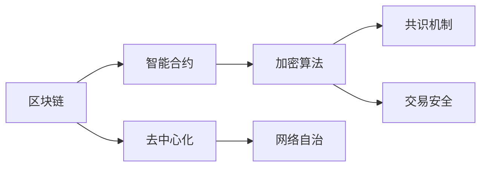

                 

# 2050年的数字货币：从加密货币到全球数字货币的货币体系重构

## 1. 背景介绍

### 1.1 问题由来

随着数字经济和区块链技术的不断发展，数字货币正在逐步从边缘化的加密货币向全球化、主流的货币体系演进。预计到2050年，数字货币将成为全球主要的货币形式之一，对传统的货币体系和金融市场产生深远的影响。本文章将探讨数字货币发展的关键驱动因素，并展望其未来的全球化趋势。

### 1.2 问题核心关键点

1. **数字货币的定义与特点**：数字货币是一种基于区块链或分布式账本技术的数字化电子货币，具有去中心化、透明性、安全性、可追溯性等特点。
2. **加密货币的兴起与普及**：比特币等加密货币的诞生和发展，标志着数字货币的初步形成和广泛认知。
3. **区块链技术的成熟与优化**：区块链技术的不断发展，尤其是公链和联盟链的优化，为数字货币的普及和应用奠定了技术基础。
4. **中央银行数字货币的探索**：CBDCs（Central Bank Digital Currencies）的研发和试点，显示了各国央行对数字货币的重视和探索。
5. **国际监管与合作**：全球范围内对数字货币的监管框架和合作机制的建立，是推动数字货币走向全球化的关键因素。

## 2. 核心概念与联系

### 2.1 核心概念概述

数字货币系统基于区块链技术，通过去中心化的网络，实现货币的发行、传输和存储。其核心概念包括：

- **区块链**：分布式账本技术，通过共识算法维护网络信任。
- **智能合约**：自动执行的合约，通过代码实现交易逻辑。
- **加密算法**：确保交易数据的安全性和隐私性。
- **共识机制**：保证网络节点对交易记录的共识，如PoW、PoS等。
- **去中心化**：无中心控制点，通过节点网络自治。

这些概念之间的联系可以通过以下Mermaid流程图来展示：



## 3. 核心算法原理 & 具体操作步骤

### 3.1 算法原理概述

数字货币的发行和交易基于区块链网络，主要依赖于以下核心算法：

- **共识算法**：如PoW、PoS、DPoS等，通过竞争机制达成网络共识。
- **加密算法**：包括哈希函数、公钥加密算法等，确保交易数据的完整性和不可篡改性。
- **共识节点选择**：通过网络节点间的相互验证和选择，确定参与共识的节点。

### 3.2 算法步骤详解

1. **发行数字货币**：中央银行或发行机构使用私钥签署交易，将其广播到区块链网络。
2. **验证和共识**：网络节点通过共识算法验证交易，达成共识，并将交易记录到区块链上。
3. **记录与存储**：区块链上的每个区块记录了所有交易数据，通过分布式存储保证数据安全。
4. **智能合约执行**：通过智能合约自动化执行交易逻辑，确保交易的准确性和透明度。
5. **去中心化维护**：网络节点通过分布式网络自治，确保系统的稳定性和可扩展性。

### 3.3 算法优缺点

数字货币的算法优点包括：

- **透明性和安全性**：交易记录公开透明，数据不可篡改。
- **去中心化**：减少中心机构风险，提高系统的可靠性。
- **低成本**：降低交易成本，提高效率。

缺点包括：

- **技术复杂性**：需要较高的技术门槛和网络环境要求。
- **性能瓶颈**：网络扩展性和交易速度有待提升。
- **监管挑战**：国际监管框架尚未完善，可能面临法律风险。

### 3.4 算法应用领域

数字货币的应用领域广泛，包括但不限于：

- **支付系统**：实现点对点的即时支付，提高支付效率和安全性。
- **供应链金融**：优化供应链管理，提高金融效率。
- **跨境交易**：简化跨境支付，降低汇率风险。
- **政府治理**：推动公共服务和政策执行。
- **社会福利**：实施普惠金融，提高社会公平性。

## 4. 数学模型和公式 & 详细讲解 & 举例说明

### 4.1 数学模型构建

数字货币系统通常基于以下数学模型：

- **交易模型**：描述交易的金额、时间、参与者等信息。
- **共识算法模型**：如PoW的计算难度模型，PoS的随机选择模型。
- **智能合约模型**：通过脚本语言实现交易逻辑，如Ethereum的Solidity语言。

### 4.2 公式推导过程

以PoW共识算法为例，其计算难度$D$与出块时间$T$的关系为：

$$D = T^{-\alpha}$$

其中$\alpha$为调整系数，通常为2-3。

### 4.3 案例分析与讲解

以比特币为例，其PoW共识机制的核心公式为：

$$
\text{Probability} = \frac{2^{-difficulty}}{2^{32}}
$$

其中，难度$d$表示需要进行的哈希碰撞次数，每增加一个区块，难度增加一定倍数，以保证出块速率稳定。

## 5. 项目实践：代码实例和详细解释说明

### 5.1 开发环境搭建

1. **环境准备**：
   - 安装Python环境
   - 安装区块链开发工具，如Ethereum开发工具包(EDA)、Hyperledger Fabric等
   - 配置区块链网络

2. **智能合约开发**：
   - 使用Solidity或Golang等脚本语言编写智能合约
   - 在区块链平台上部署智能合约

### 5.2 源代码详细实现

以下是一个简单的Solidity智能合约示例：

```solidity
// SPDX-License-Identifier: MIT
pragma solidity ^0.8.0;

contract DigitalCurrency {
    uint256 public balance;

    constructor(uint256 initialBalance) {
        balance = initialBalance;
    }

    function transfer(uint256 amount) public payable {
        require(msg.value == amount, "Insufficient balance");
        balance -= amount;
    }

    function getBalance() public view returns (uint256) {
        return balance;
    }
}
```

### 5.3 代码解读与分析

- **构造函数**：初始化余额，可以设置初始余额。
- **transfer函数**：接收支付金额，验证余额后进行转移。
- **getBalance函数**：获取当前余额。

### 5.4 运行结果展示

通过区块链平台部署智能合约，并进行测试交易，可以看到余额的实时变化。

## 6. 实际应用场景

### 6.1 跨境支付

数字货币在跨境支付中具有显著优势。用户通过区块链网络，可以实时、低成本地进行跨国支付，减少了外汇兑换和手续费的损失。例如，通过区块链实现的跨境支付服务，比传统的SWIFT系统快数倍。

### 6.2 供应链金融

数字货币可以优化供应链金融流程。通过区块链记录交易记录，提高交易透明度，降低欺诈风险，提升供应链融资效率。例如，企业可以使用智能合约自动发放贷款，减少人工操作和审批流程。

### 6.3 政府治理

数字货币可以推动政府治理的数字化。通过区块链记录政府决策和政策执行，提高透明度和可信度。例如，政府可以使用数字货币发放社会保障金，减少中间环节，提高资金使用效率。

### 6.4 未来应用展望

预计到2050年，数字货币将在全球范围内得到广泛应用，推动以下发展：

- **全球化货币**：数字货币成为国际通用货币，简化跨国交易。
- **智能合约普及**：自动化的智能合约广泛应用，提高社会治理效率。
- **中央银行数字货币**：CBDCs普及，实现数字货币与央行货币的融合。
- **区块链技术与AI结合**：区块链与AI结合，提高数字货币系统的智能水平。

## 7. 工具和资源推荐

### 7.1 学习资源推荐

- **《区块链技术原理与实践》**：系统介绍区块链技术，包括数字货币、共识算法等。
- **《智能合约设计与开发》**：讲解Solidity等智能合约开发语言。
- **《数字货币经济学》**：分析数字货币的经济影响和社会价值。

### 7.2 开发工具推荐

- **Ethereum开发工具包(EDA)**：Ethereum智能合约开发平台。
- **Hyperledger Fabric**：Hyperledger联盟链开发工具。
- **Bitcoin Core**：比特币开源开发工具。

### 7.3 相关论文推荐

- **"Bitcoin: A Peer-to-Peer Electronic Cash System"**：比特币的原始论文，奠定了区块链技术的基础。
- **"Designing a Digital Currency for the Internet"**：探讨数字货币的体系架构。
- **"Blockchain Technology and Its Applications in Business"**：研究区块链技术在业务中的应用。

## 8. 总结：未来发展趋势与挑战

### 8.1 研究成果总结

数字货币技术的快速发展，推动了金融、社会、经济等领域的数字化转型。当前，数字货币正在从加密货币向全球货币体系演变，未来的发展趋势包括：

- **全球货币一体化**：数字货币成为全球统一货币，提高国际交易效率。
- **智能合约普及化**：智能合约的应用场景不断扩展，提高社会治理的智能化水平。
- **中央银行数字货币**：CBDCs普及，实现数字货币与央行货币的融合。

### 8.2 未来发展趋势

1. **技术成熟度提升**：区块链技术的不断优化，提高系统的稳定性和扩展性。
2. **应用场景丰富化**：数字货币的应用范围不断扩大，涵盖金融、政府、企业等多个领域。
3. **监管框架完善**：国际监管合作加强，建立统一的监管框架，规范数字货币市场。
4. **跨链互操作性增强**：不同区块链之间的互操作性增强，促进数字货币的广泛应用。

### 8.3 面临的挑战

1. **技术复杂性**：区块链技术需要较高的技术门槛，对开发和维护要求较高。
2. **安全性和隐私保护**：如何确保数字货币交易的安全性和隐私保护，是一个重要的挑战。
3. **法律和监管问题**：各国对数字货币的法律和监管框架尚未统一，存在法律风险。
4. **市场接受度**：如何提高公众对数字货币的接受度，推动其普及应用。

### 8.4 研究展望

未来的研究需要关注以下几个方向：

1. **跨链互操作性**：研究不同区块链之间的互操作性，实现跨链交易。
2. **隐私保护技术**：研究隐私保护技术，确保数字货币交易的匿名性和安全性。
3. **监管合规性**：研究数字货币的合规性问题，确保其合法合规使用。
4. **智能合约可扩展性**：研究智能合约的可扩展性，支持更复杂的业务逻辑。

## 9. 附录：常见问题与解答

**Q1：数字货币的安全性如何保障？**

A: 数字货币的安全性主要通过加密算法和共识机制来保障。交易数据通过哈希函数加密，确保数据完整性和不可篡改性。共识算法通过网络节点的相互验证，防止恶意攻击和欺诈行为。

**Q2：数字货币的性能瓶颈如何解决？**

A: 数字货币的性能瓶颈主要通过网络优化和算法改进来解决。例如，使用分片技术、侧链技术等扩展网络容量，提高交易速度。

**Q3：数字货币的未来发展趋势是什么？**

A: 数字货币的未来发展趋势包括全球货币一体化、智能合约普及化、中央银行数字货币等。数字货币将逐步成为全球主要的货币形式之一，推动金融、社会、经济等领域的数字化转型。

**Q4：数字货币在实际应用中面临哪些挑战？**

A: 数字货币在实际应用中面临的技术复杂性、安全性和隐私保护、法律和监管问题等挑战。需要技术、法律和监管等多方面的协同，才能确保其广泛应用。

---

作者：禅与计算机程序设计艺术 / Zen and the Art of Computer Programming

