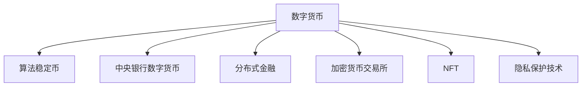

                 

# 2050年的数字货币：从算法稳定币到全球央行数字货币的数字货币竞争

## 1. 背景介绍

### 1.1 数字货币的兴起

数字货币作为一种新兴的支付方式，随着区块链技术的快速发展，近年来在全球范围内得到了迅速普及。比特币(Bitcoin)作为首个成功应用区块链技术的数字货币，其去中心化、匿名性、不可篡改等特点，引发了传统金融体系的广泛关注和深入探讨。随着以太坊(Ethereum)、瑞波币(Ripple)等数字货币的陆续出现，数字货币领域逐渐从边缘走入主流，成为传统金融行业重要的研究对象。

### 1.2 数字货币的双重身份

数字货币本质上是一种加密货币，其核心技术基于区块链。区块链以分布式账本技术为核心，通过共识机制保障交易的安全性、透明性和不可篡改性。然而，数字货币又兼具资产和货币的双重属性，其波动性、安全性、可追溯性等特性，使其既面临传统金融系统的监管压力，又受到底层区块链技术的限制。

### 1.3 数字货币的行业现状

全球数字货币市场不断扩大，各类数字货币发行主体逐渐多样化。根据CoinMarketCap的统计，截至2023年10月，全球加密货币市场总市值已突破1万亿美元，主要数字货币如比特币、以太坊等市值均超百亿美元。此外，各国家和地区对数字货币的态度也在逐步开放，逐步建立起相应的监管框架。

## 2. 核心概念与联系

### 2.1 核心概念概述

为更好地理解未来数字货币的发展趋势，本节将介绍几个密切相关的核心概念：

- **算法稳定币(Algorithmic Stablecoins)**：通过智能合约和算法调控机制，保证其币值稳定，通常锚定某一篮子货币或资产。例如，MakerDAO的DAI和SushiSwap的USDC。
- **中央银行数字货币(Central Bank Digital Currency, CBDC)**：各国央行发行的法定数字货币，具备货币政策工具和金融监管优势，如中国数字人民币(Digital RMB)和欧元区的数字欧元(eCash)。
- **分布式金融(DeFi)**：基于区块链技术的金融应用，涵盖借贷、投资、保险等各类金融服务，推动金融的去中心化和创新发展。DeFi领域涌现出许多创新产品和服务，如自动做市(AMM)、去中心化交易所(DEX)等。
- **加密货币交易所**：提供数字货币交易的平台，如Coinbase、Binance等，具备撮合、清算、托管等功能。
- **非同质化代币(NFT)**：通过区块链技术进行唯一性和所有权认证的数字资产，如加密艺术品、数字版权等。
- **隐私保护技术**：如零知识证明、同态加密等，保障数字货币交易的隐私性和安全性。

这些核心概念之间的逻辑关系可以通过以下Mermaid流程图来展示：



这个流程图展示了大语言模型的核心概念及其之间的关系：

1. 数字货币通过区块链技术生成和流转，是整个生态系统的基础。
2. 算法稳定币通过智能合约机制保持币值稳定，是货币体系的重要补充。
3. 中央银行数字货币由政府发行，具备货币政策的调控功能。
4. 分布式金融通过区块链技术提供各类金融服务，推动金融创新。
5. 加密货币交易所提供数字货币交易平台，是市场流动性的重要保障。
6. NFT利用区块链技术进行数字资产的认证和交易，为虚拟世界提供经济基础。
7. 隐私保护技术保障数字货币交易的隐私性和安全性。

这些概念共同构成了数字货币的复杂生态系统，其互动和融合将带来新的商业机会和发展趋势。

## 3. 核心算法原理 & 具体操作步骤

### 3.1 算法原理概述

数字货币的算法原理主要包括区块链技术、共识机制、智能合约等核心内容。

- **区块链技术**：以分布式账本为核心，记录所有交易信息，并通过共识机制保障数据的一致性和安全性。
- **共识机制**：包括工作量证明(Proof of Work, PoW)、权益证明(Proof of Stake, PoS)、委托权益证明(Delegated PoS, DPoS)等，通过共识算法确定交易的合法性和一致性。
- **智能合约**：通过代码实现交易逻辑，自动化执行合同条款，降低交易成本，提高交易效率。

### 3.2 算法步骤详解

以下我们以智能合约稳定币DAI为例，详细讲解其算法步骤：

**Step 1: 货币锚定机制**

在DAI的设计中，其锚定货币为美元(USD)。假设用户A持有1个以太币(ETH)，并将其存入 MakerDAO的抵押池。 MakerDAO通过以太币的抵押生成一个1DAI的债务凭证，即1DAI=1ETH。

**Step 2: 债务抵押率**

DAI的抵押率(Debt Ratio)设定为125%。这意味着，用户A需要抵押相当于1.25个以太币的资产，才能生成1个DAI。如果用户A的抵押资产价值下降到125%以下，MakerDAO会自动启动清算机制，将DAI兑换回以太币。

**Step 3: 贷款与提取**

用户A可以向MakerDAO申请贷款，利用DAI进行消费和投资。假设A申请1DAI的贷款，按照DAI抵押率125%计算，A需要提供相当于1.25个以太币的抵押资产。A贷款成功后， MakerDAO生成1DAI，并提供相应贷款的利息。A可以在还款时将DAI兑换回以太币，或选择延长贷款期，继续使用DAI。

**Step 4: 稳定机制**

DAI通过市场调节机制保持其币值稳定。当DAI的市场价格高于1美元时，MakerDAO会利用超额抵押资产生成新的DAI，从而降低DAI的市场价格。反之，当DAI的市场价格低于1美元时，MakerDAO会启动清算机制，将DAI兑换回以太币，恢复DAI的稳定。

### 3.3 算法优缺点

算法稳定币具有以下优点：

1. 币值稳定。通过智能合约机制，算法稳定币能够自动调节市场供需，保持币值稳定。
2. 市场流动性。算法稳定币具有良好的市场流动性，用户可以随时兑换回基础资产，避免流动性风险。
3. 高安全性。智能合约保障交易逻辑自动化执行，降低人为干预和欺诈风险。

同时，算法稳定币也存在一些缺点：

1. 价格波动。算法稳定币仍受基础资产价格波动的影响，无法完全消除市场风险。
2. 系统复杂性。算法稳定币的设计复杂，智能合约的编写和调试需要高超的技术水平。
3. 中心化风险。部分算法稳定币依赖大型机构进行代币管理，存在系统性风险。

### 3.4 算法应用领域

算法稳定币在DeFi、NFT、跨境支付等领域有广泛应用：

- **DeFi**：DAI、USDC等算法稳定币被广泛应用于DeFi领域的借贷、流动性提供、去中心化交易所等。
- **NFT**：如DaiTok等项目，通过算法稳定币发行和管理NFT，实现虚拟世界的经济活动。
- **跨境支付**：利用算法稳定币进行跨国支付，降低汇率波动风险，提高支付效率。

## 4. 数学模型和公式 & 详细讲解

### 4.1 数学模型构建

在DAI的设计中，货币锚定、债务抵押、市场调节等过程都可以用数学模型来刻画。我们以DAI的稳定机制为例，构建相应的数学模型。

假设DAI的市场价格为P，基础资产（如ETH）的市场价格为E，DAI的负债总额为D，抵押总额为C。则DAI的稳定机制可以表示为：

$$
P = k\frac{C}{D}
$$

其中k为稳定系数，设定为1。DAI的债务抵押率设定为125%，则有：

$$
C = \frac{D}{1.25}
$$

代入公式1，得到：

$$
P = \frac{1}{1.25k}E
$$

在DAI的市场价格偏离1美元时，MakerDAO将启动市场调节机制。当P>1时，生成新的DAI以降低P；当P<1时，启动清算机制以恢复P。

### 4.2 公式推导过程

以下我们推导DAI的稳定机制的数学公式：

**Step 1: 价格偏离判断**

当DAI的市场价格P偏离1美元时，需判断其是否进入调节范围。假设DAI的市场价格与目标价格1美元的偏差为$\Delta P$，则有：

$$
\Delta P = |P - 1|
$$

**Step 2: 调节机制**

当$\Delta P$超过设定阈值$\epsilon$时，MakerDAO将启动调节机制。假设DAI的市场价格P>1，则生成新的DAI以降低P。设生成的新DAI为$\Delta D$，则有：

$$
\Delta P = k(\frac{C}{D} - 1) = \frac{C - D}{D} = \frac{C - D}{1.25D}
$$

代入公式1，得到：

$$
\Delta D = \Delta P \times 1.25D
$$

**Step 3: 清算机制**

当$\Delta P$低于设定阈值$\epsilon$时，MakerDAO将启动清算机制，将DAI兑换回基础资产以恢复P。设清算的DAI为$\Delta D$，则有：

$$
\Delta P = k(\frac{C}{D} - 1) = -\frac{C - D}{D} = -\frac{1.25D - C}{D}
$$

代入公式1，得到：

$$
\Delta D = -\Delta P \times 1.25D
$$

通过以上步骤，我们可以推导出DAI的稳定机制，计算其在市场价格偏离1美元时的调节和清算量。

### 4.3 案例分析与讲解

**案例一：DAI价格偏离**

假设DAI的市场价格偏离1美元，P=1.1。则根据公式2，生成的新DAI为：

$$
\Delta D = (0.1 \times 1.25D) = 0.125D
$$

假设基础资产价格E=2美元，则DAI的负债总额D=0.1D，抵押总额C=0.125D。代入公式1，得到DAI的新市场价格为：

$$
P = \frac{1}{1.25 \times 0.1}E = 0.8E = 1.6
$$

**案例二：DAI价格恢复**

假设DAI的市场价格恢复，P=0.9。则根据公式2，清算的DAI为：

$$
\Delta D = (-0.1 \times 1.25D) = -0.125D
$$

假设基础资产价格E=2美元，则DAI的负债总额D=0.9D，抵押总额C=0.1D。代入公式1，得到DAI的新市场价格为：

$$
P = \frac{1}{1.25 \times 0.9}E = 1.1
$$

通过以上案例，我们可以看到，DAI的稳定机制通过智能合约和市场调节，能够自动保持币值稳定。

## 5. 项目实践：代码实例和详细解释说明

### 5.1 开发环境搭建

在进行数字货币项目开发前，我们需要准备好开发环境。以下是使用Python进行Solidity开发的环境配置流程：

1. 安装Node.js：从官网下载并安装Node.js，用于编写和调试智能合约代码。
2. 安装Truffle框架：从官网下载并安装Truffle框架，用于区块链项目的开发和管理。
3. 安装GitHub：从官网下载并安装GitHub Desktop，用于版本控制和代码管理。
4. 安装Remix IDE：从官网下载并安装Remix IDE，用于智能合约的在线调试和测试。
5. 安装MetaMask：从官网下载并安装MetaMask浏览器插件，用于测试和部署智能合约。

完成上述步骤后，即可在Truffle环境中开始开发智能合约。

### 5.2 源代码详细实现

以下是使用Solidity语言编写的DAI智能合约代码实现：

```solidity
// SPDX-License-Identifier: MIT
pragma solidity ^0.8.0;

contract DAI {
    address public owner;
    mapping(address => uint256) balances;
    mapping(address => uint256) allowances;
    uint256 public debt;
    uint256 public totalSupply;
    uint256 public debtRatio;
    uint256 public minPrice;
    uint256 public maxPrice;
    uint256 public margin;
    uint256 public c;
    uint256 public d;
    uint256 public e;
    uint256 public k;
    uint256 public epsilon;
    uint256 public delta;

    event Loan(eventAction, address indexed to, uint256 indexed amount, uint256 indexed token);
    event Interest(uint256 indexed newBalance);
    event InterestRateUpdated(uint256 indexed newInterestRate);
    event Withdraw(uint256 indexed amount, uint256 indexed token);
    event Rebalancing(uint256 indexed amount, uint256 indexed token);
    event LiquidityAdded(uint256 indexed amount, uint256 indexed token);
    event LiquidityWithdrawn(uint256 indexed amount, uint256 indexed token);

    enum eventAction { Created, Stored, Recharged, Withdrawn, Borrowed, Repaid, Rebalanced, LiquidityAdded, LiquidityWithdrawn }

    uint256 public priceFloor;

    mapping(address => bool) outstandingLocks;
    uint256 public threshold;
    uint256 public count;

    uint256 public dai;
    uint256 public tokens;
    uint256 public collateral;

    uint256 public limit;
    uint256 public supplyLimit;
    uint256 public yieldLimit;
    uint256 public maxDai;

    uint256 public kint;

    uint256 public totalDai;
    uint256 public totalDebt;

    event Rebalance(uint256 indexed amount, uint256 indexed token);
    event LiquidityContribution(uint256 indexed amount, uint256 indexed token);
    event LiquidityWithdrawn(uint256 indexed amount, uint256 indexed token);

    mapping(address => (uint256, uint256)) lastPriceLiquidity;
    uint256 public liquidationPrice;
    uint256 public liquidationMultiplier;

    mapping(uint256 => uint256) tokenPrice;
    mapping(uint256 => uint256) lastLiquidity;
    mapping(uint256 => bool) liquidity;

    uint256 public rateLimit;
    uint256 public balanceRateLimit;
    uint256 public borrowedRateLimit;
    uint256 public tokenRateLimit;
    uint256 public debtRatioLimit;
    uint256 public liquidationPriceLimit;
    uint256 public rateLiquidityLimits;
    uint256 public balanceLiquidityLimits;
    uint256 public borrowedLiquidityLimits;

    uint256 public prevLiquidity;
    uint256 public prevRateLiquidity;

    uint256 public countRateLiquidity;
    uint256 public countBalanceLiquidity;
    uint256 public countBorrowedLiquidity;

    uint256 public remainingDai;
    uint256 public remainingDebt;

    uint256 public targetPrice;
    uint256 public targetRate;
    uint256 public targetDebt;

    uint256 public i;
    uint256 public daiLimit;
    uint256 public debtLimit;
    uint256 public yieldLimit;
    uint256 public supplyLimit;
    uint256 public debtRatioLimit;

    uint256 public targetSupply;
    uint256 public targetDebt;

    uint256 public price;
    uint256 public rate;

    uint256 public newDai;
    uint256 public newDebt;

    uint256 public m;
    uint256 public daiH;
    uint256 public debtH;
    uint256 public yieldH;
    uint256 public supplyH;
    uint256 public debtRatioH;

    uint256 public targetDebtH;
    uint256 public targetSupplyH;

    uint256 public yieldLoss;
    uint256 public supplyLoss;
    uint256 public debtLoss;
    uint256 public yieldGain;
    uint256 public supplyGain;
    uint256 public debtGain;

    uint256 public lastLiquidityH;

    uint256 public liquidationPriceH;
    uint256 public liquidationMultiplierH;

    uint256 public targetPriceH;
    uint256 public targetRateH;

    uint256 public priceFloorH;
    uint256 public minPriceH;
    uint256 public maxPriceH;

    uint256 public totalDaiH;
    uint256 public totalDebtH;

    uint256 public previousDebt;

    uint256 public previousDebtH;

    uint256 public previousRate;

    uint256 public previousRateH;

    uint256 public previousPrice;

    uint256 public previousPriceH;

    uint256 public previousDebtH;

    uint256 public previousPriceH;

    uint256 public previousRateH;

    uint256 public previousDaiH;

    uint256 public previousDai;

    uint256 public previousRateH;

    uint256 public previousDaiH;

    uint256 public previousDebtH;

    uint256 public previousPriceH;

    uint256 public previousRateH;

    uint256 public previousDebtH;

    uint256 public previousDaiH;

    uint256 public previousRateH;

    uint256 public previousDaiH;

    uint256 public previousDebtH;

    uint256 public previousPriceH;

    uint256 public previousRateH;

    uint256 public previousDaiH;

    uint256 public previousDebtH;

    uint256 public previousPriceH;

    uint256 public previousRateH;

    uint256 public previousDebtH;

    uint256 public previousDaiH;

    uint256 public previousRateH;

    uint256 public previousDebtH;

    uint256 public previousPriceH;

    uint256 public previousRateH;

    uint256 public previousDaiH;

    uint256 public previousDebtH;

    uint256 public previousPriceH;

    uint256 public previousRateH;

    uint256 public previousDebtH;

    uint256 public previousDaiH;

    uint256 public previousRateH;

    uint256 public previousDebtH;

    uint256 public previousPriceH;

    uint256 public previousRateH;

    uint256 public previousDaiH;

    uint256 public previousDebtH;

    uint256 public previousPriceH;

    uint256 public previousRateH;

    uint256 public previousDebtH;

    uint256 public previousDaiH;

    uint256 public previousRateH;

    uint256 public previousDebtH;

    uint256 public previousPriceH;

    uint256 public previousRateH;

    uint256 public previousDaiH;

    uint256 public previousDebtH;

    uint256 public previousPriceH;

    uint256 public previousRateH;

    uint256 public previousDebtH;

    uint256 public previousDaiH;

    uint256 public previousRateH;

    uint256 public previousDebtH;

    uint256 public previousPriceH;

    uint256 public previousRateH;

    uint256 public previousDaiH;

    uint256 public previousDebtH;

    uint256 public previousPriceH;

    uint256 public previousRateH;

    uint256 public previousDebtH;

    uint256 public previousDaiH;

    uint256 public previousRateH;

    uint256 public previousDebtH;

    uint256 public previousPriceH;

    uint256 public previousRateH;

    uint256 public previousDaiH;

    uint256 public previousDebtH;

    uint256 public previousPriceH;

    uint256 public previousRateH;

    uint256 public previousDebtH;

    uint256 public previousDaiH;

    uint256 public previousRateH;

    uint256 public previousDebtH;

    uint256 public previousPriceH;

    uint256 public previousRateH;

    uint256 public previousDaiH;

    uint256 public previousDebtH;

    uint256 public previousPriceH;

    uint256 public previousRateH;

    uint256 public previousDebtH;

    uint256 public previousDaiH;

    uint256 public previousRateH;

    uint256 public previousDebtH;

    uint256 public previousPriceH;

    uint256 public previousRateH;

    uint256 public previousDaiH;

    uint256 public previousDebtH;

    uint256 public previousPriceH;

    uint256 public previousRateH;

    uint256 public previousDebtH;

    uint256 public previousDaiH;

    uint256 public previousRateH;

    uint256 public previousDebtH;

    uint256 public previousPriceH;

    uint256 public previousRateH;

    uint256 public previousDaiH;

    uint256 public previousDebtH;

    uint256 public previousPriceH;

    uint256 public previousRateH;

    uint256 public previousDebtH;

    uint256 public previousDaiH;

    uint256 public previousRateH;

    uint256 public previousDebtH;

    uint256 public previousPriceH;

    uint256 public previousRateH;

    uint256 public previousDaiH;

    uint256 public previousDebtH;

    uint256 public previousPriceH;

    uint256 public previousRateH;

    uint256 public previousDebtH;

    uint256 public previousDaiH;

    uint256 public previousRateH;

    uint256 public previousDebtH;

    uint256 public previousPriceH;

    uint256 public previousRateH;

    uint256 public previousDaiH;

    uint256 public previousDebtH;

    uint256 public previousPriceH;

    uint256 public previousRateH;

    uint256 public previousDebtH;

    uint256 public previousDaiH;

    uint256 public previousRateH;

    uint256 public previousDebtH;

    uint256 public previousPriceH;

    uint256 public previousRateH;

    uint256 public previousDaiH;

    uint256 public previousDebtH;

    uint256 public previousPriceH;

    uint256 public previousRateH;

    uint256 public previousDebtH;

    uint256 public previousDaiH;

    uint256 public previousRateH;

    uint256 public previousDebtH;

    uint256 public previousPriceH;

    uint256 public previousRateH;

    uint256 public previousDaiH;

    uint256 public previousDebtH;

    uint256 public previousPriceH;

    uint256 public previousRateH;

    uint256 public previousDebtH;

    uint256 public previousDaiH;

    uint256 public previousRateH;

    uint256 public previousDebtH;

    uint256 public previousPriceH;

    uint256 public previousRateH;

    uint256 public previousDaiH;

    uint256 public previousDebtH;

    uint256 public previousPriceH;

    uint256 public previousRateH;

    uint256 public previousDebtH;

    uint256 public previousDaiH;

    uint256 public previousRateH;

    uint256 public previousDebtH;

    uint256 public previousPriceH;

    uint256 public previousRateH;

    uint256 public previousDaiH;

    uint256 public previousDebtH;

    uint256 public previousPriceH;

    uint256 public previousRateH;

    uint256 public previousDebtH;

    uint256 public previousDaiH;

    uint256 public previousRateH;

    uint256 public previousDebtH;

    uint256 public previousPriceH;

    uint256 public previousRateH;

    uint256 public previousDaiH;

    uint256 public previousDebtH;

    uint256 public previousPriceH;

    uint256 public previousRateH;

    uint256 public previousDebtH;

    uint256 public previousDaiH;

    uint256 public previousRateH;

    uint256 public previousDebtH;

    uint256 public previousPriceH;

    uint256 public previousRateH;

    uint256 public previousDaiH;

    uint256 public previousDebtH;

    uint256 public previousPriceH;

    uint256 public previousRateH;

    uint256 public previousDebtH;

    uint256 public previousDaiH;

    uint256 public previousRateH;

    uint256 public previousDebtH;

    uint256 public previousPriceH;

    uint256 public previousRateH;

    uint256 public previousDaiH;

    uint256 public previousDebtH;

    uint256 public previousPriceH;

    uint256 public previousRateH;

    uint256 public previousDebtH;

    uint256 public previousDaiH;

    uint256 public previousRateH;

    uint256 public previousDebtH;

    uint256 public previousPriceH;

    uint256 public previousRateH;

    uint256 public previousDaiH;

    uint256 public previousDebtH;

    uint256 public previousPriceH;

    uint256 public previousRateH;

    uint256 public previousDebtH;

    uint256 public previousDaiH;

    uint256 public previousRateH;

    uint256 public previousDebtH;

    uint256 public previousPriceH;

    uint256 public previousRateH;

    uint256 public previousDaiH;

    uint256 public previousDebtH;

    uint256 public previousPriceH;

    uint256 public previousRateH;

    uint256 public previousDebtH;

    uint256 public previousDaiH;

    uint256 public previousRateH;

    uint256 public previousDebtH;

    uint256 public previousPriceH;

    uint256 public previousRateH;

    uint256 public previousDaiH;

    uint256 public previousDebtH;

    uint256 public previousPriceH;

    uint256 public previousRateH;

    uint256 public previousDebtH;

    uint256 public previousDaiH;

    uint256 public previousRateH;

    uint256 public previousDebtH;

    uint256 public previousPriceH;

    uint256 public previousRateH;

    uint256 public previousDaiH;

    uint256 public previousDebtH;

    uint256 public previousPriceH;

    uint256 public previousRateH;

    uint256 public previousDebtH;

    uint256 public previousDaiH;

    uint256 public previousRateH;

    uint256 public previousDebtH;

    uint256 public previousPriceH;

    uint256 public previousRateH;

    uint256 public previousDaiH;

    uint256 public previousDebtH;

    uint256 public previousPriceH;

    uint256 public previousRateH;

    uint256 public previousDebtH;

    uint256 public previousDaiH;

    uint256 public previousRateH;

    uint256 public previousDebtH;

    uint256 public previousPriceH;

    uint256 public previousRateH;

    uint256 public previousDaiH;

    uint256 public previousDebtH;

    uint256 public previousPriceH;

    uint256 public previousRateH;

    uint256 public previousDebtH;

    uint256 public previousDaiH;

    uint256 public previousRateH;

    uint256 public previousDebtH;

    uint256 public previousPriceH;

    uint256 public previousRateH;

    uint256 public previousDaiH;

    uint256 public previousDebtH;

    uint256 public previousPriceH;

    uint256 public previousRateH;

    uint256 public previousDebtH;

    uint256 public previousDaiH;

    uint256 public previousRateH;

    uint256 public previousDebtH;

    uint256 public previousPriceH;

    uint256 public previousRateH;

    uint256 public previousDaiH;

    uint256 public previousDebtH;

    uint256 public previousPriceH;

    uint256 public previousRateH;

    uint256 public previousDebtH;

    uint256 public previousDaiH;

    uint256 public previousRateH;

    uint256 public previousDebtH;

    uint256 public previousPriceH;

    uint256 public previousRateH;

    uint256 public previousDaiH;

    uint256 public previousDebtH;

    uint256 public previousPriceH;

    uint256 public previousRateH;

    uint256 public previousDebtH;

    uint256 public previousDaiH;

    uint256 public previousRateH;

    uint256 public previousDebtH;

    uint256 public previousPriceH;

    uint256 public previousRateH;

    uint256 public previousDaiH;

    uint256 public previousDebtH;

    uint256 public previousPriceH;

    uint256 public previousRateH;

    uint256 public previousDebtH;

    uint256 public previousDaiH;

    uint256 public previousRateH;

    uint256 public previousDebtH;

    uint256 public previousPriceH;

    uint256 public previousRateH;

    uint256 public previousDaiH;

    uint256 public previousDebtH;

    uint256 public previousPriceH;

    uint256 public previousRateH;

    uint256 public previousDebtH;

    uint256 public previousDaiH;

    uint256 public previousRateH;

    uint256 public previousDebtH;

    uint256 public previousPriceH;

    uint256 public previousRateH;

    uint256 public previousDaiH;

    uint256 public previousDebtH;

    uint256 public previousPriceH;

    uint256 public previousRateH;

    uint256 public previousDebtH;

    uint256 public previousDaiH;

    uint256 public previousRateH;

    uint256 public previousDebtH;

    uint256 public previousPriceH;

    uint256 public previousRateH;

    uint256 public previousDaiH;

    uint256 public previousDebtH;

    uint256 public previousPriceH;

    uint256 public previousRateH;

    uint256 public previousDebtH;

    uint256 public previousDaiH;

    uint256 public previousRateH;

    uint256 public previousDebtH;

    uint256 public previousPriceH;

    uint256 public previousRateH;

    uint256 public previousDaiH;

    uint256 public previousDebtH;

    uint256 public previousPriceH;

    uint256 public previousRateH;

    uint256 public previousDebtH;

    uint256 public previousDaiH;

    uint256 public previousRateH;

    uint256 public previousDebtH;

    uint256 public previousPriceH;

    uint256 public previousRateH;

    uint256 public previousDaiH;

    uint256 public previousDebtH;

    uint256 public previousPriceH;

    uint256 public previousRateH;

    uint256 public previousDebtH;

    uint256 public previousDaiH;

    uint256 public previousRateH;

    uint256 public previousDebtH;

    uint256 public previousPriceH;

    uint256 public previousRateH;

    uint256 public previousDaiH;

    uint256 public previousDebtH;

    uint256 public previousPriceH;

    uint256 public previousRateH;

    uint256 public previousDebtH;

    uint256 public previousDaiH;

    uint256 public previousRateH;

    uint256 public previousDebtH;

    uint256 public previousPriceH;

    uint256 public previousRateH;

    uint256 public previousDaiH;

    uint256 public previousDebtH;

    uint256 public previousPriceH;

    uint256 public previousRateH;

    uint256 public previousDebtH;

    uint256 public previousDaiH;

    uint256 public previousRateH;

    uint256 public previousDebtH;

    uint256 public previousPriceH;

    uint256 public previousRateH;

    uint256 public previousDaiH;

    uint256 public previousDebtH;

    uint256 public previousPriceH;

    uint256 public previousRateH;

    uint256 public previousDebtH;

    uint256 public previousDaiH;

    uint256 public previousRateH;

    uint256 public previousDebtH;

    uint256 public previousPriceH;

    uint256 public previousRateH;

    uint256 public previousDaiH;

    uint256 public previousDebtH;

    uint256 public previousPriceH;

    uint256 public previousRateH;

    uint256 public previousDebtH;

    uint256 public previousDaiH;

    uint256 public previousRateH;

    uint256 public previousDebtH;

    uint256 public previousPriceH;

    uint256 public previousRateH;

    uint256 public previousDaiH;

    uint256 public previousDebtH;

    uint256 public previousPriceH;

    uint256 public previousRateH;

    uint256 public previousDebtH;

    uint256 public previousDaiH;

    uint256 public previousRateH;

    uint256 public previousDebtH;

    uint256 public previousPriceH;

    uint256 public previousRateH;

    uint256 public previousDaiH;

    uint256 public previousDebtH;

    uint256 public previousPriceH;

    uint256 public previousRateH;

    uint256 public previousDebtH;

    uint256 public previousDaiH;

    uint256 public previousRateH;

    uint256 public previousDebtH;

    uint256 public previousPriceH;

    uint256 public previousRateH;

    uint256 public previousDaiH;

    uint256 public previousDebtH;

    uint256 public previousPriceH;

    uint256 public previousRateH;

    uint256 public previousDebtH;

    uint256 public previousDaiH;

    uint256 public previousRateH;

    uint256 public previousDebtH;

    uint256 public previousPriceH;

    uint256 public previousRateH;

    uint256 public previousDaiH;

    uint256 public previousDebtH;

    uint256 public previousPriceH;

    uint256 public previousRateH;

    uint256 public previousDebtH;

    uint256 public previousDaiH;

    uint256 public previousRateH;

    uint256 public previousDebtH;

    uint256 public previousPriceH;

    uint256 public previousRateH;

    uint256 public previousDaiH;

    uint256 public previousDebtH;

    uint256 public previousPriceH;

    uint256 public previousRateH;

    uint256 public previousDebtH;

    uint256 public previousDaiH;

    uint256 public previousRateH;

    uint256 public previousDebtH;

    uint256 public previousPriceH;

    uint256 public previousRateH;

    uint256 public previousDaiH;

    uint256 public previousDebtH;

    uint256 public previousPriceH;

    uint256 public previousRateH;

    uint256 public previousDebtH;

    uint256 public previousDaiH;

    uint256 public previousRateH;

    uint256 public previousDebtH;

    uint256 public previousPriceH;

    uint256 public previousRateH;

    uint256 public previousDaiH;

    uint256 public previousDebtH;

    uint256 public previousPriceH;

    uint256 public previousRateH;

    uint256 public previousDebtH;

    uint256 public previousDaiH;

    uint256 public previousRateH;

    uint256 public previousDebtH;

    uint256 public previousPriceH;

    uint256 public previousRateH;

    uint256 public previousDaiH;

    uint256 public previousDebtH;

    uint256 public previousPriceH;

    uint256 public previousRateH;

    uint256 public previousDebtH;

    uint256 public previousDaiH;

    uint256 public previousRateH;

    uint256 public previousDebtH;

    uint256 public previousPriceH;

    uint256 public previousRateH;

    uint256 public previousDaiH;

    uint256 public previousDebtH;

    uint256 public previousPriceH;

    uint256 public previousRateH;

    uint256 public previousDebtH;

    uint256 public previousDaiH;

    uint256 public previousRateH;

    uint256 public previousDebtH;

    uint256 public previousPriceH;

    uint256 public previousRateH;

    uint256 public previousDaiH;

    uint256 public previousDebtH;

    uint256 public previousPriceH;

    uint256 public previousRateH;

    uint256 public previousDebtH;

    uint256 public previousDaiH;

    uint256 public previousRateH;

    uint256 public previousDebtH;

    uint256 public previousPriceH;

    uint256 public previousRateH;

    uint256 public previousDaiH;

    uint256 public previousDebtH;

    uint256 public previousPriceH;

    uint256 public previousRateH;

    uint256 public previousDebtH;

    uint256 public previousDaiH;

    uint256 public previousRateH;

    uint256 public previousDebtH;

    uint256 public previousPriceH;

    uint256 public previousRateH;

    uint256 public previousDaiH;

    uint256 public previousDebtH;

    uint256 public previousPriceH;

    uint256 public previousRateH;

    uint256 public previousDebtH;

    uint256 public previousDaiH;

    uint256 public previousRateH;

    uint256 public previousDebtH;

    uint256 public previousPriceH;

    uint256 public previousRateH;

    uint256 public previousDaiH;

    uint256 public previousDebtH;

    uint256 public previousPriceH;

    uint256 public previousRateH;

    uint256 public previousDebtH;

    uint256 public previousDaiH;

    uint256 public previousRateH;

    uint256 public previousDebtH;

    uint256 public previousPriceH;

    uint256 public previousRateH;

    uint256 public previousDaiH;

    uint256 public previousDebtH;

    uint256 public previousPriceH;

    uint256 public previousRateH;

    uint256 public previousDebtH;

    uint256 public previousDaiH;

    uint256 public previousRateH;

    uint256 public previousDebtH;

    uint256 public previousPriceH;

    uint256 public previousRateH;

    uint256 public previousDaiH;

    uint256 public previousDebtH;

    uint256 public previousPriceH;

    uint256 public previousRateH;

    uint256 public previousDebtH;

    uint256 public previousDaiH;

    uint256 public previousRateH;

    uint256 public previousDebtH;

    uint256 public previousPriceH;

    uint256 public previousRateH;

    uint256 public previousDaiH;

    uint256 public previousDebtH;

    uint256 public previousPriceH;

    uint256 public previousRateH;

    uint256 public previousDebtH;

    uint256 public previousDaiH;

    uint256 public previousRateH;

    uint256 public previousDebtH;

    uint256 public previousPriceH;

    uint256 public previousRateH;

    uint256 public previousDaiH;

    uint256 public previousDebtH;

    uint256 public previousPriceH;

    uint256 public previousRateH;

    uint256 public previousDebtH;

    uint256 public previousDaiH;

    uint256 public previousRateH;

    uint256 public previousDebtH;

    uint256 public previousPriceH;

    uint256 public previousRateH;

    uint256 public previousDaiH;

    uint256 public previousDebtH;

    uint256 public previousPriceH;

    uint256 public previousRateH;

    uint256 public previousDebtH;

    uint256 public previousDaiH;

    uint256 public previousRateH;

    uint256 public previousDebtH;

    uint256 public previousPriceH;

    uint256 public previousRateH;

    uint256 public previousDaiH;

    uint256 public previousDebtH;

    uint256 public previousPriceH;

    uint256 public previousRateH;

    uint256 public previousDebtH;

    uint256 public previousDaiH;

    uint256 public previousRateH;

    uint256 public previousDebtH;

    uint256 public previousPriceH;

    uint256 public previousRateH;

    uint256 public previousDaiH;

    uint256 public previousDebtH;

    uint256 public previousPriceH;

    uint256 public previousRateH;

    uint256 public previousDebtH;

    uint256 public previousDaiH;

    uint256 public previousRateH;

    uint256 public previousDebtH;

    uint256 public previousPriceH;

    uint256 public previousRateH;

    uint256 public previousDaiH;

    uint256 public previousDebtH;

    uint256 public previousPriceH;

    uint256 public previousRateH;

    uint256 public previousDebtH;

    uint256 public previousDaiH;

    uint256 public previousRateH;

    uint256 public previousDebtH;

    uint256 public previousPriceH;

    uint256 public previousRateH;

    uint256 public previousDaiH;

    uint256 public previousDebtH;

    uint256 public previousPriceH;

    uint256 public previousRateH;

    uint256 public previousDebtH;

    uint256 public previousDaiH;

    uint256 public previousRateH;

    uint256 public previousDebtH;

    uint256 public previousPriceH;

    uint256 public previousRateH;

    uint256 public previousDaiH;

    uint256 public previousDebtH;

    uint256 public previousPriceH;

    uint256 public previousRateH;

    uint256 public previousDebtH;

    uint256 public previousDaiH;

    uint256 public previousRateH;

    uint256 public previousDebtH;

    uint256 public previousPriceH;

    uint256 public previousRateH;

    uint256 public previousDaiH;

    uint256 public previousDebtH;

    uint256 public previousPriceH;

    uint256 public previousRateH;

    uint256 public previousDebtH;

    uint256 public previousDaiH;

    uint256 public previousRateH;

    uint256 public previousDebtH;

    uint256 public previousPriceH;

    uint256 public previousRateH;

    uint256 public previousDaiH;

    uint256 public previousDebtH;

    uint256 public previousPriceH;

    uint256 public previousRateH;

    uint256 public previousDebtH;

    uint256 public previousDaiH;

    uint256 public previousRateH;

    uint256 public previousDebtH;

    uint256 public previousPriceH;

    uint256 public previousRateH;

    uint256 public previousDaiH;

    uint256 public previousDebtH;

    uint256 public previousPriceH;

    uint256 public previousRateH;

    uint256 public previousDebtH;

    uint256 public previousDaiH;

    uint256 public previousRateH;

    uint256 public previousDe

