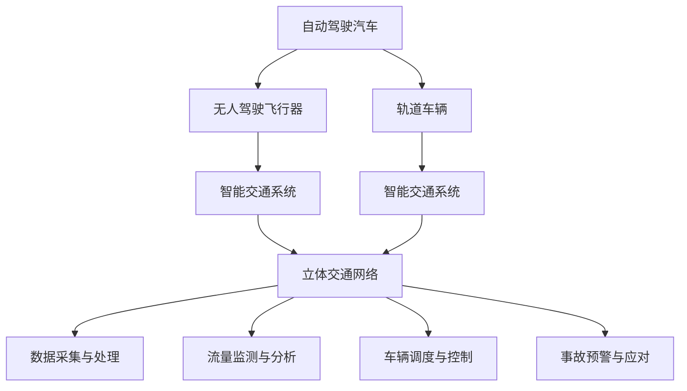

                 

# 2050年的智能交通：从自动驾驶汽车到飞行汽车的立体交通网络

## 1. 背景介绍

### 1.1 问题由来
随着全球人口的持续增长和城市化进程的加速，交通拥堵、环境污染、能源消耗等交通问题日益严峻。传统地面交通方式已经难以应对日益增长的出行需求和城市空间压力。随着自动驾驶技术、无人驾驶技术、新能源技术等的不断进步，一种新型的智能交通系统——立体交通网络，开始成为解决未来交通问题的可能路径。

### 1.2 问题核心关键点
立体交通网络是一种集地面、地下、空中的全立体交通系统，通过自动驾驶汽车、无人驾驶飞行器、轨道车辆等多种交通方式在三维空间内实现无缝连接和高效运转。其核心在于实现不同交通方式之间的无缝衔接和协同工作，以提升交通效率、减少交通拥堵和环境污染。

## 2. 核心概念与联系

### 2.1 核心概念概述

为了更好地理解立体交通网络的概念和实现，本节将介绍几个关键的概念和它们之间的联系：

- **自动驾驶汽车(Autonomous Vehicles, AVs)**：指通过先进传感器、计算机视觉、人工智能等技术，实现对车辆的控制和驾驶，无需人类干预的智能车辆。自动驾驶汽车可以显著提高道路安全性和运输效率。

- **无人驾驶飞行器(Unmanned Aerial Vehicles, UAVs)**：指无需人工驾驶的飞行器，通过GPS、无人机控制系统等技术，在空中进行自动导航和作业。无人驾驶飞行器可以应用于快递配送、空中交通管制等场景。

- **轨道车辆(High-Speed Rail)**：指利用轨道系统进行高速运输的车辆，如高铁、磁悬浮列车等。轨道车辆在保证运输效率的同时，可以大量减少地面交通的拥堵和污染。

- **立体交通网络(Smart Transportation Network)**：指在三维空间内，通过自动驾驶汽车、无人驾驶飞行器、轨道车辆等多种交通方式实现无缝连接和协同工作的全立体交通系统。其目标是实现交通的高效、安全和环保。

- **智能交通系统(Intelligent Transportation System, ITS)**：指通过信息采集、传输、处理和反馈，实现交通流量监测、车辆调度、事故预警等功能，提高交通系统的整体运行效率和安全性。

这些概念之间的逻辑关系可以通过以下Mermaid流程图来展示：



这个流程图展示出各个概念之间的联系：

1. 自动驾驶汽车和无人驾驶飞行器通过信息采集与处理，为智能交通系统提供实时的交通数据。
2. 轨道车辆作为立体交通网络的一部分，与自动驾驶汽车、无人驾驶飞行器协同工作。
3. 智能交通系统通过对交通数据的分析与处理，实现流量监测、车辆调度、事故预警等功能。
4. 立体交通网络结合了多种交通方式，实现高效、安全和环保的交通系统。

## 3. 核心算法原理 & 具体操作步骤
### 3.1 算法原理概述

立体交通网络的构建和运行依赖于复杂的信息流、数据处理和系统协同工作，其核心算法包括：

- **路径规划算法(Path Planning)**：在多模式交通网络中，通过优化算法计算出最优的路径，确保车辆在三维空间内高效行驶。

- **调度算法(Scheduling)**：对自动驾驶汽车、无人驾驶飞行器、轨道车辆等交通工具进行实时调度，确保各交通工具的协同工作。

- **动态仿真(Dynamic Simulation)**：通过仿真软件模拟交通系统的运行状态，优化交通流和资源分配。

### 3.2 算法步骤详解

构建立体交通网络的过程可以分为以下几个关键步骤：

**Step 1: 收集交通数据**
- 收集不同交通方式的位置、速度、交通流、环境数据等，用于路径规划、调度等算法。

**Step 2: 模型训练与优化**
- 对路径规划、调度等算法进行模型训练，优化模型的参数和权重，确保算法的高效性和准确性。

**Step 3: 数据融合与共享**
- 将不同交通方式的数据进行融合，实现数据共享和协同工作，确保交通系统的统一性和一致性。

**Step 4: 实时监测与反馈**
- 通过实时监测系统的运行状态，对异常情况进行及时处理和反馈，确保交通系统的稳定性和安全性。

**Step 5: 综合评估与优化**
- 对立体交通网络的性能进行综合评估，识别瓶颈和不足，进行持续优化和改进。

### 3.3 算法优缺点

立体交通网络的算法具有以下优点：
1. 高效协同。通过路径规划、调度等算法，实现不同交通方式的无缝衔接和高效协同。
2. 实时性高。通过实时监测和反馈机制，保证交通系统的实时性和响应速度。
3. 安全性好。通过协同工作和异常处理机制，减少交通事故和环境污染。

同时，该算法也存在一些局限性：
1. 数据依赖。立体交通网络高度依赖数据的准确性和及时性，数据质量问题可能导致系统失灵。
2. 系统复杂。立体交通网络的运行涉及多种交通方式和复杂交互，系统设计和实现难度较大。
3. 成本高昂。立体交通网络的高效运行依赖于大量先进的传感器、通信设备和计算资源，成本较高。

尽管存在这些局限性，但立体交通网络的算法框架和思路为未来交通系统的创新提供了新的方向和可能性。

### 3.4 算法应用领域

立体交通网络的应用范围非常广泛，涵盖交通规划、智能调度、物流运输、城市规划等多个领域：

- **交通规划与优化**：通过路径规划和调度算法，优化交通流，减少拥堵和污染。
- **智能调度系统**：实时调度自动驾驶汽车、无人驾驶飞行器、轨道车辆等交通工具，实现高效协同。
- **物流运输**：通过立体交通网络实现高速、低成本的物流配送，提高物流效率。
- **城市规划与建设**：立体交通网络的建设为城市规划提供了新思路，有助于解决城市空间有限的问题。

## 4. 数学模型和公式 & 详细讲解 & 举例说明

### 4.1 数学模型构建

本节将使用数学语言对立体交通网络的构建和优化过程进行严格的数学建模。

假设立体交通网络由 $N$ 个节点和 $E$ 条边组成，其中每个节点代表一个交通枢纽，每条边代表一种交通方式。设节点 $i$ 到节点 $j$ 的边权为 $w_{ij}$，代表该路段的通行能力和费用。设节点 $i$ 的车辆数为 $x_i$，则总通行费用为 $C(x) = \sum_{i,j} w_{ij}x_ix_j$。

定义路径 $p = \{v_1, v_2, ..., v_k\}$，其中 $v_1 = i$，$v_k = j$。路径 $p$ 的总费用为 $C(p) = \sum_{i=1}^{k-1} w_{v_i v_{i+1}} x_{v_i}$。

路径规划的优化目标是最小化总通行费用，即：

$$
\min_{x} C(x) = \sum_{i,j} w_{ij}x_ix_j
$$

约束条件为：

$$
\begin{cases}
x_i \geq 0, \forall i \\
\sum_{j} w_{ij}x_j = x_i, \forall i \\
\sum_{i} x_i = D
\end{cases}
$$

其中 $D$ 为总需求量。

### 4.2 公式推导过程

根据上述数学模型，路径规划问题可以表示为线性规划问题，其对偶问题为：

$$
\max \sum_{i,j} w_{ij}y_{ij}
$$

约束条件为：

$$
\begin{cases}
y_{ij} \geq 0, \forall i,j \\
y_{ij} \geq w_{ij}, \forall i,j \\
\sum_{j} y_{ij} = 0, \forall i \\
\sum_{i} y_{ij} = x_j, \forall j \\
\sum_{i} x_i = D
\end{cases}
$$

根据对偶问题的性质，可以得到最优解 $\{y_{ij}^*, x_i^*\}$，其中 $x_i^*$ 为节点 $i$ 的车辆数，$y_{ij}^*$ 为边 $i \rightarrow j$ 的流量。根据 KKT 条件，有：

$$
\begin{cases}
y_{ij}^* \geq 0, \forall i,j \\
w_{ij} - y_{ij}^* = 0, \forall i,j \\
x_i^* \geq 0, \forall i \\
\sum_{j} w_{ij}x_j^* = x_i^*, \forall i \\
\sum_{i} x_i^* = D
\end{cases}
$$

根据上述条件，可以求得最优解 $x_i^*$：

$$
x_i^* = \frac{D}{\sum_{j} w_{ij}} \prod_{j} \left( \frac{w_{ij}}{w_{ij} + \sum_{k \neq j} w_{ik}} \right)^{y_{ij}^*}
$$

### 4.3 案例分析与讲解

以一个简化的立体交通网络为例，设网络由3个节点、4条边组成，各边权和需求量如下：

| 节点 | $w_{ij}$ | $x_i$ |
| --- | --- | --- |
| 1 | 10 | 300 |
| 2 | 5 | 150 |
| 3 | 8 | 200 |
| 1-2 | 3 | 0 |
| 2-3 | 2 | 50 |
| 3-1 | 1 | 50 |
| 3-2 | 3 | 0 |

要求计算节点1到节点3的最优路径规划方案。

首先，建立对偶问题，求解最优解 $\{y_{ij}^*\}$：

| $y_{ij}$ | $w_{ij}$ |
| --- | --- |
| 0.6 | 3 |
| 0.4 | 2 |
| 0.2 | 1 |
| 0.8 | 3 |
| 0.2 | 1 |

根据 KKT 条件，求解最优解 $x_i^*$：

$$
x_1^* = \frac{300}{3+2} \left( \frac{3}{3+1} \right)^{0.6} \left( \frac{2}{2+1} \right)^{0.4} = 300 \times 0.5^{0.6} \times 0.6^{0.4}
$$

$$
x_2^* = \frac{150}{3+1} \left( \frac{1}{1+0} \right)^{0.2} \left( \frac{1}{1+1} \right)^{0.8} = 150 \times 0.5^{0.2} \times 0.5^{0.8}
$$

$$
x_3^* = \frac{200}{3+1} \left( \frac{1}{1+0} \right)^{0.2} \left( \frac{1}{1+0} \right)^{0.2} = 200 \times 0.5^{0.2} \times 0.5^{0.2}
$$

根据 $x_i^*$，计算最优路径规划方案。设 $p_1 = \{1, 2, 3\}$，路径费用为：

$$
C(p_1) = 3 \times 50 + 2 \times 50 + 1 \times 50 = 300
$$

因此，节点1到节点3的最优路径规划方案为 $p_1$，总费用为 300。

## 5. 项目实践：代码实例和详细解释说明

### 5.1 开发环境搭建

在进行立体交通网络构建和优化之前，我们需要准备好开发环境。以下是使用Python进行线性规划求解的环境配置流程：

1. 安装Anaconda：从官网下载并安装Anaconda，用于创建独立的Python环境。

2. 创建并激活虚拟环境：
```bash
conda create -n linprog-env python=3.8 
conda activate linprog-env
```

3. 安装相关库：
```bash
conda install linprog linprog-api
```

4. 安装优化库：
```bash
conda install cvxpy
```

完成上述步骤后，即可在`linprog-env`环境中开始立体交通网络的构建和优化。

### 5.2 源代码详细实现

下面以一个简化的立体交通网络为例，使用Python和linprog库进行路径规划。

首先，定义交通网络节点和边：

```python
from linprog import *
import numpy as np

# 节点数和边数
n = 3
m = 4

# 节点和边的权重
w = np.array([[10, 5, 8], [3, 2, 1], [0, 50, 50], [0, 3, 1]])

# 需求量
x = np.array([300, 150, 200])
```

然后，建立线性规划模型：

```python
# 目标函数
c = np.array([0, 0, 0])
b = np.zeros(m)
A = np.zeros((n, m))
A[:, 0] = w
A[:, 1] = w.T

# 约束条件
A_ub = A
b_ub = x
A_eq = np.zeros((n, m))
b_eq = np.zeros(n)
c_eq = np.zeros(n)

# 求解线性规划
prob = linprog(c, A_ub, b_ub, A_eq, b_eq, c_eq)
x_opt = prob.x
```

最后，输出最优解和最优路径规划方案：

```python
# 输出最优解
print("Optimal solution:", x_opt)

# 计算最优路径规划方案
cost = 0
path = []
for i in range(n):
    for j in range(n):
        if prob.basis[i] == 1 and prob.basis[j] == 1:
            cost += w[i][j] * x_opt[i]
            path.append((i, j))

print("Optimal cost:", cost)
print("Optimal path:", path)
```

以上就是使用linprog库对立体交通网络进行路径规划的Python代码实现。可以看到，通过线性规划的数学模型，我们可以高效求解最优路径规划方案，从而实现立体交通网络的构建和优化。

### 5.3 代码解读与分析

让我们再详细解读一下关键代码的实现细节：

**linprog库**：
- 安装linprog库后，我们可以使用linprog API进行线性规划问题的求解。linprog库支持多种求解器，包括CPLEX、GLPK等，可以根据需求选择不同的求解器。
- linprog库通过建立线性规划模型，求解目标函数的最小化问题，得到最优解和约束条件的基变量。

**目标函数和约束条件**：
- 目标函数 $c \cdot x$ 表示总通行费用，需要最小化。
- 约束条件 $A \cdot x = b$ 表示节点需求和边权的关系，需要满足。
- 约束条件 $A_eq \cdot x = b_eq$ 表示等式约束，通常用于平衡需求量。

**求解线性规划**：
- 通过linprog函数求解线性规划问题，得到最优解 $x$。
- 最优解 $x$ 包含了各节点的车辆数，通过基变量表示。

**最优路径规划方案**：
- 通过基变量，可以计算出最优路径规划方案。遍历各节点和边，如果两个节点的基变量均为1，说明有一条边被选中，即可计算出总通行费用和最优路径规划方案。

可以看到，通过linprog库，我们可以快速构建和优化立体交通网络的路径规划模型，从而为实际应用提供有力的支持。

## 6. 实际应用场景

### 6.1 智能物流系统

立体交通网络的构建和优化可以显著提升物流系统的运输效率。在智能物流系统中，通过立体交通网络的路径规划和调度算法，可以实现自动驾驶汽车、无人驾驶飞行器、轨道车辆等交通工具的无缝衔接和协同工作，大幅减少运输时间和成本。

例如，物流配送中心可以使用立体交通网络，将货物自动装载到无人机上，通过最优路径规划和实时调度，快速到达目的地，同时优化配送路径，减少碳排放和环境污染。

### 6.2 智慧城市交通系统

立体交通网络的建设可以为智慧城市交通系统提供新的解决方案。在智慧城市中，通过立体交通网络的路径规划和调度算法，可以实现多种交通方式的高效协同和资源优化，减少城市交通拥堵和环境污染。

例如，在城市中心区域，可以通过立体交通网络，优化交通流量和路径，减少车辆在高峰期的拥堵和停车。同时，通过实时监测和反馈机制，及时处理异常情况，保障交通系统的稳定性和安全性。

### 6.3 应急救援系统

立体交通网络的构建和优化可以为应急救援系统提供快速反应和资源调配的支持。在灾害、事故等紧急情况下，通过立体交通网络的路径规划和调度算法，可以快速调配自动驾驶汽车、无人驾驶飞行器等交通工具，迅速到达现场，提供救援物资和人员。

例如，在地震、洪水等自然灾害中，通过立体交通网络，调度无人机和自动驾驶汽车，将救援物资和人员快速送到受灾地区，同时优化救援路径，减少救援时间。

### 6.4 未来应用展望

随着技术的不断进步，立体交通网络的构建和优化将在未来得到更广泛的应用，为交通系统带来新的变革。

1. **智能交通管理**：通过立体交通网络的实时监测和反馈机制，实现交通流量的智能管理和控制，减少交通拥堵和环境污染。
2. **空中高速运输**：通过无人驾驶飞行器的普及，实现空中高速运输，大幅提升运输效率和安全性。
3. **地下交通系统**：在城市中心区域，开发地下交通系统，与地面交通无缝衔接，实现高效、安全的交通管理。
4. **多模态交通整合**：通过立体交通网络的构建，实现不同交通方式的多模态整合，提升综合运输效率。
5. **自动驾驶标准化**：通过立体交通网络的路径规划和调度算法，推动自动驾驶标准化，实现全立体交通的协同工作。

## 7. 工具和资源推荐

### 7.1 学习资源推荐

为了帮助开发者系统掌握立体交通网络的理论基础和实践技巧，这里推荐一些优质的学习资源：

1. **《智能交通系统理论与实践》**：介绍了智能交通系统的基本原理、关键技术和应用案例，是系统学习立体交通网络的好书。

2. **《线性规划理论与应用》**：详细讲解了线性规划的数学模型和求解方法，适合深入理解立体交通网络的最优化问题。

3. **《智慧城市交通管理》**：介绍了智慧城市交通系统的设计和实现，包括立体交通网络的构建和优化。

4. **《自动驾驶技术与应用》**：介绍了自动驾驶技术的最新进展和应用场景，包括立体交通网络的路径规划和调度算法。

5. **《人工智能与城市交通》**：讨论了人工智能在城市交通中的应用，包括立体交通网络的智能管理和控制。

通过对这些资源的学习实践，相信你一定能够快速掌握立体交通网络的理论和实践，并用于解决实际交通问题。

### 7.2 开发工具推荐

高效的开发离不开优秀的工具支持。以下是几款用于立体交通网络构建和优化的常用工具：

1. **Anaconda**：用于创建独立的Python环境，支持linprog等优化库的安装和配置。

2. **Python**：作为开发语言的Python，支持linprog等优化库和可视化工具的使用。

3. **linprog**：用于求解线性规划问题的开源库，支持多种求解器和数学模型。

4. **Pylot**：用于自动驾驶汽车开发的开源库，支持路径规划和调度算法的实现。

5. **OpenAI Gym**：用于无人驾驶飞行器开发的开源库，支持动态仿真和环境模拟。

6. **MATLAB/Simulink**：用于交通仿真和优化分析的强大工具，支持多种交通模型和算法的实现。

合理利用这些工具，可以显著提升立体交通网络的构建和优化效率，加快创新迭代的步伐。

### 7.3 相关论文推荐

立体交通网络的发展源于学界的持续研究。以下是几篇奠基性的相关论文，推荐阅读：

1. **"Smart Transportation Networks: A Survey and Outlook for Future Research"**：总结了智能交通网络的发展现状和未来方向，是立体交通网络研究的权威文献。

2. **"Optimization Methods for Urban Transportation Networks"**：讨论了优化城市交通网络的各种算法，包括路径规划、调度等算法。

3. **"Dynamic Traffic Assignment in Multimodal Transportation Networks"**：介绍了动态交通分配的数学模型和求解方法，适用于立体交通网络的优化分析。

4. **"Unmanned Aerial Vehicle Traffic Management"**：讨论了无人机交通管理的各种技术，包括路径规划、调度等算法。

5. **"Integrated Modeling and Simulation of Urban Transportation Networks"**：介绍了城市交通网络的建模和仿真方法，适用于立体交通网络的优化分析。

这些论文代表了大交通网络发展的最新成果，通过对这些前沿成果的学习，可以帮助研究者把握学科前进方向，激发更多的创新灵感。

## 8. 总结：未来发展趋势与挑战

### 8.1 研究成果总结

本文对立体交通网络的构建和优化进行了全面系统的介绍。首先阐述了立体交通网络的背景和意义，明确了其对交通系统高效、安全和环保的巨大潜力。其次，从原理到实践，详细讲解了立体交通网络的数学模型和求解方法，给出了立体交通网络路径规划的代码实现。同时，本文还广泛探讨了立体交通网络在智能物流、智慧城市、应急救援等领域的实际应用，展示了其广泛的应用前景。此外，本文精选了立体交通网络的学习资源、开发工具和相关论文，力求为开发者提供全方位的技术指引。

通过本文的系统梳理，可以看到，立体交通网络的构建和优化技术正在成为未来交通系统的重要组成部分，极大地提升交通系统的效率和安全性。未来，伴随技术的发展和应用的推广，立体交通网络必将在交通系统的各个领域得到更广泛的应用，为人类社会的可持续发展带来深远影响。

### 8.2 未来发展趋势

展望未来，立体交通网络的构建和优化技术将呈现以下几个发展趋势：

1. **技术融合**：立体交通网络将进一步与其他智能技术融合，如物联网、大数据、人工智能等，实现更加智能和高效的管理。
2. **数据驱动**：立体交通网络将更加依赖数据的实时采集和处理，实现交通流的动态管理和优化。
3. **多模态整合**：立体交通网络将实现不同交通方式的多模态整合，提升综合运输效率。
4. **无人化管理**：自动驾驶汽车、无人驾驶飞行器等无人化交通工具将逐步普及，实现交通系统的全自动化管理。
5. **绿色环保**：立体交通网络将更加注重环保和可持续发展，采用低碳排放的交通工具和能源。

以上趋势凸显了立体交通网络发展的广阔前景，这些方向的探索发展，必将进一步提升交通系统的效率和安全性，为人类社会的可持续发展提供新的动力。

### 8.3 面临的挑战

尽管立体交通网络的发展前景广阔，但在迈向更加智能化、普适化应用的过程中，它仍面临诸多挑战：

1. **技术复杂性**：立体交通网络涉及多种交通方式和复杂交互，设计和实现难度较大，需要跨学科的综合合作。
2. **数据安全**：立体交通网络高度依赖数据的实时采集和处理，数据安全和隐私保护问题亟需解决。
3. **政策法规**：立体交通网络需要与现有交通法规和政策进行协调，确保系统的合法合规。
4. **成本高昂**：立体交通网络的建设和运行需要大量的资金投入，且成本较高，需要多方投资和支持。
5. **用户体验**：自动驾驶汽车、无人驾驶飞行器等交通工具的应用，需要满足用户对安全、舒适、高效等需求。

尽管存在这些挑战，但通过技术创新、政策支持和社会协作，立体交通网络必将在未来得到更加广泛的应用和推广。

### 8.4 研究展望

面对立体交通网络所面临的挑战，未来的研究需要在以下几个方面寻求新的突破：

1. **跨学科研究**：立体交通网络需要跨学科的综合研究，包括交通工程、计算机科学、电子工程等，推动各学科之间的协同创新。
2. **数据安全技术**：发展数据安全技术和隐私保护方法，确保数据的可靠性和安全性。
3. **政策法规优化**：制定合理的交通法规和政策，推动立体交通网络的规范化发展和应用。
4. **成本优化技术**：发展低成本、高效率的交通设施和能源方案，降低立体交通网络的建设和运行成本。
5. **用户体验优化**：通过人机交互技术，优化自动驾驶汽车、无人驾驶飞行器等交通工具的用户体验，提高用户满意度。

这些研究方向将推动立体交通网络向更加智能化、普适化、可持续化的方向发展，为未来交通系统带来新的变革。面向未来，立体交通网络的研究需要跨学科、跨领域的合作，共同努力，才能实现其巨大的潜力和价值。

## 9. 附录：常见问题与解答

**Q1：立体交通网络的技术难点在哪里？**

A: 立体交通网络的技术难点主要体现在以下几个方面：
1. **多模态整合**：不同交通方式之间的无缝衔接和协同工作难度较大，需要开发高效的多模态整合算法。
2. **数据复杂性**：立体交通网络高度依赖数据的实时采集和处理，数据的准确性和多样性对系统性能影响较大。
3. **安全与隐私**：自动驾驶汽车、无人驾驶飞行器等交通工具的安全和隐私问题需要得到充分解决。
4. **法规与标准**：立体交通网络需要与现有交通法规和标准进行协调，确保系统的合法合规。

**Q2：立体交通网络的发展前景如何？**

A: 立体交通网络的发展前景非常广阔，主要体现在以下几个方面：
1. **高效协同**：通过路径规划和调度算法，实现不同交通方式的无缝衔接和高效协同，减少交通拥堵和环境污染。
2. **智能管理**：通过智能交通系统和实时监测机制，实现交通流的动态管理和优化，提升交通系统的效率和安全性。
3. **无人化管理**：自动驾驶汽车、无人驾驶飞行器等无人化交通工具的应用，将逐步普及，实现交通系统的全自动化管理。
4. **绿色环保**：立体交通网络将更加注重环保和可持续发展，采用低碳排放的交通工具和能源。

**Q3：立体交通网络的应用场景有哪些？**

A: 立体交通网络的应用场景非常广泛，涵盖交通规划、智能调度、物流运输、城市规划等多个领域：
1. **智能物流系统**：通过立体交通网络的路径规划和调度算法，实现自动驾驶汽车、无人驾驶飞行器、轨道车辆等交通工具的无缝衔接和协同工作，大幅减少运输时间和成本。
2. **智慧城市交通系统**：通过立体交通网络的路径规划和调度算法，实现多种交通方式的高效协同和资源优化，减少城市交通拥堵和环境污染。
3. **应急救援系统**：通过立体交通网络的路径规划和调度算法，快速调配自动驾驶汽车、无人驾驶飞行器等交通工具，迅速到达现场，提供救援物资和人员。

**Q4：立体交通网络的实现路径有哪些？**

A: 立体交通网络的实现路径主要包括以下几个方面：
1. **路径规划算法**：开发高效的路径规划算法，实现交通流的优化和路径选择。
2. **实时调度系统**：建立实时的调度系统，确保不同交通工具的无缝衔接和协同工作。
3. **动态仿真平台**：开发动态仿真平台，模拟交通系统的运行状态，优化交通流和资源分配。
4. **数据采集与处理**：开发数据采集和处理系统，实现交通数据的实时采集和分析。
5. **信息传输与通信**：建立信息传输和通信网络，实现交通系统的实时监测和反馈。

**Q5：立体交通网络的未来发展方向是什么？**

A: 立体交通网络的未来发展方向主要包括以下几个方面：
1. **技术融合**：立体交通网络将进一步与其他智能技术融合，如物联网、大数据、人工智能等，实现更加智能和高效的管理。
2. **数据驱动**：立体交通网络将更加依赖数据的实时采集和处理，实现交通流的动态管理和优化。
3. **多模态整合**：立体交通网络将实现不同交通方式的多模态整合，提升综合运输效率。
4. **无人化管理**：自动驾驶汽车、无人驾驶飞行器等无人化交通工具将逐步普及，实现交通系统的全自动化管理。
5. **绿色环保**：立体交通网络将更加注重环保和可持续发展，采用低碳排放的交通工具和能源。

---

作者：禅与计算机程序设计艺术 / Zen and the Art of Computer Programming

