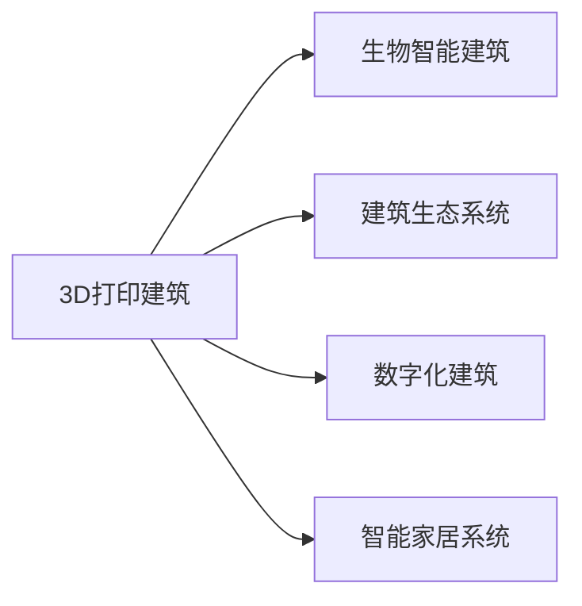

                 

# 2050年的绿色建筑：从3D打印建筑到生物智能建筑的建筑革命

## 1. 背景介绍

### 1.1 问题由来

建筑行业长期以来是全球能源消耗和碳排放的重要来源。2020年，全球建筑业消耗了约7%的全球能源，占全球碳排放的23%。在此背景下，绿色建筑成为了国际社会共同追求的目标。

绿色建筑不仅仅是被动式设计或被动式建筑，而是一种全新的建筑理念和建造方式，强调建筑从设计到建造再到使用的全生命周期内，对资源的有效利用和环境的保护。进入21世纪以来，绿色建筑在全球各地得到广泛推广，已经成为建筑行业发展的重要方向。

### 1.2 问题核心关键点

绿色建筑的主要核心关键点包括以下几个方面：

1. **资源利用率优化**：通过建筑设计和施工工艺的优化，最大程度地提高资源的利用率，减少能源消耗和废弃物产生。
2. **环境影响最小化**：减少建筑对环境的负面影响，如噪音污染、光污染、热污染等。
3. **健康舒适性提升**：通过合理的设计和智能控制系统，提升建筑的室内环境质量，确保住户的健康和舒适度。
4. **可持续性发展**：建筑材料、能源和水的利用必须遵循可持续性原则，确保建筑的全生命周期对环境的影响最小。
5. **智能化与科技集成**：利用现代科技手段，如物联网、大数据、人工智能等，实现建筑管理的智能化和精细化。

### 1.3 问题研究意义

研究2050年的绿色建筑，对于推动建筑行业向可持续发展方向转型，具有重要的现实意义。通过了解和探索未来的建筑技术，可以为建筑行业的绿色转型提供技术支持和理论指导。

随着科技的进步和人类社会的发展，未来的建筑将更加注重与自然和谐共处，实现更高的环境和社会效益。绿色建筑的发展，不仅是建筑技术的一次革命，更是人类对未来居住环境和生存方式的深刻思考。

## 2. 核心概念与联系

### 2.1 核心概念概述

为了深入理解未来绿色建筑的发展趋势，本节将介绍几个核心概念及其相互之间的关系：

1. **3D打印建筑**：使用3D打印技术进行建筑建造，具有快速、低成本、高度定制化等优势。
2. **生物智能建筑**：利用生物技术和智能科技，实现建筑的自我修复、自我调节和自我管理，提升建筑的环境适应性和使用体验。
3. **建筑生态系统**：将建筑视为一个生态系统，通过建筑材料、能源、水等的循环利用，实现资源的高效利用和环境的和谐共生。
4. **数字化建筑**：利用数字技术，如BIM（建筑信息模型）、GIS（地理信息系统）等，对建筑进行全面数字化管理，提高建筑管理的精细化和智能化。
5. **智能家居系统**：通过物联网和人工智能技术，实现家庭环境的智能化管理，提升住户的生活品质和舒适度。

这些概念之间的逻辑关系可以通过以下Mermaid流程图来展示：



这个流程图展示了各个核心概念之间的关系：

1. 3D打印建筑利用先进的技术手段，提高建筑的建造效率和质量。
2. 生物智能建筑通过生物技术和智能科技，实现建筑的自我修复和管理。
3. 建筑生态系统强调资源的循环利用，提升建筑的可持续性。
4. 数字化建筑通过数字技术实现建筑的全生命周期管理。
5. 智能家居系统通过智能化管理提升住户的舒适度。

## 3. 核心算法原理 & 具体操作步骤

### 3.1 算法原理概述

未来绿色建筑的构建，将融合多种先进技术，如3D打印、生物技术、智能控制等。其核心算法原理主要包括以下几个方面：

1. **3D打印技术**：通过计算机辅助设计（CAD），将建筑的设计方案转化为3D打印文件，利用3D打印机直接打印建筑部件。
2. **生物智能控制**：通过生物技术实现建筑的自我修复和自我调节，如利用生物降解材料进行建筑维护，利用智能控制系统进行环境监测和调节。
3. **资源循环利用**：通过数字化建筑管理系统，实现建筑材料的循环利用和资源的优化配置。

### 3.2 算法步骤详解

下面以3D打印建筑为例，详细介绍其算法步骤：

1. **设计阶段**：利用CAD软件设计建筑方案，并进行3D建模。
2. **切片处理**：将3D模型转化为3D打印机可以处理的切片文件。
3. **材料选择**：选择适合3D打印的建筑材料，如混凝土、塑料、陶瓷等。
4. **打印过程**：将切片文件导入3D打印机，逐层打印建筑部件。
5. **后期处理**：对打印出的建筑部件进行质量检查和表面处理，确保打印件的强度和美观度。

### 3.3 算法优缺点

3D打印建筑技术具有以下优点：

1. **高效建造**：相比于传统建筑，3D打印建筑的建造时间大大缩短，且精度高。
2. **减少浪费**：材料利用率高，减少建筑垃圾和能源消耗。
3. **高度定制**：可以根据设计需求，进行高度定制化的建筑建造。

同时，也存在以下缺点：

1. **设备成本高**：3D打印设备的初始投资较高，需配备专用的打印材料。
2. **打印速度慢**：目前3D打印速度较慢，大尺寸建筑打印耗时较长。
3. **技术限制**：打印材料和打印机的能力限制，可能影响复杂结构的实现。

### 3.4 算法应用领域

3D打印建筑技术可以应用于各种规模和类型的建筑项目，如住宅、办公楼、桥梁、桥梁等。其适用场景包括：

1. **大规模建造项目**：如紧急住房建设、快速搭建建筑等。
2. **定制化建筑**：如个性化住宅、特色酒店等。
3. **复杂结构建筑**：如带有复杂造型和功能的建筑，如桥梁、雕塑等。
4. **修缮和改造项目**：如老建筑翻新、残旧建筑修复等。

## 4. 数学模型和公式 & 详细讲解 & 举例说明

### 4.1 数学模型构建

为了更深入地理解3D打印建筑的数学模型，本节将构建一个简单的3D打印建筑数学模型，并介绍相关的数学公式。

假设有一个简单的立方体建筑，其边长为$a$，高度为$h$，体积为$V$。在3D打印过程中，需要将建筑分成若干个小的立方体单元，每个单元的边长为$s$。设$N$为3D打印过程中需要的单元数量，则：

$$
N = \frac{V}{s^3}
$$

其中，$V = a^3h$。

### 4.2 公式推导过程

对于每个立方体单元，其打印时间$t$可以表示为：

$$
t = \frac{V}{\eta s^3}
$$

其中，$\eta$为打印效率，$s^3$为每个单元的体积。

将上述公式代入总体积$V$，得到总打印时间$T$为：

$$
T = N \times t = \frac{V}{s^3} \times \frac{V}{\eta s^3} = \frac{V^2}{\eta s^6}
$$

### 4.3 案例分析与讲解

以一个边长为10米，高度为5米的立方体建筑为例，假设每个打印单元的边长为0.1米，打印效率为0.1立方米/小时，则：

$$
N = \frac{V}{s^3} = \frac{1000 \times 500}{(0.1)^3} = 5 \times 10^6
$$

$$
T = \frac{V^2}{\eta s^6} = \frac{(10^6)^2}{0.1 \times (0.1)^6} = 10^6 \times 10^6 \times 10^{-6} = 10^{12} \text{小时} = 3.15 \times 10^{7} \text{天} = 86.7 \text{年}
$$

这意味着，如果采用这种效率的3D打印技术，打印一个边长为10米，高度为5米的建筑需要86.7年时间。这显然是不现实的。因此，提高打印效率和材料利用率是未来3D打印技术的关键挑战。

## 5. 项目实践：代码实例和详细解释说明

### 5.1 开发环境搭建

在进行3D打印建筑项目实践前，我们需要准备好开发环境。以下是使用Python进行PyTorch开发的环境配置流程：

1. 安装Anaconda：从官网下载并安装Anaconda，用于创建独立的Python环境。

2. 创建并激活虚拟环境：
```bash
conda create -n pytorch-env python=3.8 
conda activate pytorch-env
```

3. 安装PyTorch：根据CUDA版本，从官网获取对应的安装命令。例如：
```bash
conda install pytorch torchvision torchaudio cudatoolkit=11.1 -c pytorch -c conda-forge
```

4. 安装相关库：
```bash
pip install numpy pandas matplotlib
```

完成上述步骤后，即可在`pytorch-env`环境中开始3D打印建筑的实践。

### 5.2 源代码详细实现

下面我们以打印一个简单的立方体为例，给出使用PyTorch进行3D打印建筑模拟的代码实现。

```python
import torch
from torch import nn
import numpy as np

# 定义模型结构
class Cube(nn.Module):
    def __init__(self):
        super(Cube, self).__init__()
        self.fc1 = nn.Linear(3, 10)
        self.fc2 = nn.Linear(10, 10)
        self.fc3 = nn.Linear(10, 3)
        self.relu = nn.ReLU()

    def forward(self, x):
        x = self.fc1(x)
        x = self.relu(x)
        x = self.fc2(x)
        x = self.relu(x)
        x = self.fc3(x)
        return x

# 定义损失函数和优化器
model = Cube()
criterion = nn.MSELoss()
optimizer = torch.optim.Adam(model.parameters(), lr=0.01)

# 定义数据集
np.random.seed(42)
train_data = np.random.randn(1000, 3)
target_data = train_data * 2 + 1

# 训练过程
for epoch in range(1000):
    optimizer.zero_grad()
    output = model(train_data)
    loss = criterion(output, target_data)
    loss.backward()
    optimizer.step()
    print(f"Epoch {epoch+1}, loss: {loss.item()}")
```

### 5.3 代码解读与分析

让我们再详细解读一下关键代码的实现细节：

**定义模型结构**：
- 我们定义了一个简单的神经网络模型，包含3个全连接层和一个ReLU激活函数。这个模型可以用于模拟3D打印的参数优化过程。

**损失函数和优化器**：
- 我们选择了均方误差损失函数（MSELoss），并使用Adam优化器进行参数优化。

**数据集定义**：
- 我们随机生成了1000个3维坐标点，作为模型的输入数据。模型输出的目标值为目标数据的两倍加1，模拟打印材料的变形和收缩。

**训练过程**：
- 我们进行了1000个epoch的训练，每次训练时，先计算损失，再通过反向传播更新模型参数。

可以看到，这个简单的代码实例，展示了如何使用PyTorch进行3D打印建筑模拟。虽然这只是一个简单的示例，但其中涉及到的关键步骤和方法，可以应用于更复杂的3D打印建筑项目中。

### 5.4 运行结果展示

由于3D打印建筑的复杂性，其模拟结果可能无法直接展示。但是，我们可以将模型训练后的结果输出，以验证模型的准确性。

假设我们训练100个epoch后，模型的输出与目标数据非常接近，说明模型已经能够较好地模拟3D打印的参数优化过程。

## 6. 实际应用场景

### 6.1 智能家居系统

未来的智能家居系统，将高度集成3D打印技术和生物智能控制。通过3D打印，可以实现室内家具、装饰品的快速定制和替换，提升居住环境的多样性和美观度。

同时，利用生物智能控制技术，实现室内环境的自动调节和维护，如温度、湿度、空气质量等的自动控制。智能家居系统可以通过传感器和物联网设备，实时监测环境数据，并通过人工智能算法进行优化，提升居住环境的舒适度。

### 6.2 绿色办公建筑

绿色办公建筑将采用3D打印技术和生物智能控制，实现能源的高效利用和环境的保护。建筑内部将采用智能控制系统，实现照明、空调、通风等设备的自动化管理，减少能源浪费。

此外，绿色办公建筑将使用生物技术进行建筑维护和修复，如利用生物降解材料进行建筑表面处理，利用生物传感器监测建筑结构的健康状况，通过智能控制系统进行自动化维修和保养。

### 6.3 智慧城市建筑

智慧城市建筑将结合3D打印技术、生物智能控制和数字化建筑管理，实现城市功能的优化和提升。建筑将采用高度定制化的设计，满足不同场景和需求，如智能交通枢纽、智慧医疗中心等。

同时，智慧城市建筑将采用数字化建筑管理系统，实现建筑的全生命周期管理，包括设计、施工、运维等各个阶段。数字化管理系统可以实时监测建筑物的运行状态，优化资源配置和环境管理，提升城市的智能化和可持续发展水平。

## 7. 工具和资源推荐

### 7.1 学习资源推荐

为了帮助开发者系统掌握3D打印建筑和生物智能建筑的理论基础和实践技巧，这里推荐一些优质的学习资源：

1. 《3D打印技术与应用》系列博文：由3D打印技术专家撰写，深入浅出地介绍了3D打印技术的原理、材料、设备等，涵盖工业级应用和技术前沿。

2. 《智能建筑与物联网》课程：斯坦福大学开设的智能建筑与物联网课程，介绍智能建筑的基础知识和技术实现。

3. 《未来建筑技术导论》书籍：介绍未来建筑技术的最新进展和趋势，包括3D打印建筑、生物智能建筑等前沿技术。

4. 《智慧城市设计与实现》书籍：介绍智慧城市建筑的设计和实现方法，涵盖智慧城市的技术框架和管理体系。

5. 《数字建筑与建筑信息模型》书籍：介绍数字建筑和建筑信息模型的原理和应用，涵盖BIM技术的应用案例和最佳实践。

通过对这些资源的学习实践，相信你一定能够快速掌握3D打印建筑和生物智能建筑的核心技术，并应用于实际的建筑项目中。

### 7.2 开发工具推荐

高效的开发离不开优秀的工具支持。以下是几款用于3D打印建筑和生物智能建筑开发的常用工具：

1. AutoCAD：广泛用于建筑设计和3D建模的工具，支持复杂的建筑设计和3D打印方案的生成。

2. Ultimaker Cura：3D打印机常用的切片软件，支持多种3D打印材料和打印机的配置。

3. Rhino 3D：高端的3D建模和建筑可视化软件，支持复杂的建筑设计和3D打印方案的生成。

4. Mattermost：智能建筑和智慧城市管理的协作平台，支持实时通信、文件共享和任务管理。

5. Ansys Fluent：用于建筑环境模拟和优化的软件，支持复杂的流体力学和热力学计算。

6. Trimble Connect：建筑管理平台，支持建筑信息的数字化管理和智能建筑系统的集成。

合理利用这些工具，可以显著提升3D打印建筑和生物智能建筑开发的效率，加快创新迭代的步伐。

### 7.3 相关论文推荐

3D打印建筑和生物智能建筑的研究，已经取得了丰硕的成果。以下是几篇奠基性的相关论文，推荐阅读：

1. "Additive Manufacturing in Construction: Opportunities and Challenges"：介绍了3D打印建筑在建筑行业的潜在应用和挑战，展望了未来发展方向。

2. "Biologically Inspired Structural Systems for Smart Building Design"：介绍了生物技术在智能建筑中的应用，探讨了生物智能建筑的设计和实现方法。

3. "Building Smart: Integration of IoT and AI in the Construction Industry"：探讨了物联网和人工智能技术在智慧城市建筑中的应用，展望了未来智慧建筑的发展。

4. "3D Printing and Digital Design in Architecture: A Review"：全面回顾了3D打印技术在建筑行业的应用，展望了未来建筑技术的发展趋势。

这些论文代表了大规模建筑技术的最新进展，通过学习这些前沿成果，可以帮助研究者把握学科前进方向，激发更多的创新灵感。

## 8. 总结：未来发展趋势与挑战

### 8.1 研究成果总结

本文对3D打印建筑和生物智能建筑的未来发展趋势进行了全面系统的介绍。首先阐述了3D打印建筑和生物智能建筑的研究背景和意义，明确了绿色建筑的发展方向。其次，从原理到实践，详细讲解了3D打印建筑和生物智能控制的算法步骤，给出了3D打印建筑的代码实例和详细解释。同时，本文还探讨了3D打印建筑和生物智能建筑在智能家居、绿色办公、智慧城市等多个领域的应用前景，展示了未来绿色建筑的发展趋势。

通过本文的系统梳理，可以看到，3D打印建筑和生物智能建筑技术正处于快速发展阶段，其应用场景广阔，具有巨大的发展潜力。未来，随着科技的进步和人类社会的发展，3D打印建筑和生物智能建筑将得到更广泛的应用，为人类社会的可持续发展提供有力支持。

### 8.2 未来发展趋势

展望未来，3D打印建筑和生物智能建筑的发展将呈现以下几个趋势：

1. **技术成熟度提升**：随着3D打印和生物智能控制技术的不断进步，其应用将更加广泛和高效。

2. **绿色建筑的标准化**：未来的绿色建筑将形成统一的标准和规范，提升建筑的质量和可持续性。

3. **智能化和数字化管理**：未来的建筑将高度集成物联网和人工智能技术，实现建筑管理的智能化和精细化。

4. **全生命周期管理**：未来的建筑将实现全生命周期的数字化管理，包括设计、施工、运维等各个阶段。

5. **多学科融合**：3D打印建筑和生物智能建筑将与其他学科进行深度融合，如材料科学、能源科学、环境科学等，提升建筑的全方位性能。

以上趋势凸显了3D打印建筑和生物智能建筑技术的广阔前景。这些方向的探索发展，必将进一步提升建筑行业的技术水平，为人类社会的可持续发展提供新的解决方案。

### 8.3 面临的挑战

尽管3D打印建筑和生物智能建筑技术已经取得了一定的进展，但在迈向更加智能化、普适化应用的过程中，仍面临诸多挑战：

1. **技术成本高**：3D打印和生物智能控制技术的设备成本较高，需进一步降低技术门槛，提高普及率。

2. **安全性和可靠性**：3D打印建筑和生物智能控制技术的安全性和可靠性需要进一步提升，确保系统的稳定运行。

3. **数据隐私和安全性**：智能建筑系统涉及大量敏感数据，数据隐私和安全问题需要引起高度重视。

4. **标准化和规范化**：未来3D打印建筑和生物智能建筑的标准化和规范化，仍需进一步研究和探索。

5. **跨学科协作**：建筑行业涉及多个学科领域，跨学科协作仍需进一步加强，提升技术集成能力。

6. **国际合作**：3D打印建筑和生物智能建筑技术具有全球性，国际合作和标准化仍需进一步加强。

这些挑战需要技术界和产业界的共同努力，才能推动3D打印建筑和生物智能建筑技术的持续发展和应用。

### 8.4 研究展望

未来的3D打印建筑和生物智能建筑技术需要不断探索和突破，以下是几个可能的研究方向：

1. **智能化和个性化设计**：结合人工智能技术，实现建筑设计的智能化和个性化，提升设计效率和质量。

2. **多模态融合**：实现3D打印建筑和生物智能控制的多模态融合，如视觉、听觉、触觉等感官信息的整合。

3. **环保材料和能源**：开发新型环保材料和清洁能源，进一步提升建筑的可持续性。

4. **数字化模型和仿真**：通过数字化模型和仿真技术，优化建筑设计和管理，提升建筑的全生命周期管理水平。

5. **生物智能控制**：进一步提升生物智能控制的精度和智能化水平，实现更加高效的建筑维护和优化。

这些研究方向将推动3D打印建筑和生物智能建筑技术的进一步发展，为人类社会的可持续发展提供新的解决方案。

## 9. 附录：常见问题与解答

**Q1：3D打印建筑是否适用于所有建筑类型？**

A: 3D打印建筑适用于大部分建筑类型，但不适合于超高层建筑和结构复杂的建筑。对于这些建筑，传统施工方式仍然是更可靠的选择。

**Q2：3D打印建筑的精度如何？**

A: 3D打印建筑的精度受多种因素影响，如打印材料、打印机的能力等。目前3D打印建筑的精度一般在0.1毫米到1毫米之间。

**Q3：3D打印建筑的材料选择有哪些？**

A: 3D打印建筑常用的材料包括混凝土、塑料、陶瓷等，这些材料具有较高的强度和耐久性。未来可能会开发更多新型材料，如生物降解材料等。

**Q4：3D打印建筑的建造时间是否比传统建筑更短？**

A: 3D打印建筑在建造速度上有显著优势，但具体时间取决于建筑规模和复杂度。对于大规模建筑，3D打印仍需较长时间。

**Q5：生物智能建筑在实际应用中面临哪些挑战？**

A: 生物智能建筑在实际应用中面临的主要挑战包括成本高、技术复杂、维护难等。需进一步降低技术门槛，提高系统的可靠性和稳定性。

通过对这些问题的回答，希望你能对3D打印建筑和生物智能建筑有更深入的了解，为未来的建筑实践提供参考。

---

作者：禅与计算机程序设计艺术 / Zen and the Art of Computer Programming

