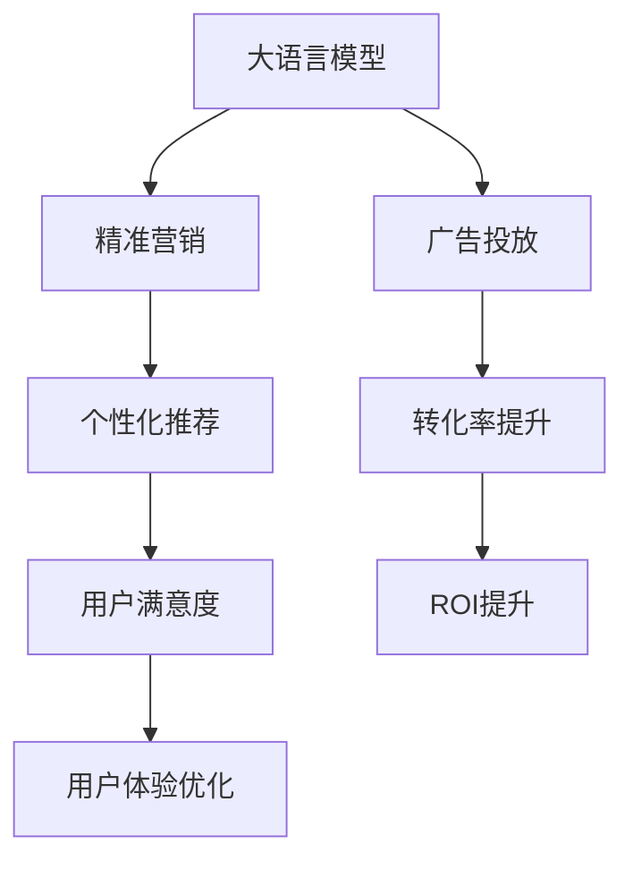

                 

# 广告和 LLM：高效的针对性营销

> 关键词：广告, 大语言模型(LLM), 精准营销, 个性化推荐, 深度学习, 自然语言处理(NLP), 决策模型

## 1. 背景介绍

### 1.1 问题由来
在当今数字经济时代，广告成为企业提升品牌知名度、扩大市场份额的重要手段。然而，传统广告往往缺乏针对性，难以精准触达目标用户，导致广告效果不尽如人意。如何利用现有数据，结合最新的技术手段，实现更高效、更精准的广告投放，成为市场营销的重要课题。

### 1.2 问题核心关键点
大语言模型（Large Language Model, LLM）作为近年来深度学习领域的重大突破，展示了强大的自然语言理解和生成能力。结合大语言模型进行广告投放，可以显著提升广告的针对性和个性化程度，从而达到更高的转化率和用户满意度。

这一方法主要基于以下核心关键点：
1. **数据驱动**：利用用户历史行为数据，如浏览记录、购买历史、社交媒体互动等，进行深度学习建模。
2. **自然语言处理**：通过大语言模型理解和分析用户语言，识别出用户的兴趣和需求。
3. **个性化推荐**：结合用户特征和兴趣，生成个性化广告内容，提高用户点击率和转化率。
4. **实时动态优化**：根据用户反馈和广告效果实时调整投放策略，提升广告效果。

### 1.3 问题研究意义
利用大语言模型进行广告投放，对于提升广告投放的精准性和效果，具有重要意义：

1. **提升广告投放效率**：通过深度学习和大语言模型，可以快速分析和理解用户需求，生成个性化广告，提高广告点击率和转化率。
2. **优化广告预算**：精准投放可以有效避免无效曝光，最大化利用广告预算，提高投资回报率。
3. **增强用户体验**：个性化广告可以更好地满足用户需求，提升用户体验和品牌忠诚度。
4. **数据驱动决策**：借助大数据分析，可以实现广告投放的实时优化，提升决策的科学性和有效性。

## 2. 核心概念与联系

### 2.1 核心概念概述

为了更好地理解大语言模型在广告投放中的应用，本节将介绍几个密切相关的核心概念：

- **大语言模型(Large Language Model, LLM)**：以自回归(如GPT)或自编码(如BERT)模型为代表的大规模预训练语言模型。通过在大规模无标签文本语料上进行预训练，学习通用的语言表示，具备强大的语言理解和生成能力。

- **广告投放(Advertising Placement)**：根据广告目标和受众特征，选择合适的广告展示位置和时机，以达到最佳广告效果。

- **精准营销(Precision Marketing)**：利用大数据分析和人工智能技术，实现精准定位和个性化推荐，提高广告投放的效果和效率。

- **个性化推荐系统(Recommendation System)**：基于用户历史行为数据和特征，推荐用户可能感兴趣的商品或内容，提升用户体验。

- **深度学习(Deep Learning)**：一类基于神经网络的机器学习技术，擅长处理复杂的数据结构和高维特征。

- **自然语言处理(Natural Language Processing, NLP)**：利用计算机技术和算法处理、理解和生成人类语言的技术。

这些核心概念之间的逻辑关系可以通过以下Mermaid流程图来展示：



这个流程图展示了大语言模型在广告投放中的应用核心逻辑：

1. 大语言模型通过深度学习技术，学习语言和广告内容的关联。
2. 利用精准营销策略，通过数据分析实现用户精准定位。
3. 生成个性化广告，提升广告投放效果。
4. 实时优化广告投放策略，提高转化率和用户满意度。
5. 整体提升广告投入回报率。

## 3. 核心算法原理 & 具体操作步骤
### 3.1 算法原理概述

利用大语言模型进行广告投放，本质上是一个深度学习和自然语言处理相结合的过程。其核心思想是：通过深度学习模型对用户历史行为数据进行建模，利用大语言模型理解和分析用户语言，生成个性化广告，以提高广告的针对性和转化率。

形式化地，假设广告数据集为 $D=\{(x_i,y_i)\}_{i=1}^N$，其中 $x_i$ 为广告文本，$y_i$ 为广告效果（如点击率、转化率等）。模型 $M_{\theta}$ 的输入为广告文本，输出为广告效果的预测值。

微调的目标是最小化损失函数：

$$
\mathcal{L}(\theta) = \frac{1}{N} \sum_{i=1}^N (y_i - \hat{y_i})^2
$$

其中 $\hat{y_i}$ 为模型对广告效果的预测值，可以通过以下步骤计算：

1. 对广告文本 $x_i$ 进行编码，得到嵌入向量 $x_i^{\prime}$。
2. 将嵌入向量 $x_i^{\prime}$ 输入到大语言模型中，得到语言理解向量 $v_i$。
3. 将语言理解向量 $v_i$ 输入到深度学习模型（如DNN、CNN等），得到广告效果的预测值 $\hat{y_i}$。

### 3.2 算法步骤详解

基于大语言模型进行广告投放的具体步骤如下：

**Step 1: 数据准备**
- 收集用户的历史行为数据，如浏览记录、购买历史、社交媒体互动等。
- 将数据清洗和预处理，转化为大语言模型能够处理的格式。
- 标注广告效果，如点击率、转化率等，构建训练集。

**Step 2: 大语言模型编码**
- 对广告文本进行分词和编码，转化为模型可接受的格式。
- 将编码后的文本输入到预训练的大语言模型中，得到语言理解向量。

**Step 3: 深度学习模型训练**
- 设计合适的深度学习模型结构，如DNN、CNN等。
- 使用广告数据集进行模型训练，最小化预测值与真实效果之间的误差。
- 调整模型超参数，如学习率、批大小、迭代轮数等。

**Step 4: 广告效果预测**
- 对新的广告文本进行编码，并输入到训练好的深度学习模型中。
- 输出广告效果的预测值，用于评估广告投放效果。

**Step 5: 实时优化**
- 根据用户反馈和广告效果实时调整广告投放策略。
- 动态优化广告预算和投放位置，提升广告效果。

### 3.3 算法优缺点

利用大语言模型进行广告投放的方法具有以下优点：
1. **高效性**：通过深度学习和大语言模型，可以快速分析和理解用户需求，生成个性化广告，提高广告点击率和转化率。
2. **精准性**：结合用户特征和兴趣，生成个性化广告，提高广告投放的精准度。
3. **实时性**：通过实时反馈和优化，可以动态调整广告投放策略，提高广告效果。

同时，该方法也存在一定的局限性：
1. **数据依赖性**：广告投放的效果高度依赖于数据的质量和数量。数据不足或数据偏差可能导致广告效果不佳。
2. **模型复杂性**：深度学习和大语言模型需要较大的计算资源，模型复杂度较高。
3. **解释性不足**：大语言模型通常缺乏可解释性，难以解释广告投放的具体原因。
4. **隐私问题**：利用用户历史数据进行广告投放，可能引发用户隐私保护问题。

尽管存在这些局限性，但就目前而言，利用大语言模型进行广告投放的方法仍是一种高效的广告投放策略。未来相关研究的重点在于如何进一步降低对数据的依赖，提高模型的解释性和可控性，同时兼顾隐私保护。

### 3.4 算法应用领域

利用大语言模型进行广告投放的应用领域非常广泛，主要包括：

1. **电商广告**：为电商平台提供个性化推荐和广告投放，提升商品销量。
2. **搜索引擎广告**：根据用户搜索历史，生成个性化搜索结果广告。
3. **社交媒体广告**：根据用户互动和兴趣，生成个性化社交媒体广告。
4. **在线教育广告**：根据用户学习历史和兴趣，生成个性化在线教育广告。
5. **旅游广告**：根据用户旅游历史和兴趣，生成个性化旅游广告。

除了上述这些领域，大语言模型在医疗、金融、物流等多个领域也有广泛应用，为企业的精准营销提供有力支持。

## 4. 数学模型和公式 & 详细讲解 & 举例说明

### 4.1 数学模型构建

在广告投放的场景中，我们通常使用交叉熵损失函数来衡量模型预测值与真实标签之间的差异。假设模型的输出为 $y_i$，真实标签为 $t_i$，则交叉熵损失函数为：

$$
\mathcal{L}(\theta) = -\frac{1}{N} \sum_{i=1}^N t_i \log y_i + (1-t_i) \log(1-y_i)
$$

在深度学习模型中，通常使用softmax函数将输出转化为概率分布，即：

$$
y_i = \frac{\exp(M_{\theta}(x_i))}{\sum_{j=1}^M \exp(M_{\theta}(x_j))}
$$

其中 $M_{\theta}(x_i)$ 为模型对广告文本的预测值。

### 4.2 公式推导过程

为了更好地理解上述公式，我们以一个简单的电商广告为例进行推导：

假设广告数据集为 $D=\{(x_i,t_i)\}_{i=1}^N$，其中 $x_i$ 为广告文本，$t_i$ 为广告是否点击的标签（0或1）。我们的目标是训练一个二分类模型 $M_{\theta}$，最小化交叉熵损失：

$$
\mathcal{L}(\theta) = -\frac{1}{N} \sum_{i=1}^N (t_i \log M_{\theta}(x_i) + (1-t_i) \log(1-M_{\theta}(x_i)))
$$

对上述损失函数求导，得到：

$$
\frac{\partial \mathcal{L}(\theta)}{\partial \theta} = -\frac{1}{N} \sum_{i=1}^N [t_i \frac{\partial M_{\theta}(x_i)}{\partial \theta} - (1-t_i) \frac{\partial M_{\theta}(x_i)}{\partial \theta}]
$$

通过反向传播算法，计算 $\frac{\partial M_{\theta}(x_i)}{\partial \theta}$，并更新模型参数 $\theta$：

$$
\theta \leftarrow \theta - \eta \frac{\partial \mathcal{L}(\theta)}{\partial \theta}
$$

其中 $\eta$ 为学习率。通过多次迭代，模型逐渐逼近最优解，实现对广告效果的预测。

### 4.3 案例分析与讲解

在实际的广告投放场景中，我们可以使用大语言模型结合深度学习模型，进行多轮迭代优化。例如，在一个电商广告投放的案例中，我们可以使用BERT作为大语言模型，使用DNN作为深度学习模型，进行交叉熵损失函数的最小化优化：

1. 对广告文本进行编码，得到嵌入向量。
2. 将嵌入向量输入到BERT中，得到语言理解向量。
3. 将语言理解向量输入到DNN中，得到广告效果的预测值。
4. 使用交叉熵损失函数计算预测值与真实标签之间的差异。
5. 通过梯度下降算法更新BERT和DNN的参数。

经过多轮迭代，模型逐渐逼近最优解，可以生成更加精准的广告投放效果。

## 5. 项目实践：代码实例和详细解释说明
### 5.1 开发环境搭建

在进行广告投放的深度学习模型开发前，我们需要准备好开发环境。以下是使用Python进行TensorFlow开发的环境配置流程：

1. 安装Anaconda：从官网下载并安装Anaconda，用于创建独立的Python环境。

2. 创建并激活虚拟环境：
```bash
conda create -n tf-env python=3.8 
conda activate tf-env
```

3. 安装TensorFlow：根据CUDA版本，从官网获取对应的安装命令。例如：
```bash
pip install tensorflow==2.6.0
```

4. 安装各类工具包：
```bash
pip install numpy pandas scikit-learn matplotlib tqdm jupyter notebook ipython
```

完成上述步骤后，即可在`tf-env`环境中开始广告投放的深度学习模型开发。

### 5.2 源代码详细实现

这里我们以电商广告为例，给出使用TensorFlow对DNN模型进行广告效果预测的PyTorch代码实现。

首先，定义广告数据集：

```python
import numpy as np
import pandas as pd

# 读取广告数据集
ad_data = pd.read_csv('ads.csv', index_col='id')
ad_data['label'] = ad_data['clicked'].astype(int)

# 划分训练集和测试集
train_data = ad_data.sample(frac=0.8, random_state=42)
test_data = ad_data.drop(train_data.index)

# 数据处理
train_data = train_data.reset_index(drop=True)
test_data = test_data.reset_index(drop=True)

# 编码广告文本
from sklearn.feature_extraction.text import TfidfVectorizer
tfidf = TfidfVectorizer(stop_words='english', max_features=5000)
train_data['tfidf'] = tfidf.fit_transform(train_data['ad'].to_list()).toarray()
test_data['tfidf'] = tfidf.transform(test_data['ad'].to_list()).toarray()

# 标准化标签
train_labels = np.array(train_data['label'])
test_labels = np.array(test_data['label'])
train_labels = (train_labels - train_labels.mean()) / train_labels.std()
test_labels = (test_labels - test_labels.mean()) / test_labels.std()

# 定义超参数
learning_rate = 0.001
batch_size = 64
epochs = 10

# 构建训练集和测试集
train_X = train_data['tfidf']
train_y = train_labels
test_X = test_data['tfidf']
test_y = test_labels
```

然后，定义深度学习模型：

```python
import tensorflow as tf
from tensorflow.keras.layers import Input, Dense
from tensorflow.keras.models import Model

# 定义输入层
input_layer = Input(shape=(5000,))

# 定义DNN模型结构
x = Dense(256, activation='relu')(input_layer)
x = Dense(128, activation='relu')(x)
output_layer = Dense(1, activation='sigmoid')(x)

# 定义模型
model = Model(inputs=input_layer, outputs=output_layer)

# 编译模型
model.compile(optimizer=tf.keras.optimizers.Adam(learning_rate=learning_rate),
              loss='binary_crossentropy',
              metrics=['accuracy'])

# 输出模型结构
model.summary()
```

接着，定义训练和评估函数：

```python
from tensorflow.keras.callbacks import EarlyStopping

# 定义训练函数
def train_model(model, train_X, train_y, test_X, test_y, epochs, batch_size):
    model.fit(train_X, train_y, validation_data=(test_X, test_y),
              batch_size=batch_size, epochs=epochs, callbacks=[EarlyStopping(patience=2)])

# 定义评估函数
def evaluate_model(model, test_X, test_y):
    loss, acc = model.evaluate(test_X, test_y)
    print(f'Test loss: {loss:.4f}, Test accuracy: {acc:.4f}')

# 训练模型并评估
train_model(model, train_X, train_y, test_X, test_y, epochs, batch_size)
evaluate_model(model, test_X, test_y)
```

最后，启动训练流程并在测试集上评估：

```python
# 训练模型并评估
train_model(model, train_X, train_y, test_X, test_y, epochs, batch_size)
evaluate_model(model, test_X, test_y)
```

以上就是使用TensorFlow对DNN模型进行广告效果预测的完整代码实现。可以看到，得益于TensorFlow的强大封装，我们可以用相对简洁的代码完成深度学习模型的训练和评估。

### 5.3 代码解读与分析

让我们再详细解读一下关键代码的实现细节：

**广告数据集定义**：
- 从CSV文件中读取广告数据集，并使用`pd.read_csv`函数进行数据预处理。
- 使用`sample`函数划分训练集和测试集。
- 对广告文本进行编码，使用`TfidfVectorizer`进行文本向量化处理。
- 对标签进行标准化处理，使其均值为0，标准差为1。

**深度学习模型定义**：
- 使用`Input`函数定义输入层，形状为`(5000,)`，即广告文本的维度。
- 定义DNN模型结构，包括两个隐藏层，分别有256个和128个神经元，使用ReLU激活函数。
- 输出层为sigmoid函数，用于二分类任务。
- 使用`Model`函数将输入层和输出层连接起来，形成完整的DNN模型。
- 使用`compile`函数编译模型，指定损失函数、优化器和评估指标。
- 使用`summary`函数输出模型结构，方便调试。

**训练和评估函数定义**：
- 使用`EarlyStopping`回调函数防止过拟合。
- 使用`fit`函数进行模型训练，指定训练集、测试集、批次大小、迭代轮数等参数。
- 使用`evaluate`函数评估模型在测试集上的表现，输出损失和准确率。

**训练流程**：
- 定义超参数，包括学习率、批次大小和迭代轮数。
- 调用训练函数`train_model`进行模型训练，并在测试集上评估模型性能。
- 在训练过程中，使用`EarlyStopping`回调函数监控模型性能，防止过拟合。

可以看到，TensorFlow结合Keras库，使得深度学习模型的训练和评估变得简洁高效。开发者可以将更多精力放在模型设计和调优上，而不必过多关注底层的实现细节。

当然，工业级的系统实现还需考虑更多因素，如模型的保存和部署、超参数的自动搜索、更灵活的任务适配层等。但核心的广告投放模型开发流程基本与此类似。

## 6. 实际应用场景
### 6.1 智能推荐系统

基于大语言模型的广告投放方法，可以广泛应用于智能推荐系统中。传统推荐系统往往只依赖用户的历史行为数据进行推荐，难以充分理解用户的兴趣和需求。而利用大语言模型进行推荐，可以更好地挖掘用户文本数据中的语义信息，实现更加精准的个性化推荐。

在实际应用中，可以收集用户对广告的互动信息，如点击、购买、评分等，构建推荐数据集。将广告文本作为输入，使用大语言模型进行语义理解，并将用户互动作为监督信号，对推荐模型进行微调。微调后的模型能够从广告文本中准确把握用户的兴趣点，生成更加符合用户需求的推荐广告。

### 6.2 智能客服系统

利用大语言模型进行广告投放，也可以应用于智能客服系统的构建。传统客服往往需要配备大量人力，高峰期响应缓慢，且一致性和专业性难以保证。而使用微调后的广告投放模型，可以7x24小时不间断服务，快速响应客户咨询，用自然流畅的语言解答各类常见问题。

在技术实现上，可以收集企业内部的历史客服对话记录，将问题和最佳答复构建成监督数据，在此基础上对预训练广告投放模型进行微调。微调后的广告投放模型能够自动理解用户意图，匹配最合适的广告文案进行回复。对于客户提出的新问题，还可以接入检索系统实时搜索相关内容，动态组织生成回复。如此构建的智能客服系统，能大幅提升客户咨询体验和问题解决效率。

### 6.3 社交媒体分析

利用大语言模型进行广告投放，可以进一步应用于社交媒体分析。社交媒体平台往往海量用户生成海量文本数据，如何利用这些数据进行广告投放和内容推荐，是大数据时代的重要课题。

在实际应用中，可以收集用户在社交媒体上的互动信息，如评论、点赞、分享等，构建广告数据集。将互动文本作为输入，使用大语言模型进行语义理解，并结合广告效果作为监督信号，对广告投放模型进行微调。微调后的模型能够从用户互动中捕捉兴趣点，生成更加精准的广告推荐。

### 6.4 未来应用展望

随着大语言模型和微调方法的不断发展，基于广告投放的大语言模型技术将呈现以下几个发展趋势：

1. **多模态融合**：未来的广告投放将不仅仅依赖文本数据，而是结合图片、视频、音频等多模态数据进行建模，实现更加全面和丰富的广告形式。

2. **实时动态调整**：通过实时反馈和动态优化，广告投放模型可以及时调整投放策略，提高广告效果。

3. **跨平台推广**：利用大语言模型进行跨平台广告投放，实现广告效果最大化。

4. **用户情感分析**：结合用户情感分析，生成情感匹配的广告内容，提升用户点击率和转化率。

5. **个性化推荐**：利用用户画像和广告文本，生成个性化广告推荐，提升用户体验和品牌忠诚度。

6. **模型解释性增强**：增强广告投放模型的可解释性，让用户理解广告投放的具体原因，提升用户信任度。

7. **隐私保护**：在广告投放过程中，保护用户隐私，避免数据滥用。

这些趋势将进一步推动大语言模型在广告投放中的应用，提升广告投放的精准性和效果，实现广告效果的最大化。

## 7. 工具和资源推荐
### 7.1 学习资源推荐

为了帮助开发者系统掌握大语言模型在广告投放中的应用，这里推荐一些优质的学习资源：

1. 《深度学习理论与实践》系列博文：由深度学习领域的专家撰写，介绍了深度学习的基础理论和前沿应用，包括广告投放。

2. CS231n《深度学习视觉识别》课程：斯坦福大学开设的深度学习课程，有Lecture视频和配套作业，适合学习深度学习在图像、视频等模态上的应用。

3. 《自然语言处理与深度学习》书籍：介绍自然语言处理和深度学习的结合，提供了丰富的案例和实践指南，适合实战练习。

4. HuggingFace官方文档：提供了大量预训练语言模型和微调样例代码，是学习大语言模型的重要资料。

5. TensorFlow官方文档：提供了深度学习模型的实现和应用，适合深入学习和动手实践。

通过对这些资源的学习实践，相信你一定能够快速掌握大语言模型在广告投放中的技术细节，并应用于实际的广告投放任务。

### 7.2 开发工具推荐

高效的开发离不开优秀的工具支持。以下是几款用于大语言模型广告投放开发的常用工具：

1. TensorFlow：基于Python的开源深度学习框架，灵活动态的计算图，适合快速迭代研究。TensorFlow提供了丰富的深度学习模型库，支持广告投放模型开发。

2. PyTorch：基于Python的开源深度学习框架，适用于动态计算图和灵活的模型结构设计。PyTorch也有大量深度学习模型库，支持广告投放模型开发。

3. Keras：基于TensorFlow和Theano的高层API，提供了便捷的模型构建和训练工具，适合初学者和快速原型开发。

4. Jupyter Notebook：免费的开源Web交互式编程环境，支持Python和R等编程语言，适合进行广告投放模型的实验和调试。

5. Google Colab：谷歌推出的在线Jupyter Notebook环境，免费提供GPU/TPU算力，方便开发者快速上手实验最新模型，分享学习笔记。

合理利用这些工具，可以显著提升大语言模型广告投放的开发效率，加快创新迭代的步伐。

### 7.3 相关论文推荐

大语言模型和广告投放技术的发展源于学界的持续研究。以下是几篇奠基性的相关论文，推荐阅读：

1. Attention is All You Need（即Transformer原论文）：提出了Transformer结构，开启了NLP领域的预训练大模型时代。

2. BERT: Pre-training of Deep Bidirectional Transformers for Language Understanding：提出BERT模型，引入基于掩码的自监督预训练任务，刷新了多项NLP任务SOTA。

3. Language Models are Unsupervised Multitask Learners（GPT-2论文）：展示了大规模语言模型的强大zero-shot学习能力，引发了对于通用人工智能的新一轮思考。

4. Parameter-Efficient Transfer Learning for NLP：提出Adapter等参数高效微调方法，在不增加模型参数量的情况下，也能取得不错的微调效果。

5. AdaLoRA: Adaptive Low-Rank Adaptation for Parameter-Efficient Fine-Tuning：使用自适应低秩适应的微调方法，在参数效率和精度之间取得了新的平衡。

这些论文代表了大语言模型在广告投放中的应用发展脉络。通过学习这些前沿成果，可以帮助研究者把握学科前进方向，激发更多的创新灵感。

## 8. 总结：未来发展趋势与挑战

### 8.1 总结

本文对基于大语言模型的广告投放方法进行了全面系统的介绍。首先阐述了大语言模型和广告投放的研究背景和意义，明确了广告投放的精准性、实时性和动态优化等方面的核心目标。其次，从原理到实践，详细讲解了广告投放的数学模型和关键步骤，给出了广告投放任务开发的完整代码实例。同时，本文还广泛探讨了广告投放方法在智能推荐系统、智能客服系统、社交媒体分析等多个行业领域的应用前景，展示了广告投放技术的广阔应用场景。此外，本文精选了广告投放技术的各类学习资源，力求为读者提供全方位的技术指引。

通过本文的系统梳理，可以看到，基于大语言模型的广告投放方法在广告效果提升、用户体验优化、实时动态调整等方面具有显著优势，能够更好地满足现代广告投放的需求。未来，伴随大语言模型和微调方法的持续演进，广告投放技术必将在更多领域得到应用，为营销产业带来变革性影响。

### 8.2 未来发展趋势

展望未来，广告投放技术将呈现以下几个发展趋势：

1. **多模态融合**：未来的广告投放将不仅仅依赖文本数据，而是结合图片、视频、音频等多模态数据进行建模，实现更加全面和丰富的广告形式。

2. **实时动态调整**：通过实时反馈和动态优化，广告投放模型可以及时调整投放策略，提高广告效果。

3. **跨平台推广**：利用大语言模型进行跨平台广告投放，实现广告效果最大化。

4. **用户情感分析**：结合用户情感分析，生成情感匹配的广告内容，提升用户点击率和转化率。

5. **个性化推荐**：利用用户画像和广告文本，生成个性化广告推荐，提升用户体验和品牌忠诚度。

6. **模型解释性增强**：增强广告投放模型的可解释性，让用户理解广告投放的具体原因，提升用户信任度。

7. **隐私保护**：在广告投放过程中，保护用户隐私，避免数据滥用。

这些趋势将进一步推动大语言模型在广告投放中的应用，提升广告投放的精准性和效果，实现广告效果的最大化。

### 8.3 面临的挑战

尽管大语言模型在广告投放中取得了显著成效，但在迈向更加智能化、普适化应用的过程中，仍面临诸多挑战：

1. **数据依赖性**：广告投放的效果高度依赖于数据的质量和数量。数据不足或数据偏差可能导致广告效果不佳。

2. **模型复杂性**：深度学习和大语言模型需要较大的计算资源，模型复杂度较高。

3. **解释性不足**：大语言模型通常缺乏可解释性，难以解释广告投放的具体原因。

4. **隐私问题**：利用用户历史数据进行广告投放，可能引发用户隐私保护问题。

5. **实时性问题**：广告投放需要实时动态调整，如何高效实现实时优化，仍是一个难题。

6. **跨平台协同**：广告投放需要跨平台协同，如何实现不同平台之间的广告效果最大化，还需要进一步探索。

尽管存在这些挑战，但通过持续的技术创新和工程实践，相信大语言模型在广告投放中的应用将不断完善，进一步提升广告投放的效果和用户体验。

### 8.4 研究展望

面向未来，大语言模型在广告投放中的应用还需要在以下几个方面进行深入研究：

1. **无监督和半监督学习**：探索如何利用无监督和半监督学习范式，减少对标注数据的依赖，提高广告投放的效果。

2. **参数高效微调**：开发更加参数高效的微调方法，在固定大部分预训练参数的情况下，只更新极少量的任务相关参数。

3. **实时动态优化**：研究如何高效实现广告投放模型的实时动态优化，提升广告效果。

4. **多模态融合**：探索如何结合多模态数据进行广告投放建模，实现更加全面和丰富的广告形式。

5. **用户情感分析**：结合用户情感分析，生成情感匹配的广告内容，提升用户点击率和转化率。

6. **跨平台协同**：研究如何实现不同平台之间的广告效果最大化，提升跨平台广告投放的效率和效果。

这些研究方向的探索，将引领大语言模型在广告投放中的应用走向新的高度，为广告投放技术的发展提供新的动力。

## 9. 附录：常见问题与解答

**Q1：大语言模型在广告投放中是否具有通用性？**

A: 大语言模型在广告投放中具有较强的通用性。通过深度学习和大语言模型，可以结合用户的历史行为数据和语言理解能力，生成个性化广告，提升广告投放的精准性和效果。但具体应用时，还需要根据不同行业和应用场景进行调整和优化。

**Q2：大语言模型在广告投放中如何防止过拟合？**

A: 在广告投放中，防止过拟合通常采用以下方法：
1. 数据增强：通过回译、近义替换等方式扩充训练集。
2. 正则化：使用L2正则、Dropout、Early Stopping等防止模型过度适应训练集。
3. 参数高效微调：只调整少量参数，固定大部分预训练参数。
4. 对抗训练：引入对抗样本，提高模型鲁棒性。

这些方法可以结合使用，以最大程度防止过拟合，提升广告投放模型的泛化能力。

**Q3：大语言模型在广告投放中如何提升用户体验？**

A: 大语言模型在广告投放中可以提升用户体验，主要通过以下方式：
1. 个性化推荐：利用用户画像和广告文本，生成个性化广告推荐，提升用户体验和品牌忠诚度。
2. 实时动态调整：根据用户反馈和广告效果实时调整广告投放策略，提高广告效果。
3. 情感匹配：结合用户情感分析，生成情感匹配的广告内容，提升用户点击率和转化率。

这些方法可以提升广告投放的精准性和实时性，进而提升用户体验。

**Q4：大语言模型在广告投放中如何保护用户隐私？**

A: 大语言模型在广告投放中保护用户隐私，主要通过以下方式：
1. 匿名化处理：对用户数据进行匿名化处理，保护用户隐私。
2. 数据访问控制：对用户数据进行访问控制，确保只有授权人员可以访问。
3. 数据加密：对用户数据进行加密处理，防止数据泄露。

这些方法可以结合使用，以最大程度保护用户隐私。

**Q5：大语言模型在广告投放中如何提升广告效果？**

A: 大语言模型在广告投放中提升广告效果，主要通过以下方式：
1. 深度学习模型：利用深度学习模型对用户行为数据进行建模，生成个性化广告推荐。
2. 大语言模型：利用大语言模型进行自然语言理解和生成，提升广告内容的吸引力和相关性。
3. 实时动态优化：根据用户反馈和广告效果实时调整广告投放策略，提高广告效果。

这些方法可以结合使用，以最大程度提升广告投放的效果和用户体验。

综上所述，大语言模型在广告投放中的应用前景广阔，但也需要结合具体场景进行调整和优化。通过持续的技术创新和工程实践，相信大语言模型必将在广告投放中发挥更大的作用，提升广告投放的精准性和效果，实现广告效果的最大化。

