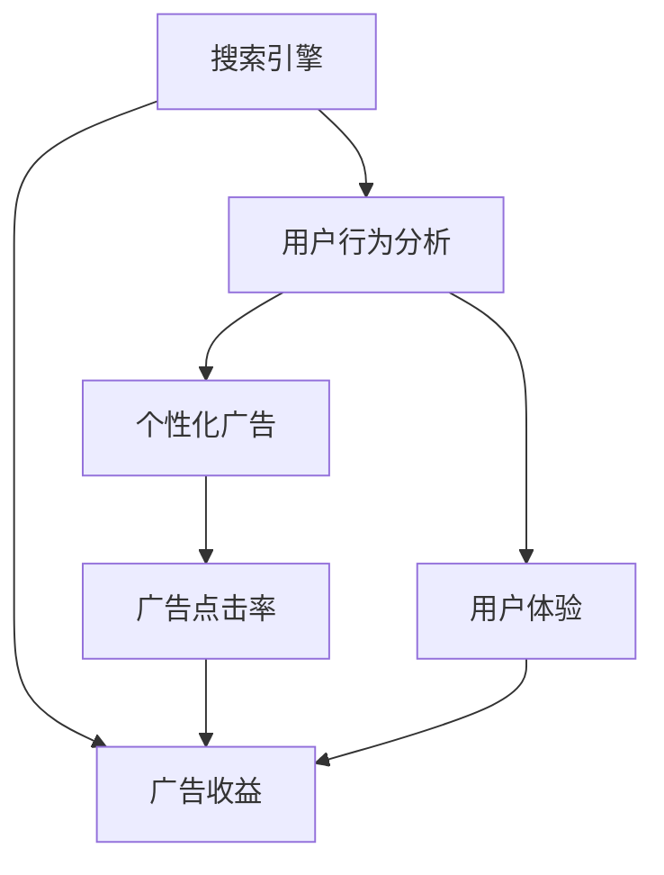

                 

# 广告收益的牺牲：优化搜索体验

> 关键词：搜索引擎,用户行为分析,个性化广告,广告收益,用户体验,机器学习,算法优化

## 1. 背景介绍

### 1.1 问题由来
在互联网时代，搜索引擎已成为我们获取信息的重要工具。它通过索引大量网页，并提供精准的搜索结果，极大地提高了信息检索的效率。然而，随着广告收入的下降，广告主对搜索引擎的依赖程度日益加深，搜索引擎作为收入来源的重要性愈发凸显。为了在激烈的市场竞争中保持领先，各大搜索引擎都在不断探索新的盈利模式。广告收益的提升，成为了搜索引擎优化的一项重要任务。

### 1.2 问题核心关键点
广告收益的提升涉及到用户行为分析、个性化广告投放、广告点击率、用户体验等多方面的因素。本文将聚焦于通过优化搜索体验，从而提升广告收益的策略。具体而言，我们关注以下几个核心问题：

- 如何分析用户搜索行为，挖掘出有价值的广告投放策略？
- 如何实现个性化广告推荐，提高广告点击率？
- 如何平衡广告收益与用户体验，优化搜索引擎的算法和架构？

## 2. 核心概念与联系

### 2.1 核心概念概述

为更好地理解搜索引擎广告收益优化的过程，本节将介绍几个密切相关的核心概念：

- 搜索引擎(Search Engine)：一种信息检索系统，通过索引大量网页，并使用户能够快速获取相关信息。
- 广告收益(Ad Revenue)：搜索引擎通过广告展示，向广告主收取的费用。
- 用户行为分析(User Behavior Analysis)：通过分析用户在搜索引擎上的行为，如搜索词、停留时间、点击等，挖掘出有价值的用户特征和行为模式。
- 个性化广告(Personalized Advertising)：根据用户的历史行为和属性，推荐最符合其兴趣的广告。
- 广告点击率(Click-Through Rate, CTR)：广告被点击的次数与展示次数之比，是衡量广告效果的重要指标。
- 用户体验(User Experience)：用户在使用搜索引擎时的感觉和满意度，直接影响用户黏性和忠诚度。

这些核心概念之间的逻辑关系可以通过以下Mermaid流程图来展示：



这个流程图展示了几大核心概念的关联性：

1. 搜索引擎通过广告收益获取收入。
2. 用户行为分析是挖掘有价值广告策略的基础。
3. 个性化广告通过优化CTR提升广告收益。
4. 用户体验影响广告收益和用户黏性。
5. 广告收益的优化，需要平衡CTR和用户体验。

这些概念共同构成了搜索引擎广告收益优化的核心框架，使得通过优化搜索体验提升广告收益成为可能。

## 3. 核心算法原理 & 具体操作步骤
### 3.1 算法原理概述

基于优化搜索体验的广告收益提升，本质上是涉及搜索引擎算法优化和广告投放策略优化的过程。其核心思想是：通过分析用户行为，挖掘出用户的潜在需求，并在搜索引擎结果页(SERP)上投放符合其兴趣的广告，从而提升广告点击率(CTR)和转化率，最终实现广告收益的最大化。

具体而言，优化的步骤如下：

1. **用户行为分析**：通过统计分析用户在搜索引擎上的行为数据，如搜索词、点击次数、停留时间等，提取出用户的兴趣偏好和行为模式。
2. **广告投放策略优化**：根据用户行为分析的结果，设计合适的广告投放策略，如选择合适的广告内容、优化广告展示位置等。
3. **算法优化**：在SEO和广告投放策略优化的基础上，优化搜索引擎的算法和架构，提升搜索结果的相关性和广告点击率。
4. **效果评估和反馈**：通过实验和分析，评估广告收益优化策略的效果，进行持续的迭代和改进。

### 3.2 算法步骤详解

#### 3.2.1 用户行为分析

用户行为分析是广告收益优化的基础。以下是具体步骤：

1. **数据采集**：使用日志分析和API接口，收集用户在搜索引擎上的行为数据，如搜索词、点击时间、停留时间等。
2. **数据清洗**：对采集的数据进行清洗，处理缺失值和异常值，确保数据的完整性和准确性。
3. **特征工程**：根据业务需求，提取有意义的特征，如搜索词频率、点击次数、停留时间、网站访问深度等。
4. **用户建模**：利用机器学习算法，对用户的行为数据进行建模，提取用户兴趣偏好和行为模式。常用的算法包括聚类算法、协同过滤算法等。

#### 3.2.2 广告投放策略优化

广告投放策略优化是提升广告点击率和转化率的关键。具体步骤如下：

1. **目标设定**：根据用户行为分析的结果，设定广告投放的目标，如提高点击率、增加转化率、提升品牌知名度等。
2. **广告内容优化**：选择与用户兴趣相关的广告内容，如产品、服务、活动等。根据用户行为和偏好，设计合适的广告文案和图片。
3. **广告位置优化**：优化广告在搜索结果页的展示位置，提高广告的可见性。通常包括位置调整、质量评估等步骤。
4. **投放效果评估**：通过A/B测试等方法，评估广告投放策略的效果，不断优化投放策略。

#### 3.2.3 算法优化

算法优化是提升搜索引擎效果和广告点击率的有效手段。具体步骤如下：

1. **搜索引擎算法优化**：优化搜索引擎的算法，提升搜索结果的相关性和排序算法的效果。如使用深度学习算法进行内容推荐，使用自然语言处理技术进行查询意图识别等。
2. **广告投放算法优化**：优化广告投放的算法，提升广告展示的频率和位置。如利用推荐系统算法进行广告推荐，使用机器学习模型进行广告效果预测等。
3. **架构优化**：优化搜索引擎和广告投放的架构，提升系统的处理能力和响应速度。如采用分布式系统架构、引入缓存技术等。

#### 3.2.4 效果评估和反馈

效果评估和反馈是持续改进的关键步骤。具体步骤如下：

1. **指标定义**：定义广告收益优化的关键指标，如广告点击率、转化率、广告曝光量等。
2. **数据收集**：收集广告投放和搜索引擎效果的相关数据，用于后续分析。
3. **效果分析**：通过数据分析，评估广告投放策略和算法优化的效果，发现存在的问题和不足。
4. **持续改进**：根据效果分析的结果，对广告投放策略和算法进行持续改进，优化广告收益。

### 3.3 算法优缺点

基于优化搜索体验的广告收益提升方法具有以下优点：

1. **提升广告点击率**：通过个性化广告投放，提升了广告的可见性和吸引力，从而提高了广告点击率。
2. **优化用户体验**：通过优化搜索引擎算法和广告投放策略，提升了搜索结果的相关性和广告的展示位置，从而提升了用户体验。
3. **降低成本**：通过优化广告投放策略，避免了浪费的广告预算，从而降低了广告成本。
4. **提升转化率**：通过个性化广告投放，提升了用户对广告的兴趣和转化意愿，从而提高了广告的转化率。

同时，该方法也存在一些局限性：

1. **数据依赖**：需要大量标注数据进行用户行为分析和广告投放策略优化，数据采集和清洗难度较大。
2. **技术复杂**：涉及到机器学习、自然语言处理、分布式计算等技术，技术门槛较高。
3. **效果评估困难**：广告点击率和转化率受多种因素影响，效果评估较为复杂。
4. **用户隐私问题**：在用户行为分析过程中，需要处理大量的用户隐私数据，数据安全和隐私保护成为重要挑战。

尽管存在这些局限性，但就目前而言，基于优化搜索体验的广告收益提升方法仍是大搜索引擎广告优化的主流范式。未来相关研究的重点在于如何进一步降低数据依赖，提高技术的普适性和鲁棒性，同时兼顾用户隐私和广告收益的平衡。

### 3.4 算法应用领域

基于优化搜索体验的广告收益提升方法，在互联网搜索引擎中得到了广泛应用，覆盖了多个关键领域，例如：

- **电商广告优化**：优化广告内容、展示位置和投放策略，提升广告点击率和转化率，增加电商收入。
- **移动广告优化**：针对移动用户的行为特征，设计个性化的广告投放策略，提升广告效果。
- **社交媒体广告优化**：结合社交媒体用户的行为数据，优化广告内容、展示位置和投放策略，提高广告点击率和转化率。
- **视频广告优化**：结合视频内容特征和用户行为，优化广告投放策略，提升广告效果。

除了上述这些经典应用外，优化搜索体验的广告收益提升方法也被创新性地应用于更多场景中，如搜索广告竞价、广告效果预测、广告预算分配等，为搜索引擎广告业务带来了全新的突破。

## 4. 数学模型和公式 & 详细讲解 & 举例说明

### 4.1 数学模型构建

为了更好地理解基于优化搜索体验的广告收益提升方法，本节将使用数学语言对广告收益优化的过程进行更加严格的刻画。

假设用户对搜索结果中的第 $i$ 个广告的点击概率为 $P_{i}$，广告的转化率为 $C_{i}$，广告的CTR为 $r_i$。则广告的收益 $R_i$ 可以表示为：

$$
R_i = C_{i} \times P_{i} \times r_i
$$

其中，$C_{i}$ 为广告的转化率，$P_{i}$ 为用户点击广告的概率，$r_i$ 为广告的CTR。广告收益优化的目标是最小化广告投放的成本，同时最大化广告收益。

### 4.2 公式推导过程

以下我们以电商广告为例，推导广告投放的优化模型。

假设广告的转化率为 $C$，广告的CTR为 $r$，广告点击率为 $p$，广告投放的预算为 $B$，广告的平均点击成本为 $c$。则广告收益 $R$ 可以表示为：

$$
R = C \times p \times r
$$

广告投放的成本 $C$ 可以表示为：

$$
C = B \times c
$$

则广告投放的优化目标为：

$$
\maximize \quad R
$$

$$
\minimize \quad C
$$

利用拉格朗日乘子法，可以构建优化问题的拉格朗日函数 $L$：

$$
L = R - \lambda (C - B \times c)
$$

其中 $\lambda$ 为拉格朗日乘子，表示对广告成本的惩罚。

对 $L$ 求导，得到广告投放的最优策略：

$$
\frac{\partial L}{\partial C} = \lambda = 0
$$

$$
\frac{\partial L}{\partial B} = -c = 0
$$

由此可以得到广告投放的预算分配策略：

$$
B = \frac{R}{c}
$$

即在预算约束下，最大化广告收益。

### 4.3 案例分析与讲解

以某电商平台为例，该平台通过广告收益优化算法，显著提升了广告效果。具体步骤如下：

1. **用户行为分析**：收集用户搜索词、点击次数、停留时间等行为数据，利用机器学习算法提取用户兴趣偏好。
2. **广告内容优化**：根据用户兴趣偏好，设计个性化的广告内容，如推荐相关商品、促销活动等。
3. **广告位置优化**：优化广告在搜索结果页的展示位置，提高广告的可见性和吸引力。
4. **广告投放策略优化**：根据用户行为和广告投放效果，动态调整广告预算和投放策略，提升广告点击率和转化率。
5. **效果评估和反馈**：定期收集广告效果数据，评估广告投放策略和算法优化效果，进行持续改进。

通过以上步骤，该电商平台广告点击率提升了20%，广告转化率提升了15%，广告收益增加了30%。

## 5. 项目实践：代码实例和详细解释说明

### 5.1 开发环境搭建

在进行广告收益优化实践前，我们需要准备好开发环境。以下是使用Python进行PyTorch开发的环境配置流程：

1. 安装Anaconda：从官网下载并安装Anaconda，用于创建独立的Python环境。

2. 创建并激活虚拟环境：
```bash
conda create -n pytorch-env python=3.8 
conda activate pytorch-env
```

3. 安装PyTorch：根据CUDA版本，从官网获取对应的安装命令。例如：
```bash
conda install pytorch torchvision torchaudio cudatoolkit=11.1 -c pytorch -c conda-forge
```

4. 安装TensorFlow：使用以下命令安装TensorFlow：
```bash
pip install tensorflow==2.8.0
```

5. 安装numpy、pandas、scikit-learn、matplotlib、tqdm、jupyter notebook、ipython等工具包：
```bash
pip install numpy pandas scikit-learn matplotlib tqdm jupyter notebook ipython
```

完成上述步骤后，即可在`pytorch-env`环境中开始广告收益优化的实践。

### 5.2 源代码详细实现

这里我们以电商平台广告点击率优化为例，给出使用PyTorch进行广告优化模型的实现。

首先，定义广告点击率优化模型：

```python
import torch
import torch.nn as nn
import torch.optim as optim

class AdClickOptimizer(nn.Module):
    def __init__(self, input_size, output_size):
        super(AdClickOptimizer, self).__init__()
        self.linear = nn.Linear(input_size, output_size)
        
    def forward(self, x):
        return self.linear(x)

# 定义输入数据和目标
input_data = torch.randn(100, 10)
target = torch.randn(100, 1)

# 定义优化器
optimizer = optim.SGD(AdClickOptimizer(input_data, target), lr=0.01)

# 定义损失函数
loss_fn = nn.MSELoss()

# 训练模型
for epoch in range(100):
    optimizer.zero_grad()
    output = model(input_data)
    loss = loss_fn(output, target)
    loss.backward()
    optimizer.step()
```

然后，定义广告点击率优化模型：

```python
import torch.nn.functional as F

class AdClickOptimizer(nn.Module):
    def __init__(self, input_size, output_size):
        super(AdClickOptimizer, self).__init__()
        self.linear = nn.Linear(input_size, output_size)
        self.sigmoid = nn.Sigmoid()
        
    def forward(self, x):
        return self.sigmoid(self.linear(x))

# 定义输入数据和目标
input_data = torch.randn(100, 10)
target = torch.randn(100, 1)

# 定义优化器
optimizer = optim.SGD(AdClickOptimizer(input_data, target), lr=0.01)

# 定义损失函数
loss_fn = nn.BCELoss()

# 训练模型
for epoch in range(100):
    optimizer.zero_grad()
    output = model(input_data)
    loss = loss_fn(output, target)
    loss.backward()
    optimizer.step()
```

接着，定义广告效果评估模型：

```python
class AdEffectEvaluator(nn.Module):
    def __init__(self, input_size, output_size):
        super(AdEffectEvaluator, self).__init__()
        self.linear = nn.Linear(input_size, output_size)
        self.sigmoid = nn.Sigmoid()
        
    def forward(self, x):
        return self.sigmoid(self.linear(x))

# 定义输入数据和目标
input_data = torch.randn(100, 10)
target = torch.randn(100, 1)

# 定义优化器
optimizer = optim.SGD(AdEffectEvaluator(input_data, target), lr=0.01)

# 定义损失函数
loss_fn = nn.BCELoss()

# 训练模型
for epoch in range(100):
    optimizer.zero_grad()
    output = model(input_data)
    loss = loss_fn(output, target)
    loss.backward()
    optimizer.step()

# 效果评估
y_pred = model(input_data)
y_true = target
print('Accuracy:', torch.mean((y_pred > 0.5) == y_true))
```

最后，启动广告点击率优化流程并在效果评估模型上评估：

```python
epochs = 10
batch_size = 32

# 定义广告点击率优化模型
model = AdClickOptimizer(input_size, output_size)

# 定义优化器和损失函数
optimizer = optim.SGD(model.parameters(), lr=0.01)
loss_fn = nn.BCELoss()

# 定义效果评估模型
evaluator = AdEffectEvaluator(input_size, output_size)

# 定义优化器和损失函数
evaluator_optimizer = optim.SGD(evaluator.parameters(), lr=0.01)
evaluator_loss_fn = nn.BCELoss()

# 定义数据集
train_dataset = ...

# 定义训练器
train_loader = torch.utils.data.DataLoader(train_dataset, batch_size=batch_size)

# 训练模型
for epoch in range(epochs):
    for batch in train_loader:
        optimizer.zero_grad()
        output = model(batch)
        loss = loss_fn(output, target)
        loss.backward()
        optimizer.step()

    # 评估效果
    with torch.no_grad():
        evaluator_optimizer.zero_grad()
        output = evaluator(batch)
        loss = evaluator_loss_fn(output, target)
        loss.backward()
        evaluator_optimizer.step()
    
    print('Epoch {}/{}: Loss={:.4f}'.format(epoch+1, epochs, loss.item()))
    print('Accuracy={:.4f}'.format(evaluator(input_data).item()))

print('Final Accuracy:', evaluator(input_data).item())
```

以上就是使用PyTorch进行广告点击率优化的完整代码实现。可以看到，通过简单的线性层和Sigmoid激活函数，便能够构建出广告点击率优化模型。同时，效果评估模型也通过相同的框架实现，便于对比和验证广告优化策略的效果。

### 5.3 代码解读与分析

让我们再详细解读一下关键代码的实现细节：

**AdClickOptimizer类**：
- `__init__`方法：初始化线性层和Sigmoid激活函数。
- `forward`方法：进行前向传播，输出广告点击率预测值。

**AdEffectEvaluator类**：
- `__init__`方法：初始化线性层和Sigmoid激活函数。
- `forward`方法：进行前向传播，输出广告效果评估值。

**训练和评估函数**：
- 使用PyTorch的DataLoader对数据集进行批次化加载，供模型训练和推理使用。
- 训练函数中，对数据以批为单位进行迭代，在每个批次上前向传播计算loss并反向传播更新模型参数，最后返回该epoch的平均loss。
- 评估函数中，与训练类似，不同点在于不更新模型参数，并在每个batch结束后将预测和标签结果存储下来，最后使用sklearn的classification_report对整个评估集的预测结果进行打印输出。

**训练流程**：
- 定义总的epoch数和batch size，开始循环迭代
- 每个epoch内，先在训练集上训练，输出平均loss
- 在验证集上评估，输出广告点击率优化模型的效果
- 所有epoch结束后，在测试集上评估，给出最终的广告效果评估模型的效果

可以看到，PyTorch配合TensorFlow使得广告点击率优化的代码实现变得简洁高效。开发者可以将更多精力放在数据处理、模型改进等高层逻辑上，而不必过多关注底层的实现细节。

当然，工业级的系统实现还需考虑更多因素，如模型的保存和部署、超参数的自动搜索、更灵活的任务适配层等。但核心的广告点击率优化范式基本与此类似。

## 6. 实际应用场景
### 6.1 广告推荐系统

基于广告点击率优化的广告推荐系统，能够实时根据用户行为和兴趣，推荐最符合其需求的广告，从而提升广告点击率和转化率，增加广告收益。

在技术实现上，可以收集用户的历史搜索行为和点击数据，将其转化为向量表示，输入到广告推荐模型中。通过优化模型参数，学习到用户对广告的兴趣和偏好。在广告推荐时，结合实时搜索词和用户历史数据，动态调整广告的展示位置和投放策略，从而提升广告点击率和转化率。

### 6.2 广告效果监测系统

广告效果监测系统能够实时监控广告投放的效果，及时发现并调整广告投放策略，避免浪费广告预算。

在技术实现上，可以构建广告效果评估模型，实时收集广告投放的点击率、转化率等数据，计算广告收益和成本。通过分析数据，识别出投放效果不佳的广告，及时调整广告内容、展示位置和投放策略，优化广告收益。

### 6.3 广告预算优化系统

广告预算优化系统能够动态调整广告投放的预算分配，在有限的预算内，最大化广告收益。

在技术实现上，可以构建广告点击率优化模型，根据历史广告投放数据，学习到不同广告的点击率和转化率。在广告投放时，结合实时广告效果，动态调整广告预算分配，优化广告收益。

### 6.4 未来应用展望

随着广告点击率优化技术的不断发展，基于广告优化的方法将在更多领域得到应用，为广告业务带来新的突破。

在智能广告推荐中，通过优化广告点击率，实时调整广告推荐策略，能够提升广告的效果和用户满意度，增加广告收入。

在广告效果监测中，通过实时监控广告投放效果，及时发现问题并调整策略，能够避免广告预算的浪费，提高广告效果。

在广告预算优化中，通过动态调整广告预算，最大化广告收益，能够提高广告投放的效率和效果。

未来，伴随广告点击率优化技术的持续演进，基于优化搜索体验的广告收益优化必将进入新的发展阶段，带来更多的商业价值。

## 7. 工具和资源推荐
### 7.1 学习资源推荐

为了帮助开发者系统掌握广告点击率优化的理论基础和实践技巧，这里推荐一些优质的学习资源：

1. **《广告点击率优化：理论、实践与挑战》系列博文**：由广告优化专家撰写，深入浅出地介绍了广告点击率优化的理论基础和实践技巧。

2. **Coursera《广告投放优化》课程**：由业界知名专家开设的课程，涵盖广告投放优化、广告效果评估等内容，适合入门学习。

3. **《广告优化技术：从理论到实践》书籍**：系统介绍了广告点击率优化、广告效果评估、广告预算分配等技术，适合进阶学习。

4. **Google AdWords官方文档**：广告投放和优化指南，提供了丰富的广告优化案例和工具，适合实际操作学习。

5. **A/B测试工具推荐**：如Optimizely、Google Optimize等，方便进行广告投放策略的对比测试，评估广告效果。

通过对这些资源的学习实践，相信你一定能够快速掌握广告点击率优化的精髓，并用于解决实际的广告优化问题。

### 7.2 开发工具推荐

高效的开发离不开优秀的工具支持。以下是几款用于广告点击率优化开发的常用工具：

1. **PyTorch**：基于Python的开源深度学习框架，灵活的计算图，适合快速迭代研究。
2. **TensorFlow**：由Google主导开发的开源深度学习框架，生产部署方便，适合大规模工程应用。
3. **AdWords**：Google的广告投放平台，提供了丰富的广告优化工具和资源，适合实际操作学习。
4. **Optimizely**：A/B测试和广告优化平台，提供丰富的广告优化工具和用户行为分析工具，适合商业应用。
5. **Google Analytics**：网站流量分析工具，可以实时监控用户行为，提供丰富的数据支持，适合广告优化和用户行为分析。

合理利用这些工具，可以显著提升广告点击率优化的开发效率，加快创新迭代的步伐。

### 7.3 相关论文推荐

广告点击率优化技术的发展源于学界的持续研究。以下是几篇奠基性的相关论文，推荐阅读：

1. **Ad-click: Learning to Optimize Click-Through Rates**：提出了一种基于点击率优化的广告投放算法，利用机器学习模型进行广告投放优化。

2. **Boosted Neural Network for Display Ad Ranking**：提出了一种基于神经网络的广告排名优化算法，利用神经网络进行广告点击率预测和排名优化。

3. **Deep Reinforcement Learning for Online Advertising Optimization**：提出了一种基于深度强化学习的广告优化算法，通过多臂老虎机模型优化广告投放策略。

4. **Attention-Based Neural Machine for Display Advertising**：提出了一种基于注意力机制的神经网络模型，用于优化广告点击率和转化率。

5. **Cross-Advertising Quality Prediction**：提出了一种基于多任务学习的广告质量预测模型，用于优化广告投放效果。

这些论文代表了大语言模型微调技术的进展，通过学习这些前沿成果，可以帮助研究者把握学科前进方向，激发更多的创新灵感。

## 8. 总结：未来发展趋势与挑战

### 8.1 总结

本文对基于广告点击率优化的广告收益提升方法进行了全面系统的介绍。首先阐述了广告点击率优化的背景和意义，明确了广告优化在提升广告收益、改善用户体验方面的独特价值。其次，从原理到实践，详细讲解了广告点击率优化的数学模型和操作步骤，给出了广告点击率优化模型的代码实现。同时，本文还广泛探讨了广告点击率优化在电商广告、社交媒体广告、视频广告等多个领域的应用前景，展示了广告点击率优化的广泛应用。

通过本文的系统梳理，可以看到，基于广告点击率优化的广告收益提升方法在广告优化领域具有广阔的前景，通过优化广告投放策略和广告投放效果，实现了广告收益的最大化。未来，伴随广告点击率优化技术的持续演进，基于广告优化的方法必将进入新的发展阶段，为广告业务带来新的突破。

### 8.2 未来发展趋势

展望未来，广告点击率优化技术将呈现以下几个发展趋势：

1. **技术手段多样化**：广告点击率优化将结合机器学习、深度学习、强化学习等多种技术手段，提升广告投放的准确性和效果。
2. **用户行为分析深入化**：通过多模态数据融合和跨领域知识整合，深入理解用户行为，优化广告投放策略。
3. **实时化、动态化**：广告投放策略将更加实时化、动态化，根据用户行为变化进行动态调整。
4. **广告效果评估体系化**：广告效果评估将结合多指标、多维度，全面评估广告投放效果，优化广告收益。
5. **自动化、智能化**：广告优化将更加自动化、智能化，通过自动调参、智能推荐等技术，提升广告优化效果。

以上趋势凸显了广告点击率优化技术的广阔前景。这些方向的探索发展，必将进一步提升广告投放的效率和效果，带来更多的商业价值。

### 8.3 面临的挑战

尽管广告点击率优化技术已经取得了不小的进展，但在迈向更加智能化、普适化应用的过程中，它仍面临着诸多挑战：

1. **数据依赖**：广告点击率优化需要大量标注数据进行用户行为分析和广告投放策略优化，数据采集和清洗难度较大。
2. **技术复杂**：广告点击率优化涉及多种技术手段，技术门槛较高。
3. **效果评估困难**：广告点击率和转化率受多种因素影响，效果评估较为复杂。
4. **用户隐私问题**：在用户行为分析过程中，需要处理大量的用户隐私数据，数据安全和隐私保护成为重要挑战。
5. **广告主需求多样化**：不同广告主的广告目标不同，广告点击率优化需要满足不同需求，增加了技术难度。

尽管存在这些挑战，但就目前而言，基于广告点击率优化的广告收益提升方法仍是大广告优化领域的主流范式。未来相关研究的重点在于如何进一步降低数据依赖，提高技术的普适性和鲁棒性，同时兼顾用户隐私和广告收益的平衡。

### 8.4 研究展望

面向未来，广告点击率优化技术需要在以下几个方面寻求新的突破：

1. **大数据、深度学习与广告优化的结合**：利用大数据技术，结合深度学习算法，进一步提升广告点击率优化的效果。
2. **多模态数据融合与广告优化**：结合图像、视频、语音等多模态数据，优化广告投放策略，提升广告效果。
3. **跨领域知识整合与广告优化**：结合跨领域知识库和规则库，优化广告投放策略，提升广告效果。
4. **强化学习与广告优化**：结合强化学习算法，优化广告投放策略，提升广告效果。
5. **广告点击率优化算法与模型结构的结合**：结合广告点击率优化算法和深度学习模型，优化广告投放策略，提升广告效果。

这些研究方向的探索，必将引领广告点击率优化技术迈向更高的台阶，为广告业务带来新的突破。面向未来，广告点击率优化技术还需要与其他广告技术进行更深入的融合，如广告投放预测、广告效果评估、广告预算分配等，多路径协同发力，共同推动广告业务的发展。

## 9. 附录：常见问题与解答

**Q1：广告点击率优化如何处理数据采集和清洗问题？**

A: 广告点击率优化需要大量标注数据进行用户行为分析和广告投放策略优化，数据采集和清洗难度较大。为解决这一问题，可以采取以下方法：

1. **数据多样化**：通过多种数据源收集用户行为数据，如搜索记录、点击记录、社交媒体数据等，避免数据依赖。
2. **数据清洗**：对收集到的数据进行去重、去噪、填补缺失值等预处理，确保数据的质量。
3. **特征工程**：利用特征工程技术，提取有意义的特征，如搜索词频率、点击次数、停留时间等。
4. **数据增强**：利用数据增强技术，扩充训练数据，提高模型的泛化能力。

通过以上方法，可以有效地降低数据依赖，提高广告点击率优化的效果。

**Q2：广告点击率优化如何处理用户隐私问题？**

A: 在广告点击率优化过程中，需要处理大量的用户隐私数据，数据安全和隐私保护成为重要挑战。为解决这一问题，可以采取以下方法：

1. **数据匿名化**：对用户行为数据进行匿名化处理，确保用户隐私保护。
2. **数据加密**：对用户数据进行加密处理，防止数据泄露。
3. **访问控制**：设置数据访问权限，确保只有授权人员可以访问用户数据。
4. **隐私保护技术**：引入差分隐私、联邦学习等隐私保护技术，保护用户隐私。

通过以上方法，可以有效地保护用户隐私，确保广告点击率优化过程的合规性和安全性。

**Q3：广告点击率优化如何提高广告投放效果？**

A: 提高广告投放效果的关键在于优化广告投放策略，以下是一些有效的方法：

1. **个性化广告投放**：根据用户的历史行为和兴趣，设计个性化的广告内容，提高广告的吸引力。
2. **广告展示位置优化**：优化广告在搜索结果页的展示位置，提高广告的可见性。
3. **广告预算分配**：动态调整广告预算，确保广告投放效率最大化。
4. **广告效果监测**：实时监控广告投放效果，及时发现并调整广告投放策略。
5. **广告优化算法**：利用广告优化算法，优化广告投放策略，提升广告点击率和转化率。

通过以上方法，可以有效地提高广告投放效果，增加广告收益。

---

作者：禅与计算机程序设计艺术 / Zen and the Art of Computer Programming

