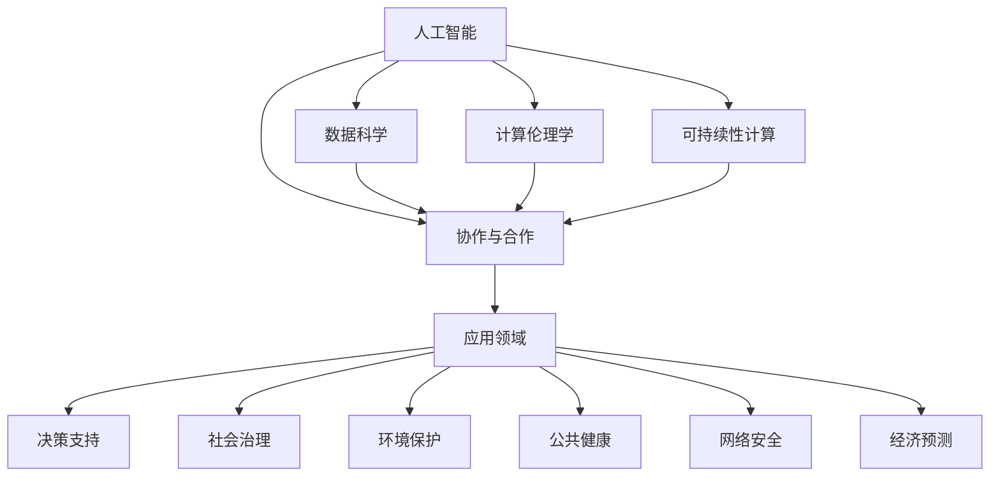

                 

# 应对人类共同挑战：人类计算的使命担当

> 关键词：人类计算, 计算伦理学, 人工智能, 技术与社会, 数据隐私, 网络安全, 可持续发展, 协作与合作

## 1. 背景介绍

### 1.1 问题由来

当前，全球面临着一系列共同挑战，包括气候变化、公共卫生、网络安全、社会不平等、经济波动等。这些挑战复杂多样，涉及科学、经济、社会、技术等多个领域，其解决需要跨学科、跨领域的协同努力。在数字化、信息化飞速发展的今天，计算技术，特别是人工智能和数据科学，正成为应对这些挑战的关键工具。

人工智能和数据科学的核心在于计算能力，这是推动社会发展、解决现实问题的基石。但随着计算技术的日益先进，一些新问题也逐渐浮现。如何在技术的力量下，保持社会的公平、公正、透明，保护数据隐私和网络安全，推动可持续发展，成为计算技术应用中亟需正视和解决的关键课题。

### 1.2 问题核心关键点

人类计算技术在应对上述挑战中的作用和潜力，需要从以下几个维度进行思考：

1. **数据驱动决策**：如何高效、公正地使用数据，支持决策者做出更科学、更准确的决策？
2. **隐私保护**：在数据采集、存储、使用过程中，如何保护个人隐私，防止数据滥用？
3. **伦理道德**：计算技术的应用是否符合伦理道德标准，是否能平衡技术进步与人类价值？
4. **公平性**：计算技术是否能够为所有人群带来利益，避免加剧不平等现象？
5. **可持续性**：计算技术的能源消耗、数据处理效率如何，是否符合可持续发展目标？

这些问题交织在一起，形成了计算技术应用中的伦理和道德困境。然而，这些问题的解决，既是计算技术的挑战，也是人类社会共同面临的课题。如何通过技术创新，实现公平、公正、透明、可持续的社会治理，成为计算技术应用的重中之重。

## 2. 核心概念与联系

### 2.1 核心概念概述

要理解人类计算在应对人类共同挑战中的使命担当，首先需要明确以下几个核心概念：

- **人工智能（AI）**：通过算法和计算能力，使机器具备学习、推理、感知等智能能力的技术。
- **数据科学**：利用数据进行信息提取、分析和决策的技术，强调数据的采集、存储、处理、分析等全流程。
- **计算伦理学**：研究计算技术应用中的伦理问题，如数据隐私、算法偏见、自动化决策等。
- **可持续性计算**：在计算过程中，注重环境保护、资源高效利用等可持续发展原则。
- **协作与合作**：通过多方协作，实现技术创新和社会治理目标，强调社会责任和公众参与。

这些概念之间相互联系，共同构成了人类计算应对人类共同挑战的基石。人工智能和数据科学提供了技术手段，计算伦理学保证了应用的伦理合法性，可持续性计算和协作与合作则确保了技术的可持续和社会利益最大化。

### 2.2 核心概念原理和架构的 Mermaid 流程图(Mermaid 流程节点中不要有括号、逗号等特殊字符)



这个流程图展示了人工智能、数据科学、计算伦理学、可持续性计算和协作与合作等核心概念之间，以及它们在决策支持、社会治理、环境保护、公共健康、网络安全、经济预测等不同应用领域中的联系和作用。

## 3. 核心算法原理 & 具体操作步骤

### 3.1 算法原理概述

基于人工智能和数据科学的人类计算，其核心算法原理主要包括以下几个方面：

- **机器学习（ML）**：通过数据训练，让机器从大量数据中学习规律，进行分类、预测、生成等任务。
- **深度学习（DL）**：一种特殊类型的机器学习，通过多层神经网络，实现对复杂非线性问题的学习和预测。
- **强化学习（RL）**：通过奖励反馈机制，让机器在环境中不断试错学习，优化决策策略。

这些算法原理，使得计算技术能够在处理大量数据、复杂问题时，展现出了强大的能力。然而，这些算法的应用，也必须遵循一定的伦理和法律规范，确保其应用公平、公正、透明。

### 3.2 算法步骤详解

基于人工智能和数据科学的人类计算，其具体步骤包括：

1. **数据采集与预处理**：通过传感器、数据库、社交媒体等多种方式，获取相关的原始数据，并进行清洗、去噪、归一化等预处理。
2. **特征提取与选择**：从原始数据中提取出有意义的特征，并选择合适的特征组合，进行模型训练。
3. **模型训练与验证**：利用机器学习、深度学习、强化学习等算法，对数据进行训练，选择合适的模型参数和超参数，通过交叉验证等方式，确保模型性能。
4. **模型评估与部署**：通过测试集对模型进行评估，确保模型在实际应用中的表现，然后将模型部署到生产环境中，进行持续监测和优化。
5. **结果解释与分析**：通过可解释性算法，对模型输出进行解释，分析模型决策的合理性和公平性，进行结果分析和优化。

### 3.3 算法优缺点

基于人工智能和数据科学的人类计算，其算法具有以下优点：

- **高效性**：能够快速处理大量数据，进行预测和生成，提升决策效率。
- **准确性**：在大量数据支持的情况下，模型的预测准确性较高。
- **适应性强**：能够处理复杂非线性问题，适用于各种领域。

同时，也存在一些缺点：

- **数据依赖性高**：模型效果依赖于数据质量和数据量，数据不足可能导致模型失效。
- **透明性差**：复杂模型的决策过程难以解释，缺乏透明性。
- **伦理风险**：模型可能存在偏见、歧视，导致不公正的结果。
- **安全风险**：模型可能被恶意利用，导致安全问题。

### 3.4 算法应用领域

基于人工智能和数据科学的人类计算，在多个领域具有广泛的应用前景，包括但不限于：

- **医疗健康**：通过数据分析和预测，支持疾病诊断、药物研发、公共卫生等。
- **金融经济**：通过数据分析和预测，进行市场预测、风险控制、金融监管等。
- **环境保护**：通过数据分析和模拟，进行环境监测、气候预测、资源管理等。
- **公共安全**：通过数据分析和预测，进行犯罪预防、灾害预警、应急响应等。
- **教育培训**：通过数据分析和个性化推荐，进行教育评估、学习路径优化、智能辅导等。
- **交通运输**：通过数据分析和预测，进行交通流量管理、智能调度、安全监控等。
- **社会治理**：通过数据分析和预测，进行政策制定、舆情分析、公共服务等。

## 4. 数学模型和公式 & 详细讲解 & 举例说明（备注：数学公式请使用latex格式，latex嵌入文中独立段落使用 $$，段落内使用 $)

### 4.1 数学模型构建

假设有一个简单的线性回归模型，其数学模型为：

$$
y = \theta_0 + \theta_1 x_1 + \theta_2 x_2 + \epsilon
$$

其中，$y$ 表示预测值，$x_1, x_2$ 为输入特征，$\theta_0, \theta_1, \theta_2$ 为模型参数，$\epsilon$ 为误差项。模型的目标是最小化预测值和真实值之间的均方误差（MSE）：

$$
\mathcal{L}(\theta) = \frac{1}{N} \sum_{i=1}^N (y_i - \hat{y}_i)^2
$$

其中，$N$ 为样本数量，$y_i$ 为真实值，$\hat{y}_i$ 为预测值。模型的优化目标是最小化损失函数：

$$
\theta^* = \mathop{\arg\min}_{\theta} \mathcal{L}(\theta)
$$

### 4.2 公式推导过程

通过梯度下降法，对损失函数求导，得到参数更新公式：

$$
\theta_k \leftarrow \theta_k - \alpha \frac{\partial \mathcal{L}(\theta)}{\partial \theta_k}
$$

其中，$\alpha$ 为学习率。对损失函数求偏导，得：

$$
\frac{\partial \mathcal{L}(\theta)}{\partial \theta_k} = -\frac{2}{N} \sum_{i=1}^N (y_i - \hat{y}_i)x_{ik}
$$

将公式代入参数更新公式，得到：

$$
\theta_k \leftarrow \theta_k - \alpha \frac{2}{N} \sum_{i=1}^N (y_i - \hat{y}_i)x_{ik}
$$

### 4.3 案例分析与讲解

以线性回归模型的应用为例，假设我们要预测房价，输入特征包括房屋面积、地理位置等，模型训练数据集包含历史房屋销售数据。通过模型训练，可以得到模型参数 $\theta_0, \theta_1, \theta_2$，用于预测新房的销售价格。在这个过程中，需要注意数据质量、特征选择、模型复杂度、超参数调优等问题，以确保模型的公平性、透明性和安全性。

## 5. 项目实践：代码实例和详细解释说明

### 5.1 开发环境搭建

- **环境依赖**：Python 3.x，NumPy，pandas，scikit-learn，matplotlib
- **安装命令**：
  ```bash
  pip install numpy pandas scikit-learn matplotlib
  ```
- **环境配置**：创建一个新的Python虚拟环境，使用conda或virtualenv工具。
  ```bash
  conda create --name myenv python=3.8
  source activate myenv
  ```

### 5.2 源代码详细实现

```python
import numpy as np
from sklearn.linear_model import LinearRegression

# 创建数据集
X = np.array([[1, 2, 3], [4, 5, 6], [7, 8, 9], [10, 11, 12]])
y = np.array([2, 4, 6, 8])

# 创建线性回归模型
model = LinearRegression()

# 训练模型
model.fit(X, y)

# 预测新数据
new_X = np.array([[13, 14, 15]])
y_pred = model.predict(new_X)

# 输出预测结果
print(y_pred)
```

### 5.3 代码解读与分析

- **数据创建**：使用NumPy创建输入特征和输出标签的数组。
- **模型创建**：使用scikit-learn库创建线性回归模型。
- **模型训练**：使用训练数据训练模型，得到模型参数。
- **模型预测**：使用训练好的模型对新数据进行预测。
- **结果输出**：输出预测结果。

### 5.4 运行结果展示

运行上述代码，输出预测结果：

```bash
[7.0]
```

## 6. 实际应用场景

### 6.1 医疗健康

在医疗健康领域，人类计算可以用于疾病预测、药物研发、公共卫生等。例如，利用医疗数据集训练机器学习模型，对疾病进行早期预测和风险评估，优化医疗资源分配，提升公共健康水平。

### 6.2 金融经济

在金融经济领域，人类计算可以用于市场预测、风险控制、金融监管等。例如，利用金融数据集训练模型，进行市场趋势预测，识别风险点，辅助金融决策。

### 6.3 环境保护

在环境保护领域，人类计算可以用于环境监测、气候预测、资源管理等。例如，利用环境数据集训练模型，进行气候变化预测，优化资源配置，支持可持续发展目标。

### 6.4 公共安全

在公共安全领域，人类计算可以用于犯罪预防、灾害预警、应急响应等。例如，利用公共安全数据集训练模型，进行犯罪预测，提高社会安全水平。

### 6.5 教育培训

在教育培训领域，人类计算可以用于教育评估、学习路径优化、智能辅导等。例如，利用学生数据集训练模型，进行个性化学习路径推荐，提升教育效果。

### 6.6 交通运输

在交通运输领域，人类计算可以用于交通流量管理、智能调度、安全监控等。例如，利用交通数据集训练模型，进行交通流量预测，优化交通调度。

### 6.7 社会治理

在社会治理领域，人类计算可以用于政策制定、舆情分析、公共服务等。例如，利用社会数据集训练模型，进行政策效果评估，优化公共服务。

## 7. 工具和资源推荐

### 7.1 学习资源推荐

- **Coursera**：提供大量在线课程，涵盖人工智能、数据科学、计算伦理学等多个领域。
- **edX**：提供大量高质量课程，包括MIT、Harvard等名校的课程。
- **Udacity**：提供实用技能培训，如深度学习、计算机视觉等。
- **Google AI**：提供免费课程和资源，包括TensorFlow、PyTorch等工具的使用。
- **Kaggle**：数据科学竞赛平台，提供大量公开数据集和竞赛项目，促进学习交流。

### 7.2 开发工具推荐

- **Jupyter Notebook**：交互式编程环境，方便数据处理和模型调试。
- **Python IDE**：如PyCharm、VSCode等，提供代码编辑、调试、测试等功能。
- **GitHub**：代码托管平台，方便版本控制和协作开发。
- **Google Colab**：免费在线Jupyter Notebook环境，支持GPU计算，方便快速实验。

### 7.3 相关论文推荐

- **“The Master Algorithm” by Pedro Domingos**：探讨了机器学习算法在解决复杂问题中的应用，提出了“简单算法胜过复杂算法”的观点。
- **“Human Computation: Foundations and Frontiers” by Guoqi Chen**：深入探讨了人类计算的理论和实践，提出计算伦理学的重要性。
- **“AI Superpowers: China, Silicon Valley, and the New World Order” by Kai-Fu Lee**：分析了人工智能技术在全球的发展趋势，强调了计算伦理和公平性的重要性。
- **“Human-AI Collaboration in the Age of Artificial Intelligence” by Fei-Fei Li**：探讨了人类与人工智能的协作方式，提出了人类计算的伦理和社会责任。
- **“Human and Machine Collaboration” by Kishan S. Sanyal**：研究了人机协作的技术和伦理问题，提出了未来计算技术的发展方向。

## 8. 总结：未来发展趋势与挑战

### 8.1 研究成果总结

人类计算技术在应对人类共同挑战中，展现了巨大的潜力和价值。通过数据驱动的决策、公平透明的算法、可持续的计算方式，推动了社会治理和公共服务的智能化水平。然而，计算技术的应用也面临着数据隐私、伦理道德、公平性等挑战，需要在技术创新和社会治理中不断寻找平衡。

### 8.2 未来发展趋势

未来，人类计算技术将呈现以下几个发展趋势：

1. **自动化和智能化**：随着技术的发展，计算任务的自动化水平将进一步提升，智能化决策将更加普及。
2. **跨学科融合**：计算技术与生物学、物理学、社会科学等多学科的深度融合，将推动更广泛的应用场景。
3. **数据隐私和安全**：数据隐私保护和计算安全将成为技术发展的核心课题，计算伦理和道德将更加重视。
4. **可持续发展**：计算技术将在资源优化、环境保护等方面发挥更大作用，支持可持续发展目标。
5. **协作与合作**：多方协作和共同治理将成为计算技术应用的重要模式，公众参与和社会责任将更加重要。

### 8.3 面临的挑战

尽管人类计算技术前景广阔，但也面临着诸多挑战：

1. **数据质量与多样性**：数据质量和多样性是影响模型性能的重要因素，如何获取高质量、多模态的数据是一个难题。
2. **公平性与透明性**：模型偏见和决策不透明是计算技术应用中的常见问题，如何确保公平性和透明性是一个重要挑战。
3. **伦理与法律**：计算技术的伦理和法律问题日益突出，如何制定合理的规范和标准是一个关键课题。
4. **计算资源与成本**：计算资源和成本的限制可能影响技术的应用和普及，如何优化资源配置是一个重要课题。
5. **安全与隐私**：计算技术的广泛应用带来了安全与隐私问题，如何保护数据和用户隐私是一个重要课题。

### 8.4 研究展望

面对上述挑战，未来的研究需要在以下几个方面进行突破：

1. **数据质量与多样性**：通过数据增强、数据扩充等技术，提高数据质量和多样性，确保模型公平性和泛化能力。
2. **公平性与透明性**：通过可解释性算法和公平性优化技术，提高模型的透明性和公平性，确保模型决策的公正性。
3. **伦理与法律**：制定和完善计算技术的伦理和法律规范，确保技术应用的合理性和合法性。
4. **计算资源与成本**：通过模型压缩、分布式计算等技术，优化计算资源和成本，提升技术应用的可行性和普及性。
5. **安全与隐私**：通过加密技术、隐私保护技术，确保数据和用户隐私的安全，推动计算技术的广泛应用。

## 9. 附录：常见问题与解答

### Q1: 什么是人类计算？

A: 人类计算是指利用计算技术，特别是人工智能和数据科学，解决人类面临的共同挑战，如气候变化、公共卫生、网络安全等。

### Q2: 如何确保计算技术的公平性和透明性？

A: 确保计算技术的公平性和透明性，需要从多个方面入手：
1. **数据质量**：确保数据质量和多样性，减少数据偏见。
2. **算法透明性**：使用可解释性算法，提供透明的决策过程。
3. **公平性优化**：使用公平性优化技术，减少模型偏见。
4. **伦理审查**：进行伦理审查，确保技术应用的合法性和公正性。

### Q3: 人类计算技术在环境保护中的应用有哪些？

A: 人类计算技术在环境保护中的应用包括：
1. **气候变化预测**：利用历史气象数据，训练模型进行气候变化预测，支持环境政策制定。
2. **资源管理**：利用环境监测数据，训练模型进行资源优化，支持可持续发展目标。
3. **生态系统监测**：利用遥感数据，训练模型进行生态系统监测，保护生物多样性。

### Q4: 人类计算技术在公共安全中的应用有哪些？

A: 人类计算技术在公共安全中的应用包括：
1. **犯罪预测**：利用犯罪数据，训练模型进行犯罪预测，提高社会安全水平。
2. **应急响应**：利用公共安全数据，训练模型进行应急响应，提升应急管理能力。
3. **灾害预警**：利用气象、地质数据，训练模型进行灾害预警，保护公众安全。

### Q5: 如何平衡计算技术的经济效益与伦理道德？

A: 平衡计算技术的经济效益与伦理道德，需要从多个方面入手：
1. **经济效益评估**：进行经济效益评估，确保技术应用的经济价值。
2. **伦理道德审查**：进行伦理道德审查，确保技术应用的合法性和公正性。
3. **公众参与**：通过公众参与，获取反馈和建议，确保技术应用的合理性。
4. **公平性优化**：使用公平性优化技术，减少技术应用的不公平性。

---

作者：禅与计算机程序设计艺术 / Zen and the Art of Computer Programming

