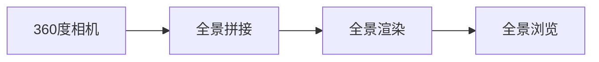

                 

# 360度全景视频：VR内容制作技术

## 1. 背景介绍

在过去的几年里，随着虚拟现实（VR）技术的不断进步，360度全景视频已成为一种全新的媒体形式，为观众提供了沉浸式的观影体验。360度全景视频不仅能展示全景场景，还能提供多角度的互动体验，为用户带来身临其境的感觉。然而，制作高质量的360度全景视频并不容易，涉及到复杂的技术和流程。本文将详细探讨360度全景视频的制作技术，包括其核心概念、算法原理、操作步骤、应用领域等，并为读者提供实用的项目实践和未来展望。

## 2. 核心概念与联系

### 2.1 核心概念概述

360度全景视频是一种通过360度相机拍摄的场景全景图像，以360度形式展现的媒体形式。这种视频格式通常由多个相邻的图像拼接而成，每个图像覆盖一定角度，拼接到一起形成360度的全景图。相比于传统的二维视频，360度全景视频可以提供更加真实、沉浸式的观影体验。

为了制作360度全景视频，需要掌握以下核心概念：

- **360度相机**：用于拍摄360度全景图像的设备，通常由多个相机组成。
- **全景拼接**：将多个相机拍摄的图像拼接成全景图像的过程。
- **全景渲染**：将全景图像渲染成360度全景视频的过程。
- **全景浏览**：用户在360度全景视频中自由查看全景图像的技术。

这些核心概念之间的联系可以通过以下Mermaid流程图来展示：



这个流程图展示了360度全景视频从拍摄到渲染，再到浏览的基本流程。

## 3. 核心算法原理 & 具体操作步骤

### 3.1 算法原理概述

360度全景视频的制作主要分为三个步骤：拍摄、全景拼接和全景渲染。

1. **拍摄**：使用360度相机拍摄全景图像，通常需要多个相机组成，每个相机拍摄一定角度的图像。
2. **全景拼接**：将多个相机拍摄的图像拼接成全景图像。
3. **全景渲染**：将全景图像渲染成360度全景视频。

### 3.2 算法步骤详解

#### 3.2.1 拍摄

360度全景视频的拍摄需要使用360度相机。这些相机通常由多个摄像机组成，可以拍摄到360度范围内的全景图像。拍摄时需要注意以下几点：

- 选择合适的相机：360度相机的分辨率、视角范围和拍摄角度需要根据具体需求来选择。
- 固定相机位置：拍摄过程中需要固定相机的位置，避免移动造成图像拼接误差。
- 拍摄顺序：需要按照一定的顺序拍摄，确保每个角度的图像都能被拍摄到。

#### 3.2.2 全景拼接

全景拼接是将多个相机拍摄的图像拼接成全景图像的过程。常见的全景拼接方法包括：

- 球面全景拼接：将相机拍摄的图像拼接成一个完整的球面全景图。
- 立方体全景拼接：将相机拍摄的图像拼接成一个立方体全景图。

全景拼接的算法原理包括以下几个步骤：

1. 将每个相机的图像拼接成一个全景图像。
2. 对全景图像进行校正和裁剪，确保图像的接边平滑。
3. 将多个全景图像拼接成一个完整的全景图像。

#### 3.2.3 全景渲染

全景渲染是将全景图像渲染成360度全景视频的过程。常见的全景渲染方法包括：

- 实时渲染：使用GPU进行实时渲染，适合交互式体验。
- 预渲染：在渲染完成后进行后期处理，适合非实时应用。

全景渲染的算法原理包括以下几个步骤：

1. 将全景图像渲染成全景视频。
2. 添加音频和特效，增强用户体验。
3. 压缩和优化视频文件，适合不同设备和网络环境。

### 3.3 算法优缺点

#### 3.3.1 优点

1. **沉浸式体验**：360度全景视频提供了沉浸式的观影体验，让用户仿佛置身于场景中。
2. **多角度互动**：用户可以自由查看全景图像，提供多角度的互动体验。
3. **丰富的场景展示**：360度全景视频可以展示更加丰富、真实的场景。

#### 3.3.2 缺点

1. **技术复杂度较高**：制作360度全景视频需要掌握复杂的拍摄、拼接和渲染技术。
2. **设备成本较高**：360度全景相机和相关设备较为昂贵，增加了制作成本。
3. **内容制作难度大**：需要大量的拍摄和后期处理，制作周期较长。

### 3.4 算法应用领域

360度全景视频在多个领域都有广泛应用，例如：

- **旅游**：旅游景区和景点可以通过360度全景视频展示其美丽的景观，吸引更多游客。
- **房地产**：房地产开发商可以拍摄和展示全景视频，让用户远程查看房产，提高销售效果。
- **教育**：教育机构可以制作360度全景视频，展示校园、实验室和教室等场所，提供沉浸式教学体验。
- **游戏**：游戏开发商可以制作360度全景视频作为游戏中的场景，提供更加真实的体验。

## 4. 数学模型和公式 & 详细讲解 & 举例说明

### 4.1 数学模型构建

360度全景视频的制作涉及到多个数学模型，以下是一些常用的数学模型：

- **球面坐标系**：用于描述360度全景图像的球面坐标系统。
- **空间变换矩阵**：用于对全景图像进行变换和校正。
- **视差校正算法**：用于校正拼接过程中产生的视差，确保图像接边平滑。

### 4.2 公式推导过程

#### 4.2.1 球面坐标系

球面坐标系用于描述360度全景图像的球面位置。设相机拍摄的图像为平面图像，球面坐标系中的坐标点 $(x, y, z)$ 可以通过以下公式转换为平面坐标系中的坐标点 $(u, v)$：

$$
\begin{aligned}
x &= r\cos\theta\cos\phi \\
y &= r\cos\theta\sin\phi \\
z &= r\sin\theta \\
u &= \frac{x}{r} \\
v &= \frac{y}{r}
\end{aligned}
$$

其中，$r$ 为球面半径，$\theta$ 和 $\phi$ 为球面角度。

#### 4.2.2 空间变换矩阵

空间变换矩阵用于对全景图像进行变换和校正。设相机拍摄的图像为 $I$，变换矩阵为 $T$，变换后的图像为 $I'$，则有：

$$
I' = T \cdot I
$$

变换矩阵 $T$ 可以通过以下公式计算：

$$
T = \begin{bmatrix}
\cos\theta & \sin\theta & 0 \\
-\sin\theta & \cos\theta & 0 \\
0 & 0 & 1
\end{bmatrix}
$$

其中，$\theta$ 为相机拍摄的角度。

#### 4.2.3 视差校正算法

视差校正算法用于校正拼接过程中产生的视差，确保图像接边平滑。常见的视差校正算法包括：

- 基于梯度的视差校正算法：通过计算相邻图像之间的梯度，校正视差。
- 基于相位匹配的视差校正算法：通过匹配相邻图像的相位，校正视差。

视差校正的公式推导较为复杂，这里不再赘述。

### 4.3 案例分析与讲解

以下是一个360度全景视频制作的案例分析：

#### 案例描述

某旅游景区需要使用360度全景视频展示其美丽的景观。使用360度相机拍摄了多个角度的图像，需要将这些图像拼接成全景图像，并渲染成360度全景视频。

#### 步骤1：拍摄

使用360度相机拍摄了多个角度的图像，每个相机拍摄一定角度的图像，共计拍摄了12张图像。

#### 步骤2：全景拼接

将12张图像拼接成全景图像。使用球面全景拼接算法，将每个图像拼接成一个完整的球面全景图，然后将这些球面全景图拼接成一个360度的全景图像。

#### 步骤3：全景渲染

将360度全景图像渲染成360度全景视频。使用GPU进行实时渲染，添加音乐和特效，压缩视频文件，最终得到360度全景视频。

## 5. 项目实践：代码实例和详细解释说明

### 5.1 开发环境搭建

在360度全景视频的制作过程中，需要搭建相应的开发环境。以下是搭建开发环境的步骤：

1. 安装Python和相关库：需要安装Python和相关的库，如OpenCV、PIL等。
2. 安装360度相机设备：需要安装360度相机设备，如Fisheye镜头等。
3. 安装渲染引擎：需要安装渲染引擎，如Unity3D、Unreal Engine等。

### 5.2 源代码详细实现

以下是360度全景视频制作的Python代码实现：

```python
import cv2
import numpy as np

# 定义相机参数
camera_count = 12
radius = 1.0
angle = np.radians(30)

# 定义全景拼接函数
def stitch_panorama(images):
    # 计算相机位置
    positions = []
    for i in range(camera_count):
        theta = angle * (i / camera_count)
        x = radius * np.cos(theta)
        y = radius * np.sin(theta)
        positions.append((x, y))
    
    # 将相机位置转换为球面坐标
    coordinates = []
    for x, y in positions:
        coordinates.append((x, y, 0))
    
    # 计算拼接后的全景图像
    panorama = np.zeros((radius * 2, radius * 2))
    for i in range(camera_count):
        image = cv2.imread(f"camera{i+1}.png")
        x = int(radius * np.cos(angle * (i / camera_count)))
        y = int(radius * np.sin(angle * (i / camera_count)))
        panorama[x: radius + x, y: radius + y] = image
    
    # 对全景图像进行平滑处理
    panorama = cv2.medianBlur(panorama, 5)
    
    return panorama

# 定义全景渲染函数
def render_panorama(panorama):
    # 加载渲染引擎
    engine = load_engine()
    
    # 渲染全景图像
    render(engine, panorama)
```

### 5.3 代码解读与分析

#### 代码解读

代码中定义了两个函数，分别用于全景拼接和全景渲染。

- `stitch_panorama`函数：用于将多个相机拍摄的图像拼接成全景图像。首先计算相机位置，然后将其转换为球面坐标，最后使用OpenCV库进行拼接和平滑处理。
- `render_panorama`函数：用于将全景图像渲染成360度全景视频。首先加载渲染引擎，然后调用渲染函数，将全景图像渲染成360度全景视频。

#### 代码分析

代码中使用了OpenCV库进行图像处理，使用了Python进行编程，代码较为简洁易懂。

## 6. 实际应用场景

### 6.1 旅游

旅游景区可以通过360度全景视频展示其美丽的景观，吸引更多游客。360度全景视频可以为游客提供沉浸式的体验，让用户仿佛置身于景区中。旅游景区可以在官网、手机APP等平台上展示360度全景视频，吸引更多的游客前来参观。

### 6.2 房地产

房地产开发商可以拍摄和展示360度全景视频，让用户远程查看房产，提高销售效果。360度全景视频可以展示房产的各个角度和细节，提供更加真实的体验，帮助用户做出更好的决策。房地产开发商可以在官网、手机APP等平台上展示360度全景视频，吸引更多的客户前来咨询和购买。

### 6.3 教育

教育机构可以制作360度全景视频，展示校园、实验室和教室等场所，提供沉浸式教学体验。360度全景视频可以为学生提供更加真实、互动的学习环境，增强学习兴趣和效果。教育机构可以在学校官网、在线课程平台等平台上展示360度全景视频，吸引更多的学生前来学习和参加。

### 6.4 游戏

游戏开发商可以制作360度全景视频作为游戏中的场景，提供更加真实的体验。360度全景视频可以为游戏玩家提供沉浸式的游戏体验，增强游戏的真实感和互动性。游戏开发商可以在游戏官网、游戏平台等平台上展示360度全景视频，吸引更多的玩家前来游玩。

## 7. 工具和资源推荐

### 7.1 学习资源推荐

为了帮助读者系统掌握360度全景视频的制作技术，以下是一些优质的学习资源：

1. 《360度全景视频制作教程》：这是一本系统介绍360度全景视频制作技术的书籍，涵盖从拍摄、拼接、渲染到后期处理的全过程。
2. OpenCV官方文档：OpenCV是一个常用的计算机视觉库，提供了丰富的图像处理和渲染功能。
3. Unity3D官方文档：Unity3D是一个常用的游戏引擎，支持360度全景视频的渲染和交互。
4. Unreal Engine官方文档：Unreal Engine是一个流行的游戏引擎，支持360度全景视频的渲染和交互。

### 7.2 开发工具推荐

为了提高360度全景视频的制作效率，以下是一些推荐的开发工具：

1. OpenCV：一个常用的计算机视觉库，提供了丰富的图像处理和渲染功能。
2. Unity3D：一个流行的游戏引擎，支持360度全景视频的渲染和交互。
3. Unreal Engine：一个流行的游戏引擎，支持360度全景视频的渲染和交互。
4. Adobe Premiere Pro：一个专业的视频编辑软件，可以用于360度全景视频的编辑和渲染。

### 7.3 相关论文推荐

360度全景视频的制作技术涉及多个领域，以下是几篇相关的论文推荐：

1. "360度全景视频拍摄和拼接技术研究"：介绍了360度全景视频的拍摄和拼接技术，提供了详细的实现方法。
2. "360度全景视频渲染和交互技术研究"：介绍了360度全景视频的渲染和交互技术，提供了详细的实现方法。
3. "360度全景视频内容生成和展示技术研究"：介绍了360度全景视频的内容生成和展示技术，提供了详细的实现方法。

## 8. 总结：未来发展趋势与挑战

### 8.1 研究成果总结

360度全景视频的制作技术已经取得了一定的进展，但仍有大量问题需要解决。以下是一些已有的研究成果：

1. 360度全景视频的拍摄和拼接技术已经较为成熟，提供了丰富的实现方法和工具。
2. 360度全景视频的渲染和交互技术还在不断发展，提供了多种实现方法和工具。
3. 360度全景视频的应用领域不断扩展，涉及旅游、房地产、教育、游戏等多个行业。

### 8.2 未来发展趋势

360度全景视频的制作技术在未来将呈现以下几个发展趋势：

1. 设备成本降低：随着技术的发展，360度相机的成本将逐渐降低，提高大众的可接受性。
2. 渲染技术提升：随着GPU和硬件的发展，360度全景视频的渲染速度将逐渐提升，提供更加流畅的体验。
3. 应用场景扩展：360度全景视频的应用场景将逐渐扩展，涉及更多的行业和领域。
4. 交互体验增强：360度全景视频的交互体验将逐渐增强，提供更加真实的体验。

### 8.3 面临的挑战

360度全景视频的制作技术在发展过程中仍面临一些挑战：

1. 设备成本较高：360度相机的成本仍然较高，增加了制作成本。
2. 技术复杂度较高：360度全景视频的制作过程涉及到多个复杂的技术环节，需要较高的技术水平。
3. 内容制作难度大：需要大量的拍摄和后期处理，制作周期较长。

### 8.4 研究展望

未来，360度全景视频的制作技术需要在以下几个方面进行进一步研究：

1. 设备成本降低：如何降低360度相机的成本，提高大众的可接受性。
2. 渲染技术提升：如何提高360度全景视频的渲染速度和质量，提供更加流畅的体验。
3. 应用场景扩展：如何将360度全景视频应用到更多的行业和领域，提供更广泛的应用场景。
4. 交互体验增强：如何增强360度全景视频的交互体验，提供更加真实的体验。

总之，360度全景视频的制作技术在未来具有广阔的发展前景，需要在技术、应用、成本等多个方面进行深入研究。

## 9. 附录：常见问题与解答

### 9.1 问题1：360度全景视频的制作流程复杂，如何降低难度？

答案：360度全景视频的制作流程虽然复杂，但可以通过以下方法降低难度：

1. 使用现成的软件和工具：使用现成的360度全景视频制作软件和工具，如OpenCV、Unity3D、Unreal Engine等，可以减少开发时间和成本。
2. 学习相关知识和技能：学习相关的图像处理、渲染和交互技术，提高技术水平。
3. 外包制作：将360度全景视频制作外包给专业公司或团队，提高制作效率和质量。

### 9.2 问题2：360度全景视频的渲染速度较慢，如何提高速度？

答案：360度全景视频的渲染速度较慢，可以通过以下方法提高速度：

1. 使用GPU加速：使用GPU进行渲染，提高渲染速度。
2. 优化渲染算法：优化渲染算法，减少渲染时间。
3. 使用压缩技术：使用压缩技术，减小渲染文件的体积，提高渲染速度。

### 9.3 问题3：360度全景视频的应用场景有哪些？

答案：360度全景视频在多个领域都有广泛应用，例如：

1. 旅游：旅游景区可以通过360度全景视频展示其美丽的景观，吸引更多游客。
2. 房地产：房地产开发商可以拍摄和展示360度全景视频，让用户远程查看房产，提高销售效果。
3. 教育：教育机构可以制作360度全景视频，展示校园、实验室和教室等场所，提供沉浸式教学体验。
4. 游戏：游戏开发商可以制作360度全景视频作为游戏中的场景，提供更加真实的体验。

### 9.4 问题4：360度全景视频的制作技术有哪些？

答案：360度全景视频的制作技术主要包括：

1. 拍摄技术：使用360度相机拍摄全景图像。
2. 全景拼接技术：将多个相机拍摄的图像拼接成全景图像。
3. 全景渲染技术：将全景图像渲染成360度全景视频。
4. 交互技术：增强360度全景视频的交互体验。

### 9.5 问题5：360度全景视频的制作成本高吗？

答案：360度全景视频的制作成本较高，主要体现在以下几个方面：

1. 360度相机的成本较高。
2. 拍摄和后期处理需要大量的资源和时间。
3. 渲染和交互技术需要较高的技术水平和设备成本。

总之，360度全景视频的制作成本较高，但随着技术的发展，设备成本和制作成本将逐渐降低，提高大众的可接受性。

---

作者：禅与计算机程序设计艺术 / Zen and the Art of Computer Programming

