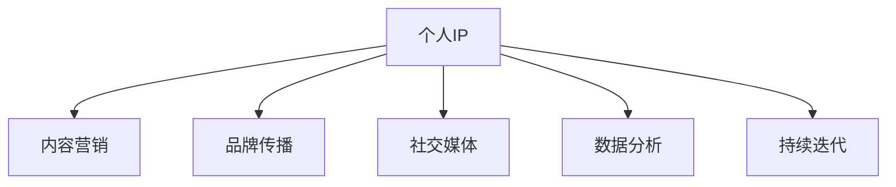

                 

# 建立个人IP：打造独特的个人标签和形象

在现代数字化时代，个人IP（Personal Intellectual Property）越来越成为职业发展和个人品牌塑造的关键。构建一个独特的个人IP，不仅有助于提高在专业领域的知名度和影响力，还能为企业和个人带来更多的商业机会和合作资源。本文将从核心概念、算法原理、操作步骤、案例分析等多个维度，详细阐述如何打造并提升个人IP，助力职业发展。

## 1. 背景介绍

### 1.1 问题由来
随着互联网的普及和社交媒体的崛起，个体在数字世界中的存在感越来越强。无论是知识型博主、IT技术专家，还是商业领袖、创意设计师，都在通过各类平台展示自己的专业知识和个人特色，打造自己的IP形象。一个有影响力的个人IP，不仅能够提升个人影响力，还能为企业和品牌带来巨大的商业价值。然而，要在众多竞争者中脱颖而出，打造一个真正有影响力的个人IP并非易事。本文将深入探讨如何建立并提升个人IP，帮助读者在职业发展道路上走得更快、更稳。

### 1.2 问题核心关键点
建立一个成功的个人IP，核心在于找到并放大自身的独特优势和核心价值。具体而言，需要以下关键点：
1. **明确目标**：清楚定义个人IP的目标和定位，确定希望在哪个领域达到何种影响力。
2. **定位独特性**：分析自身优势和兴趣点，找到与众不同的差异化点。
3. **内容建设**：通过高质量、有深度的内容输出，建立专业领域的权威性。
4. **品牌传播**：利用社交媒体、博客、演讲等渠道，有效传播个人品牌形象。
5. **持续优化**：不断收集反馈，调整个人IP策略，持续提升影响力。

## 2. 核心概念与联系

### 2.1 核心概念概述

为更好地理解个人IP的建立和提升，本节将介绍几个密切相关的核心概念：

- **个人IP**：指的是个人在某个领域或专业中的形象和声誉，代表了一个人的专业知识和影响力。
- **内容营销**：通过创造和传播有价值的内容，吸引目标受众，建立品牌权威。
- **品牌传播**：通过各种渠道推广个人品牌形象，提升知名度和美誉度。
- **社交媒体**：利用社交平台进行内容分享和互动，扩大影响范围。
- **数据分析**：通过数据分析了解受众偏好，优化个人IP策略。
- **持续迭代**：不断收集反馈，调整个人IP策略，持续提升影响力。

这些概念之间的逻辑关系可以通过以下Mermaid流程图来展示：



这个流程图展示了个人IP的建立和提升过程中，内容营销、品牌传播、社交媒体、数据分析以及持续迭代各个环节的重要作用，以及它们相互之间的关联。

## 3. 核心算法原理 & 具体操作步骤
### 3.1 算法原理概述

建立一个成功的个人IP，本质上是一个多阶段的优化过程，需要根据受众反馈和市场变化进行不断的调整和优化。其核心思想是通过内容输出、品牌传播等手段，最大化地展现个人优势，并吸引和保持目标受众的关注和兴趣。

形式化地，假设个人IP的目标受众为 $R$，当前影响力为 $I_0$，希望通过一系列操作，达到理想的影响力 $I^*$。则优化目标可以定义为：

$$
I^* = \mathop{\arg\max}_{I} f(I) = f(I_0 + \Delta I)
$$

其中 $f$ 为影响力和输出内容质量之间的关系函数，$\Delta I$ 为通过操作提升的影响力增量。

### 3.2 算法步骤详解

建立一个有影响力的个人IP，通常包括以下几个关键步骤：

**Step 1: 明确个人定位和目标**
- 分析自身优势、兴趣和经验，找到独特的价值点。
- 确定希望在哪个领域建立权威，并设定具体的目标（如成为某领域知名专家、影响力百万粉丝等）。

**Step 2: 设计个人品牌形象**
- 设计一套符合个人定位的品牌标识（如标志、口号、颜色等）。
- 确定个人品牌的声音和风格，确保在不同渠道上保持一致。

**Step 3: 生产高质量内容**
- 针对目标受众，确定适合的内容形式（如博客文章、视频、播客等）。
- 制定内容日历，定期发布高质量、有深度的内容。
- 使用SEO优化策略，提升内容的可发现性。

**Step 4: 品牌传播与推广**
- 利用社交媒体平台，定期发布和分享个人内容。
- 参与相关领域的讨论和活动，提升曝光率。
- 利用邮件列表、社群等方式，主动与目标受众互动。

**Step 5: 数据分析与优化**
- 收集受众反馈和行为数据，分析受众偏好和内容效果。
- 根据数据分析结果，调整内容策略和传播手段。
- 持续监测和评估个人IP的影响力变化。

**Step 6: 持续迭代与提升**
- 定期回顾个人IP的策略和执行情况，寻找改进空间。
- 引入新内容形式和传播渠道，提升影响力。
- 主动学习和适应市场变化，保持竞争优势。

### 3.3 算法优缺点

建立一个个人IP，具有以下优点：
1. **提升知名度**：通过高质量内容输出和有效传播，显著提升个人在专业领域的知名度。
2. **增加商业机会**：有影响力的个人IP能够吸引更多合作机会，提升商业价值。
3. **增强权威性**：专业领域内的一致性内容输出，有助于建立权威和专家地位。
4. **吸引受众**：个性化的品牌形象和有价值的内容，能够吸引并保持目标受众的关注。

同时，该方法也存在一些局限性：
1. **资源投入高**：内容生产和品牌传播需要大量的精力和时间投入。
2. **不确定性**：社交媒体和市场变化多变，效果难以完全掌控。
3. **技术门槛**：内容创作和数据分析需要一定的技术基础和工具支持。
4. **可持续性**：需要长期坚持和持续优化，才能保持影响力的持续提升。

尽管存在这些局限性，但就目前而言，内容营销和个人品牌塑造仍然是职业发展和个人品牌建设的重要手段。未来相关研究的重点在于如何进一步提升内容输出的效率和质量，探索更多高效的品牌传播渠道，同时兼顾技术要求和可持续性。

### 3.4 算法应用领域

个人IP的建立和提升方法，在多个领域得到了广泛应用，如：

- **知识型博主**：通过撰写高质量的博客文章和视频内容，建立特定领域的专业权威。
- **IT技术专家**：利用技术博客、开源项目等方式，展示技术能力和行业洞察。
- **商业领袖**：通过演讲、白皮书、商业咨询等方式，提升企业品牌和市场影响力。
- **创意设计师**：通过作品集、设计博客、社交媒体等渠道，展示设计理念和作品。
- **学术研究者**：通过学术论文、公开课、讲座等方式，建立学术影响力和研究权威。

除了这些典型领域外，个人IP的建立和提升方法同样适用于教育、健康、法律等诸多领域，助力各行各业的专业人士提升自身影响力。

## 4. 数学模型和公式 & 详细讲解 & 举例说明

### 4.1 数学模型构建

本节将使用数学语言对个人IP的建立和提升过程进行更加严格的刻画。

假设个人IP的目标受众为 $R$，当前影响力为 $I_0$，希望通过一系列操作，达到理想的影响力 $I^*$。定义影响力和输出内容质量之间的关系函数为 $f$，则优化目标可以表示为：

$$
I^* = \mathop{\arg\max}_{I} f(I) = f(I_0 + \Delta I)
$$

其中 $\Delta I$ 为通过操作提升的影响力增量。

### 4.2 公式推导过程

假设目标受众 $R$ 中，每个人对内容 $C$ 的关注度 $a$ 和阅读时长 $t$ 成正比，即 $a \propto t$。设每个受众对内容的平均评分 $s$，则内容对受众的影响力 $I$ 可以表示为：

$$
I = \sum_{i \in R} a_i s_i
$$

其中 $a_i$ 为受众 $i$ 对内容的关注度，$s_i$ 为受众 $i$ 对内容的评分。

如果通过内容优化和传播手段，使得受众对内容的关注度和评分分别提升 $\Delta a$ 和 $\Delta s$，则新的影响力 $I'$ 可以表示为：

$$
I' = \sum_{i \in R} (a_i + \Delta a) (s_i + \Delta s) = I + \Delta I
$$

其中 $\Delta I = \sum_{i \in R} (a_i + \Delta a) \Delta s + a_i \Delta s$。

因此，影响力和输出内容质量之间的关系函数 $f$ 可以表示为：

$$
f(I) = I
$$

即影响力 $I$ 等于目标受众 $R$ 对内容的关注度和评分的总和。

### 4.3 案例分析与讲解

以知识型博主为例，假设该博主希望通过一年时间的努力，提升其影响力从10000粉丝增加到50000粉丝。设每月发布的博客文章数量为 $N$，每篇文章的平均阅读时长为 $T$，受众对每篇文章的平均评分 $S$。则目标受众 $R$ 对内容的关注度 $a$ 和评分 $s$ 可以表示为：

$$
a = \frac{N \times T}{12}
$$

$$
s = S
$$

如果每篇文章都能提高2%的关注度 $\Delta a = 0.02 \times N \times T$ 和1%的评分 $\Delta s = 0.01 \times S$，则每月增加的影响力为：

$$
\Delta I = a \times \Delta s + a \times s = \frac{N \times T}{12} \times (0.02 \times N \times T + 0.01 \times S)
$$

设每月增加的粉丝数为 $\Delta F = \frac{\Delta I}{100}$，则一年内增加的粉丝总数为：

$$
F_{\text{total}} = 12 \times \Delta F = 12 \times \frac{\Delta I}{100} = 12 \times \frac{N \times T}{12} \times (0.02 \times N \times T + 0.01 \times S)
$$

通过调整 $N$ 和 $T$ 的值，可以达到提升影响力的目标。例如，如果 $N = 20$，$T = 15$ 分钟，$S = 4.5$，则一年内增加的粉丝总数为：

$$
F_{\text{total}} = 12 \times \frac{20 \times 15}{12} \times (0.02 \times 20 \times 15 + 0.01 \times 4.5) = 30360
$$

即通过持续的高质量内容输出和有效传播，该博主可以显著提升其影响力，实现从10000粉丝增加到50000粉丝的目标。

## 5. 项目实践：代码实例和详细解释说明
### 5.1 开发环境搭建

在进行个人IP的建立和提升实践前，我们需要准备好开发环境。以下是使用Python进行Django开发的环境配置流程：

1. 安装Python：从官网下载并安装Python，并确保版本为3.6或以上。

2. 安装Django：使用pip安装Django框架，建议使用虚拟环境来隔离项目依赖。

```bash
pip install django
```

3. 创建Django项目和应用：

```bash
django-admin startproject my_site
cd my_site
django-admin startapp my_app
```

4. 配置数据库：根据Django官方文档，配置数据库连接信息。

5. 安装第三方库：安装需要的第三方库，如requests、Pillow等。

```bash
pip install requests Pillow
```

完成上述步骤后，即可在项目环境中开始个人IP的开发。

### 5.2 源代码详细实现

下面我们以博客内容发布和社交媒体推广为例，给出使用Django框架的代码实现。

首先，定义博客内容模型：

```python
from django.db import models
from django.contrib.auth.models import User

class BlogPost(models.Model):
    title = models.CharField(max_length=100)
    content = models.TextField()
    created_at = models.DateTimeField(auto_now_add=True)
    author = models.ForeignKey(User, on_delete=models.CASCADE)
```

然后，定义博客内容视图和模板：

```python
from django.shortcuts import render, redirect
from django.contrib.auth.decorators import login_required
from .models import BlogPost

@login_required
def blog_post(request):
    blog_posts = BlogPost.objects.filter(author=request.user).order_by('-created_at')
    return render(request, 'blog/index.html', {'blog_posts': blog_posts})
```

接着，定义社交媒体分享接口：

```python
from django.contrib.auth.decorators import login_required
from django.http import JsonResponse

@login_required
def share_blog(request):
    blog_id = request.GET.get('blog_id')
    blog_post = BlogPost.objects.get(id=blog_id)
    blog_post.share_count += 1
    blog_post.save()
    return JsonResponse({'success': True})
```

最后，启动博客内容和社交媒体分享功能的开发流程：

```python
from django.contrib import admin
from .models import BlogPost

admin.site.register(BlogPost)

from django.urls import path
from . import views

urlpatterns = [
    path('blog/', views.blog_post, name='blog_post'),
    path('share_blog/', views.share_blog, name='share_blog'),
]
```

完成上述步骤后，即可在Django项目环境中实现博客内容的发布和社交媒体推广功能。通过博客内容的持续更新和社交媒体的积极推广，可以不断提升个人IP的影响力。

### 5.3 代码解读与分析

让我们再详细解读一下关键代码的实现细节：

**BlogPost模型**：
- 定义博客内容的基本属性，包括标题、内容、发布时间、作者等。
- 通过外键与用户模型关联，确保只有当前用户才能发布内容。

**blog_post视图**：
- 获取当前用户的所有博客内容，按发布时间倒序排列。
- 渲染模板输出博客列表页面。

**share_blog视图**：
- 获取指定ID的博客内容。
- 增加博客内容的分享次数。
- 返回Json响应，告知客户端分享成功。

**URL配置**：
- 定义博客内容列表页面和分享界面的路由。

通过上述代码实现，我们能够在一个Django项目中构建出功能完备的个人IP展示和社交媒体推广系统。开发者可以根据自身需求，进一步定制化内容和推广手段，提升个人IP的影响力。

## 6. 实际应用场景

### 6.1 智能客服系统

基于个人IP的智能客服系统，可以广泛应用于企业的客户服务领域。智能客服系统通过收集客户的问题和反馈，动态生成和传播高价值内容，提升客户体验，并建立客户信任。

在技术实现上，可以开发一个AI聊天机器人，利用自然语言处理技术分析客户需求，生成个性化的回答。同时，通过社交媒体和博客等渠道，定期分享客户服务案例和最佳实践，展示企业的服务质量和专业能力。

### 6.2 金融舆情监测

个人IP在金融领域的应用，可以通过构建金融分析博客和社交媒体账号，定期发布市场分析和投资策略等内容，提升在金融行业的影响力。

具体而言，可以分析每日股票市场数据，撰写投资报告和分析文章，并通过社交媒体和博客进行传播。对于重要的市场事件，可以发布实时评论和解读，吸引更多的关注和讨论。通过持续的内容输出和品牌传播，个人IP能够提升在金融行业内的权威性和影响力。

### 6.3 个性化推荐系统

基于个人IP的个性化推荐系统，可以通过推荐高质量的内容和产品，提升用户体验和满意度。

在技术实现上，可以开发一个内容推荐引擎，利用用户的阅读历史和行为数据，推荐与其兴趣相符的内容和商品。同时，通过社交媒体和博客等渠道，展示推荐结果和用户体验，建立品牌信任。通过持续的内容输出和用户互动，个性化推荐系统能够不断提升用户满意度和粘性，提升企业品牌价值。

### 6.4 未来应用展望

随着个人IP影响力的不断提升，未来将在更多领域得到应用，为各行各业带来变革性影响：

- **智慧医疗**：基于个人IP的医学博客和社交媒体账号，可以发布健康知识和医疗案例，提升公众的健康意识和医疗水平。
- **智能教育**：通过教育博客和在线课程，分享教育经验和教学方法，提升教育质量和公平性。
- **智慧城市**：基于个人IP的城市规划和建设博客，推广可持续发展和智能城市理念，提升城市管理水平和市民生活质量。
- **创意设计**：通过设计博客和社交媒体账号，展示设计作品和设计理念，推动设计行业的发展和创新。
- **学术研究**：通过科研博客和学术论文，分享最新研究成果和学术观点，提升学术影响力。

未来，个人IP的应用领域将不断扩展，成为各行各业品牌塑造和价值传递的重要工具。相信随着技术的发展和应用场景的丰富，个人IP将发挥更大的作用，推动社会进步和创新。

## 7. 工具和资源推荐

### 7.1 学习资源推荐

为了帮助开发者系统掌握个人IP的建立和提升方法，这里推荐一些优质的学习资源：

1. **Django官方文档**：Django框架的官方文档，提供了详尽的开发指南和最佳实践。
2. **内容营销指南**：《Content Marketing for Humans》一书，介绍了如何创建和管理高质量的内容，吸引和保持目标受众。
3. **社交媒体运营**：《Jab, Jab, Jab, Right Hook》一书，提供了社交媒体营销的策略和技巧。
4. **数据分析工具**：Google Analytics、Hootsuite等工具，帮助收集和分析受众数据。
5. **项目管理工具**：Trello、Asana等工具，帮助管理项目进度和任务分配。

通过学习这些资源，相信你一定能够掌握个人IP的建立和提升方法，并在职业发展道路上走得更快、更稳。

### 7.2 开发工具推荐

高效的开发离不开优秀的工具支持。以下是几款用于个人IP建立和提升开发的常用工具：

1. **Django框架**：功能强大的Python Web框架，适合快速迭代和开发Web应用。
2. **GitHub**：开源代码托管平台，方便版本控制和代码共享。
3. **SEO优化工具**：如SEMrush、Ahrefs等，帮助提升内容的可发现性。
4. **社交媒体管理工具**：如Hootsuite、Buffer等，方便管理和分析社交媒体账号。
5. **内容创作工具**：如Grammarly、Hemingway等，帮助提升内容的语言质量和风格一致性。

合理利用这些工具，可以显著提升个人IP的建立和提升效率，加快创新迭代的步伐。

### 7.3 相关论文推荐

个人IP的建立和提升方法，已经引起了学界的广泛关注，以下是几篇奠基性的相关论文，推荐阅读：

1. **内容营销研究**：“Content Marketing: The Internet Era's New Advertising”，该文探讨了内容营销的原理和策略。
2. **社交媒体分析**：“Understanding Social Media: Sources and Uses of Social Media”，该文介绍了社交媒体数据的收集和分析方法。
3. **数据分析与优化**：“The Google Analytics Academy”，该文提供了Google Analytics的详细教程和应用案例。
4. **品牌传播与传播策略**：“Brand Dynamics: Brand Spread Across Social Media Platforms”，该文分析了品牌传播在不同平台上的表现和影响因素。
5. **持续优化与改进**：“Agile Methodologies: Applying It to Your Content Marketing Strategy”，该文探讨了如何在内容营销中应用敏捷方法。

这些论文代表了大IP建立和提升方法的发展脉络，帮助研究者把握学科前进方向，激发更多的创新灵感。

## 8. 总结：未来发展趋势与挑战

### 8.1 总结

本文对个人IP的建立和提升方法进行了全面系统的介绍。首先阐述了个人IP的定义和重要性，明确了个人IP的目标和定位，介绍了建立个人IP的关键步骤和操作策略。其次，从原理到实践，详细讲解了个人IP的数学模型和计算公式，给出了个人IP建设的代码实例和详细解释。同时，本文还广泛探讨了个人IP在各个行业领域的应用前景，展示了个人IP的巨大潜力。此外，本文精选了个人IP建立和提升的各类学习资源，力求为读者提供全方位的技术指引。

通过本文的系统梳理，可以看到，建立和提升个人IP，不仅需要掌握系统的理论知识，还需要具备实际操作的能力和持续优化的策略。只有将理论和实践相结合，才能在职业发展道路上走得更快、更稳。

### 8.2 未来发展趋势

展望未来，个人IP的建立和提升技术将呈现以下几个发展趋势：

1. **内容自动化生成**：随着AI技术的发展，内容自动化生成技术将进一步成熟，能够通过算法自动生成高质量的内容，提升内容产出效率。
2. **社交媒体平台多元化**：未来社交媒体平台将更加多样化，不同平台的用户行为和偏好也各不相同。需要针对不同的平台制定差异化的内容策略。
3. **数据驱动的个性化**：通过数据分析，深入理解目标受众的需求和行为，制定更加个性化和精准的内容和推广策略。
4. **跨界融合**：个人IP将与更多领域（如电商、教育、医疗等）进行跨界融合，带来更多创新应用场景。
5. **可持续性和合规性**：个人IP的建立和推广需要考虑环境和社会影响，遵循合规要求，注重可持续性发展。

以上趋势凸显了个人IP建立和提升技术的广阔前景。这些方向的探索发展，必将进一步提升个人IP的影响力和应用范围，为各行各业带来新的机遇和挑战。

### 8.3 面临的挑战

尽管个人IP的建立和提升技术已经取得了瞩目成就，但在迈向更加智能化、普适化应用的过程中，它仍面临着诸多挑战：

1. **内容质量参差不齐**：随着内容自动化生成技术的发展，部分内容质量可能存在参差不齐的问题。需要通过人工审核和优化，确保内容的高质量。
2. **平台生态复杂**：社交媒体平台数量众多，用户行为各异，需要投入大量时间和资源进行平台管理和内容发布。
3. **数据隐私和安全**：在数据驱动的个性化过程中，如何保护用户隐私和数据安全，防止数据泄露和滥用，将成为重要的挑战。
4. **技术门槛较高**：内容自动化生成和数据分析需要一定的技术基础和工具支持，部分开发者可能难以掌握。
5. **市场变化快**：社交媒体和市场环境变化多变，需要快速调整策略，跟上市场趋势。

正视个人IP建立和提升面临的这些挑战，积极应对并寻求突破，将是大IP发展走向成熟的必由之路。相信随着技术的发展和应用场景的丰富，个人IP将发挥更大的作用，推动职业发展和品牌塑造。

### 8.4 研究展望

面对个人IP建立和提升所面临的种种挑战，未来的研究需要在以下几个方面寻求新的突破：

1. **内容自动化优化**：开发更加智能和高效的内容生成和优化算法，提升内容的语言质量和受众接受度。
2. **多平台内容策略**：研究不同社交媒体平台的用户行为和偏好，制定差异化的内容发布策略。
3. **数据隐私保护**：开发数据隐私保护技术，确保用户数据的隐私和安全。
4. **跨界融合应用**：探索个人IP在更多领域的跨界融合应用，推动跨领域创新。
5. **可持续发展**：研究如何在内容生产和品牌传播过程中注重可持续发展，遵循合规要求。

这些研究方向的探索，必将引领个人IP建立和提升技术迈向更高的台阶，为各行各业的专业人士提供更加全面和高效的工具。只有勇于创新、敢于突破，才能在数字化时代中保持竞争力，实现职业发展和品牌塑造。

## 9. 附录：常见问题与解答

**Q1：如何提高个人IP的影响力？**

A: 提高个人IP的影响力，主要从以下几个方面入手：
1. **高质量内容输出**：持续发布有深度、有价值的内容，建立专业领域的权威。
2. **有效品牌传播**：利用社交媒体、博客、演讲等渠道，广泛传播个人品牌形象。
3. **数据驱动优化**：通过数据分析，了解受众偏好和内容效果，不断调整优化内容策略。
4. **持续学习和改进**：定期回顾和改进个人IP策略，保持竞争优势。

**Q2：个人IP的内容形式有哪些？**

A: 个人IP的内容形式多种多样，主要包括以下几种：
1. **博客文章**：系统性介绍专业知识和观点。
2. **视频内容**：利用视频展示复杂的概念和案例。
3. **播客节目**：通过音频进行深入讨论和交流。
4. **社交媒体帖子**：在社交平台上分享日常观察和观点。
5. **在线课程**：通过课程系统性传授知识和技能。

**Q3：如何选择适合的内容形式？**

A: 选择适合的内容形式，需要根据目标受众和内容特点进行综合考虑：
1. **受众偏好**：了解目标受众的兴趣和习惯，选择最合适的形式。
2. **内容复杂度**：对于复杂内容，选择视频、课程等形式，有助于更直观地传递信息。
3. **互动性**：社交媒体和播客等形式，适合互动和讨论，有助于建立社区和品牌忠诚度。
4. **技术实现**：考虑自身的技术能力和资源，选择合适的形式进行内容生产和传播。

通过选择合适的内容形式，能够最大化地展示个人IP的魅力和专业性，提升影响力和吸引力。

**Q4：如何在社交媒体上提升个人IP的曝光率？**

A: 在社交媒体上提升个人IP的曝光率，主要从以下几个方面入手：
1. **定期发布高质量内容**：保持一定的发布频率，定期分享有价值的信息。
2. **互动和回复**：积极与粉丝互动，回复评论和私信，增强受众的参与感和忠诚度。
3. **利用标签和话题**：使用相关标签和话题，提升内容的可发现性。
4. **跨平台推广**：在不同社交媒体平台上进行推广，扩大影响力。
5. **合作和联动**：与其他有影响力的账号进行合作和联动，互相推广，提升曝光率。

通过这些策略，能够在社交媒体上不断提升个人IP的曝光率，吸引更多目标受众的关注和互动。

**Q5：如何利用数据分析优化个人IP策略？**

A: 利用数据分析优化个人IP策略，主要从以下几个方面入手：
1. **受众分析**：通过数据分析工具，了解受众的兴趣和行为，制定个性化内容策略。
2. **内容效果评估**：利用阅读量、点赞量、分享量等指标，评估内容的表现和效果。
3. **受众反馈**：收集受众的评论和反馈，了解受众需求和意见，不断改进内容质量和传播策略。
4. **策略调整**：根据数据分析结果，调整内容形式和传播手段，提升影响力。

通过持续的数据分析和学习，能够不断优化个人IP策略，提升内容质量和受众满意度。

---

作者：禅与计算机程序设计艺术 / Zen and the Art of Computer Programming

