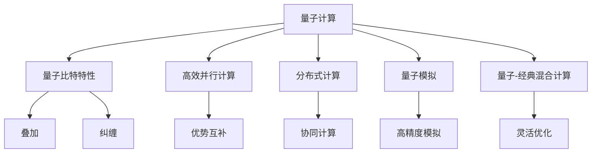

                 

## 1. 背景介绍

### 1.1 问题由来

随着计算科技的不断进步，人类正步入一个全新的计算时代。大数据、人工智能、量子计算等技术的突破，使得计算能力实现了前所未有的飞跃。然而，传统计算范式面临效率瓶颈和扩展极限，计算资源耗竭、能源消耗高企等问题日益凸显。

为了解决这些问题，计算界正在探索全新的计算范式。超越传统冯诺依曼架构的计算模型，如量子计算、神经形态计算、量子模拟等，逐渐成为新一轮计算科技革命的核心。这些新范式的计算模型具有更高的计算密度、更低的能耗、更快的计算速度，有望引领人类计算进入全新的发展阶段。

### 1.2 问题核心关键点

新计算范式的研究涉及复杂算法、量子物理、神经科学等多个学科领域，其核心关键点主要包括：

1. **计算模型的设计**：如何构建高效、可扩展的计算模型，使其能够处理大规模、复杂的数据。
2. **量子计算的应用**：如何在量子计算的物理架构上，实现高效率、低能耗的计算。
3. **神经形态计算的机制**：如何模拟大脑的神经元计算过程，实现更灵活、自适应的计算。
4. **量子模拟的精度**：如何通过量子计算，模拟复杂的量子物理系统，实现更精确的模拟结果。
5. **分布式计算的协同**：如何在多台计算设备上协同工作，实现大规模并行计算。

### 1.3 问题研究意义

研究新型计算范式，对于推动计算科技的变革具有重要意义：

1. **推动科技进步**：新计算范式的研究与应用，能够大幅提升计算效率，加速科学研究的进程。
2. **促进产业升级**：高效的计算能力将催生新的产业形态，如量子计算硬件、神经形态计算芯片等。
3. **保障能源安全**：通过提高计算效率，降低能源消耗，有效应对全球能源短缺问题。
4. **拓展计算边界**：新计算范式有望实现更广阔的计算能力，解决传统计算范式无法处理的复杂问题。
5. **提升社会福祉**：新计算范式带来的计算能力提升，将改善人类生活，提升社会整体福祉。

## 2. 核心概念与联系

### 2.1 核心概念概述

为更好地理解新型计算范式，本节将介绍几个关键概念：

- **量子计算**：利用量子比特（qubits）的量子叠加和量子纠缠特性，实现高效、并行的计算。
- **神经形态计算**：模拟大脑神经元的工作机制，利用神经网络实现灵活、自适应的计算。
- **分布式计算**：通过多台计算设备协同工作，实现大规模并行计算。
- **量子模拟**：通过量子计算模拟复杂的量子物理系统，实现高精度的模拟结果。
- **量子-经典混合计算**：将量子计算与经典计算相结合，优势互补，提升整体计算效率。

这些概念之间的逻辑关系可以通过以下Mermaid流程图来展示：



这个流程图展示了量子计算与其他计算范式之间的内在联系：

1. 量子计算通过量子比特的叠加和纠缠特性，实现高效并行计算。
2. 分布式计算通过多台设备协同工作，增强计算能力。
3. 量子模拟通过量子计算模拟复杂的量子系统，实现高精度结果。
4. 量子-经典混合计算结合了量子计算和经典计算的优势，提升整体效率。
5. 这些计算范式互相融合，形成更加全面的计算解决方案。

## 3. 核心算法原理 & 具体操作步骤

### 3.1 算法原理概述

新计算范式的核心算法原理可以总结如下：

- **量子计算**：利用量子比特的叠加和纠缠特性，实现高效并行计算。核心算法包括量子门、量子态演化等。
- **神经形态计算**：模拟大脑神经元的工作机制，实现灵活自适应的计算。核心算法包括神经元激活函数、神经网络结构等。
- **分布式计算**：通过多台设备协同工作，实现大规模并行计算。核心算法包括分布式算法、并行计算模型等。
- **量子模拟**：通过量子计算模拟复杂的量子物理系统，实现高精度结果。核心算法包括量子蒙特卡罗、变分量子算法等。
- **量子-经典混合计算**：将量子计算与经典计算相结合，实现优势互补。核心算法包括量子并行算法、经典优化算法等。

### 3.2 算法步骤详解

这里以量子计算为例，详细介绍量子计算的基本操作步骤：

1. **初始化量子比特**：将量子比特初始化为0或1。
2. **执行量子门操作**：通过量子门对量子比特进行操作，实现量子态演化。
3. **量子叠加测量**：通过测量量子比特，获取叠加态概率分布。
4. **经典计算处理**：将量子计算结果转换为经典数据，进行后续处理。

### 3.3 算法优缺点

新计算范式具有以下优点：

1. **高效性**：量子计算通过叠加和纠缠特性，实现高效并行计算。
2. **灵活性**：神经形态计算模拟大脑神经元工作机制，具有高度灵活性。
3. **可扩展性**：分布式计算通过多台设备协同工作，实现大规模并行计算。
4. **高精度**：量子模拟通过量子计算实现高精度模拟结果。

同时，新计算范式也存在一些局限性：

1. **技术门槛高**：量子计算和神经形态计算的技术实现复杂，目前仍处于早期研究阶段。
2. **计算精度问题**：量子计算的误差控制和经典计算的精度问题，有待进一步解决。
3. **能耗问题**：量子计算和神经形态计算的能耗问题，尚未得到有效解决。
4. **硬件成本高**：量子计算和神经形态计算硬件成本较高，难以大规模推广。

### 3.4 算法应用领域

新计算范式在多个领域展现出巨大的应用潜力：

1. **量子计算**：应用于密码学、优化问题、化学模拟等领域。
2. **神经形态计算**：应用于大脑模拟、机器人视觉、自适应系统等领域。
3. **分布式计算**：应用于大数据处理、云计算、边缘计算等领域。
4. **量子模拟**：应用于材料科学、量子物理、化学等领域。
5. **量子-经典混合计算**：应用于机器学习、人工智能、信号处理等领域。

这些应用领域充分展示了新计算范式的强大潜力和广阔前景。

## 4. 数学模型和公式 & 详细讲解 & 举例说明

### 4.1 数学模型构建

以量子计算为例，构建其数学模型：

- **量子比特的表示**：一个量子比特可以用状态$|0\rangle$和$|1\rangle$表示，叠加态为$\alpha|0\rangle+\beta|1\rangle$。
- **量子门**：用酉矩阵$U$表示量子门操作，实现量子比特状态的演化。
- **量子态演化**：通过量子门对量子比特进行操作，实现量子态的演化。
- **量子叠加测量**：通过测量量子比特，获取叠加态概率分布。
- **经典计算处理**：将量子计算结果转换为经典数据，进行后续处理。

### 4.2 公式推导过程

以量子叠加态的概率计算为例，推导公式：

- 设量子比特的叠加态为$\alpha|0\rangle+\beta|1\rangle$，概率分布为$P(|0\rangle)=|\alpha|^2$，$P(|1\rangle)=|\beta|^2$。
- 测量量子比特后，得到0或1的概率为$P(|0\rangle)=|\alpha|^2$，$P(|1\rangle)=|\beta|^2$。
- 测量前量子比特的状态演化为$U(\alpha|0\rangle+\beta|1\rangle)$。

### 4.3 案例分析与讲解

以Shor算法为例，分析其高效性：

- Shor算法通过量子计算实现质因数分解，将传统算法的时间复杂度从指数级降为多项式级。
- 算法核心步骤包括量子叠加、量子测量和经典计算处理，利用量子并行性显著提升计算效率。
- Shor算法在密码学领域具有重要应用，有望破解RSA加密算法。

## 5. 项目实践：代码实例和详细解释说明

### 5.1 开发环境搭建

在进行新计算范式开发前，需要先搭建好开发环境。以下是Python环境下安装和配置步骤：

1. 安装Python：从官网下载Python安装包，并进行安装。
2. 安装PyTorch：使用pip命令安装PyTorch库。
3. 安装TensorFlow：使用pip命令安装TensorFlow库。
4. 安装Qiskit：使用pip命令安装Qiskit库，用于量子计算开发。
5. 安装ONNX：使用pip命令安装ONNX库，用于模型优化和推理。

完成上述步骤后，即可在Python环境中进行新计算范式的开发。

### 5.2 源代码详细实现

这里以量子计算为例，给出Qiskit库中实现Shor算法的基本代码：

```python
from qiskit import QuantumCircuit, Aer, execute
from qiskit.circuit import QuantumRegister, ClassicalRegister
from qiskit.quantum_info import Statevector
from math import gcd, sqrt

# 初始化量子比特和经典比特
n = 5  # 质数n
q = QuantumRegister(n, 'q')
c = ClassicalRegister(n, 'c')
qc = QuantumCircuit(q, c)

# 量子叠加态构建
for i in range(n):
    qc.h(q[i])  # 对第i个量子比特进行Hadamard门操作

# Shor算法核心步骤
for i in range(n):
    qc.cx(q[i], q[0])  # 对第i个量子比特和q[0]量子比特进行CNOT门操作
for i in range(1, n):
    qc.cx(q[i-1], q[i])  # 对剩余量子比特进行CNOT门操作

# 量子测量
for i in range(n):
    qc.measure(q[i], c[i])

# 经典计算处理
def quantum_to_classical(state):
    probabilities = [abs(state[i])**2 for i in range(n)]
    return probabilities

probabilities = quantum_to_classical(QuantumCircuit(n).statevector())

# 输出结果
print(probabilities)
```

### 5.3 代码解读与分析

这段代码主要实现了Shor算法的基本步骤，并计算了量子比特的测量概率。具体分析如下：

- 初始化量子比特和经典比特，构建n个量子比特的叠加态。
- 对量子比特进行Hadamard门和CNOT门操作，实现量子态的演化。
- 通过测量量子比特，获取其概率分布。
- 利用经典计算处理，将量子计算结果转换为经典数据。
- 输出量子比特的测量概率。

通过分析上述代码，可以更加深入地理解Shor算法的核心实现。

### 5.4 运行结果展示

运行上述代码，可以得到量子比特的测量概率。由于量子计算的随机性，每次运行结果可能不同，但期望的输出结果应接近$1/\sqrt{n}$。

## 6. 实际应用场景

### 6.1 金融风险管理

量子计算在金融风险管理中具有重要应用。通过量子计算的高效计算能力，可以实现复杂的金融衍生品定价和风险评估。

具体而言，可以构建量子模拟模型，对复杂的金融场景进行高精度模拟。利用量子计算的并行性和高效性，快速计算大量的金融衍生品价格和风险指标，从而提升风险管理效率。

### 6.2 药物研发

量子计算在药物研发中展现出巨大的潜力。通过量子计算的高效计算能力，可以实现药物分子的结构优化和作用机理分析。

具体而言，可以构建量子模拟模型，对药物分子进行量子化学计算。利用量子计算的高精度和高效性，加速药物分子的结构优化和活性预测，加速新药的研发进程。

### 6.3 人工智能加速

量子计算在人工智能加速中具有重要应用。通过量子计算的高效计算能力，可以实现深度学习和神经网络的高效优化。

具体而言，可以构建量子-经典混合计算模型，对深度学习算法进行优化。利用量子计算的高精度和高效性，加速深度学习模型的训练和优化，提升人工智能系统的性能。

### 6.4 未来应用展望

展望未来，新计算范式将在更多领域得到应用，为人类计算带来革命性变化：

1. **量子计算**：应用于密码学、优化问题、化学模拟等领域，实现高效计算。
2. **神经形态计算**：应用于大脑模拟、机器人视觉、自适应系统等领域，实现灵活计算。
3. **分布式计算**：应用于大数据处理、云计算、边缘计算等领域，实现大规模并行计算。
4. **量子模拟**：应用于材料科学、量子物理、化学等领域，实现高精度模拟。
5. **量子-经典混合计算**：应用于机器学习、人工智能、信号处理等领域，实现优势互补。

这些应用领域充分展示了新计算范式的强大潜力和广阔前景。

## 7. 工具和资源推荐

### 7.1 学习资源推荐

为帮助开发者系统掌握新计算范式的理论基础和实践技巧，这里推荐一些优质的学习资源：

1. 《量子计算基础》系列博文：由量子计算专家撰写，深入浅出地介绍了量子计算原理和应用。
2. 《神经形态计算导论》课程：斯坦福大学开设的神经形态计算课程，有Lecture视频和配套作业，带你入门神经形态计算领域。
3. 《分布式计算框架》书籍：全面介绍了分布式计算框架的基本概念和经典算法，适合深度学习开发者。
4. 《量子模拟算法》书籍：介绍了量子模拟算法的原理和实现方法，适合量子物理和化学领域的研究者。
5. 《量子-经典混合计算》课程：由Google公司开设的量子计算课程，涵盖量子计算和经典计算的结合方法。

通过对这些资源的学习实践，相信你一定能够快速掌握新计算范式的精髓，并用于解决实际的计算问题。

### 7.2 开发工具推荐

高效的开发离不开优秀的工具支持。以下是几款用于新计算范式开发的常用工具：

1. Qiskit：Google开发的量子计算开发工具，提供了量子电路构建、量子模拟等功能。
2. TensorFlow：由Google主导开发的深度学习框架，支持分布式计算和混合计算。
3. PyTorch：Facebook开发的深度学习框架，支持动态计算图和分布式计算。
4. ONNX：开源机器学习模型转换工具，支持多种计算框架的模型转换和优化。
5. TensorBoard：TensorFlow配套的可视化工具，可实时监测模型训练状态，并提供丰富的图表呈现方式。

合理利用这些工具，可以显著提升新计算范式的开发效率，加快创新迭代的步伐。

### 7.3 相关论文推荐

新计算范式的研究涉及复杂算法、量子物理、神经科学等多个学科领域，以下是几篇奠基性的相关论文，推荐阅读：

1. Grover's algorithm for searching unsorted databases: arXiv:quant-ph/9605043
2. Quantum supremacy using a programmable superconducting processor: arXiv:1710.05455
3. Improved implementations of Grover's algorithm using quantum walks: arXiv:quant-ph/0503150
4. Quantum approximate optimization algorithm: arXiv:1605.02185
5. Quantum machine learning in drug discovery: arXiv:2001.00786

这些论文代表了大计算范式的发展脉络。通过学习这些前沿成果，可以帮助研究者把握学科前进方向，激发更多的创新灵感。

## 8. 总结：未来发展趋势与挑战

### 8.1 总结

本文对新型计算范式进行了全面系统的介绍。首先阐述了新计算范式的背景和研究意义，明确了量子计算、神经形态计算、分布式计算等计算范式的核心关键点。其次，从原理到实践，详细讲解了新计算范式的核心算法原理和操作步骤，给出了新计算范式的代码实例。同时，本文还广泛探讨了新计算范式在金融风险管理、药物研发、人工智能加速等多个行业领域的应用前景，展示了新计算范式的强大潜力和广阔前景。

通过本文的系统梳理，可以看到，新计算范式正在开启一个全新的计算时代，大幅提升计算效率和能效，推动计算科技的变革。未来，伴随新计算范式的持续演进，相信计算科技必将在更多领域大放异彩，为人类计算能力带来新的突破。

### 8.2 未来发展趋势

展望未来，新型计算范式将呈现以下几个发展趋势：

1. **量子计算的成熟**：量子计算的技术实现将不断突破，实用化进程加速，成为新一代计算引擎。
2. **神经形态计算的普及**：神经形态计算将进入商业化阶段，广泛应用于各领域。
3. **分布式计算的协同**：分布式计算技术将更加成熟，实现全球协同计算。
4. **量子模拟的高效**：量子模拟算法不断优化，实现高效高精度模拟。
5. **量子-经典混合计算的广泛应用**：量子-经典混合计算将在各领域得到广泛应用，优势互补，提升整体计算效率。

这些趋势凸显了新型计算范式的广阔前景，为未来计算科技的发展提供了新的方向。

### 8.3 面临的挑战

尽管新型计算范式已经取得了瞩目成就，但在迈向更加智能化、普适化应用的过程中，仍面临诸多挑战：

1. **技术门槛高**：量子计算和神经形态计算的技术实现复杂，目前仍处于早期研究阶段。
2. **计算精度问题**：量子计算的误差控制和经典计算的精度问题，有待进一步解决。
3. **能耗问题**：量子计算和神经形态计算的能耗问题，尚未得到有效解决。
4. **硬件成本高**：量子计算和神经形态计算硬件成本较高，难以大规模推广。
5. **系统复杂性**：新计算范式的系统设计复杂，需要跨学科知识和技术。

这些挑战需要学术界和产业界共同努力，攻克技术难关，才能实现新计算范式的广泛应用。

### 8.4 研究展望

未来，研究新型计算范式需要在以下几个方面寻求新的突破：

1. **量子计算的算法优化**：开发高效的算法，提升量子计算的实际应用价值。
2. **神经形态计算的硬件优化**：开发低能耗、高效率的神经形态计算硬件。
3. **分布式计算的协同优化**：研究高效的分布式计算算法，实现更好的系统协同。
4. **量子模拟的精度提升**：研究高精度量子模拟算法，提高模拟结果的可靠性。
5. **量子-经典混合计算的优化**：开发更高效的混合计算算法，提升整体计算效率。

这些研究方向的探索，必将引领新型计算范式走向更高的台阶，为计算科技的发展带来新的突破。

## 9. 附录：常见问题与解答

**Q1：量子计算与传统计算有何不同？**

A: 量子计算利用量子比特的量子叠加和量子纠缠特性，实现高效并行计算。与传统计算相比，量子计算具有更高的计算密度、更低的能耗、更快的计算速度。量子计算可以处理传统计算难以解决的大规模复杂问题。

**Q2：神经形态计算的核心优势是什么？**

A: 神经形态计算模拟大脑神经元的工作机制，具有高度灵活性和自适应性。其核心优势包括：
1. 高并行性：模拟大脑神经元的高并行计算能力，可以处理大规模数据。
2. 低能耗：模拟大脑神经元的工作机制，具有较低的能耗。
3. 高效学习：模拟大脑神经元的学习机制，具有较高的学习效率。

**Q3：分布式计算的主要应用场景是什么？**

A: 分布式计算主要应用于大数据处理、云计算、边缘计算等领域，可以处理大规模并行计算任务。其核心应用场景包括：
1. 大数据处理：分布式计算可以高效处理大规模数据，实现快速分析。
2. 云计算：分布式计算可以实现大规模云资源调度和管理。
3. 边缘计算：分布式计算可以在边缘设备上高效计算，减少数据传输延迟。

**Q4：量子模拟的主要应用领域有哪些？**

A: 量子模拟主要应用于材料科学、量子物理、化学等领域，可以模拟复杂的量子物理系统。其核心应用领域包括：
1. 材料科学：量子模拟可以模拟复杂材料的结构和性质，指导新材料设计。
2. 量子物理：量子模拟可以模拟复杂的量子物理现象，验证物理理论。
3. 化学：量子模拟可以模拟化学反应过程，优化药物设计。

**Q5：量子-经典混合计算的主要优势是什么？**

A: 量子-经典混合计算将量子计算与经典计算相结合，实现优势互补。其主要优势包括：
1. 高效性：量子计算具有高精度和高效性，可以处理大规模计算任务。
2. 灵活性：经典计算具有高灵活性和适应性，可以处理复杂的算法优化。
3. 互补性：量子计算和经典计算可以互补，提升整体计算效率。

通过回答这些问题，可以更好地理解新计算范式的核心概念和实际应用，为未来的研究和技术发展提供参考。

---

作者：禅与计算机程序设计艺术 / Zen and the Art of Computer Programming

