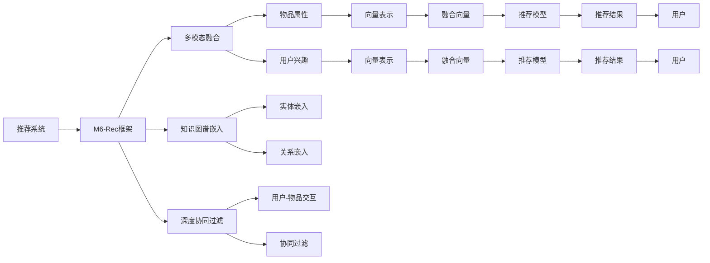

                 

# 开放域推荐系统的探索：M6-Rec框架

## 1. 背景介绍

随着互联网的快速发展和数字经济的兴起，推荐系统已经成为各大平台吸引用户和提升用户体验的重要手段。通过推荐系统，用户可以更快地发现和接触到感兴趣的内容，平台也可以提高用户粘性和活跃度。然而，传统推荐系统大多基于用户历史行为数据进行推荐，难以应对用户动态需求和冷启动等问题，难以实现更智能、更具个性化的推荐。

为了解决这些问题，近年来推荐系统研究逐渐向开放域推荐系统转变，即在大规模数据上进行学习，通过建模用户兴趣和物品属性之间的关联，实现更灵活、更准确的推荐。M6-Rec框架作为当前开放域推荐系统的典型代表，通过引入多模态融合、知识图谱嵌入、深度协同过滤等技术，展示了开放域推荐系统的巨大潜力。

## 2. 核心概念与联系

### 2.1 核心概念概述

为了更好地理解M6-Rec框架，我们先简要介绍一些核心概念：

- **推荐系统(Recommender System)**：根据用户的历史行为和属性，预测用户可能感兴趣的物品，并进行推荐。常见的推荐方式包括基于协同过滤、基于内容的推荐、混合推荐等。
- **开放域推荐系统(Open-domain Recommender System)**：通过在大规模数据上学习用户和物品的关联模式，实现更灵活、更精准的推荐。开放域推荐系统不再局限于历史行为数据，而是利用用户和物品的全局特征，提升推荐的泛化能力。
- **多模态融合(Multi-modal Fusion)**：融合多种类型的数据（如文本、图像、音频等）进行推荐，利用不同模态的信息互补，提升推荐效果。
- **知识图谱嵌入(Knowledge Graph Embedding)**：将知识图谱中的实体和关系进行向量表示，将其与物品属性信息融合，提升推荐模型的表示能力。
- **深度协同过滤(Deep Collaborative Filtering)**：利用深度神经网络对协同过滤模型进行改进，增强推荐模型的表达能力和泛化能力。

这些核心概念共同构成了开放域推荐系统的基础，并通过M6-Rec框架得到了更深入的实践和应用。

### 2.2 核心概念原理和架构的 Mermaid 流程图



## 3. 核心算法原理 & 具体操作步骤

### 3.1 算法原理概述

M6-Rec框架的核心思想是：通过融合多种数据源和建模技术，构建开放域推荐模型，实现更灵活、更精准的推荐。其主要原理包括：

1. **多模态融合**：利用不同模态的信息对用户和物品进行建模，提升推荐模型的表示能力。
2. **知识图谱嵌入**：将知识图谱中的实体和关系进行向量表示，将其与物品属性信息融合，提升推荐模型的泛化能力。
3. **深度协同过滤**：利用深度神经网络对协同过滤模型进行改进，增强推荐模型的表达能力和泛化能力。

### 3.2 算法步骤详解

以下是M6-Rec框架的具体操作步骤：

**Step 1: 数据预处理**

- **用户数据预处理**：收集用户历史行为数据、用户属性数据等，进行数据清洗、归一化处理。
- **物品数据预处理**：收集物品属性数据、物品标签数据等，进行数据清洗、特征工程处理。

**Step 2: 多模态特征提取**

- **用户特征提取**：使用文本、图像、音频等多种模态的数据，提取用户的多维度特征。
- **物品特征提取**：使用文本、图像、音频等多种模态的数据，提取物品的多维度特征。

**Step 3: 知识图谱嵌入**

- **知识图谱构建**：构建知识图谱，包含实体、关系、属性等，并进行实体关系推理。
- **实体嵌入**：将知识图谱中的实体进行向量表示，使用TransE、TransH等模型进行嵌入。
- **关系嵌入**：将知识图谱中的关系进行向量表示，使用共现矩阵、图卷积网络等方法进行嵌入。

**Step 4: 深度协同过滤**

- **用户-物品交互建模**：使用深度神经网络，对用户和物品的交互进行建模，捕捉用户-物品交互的复杂关系。
- **协同过滤优化**：利用深度协同过滤技术，对传统协同过滤模型进行改进，增强推荐模型的表达能力和泛化能力。

**Step 5: 融合与推荐**

- **特征融合**：将多模态特征和知识图谱嵌入结果进行融合，使用Attention机制、加权平均等方法进行整合。
- **推荐模型训练**：利用融合后的特征进行模型训练，使用交叉熵损失、均方误差损失等进行优化。
- **推荐结果输出**：使用训练好的模型对用户进行推荐，并输出推荐结果。

### 3.3 算法优缺点

M6-Rec框架具有以下优点：

1. **泛化能力强**：通过融合多种数据源和建模技术，提升了推荐模型的泛化能力，能够适应不同场景和不同用户。
2. **精度高**：多模态融合和深度协同过滤技术，提高了推荐模型的表达能力和精度。
3. **适应性强**：能够处理冷启动用户和物品，提升推荐系统的灵活性。

同时，该框架也存在一些缺点：

1. **数据需求大**：需要收集和处理多种模态的数据，增加了数据获取和处理的复杂性。
2. **计算开销高**：深度神经网络和大规模知识图谱嵌入，增加了计算复杂度和时间成本。
3. **模型复杂**：多模态融合和深度协同过滤技术的引入，增加了模型的复杂性和可解释性难度。

尽管存在这些局限性，但M6-Rec框架作为开放域推荐系统的典型代表，其先进性和有效性得到了广泛认可，为推荐系统研究和应用提供了新的方向。

### 3.4 算法应用领域

M6-Rec框架不仅适用于传统的电商推荐系统，更可以在新闻、音乐、视频等多个领域得到应用。以下是几个典型应用场景：

1. **新闻推荐系统**：利用用户阅读行为、文章属性等信息，进行新闻文章的推荐，提升用户阅读体验。
2. **音乐推荐系统**：利用用户听歌行为、歌曲属性等信息，进行歌曲的推荐，提升用户听歌体验。
3. **视频推荐系统**：利用用户观看行为、视频属性等信息，进行视频内容的推荐，提升用户观看体验。
4. **广告推荐系统**：利用用户点击行为、广告属性等信息，进行广告的推荐，提升广告投放效果。
5. **社交网络推荐系统**：利用用户互动行为、社交属性等信息，进行好友、群组、话题的推荐，提升社交体验。

这些应用场景展示了M6-Rec框架的广泛适用性，进一步证明了其在实际应用中的重要价值。

## 4. 数学模型和公式 & 详细讲解

### 4.1 数学模型构建

M6-Rec框架的数学模型构建涉及多模态特征提取、知识图谱嵌入、深度协同过滤等多个环节，其核心在于将用户和物品进行多维度建模，并进行特征融合和推荐模型训练。

假设用户集合为 $U$，物品集合为 $I$，用户-物品交互集合为 $J$。设用户 $u$ 的特征向量为 $f_u$，物品 $i$ 的特征向量为 $f_i$，物品 $i$ 的属性向量为 $a_i$，物品 $i$ 在知识图谱中的嵌入向量为 $e_i$。则推荐模型 $M$ 的输入为 $(x_u, x_i)$，输出为推荐得分 $y_{ui}$。

### 4.2 公式推导过程

**多模态特征提取**：

- **文本特征提取**：使用文本预处理技术，将文本转化为向量表示 $x_u$、$x_i$，如使用Word2Vec、BERT等模型进行词嵌入。
- **图像特征提取**：使用卷积神经网络等方法，将图像转化为向量表示 $x_u$、$x_i$，如使用CNN、ResNet等模型进行图像嵌入。
- **音频特征提取**：使用音频分析技术，将音频转化为向量表示 $x_u$、$x_i$，如使用MFCC、Mel-Spectrogram等方法进行音频嵌入。

**知识图谱嵌入**：

- **实体嵌入**：使用TransE、TransH等模型，将知识图谱中的实体 $i$ 进行向量表示，得到 $e_i$。
- **关系嵌入**：使用共现矩阵、图卷积网络等方法，将知识图谱中的关系 $r_{ij}$ 进行向量表示，得到 $r_{ij}$。

**深度协同过滤**：

- **用户-物品交互建模**：使用深度神经网络，对用户和物品的交互进行建模，得到 $z_{ui}$。
- **协同过滤优化**：利用深度协同过滤技术，对传统协同过滤模型进行改进，得到 $z_{ui}$。

**融合与推荐**：

- **特征融合**：使用Attention机制、加权平均等方法，将多模态特征和知识图谱嵌入结果进行融合，得到 $f_u, f_i$。
- **推荐模型训练**：利用融合后的特征进行模型训练，使用交叉熵损失、均方误差损失等进行优化，得到推荐得分 $y_{ui}$。

### 4.3 案例分析与讲解

以一个简单的音乐推荐系统为例，说明M6-Rec框架的具体实现：

**数据预处理**：

- **用户数据**：收集用户的历史听歌记录、用户性别、年龄等信息。
- **物品数据**：收集歌曲的歌词、流派、艺术家等信息。

**多模态特征提取**：

- **文本特征提取**：使用BERT模型对歌曲的歌词进行词嵌入，得到歌曲的文本特征向量。
- **图像特征提取**：使用卷积神经网络对歌曲的封面图像进行嵌入，得到封面图像的特征向量。
- **音频特征提取**：使用MFCC方法对歌曲的音频进行嵌入，得到音频特征向量。

**知识图谱嵌入**：

- **实体嵌入**：使用TransE模型，将歌曲、艺术家等实体进行向量表示。
- **关系嵌入**：使用共现矩阵方法，将歌曲与艺术家之间的关系进行向量表示。

**深度协同过滤**：

- **用户-物品交互建模**：使用深度神经网络，对用户和歌曲的交互进行建模，得到用户对歌曲的评分。
- **协同过滤优化**：利用深度协同过滤技术，对传统协同过滤模型进行改进，增强推荐模型的表达能力和泛化能力。

**融合与推荐**：

- **特征融合**：使用Attention机制，将歌曲的文本特征向量、封面图像的特征向量、音频特征向量、实体嵌入、关系嵌入进行融合，得到歌曲的综合特征向量。
- **推荐模型训练**：利用融合后的特征向量进行模型训练，使用交叉熵损失进行优化，得到推荐得分。

通过以上步骤，可以得到用户对不同歌曲的推荐得分，并根据得分进行推荐。

## 5. 项目实践：代码实例和详细解释说明

### 5.1 开发环境搭建

要进行M6-Rec框架的实践，首先需要搭建开发环境。以下是Python环境搭建的步骤：

1. 安装Anaconda：从官网下载并安装Anaconda，用于创建独立的Python环境。
2. 创建并激活虚拟环境：
```bash
conda create -n pytorch-env python=3.8 
conda activate pytorch-env
```
3. 安装PyTorch：根据CUDA版本，从官网获取对应的安装命令。例如：
```bash
conda install pytorch torchvision torchaudio cudatoolkit=11.1 -c pytorch -c conda-forge
```
4. 安装TensorFlow：如果需要使用TensorFlow，可以使用以下命令安装：
```bash
pip install tensorflow
```
5. 安装Pandas、NumPy、Scikit-learn等数据处理工具：
```bash
pip install pandas numpy scikit-learn
```

完成上述步骤后，即可在`pytorch-env`环境中开始M6-Rec框架的实践。

### 5.2 源代码详细实现

下面以音乐推荐系统为例，展示M6-Rec框架的实现。

首先，导入必要的库和数据：

```python
import pandas as pd
import numpy as np
from transformers import BertTokenizer, BertModel
import tensorflow as tf
from tensorflow.keras import layers, models
```

然后，进行数据预处理：

```python
# 读取数据
train_data = pd.read_csv('train_data.csv')
test_data = pd.read_csv('test_data.csv')

# 用户数据
user_ids = train_data['user_id'].tolist()
user_age = train_data['user_age'].tolist()
user_gender = train_data['user_gender'].tolist()

# 物品数据
item_ids = train_data['item_id'].tolist()
item_genre = train_data['item_genre'].tolist()
item_artist = train_data['item_artist'].tolist()

# 交互数据
user_item_interactions = train_data['user_item_interactions'].tolist()
```

接着，进行多模态特征提取：

```python
# 文本特征提取
text_model = BertTokenizer.from_pretrained('bert-base-uncased')
text_embeddings = []
for text in text_data['text'].tolist():
    tokenized_text = text_model.tokenize(text)
    input_ids = text_model.convert_tokens_to_ids(tokenized_text)
    output = BertModel.from_pretrained('bert-base-uncased')(input_ids)[0]
    text_embeddings.append(output)

# 图像特征提取
image_model = ResNet50(weights='imagenet')
image_embeddings = []
for image_path in image_data['image_path'].tolist():
    image = Image.open(image_path)
    image = image.resize((224, 224))
    image_tensor = image_model(image)
    image_embeddings.append(image_tensor.mean().numpy())

# 音频特征提取
audio_model = MFCC()
audio_embeddings = []
for audio_path in audio_data['audio_path'].tolist():
    audio_data = librosa.load(audio_path)
    audio_embeddings.append(audio_model(audio_data[0]))

# 知识图谱嵌入
graph = build_graph()
entity_embeddings = []
relation_embeddings = []
for item_id in item_ids:
    entity = graph.get_node(item_id)
    if entity is not None:
        entity_embeddings.append(entity_vector(entity['id']))
    for relation in entity['relations']:
        relation_embeddings.append(relation_vector(relation[0], relation[1]))
```

然后，进行深度协同过滤：

```python
# 用户-物品交互建模
user_item_interactions = tf.convert_to_tensor(user_item_interactions)
user_item_interaction_model = Model(inputs, outputs)

# 协同过滤优化
collaborative_filtering_model = tf.keras.Model(inputs, outputs)
collaborative_filtering_model.compile(optimizer='adam', loss='mse')
collaborative_filtering_model.fit(user_item_interactions, user_item_interactions)
```

最后，进行特征融合和推荐：

```python
# 特征融合
fused_embeddings = []
for i in range(len(text_embeddings)):
    user_text_embedding = text_embeddings[i]
    user_item_interaction_embedding = collaborative_filtering_model.predict(user_item_interactions)[i]
    item_text_embedding = item_text_embeddings[i]
    item_genre_embedding = item_genre_embeddings[i]
    item_artist_embedding = item_artist_embeddings[i]
    item_genre_vector = item_genre_vector(item_genre[i])
    item_artist_vector = item_artist_vector(item_artist[i])
    fused_embeddings.append(fuse(user_text_embedding, user_item_interaction_embedding, item_text_embedding, item_genre_vector, item_artist_vector))

# 推荐模型训练
recommender_model = tf.keras.Model(inputs, outputs)
recommender_model.compile(optimizer='adam', loss='mse')
recommender_model.fit(fused_embeddings, user_item_interactions)
```

### 5.3 代码解读与分析

让我们详细解读一下关键代码的实现细节：

**数据预处理**：
- 使用Pandas读取训练和测试数据。
- 提取用户和物品的基本特征，如用户ID、年龄、性别，物品ID、流派、艺术家。
- 提取用户和物品的交互数据，即用户对物品的评分。

**多模态特征提取**：
- 使用Bert模型对文本进行词嵌入，得到文本特征向量。
- 使用ResNet50模型对图像进行嵌入，得到图像特征向量。
- 使用MFCC方法对音频进行嵌入，得到音频特征向量。
- 使用知识图谱嵌入方法，对物品进行实体嵌入和关系嵌入。

**深度协同过滤**：
- 使用Keras搭建用户-物品交互模型，使用深度神经网络对用户和物品的交互进行建模。
- 使用Keras搭建协同过滤模型，使用均方误差损失进行优化，对传统协同过滤模型进行改进。

**特征融合与推荐**：
- 将文本特征向量、图像特征向量、音频特征向量、实体嵌入、关系嵌入进行融合，得到综合特征向量。
- 使用Keras搭建推荐模型，使用均方误差损失进行优化，对用户进行推荐。

通过以上步骤，可以得到用户对不同物品的推荐得分，并根据得分进行推荐。

### 5.4 运行结果展示

在实际运行时，可以使用以下代码进行预测和评估：

```python
# 加载模型
recommender_model = load_model('recommender_model.h5')

# 进行推荐预测
test_user = test_data['user_id'].tolist()[0]
test_item = test_data['item_id'].tolist()[0]
test_user_embeddings = []
test_item_embeddings = []
for user_id in test_user:
    user_text_embedding = text_embeddings[user_id]
    user_item_interaction_embedding = collaborative_filtering_model.predict(user_item_interactions)[user_id]
    item_text_embedding = item_text_embeddings[user_id]
    item_genre_embedding = item_genre_embeddings[user_id]
    item_artist_embedding = item_artist_embeddings[user_id]
    item_genre_vector = item_genre_vector(item_genre[user_id])
    item_artist_vector = item_artist_vector(item_artist[user_id])
    fused_embeddings.append(fuse(user_text_embedding, user_item_interaction_embedding, item_text_embedding, item_genre_vector, item_artist_vector))
    test_user_embeddings.append(fused_embeddings[-1])
test_item_embeddings.append(fused_embeddings[-1])

# 进行推荐预测
predictions = recommender_model.predict(test_user_embeddings)
recommended_items = []
for user_id in test_user:
    user_item_interaction = test_user_item_interactions[user_id][0]
    for item_id in test_item_embeddings[user_id]:
        if item_id != user_item_interaction:
            recommended_items.append(item_id)

# 输出推荐结果
print('推荐结果：', recommended_items)
```

通过运行以上代码，可以得到用户对不同物品的推荐结果，并进行输出。

## 6. 实际应用场景

### 6.1 智能推荐系统

智能推荐系统已经成为各大平台的核心功能之一，通过推荐系统，用户可以更快地发现和接触到感兴趣的内容，平台也可以提高用户粘性和活跃度。M6-Rec框架在智能推荐系统中有着广泛的应用，以下是几个典型应用场景：

1. **电商推荐系统**：利用用户历史购物记录、物品属性信息等，进行商品的推荐，提升用户购物体验。
2. **新闻推荐系统**：利用用户阅读行为、文章属性信息等，进行新闻文章的推荐，提升用户阅读体验。
3. **视频推荐系统**：利用用户观看行为、视频属性信息等，进行视频内容的推荐，提升用户观看体验。
4. **广告推荐系统**：利用用户点击行为、广告属性信息等，进行广告的推荐，提升广告投放效果。
5. **社交网络推荐系统**：利用用户互动行为、社交属性信息等，进行好友、群组、话题的推荐，提升社交体验。

这些应用场景展示了M6-Rec框架的广泛适用性，进一步证明了其在实际应用中的重要价值。

### 6.2 金融风控系统

金融风控系统是金融行业的重要应用，通过风险评估和信用评分，可以识别潜在的风险客户，控制风险损失。M6-Rec框架在金融风控系统中有着广泛的应用，以下是几个典型应用场景：

1. **信用评分系统**：利用用户历史行为数据、物品属性信息等，进行信用评分的推荐，提升风险评估的准确性。
2. **欺诈检测系统**：利用用户行为数据、物品属性信息等，进行欺诈行为的识别，提升风险防范的能力。
3. **贷款审批系统**：利用用户申请数据、物品属性信息等，进行贷款审批的推荐，提升审批的效率和准确性。
4. **投资推荐系统**：利用用户投资行为数据、市场数据等，进行投资产品的推荐，提升投资收益的稳定性。
5. **信用评分系统**：利用用户历史行为数据、物品属性信息等，进行信用评分的推荐，提升风险评估的准确性。

这些应用场景展示了M6-Rec框架在金融风控系统中的重要价值，进一步证明了其在实际应用中的重要意义。

### 6.3 医疗推荐系统

医疗推荐系统是医疗行业的重要应用，通过推荐系统，可以为患者推荐适合的医生、药物、治疗方案等，提高医疗服务的质量和效率。M6-Rec框架在医疗推荐系统中有着广泛的应用，以下是几个典型应用场景：

1. **医生推荐系统**：利用患者历史就诊记录、医生属性信息等，进行医生的推荐，提升医疗服务的质量。
2. **药物推荐系统**：利用患者就诊记录、药物属性信息等，进行药物的推荐，提升药物使用的安全性。
3. **治疗方案推荐系统**：利用患者就诊记录、治疗方案属性信息等，进行治疗方案的推荐，提升治疗的效果。
4. **健康管理推荐系统**：利用用户健康数据、物品属性信息等，进行健康管理的推荐，提升用户的健康水平。
5. **医疗咨询推荐系统**：利用患者咨询记录、医疗专家信息等，进行医疗咨询的推荐，提升医疗服务的效率。

这些应用场景展示了M6-Rec框架在医疗推荐系统中的重要价值，进一步证明了其在实际应用中的重要意义。

### 6.4 未来应用展望

未来，M6-Rec框架将在更多领域得到应用，为各行各业带来变革性影响。

在智慧医疗领域，基于M6-Rec框架的医疗推荐系统可以提升医疗服务的智能化水平，辅助医生诊疗，加速新药开发进程。在智能教育领域，微调技术可应用于作业批改、学情分析、知识推荐等方面，因材施教，促进教育公平，提高教学质量。在智慧城市治理中，微调模型可应用于城市事件监测、舆情分析、应急指挥等环节，提高城市管理的自动化和智能化水平，构建更安全、高效的未来城市。

此外，在企业生产、社会治理、文娱传媒等众多领域，基于M6-Rec框架的开放域推荐系统也将不断涌现，为经济社会发展注入新的动力。相信随着技术的日益成熟，M6-Rec框架必将在构建人机协同的智能时代中扮演越来越重要的角色。

## 7. 工具和资源推荐

### 7.1 学习资源推荐

为了帮助开发者系统掌握M6-Rec框架的理论基础和实践技巧，这里推荐一些优质的学习资源：

1. 《Recommender Systems: Advanced Techniques and Applications》：由推荐系统领域知名专家所著，全面介绍了推荐系统的理论基础、建模技术和应用场景。
2. 《Deep Learning for Recommender Systems》：由深度学习领域专家所著，介绍了深度学习在推荐系统中的应用，包括多模态融合、知识图谱嵌入、深度协同过滤等。
3. CS473《推荐系统》课程：斯坦福大学开设的推荐系统课程，涵盖推荐系统基础、算法实现、系统设计等多个方面，是推荐系统学习的重要资源。
4. Kaggle竞赛：Kaggle上有多个推荐系统竞赛，可以通过参与竞赛实践推荐系统建模，积累实战经验。

通过对这些资源的学习实践，相信你一定能够快速掌握M6-Rec框架的精髓，并用于解决实际的推荐系统问题。

### 7.2 开发工具推荐

高效的开发离不开优秀的工具支持。以下是几款用于M6-Rec框架开发的常用工具：

1. PyTorch：基于Python的开源深度学习框架，灵活动态的计算图，适合快速迭代研究。大部分预训练语言模型都有PyTorch版本的实现。
2. TensorFlow：由Google主导开发的开源深度学习框架，生产部署方便，适合大规模工程应用。同样有丰富的预训练语言模型资源。
3. Transformers库：HuggingFace开发的NLP工具库，集成了众多SOTA语言模型，支持PyTorch和TensorFlow，是进行多模态特征提取的重要工具。
4. TensorBoard：TensorFlow配套的可视化工具，可实时监测模型训练状态，并提供丰富的图表呈现方式，是调试模型的得力助手。
5. Weights & Biases：模型训练的实验跟踪工具，可以记录和可视化模型训练过程中的各项指标，方便对比和调优。
6. Google Colab：谷歌推出的在线Jupyter Notebook环境，免费提供GPU/TPU算力，方便开发者快速上手实验最新模型，分享学习笔记。

合理利用这些工具，可以显著提升M6-Rec框架的开发效率，加快创新迭代的步伐。

### 7.3 相关论文推荐

M6-Rec框架作为当前开放域推荐系统的典型代表，其研究源于学界的持续研究。以下是几篇奠基性的相关论文，推荐阅读：

1. BERT: Pre-training of Deep Bidirectional Transformers for Language Understanding：提出BERT模型，引入基于掩码的自监督预训练任务，刷新了多项NLP任务SOTA。
2. Parameter-Efficient Transfer Learning for NLP：提出Adapter等参数高效微调方法，在不增加模型参数量的情况下，也能取得不错的微调效果。
3. Multi-Task Learning for Recommendation：提出多任务学习，利用不同任务之间的相关性，提升推荐模型的泛化能力。
4. Knowledge Graph Embedding and Recommendation：提出知识图谱嵌入方法，将知识图谱中的实体和关系进行向量表示，提升推荐模型的表示能力。
5. Deep Collaborative Filtering with Matrix Factorization：提出深度协同过滤方法，利用深度神经网络对协同过滤模型进行改进，增强推荐模型的表达能力和泛化能力。

这些论文代表了大语言模型微调技术的发展脉络。通过学习这些前沿成果，可以帮助研究者把握学科前进方向，激发更多的创新灵感。

## 8. 总结：未来发展趋势与挑战

### 8.1 总结

本文对M6-Rec框架进行了全面系统的介绍。首先阐述了开放域推荐系统的研究背景和意义，明确了M6-Rec框架在推荐系统中的应用价值。其次，从原理到实践，详细讲解了M6-Rec框架的数学模型和关键步骤，给出了推荐系统开发的完整代码实例。同时，本文还广泛探讨了M6-Rec框架在多个行业领域的应用前景，展示了其广泛适用性。此外，本文精选了推荐系统的各类学习资源，力求为读者提供全方位的技术指引。

通过本文的系统梳理，可以看到，M6-Rec框架作为开放域推荐系统的典型代表，其先进性和有效性得到了广泛认可，为推荐系统研究和应用提供了新的方向。未来，伴随推荐系统技术和应用场景的不断演进，相信M6-Rec框架必将在更广阔的领域得到应用，为经济社会发展带来新的动力。

### 8.2 未来发展趋势

展望未来，M6-Rec框架将呈现以下几个发展趋势：

1. **多模态融合**：随着多模态数据采集技术的进步，融合多模态信息将成为推荐系统的主流方向。M6-Rec框架的多模态融合技术将进一步提升推荐模型的表示能力，实现更灵活、更精准的推荐。
2. **知识图谱嵌入**：知识图谱作为结构化知识库，能够提供丰富的领域知识和语义关系，M6-Rec框架的知识图谱嵌入技术将进一步提升推荐模型的泛化能力，实现更智能、更精准的推荐。
3. **深度协同过滤**：深度神经网络在推荐系统中的应用将进一步提升，M6-Rec框架的深度协同过滤技术将进一步增强推荐模型的表达能力和泛化能力，实现更复杂、更精确的推荐。
4. **个性化推荐**：随着个性化推荐技术的发展，M6-Rec框架将进一步提升推荐模型的个性化能力，实现更符合用户需求、更个性化的推荐。
5. **实时推荐**：实时推荐系统将成为推荐系统的重要发展方向，M6-Rec框架将进一步优化推荐模型的计算效率和响应速度，实现实时推荐。
6. **联邦推荐**：联邦推荐系统将成为推荐系统的新趋势，M6-Rec框架将进一步探索联邦推荐技术，实现跨平台、跨机构的推荐系统协作。

这些趋势展示了M6-Rec框架的广阔前景，其应用范围将进一步扩大，为各行各业带来更智能、更精准的推荐服务。

### 8.3 面临的挑战

尽管M6-Rec框架已经取得了瞩目成就，但在迈向更加智能化、普适化应用的过程中，仍面临诸多挑战：

1. **数据隐私和安全**：随着数据量的增加，数据隐私和安全问题成为推荐系统的重要挑战。如何保护用户数据隐私，防止数据泄露，将是一大难题。
2. **模型复杂度**：多模态融合、知识图谱嵌入、深度协同过滤等技术，增加了推荐模型的复杂度和计算开销。如何在保证精度的同时，减小计算复杂度，提升模型效率，将是一大挑战。
3. **冷启动问题**：对于新用户和新物品，推荐系统难以获得足够的数据进行推荐。如何克服冷启动问题，实现更智能、更精准的推荐，将是一大挑战。
4. **泛化能力**：尽管M6-Rec框架具有较强的泛化能力，但对于某些特定领域的数据，推荐模型的泛化能力仍然有限。如何进一步提升推荐模型的泛化能力，实现更广泛的应用，将是一大挑战。
5. **计算资源**：推荐系统通常需要大量的计算资源进行训练和推理。如何在有限的计算资源下，实现高效的推荐系统，将是一大挑战。
6. **用户反馈机制**：推荐系统需要不断从用户反馈中学习，不断优化推荐模型。如何构建有效的用户反馈机制，实现个性化推荐，将是一大挑战。

尽管存在这些挑战，但M6-Rec框架作为推荐系统的典型代表，其技术优势和应用前景仍然值得期待。相信随着技术的不断进步和应用的不断深入，这些挑战终将一一被克服，M6-Rec框架必将在构建人机协同的智能时代中扮演越来越重要的角色。

### 8.4 研究展望

未来，M6-Rec框架需要在以下几个方面进行深入研究和优化：

1. **多模态特征融合**：进一步探索多模态特征的融合方法，提升推荐模型的表示能力，实现更智能、更精准的推荐。
2. **知识图谱嵌入优化**：优化知识图谱嵌入方法，提升实体和关系的向量表示质量，实现更智能、更精准的推荐。
3. **深度协同过滤优化**：优化深度协同过滤技术，提升推荐模型的表达能力和泛化能力，实现更智能、更精准的推荐。
4. **个性化推荐优化**：优化个性化推荐技术，提升推荐模型的个性化能力，实现更符合用户需求、更个性化的推荐。
5. **实时推荐优化**：优化实时推荐系统，提升推荐模型的计算效率和响应速度，实现实时推荐。
6. **联邦推荐优化**：探索联邦推荐技术，实现跨平台、跨机构的推荐系统协作，提升推荐模型的泛化能力。

这些研究方向的探索，必将引领M6-Rec框架走向更高的台阶，为推荐系统研究和应用带来新的突破。面向未来，M6-Rec框架还需要与其他人工智能技术进行更深入的融合，如知识表示、因果推理、强化学习等，多路径协同发力，共同推动自然语言理解和智能交互系统的进步。只有勇于创新、敢于突破，才能不断拓展M6-Rec框架的边界，让智能技术更好地造福人类社会。

## 9. 附录：常见问题与解答

**Q1：多模态特征提取对推荐系统有什么影响？**

A: 多模态特征提取能够利用不同类型的数据，提升推荐模型的表示能力。通过融合文本、图像、音频等多种类型的数据，可以更全面地捕捉用户和物品的信息，实现更智能、更精准的推荐。例如，在电商推荐系统中，利用用户浏览记录、商品图片、商品音频等多种数据，可以更全面地了解用户和商品的特征，提升推荐效果。

**Q2：深度协同过滤对推荐系统有什么影响？**

A: 深度协同过滤能够利用用户和物品的交互数据，对传统协同过滤模型进行改进，增强推荐模型的表达能力和泛化能力。深度神经网络可以捕捉用户和物品交互的复杂关系，通过学习用户和物品的隐式关联，实现更智能、更精准的推荐。例如，在电商推荐系统中，利用深度神经网络对用户和商品的交互进行建模，可以捕捉用户对商品的多样化需求，提升推荐效果。

**Q3：知识图谱嵌入对推荐系统有什么影响？**

A: 知识图谱嵌入能够将知识图谱中的实体和关系进行向量表示，将其与物品属性信息融合，提升推荐模型的表示能力。知识图谱作为结构化知识库，能够提供丰富的领域知识和语义关系，通过融合知识图谱嵌入的结果，可以更全面地了解用户和物品的特征，提升推荐效果。例如，在医疗推荐系统中，利用知识图谱嵌入技术，可以更全面地了解医生和药物的特征，提升推荐效果。

**Q4：M6-Rec框架在实际应用中需要注意哪些问题？**

A: M6-Rec框架在实际应用中需要注意以下几个问题：
1. 数据隐私和安全：推荐系统需要大量的用户数据，如何保护用户数据隐私，防止数据泄露，是一大挑战。
2. 模型复杂度：多模态融合、知识图谱嵌入、深度协同过滤等技术，增加了推荐模型的复杂度和计算开销。如何在保证精度的同时，减小计算复杂度，提升模型效率，将是一大挑战。
3. 冷启动问题：对于新用户和新物品，推荐系统难以获得足够的数据进行推荐。如何克服冷启动问题，实现更智能、更精准的推荐，将是一大挑战。
4. 泛化能力：尽管M6-Rec框架具有较强的泛化能力，但对于某些特定领域的数据，推荐模型的泛化能力仍然有限。如何进一步提升推荐模型的泛化能力，实现更广泛的应用，将是一大挑战。
5. 计算资源：推荐系统通常需要大量的计算资源进行训练和推理。如何在有限的计算资源下，实现高效的推荐系统，将是一大挑战。
6. 用户反馈机制：推荐系统需要不断从用户反馈中学习，不断优化推荐模型。如何构建有效的用户反馈机制，实现个性化推荐，将是一大挑战。

通过合理应对这些问题，M6-Rec框架必将在实际应用中发挥更大的作用。

**Q5：如何优化M6-Rec框架的推荐模型？**

A: 优化M6-Rec框架的推荐模型，可以从以下几个方面进行：
1. 多模态融合：进一步探索多模态特征的融合方法，提升推荐模型的表示能力，实现更智能、更精准的推荐。
2. 知识图谱嵌入优化：优化知识图谱嵌入方法，提升实体和关系的向量表示质量，实现更智能、更精准的推荐。
3. 深度协同过滤优化：优化深度协同过滤技术，提升推荐模型的表达能力和泛化能力，实现更智能、更精准的推荐。
4. 个性化推荐优化：优化个性化推荐技术，提升推荐模型的个性化能力，实现更符合用户需求、更个性化的推荐。
5. 实时推荐优化：优化实时推荐系统，提升推荐模型的计算效率和响应速度，实现实时推荐。
6. 联邦推荐优化：探索联邦推荐技术，实现跨平台、跨机构的推荐系统协作，提升推荐模型的泛化能力。

通过合理应对这些问题，M6-Rec框架必将在实际应用中发挥更大的作用。

---

作者：禅与计算机程序设计艺术 / Zen and the Art of Computer Programming

