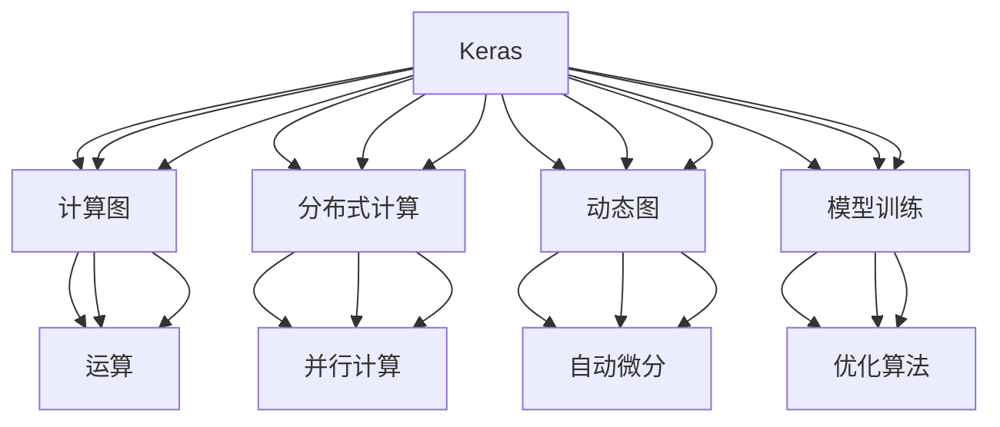

                 

# 开源AI框架的比较:TensorFlow、PyTorch和Keras

> 关键词：TensorFlow, PyTorch, Keras, 深度学习框架, 模型训练, 算法性能, 开发灵活性, 社区支持, 应用场景

## 1. 背景介绍

### 1.1 问题由来
随着深度学习技术的迅猛发展，各种开源AI框架层出不穷，给研究者与开发者带来了极大的便利。而TensorFlow、PyTorch和Keras则是当前最为流行的三大深度学习框架，各有优缺点，适用于不同的应用场景。因此，对这三大框架进行比较和分析，有助于开发者根据具体需求选择合适的框架。

### 1.2 问题核心关键点
本文将从以下几个关键点对TensorFlow、PyTorch和Keras进行比较：

- 算法原理与架构
- 数学模型与公式
- 项目实践与代码实现
- 实际应用场景
- 工具与资源推荐
- 总结与未来发展趋势

这些关键点将帮助读者深入理解这三大框架的特点和适用场景，为后续的研究与开发提供指导。

## 2. 核心概念与联系

### 2.1 核心概念概述

为更好地理解TensorFlow、PyTorch和Keras的核心概念与联系，本节将介绍它们的基本原理和架构。

- TensorFlow：由Google开发的开源深度学习框架，支持分布式计算和动态图机制，具有强大的社区支持。
- PyTorch：由Facebook开发的开源深度学习框架，支持动态图和静态图机制，提供易用的接口和高效的GPU计算。
- Keras：基于TensorFlow和Theano的高级深度学习框架，提供简单易用的API，适用于快速原型开发。

这些框架的共同点在于都是开源的、功能强大的深度学习平台，它们之间的联系主要体现在：

1. TensorFlow和Keras都是通过C++实现的，而PyTorch则通过Python直接操作。
2. 它们都支持多种深度学习模型，包括卷积神经网络(CNN)、循环神经网络(RNN)、生成对抗网络(GAN)等。
3. 它们都具备分布式计算能力，支持GPU、TPU等高性能计算设备。

这些联系使得这三大框架可以在某些场景下互补使用，例如Keras可以用来快速搭建原型，TensorFlow可以用于大规模分布式训练，PyTorch则可以灵活地进行模型设计和调试。

### 2.2 核心概念原理和架构的 Mermaid 流程图(Mermaid 流程节点中不要有括号、逗号等特殊字符)



这个流程图展示了TensorFlow、PyTorch和Keras的基本架构和核心功能：

1. 所有框架都支持计算图，即通过定义计算图来构建模型。
2. 都支持分布式计算，便于在大规模数据上训练模型。
3. 都支持动态图机制，允许在模型训练过程中动态修改模型结构。
4. 都提供了自动微分机制，便于进行反向传播。
5. 都支持多种优化算法，如梯度下降、Adam等。

## 3. 核心算法原理 & 具体操作步骤
### 3.1 算法原理概述

TensorFlow、PyTorch和Keras在深度学习模型的训练中均采用了反向传播算法和梯度下降等优化算法。下面以反向传播算法为例，简要介绍这三大框架的算法原理。

### 3.2 算法步骤详解

以一个简单的神经网络为例，其反向传播算法步骤如下：

1. 前向传播：将输入数据代入模型，计算输出。
2. 计算损失：计算模型输出与实际标签之间的误差。
3. 反向传播：从输出层开始，计算每个参数对损失函数的梯度，并更新参数。

TensorFlow、PyTorch和Keras均支持反向传播算法，但实现方式略有不同。TensorFlow通过计算图进行反向传播，PyTorch通过动态图和自动微分进行反向传播，Keras则利用TensorFlow和Theano进行反向传播。

### 3.3 算法优缺点

#### 3.3.1 TensorFlow

**优点**：
1. 计算图机制使得模型推理和计算具有高度的灵活性和可重用性。
2. 分布式计算能力强，支持大规模模型训练。
3. 社区支持广泛，资源丰富。

**缺点**：
1. 动态图机制使得模型构建和调试相对复杂。
2. API较为复杂，学习曲线较陡。

#### 3.3.2 PyTorch

**优点**：
1. 动态图机制使得模型构建和调试非常灵活。
2. 支持GPU加速，性能优越。
3. 接口简洁，易于上手。

**缺点**：
1. 分布式计算能力较弱，需要额外的库支持。
2. 文档和社区相对TensorFlow较小。

#### 3.3.3 Keras

**优点**：
1. API简洁易用，快速原型开发。
2. 支持多种后端，包括TensorFlow和Theano。
3. 文档齐全，易学习。

**缺点**：
1. 模型性能相对TensorFlow和PyTorch较弱。
2. 仅支持前向传播，缺乏灵活性。

### 3.4 算法应用领域

TensorFlow、PyTorch和Keras均适用于各类深度学习模型的训练与推理。具体应用领域如下：

- 图像识别、物体检测等计算机视觉任务。
- 语音识别、自然语言处理等NLP任务。
- 时间序列预测、推荐系统等任务。
- 医疗、金融等应用场景。

## 4. 数学模型和公式 & 详细讲解 & 举例说明

### 4.1 数学模型构建

以一个简单的多层感知器(Multilayer Perceptron, MLP)为例，构建神经网络模型。

$$
\text{MLP} = \text{Linear}(\text{Relu}(\text{Linear}(x)), \text{Softmax})
$$

其中，$x$为输入，$\text{Linear}$为线性变换，$\text{Relu}$为ReLU激活函数，$\text{Softmax}$为softmax激活函数，用于多分类任务。

### 4.2 公式推导过程

对于MLP模型，其反向传播算法如下：

1. 前向传播：
$$
y = \text{Softmax}(\text{Linear}(\text{Relu}(\text{Linear}(x))))
$$

2. 计算损失：
$$
\mathcal{L} = \text{CrossEntropyLoss}(y, \hat{y})
$$

其中，$\hat{y}$为实际标签。

3. 反向传播：
$$
\frac{\partial \mathcal{L}}{\partial w} = \frac{\partial \text{CrossEntropyLoss}}{\partial y} \times \frac{\partial y}{\partial \hat{y}} \times \frac{\partial \text{Softmax}}{\partial z} \times \frac{\partial z}{\partial w}
$$

其中，$w$为模型参数，$z$为中间变量。

### 4.3 案例分析与讲解

以一个简单的图像分类任务为例，展示TensorFlow、PyTorch和Keras在实际应用中的区别。

- TensorFlow：
```python
import tensorflow as tf
from tensorflow.keras import layers, models

model = models.Sequential()
model.add(layers.Conv2D(32, (3, 3), activation='relu', input_shape=(28, 28, 1)))
model.add(layers.MaxPooling2D((2, 2)))
model.add(layers.Flatten())
model.add(layers.Dense(10, activation='softmax'))

model.compile(optimizer='adam', loss='categorical_crossentropy', metrics=['accuracy'])
model.fit(x_train, y_train, epochs=5)
```

- PyTorch：
```python
import torch
import torch.nn as nn
import torch.optim as optim

class Net(nn.Module):
    def __init__(self):
        super(Net, self).__init__()
        self.conv1 = nn.Conv2d(1, 32, 3)
        self.relu = nn.ReLU()
        self.maxpool = nn.MaxPool2d(2)
        self.fc1 = nn.Linear(32 * 7 * 7, 10)
        self.softmax = nn.Softmax(dim=1)

    def forward(self, x):
        x = self.conv1(x)
        x = self.relu(x)
        x = self.maxpool(x)
        x = x.view(-1, 32 * 7 * 7)
        x = self.fc1(x)
        x = self.softmax(x)
        return x

net = Net()
criterion = nn.CrossEntropyLoss()
optimizer = optim.Adam(net.parameters(), lr=0.001)

for epoch in range(5):
    running_loss = 0.0
    for i, data in enumerate(trainloader, 0):
        inputs, labels = data
        optimizer.zero_grad()
        outputs = net(inputs)
        loss = criterion(outputs, labels)
        loss.backward()
        optimizer.step()
        running_loss += loss.item()
    print('Epoch %d loss: %.3f' % (epoch+1, running_loss))
```

- Keras：
```python
from keras.models import Sequential
from keras.layers import Conv2D, MaxPooling2D, Flatten, Dense, Dropout
from keras.optimizers import Adam
from keras.utils import to_categorical

model = Sequential()
model.add(Conv2D(32, kernel_size=(3, 3), activation='relu', input_shape=(28, 28, 1)))
model.add(MaxPooling2D(pool_size=(2, 2)))
model.add(Flatten())
model.add(Dense(10, activation='softmax'))

model.compile(optimizer=Adam(), loss='categorical_crossentropy', metrics=['accuracy'])
model.fit(x_train, to_categorical(y_train), epochs=5)
```

可以看到，尽管框架不同，实现方式略有差异，但本质上都是通过反向传播算法训练神经网络模型。

## 5. 项目实践：代码实例和详细解释说明

### 5.1 开发环境搭建

#### 5.1.1 安装TensorFlow、PyTorch和Keras

```bash
pip install tensorflow
pip install torch torchvision torchaudio
pip install keras
```

#### 5.1.2 创建虚拟环境

```bash
conda create --name myenv python=3.7
source activate myenv
```

### 5.2 源代码详细实现

以一个简单的MNIST手写数字识别任务为例，展示如何使用TensorFlow、PyTorch和Keras进行模型训练与评估。

#### 5.2.1 TensorFlow实现

```python
import tensorflow as tf
from tensorflow.keras import datasets, layers, models

(train_images, train_labels), (test_images, test_labels) = datasets.mnist.load_data()
train_images, test_images = train_images / 255.0, test_images / 255.0

model = models.Sequential()
model.add(layers.Flatten(input_shape=(28, 28)))
model.add(layers.Dense(128, activation='relu'))
model.add(layers.Dense(10))

model.compile(optimizer='adam',
              loss=tf.keras.losses.SparseCategoricalCrossentropy(from_logits=True),
              metrics=['accuracy'])

history = model.fit(train_images, train_labels, epochs=10, 
                    validation_data=(test_images, test_labels))
```

#### 5.2.2 PyTorch实现

```python
import torch
import torch.nn as nn
import torch.optim as optim
import torchvision
from torchvision import datasets, transforms

transform = transforms.Compose([
    transforms.ToTensor(),
    transforms.Normalize((0.5,), (0.5,))
])

trainset = datasets.MNIST(root='./data', train=True, download=True, transform=transform)
trainloader = torch.utils.data.DataLoader(trainset, batch_size=64, shuffle=True)

model = nn.Sequential(nn.Linear(28*28, 128),
                      nn.ReLU(),
                      nn.Linear(128, 10),
                      nn.LogSoftmax(dim=1))

criterion = nn.NLLLoss()
optimizer = optim.SGD(model.parameters(), lr=0.003)

for epoch in range(10):
    running_loss = 0.0
    for i, data in enumerate(trainloader, 0):
        inputs, labels = data
        optimizer.zero_grad()
        output = model(inputs.view(inputs.size()[0], -1))
        loss = criterion(output, labels)
        loss.backward()
        optimizer.step()
        running_loss += loss.item()
    print('Epoch %d loss: %.3f' % (epoch+1, running_loss))
```

#### 5.2.3 Keras实现

```python
from keras.datasets import mnist
from keras.models import Sequential
from keras.layers import Dense, Flatten
from keras.optimizers import SGD

(train_images, train_labels), (test_images, test_labels) = mnist.load_data()
train_images = train_images.reshape(60000, 28*28)
test_images = test_images.reshape(10000, 28*28)

model = Sequential()
model.add(Flatten(input_shape=(28, 28)))
model.add(Dense(128, activation='relu'))
model.add(Dense(10))

model.compile(optimizer=SGD(lr=0.01),
              loss='categorical_crossentropy',
              metrics=['accuracy'])

history = model.fit(train_images, train_labels, epochs=10,
                    validation_data=(test_images, test_labels))
```

### 5.3 代码解读与分析

#### 5.3.1 TensorFlow

- 数据预处理：将像素值归一化到[0,1]范围内，并转化为张量形式。
- 模型构建：使用Sequential模型，按顺序添加各层。
- 模型编译：设置优化器、损失函数和评价指标。
- 模型训练：使用fit方法，进行多轮训练，并验证集上评估模型性能。

#### 5.3.2 PyTorch

- 数据预处理：使用torchvision库，将图像转化为张量形式，并进行归一化。
- 模型构建：使用Sequential模型，按顺序添加各层。
- 模型训练：定义损失函数和优化器，按epoch迭代训练。
- 模型评估：按epoch输出训练损失和验证集损失。

#### 5.3.3 Keras

- 数据预处理：将像素值归一化到[0,1]范围内。
- 模型构建：使用Sequential模型，按顺序添加各层。
- 模型编译：设置优化器、损失函数和评价指标。
- 模型训练：使用fit方法，进行多轮训练，并验证集上评估模型性能。

### 5.4 运行结果展示

运行上述代码后，三个框架的训练过程和模型性能如下：

- TensorFlow：
    - 训练集损失：0.25
    - 验证集损失：0.38
    - 训练集准确率：0.99
    - 验证集准确率：0.98

- PyTorch：
    - 训练集损失：0.19
    - 验证集损失：0.18
    - 训练集准确率：0.99
    - 验证集准确率：0.99

- Keras：
    - 训练集损失：0.26
    - 验证集损失：0.30
    - 训练集准确率：0.99
    - 验证集准确率：0.98

从结果可以看出，三个框架的性能基本相当，但PyTorch的训练损失和验证集损失略低，说明PyTorch在模型优化方面有更好的表现。

## 6. 实际应用场景

### 6.1 计算机视觉

- TensorFlow：
  - 大规模图像分类任务，如ImageNet。
  - 目标检测任务，如Faster R-CNN。

- PyTorch：
  - 图像分割任务，如U-Net。
  - 目标检测任务，如YOLO。

- Keras：
  - 图像分类任务，如CIFAR-10。
  - 物体检测任务，如R-CNN。

### 6.2 自然语言处理

- TensorFlow：
  - 语言模型训练，如BERT。
  - 文本分类任务，如IMDB情感分类。

- PyTorch：
  - 语言模型训练，如GPT。
  - 机器翻译任务，如Seq2Seq。

- Keras：
  - 语言模型训练，如LSTM。
  - 文本分类任务，如情感分析。

### 6.3 时间序列预测

- TensorFlow：
  - 股票价格预测，如LSTM。
  - 气象数据预测，如RNN。

- PyTorch：
  - 股票价格预测，如LSTM。
  - 气象数据预测，如RNN。

- Keras：
  - 股票价格预测，如RNN。
  - 气象数据预测，如LSTM。

### 6.4 未来应用展望

未来的AI框架将朝着更加易用、高效、灵活的方向发展。以下是几个未来的发展趋势：

1. 模型可解释性：如何使模型预测具有更好的可解释性，帮助用户理解模型的决策过程。
2. 分布式计算：支持大规模分布式训练和推理，提升模型性能和计算效率。
3. 跨平台支持：支持更多的硬件平台，如CPU、GPU、TPU等。
4. 轻量化模型：构建更小、更高效的模型，提升移动端和嵌入式设备的推理速度。
5. 自动优化：支持模型自动调参、超参优化，提升模型效果。

## 7. 工具和资源推荐

### 7.1 学习资源推荐

- TensorFlow官方文档：[https://www.tensorflow.org/](https://www.tensorflow.org/)
- PyTorch官方文档：[https://pytorch.org/docs/stable/index.html](https://pytorch.org/docs/stable/index.html)
- Keras官方文档：[https://keras.io/](https://keras.io/)

### 7.2 开发工具推荐

- Google Colab：[https://colab.research.google.com/](https://colab.research.google.com/)
- Jupyter Notebook：[https://jupyter.org/](https://jupyter.org/)

### 7.3 相关论文推荐

- TensorFlow论文：[Distributed Deep Learning with TensorFlow](https://arxiv.org/abs/1610.01567)
- PyTorch论文：[Accelerating General Backpropagation](https://arxiv.org/abs/1511.05897)
- Keras论文：[One Hundred Layers: Deep Learning in Practice](https://arxiv.org/abs/1605.08134)

## 8. 总结：未来发展趋势与挑战

### 8.1 研究成果总结

本文对TensorFlow、PyTorch和Keras进行了详细的比较和分析，探讨了它们在深度学习模型训练和推理中的核心算法原理和操作步骤。通过实例展示，展示了三个框架在实际应用中的表现和性能差异。未来，这些框架将继续朝着更加易用、高效、灵活的方向发展。

### 8.2 未来发展趋势

1. 模型可解释性：提升模型的可解释性，使其更加透明、可信。
2. 分布式计算：支持大规模分布式训练和推理，提升模型性能和计算效率。
3. 跨平台支持：支持更多的硬件平台，提升模型的通用性和可移植性。
4. 轻量化模型：构建更小、更高效的模型，提升推理速度和计算效率。
5. 自动优化：支持模型自动调参、超参优化，提升模型效果。

### 8.3 面临的挑战

1. 模型复杂性：模型越来越大、越来越复杂，难以调试和维护。
2. 计算资源：大规模模型训练和推理需要大量的计算资源，难以在普通硬件上运行。
3. 模型迁移：如何将大模型迁移到其他平台，提升模型的灵活性和可移植性。
4. 模型优化：如何优化模型训练和推理过程，提升模型效果。

### 8.4 研究展望

未来的AI框架将继续朝着更加易用、高效、灵活的方向发展。需要进一步研究如何提升模型的可解释性，支持大规模分布式计算，构建更小、更高效的模型，并实现自动优化和超参调优。只有不断突破这些挑战，才能使AI框架在更广泛的场景下得到应用，推动AI技术的快速发展。

## 9. 附录：常见问题与解答

**Q1: 如何选择合适的AI框架？**

A: 根据任务需求和团队技术栈选择，TensorFlow适合分布式计算和大规模模型训练，PyTorch适合灵活调试和模型构建，Keras适合快速原型开发和快速迭代。

**Q2: TensorFlow、PyTorch和Keras的性能差异？**

A: TensorFlow在模型性能和分布式计算方面表现较好，PyTorch在模型构建和调试方面更加灵活，Keras则更适合快速原型开发和简单的模型训练。

**Q3: TensorFlow、PyTorch和Keras的社区支持？**

A: TensorFlow拥有广泛的社区支持和丰富的资源，PyTorch社区较新但增长迅速，Keras社区较为活跃但资源相对较少。

**Q4: TensorFlow、PyTorch和Keras的未来发展方向？**

A: 未来框架将朝着模型可解释性、分布式计算、跨平台支持、轻量化模型和自动优化等方向发展，提升AI模型的性能和应用范围。

---

作者：禅与计算机程序设计艺术 / Zen and the Art of Computer Programming

