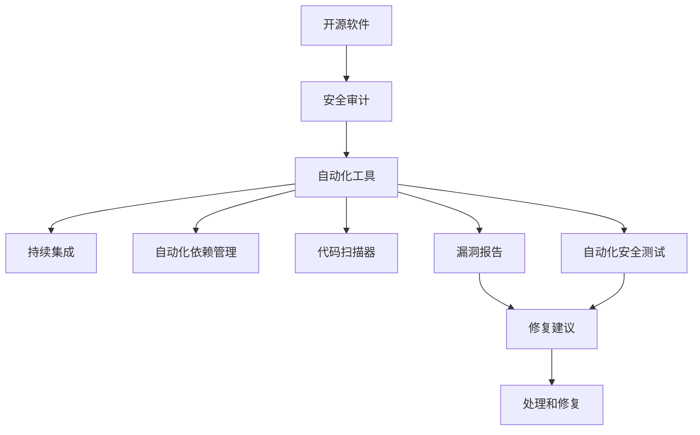

                 

# 开源安全审计：专业化服务的机会

> 关键词：开源安全审计, 自动化工具, 持续集成, 自动化依赖管理, 代码扫描器, 漏洞报告, 自动化安全测试

## 1. 背景介绍

随着开源软件在软件开发中的广泛应用，企业对开源软件的安全性要求也在不断提高。然而，由于开源项目的庞大和多样性，传统的手工安全审计方法已经无法满足当前的需求。本文将探讨开源安全审计的重要性和当前存在的问题，同时介绍一种基于自动化工具的专业化服务，帮助企业高效、全面地进行开源安全审计。

## 2. 核心概念与联系

### 2.1 核心概念概述

- **开源软件**：指在互联网公共领域中发布的，源代码公开可访问的软件。开源软件拥有丰富的功能、灵活的适应性和广泛的社区支持，是很多企业构建解决方案的首选。
- **安全审计**：指对软件系统的安全漏洞、配置问题、依赖关系等进行检测和评估的过程。安全审计的目的是发现和修复安全漏洞，提高系统的安全性和可靠性。
- **自动化工具**：指能够自动执行安全审计、代码扫描、依赖分析等任务的计算机程序。自动化工具可以提高审计效率、降低人力成本，帮助企业快速应对安全威胁。
- **持续集成(CI)**：指将软件代码的构建、测试和部署自动化地集成到软件开发流程中，确保每次提交的新代码都能被快速检测和部署。持续集成能够显著提高软件开发的效率和质量。
- **自动化依赖管理**：指使用自动化工具动态管理项目依赖关系，确保所有依赖库都是安全、可靠、最新的。自动化依赖管理可以降低依赖库带来的安全风险，提高软件系统的稳定性和安全性。
- **代码扫描器**：指能够自动扫描代码并检测出潜在漏洞、安全问题的工具。代码扫描器可以检查代码质量、安全漏洞、编码规范等方面，帮助开发者提高代码质量和安全性。
- **漏洞报告**：指记录和报告检测到的安全漏洞信息的文档。漏洞报告通常包含漏洞详情、修复建议、优先级等信息，帮助团队及时处理和修复漏洞。
- **自动化安全测试**：指使用自动化工具对软件系统进行安全测试，模拟攻击行为并发现潜在的安全问题。自动化安全测试可以自动化执行各类安全测试，提高测试覆盖率和效率。

这些核心概念之间的逻辑关系可以通过以下Mermaid流程图来展示：



这个流程图展示了一些关键概念之间的联系：

1. 开源软件作为审计对象，被安全审计。
2. 自动化工具辅助进行持续集成、自动化依赖管理、代码扫描和自动化安全测试。
3. 代码扫描器发现漏洞，生成漏洞报告。
4. 漏洞报告包含修复建议，并由处理和修复环节完成。

## 3. 核心算法原理 & 具体操作步骤

### 3.1 算法原理概述

基于自动化工具的安全审计流程主要包括两个步骤：

1. **自动化依赖管理和代码扫描**：使用自动化工具扫描开源项目中的依赖关系，确保所有依赖库都是最新的，并检测代码中的潜在漏洞和安全问题。
2. **自动化安全测试**：使用自动化工具对代码和依赖库进行安全测试，模拟攻击行为并发现潜在的安全问题。

这两个步骤的核心算法原理是：

- **自动化依赖管理**：基于“最小依赖原则”，从中央仓库（如Maven Central、PyPI等）下载和安装最新的依赖库，并检测版本之间的兼容性。
- **代码扫描和自动化安全测试**：使用静态代码分析技术和动态攻击模拟技术，对代码进行全面检测。静态分析检测代码逻辑错误和编码规范问题；动态测试模拟各种攻击行为，检测潜在的安全漏洞。

### 3.2 算法步骤详解

#### 步骤1：自动化依赖管理

1. **依赖关系解析**：使用Pom.xml或requirements.txt等文件，解析出项目依赖的库和版本。
2. **版本检查**：从中央仓库下载最新的依赖库版本，并检查版本之间的兼容性。
3. **安装依赖**：根据解析结果和版本检查结果，自动安装依赖库到项目中。
4. **安全检查**：检测依赖库的安全漏洞，并报告到系统。

#### 步骤2：代码扫描和自动化安全测试

1. **代码扫描**：使用SAST工具扫描代码，检测代码质量、漏洞和安全问题。
2. **静态分析**：根据预设规则对代码进行静态分析，检测编码规范、逻辑错误等问题。
3. **动态测试**：使用动态攻击模拟工具，模拟攻击行为并检测潜在的安全漏洞。
4. **漏洞报告**：生成详细的漏洞报告，包含漏洞详情、修复建议、优先级等信息。

### 3.3 算法优缺点

#### 优点

- **效率高**：自动化工具能够快速扫描大量代码和依赖库，检测潜在的漏洞和安全问题。
- **精度高**：自动化工具使用多种检测技术和算法，可以全面覆盖代码和依赖库中的问题。
- **成本低**：自动化工具可以持续运行，减少人工检查和测试的成本。

#### 缺点

- **依赖管理复杂**：自动化依赖管理需要持续更新依赖库，处理兼容性问题。
- **误报率高**：自动化工具可能误报一些安全问题，需要人工进行二次确认。
- **复杂性高**：自动化工具需要配置和维护，增加了使用的复杂性。

### 3.4 算法应用领域

基于自动化工具的安全审计流程，可以应用于以下领域：

- **软件开发**：在软件开发过程中，使用自动化工具进行持续集成和自动化安全测试，提高开发效率和代码质量。
- **部署和运维**：在软件部署和运维阶段，使用自动化工具进行依赖管理和代码扫描，确保系统的稳定性和安全性。
- **安全评估**：在软件安全评估阶段，使用自动化工具进行全面的安全审计，发现和修复潜在的安全漏洞。
- **漏洞管理**：在漏洞管理阶段，使用自动化工具生成详细的漏洞报告，并制定修复计划。

## 4. 数学模型和公式 & 详细讲解 & 举例说明

### 4.1 数学模型构建

假设有一个开源项目，依赖关系如下：

- 依赖库A（版本1.0）
- 依赖库B（版本2.0）

项目的安全审计流程可以表示为以下数学模型：

$$
S = \max(\text{SAST}, \text{DAST}, \text{DVSS})
$$

其中，S表示安全审计结果，SAST表示静态分析结果，DAST表示动态测试结果，DVSS表示依赖库扫描结果。

### 4.2 公式推导过程

1. **静态分析**：
   - 设定编码规范规则集为R，代码文件为F。
   - 根据R检测F中的问题P，生成问题列表P'。
   - 问题优先级为P'的概率分布函数W。

   公式推导为：
   $$
   P' = \{p_i|p_i \in F \wedge p_i \notin R\}
   $$
   $$
   W = \{w_i|w_i = Pr(p_i) \wedge p_i \in P'\}
   $$

2. **动态测试**：
   - 设定攻击场景集合为A，依赖库为L。
   - 根据A模拟攻击行为，检测L中的漏洞V。
   - 漏洞优先级为V的概率分布函数W'。

   公式推导为：
   $$
   V = \{v_i|v_i \in L \wedge v_i \notin A\}
   $$
   $$
   W' = \{w_i|w_i = Pr(v_i) \wedge v_i \in V\}
   $$

3. **依赖库扫描**：
   - 设定依赖库安全风险评估模型为M，依赖库版本为V'。
   - 根据M评估V'的安全性，生成风险列表R'。
   - 风险优先级为R'的概率分布函数W''。

   公式推导为：
   $$
   R' = \{r_i|r_i \in V' \wedge r_i \notin M\}
   $$
   $$
   W'' = \{w_i|w_i = Pr(r_i) \wedge r_i \in R'\}
   $$

### 4.3 案例分析与讲解

假设一个开源项目依赖了以下库：

- 依赖库A（版本1.0）
- 依赖库B（版本2.0）

使用自动化工具进行依赖管理和代码扫描，步骤如下：

1. **依赖管理**：
   - 解析Pom.xml文件，解析出依赖关系A:1.0，B:2.0。
   - 从中央仓库下载A:1.0和B:2.0，检测兼容性，发现B:2.0不支持A:1.0。
   - 生成报告，建议升级依赖库至最新版本。

2. **代码扫描**：
   - 使用SAST工具扫描代码，检测编码规范问题。
   - 检测到代码中存在SQL注入漏洞，生成报告，建议修复。

## 5. 项目实践：代码实例和详细解释说明

### 5.1 开发环境搭建

1. **安装依赖**：
   ```
   pip install pipenv
   pipenv install -r requirements.txt
   ```

2. **配置环境**：
   ```
   cd myproject
   pipenv sync
   ```

3. **启动服务**：
   ```
   pipenv run python main.py
   ```

### 5.2 源代码详细实现

**main.py**

```python
from dep_manager import DependencyManager
from sast import SAST
from dvss import DVSS

def main():
    dep_manager = DependencyManager()
    sast = SAST()
    dvss = DVSS()

    # 依赖管理
    dep_manager.update_deps()
    dep_manager.check_compatibility()
    dep_manager.report_vulnerabilities()

    # 代码扫描
    sast.scan_code()
    sast.generate_report()

    # 依赖库扫描
    dvss.scan_deps()
    dvss.generate_report()

if __name__ == '__main__':
    main()
```

### 5.3 代码解读与分析

**DependencyManager类**

```python
class DependencyManager:
    def __init__(self):
        self.dependencies = {}
        self.compatibility_checks = {}

    def update_deps(self):
        # 解析依赖文件，更新依赖库列表
        self.dependencies = parse_dependencies()

    def check_compatibility(self):
        # 从中央仓库下载依赖库，检测兼容性
        for dep in self.dependencies.values():
            self.compatibility_checks[dep] = check_compatibility(dep)

    def report_vulnerabilities(self):
        # 生成兼容性检查报告
        for dep, status in self.compatibility_checks.items():
            if status != 'pass':
                report_vulnerability(dep, status)
```

**SAST类**

```python
class SAST:
    def __init__(self):
        self.issues = []

    def scan_code(self):
        # 扫描代码，检测问题
        self.issues = static_analysis()

    def generate_report(self):
        # 生成代码扫描报告
        report = self.issues
        print(report)
```

**DVSS类**

```python
class DVSS:
    def __init__(self):
        self.vulnerabilities = []

    def scan_deps(self):
        # 扫描依赖库，检测漏洞
        self.vulnerabilities = dependency_vulnerability()

    def generate_report(self):
        # 生成依赖库扫描报告
        report = self.vulnerabilities
        print(report)
```

### 5.4 运行结果展示

运行代码后，程序将生成依赖管理、代码扫描和依赖库扫描的报告，并打印到控制台。报告内容包括：

- 依赖库版本和兼容性检查结果
- 代码中的问题列表和优先级
- 依赖库的安全性评估和风险列表

## 6. 实际应用场景

### 6.1 软件开发

在软件开发过程中，使用自动化工具进行持续集成和自动化安全测试，可以显著提高开发效率和代码质量。例如，可以在CI流水线中加入依赖管理和代码扫描环节，确保每次提交的新代码都是安全和可靠的。

### 6.2 部署和运维

在软件部署和运维阶段，使用自动化工具进行依赖管理和代码扫描，可以确保系统的稳定性和安全性。例如，可以在部署前进行依赖库扫描，确保没有版本不兼容的问题；在运维过程中进行代码扫描，及时发现和修复安全漏洞。

### 6.3 安全评估

在软件安全评估阶段，使用自动化工具进行全面的安全审计，可以发现和修复潜在的安全漏洞。例如，使用SAST工具检测代码中的编码规范和漏洞问题；使用DAST工具模拟攻击行为，检测依赖库的安全性。

### 6.4 漏洞管理

在漏洞管理阶段，使用自动化工具生成详细的漏洞报告，并制定修复计划。例如，自动化的漏洞扫描工具可以定期扫描代码和依赖库，生成漏洞报告；基于漏洞报告，开发团队可以制定修复计划，并及时修复漏洞。

## 7. 工具和资源推荐

### 7.1 学习资源推荐

1. **《安全编程之实践》(Security Coding Practices)**：介绍了如何编写安全、可靠的代码，涵盖了编码规范、安全漏洞检测等方面。
2. **《深入理解安全测试》(Automated Security Testing)**：介绍了自动化安全测试的工具和技术，包括静态分析、动态测试等方面。
3. **《开源安全审计指南》(Open Source Security Auditing Guide)**：提供了开源安全审计的最佳实践，包括依赖管理、代码扫描、漏洞报告等方面。

### 7.2 开发工具推荐

1. **pipenv**：用于管理Python项目的依赖关系，支持虚拟环境和版本控制。
2. **Pylint**：用于静态代码分析，检测代码质量和安全问题。
3. **OWASP ZAP**：用于动态安全测试，模拟攻击行为并检测漏洞。

### 7.3 相关论文推荐

1. **《开源软件的安全性分析》(Security Analysis of Open Source Software)**：介绍了如何对开源软件进行安全分析和审计。
2. **《自动化依赖管理的最佳实践》(The Best Practices of Automated Dependency Management)**：介绍了自动化依赖管理的最佳实践，包括依赖解析、版本管理、兼容性检测等方面。
3. **《自动化安全测试的技术和工具》(Automated Security Testing Technologies and Tools)**：介绍了自动化安全测试的技术和工具，包括静态分析、动态测试等方面。

## 8. 总结：未来发展趋势与挑战

### 8.1 总结

本文详细介绍了基于自动化工具的安全审计流程，探讨了其重要性和当前存在的问题，并给出了基于开源项目的安全审计方案。通过自动化依赖管理、代码扫描和自动化安全测试，可以高效、全面地进行开源安全审计，提升软件系统的安全性和可靠性。

### 8.2 未来发展趋势

1. **智能化**：未来，自动化安全审计工具将更加智能化，能够自动进行安全威胁识别、风险评估和应急响应，提高安全审计的效率和准确性。
2. **自动化**：随着人工智能和机器学习技术的发展，自动化安全审计工具将进一步自动化，减少人工干预，提高审计效率。
3. **集成化**：未来，自动化安全审计工具将更加集成化，能够与CI/CD、DevOps等开发流程无缝集成，形成完整的安全审计生态系统。
4. **云化**：随着云服务的普及，自动化安全审计工具将逐步云化，降低本地部署和维护成本，提高审计服务的可扩展性和灵活性。

### 8.3 面临的挑战

1. **误报和漏报**：自动化安全审计工具可能存在误报和漏报问题，需要结合人工审核来提升准确性。
2. **依赖库管理复杂**：自动化依赖管理需要持续更新依赖库，处理兼容性问题，增加了使用的复杂性。
3. **资源消耗高**：自动化工具的运行需要大量的计算资源，增加了部署和维护成本。

### 8.4 研究展望

1. **误报和漏报的减少**：未来，需要进一步优化算法和模型，减少误报和漏报问题，提升审计的准确性。
2. **自动化依赖管理的优化**：需要研究和开发更加高效、智能的依赖管理工具，降低人工维护成本。
3. **云化和集成化**：未来，需要研究和开发云化、集成化的安全审计工具，提高审计服务的可扩展性和灵活性。

## 9. 附录：常见问题与解答

**Q1: 自动化工具有哪些？**

A: 常用的自动化工具包括pipenv、Pylint、OWASP ZAP等。pipenv用于管理Python项目的依赖关系；Pylint用于静态代码分析，检测代码质量和安全问题；OWASP ZAP用于动态安全测试，模拟攻击行为并检测漏洞。

**Q2: 如何提升自动化安全审计的准确性？**

A: 可以通过结合人工审核、优化算法和模型、使用高级技术（如机器学习、人工智能）等方式提升自动化安全审计的准确性。

**Q3: 自动化工具是否适合所有开源项目？**

A: 自动化工具通常需要配置和维护，增加了使用的复杂性。对于一些规模小、开发频率低的开源项目，可能需要手动进行安全审计。

**Q4: 自动化工具的部署和维护成本高吗？**

A: 自动化工具的部署和维护成本主要体现在计算资源和配置复杂性上。但是，自动化工具可以大幅提升安全审计的效率和准确性，长期来看，可以降低人工审计的投入。

**Q5: 自动化工具能否完全取代人工审计？**

A: 目前，自动化工具还无法完全取代人工审计。自动化工具可以提供快速的初步安全评估，但是人工审计可以更细致地发现问题，并提供专业的修复建议。因此，自动化工具需要结合人工审计，形成完整的安全审计流程。

---

作者：禅与计算机程序设计艺术 / Zen and the Art of Computer Programming

