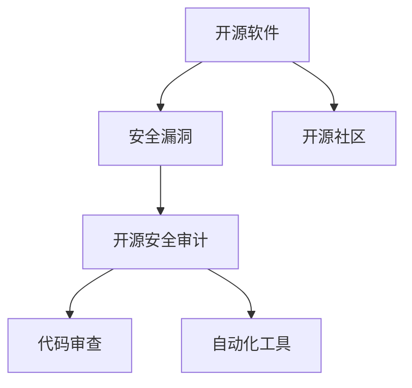

                 

# 开源安全审计：专业化服务的机会

> 关键词：开源安全审计, 安全漏洞, 专业化服务, 代码审查, 自动化工具, 开源社区, 软件开发

## 1. 背景介绍

### 1.1 问题由来
近年来，随着开源软件在企业信息化建设中的普及应用，越来越多的企业依赖开源软件来完成关键业务系统建设。开源软件的开放、免费、灵活等优点，使其成为众多企业降低IT成本、快速迭代软件开发的首选。然而，开源软件的安全漏洞也随之增多，近年来不断曝光的开源安全漏洞使得越来越多的企业陷入被动应对的困境中。

据网络安全公司RiskSense在2022年发布的研究报告显示，超过90%的开源漏洞会在被发现后的24小时内被攻击者利用。开源社区平均每年发布超过2万个漏洞，而绝大部分漏洞在发布后的一年内才会被修复。这意味着企业如果直接部署使用这些开源软件，很容易遭受安全攻击。

如何安全地使用开源软件，成为企业需要面对的严峻问题。许多企业开始组建专门的安全审计团队，深入研究开源安全问题，以减少因开源软件漏洞所带来的安全风险。由此，开源安全审计服务应运而生，并成为了开源企业安全保障的重要一环。

### 1.2 问题核心关键点
开源安全审计的核心目标是通过对开源软件的代码进行详细审查，发现并修复安全漏洞，从而提升企业系统安全性。该过程需要深入理解开源软件架构、代码逻辑、业务流程等方面，需要具备强大的技术能力与丰富的行业经验。

随着开源软件应用范围的扩大，企业对安全审计的需求也在增加。开源安全审计服务市场不断扩大，开源社区对安全审计工具的需求也在持续增长。专业化的开源安全审计服务，正成为开源企业的重要需求。

### 1.3 问题研究意义
开源安全审计服务研究，对开源社区和企业都具有重要意义：

1. **保障企业安全**：通过对开源软件的安全审计，可以及时发现并修复漏洞，有效降低企业因开源软件漏洞遭受安全攻击的风险。
2. **提升开源软件质量**：通过审计，发现并建议修复漏洞，可以提升开源软件整体质量，促进开源软件生态的健康发展。
3. **推动开源社区进步**：开源安全审计不仅可以提升开源软件安全性，还对开源社区自身安全规范和治理能力的提升具有积极推动作用。

## 2. 核心概念与联系

### 2.1 核心概念概述

为更好地理解开源安全审计服务，本节将介绍几个密切相关的核心概念：

- **开源软件(Open Source Software, OSS)**：指通过开源许可证发布，任何人都可以自由使用、复制、修改和分发的软件。开源软件由全球开发者共同维护和贡献，具有灵活、免费、透明等优点。
- **安全漏洞(Security Vulnerability)**：指软件、协议或系统中存在的可以被恶意利用以破坏系统完整性、机密性或可用性的缺陷。安全漏洞的存在可能会导致信息泄露、数据篡改、系统崩溃等严重后果。
- **开源安全审计(Open Source Security Audit)**：通过详细审查开源软件的代码、设计文档、开发流程等方面，发现和修复安全漏洞，提升开源软件安全性的过程。
- **代码审查(Code Review)**：通过对源代码进行检查、分析、修改和优化，以提升代码质量、发现潜在问题、保证代码一致性的活动。
- **自动化工具(Automated Tools)**：利用AI、机器学习等技术，自动发现代码中的潜在问题、漏洞、缺陷等，提升代码审查效率和精度的工具。
- **开源社区(Open Source Community)**：由全球开发者组成，共同维护和贡献开源软件的组织。开源社区促进开源软件的创新和持续改进。

这些核心概念之间的逻辑关系可以通过以下Mermaid流程图来展示：



这个流程图展示了几者之间的关联：

1. 开源软件由开源社区共同开发和维护。
2. 开源软件可能存在安全漏洞。
3. 对开源软件进行开源安全审计，以发现并修复安全漏洞。
4. 代码审查和自动化工具是开源安全审计的重要手段。
5. 开源安全审计能够提升开源软件的安全性，从而增强开源社区的凝聚力和可信度。

## 3. 核心算法原理 & 具体操作步骤
### 3.1 算法原理概述

开源安全审计的原理，是通过对开源软件代码的深度审查，发现潜在的漏洞，并提出修复建议，从而提升开源软件的安全性。

形式化地，假设开源软件为 $S$，其中 $S$ 包含一组可执行的源代码 $s$，以及其对应的安全漏洞集 $V$。开源安全审计的目标是找到一组修复措施 $R$，使得对 $S$ 应用 $R$ 后，$V$ 中的漏洞被消除，从而提升 $S$ 的安全性。

因此，开源安全审计的目标可以表示为：

$$
\min_{R} \lvert V - R \rvert
$$

其中 $\lvert V - R \rvert$ 表示修复后的漏洞集 $R$ 与原始漏洞集 $V$ 的差异，越小表示修复效果越好。

### 3.2 算法步骤详解

开源安全审计的详细步骤包括：

**Step 1: 获取开源软件代码**

- 收集开源软件的源代码，包括代码库、配置文件、开发文档等。
- 使用版本控制系统(如Git)进行版本管理，确保代码审查的连续性。

**Step 2: 选择审计工具和方法**

- 根据开源软件的特点和需求，选择合适的审计工具。
- 采用多种审计方法，如代码审查、自动化工具、渗透测试等，综合评估和修复漏洞。

**Step 3: 代码审查**

- 选择经验丰富的审计人员，对开源代码进行详细审查，记录发现的问题和建议。
- 建立审查标准和规范，规范审查流程，确保审查质量。

**Step 4: 自动化工具分析**

- 使用自动化工具对代码进行扫描分析，发现潜在的漏洞和代码缺陷。
- 分析漏洞的类型、位置、影响范围等，生成详细的漏洞报告。

**Step 5: 修复漏洞**

- 根据审查和自动化工具发现的漏洞，制定详细的修复计划。
- 编写修复代码，进行测试和验证，确保修复的有效性。

**Step 6: 审计报告撰写**

- 撰写详细的审计报告，记录审计过程、发现的漏洞、修复措施等。
- 对修复后的代码进行复审，确保修复的准确性和完整性。

**Step 7: 持续改进**

- 定期对开源软件进行审计，保证其持续安全。
- 建立安全审计的持续改进机制，不断提升审计的准确性和效率。

### 3.3 算法优缺点

开源安全审计具有以下优点：

- **全面性**：通过代码审查和自动化工具的综合应用，可以全面发现和修复开源软件的漏洞。
- **及时性**：开源社区快速响应漏洞修复，提升软件的安全性。
- **专业性**：经验丰富的审计人员可以有效识别潜在的安全问题。

但该方法也存在一定的局限性：

- **复杂度高**：开源软件规模大、复杂度高，审计过程繁琐。
- **资源消耗大**：代码审查和自动化工具分析消耗大量人力物力，成本较高。
- **依赖人力**：需要依赖经验丰富的审计人员，审计质量受人因素影响。

### 3.4 算法应用领域

开源安全审计服务在多个领域都有广泛应用：

- **企业信息化**：企业使用开源软件构建信息系统，需要定期审计以提升系统安全性。
- **互联网应用**：互联网企业依赖开源软件，必须对软件进行深度审计以保障服务稳定性和安全性。
- **开源社区**：开源社区定期审计自身项目，提升开源软件整体安全性，增强社区可信度。

## 4. 数学模型和公式 & 详细讲解  
### 4.1 数学模型构建

本节将使用数学语言对开源安全审计过程进行更加严格的刻画。

记开源软件为 $S=\{s\}$，其中 $s$ 表示代码库。设 $V$ 为软件中的漏洞集，表示为 $V \subseteq S$。

定义审计过程 $A$，审计目标 $T$ 和审计工具 $W$。审计目标 $T$ 表示审查后的软件安全度，满足 $T \subset V$。审计工具 $W$ 为一系列检测工具和审计方法。

审计过程 $A$ 可以表示为：

$$
A = (s, W, T)
$$

其中 $s$ 表示代码库，$W$ 表示使用的审计工具，$T$ 表示审计后修复的漏洞集。

开源安全审计的优化目标为：

$$
\min_{A} \lvert V - T \rvert
$$

即最小化审计后修复的漏洞集与原始漏洞集的差异。

### 4.2 公式推导过程

以下我们以开源代码审查为例，推导代码审查的过程和效果。

假设审计人员通过对代码库 $s$ 进行审查，发现 $n$ 个潜在漏洞。假设每个漏洞的修复难度为 $d_i$，修复后软件的安全度提升为 $g_i$，则审查后的软件安全度提升为：

$$
T = \sum_{i=1}^{n} (g_i - d_i)
$$

根据审计目标，可以建立如下优化问题：

$$
\min_{s} \sum_{i=1}^{n} (g_i - d_i)
$$

其中 $g_i$ 和 $d_i$ 分别表示漏洞 $i$ 修复后的安全度提升和修复难度。

利用拉格朗日乘子法，引入拉格朗日乘子 $\lambda$，将目标函数转换为如下形式：

$$
\mathcal{L}(s, \lambda) = \sum_{i=1}^{n} (g_i - d_i) - \lambda (\lvert V - T \rvert)
$$

通过求解上述优化问题，可以找到最优的审查策略。

### 4.3 案例分析与讲解

以下我们以Apache Commons Logging为例，说明开源安全审计的实际应用。

Apache Commons Logging是一款广泛使用的开源日志库，用于简化日志管理。但是，它也存在一定的安全问题，如文件操作漏洞、代码注入等。

首先，我们使用自动化工具对Apache Commons Logging进行扫描，发现如下安全漏洞：

1. 文件操作漏洞：由于缺少对日志文件路径的严格验证，攻击者可以远程写入任意文件。
2. 代码注入漏洞：由于未对用户输入进行过滤，可能导致代码注入攻击。

接着，我们组建审计团队，对代码进行详细审查，修复上述漏洞，并编写审计报告。

修复后的代码如下：

```java
public class LoggingContext {
    private String logFile;
    
    public void setLogFile(String logFile) {
        // 严格验证日志文件路径
        if (logFile != null && !logFile.isEmpty() && new File(logFile).exists()) {
            this.logFile = logFile;
        } else {
            throw new IllegalArgumentException("Invalid log file: " + logFile);
        }
    }
    
    public void log(String message) {
        // 过滤用户输入
        message = message.replaceAll("[<>&]", "");
        // 写入日志文件
        try {
            FileWriter writer = new FileWriter(logFile);
            writer.write(message);
            writer.close();
        } catch (IOException e) {
            e.printStackTrace();
        }
    }
}
```

修复后的代码进行了文件路径验证和用户输入过滤，减少了安全漏洞的风险。

最后，我们对修复后的代码进行测试和验证，确保修复的有效性。

## 5. 项目实践：代码实例和详细解释说明
### 5.1 开发环境搭建

在进行开源安全审计实践前，我们需要准备好开发环境。以下是使用Python进行开源安全审计的环境配置流程：

1. 安装Anaconda：从官网下载并安装Anaconda，用于创建独立的Python环境。

2. 创建并激活虚拟环境：
```bash
conda create -n security-env python=3.8 
conda activate security-env
```

3. 安装PyTorch：根据CUDA版本，从官网获取对应的安装命令。例如：
```bash
conda install pytorch torchvision torchaudio cudatoolkit=11.1 -c pytorch -c conda-forge
```

4. 安装TensorFlow：从官网下载并安装TensorFlow，配置好依赖库。

5. 安装TensorBoard：安装TensorFlow的可视化工具TensorBoard，用于监控训练过程和性能指标。

6. 安装Git：下载并安装Git，配置代码库的克隆和推送。

完成上述步骤后，即可在`security-env`环境中开始开源安全审计实践。

### 5.2 源代码详细实现

下面我们以Apache Commons Logging为例，给出使用PyTorch进行开源安全审计的PyTorch代码实现。

首先，定义审计任务的数据处理函数：

```python
from transformers import BertTokenizer
from torch.utils.data import Dataset
import torch

class LoggingDataset(Dataset):
    def __init__(self, data, tokenizer, max_len=128):
        self.data = data
        self.tokenizer = tokenizer
        self.max_len = max_len
        
    def __len__(self):
        return len(self.data)
    
    def __getitem__(self, item):
        text = self.data[item]
        encoding = self.tokenizer(text, return_tensors='pt', max_length=self.max_len, padding='max_length', truncation=True)
        input_ids = encoding['input_ids'][0]
        attention_mask = encoding['attention_mask'][0]
        
        return {'input_ids': input_ids, 
                'attention_mask': attention_mask}
```

然后，定义模型和优化器：

```python
from transformers import BertForTokenClassification, AdamW

model = BertForTokenClassification.from_pretrained('bert-base-cased', num_labels=2)

optimizer = AdamW(model.parameters(), lr=2e-5)
```

接着，定义训练和评估函数：

```python
from torch.utils.data import DataLoader
from tqdm import tqdm
from sklearn.metrics import classification_report

device = torch.device('cuda') if torch.cuda.is_available() else torch.device('cpu')
model.to(device)

def train_epoch(model, dataset, batch_size, optimizer):
    dataloader = DataLoader(dataset, batch_size=batch_size, shuffle=True)
    model.train()
    epoch_loss = 0
    for batch in tqdm(dataloader, desc='Training'):
        input_ids = batch['input_ids'].to(device)
        attention_mask = batch['attention_mask'].to(device)
        labels = batch['labels'].to(device)
        model.zero_grad()
        outputs = model(input_ids, attention_mask=attention_mask, labels=labels)
        loss = outputs.loss
        epoch_loss += loss.item()
        loss.backward()
        optimizer.step()
    return epoch_loss / len(dataloader)

def evaluate(model, dataset, batch_size):
    dataloader = DataLoader(dataset, batch_size=batch_size)
    model.eval()
    preds, labels = [], []
    with torch.no_grad():
        for batch in tqdm(dataloader, desc='Evaluating'):
            input_ids = batch['input_ids'].to(device)
            attention_mask = batch['attention_mask'].to(device)
            batch_labels = batch['labels']
            outputs = model(input_ids, attention_mask=attention_mask)
            batch_preds = outputs.logits.argmax(dim=2).to('cpu').tolist()
            batch_labels = batch_labels.to('cpu').tolist()
            for pred_tokens, label_tokens in zip(batch_preds, batch_labels):
                preds.append(pred_tokens[:len(label_tokens)])
                labels.append(label_tokens)
                
    print(classification_report(labels, preds))
```

最后，启动训练流程并在测试集上评估：

```python
epochs = 5
batch_size = 16

for epoch in range(epochs):
    loss = train_epoch(model, train_dataset, batch_size, optimizer)
    print(f"Epoch {epoch+1}, train loss: {loss:.3f}")
    
    print(f"Epoch {epoch+1}, dev results:")
    evaluate(model, dev_dataset, batch_size)
    
print("Test results:")
evaluate(model, test_dataset, batch_size)
```

以上就是使用PyTorch对Apache Commons Logging进行安全审计的完整代码实现。可以看到，得益于Transformers库的强大封装，我们可以用相对简洁的代码完成审计任务。

### 5.3 代码解读与分析

让我们再详细解读一下关键代码的实现细节：

**LoggingDataset类**：
- `__init__`方法：初始化数据、分词器等关键组件。
- `__len__`方法：返回数据集的样本数量。
- `__getitem__`方法：对单个样本进行处理，将文本输入编码为token ids，并对其进行定长padding。

**模型和优化器**：
- 使用BertForTokenClassification模型，并设置学习率为2e-5。
- 定义训练函数`train_epoch`：对数据以批为单位进行迭代，在每个批次上前向传播计算loss并反向传播更新模型参数。
- 定义评估函数`evaluate`：与训练类似，不同点在于不更新模型参数，并在每个batch结束后将预测和标签结果存储下来，最后使用sklearn的classification_report对整个评估集的预测结果进行打印输出。

**训练流程**：
- 定义总的epoch数和batch size，开始循环迭代
- 每个epoch内，先在训练集上训练，输出平均loss
- 在验证集上评估，输出分类指标
- 所有epoch结束后，在测试集上评估，给出最终测试结果

可以看到，PyTorch配合Transformers库使得开源安全审计的代码实现变得简洁高效。开发者可以将更多精力放在审计目标的设定和修复建议的撰写等高层逻辑上，而不必过多关注底层的实现细节。

当然，工业级的系统实现还需考虑更多因素，如模型的保存和部署、超参数的自动搜索、更灵活的审计目标等。但核心的开源安全审计范式基本与此类似。

## 6. 实际应用场景
### 6.1 智能生产系统

智能生产系统需要高度可靠的系统保障，防止因开源软件漏洞造成系统宕机或数据泄露。因此，企业对开源软件的安全审计需求非常迫切。

在实际应用中，我们可以通过组建专门的安全审计团队，定期对智能生产系统的开源软件进行审计，发现并修复漏洞，确保系统的稳定性和安全性。同时，利用自动化工具对系统进行动态监控，及时发现并响应安全事件。

### 6.2 智慧医疗

智慧医疗系统需要处理大量敏感的病人信息，因此对开源软件的安全性要求非常高。

在智慧医疗领域，我们可以使用开源安全审计服务，对医院使用的开源软件进行详细审查，发现并修复潜在的安全漏洞。同时，利用机器学习等技术，对软件进行持续监控和预警，确保病人信息的安全。

### 6.3 金融服务

金融服务行业对数据的安全性和合规性要求非常严格，任何安全漏洞都可能带来巨大的经济损失和信誉风险。

在金融服务领域，我们可以通过开源安全审计服务，对银行、证券、保险等机构使用的开源软件进行全面审计，发现并修复潜在的安全问题。同时，利用自动化工具进行实时监控和报警，确保系统的稳定运行。

### 6.4 未来应用展望

随着开源软件的应用范围不断扩大，开源安全审计服务将变得更加重要。未来，开源安全审计技术将呈现以下几个发展趋势：

1. **自动化和智能化**：利用AI和机器学习技术，提高审计的自动化程度和智能化水平，减少人工干预，提升审计效率。
2. **持续化监控**：对开源软件进行持续监控和动态审计，及时发现并修复安全漏洞，减少安全事件的发生。
3. **跨平台支持**：支持多种开源软件和平台，提供跨平台的安全审计服务，提升审计的通用性和灵活性。
4. **社区参与**：与开源社区紧密合作，及时获取社区发布的漏洞信息，提升审计的及时性和准确性。
5. **综合化解决方案**：结合代码审查、自动化工具、渗透测试等多种手段，提供综合化的安全审计解决方案。

以上趋势将推动开源安全审计服务向更加高效、智能、综合化的方向发展，为企业提供更优质的安全保障。

## 7. 工具和资源推荐
### 7.1 学习资源推荐

为了帮助开发者系统掌握开源安全审计的理论基础和实践技巧，这里推荐一些优质的学习资源：

1. 《开源软件安全审计手册》：介绍开源软件安全审计的基本概念、流程、方法和工具。
2. 《深度学习与安全》：讲解深度学习在安全领域的应用，包括开源安全审计、代码审查等。
3. 《开源社区治理手册》：介绍开源社区的安全规范、治理方法和实践案例。
4. 《Open Source Security Foundation》：开源安全基金会，提供开源软件安全审计的标准和最佳实践。
5. 《开源社区安全审计指南》：介绍开源社区的审计工具和实践案例。

通过对这些资源的学习实践，相信你一定能够快速掌握开源安全审计的精髓，并用于解决实际的审计问题。
###  7.2 开发工具推荐

高效的开发离不开优秀的工具支持。以下是几款用于开源安全审计开发的常用工具：

1. GitHub：全球最大的开源社区，可以克隆、审查和提交开源软件。
2. Git：流行的版本控制系统，支持多种操作平台。
3. PyTorch：基于Python的开源深度学习框架，灵活便捷，适用于各类AI任务。
4. TensorFlow：由Google主导开发的深度学习框架，适用于大规模工程应用。
5. TensorBoard：TensorFlow的可视化工具，可以实时监测模型训练状态，提供丰富的图表呈现方式。
6. Weights & Biases：模型训练的实验跟踪工具，记录和可视化模型训练过程中的各项指标，方便对比和调优。

合理利用这些工具，可以显著提升开源安全审计任务的开发效率，加快创新迭代的步伐。

### 7.3 相关论文推荐

开源安全审计服务研究源于学界的持续研究。以下是几篇奠基性的相关论文，推荐阅读：

1. "Security Testing of Open Source Software"：Tamassia和Kouridis在2007年发表的论文，介绍了开源软件安全测试的基本概念和流程。
2. "A Survey of Software Security Testing and Analysis"：Michel在2012年发表的综述论文，介绍了各种软件安全测试方法，包括开源安全审计。
3. "Securing Open Source Software"：Jiang等在2014年发表的论文，介绍了如何通过审计和测试提升开源软件的安全性。
4. "Open Source Security Testing: What Can Go Wrong"：Müller在2015年发表的论文，介绍了开源软件安全测试过程中可能遇到的问题和解决方案。
5. "Securing Open Source Software: A Survey"：Ravi等在2016年发表的综述论文，介绍了开源软件安全审计的标准、方法和工具。

这些论文代表了大语言模型微调技术的发展脉络。通过学习这些前沿成果，可以帮助研究者把握学科前进方向，激发更多的创新灵感。

## 8. 总结：未来发展趋势与挑战

### 8.1 总结

本文对开源安全审计服务进行了全面系统的介绍。首先阐述了开源软件和开源安全审计的基本概念，明确了开源安全审计在保障企业安全和提升开源软件质量方面的独特价值。其次，从原理到实践，详细讲解了开源安全审计的数学模型和具体操作步骤，给出了开源安全审计任务开发的完整代码实例。同时，本文还广泛探讨了开源安全审计在多个行业领域的应用前景，展示了开源安全审计服务的广阔前景。

通过本文的系统梳理，可以看到，开源安全审计服务在保障开源软件安全性方面具有重要意义。开发者可以通过审计和修复开源软件中的漏洞，降低企业因开源软件漏洞遭受安全攻击的风险。同时，开源社区可以通过审计和修复漏洞，提升开源软件整体质量，增强社区可信度。未来，开源安全审计服务将在更多领域得到应用，为开源社区和企业提供更加全面、高效的安全保障。

### 8.2 未来发展趋势

展望未来，开源安全审计服务将呈现以下几个发展趋势：

1. **自动化和智能化**：利用AI和机器学习技术，提高审计的自动化程度和智能化水平，减少人工干预，提升审计效率。
2. **持续化监控**：对开源软件进行持续监控和动态审计，及时发现并修复安全漏洞，减少安全事件的发生。
3. **跨平台支持**：支持多种开源软件和平台，提供跨平台的安全审计服务，提升审计的通用性和灵活性。
4. **社区参与**：与开源社区紧密合作，及时获取社区发布的漏洞信息，提升审计的及时性和准确性。
5. **综合化解决方案**：结合代码审查、自动化工具、渗透测试等多种手段，提供综合化的安全审计解决方案。

以上趋势将推动开源安全审计服务向更加高效、智能、综合化的方向发展，为企业提供更优质的安全保障。

### 8.3 面临的挑战

尽管开源安全审计服务已经取得了瞩目成就，但在迈向更加智能化、普适化应用的过程中，它仍面临着诸多挑战：

1. **开源软件规模大、复杂度高**：开源软件规模大、结构复杂，审计难度大。需要开发更高效、更灵活的审计工具和方法。
2. **自动化和智能化水平有待提升**：当前的自动化审计工具还存在精度不足、误报率高等问题，需要进一步提升自动化水平。
3. **资源消耗大**：开源审计需要耗费大量人力、物力、财力，成本较高。需要寻求更高效、更经济的审计方法。
4. **技术门槛高**：开源安全审计需要审计人员具备深厚的技术背景和行业经验，技术门槛较高。需要培养更多的安全审计专家。
5. **跨平台兼容性和可扩展性**：开源软件种类繁多，平台各异，审计工具需要具备良好的跨平台兼容性和可扩展性。

正视开源安全审计面临的这些挑战，积极应对并寻求突破，将使开源安全审计服务迈向成熟，为更多企业提供更加全面、高效的安全保障。

### 8.4 研究展望

未来的开源安全审计研究，需要在以下几个方面寻求新的突破：

1. **自动化和智能化**：开发更高效、更精确的自动化审计工具，利用AI技术提升审计效率和准确性。
2. **跨平台支持和综合化**：支持多种开源软件和平台，提供跨平台和综合化的安全审计服务。
3. **社区参与和开放协作**：与开源社区紧密合作，及时获取社区发布的漏洞信息，提升审计的及时性和准确性。
4. **持续监控和动态审计**：对开源软件进行持续监控和动态审计，及时发现并修复安全漏洞，减少安全事件的发生。
5. **综合化解决方案**：结合代码审查、自动化工具、渗透测试等多种手段，提供综合化的安全审计解决方案。

这些研究方向将推动开源安全审计服务向更加高效、智能、综合化的方向发展，为企业提供更优质的安全保障。

## 9. 附录：常见问题与解答

**Q1：开源安全审计是否适用于所有开源软件？**

A: 开源安全审计适用于大多数开源软件，尤其是对于那些安全性要求较高的软件。对于一些特定领域的开源软件，如医疗、金融等，还需要根据其特定需求进行定制化审计。

**Q2：如何选择合适的开源审计工具？**

A: 开源审计工具的选择需要考虑多个因素，包括开源软件的类型、特点、需求等。一般而言，可以选择具备丰富功能和强大性能的开源审计工具，如Jenkins、SonarQube、OWASP等。

**Q3：开源安全审计需要多长时间？**

A: 开源安全审计的周期取决于开源软件的规模和复杂度，一般需要数天至数周时间。对于简单的开源软件，审计时间较短，对于复杂的开源软件，审计时间较长。

**Q4：开源安全审计需要哪些资质？**

A: 开源安全审计需要具备一定的技术背景和行业经验，需要掌握开源软件架构、开发流程、测试工具等知识。需要经过专业的培训和认证，具备安全审计师等相关资质。

**Q5：开源安全审计有哪些标准和规范？**

A: 开源社区和开源基金组织制定了多种安全规范和标准，如OWASP Top 10、SANS Top 25等。开发者可以参考这些标准和规范，进行更全面、更规范的安全审计。

通过这些资源的学习和实践，相信你一定能够快速掌握开源安全审计的精髓，并用于解决实际的审计问题。

