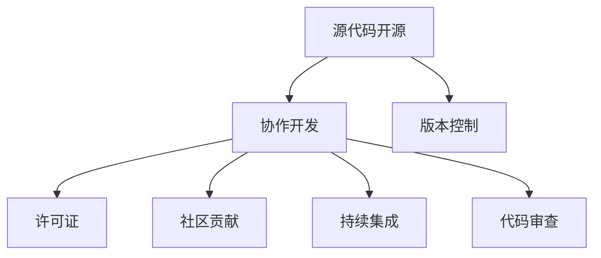

                 

# 开源技术：共享创新，加速进步

> 关键词：开源技术,共享经济,创新加速,协作开发,协作工具,社区贡献,贡献流程,开源协作

## 1. 背景介绍

### 1.1 问题由来
随着互联网和计算技术的飞速发展，开源技术在全球软件和科技领域扮演着越来越重要的角色。开源技术的普及，不仅为开发者提供了一个协作和创新的平台，也为企业提供了灵活快速构建技术栈的手段。然而，尽管开源技术在技术创新和应用推广方面发挥了巨大作用，其真正的潜力尚未完全被挖掘。如何更高效地利用开源技术，如何更好地管理和维护开源项目，是每个技术社区和开发者需要思考的问题。

### 1.2 问题核心关键点
本节将探讨开源技术在现代软件开发中的关键问题，包括其定义、优势、挑战以及未来发展的方向。

- **定义**：开源技术是指源代码被公开、免费提供的软件或技术，任何人都可以下载、使用、修改和分发。开源技术强调社区协作、透明度和开放性。
- **优势**：开源技术的优势在于其灵活性、低成本、高可定制性以及快速迭代的能力。开源社区的参与者众多，可以汇聚全球顶尖的开发力量，推动技术创新。
- **挑战**：开源技术面临的挑战包括代码质量控制、项目管理和贡献者激励等。如何维持项目活力，吸引和保留贡献者，是开源社区需要解决的难题。

## 2. 核心概念与联系

### 2.1 核心概念概述

开源技术的核心概念涉及软件开发、社区协作、版本控制等多个方面。本节将介绍几个密切相关的核心概念：

- **源代码开源**：源代码的公开性是开源技术的核心特征，它允许任何人查看、修改和分发代码。
- **协作开发**：开源项目通常采用协作开发模式，多个开发者协同工作，共同推动项目进展。
- **版本控制**：版本控制系统是开源项目管理和协作的基础，如Git、SVN等。
- **许可证**：开源项目的许可证定义了用户对代码的访问和使用权限，如GPL、Apache等。
- **社区贡献**：社区贡献是开源项目持续发展的重要动力，贡献者通过提交代码、文档、测试等形式，推动项目进步。
- **持续集成(CI)**：持续集成系统自动化测试和集成开源项目，确保代码质量稳定。
- **代码审查(Code Review)**：代码审查是开源项目质量保障的重要环节，通过代码审查，保证代码质量。

这些概念之间的逻辑关系可以通过以下Mermaid流程图来展示：



这个流程图展示了开源技术的核心概念及其之间的关系：

1. 源代码开源是开源技术的基础，保证了透明度和开放性。
2. 协作开发利用源代码的开放性，允许多个开发者协同工作。
3. 版本控制支持协作开发，提供了代码管理和协作的工具。
4. 许可证定义了开源代码的使用权限，保护了创作者的利益。
5. 社区贡献是开源项目发展的重要动力，通过集体智慧提升项目质量。
6. 持续集成和代码审查保障了开源项目的高质量，提升了开发效率。

这些概念共同构成了开源技术的开发和维护框架，使其在各个技术领域中广泛应用。

## 3. 核心算法原理 & 具体操作步骤
### 3.1 算法原理概述

开源技术的核心算法原理主要是围绕版本控制和协作开发的流程管理。具体包括：

- **版本控制算法**：如Git的分布式版本控制系统，通过追踪代码变更历史，实现多人协作。
- **持续集成算法**：如Jenkins、Travis CI等，自动化测试和集成代码变更，确保代码质量稳定。
- **代码审查算法**：如GitHub的代码审查机制，通过人工审核和自动化工具，保证代码质量。

开源技术的管理和协作流程包括：

1. **代码提交**：开发者将自己的代码变更提交到版本控制系统，开始协作开发。
2. **代码审查**：提交的代码变更需要经过其他开发者的审查，确保代码质量和规范。
3. **持续集成**：代码变更提交后，持续集成系统自动进行构建和测试，确保代码稳定。
4. **合并代码**：代码审查通过后，负责人将其合并到主分支，更新代码库。

### 3.2 算法步骤详解

开源技术的实施过程主要包括以下几个关键步骤：

**Step 1: 准备开发环境**
- 安装必要的版本控制系统，如Git。
- 创建本地仓库和远程仓库，并进行初始化。
- 配置持续集成系统，如Jenkins、Travis CI等。

**Step 2: 协作开发**
- 加入开源项目社区，获取项目文档和代码库。
- 下载项目代码，建立本地开发环境。
- 创建自己的分支，进行功能开发。
- 在代码库中提交变更，开始协作开发。

**Step 3: 代码审查**
- 提交代码变更后，其他开发者进行代码审查，提出修改意见。
- 开发者根据审查意见进行修改，并再次提交代码变更。
- 重复代码审查过程，直至代码审查通过。

**Step 4: 持续集成**
- 将代码变更提交到持续集成系统，自动构建和测试。
- 查看测试结果，确保代码无明显错误。
- 根据测试结果，调整代码变更或提交新变更。

**Step 5: 合并代码**
- 代码审查通过和测试通过后，负责人将其合并到主分支。
- 更新远程仓库和文档，记录代码变更。
- 通知社区代码变更已经完成，可以进行下一步开发。

以上是开源技术的实施过程，尽管不同项目可能存在细节差异，但这些基本步骤是通用的。

### 3.3 算法优缺点

开源技术的优点在于其开放性、灵活性和社区协作。它提供了低成本、高可定制性的解决方案，适合快速迭代的软件开发。开源技术的开放性也推动了技术社区的形成和蓬勃发展，汇聚了全球顶尖的开发力量。

然而，开源技术也存在一些缺点：

- **维护成本高**：开源项目依赖社区贡献，缺乏统一管理和维护，容易出现代码质量不稳定、版本混乱等问题。
- **缺乏集中管理**：开源项目缺乏统一的决策机制和管理团队，容易出现资源分配不均、目标不一致等问题。
- **社区管理难度大**：开源社区的参与者众多，管理和激励贡献者成为一大挑战，如何吸引和保留贡献者，是开源项目面临的难题。

尽管存在这些局限性，开源技术的优点仍然使其在软件开发中扮演了重要角色，成为技术创新和应用推广的重要手段。

### 3.4 算法应用领域

开源技术广泛应用于各种软件开发场景，例如：

- **开源框架和库**：如TensorFlow、React、Spring等，提供高性能的开发工具和组件，帮助开发者快速构建应用。
- **开源操作系统**：如Linux、FreeBSD等，提供灵活高效的操作系统解决方案，支持广泛硬件平台。
- **开源数据库**：如MySQL、PostgreSQL等，提供可靠的数据存储和管理解决方案，适用于各种数据需求。
- **开源应用服务器**：如Apache HTTP Server、Nginx等，提供高性能、可扩展的服务器解决方案，支持Web应用和API开发。

这些开源技术在各行业中被广泛采用，推动了软件开发的标准化和规范化，提升了技术创新的效率和质量。

## 4. 数学模型和公式 & 详细讲解 & 举例说明

### 4.1 数学模型构建

开源技术的管理和协作过程可以通过数学模型进行建模。以下将使用数学语言对开源技术的核心流程进行更加严格的刻画。

假设开源项目的管理流程由n个任务组成，每个任务可以由m个开发者协作完成。任务完成概率为$p_i$，任务分配给开发者的概率为$q_j$。开发者提交代码变更的概率为$s$，代码审查通过的概率为$r$，持续集成通过的概率为$t$。模型目标是最大化任务完成概率和代码质量。

定义任务完成概率为$\mathcal{P}(t)$，代码质量为$\mathcal{Q}(t)$，则模型可以表示为：

$$
\max_{p_i, q_j, s, r, t} \sum_{i=1}^n p_i \times \mathcal{Q}(t)
$$

在数学模型构建的基础上，可以进一步推导具体的算法和策略。

### 4.2 公式推导过程

以下是模型中的关键公式及其推导过程：

- **任务完成概率**：$p_i = (1 - q_j) \times s \times r \times t$

- **代码质量**：$\mathcal{Q}(t) = (1 - s) \times r \times t + s \times (1 - r) \times t + s \times r \times (1 - t)$

通过上述公式，我们可以分析任务完成和代码质量的影响因素，并进一步优化开源项目的协作流程。

### 4.3 案例分析与讲解

以TensorFlow为例，分析开源项目的成功因素：

- **社区协作**：TensorFlow拥有庞大的开发者社区，来自全球各地的开发者共同推动项目进展。
- **代码质量**：TensorFlow通过持续集成和代码审查，确保代码质量和稳定性。
- **文档和培训**：TensorFlow提供了详细的文档和培训资源，帮助开发者快速上手。

通过这些成功因素，可以看出开源项目的管理和协作对项目成功的重要性。

## 5. 项目实践：代码实例和详细解释说明
### 5.1 开发环境搭建

在进行开源项目实践前，我们需要准备好开发环境。以下是使用Git进行版本控制和GitHub进行项目管理的环境配置流程：

1. 安装Git：从官网下载并安装Git，用于版本控制。
2. 创建GitHub账号：访问GitHub官网，创建账号并登录。
3. 创建或加入项目：在GitHub上创建或加入开源项目。
4. 克隆代码：使用Git clone命令克隆项目代码到本地。

完成上述步骤后，即可在本地环境中进行代码开发。

### 5.2 源代码详细实现

下面以TensorFlow为例，给出使用Git和GitHub进行开源项目开发的PyTorch代码实现。

```python
import git
import os
import shutil
from git import Repo

# 克隆代码
repo = Repo.clone_from('https://github.com/tensorflow/tensorflow.git', '/path/to/tensorflow')
# 进入代码目录
os.chdir('/path/to/tensorflow')

# 配置持续集成
os.system('bash ./scripts/ci.sh')

# 进行代码开发
# 修改代码文件
with open('/path/to/tensorflow/tensorflow/core/kernels/example_op.py', 'r+') as f:
    # 修改代码
    f.write('修改后的代码')
    f.flush()

# 提交代码变更
git.add('.')
git.commit('修改代码')
git.push()
```

以上就是使用Git和GitHub进行TensorFlow代码开发的完整代码实现。可以看到，Git和GitHub提供了强大的版本控制和项目管理功能，使得开源项目的开发和协作变得高效便捷。

### 5.3 代码解读与分析

让我们再详细解读一下关键代码的实现细节：

**Git使用**：
- `git clone`：克隆代码仓库到本地。
- `git add`：将修改后的文件提交到暂存区。
- `git commit`：将修改后的文件提交到本地仓库。
- `git push`：将本地仓库推送到远程仓库。

**持续集成脚本**：
- `bash ./scripts/ci.sh`：执行持续集成脚本，自动化构建和测试代码变更。

**代码修改**：
- `with open('/path/to/tensorflow/tensorflow/core/kernels/example_op.py', 'r+') as f`：以读写模式打开文件，进行修改。
- `f.write('修改后的代码')`：写入修改后的代码。

这些代码展示了如何使用Git和GitHub进行开源项目的版本控制和项目管理，以及如何进行代码开发和提交变更。通过合理使用这些工具，可以大幅提升开源项目的开发效率和管理质量。

## 6. 实际应用场景
### 6.1 开源框架和库

开源框架和库是开源技术的重要应用之一，广泛应用于软件开发各个领域。

- **机器学习**：TensorFlow、PyTorch等框架，提供了高性能的机器学习工具和组件，推动了人工智能技术的发展。
- **Web开发**：React、Vue等库，提供了丰富的Web组件和工具，帮助开发者快速构建Web应用。
- **系统开发**：Linux、FreeBSD等操作系统，提供了灵活高效的操作系统解决方案，支持各种硬件平台。

这些开源技术不仅在技术领域得到了广泛应用，也推动了整个产业的发展，为软件开发提供了强大的技术支持。

### 6.2 开源数据库

开源数据库为数据存储和管理提供了高效的解决方案，适用于各种数据需求。

- **关系型数据库**：MySQL、PostgreSQL等，提供可靠的数据存储和管理解决方案，支持复杂查询和事务处理。
- **NoSQL数据库**：MongoDB、Cassandra等，提供灵活高效的数据存储和管理方案，支持大规模数据处理。

这些开源数据库在各行业中被广泛采用，推动了数据管理和分析技术的发展。

### 6.3 开源应用服务器

开源应用服务器为Web应用和API开发提供了高性能、可扩展的解决方案。

- **Apache HTTP Server**：高性能的Web服务器，支持HTTP和WebSocket协议，广泛应用于Web应用和API开发。
- **Nginx**：高性能、轻量级的Web服务器，支持反向代理、负载均衡等功能，广泛应用于Web应用和API开发。

这些开源应用服务器在各行业中被广泛采用，推动了Web应用和API开发技术的发展。

### 6.4 未来应用展望

随着开源技术的发展，未来的应用场景将更加广阔。以下是一些可能的未来应用方向：

- **跨平台应用**：开源技术可以跨越不同的平台和设备，实现跨平台应用开发。
- **边缘计算**：开源技术可以应用于边缘计算，提高数据处理效率和响应速度。
- **人工智能**：开源技术可以与人工智能结合，推动智能应用和智能决策的发展。
- **区块链**：开源技术可以应用于区块链，推动去中心化应用和分布式计算的发展。

## 7. 工具和资源推荐
### 7.1 学习资源推荐

为了帮助开发者系统掌握开源技术，这里推荐一些优质的学习资源：

1. **《开源技术：实践与艺术》**：本书系统介绍了开源技术的概念、原理、实施方法和最佳实践，适合初学者和高级开发者阅读。
2. **GitHub官方文档**：GitHub的官方文档提供了详细的API和使用指南，是开发者学习GitHub的基础资源。
3. **Git官方文档**：Git的官方文档提供了详细的安装和使用指南，是开发者学习Git的基础资源。
4. **持续集成工具文档**：如Jenkins、Travis CI等持续集成工具的官方文档，提供了详细的安装和使用指南。
5. **代码审查工具文档**：如GitHub的代码审查机制，提供了详细的文档和使用指南。

通过对这些资源的学习实践，相信你一定能够快速掌握开源技术的精髓，并用于解决实际的开发问题。

### 7.2 开发工具推荐

高效的开发离不开优秀的工具支持。以下是几款用于开源项目开发的常用工具：

1. **Git**：Git是最流行的版本控制系统，支持分布式协作开发，提供强大的版本控制功能。
2. **GitHub**：GitHub是最流行的代码托管平台，提供版本控制、持续集成、代码审查等功能。
3. **Jenkins**：Jenkins是最流行的持续集成工具，支持自动化构建、测试和部署，提高开发效率。
4. **Travis CI**：Travis CI是一个免费的持续集成工具，支持开源项目的持续集成和测试。
5. **GitHub Actions**：GitHub Actions是GitHub提供的一项持续集成服务，支持自动化构建和测试。

这些工具提供了强大的版本控制和协作开发功能，是开源项目开发的重要支持。

### 7.3 相关论文推荐

开源技术的发展离不开学界的持续研究。以下是几篇奠基性的相关论文，推荐阅读：

1. **《开源社区的动力和挑战》**：研究开源社区的动力和挑战，为开源项目的持续发展提供理论支持。
2. **《开源项目的管理和维护》**：探讨开源项目的管理和维护方法，为开源项目的管理提供实践指南。
3. **《开源项目协作框架》**：介绍开源项目的协作框架，为开源项目的协作提供理论支持。

这些论文代表了大规模开源项目的管理和协作技术的发展脉络，帮助研究者把握学科前进方向，激发更多的创新灵感。

## 8. 总结：未来发展趋势与挑战
### 8.1 总结

本文对开源技术在现代软件开发中的关键问题进行了全面系统的介绍。首先阐述了开源技术的定义、优势和挑战，明确了开源技术在软件开发中的重要性。其次，从原理到实践，详细讲解了开源技术的管理和协作流程，给出了开源项目开发的完整代码实例。同时，本文还广泛探讨了开源技术在多个行业领域的应用前景，展示了开源技术的广泛应用潜力。此外，本文精选了开源技术的学习资源和开发工具，力求为读者提供全方位的技术指引。

通过本文的系统梳理，可以看到，开源技术在软件开发中的应用和发展前景广阔，成为技术创新和应用推广的重要手段。未来，伴随开源技术的持续演进，开源项目的质量和规模将进一步提升，为软件开发领域带来更多创新和突破。

### 8.2 未来发展趋势

展望未来，开源技术的未来发展趋势包括以下几个方面：

1. **开源社区的壮大**：开源社区的参与者将不断增加，来自全球各地的开发者将共同推动开源项目的发展。
2. **开源项目的多样化**：开源项目将涵盖更多的技术领域和应用场景，满足不同用户的需求。
3. **开源工具的智能化**：开源工具将不断优化，提升开发效率和协作质量。
4. **开源技术的安全性**：开源技术的安全性将得到更多关注，保障代码和数据的安全。
5. **开源项目的可持续发展**：开源项目将更加注重质量和可持续性，推动技术社区的长期发展。

这些趋势将进一步提升开源技术的实用性和影响力，使其在各个技术领域中发挥更大的作用。

### 8.3 面临的挑战

尽管开源技术已经取得了显著的进展，但它在发展过程中仍面临一些挑战：

1. **开源项目的质量控制**：开源项目质量参差不齐，存在大量低质量的代码和文档，影响了用户的体验。
2. **开源社区的维护和管理**：开源社区的管理和激励机制尚不完善，存在资源分配不均、目标不一致等问题。
3. **开源技术的标准化**：开源技术的标准化尚未完全实现，不同技术之间的兼容性问题仍然存在。
4. **开源项目的可持续发展**：开源项目往往面临资源不足、用户流失等问题，如何实现可持续发展是重要挑战。

这些挑战需要在未来开源技术的演进中逐步解决，才能推动开源技术的进一步发展。

### 8.4 研究展望

面对开源技术面临的挑战，未来的研究需要在以下几个方面寻求新的突破：

1. **开源项目质量控制**：建立严格的代码和文档审核机制，确保开源项目的质量。
2. **开源社区管理机制**：完善开源社区的管理和激励机制，吸引和保留贡献者。
3. **开源技术的标准化**：推动开源技术的标准化，提高不同技术之间的兼容性。
4. **开源项目的可持续发展**：建立开源项目的可持续发展机制，确保项目的长期稳定发展。

这些研究方向将推动开源技术的进一步发展和应用，为软件开发领域的创新和进步提供坚实的基础。

## 9. 附录：常见问题与解答

**Q1：开源项目如何进行质量控制？**

A: 开源项目的质量控制主要依赖于代码审查和持续集成。通过代码审查，开发者可以检查代码的正确性和规范性。通过持续集成，自动化构建和测试代码变更，确保代码稳定和高质量。此外，建立社区标准和文档规范，也是提高项目质量的重要手段。

**Q2：开源社区如何进行管理？**

A: 开源社区的管理依赖于明确的贡献者激励机制和统一的目标。通过建立贡献者排行榜和激励机制，可以吸引和保留贡献者。通过社区讨论和投票机制，可以协调和统一社区目标。此外，建立社区章程和规则，也是管理社区的重要手段。

**Q3：开源技术如何进行标准化？**

A: 开源技术的标准化需要通过国际标准化组织和技术联盟推动。建立统一的技术标准和接口规范，可以提高不同技术之间的兼容性。通过开源社区和标准化组织的合作，可以推动开源技术的标准化进程。

**Q4：开源项目如何进行可持续发展？**

A: 开源项目的可持续发展依赖于稳定的资金支持和用户支持。通过开源基金和社区众筹，可以获取稳定的资金支持。通过社区管理和用户参与，可以提高用户的忠诚度和贡献度。此外，建立开源项目的文档和培训机制，也是推动项目可持续发展的重要手段。

通过这些回答，可以看出开源技术在管理、质量控制和可持续发展方面面临的挑战，以及未来的研究方向。相信随着开源技术的持续演进，这些挑战终将得到解决，开源技术将为软件开发带来更多的创新和突破。

