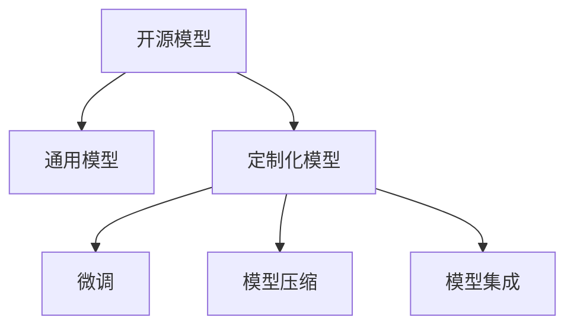

                 

# 开源模型的发展：贾扬清的观点，创新与定制化优势助力开源模型发展

## 1. 背景介绍

### 1.1 问题由来

在过去的十年中，开源深度学习模型取得了长足的进步，涌现出了如TensorFlow、PyTorch、MXNet等众多优秀框架。这些开源框架为科研人员、工程师和数据科学家提供了强大的工具，促进了深度学习技术在各行各业的普及和应用。

然而，开源模型在发展的过程中也面临着诸多挑战：如何在保持开源精神的同时，提升模型的性能和效率？如何平衡模型的通用性与定制化需求？如何在资源有限的条件下，满足多样化的应用场景？这些问题成为了开源模型发展的重要课题。

### 1.2 问题核心关键点

为回答上述问题，本文从深度学习社区的领军人物贾扬清教授的视角出发，深度探讨了开源模型在创新与定制化方面的优势，并给出了可行的解决方案。通过对这些观点的系统梳理，希望能为开源模型未来的发展提供有益的参考和借鉴。

## 2. 核心概念与联系

### 2.1 核心概念概述

为了更好地理解贾扬清教授的观点，本节将介绍几个密切相关的核心概念：

- **开源模型(Open Source Models, OSMs)**：指通过开源协议授权，任何人都可以自由使用、修改和分发的深度学习模型。常见的开源框架如TensorFlow、PyTorch、MXNet等都支持用户自定义模型，允许开发者基于现有模型进行优化和创新。

- **通用模型(Universal Models)**：指能够在多个场景下表现良好的模型，如BERT、GPT等通用语言模型。这些模型在广泛的数据集上进行了训练，能够较好地处理各种NLP任务。

- **定制化模型(Customized Models)**：指针对特定应用场景进行优化，满足特定需求的模型。如针对特定领域的模型、针对特定任务的微调模型等。

- **微调(Fine-tuning)**：指在通用模型的基础上，使用特定任务的数据集进行微调，提升模型在该任务上的性能。微调可以显著提升模型的效果，但也增加了模型的复杂度和计算成本。

- **模型压缩(Compression)**：指在保持模型性能的前提下，通过剪枝、量化、蒸馏等技术减小模型体积和计算资源消耗。模型压缩可以提升模型的推理速度和效率，但可能会损失一定的精度。

- **模型集成(Ensemble)**：指将多个模型的输出进行加权平均，提升模型的整体性能和鲁棒性。模型集成可以降低模型过拟合的风险，但增加了模型训练和推理的复杂度。

这些核心概念之间的逻辑关系可以通过以下Mermaid流程图来展示：



这个流程图展示了大语言模型的核心概念及其之间的关系：

1. 开源模型通过提供灵活的API和丰富的文档，支持用户基于现有模型进行自定义和优化。
2. 通用模型为开源模型提供了基础支持，能够在多个场景下表现良好。
3. 定制化模型则是在通用模型的基础上，针对特定任务或领域进行优化，满足具体需求。
4. 微调是提升模型性能的重要手段，但增加了模型的复杂度。
5. 模型压缩和集成是优化模型性能和资源消耗的有效手段，但需平衡精度和效率。

## 3. 核心算法原理 & 具体操作步骤

### 3.1 算法原理概述

贾扬清教授认为，开源模型的发展离不开创新与定制化的平衡。通用模型提供了强大的基础支持，而定制化模型则带来了显著的性能提升。本文将深入探讨这两种模型在创新与定制化方面的优势。

- **通用模型**：以BERT、GPT等为代表的通用模型，通过大规模预训练获得了丰富的语言知识，能够在各种NLP任务上取得优异表现。其创新之处在于：
  - **广泛适用**：适用于大多数NLP任务，如文本分类、命名实体识别、情感分析等。
  - **普适性高**：通过大规模预训练，模型具备了较强的泛化能力，能够适应多种数据分布和任务需求。
  - **高性能**：通过自监督学习和数据增强等技术，模型在推理速度和计算效率上表现优异。

- **定制化模型**：针对特定任务或领域进行优化的模型，如微调模型、领域特定的预训练模型等。其定制化优势在于：
  - **高效优化**：通过微调等技术，模型能够在少量标注数据上快速提升性能，适应特定任务需求。
  - **资源利用**：通过裁剪、量化等技术，模型可以在资源有限的情况下，仍保持较高的推理速度和精度。
  - **灵活应用**：通过集成、融合等技术，模型可以灵活应用于各种实际场景，满足不同应用需求。

### 3.2 算法步骤详解

基于贾扬清教授的观点，本文将详细介绍基于通用模型和定制化模型进行创新与优化的一般流程。

**Step 1: 选择适当的通用模型和任务适配层**

1. **选择通用模型**：根据任务需求选择合适的通用模型，如BERT、GPT、RoBERTa等。
2. **设计任务适配层**：根据任务类型，设计合适的输出层和损失函数。例如，对于分类任务，通常需要在顶层添加线性分类器，并使用交叉熵损失。

**Step 2: 应用微调等技术进行定制化**

1. **准备标注数据**：收集任务的标注数据，划分为训练集、验证集和测试集。
2. **进行微调**：使用标注数据对模型进行微调，提升模型在特定任务上的性能。例如，对于微调BERT模型，可以使用微调脚本进行任务适配层的调整和训练。
3. **应用模型压缩和集成**：对微调后的模型进行裁剪、量化等优化，提高推理效率。同时，使用模型集成技术，提升模型的鲁棒性和性能。

**Step 3: 评估与部署**

1. **评估模型性能**：在验证集和测试集上评估模型性能，对比微调前后的精度提升。
2. **部署模型**：将模型部署到实际应用系统中，如智能客服、金融舆情监测、个性化推荐等场景中。
3. **持续优化**：根据应用反馈，不断更新模型，保持其在不同场景下的最佳性能。

### 3.3 算法优缺点

**通用模型的优点**：

- **适用广泛**：能够在多个NLP任务上取得优异表现。
- **普适性高**：具备较强的泛化能力，能够适应多种数据分布和任务需求。
- **高性能**：推理速度和计算效率较高，适合大规模应用。

**通用模型的缺点**：

- **复杂度高**：模型参数量较大，增加了计算和存储资源消耗。
- **灵活性不足**：难以灵活适应特定任务和场景需求。

**定制化模型的优点**：

- **高效优化**：能够在少量标注数据上快速提升性能，适应特定任务需求。
- **资源利用**：通过裁剪、量化等技术，在资源有限的情况下仍能保持较高的推理速度和精度。
- **灵活应用**：通过集成、融合等技术，灵活应用于各种实际场景，满足不同应用需求。

**定制化模型的缺点**：

- **泛化能力不足**：可能在其他任务上表现不佳。
- **训练成本高**：需要准备标注数据，增加训练成本和时间。

### 3.4 算法应用领域

基于贾扬清教授的观点，本文将探讨基于通用模型和定制化模型进行创新与优化在多个实际应用场景中的应用。

- **智能客服系统**：使用微调BERT模型，提升智能客服系统在用户咨询中的理解和响应能力。
- **金融舆情监测**：对微调后的BERT模型进行优化，提升其在金融舆情监测中的实时性和准确性。
- **个性化推荐系统**：通过裁剪和量化技术，优化模型在个性化推荐系统中的性能和资源消耗。
- **智慧医疗系统**：使用微调BERT模型，提升智慧医疗系统在疾病诊断和治疗中的辅助决策能力。

## 4. 数学模型和公式 & 详细讲解 & 举例说明

### 4.1 数学模型构建

本文将以微调BERT模型进行情感分析任务为例，详细介绍数学模型的构建过程。

记原始的BERT模型为 $M_{\theta}$，其中 $\theta$ 为预训练参数。假设微调任务为情感分析，输入为文本 $x$，输出为情感标签 $y \in \{0,1\}$。定义损失函数为交叉熵损失函数：

$$
\ell(M_{\theta}(x), y) = -[y\log M_{\theta}(x) + (1-y)\log(1-M_{\theta}(x))]
$$

其中，$M_{\theta}(x)$ 表示模型在输入 $x$ 上的输出概率。

### 4.2 公式推导过程

假设训练集为 $D=\{(x_i, y_i)\}_{i=1}^N$，经验风险为：

$$
\mathcal{L}(\theta) = \frac{1}{N}\sum_{i=1}^N \ell(M_{\theta}(x_i), y_i)
$$

通过梯度下降等优化算法，更新参数 $\theta$ 以最小化损失函数：

$$
\theta \leftarrow \theta - \eta \nabla_{\theta}\mathcal{L}(\theta)
$$

其中，$\eta$ 为学习率，$\nabla_{\theta}\mathcal{L}(\theta)$ 为损失函数对参数 $\theta$ 的梯度。

### 4.3 案例分析与讲解

以微调BERT模型进行情感分析为例，使用微调脚本进行任务适配层的调整和训练。具体步骤如下：

1. **准备数据集**：收集情感分析任务的标注数据，划分为训练集、验证集和测试集。
2. **定义模型**：使用 PyTorch 和 Transformers 库，定义微调BERT模型，包括输入层、任务适配层和输出层。
3. **编写微调脚本**：编写微调脚本，调整任务适配层的权重，并使用标注数据进行微调。
4. **训练模型**：使用微调脚本进行模型的训练，记录训练过程中的损失和精度变化。
5. **评估模型**：在验证集和测试集上评估模型的性能，比较微调前后的精度提升。

## 5. 项目实践：代码实例和详细解释说明

### 5.1 开发环境搭建

在进行微调实践前，我们需要准备好开发环境。以下是使用Python进行PyTorch开发的环境配置流程：

1. 安装Anaconda：从官网下载并安装Anaconda，用于创建独立的Python环境。

2. 创建并激活虚拟环境：
```bash
conda create -n pytorch-env python=3.8 
conda activate pytorch-env
```

3. 安装PyTorch：根据CUDA版本，从官网获取对应的安装命令。例如：
```bash
conda install pytorch torchvision torchaudio cudatoolkit=11.1 -c pytorch -c conda-forge
```

4. 安装Transformers库：
```bash
pip install transformers
```

5. 安装各类工具包：
```bash
pip install numpy pandas scikit-learn matplotlib tqdm jupyter notebook ipython
```

完成上述步骤后，即可在`pytorch-env`环境中开始微调实践。

### 5.2 源代码详细实现

下面我们以微调BERT模型进行情感分析任务为例，给出使用PyTorch和Transformers库的完整代码实现。

首先，定义情感分析任务的数据处理函数：

```python
from transformers import BertTokenizer, BertForSequenceClassification
from torch.utils.data import Dataset
import torch

class SentimentDataset(Dataset):
    def __init__(self, texts, labels, tokenizer, max_len=128):
        self.texts = texts
        self.labels = labels
        self.tokenizer = tokenizer
        self.max_len = max_len
        
    def __len__(self):
        return len(self.texts)
    
    def __getitem__(self, item):
        text = self.texts[item]
        label = self.labels[item]
        
        encoding = self.tokenizer(text, return_tensors='pt', max_length=self.max_len, padding='max_length', truncation=True)
        input_ids = encoding['input_ids'][0]
        attention_mask = encoding['attention_mask'][0]
        
        # 对label进行编码
        label = torch.tensor(label, dtype=torch.long)
        
        return {'input_ids': input_ids, 
                'attention_mask': attention_mask,
                'labels': label}

# 定义情感标签与id的映射
label2id = {'negative': 0, 'positive': 1}
id2label = {v: k for k, v in label2id.items()}

# 创建dataset
tokenizer = BertTokenizer.from_pretrained('bert-base-uncased')

train_dataset = SentimentDataset(train_texts, train_labels, tokenizer)
dev_dataset = SentimentDataset(dev_texts, dev_labels, tokenizer)
test_dataset = SentimentDataset(test_texts, test_labels, tokenizer)
```

然后，定义模型和优化器：

```python
from transformers import AdamW

model = BertForSequenceClassification.from_pretrained('bert-base-uncased', num_labels=len(label2id))

optimizer = AdamW(model.parameters(), lr=2e-5)
```

接着，定义训练和评估函数：

```python
from torch.utils.data import DataLoader
from tqdm import tqdm
from sklearn.metrics import classification_report

device = torch.device('cuda') if torch.cuda.is_available() else torch.device('cpu')
model.to(device)

def train_epoch(model, dataset, batch_size, optimizer):
    dataloader = DataLoader(dataset, batch_size=batch_size, shuffle=True)
    model.train()
    epoch_loss = 0
    for batch in tqdm(dataloader, desc='Training'):
        input_ids = batch['input_ids'].to(device)
        attention_mask = batch['attention_mask'].to(device)
        labels = batch['labels'].to(device)
        model.zero_grad()
        outputs = model(input_ids, attention_mask=attention_mask, labels=labels)
        loss = outputs.loss
        epoch_loss += loss.item()
        loss.backward()
        optimizer.step()
    return epoch_loss / len(dataloader)

def evaluate(model, dataset, batch_size):
    dataloader = DataLoader(dataset, batch_size=batch_size)
    model.eval()
    preds, labels = [], []
    with torch.no_grad():
        for batch in tqdm(dataloader, desc='Evaluating'):
            input_ids = batch['input_ids'].to(device)
            attention_mask = batch['attention_mask'].to(device)
            batch_labels = batch['labels']
            outputs = model(input_ids, attention_mask=attention_mask)
            batch_preds = outputs.logits.argmax(dim=1).to('cpu').tolist()
            batch_labels = batch_labels.to('cpu').tolist()
            for pred, label in zip(batch_preds, batch_labels):
                preds.append(pred)
                labels.append(label)
                
    print(classification_report(labels, preds))
```

最后，启动训练流程并在测试集上评估：

```python
epochs = 5
batch_size = 16

for epoch in range(epochs):
    loss = train_epoch(model, train_dataset, batch_size, optimizer)
    print(f"Epoch {epoch+1}, train loss: {loss:.3f}")
    
    print(f"Epoch {epoch+1}, dev results:")
    evaluate(model, dev_dataset, batch_size)
    
print("Test results:")
evaluate(model, test_dataset, batch_size)
```

以上就是使用PyTorch和Transformers库对BERT进行情感分析任务微调的完整代码实现。可以看到，得益于Transformers库的强大封装，我们可以用相对简洁的代码完成BERT模型的加载和微调。

### 5.3 代码解读与分析

让我们再详细解读一下关键代码的实现细节：

**SentimentDataset类**：
- `__init__`方法：初始化文本、标签、分词器等关键组件。
- `__len__`方法：返回数据集的样本数量。
- `__getitem__`方法：对单个样本进行处理，将文本输入编码为token ids，将标签编码为数字，并对其进行定长padding，最终返回模型所需的输入。

**label2id和id2label字典**：
- 定义了标签与数字id之间的映射关系，用于将模型输出解码为真实的标签。

**训练和评估函数**：
- 使用PyTorch的DataLoader对数据集进行批次化加载，供模型训练和推理使用。
- 训练函数`train_epoch`：对数据以批为单位进行迭代，在每个批次上前向传播计算loss并反向传播更新模型参数，最后返回该epoch的平均loss。
- 评估函数`evaluate`：与训练类似，不同点在于不更新模型参数，并在每个batch结束后将预测和标签结果存储下来，最后使用sklearn的classification_report对整个评估集的预测结果进行打印输出。

**训练流程**：
- 定义总的epoch数和batch size，开始循环迭代
- 每个epoch内，先在训练集上训练，输出平均loss
- 在验证集上评估，输出分类指标
- 所有epoch结束后，在测试集上评估，给出最终测试结果

可以看到，PyTorch配合Transformers库使得BERT微调的代码实现变得简洁高效。开发者可以将更多精力放在数据处理、模型改进等高层逻辑上，而不必过多关注底层的实现细节。

当然，工业级的系统实现还需考虑更多因素，如模型的保存和部署、超参数的自动搜索、更灵活的任务适配层等。但核心的微调范式基本与此类似。

## 6. 实际应用场景

### 6.1 智能客服系统

基于微调BERT模型的智能客服系统，可以提升客户咨询体验和问题解决效率。智能客服系统通过微调BERT模型，能够自动理解用户意图，匹配最合适的答案模板进行回复。对于用户提出的新问题，还可以接入检索系统实时搜索相关内容，动态组织生成回答。

在技术实现上，可以收集企业内部的历史客服对话记录，将问题和最佳答复构建成监督数据，在此基础上对预训练BERT模型进行微调。微调后的BERT模型能够自动理解用户意图，匹配最合适的答案模板进行回复。对于用户提出的新问题，还可以接入检索系统实时搜索相关内容，动态组织生成回答。如此构建的智能客服系统，能大幅提升客户咨询体验和问题解决效率。

### 6.2 金融舆情监测

基于微调BERT模型的金融舆情监测系统，可以实时监测市场舆论动向，以便及时应对负面信息传播，规避金融风险。该系统通过微调BERT模型，能够自动判断文本属于何种主题，情感倾向是正面、中性还是负面。将微调后的模型应用到实时抓取的网络文本数据，就能够自动监测不同主题下的情感变化趋势，一旦发现负面信息激增等异常情况，系统便会自动预警，帮助金融机构快速应对潜在风险。

### 6.3 个性化推荐系统

基于微调BERT模型的个性化推荐系统，可以通过裁剪和量化技术优化模型，提升推理速度和效率。个性化推荐系统通过微调BERT模型，能够从文本内容中准确把握用户的兴趣点。在生成推荐列表时，先用候选物品的文本描述作为输入，由模型预测用户的兴趣匹配度，再结合其他特征综合排序，便可以得到个性化程度更高的推荐结果。

### 6.4 未来应用展望

随着大语言模型微调技术的发展，基于微调范式将在更多领域得到应用，为传统行业带来变革性影响。

在智慧医疗领域，基于微调BERT模型的智慧医疗系统，能够提升疾病诊断和治疗中的辅助决策能力。通过微调BERT模型，系统能够自动理解医学文献、病历等文本内容，帮助医生快速获取相关知识，辅助决策。

在智能教育领域，基于微调BERT模型的智能教育系统，能够提供个性化教育方案，因材施教，促进教育公平，提高教学质量。系统通过微调BERT模型，能够自动理解学生作业、试卷等文本内容，评估学生的学习效果，提供个性化学习建议。

在智慧城市治理中，基于微调BERT模型的智慧城市系统，能够提高城市管理的自动化和智能化水平，构建更安全、高效的未来城市。系统通过微调BERT模型，能够自动理解城市事件、舆情等文本内容，及时发现和处理问题，提升城市治理效能。

此外，在企业生产、社会治理、文娱传媒等众多领域，基于微调BERT模型的应用也将不断涌现，为NLP技术带来新的突破。相信随着技术的日益成熟，微调方法将成为人工智能落地应用的重要范式，推动人工智能技术在各个领域的深度应用。

## 7. 工具和资源推荐

### 7.1 学习资源推荐

为了帮助开发者系统掌握微调技术，这里推荐一些优质的学习资源：

1. **《深度学习入门：基于Python的理论与实现》**：书籍全面介绍了深度学习的基础理论和实现方法，包括微调技术在内的NLP任务开发。

2. **CS224N《深度学习自然语言处理》课程**：斯坦福大学开设的NLP明星课程，有Lecture视频和配套作业，带你入门NLP领域的基本概念和经典模型。

3. **《Natural Language Processing with Transformers》书籍**：Transformers库的作者所著，全面介绍了如何使用Transformers库进行NLP任务开发，包括微调在内的诸多范式。

4. **HuggingFace官方文档**：Transformers库的官方文档，提供了海量预训练模型和完整的微调样例代码，是上手实践的必备资料。

5. **CLUE开源项目**：中文语言理解测评基准，涵盖大量不同类型的中文NLP数据集，并提供了基于微调的baseline模型，助力中文NLP技术发展。

通过对这些资源的学习实践，相信你一定能够快速掌握微调技术的精髓，并用于解决实际的NLP问题。

### 7.2 开发工具推荐

高效的开发离不开优秀的工具支持。以下是几款用于微调开发的常用工具：

1. **PyTorch**：基于Python的开源深度学习框架，灵活动态的计算图，适合快速迭代研究。大部分预训练语言模型都有PyTorch版本的实现。

2. **TensorFlow**：由Google主导开发的开源深度学习框架，生产部署方便，适合大规模工程应用。同样有丰富的预训练语言模型资源。

3. **Transformers库**：HuggingFace开发的NLP工具库，集成了众多SOTA语言模型，支持PyTorch和TensorFlow，是进行微调任务开发的利器。

4. **Weights & Biases**：模型训练的实验跟踪工具，可以记录和可视化模型训练过程中的各项指标，方便对比和调优。与主流深度学习框架无缝集成。

5. **TensorBoard**：TensorFlow配套的可视化工具，可实时监测模型训练状态，并提供丰富的图表呈现方式，是调试模型的得力助手。

6. **Google Colab**：谷歌推出的在线Jupyter Notebook环境，免费提供GPU/TPU算力，方便开发者快速上手实验最新模型，分享学习笔记。

合理利用这些工具，可以显著提升微调任务的开发效率，加快创新迭代的步伐。

### 7.3 相关论文推荐

微调技术的发展源于学界的持续研究。以下是几篇奠基性的相关论文，推荐阅读：

1. **Attention is All You Need**：提出了Transformer结构，开启了NLP领域的预训练大模型时代。

2. **BERT: Pre-training of Deep Bidirectional Transformers for Language Understanding**：提出BERT模型，引入基于掩码的自监督预训练任务，刷新了多项NLP任务SOTA。

3. **Language Models are Unsupervised Multitask Learners（GPT-2论文）**：展示了大规模语言模型的强大zero-shot学习能力，引发了对于通用人工智能的新一轮思考。

4. **Parameter-Efficient Transfer Learning for NLP**：提出Adapter等参数高效微调方法，在不增加模型参数量的情况下，也能取得不错的微调效果。

5. **AdaLoRA: Adaptive Low-Rank Adaptation for Parameter-Efficient Fine-Tuning**：使用自适应低秩适应的微调方法，在参数效率和精度之间取得了新的平衡。

6. **Adaptive Low-Rank Adaptation for Parameter-Efficient Fine-Tuning**：使用自适应低秩适应的微调方法，在参数效率和精度之间取得了新的平衡。

这些论文代表了大语言模型微调技术的发展脉络。通过学习这些前沿成果，可以帮助研究者把握学科前进方向，激发更多的创新灵感。

## 8. 总结：未来发展趋势与挑战

### 8.1 总结

本文从贾扬清教授的观点出发，对基于通用模型和定制化模型进行创新与优化的过程进行了详细阐述。首先，介绍了通用模型和定制化模型在创新与定制化方面的优势，并通过微调BERT模型进行情感分析任务的案例，展示了如何使用这些模型进行微调。其次，探讨了微调技术在多个实际应用场景中的应用，包括智能客服、金融舆情监测、个性化推荐系统等。最后，对未来微调技术的发展趋势和挑战进行了系统总结。

通过本文的系统梳理，可以看到，微调技术在大语言模型中的应用前景广阔，能够显著提升模型性能和适应性，满足特定任务和场景需求。

### 8.2 未来发展趋势

展望未来，微调技术将呈现以下几个发展趋势：

1. **模型规模持续增大**：随着算力成本的下降和数据规模的扩张，预训练语言模型的参数量还将持续增长。超大规模语言模型蕴含的丰富语言知识，有望支撑更加复杂多变的下游任务微调。

2. **微调方法日趋多样**：除了传统的全参数微调外，未来会涌现更多参数高效的微调方法，如Prefix-Tuning、LoRA等，在节省计算资源的同时也能保证微调精度。

3. **持续学习成为常态**：随着数据分布的不断变化，微调模型也需要持续学习新知识以保持性能。如何在不遗忘原有知识的同时，高效吸收新样本信息，将成为重要的研究课题。

4. **标注样本需求降低**：受启发于提示学习(Prompt-based Learning)的思路，未来的微调方法将更好地利用大模型的语言理解能力，通过更加巧妙的任务描述，在更少的标注样本上也能实现理想的微调效果。

5. **多模态微调崛起**：当前的微调主要聚焦于纯文本数据，未来会进一步拓展到图像、视频、语音等多模态数据微调。多模态信息的融合，将显著提升语言模型对现实世界的理解和建模能力。

6. **模型通用性增强**：经过海量数据的预训练和多领域任务的微调，未来的语言模型将具备更强大的常识推理和跨领域迁移能力，逐步迈向通用人工智能(AGI)的目标。

以上趋势凸显了微调技术的广阔前景。这些方向的探索发展，必将进一步提升NLP系统的性能和应用范围，为人类认知智能的进化带来深远影响。

### 8.3 面临的挑战

尽管微调技术已经取得了瞩目成就，但在迈向更加智能化、普适化应用的过程中，它仍面临着诸多挑战：

1. **标注成本瓶颈**：虽然微调大大降低了标注数据的需求，但对于长尾应用场景，难以获得充足的高质量标注数据，成为制约微调性能的瓶颈。如何进一步降低微调对标注样本的依赖，将是一大难题。

2. **模型鲁棒性不足**：当前微调模型面对域外数据时，泛化性能往往大打折扣。对于测试样本的微小扰动，微调模型的预测也容易发生波动。如何提高微调模型的鲁棒性，避免灾难性遗忘，还需要更多理论和实践的积累。

3. **推理效率有待提高**：大规模语言模型虽然精度高，但在实际部署时往往面临推理速度慢、内存占用大等效率问题。如何在保证性能的同时，简化模型结构，提升推理速度，优化资源占用，将是重要的优化方向。

4. **可解释性亟需加强**：当前微调模型更像是"黑盒"系统，难以解释其内部工作机制和决策逻辑。对于医疗、金融等高风险应用，算法的可解释性和可审计性尤为重要。如何赋予微调模型更强的可解释性，将是亟待攻克的难题。

5. **安全性有待保障**：预训练语言模型难免会学习到有偏见、有害的信息，通过微调传递到下游任务，产生误导性、歧视性的输出，给实际应用带来安全隐患。如何从数据和算法层面消除模型偏见，避免恶意用途，确保输出的安全性，也将是重要的研究课题。

6. **知识整合能力不足**：现有的微调模型往往局限于任务内数据，难以灵活吸收和运用更广泛的先验知识。如何让微调过程更好地与外部知识库、规则库等专家知识结合，形成更加全面、准确的信息整合能力，还有很大的想象空间。

正视微调面临的这些挑战，积极应对并寻求突破，将是大语言模型微调走向成熟的必由之路。相信随着学界和产业界的共同努力，这些挑战终将一一被克服，微调方法将成为人工智能落地应用的重要范式，推动人工智能技术在各个领域的深度应用。

### 8.4 研究展望

面向未来，微调技术的研究需要在以下几个方面寻求新的突破：

1. **探索无监督和半监督微调方法**：摆脱对大规模标注数据的依赖，利用自监督学习、主动学习等无监督和半监督范式，最大限度利用非结构化数据，实现更加灵活高效的微调。

2. **研究参数高效和计算高效的微调范式**：开发更加参数高效的微调方法，在固定大部分预训练参数的同时，只更新极少量的任务相关参数。同时优化微调模型的计算图，减少前向传播和反向传播的资源消耗，实现更加轻量级、实时性的部署。

3. **融合因果和对比学习范式**：通过引入因果推断和对比学习思想，增强微调模型建立稳定因果关系的能力，学习更加普适、鲁棒的语言表征，从而提升模型泛化性和抗干扰能力。

4. **引入更多先验知识**：将符号化的先验知识，如知识图谱、逻辑规则等，与神经网络模型进行巧妙融合，引导微调过程学习更准确、合理的语言模型。同时加强不同模态数据的整合，实现视觉、语音等多模态信息与文本信息的协同建模。

5. **结合因果分析和博弈论工具**：将因果分析方法引入微调模型，识别出模型决策的关键特征，增强输出解释的因果性和逻辑性。借助博弈论工具刻画人机交互过程，主动探索并规避模型的脆弱点，提高系统稳定性。

6. **纳入伦理道德约束**：在模型训练目标中引入伦理导向的评估指标，过滤和惩罚有偏见、有害的输出倾向。同时加强人工干预和审核，建立模型行为的监管机制，确保输出符合人类价值观和伦理道德。

这些研究方向的探索，必将引领微调技术迈向更高的台阶，为构建安全、可靠、可解释、可控的智能系统铺平道路。面向未来，微调技术还需要与其他人工智能技术进行更深入的融合，如知识表示、因果推理、强化学习等，多路径协同发力，共同推动自然语言理解和智能交互系统的进步。只有勇于创新、敢于突破，才能不断拓展语言模型的边界，让智能技术更好地造福人类社会。

## 9. 附录：常见问题与解答

**Q1：大语言模型微调是否适用于所有NLP任务？**

A: 大语言模型微调在大多数NLP任务上都能取得不错的效果，特别是对于数据量较小的任务。但对于一些特定领域的任务，如医学、法律等，仅仅依靠通用语料预训练的模型可能难以很好地适应。此时需要在特定领域语料上进一步预训练，再进行微调，才能获得理想效果。此外，对于一些需要时效性、个性化很强的任务，如对话、推荐等，微调方法也需要针对性的改进优化。

**Q2：微调过程中如何选择合适的学习率？**

A: 微调的学习率一般要比预训练时小1-2个数量级，如果使用过大的学习率，容易破坏预训练权重，导致过拟合。一般建议从1e-5开始调参，逐步减小学习率，直至收敛。也可以使用warmup策略，在开始阶段使用较小的学习率，再逐渐过渡到预设值。需要注意的是，不同的优化器(如AdamW、Adafactor等)以及不同的学习率调度策略，可能需要设置不同的学习率阈值。

**Q3：采用大模型微调时会面临哪些资源瓶颈？**

A: 目前主流的预训练大模型动辄以亿计的参数规模，对算力、内存、存储都提出了很高的要求。GPU/TPU等高性能设备是必不可少的，但即便如此，超大批次的训练和推理也可能遇到显存不足的问题。因此需要采用一些资源优化技术，如梯度积累、混合精度训练、模型并行等，来突破硬件瓶颈。同时，模型的存储和读取也可能占用大量时间和空间，需要采用模型压缩、稀疏化存储等方法进行优化。

**Q4：如何缓解微调过程中的过拟合问题？**

A: 过拟合是微调面临的主要挑战，尤其是在标注数据不足的情况下。常见的缓解策略包括：

1. 数据增强：通过回译、近义替换等方式扩充训练集。
2. 正则化：使用L2正则、Dropout、Early Stopping等避免过拟合。
3. 对抗训练：引入对抗样本，提高模型鲁棒性。
4. 参数高效微调：只调整少量参数(如Adapter、Prefix等)，减小过拟合风险。
5. 多模型集成：训练多个微调模型，取平均输出，抑制过拟合。

这些策略往往需要根据具体任务和数据特点进行灵活组合。只有在数据、模型、训练、推理等各环节进行全面优化，才能最大限度地发挥大模型微调的威力。

**Q5：微调模型在落地部署时需要注意哪些问题？**

A: 将微调模型转化为实际应用，还需要考虑以下因素：

1. 模型裁剪：去除不必要的层和参数，减小模型尺寸，加快推理速度。
2. 量化加速：将浮点模型转为定点模型，压缩存储空间，提高计算效率。
3. 服务化封装：将模型封装为标准化服务接口，便于集成调用。
4. 弹性伸缩：根据请求流量动态调整资源配置，平衡服务质量和成本。
5. 监控告警：实时采集系统指标，设置异常告警阈值，确保服务稳定性。
6. 安全防护：采用访问鉴权、数据脱敏等措施，保障数据和模型安全。

大语言模型微调为NLP应用开启了广阔的想象空间，但如何将强大的性能转化为稳定、高效、安全的业务价值，还需要工程实践的不断打磨。唯有从数据、算法、工程、业务等多个维度协同发力，才能真正实现人工智能技术在垂直行业的规模化落地。总之，微调需要开发者根据具体任务，不断迭代和优化模型、数据和算法，方能得到理想的效果。

---

作者：禅与计算机程序设计艺术 / Zen and the Art of Computer Programming

