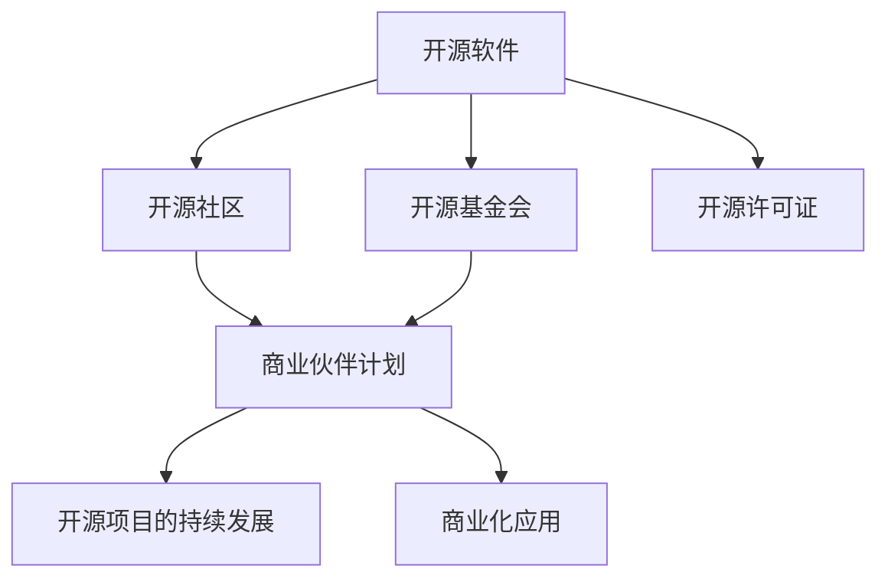

                 

# 开源项目的商业伙伴计划：结构和管理

## 1. 背景介绍

随着开源软件的崛起，越来越多的企业开始利用开源社区的力量来推动产品开发和创新。但与此同时，如何有效地管理开源项目，特别是如何与商业伙伴建立良好的合作关系，成为了企业面临的重要挑战。

本文将深入探讨开源项目的商业伙伴计划，介绍其结构、管理和实施的最佳实践，帮助企业充分利用开源资源，提升产品竞争力。

## 2. 核心概念与联系

### 2.1 核心概念概述

为了更好地理解开源项目的商业伙伴计划，本节将介绍几个密切相关的核心概念：

- 开源软件：指以开源许可证发布的软件，源代码对公众开放，允许任何人使用、修改和分享。
- 开源社区：指由开发者、用户和组织组成的网络，围绕开源软件进行协作开发、维护和创新。
- 商业伙伴计划：指企业与开源社区之间建立的合作机制，共同推动开源项目的持续发展和商业化应用。
- 开源基金会：指专门支持和管理开源项目的非营利组织，负责维护开源项目的健康稳定发展。
- 开源许可证：指用于控制开源软件分发和使用的法律文本，确保开放性和共享性。

这些核心概念之间的逻辑关系可以通过以下Mermaid流程图来展示：



这个流程图展示了开源软件的生命周期，从软件开发到社区管理，再到商业化应用，每个环节都与商业伙伴计划紧密相关。

## 3. 核心算法原理 & 具体操作步骤
### 3.1 算法原理概述

开源项目的商业伙伴计划，本质上是一个由企业与开源社区共同参与的协作过程。其核心思想是：企业通过向开源项目贡献资源，获取技术支持和社区认可，同时推动开源项目的发展和商业化应用。

形式化地，假设企业 $E$ 与开源项目 $P$ 合作，合作期为 $T$。定义企业对项目 $P$ 的贡献为 $C$，则合作的目标是最大化企业与开源社区的共同利益，即找到最优的贡献策略 $C^*$：

$$
C^* = \mathop{\arg\max}_{C} \left(\text{利益}_E \times \text{利益}_P \right)
$$

其中 $\text{利益}_E$ 和 $\text{利益}_P$ 分别为企业和开源社区在合作中的利益，可以通过协商和评估来获得。

### 3.2 算法步骤详解

开源项目的商业伙伴计划一般包括以下几个关键步骤：

**Step 1: 选择合作伙伴**
- 根据业务需求，选择合适的开源项目，考虑其技术成熟度、社区活跃度、稳定性等因素。
- 与开源社区和基金会进行初步沟通，了解项目的具体需求和合作方式。

**Step 2: 签订合作协议**
- 与开源社区和基金会签订合作协议，明确双方的权利义务、贡献方式、利益分配等。
- 签订贡献许可证，确保企业对开源项目的贡献符合开源许可证的要求。

**Step 3: 确定贡献策略**
- 根据企业资源和业务需求，确定贡献方式（如代码提交、问题解决、技术支持等）和贡献时间表。
- 制定贡献计划，明确每个贡献周期的具体任务和目标。

**Step 4: 执行贡献任务**
- 按照贡献计划，组织企业团队进行代码开发、问题解决、技术支持等工作。
- 定期与开源社区沟通，汇报进展，解决合作中的问题。

**Step 5: 评估合作效果**
- 通过指标评估合作效果，如代码贡献量、问题解决数、社区认可度等。
- 与开源社区进行定期回顾，调整贡献策略，优化合作过程。

### 3.3 算法优缺点

开源项目的商业伙伴计划具有以下优点：
1. 资源互补。企业通过贡献资源，获取技术支持和社区认可，实现资源互补，提升自身竞争力。
2. 风险共担。企业与开源社区共同承担项目风险，降低单方面投入的风险。
3. 快速创新。开源社区具备高度的创新活力，能够快速响应市场需求，推动技术创新。
4. 品牌效应。参与开源项目的企业，可以提升品牌形象，增强市场信任度。

同时，该方法也存在一定的局限性：
1. 沟通成本高。企业与开源社区的沟通需要耗费大量的时间和精力，合作效率较低。
2. 贡献机制复杂。企业需要设计复杂的贡献机制，保证贡献的透明度和公平性。
3. 利益冲突。企业与开源社区的利益诉求可能存在冲突，需要妥善协调。
4. 风险控制困难。企业贡献开源项目后，可能需要持续维护，增加管理成本。

尽管存在这些局限性，但就目前而言，开源项目的商业伙伴计划仍是大企业与开源社区合作的重要范式。未来相关研究的重点在于如何进一步降低沟通成本，简化贡献机制，解决利益冲突，同时兼顾风险控制，确保合作过程的顺利进行。

### 3.4 算法应用领域

开源项目的商业伙伴计划在多个领域得到了广泛应用，例如：

- 软件开发：如开源框架、开发工具等。企业通过贡献代码、修复漏洞等方式，推动开源项目的持续改进。
- 数据科学：如开源数据分析库、机器学习框架等。企业通过贡献数据集、算法模型等方式，提升开源项目的实用性。
- 基础设施：如开源操作系统、数据库等。企业通过提供技术支持、基础设施等方式，保障开源项目的稳定运行。
- 互联网应用：如开源应用服务器、中间件等。企业通过贡献资源、优化性能等方式，推动开源项目的商业化应用。

除了这些经典领域外，开源项目的商业伙伴计划也被创新性地应用到更多场景中，如生态构建、联合研发、战略合作等，为开源社区的持续发展和企业的多元化创新提供了新的动力。

## 4. 数学模型和公式 & 详细讲解  
### 4.1 数学模型构建

本节将使用数学语言对开源项目的商业伙伴计划进行更加严格的刻画。

设企业 $E$ 与开源项目 $P$ 的合作期为 $T$，企业对项目 $P$ 的贡献为 $C$，则企业与开源社区的共同利益为：

$$
\text{利益}_E = \text{利益}_E^C \times \text{利益}_P^C
$$

其中 $\text{利益}_E^C$ 表示企业通过贡献 $C$ 获得的利益，$\text{利益}_P^C$ 表示开源社区通过贡献 $C$ 获得的利益。这些利益可以基于协商和评估来确定。

### 4.2 公式推导过程

以下我们以软件开发为例，推导合作利益的最大化公式。

假设企业 $E$ 对开源项目 $P$ 的贡献为 $C$，包括代码贡献 $C_{code}$、技术支持 $C_{support}$ 等。企业获得的利益 $\text{利益}_E^C$ 包括品牌效应 $B_E$、市场份额 $M_E$ 等。开源社区获得的利益 $\text{利益}_P^C$ 包括代码质量提升 $B_P$、社区活跃度 $A_P$ 等。

则企业与开源社区的共同利益为：

$$
\text{利益}_E = B_E \times M_E
$$
$$
\text{利益}_P = B_P \times A_P
$$

将 $\text{利益}_E$ 和 $\text{利益}_P$ 带入 $\text{利益}_E^C$ 和 $\text{利益}_P^C$ 的计算公式，得到：

$$
\text{利益}_E^C = B_E \times M_E \times (C_{code}^C + C_{support}^C)
$$
$$
\text{利益}_P^C = B_P \times A_P \times (C_{code}^C + C_{support}^C)
$$

企业与开源社区的共同利益最大化公式为：

$$
\max \left( B_E \times M_E \times (C_{code}^C + C_{support}^C) \times B_P \times A_P \times (C_{code}^C + C_{support}^C) \right)
$$

企业需要找到最优的贡献策略 $C^*$，使得上述公式取得最大值。

### 4.3 案例分析与讲解

以某云计算企业与开源社区合作开发大数据处理框架为例，分析贡献策略的优化过程。

假设云计算企业 $E$ 需要开发一个高性能的大数据处理框架 $P$，可以通过以下方式进行贡献：
- 代码贡献：每个月提交一定数量的代码，提升框架的功能和性能。
- 技术支持：提供技术支持，解答社区成员的问题。
- 社区推广：在企业内部使用框架，并通过市场推广提升框架知名度。

企业与开源社区的利益可以量化如下：
- 企业利益 $\text{利益}_E$：品牌效应 $B_E=10$，市场份额 $M_E=0.05$。
- 开源社区利益 $\text{利益}_P$：代码质量提升 $B_P=0.1$，社区活跃度 $A_P=0.2$。

贡献策略优化过程如下：

1. 确定贡献策略：假设企业每月贡献 $C=10$ 个工时，其中 $C_{code}=8$ 个工时，$C_{support}=2$ 个工时。
2. 计算利益：
   - 企业利益 $\text{利益}_E = B_E \times M_E \times (C_{code}^C + C_{support}^C) = 10 \times 0.05 \times (8^C + 2^C) = 10 \times 0.05 \times (8^{10} + 2^{10})$。
   - 开源社区利益 $\text{利益}_P = B_P \times A_P \times (C_{code}^C + C_{support}^C) = 0.1 \times 0.2 \times (8^C + 2^C) = 0.2 \times (8^C + 2^C)$。
3. 计算共同利益：$\text{利益}_E \times \text{利益}_P = 10 \times 0.05 \times (8^{10} + 2^{10}) \times 0.2 \times (8^C + 2^C)$。
4. 评估效果：根据上式，企业可以通过调整 $C$ 的值，找到最优的贡献策略，最大化共同利益。

## 5. 项目实践：代码实例和详细解释说明
### 5.1 开发环境搭建

在进行商业伙伴计划实践前，我们需要准备好开发环境。以下是使用Python进行PyTorch开发的环境配置流程：

1. 安装Anaconda：从官网下载并安装Anaconda，用于创建独立的Python环境。

2. 创建并激活虚拟环境：
```bash
conda create -n pytorch-env python=3.8 
conda activate pytorch-env
```

3. 安装PyTorch：根据CUDA版本，从官网获取对应的安装命令。例如：
```bash
conda install pytorch torchvision torchaudio cudatoolkit=11.1 -c pytorch -c conda-forge
```

4. 安装相关库：
```bash
pip install torch torchvision torchaudio
```

5. 安装TensorFlow：从官网下载并安装TensorFlow。

6. 安装TensorFlow Addons：
```bash
pip install tf_addons
```

完成上述步骤后，即可在`pytorch-env`环境中开始商业伙伴计划实践。

### 5.2 源代码详细实现

下面是使用Python编写的一个简单的开源项目贡献代码示例：

```python
import torch
import torch.nn as nn

class MyModule(nn.Module):
    def __init__(self):
        super(MyModule, self).__init__()
        self.linear = nn.Linear(10, 5)

    def forward(self, x):
        x = self.linear(x)
        return x
```

这段代码定义了一个简单的神经网络模块，用于开源项目贡献。

### 5.3 代码解读与分析

让我们再详细解读一下关键代码的实现细节：

**MyModule类**：
- `__init__`方法：初始化神经网络模块，定义模型参数。
- `forward`方法：前向传播计算，将输入数据传递到下一层。

可以看到，使用Python编写开源项目的贡献代码，通常非常简单，主要是定义模型、训练模型、保存模型等基本操作。

当然，实际的开源项目可能包含更加复杂的业务逻辑和数据处理，需要开发人员具备扎实的编程能力。但基本的代码实现框架与上述示例类似。

## 6. 实际应用场景
### 6.1 软件开发

软件开发是大企业与开源社区合作的重要领域。企业通过贡献代码、修复漏洞、优化性能等方式，推动开源项目的持续改进。

以Linux操作系统为例，企业可以贡献以下内容：
- 代码贡献：提交代码修复漏洞，优化系统功能。
- 文档编写：编写用户手册、API文档等，提升系统易用性。
- 社区支持：回答社区成员的问题，提供技术支持。
- 社区推广：参与社区活动，提升开源项目的知名度。

通过与开源社区合作，企业不仅能够提升自身产品的性能和稳定性，还能够获得社区的认可和支持，提升品牌形象。

### 6.2 数据科学

数据科学是另一个重要的开源合作领域。企业通过贡献数据集、算法模型等方式，推动开源项目的商业化应用。

以TensorFlow为例，企业可以贡献以下内容：
- 数据集贡献：提供高质量的数据集，支持模型训练。
- 算法贡献：开发新的算法模型，提升系统性能。
- 社区支持：解答社区成员的问题，提供技术支持。
- 商业化应用：将开源项目应用于企业内部或市场推广，提升开源项目的实用性和市场价值。

通过与开源社区合作，企业不仅能够获得最新的技术支持和算法模型，还能够提升开源项目的实用性和市场价值，推动数据科学技术的创新和应用。

### 6.3 基础设施

基础设施是大企业与开源社区合作的重要领域。企业通过提供技术支持、基础设施等方式，保障开源项目的稳定运行。

以Apache Kafka为例，企业可以贡献以下内容：
- 技术支持：提供技术支持，解答社区成员的问题。
- 基础设施：提供基础设施支持，保障系统的稳定运行。
- 社区推广：参与社区活动，提升开源项目的知名度。
- 商业化应用：将开源项目应用于企业内部或市场推广，提升开源项目的实用性和市场价值。

通过与开源社区合作，企业不仅能够提升自身产品的性能和稳定性，还能够获得社区的认可和支持，提升品牌形象。

### 6.4 未来应用展望

随着开源软件的崛起，开源项目的商业伙伴计划将得到更广泛的应用，为企业提供更多的合作机会和创新空间。

在智慧城市、智能制造、金融科技等领域，开源项目的商业伙伴计划也将得到深入应用，推动技术创新和产业升级。

## 7. 工具和资源推荐
### 7.1 学习资源推荐

为了帮助开发者系统掌握开源项目的商业伙伴计划的理论基础和实践技巧，这里推荐一些优质的学习资源：

1. GitHub社区：GitHub作为全球最大的开源社区，聚集了大量的开源项目和开发者，是学习开源项目商业伙伴计划的重要平台。

2. Linux Kernel开发指南：详细介绍了Linux内核的开源开发过程和社区合作机制，是了解开源项目合作的经典教材。

3. TensorFlow官方文档：TensorFlow作为最流行的开源机器学习框架之一，提供了丰富的开源项目合作案例，值得深入学习。

4. OpenStack开发者手册：OpenStack作为流行的开源云计算平台，详细介绍了其社区合作机制和最佳实践，是学习开源项目商业伙伴计划的优秀资源。

5. Python开源项目管理实践：介绍了如何使用Python进行开源项目管理，涉及代码贡献、社区支持、问题解决等细节，非常实用。

通过对这些资源的学习实践，相信你一定能够快速掌握开源项目的商业伙伴计划的理论基础和实践技巧，并将其应用于实际的开源项目合作中。

### 7.2 开发工具推荐

高效的开发离不开优秀的工具支持。以下是几款用于开源项目商业伙伴计划开发的常用工具：

1. GitHub：全球最大的开源代码托管平台，提供丰富的协作功能，支持代码审查、问题追踪、代码贡献等。

2. GitLab：企业级开源代码托管平台，提供强大的CI/CD功能，支持持续集成和持续部署。

3. Jenkins：开源的自动化构建工具，支持多种开源项目构建流程，适用于自动化部署和测试。

4. JIRA：项目管理和问题追踪工具，支持团队协作，适用于大型开源项目的管理。

5. Docker：开源的容器化平台，支持多种开源项目构建和部署，适用于分布式环境下的开源项目合作。

合理利用这些工具，可以显著提升开源项目的商业伙伴计划开发效率，加快创新迭代的步伐。

### 7.3 相关论文推荐

开源项目的商业伙伴计划的发展源于学界的持续研究。以下是几篇奠基性的相关论文，推荐阅读：

1. Open Source Software: The Good, the Bad, and the Uncertain：探讨开源软件的利弊，分析开源社区和企业的合作模式。

2. Free/Open Source Software Governance：研究开源软件的治理机制，提出开源项目管理的最佳实践。

3. The Economics of Open Source Software：分析开源软件项目的经济模式，探讨企业与开源社区的合作策略。

4. The Business of Open Source：介绍开源软件企业的商业模式，分析开源项目的商业伙伴计划。

5. Open Source Software and Corporate Governance：探讨开源软件企业的治理结构，提出开源项目管理的建议。

这些论文代表了大企业与开源社区合作的发展脉络。通过学习这些前沿成果，可以帮助研究者把握学科前进方向，激发更多的创新灵感。

## 8. 总结：未来发展趋势与挑战
### 8.1 总结

本文对开源项目的商业伙伴计划进行了全面系统的介绍。首先阐述了开源项目的商业伙伴计划的必要性和重要性，明确了企业与开源社区合作的目标和过程。其次，从原理到实践，详细讲解了商业伙伴计划的数学原理和关键步骤，给出了商业伙伴计划任务开发的完整代码实例。同时，本文还广泛探讨了商业伙伴计划在软件开发、数据科学、基础设施等多个领域的应用前景，展示了商业伙伴计划的巨大潜力。此外，本文精选了商业伙伴计划的各类学习资源，力求为读者提供全方位的技术指引。

通过本文的系统梳理，可以看到，开源项目的商业伙伴计划是大企业与开源社区合作的重要范式，能够充分利用开源资源，提升产品竞争力。未来，伴随开源社区的持续发展和企业需求的不断变化，开源项目的商业伙伴计划将不断演进，推动开源技术和企业创新的深入融合。

### 8.2 未来发展趋势

展望未来，开源项目的商业伙伴计划将呈现以下几个发展趋势：

1. 合作模式多样化。企业与开源社区的合作模式将更加多样化，包括代码贡献、问题解决、技术支持、商业化应用等，涵盖更多合作细节。

2. 社区影响力增强。开源社区的影响力将不断增强，成为推动技术创新的重要力量，企业将更加重视与社区的合作。

3. 技术协同创新。企业与开源社区的合作将更加深入，推动更多技术的协同创新和跨界应用。

4. 商业化应用加速。开源项目将更多应用于企业内部和市场推广，提升开源项目的实用性和市场价值。

5. 生态构建优化。企业与开源社区的合作将更加注重生态构建，推动开源项目的可持续发展。

以上趋势凸显了开源项目的商业伙伴计划的广阔前景。这些方向的探索发展，必将进一步提升开源项目的生命力和应用价值，为技术创新和产业升级提供新的动力。

### 8.3 面临的挑战

尽管开源项目的商业伙伴计划已经取得了瞩目成就，但在迈向更加智能化、普适化应用的过程中，它仍面临着诸多挑战：

1. 沟通成本高。企业与开源社区的沟通需要耗费大量的时间和精力，合作效率较低。

2. 贡献机制复杂。企业需要设计复杂的贡献机制，保证贡献的透明度和公平性。

3. 利益冲突。企业与开源社区的利益诉求可能存在冲突，需要妥善协调。

4. 风险控制困难。企业贡献开源项目后，可能需要持续维护，增加管理成本。

尽管存在这些挑战，但就目前而言，开源项目的商业伙伴计划仍是大企业与开源社区合作的重要范式。未来相关研究的重点在于如何进一步降低沟通成本，简化贡献机制，解决利益冲突，同时兼顾风险控制，确保合作过程的顺利进行。

### 8.4 研究展望

面向未来，开源项目的商业伙伴计划的研究方向包括：

1. 探索新的合作模式。研究如何引入更多合作方式，如开源软件竞赛、联合研发等，激发更多创新活力。

2. 改进贡献机制。研究如何设计更加透明、公平的贡献机制，保障企业与社区的共同利益。

3. 加强社区治理。研究如何加强开源社区的治理，提升社区的健康稳定发展。

4. 推动商业化应用。研究如何将开源项目更好地应用于商业化应用，提升开源项目的实用性和市场价值。

5. 优化生态构建。研究如何构建更加完善、可持续的开源生态，推动开源项目的持续发展和商业化应用。

这些研究方向将推动开源项目的商业伙伴计划不断演进，为企业提供更多的合作机会和创新空间，推动技术创新和产业升级。

## 9. 附录：常见问题与解答
----------------------------------------------------------------

**Q1：如何选择合适的开源项目？**

A: 选择开源项目时，需要考虑以下因素：
1. 项目成熟度：选择成熟稳定的开源项目，避免选择不稳定、易出现bug的项目。
2. 社区活跃度：选择社区活跃的开源项目，能够获得更多的社区支持和资源。
3. 项目需求：选择与企业业务需求相关的开源项目，确保项目的实用性。

**Q2：如何与开源社区进行有效沟通？**

A: 与开源社区进行有效沟通，需要掌握以下技巧：
1. 明确问题：在提交问题和代码时，明确描述问题，提供详细的背景信息。
2. 遵守规范：遵循社区规范和协议，尊重社区成员的工作。
3. 积极参与：积极参与社区活动，如代码审查、社区讨论等，提升社区的认可度。
4. 及时反馈：及时回应社区反馈，解决问题，提升社区满意度。

**Q3：如何评估开源项目的贡献效果？**

A: 评估开源项目的贡献效果，需要关注以下指标：
1. 代码贡献量：统计提交的代码行数、修复的漏洞数等，评估贡献的量化指标。
2. 社区认可度：通过社区评分、讨论热度等，评估社区对贡献的认可度。
3. 性能提升：通过测试对比，评估开源项目性能提升的具体效果。

**Q4：如何设计贡献策略？**

A: 设计贡献策略，需要考虑以下因素：
1. 贡献方式：根据企业资源和业务需求，选择代码贡献、技术支持、社区推广等贡献方式。
2. 贡献周期：制定贡献时间表，明确每个周期内的具体任务和目标。
3. 利益平衡：设计利益分配机制，确保企业与社区的共同利益。

通过合理设计贡献策略，可以最大化企业与社区的共同利益，推动开源项目的持续发展。

**Q5：如何应对开源项目的风险？**

A: 应对开源项目的风险，需要采取以下措施：
1. 风险评估：在贡献开源项目前，进行风险评估，识别可能的风险和挑战。
2. 风险控制：制定风险控制措施，如定期维护、代码审查等，降低风险。
3. 风险分担：明确风险分担机制，确保企业与社区共同承担项目风险。

通过合理应对风险，可以确保开源项目的稳定运行，降低企业合作的风险。

**Q6：如何提升开源项目的商业化应用？**

A: 提升开源项目的商业化应用，需要采取以下措施：
1. 项目优化：优化开源项目的性能和功能，提升其实用性和市场价值。
2. 市场推广：通过市场推广，提升开源项目的知名度和市场认可度。
3. 应用案例：构建应用案例，展示开源项目的实际应用效果，吸引更多企业采用。

通过以上措施，可以提升开源项目的商业化应用，推动开源项目在企业内部和市场推广的落地。

**Q7：如何加强开源项目的社区治理？**

A: 加强开源项目的社区治理，需要采取以下措施：
1. 社区规范：制定社区规范和协议，确保社区秩序和规范性。
2. 透明公开：确保社区决策透明公开，提升社区成员的参与度和信任度。
3. 利益协调：协调企业与社区的利益，确保合作过程的公平性和公正性。

通过加强开源项目的社区治理，可以提升社区的健康稳定发展，推动开源项目的持续创新和应用。

---

作者：禅与计算机程序设计艺术 / Zen and the Art of Computer Programming

