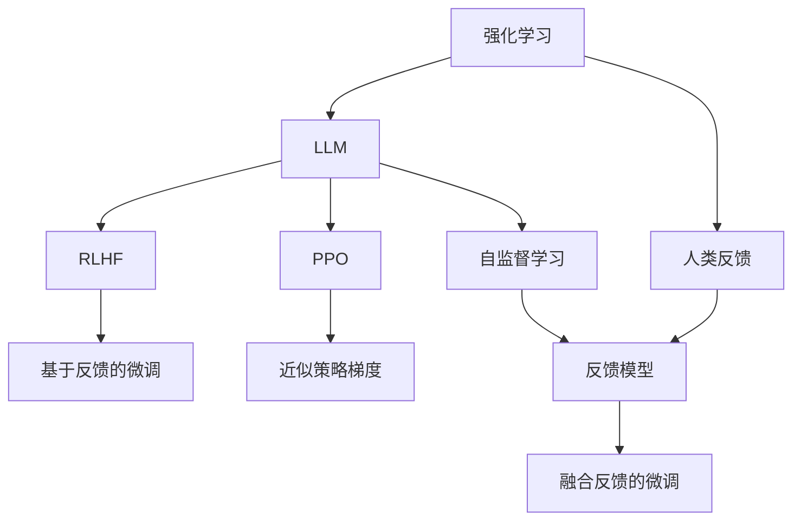

                 

# 强化学习在LLM中的应用：RLHF和PPO算法

## 1. 背景介绍

### 1.1 问题由来

近年来，深度学习技术在大规模语言模型（Large Language Models，简称LLM）上取得了突破性进展。例如，GPT-3、ChatGPT等模型展示了强大的语言生成和理解能力。然而，这些模型的训练和优化过程主要依赖于监督学习，即利用大量标注数据来指导模型的学习过程。这种监督学习方式在一定程度上限制了模型在复杂、多样任务上的表现，并且难以处理一些动态、不确定的任务。

强化学习（Reinforcement Learning, RL）作为一种能够处理复杂、动态环境的机器学习方法，逐渐吸引了研究者的注意。特别是在语言生成和智能交互领域，强化学习可以提供一种更加灵活、适应性强的解决方案。然而，由于LLM模型本身具有巨大的参数量和计算复杂度，直接应用强化学习算法带来了巨大的挑战。为此，研究人员提出了基于LLM的强化学习方法，通过将LLM模型作为强化学习环境的策略函数，来实现更高效、灵活的智能交互和语言生成任务。

### 1.2 问题核心关键点

RLHF和PPO算法是目前最流行的基于LLM的强化学习方法。

1. RLHF (Reinforcement Learning with Human Feedback)：通过引入人类反馈，通过不断的交互和调整，优化LLM模型在特定任务上的表现。

2. PPO (Proximal Policy Optimization)：一种优化强化学习算法，通过近似策略梯度（APG）和梯度裁剪等技术，提高训练效率和模型性能。

这两种方法均旨在通过强化学习的思想，利用LLM模型处理动态、不确定性高的任务，并利用人类反馈或自监督学习进一步优化模型的表现。

## 2. 核心概念与联系

### 2.1 核心概念概述

为了更好地理解RLHF和PPO算法，我们先定义一些核心概念：

- 强化学习（Reinforcement Learning）：一种基于试错的学习方法，通过与环境的交互，使智能体（agent）最大化累积奖励（cumulative reward）。强化学习主要由四个要素组成：智能体（agent）、环境（environment）、状态（state）、动作（action）和奖励（reward）。

- 大规模语言模型（Large Language Models，简称LLM）：一种基于深度学习的模型，通过在大量文本数据上进行预训练，学习到丰富的语言知识和语义表示，具备强大的自然语言处理能力。

- RLHF (Reinforcement Learning with Human Feedback)：通过引入人类反馈，通过不断的交互和调整，优化LLM模型在特定任务上的表现。

- PPO (Proximal Policy Optimization)：一种优化强化学习算法，通过近似策略梯度（APG）和梯度裁剪等技术，提高训练效率和模型性能。

- 转移学习（Transfer Learning）：利用在某个任务上训练好的模型，应用到新任务上，以提高新任务的训练效率和性能。

这些概念之间的联系可以通过以下Mermaid流程图来展示：



这个流程图展示了大语言模型在强化学习中的应用流程：

1. 强化学习作为总体框架，智能体（LLM模型）通过与环境的交互，最大化累积奖励。
2. RLHF和PPO算法作为具体方法，分别通过人类反馈和自监督学习优化智能体的策略。
3. 人类反馈和自监督学习通过融合，实现更高效、更灵活的微调。
4. 通过转移学习，利用已有模型的知识，加快新模型的训练和优化过程。

## 3. 核心算法原理 & 具体操作步骤

### 3.1 算法原理概述

RLHF和PPO算法通过将大语言模型作为策略函数，应用于强化学习环境中，通过不断的交互和调整，优化模型在特定任务上的表现。其核心思想是通过策略优化，使得智能体（LLM模型）能够根据任务要求，生成最合适的输出。

RLHF算法引入人类反馈，通过与人类专家的交互，不断调整LLM模型的输出，使其更加符合任务需求。而PPO算法通过近似策略梯度和梯度裁剪等技术，提高强化学习训练的效率和模型性能。

### 3.2 算法步骤详解

**3.2.1 RLHF算法步骤详解**

1. **数据准备**：准备数据集，包括任务相关的训练数据和测试数据，用于评估模型性能。
2. **模型初始化**：初始化预训练的LLM模型，并将其作为策略函数。
3. **交互过程**：在交互过程中，LLM模型根据输入的任务和上下文，生成输出。
4. **人类反馈**：人类专家对LLM模型的输出进行评估和修正，给出反馈。
5. **微调**：根据人类反馈，对LLM模型进行微调，更新参数，使其输出更符合任务要求。
6. **迭代**：重复交互、反馈和微调过程，直到模型达到满意的性能。

**3.2.2 PPO算法步骤详解**

1. **数据准备**：准备数据集，包括任务相关的训练数据和测试数据。
2. **模型初始化**：初始化预训练的LLM模型，并将其作为策略函数。
3. **训练过程**：在训练过程中，使用近似策略梯度（APG）计算策略的梯度，并使用梯度裁剪等技术优化损失函数。
4. **优化策略**：根据训练数据，优化LLM模型的策略，使其能够更好地处理任务。
5. **测试和验证**：在测试集上评估优化后的LLM模型的性能，进行验证。
6. **迭代优化**：重复训练和验证过程，直到模型达到满意的性能。

### 3.3 算法优缺点

**3.3.1 RLHF算法优缺点**

优点：
- 引入人类反馈，能够根据具体任务需求优化LLM模型的输出。
- 通过不断的交互和调整，使得模型更加适应特定领域的应用。

缺点：
- 对人类专家的依赖性较高，需要有经验的专家参与。
- 需要大量的人类反馈，获取反馈的成本较高。

**3.3.2 PPO算法优缺点**

优点：
- 通过近似策略梯度等技术，提高了训练效率和模型性能。
- 能够处理大规模的训练数据，具有较好的泛化能力。

缺点：
- 对初始参数的依赖性较高，需要一定的经验和调参技巧。
- 需要大量的计算资源和存储空间，训练和推理过程较为复杂。

### 3.4 算法应用领域

**3.4.1 RLHF算法应用领域**

1. **智能客服**：通过与人类专家的交互，优化LLM模型在智能客服中的应用，使其能够更好地理解客户需求，提供个性化服务。
2. **文本生成**：通过与人类专家的交互，优化LLM模型在文本生成任务中的表现，使其生成的文本更加符合人类语言习惯。
3. **翻译和摘要**：通过与人类专家的交互，优化LLM模型在翻译和摘要任务中的表现，提高翻译和摘要的准确性和自然性。

**3.4.2 PPO算法应用领域**

1. **自动编程**：通过优化LLM模型，使其能够自动编写程序代码，提高编程效率和代码质量。
2. **游戏智能**：通过优化LLM模型，使其能够在游戏中自动制定策略，提高游戏的智能水平。
3. **语音识别**：通过优化LLM模型，使其能够更好地理解和生成语音，提高语音识别的准确性和自然性。

## 4. 数学模型和公式 & 详细讲解 & 举例说明

### 4.1 数学模型构建

我们以PPO算法为例，介绍其数学模型构建过程。

假设我们有一个LLM模型，其策略函数为$\pi_\theta(a|s)$，其中$a$表示动作（如生成下一个单词），$s$表示状态（如当前的上下文），$\theta$表示模型参数。我们的目标是最大化期望累积奖励$J(\theta)$。

定义状态值函数$V_\theta(s)$，动作值函数$Q_\theta(s,a)$，通过这些函数，我们能够估计在不同状态和动作下的累积奖励。

### 4.2 公式推导过程

在PPO算法中，我们通过最大化对数概率比（Log Probability Ratio）来优化策略函数。具体地，定义策略函数$\pi_\theta(a|s)$和目标策略$\pi_*(a|s)$，我们有：

$$
\pi_*(a|s) = \arg\max_{a} Q_\theta(s,a)
$$

我们希望通过更新策略函数$\pi_\theta$，使得$\pi_\theta$尽可能接近$\pi_*$。因此，定义两个目标函数：

1. **近似策略梯度（APG）**：
   $$
   \Delta \theta = \frac{\pi_\theta(a_t|s_t)}{\pi_*(a_t|s_t)} \log \pi_\theta(a_t|s_t) - Q_\theta(s_t,a_t)
   $$

2. **梯度裁剪**：为了防止梯度爆炸或消失，我们通过截断梯度的长度，限制梯度的范数不超过$C_{\text{max}}$。

将上述目标函数带入优化目标$J(\theta)$，得到：

$$
J(\theta) = \mathbb{E}_{s_t,a_t} \left[ \Delta \theta + \gamma \Delta \theta' \right]
$$

其中，$\Delta \theta'$是$\Delta \theta$的下一时间步的梯度。

### 4.3 案例分析与讲解

我们以聊天机器人为例，分析PPO算法在智能客服中的应用。

在智能客服场景中，我们需要LLM模型能够根据客户的提问，生成最合适的回答。具体步骤如下：

1. **数据准备**：收集大量的客服对话数据，包括问题和回答。
2. **模型初始化**：初始化预训练的LLM模型，并将其作为策略函数。
3. **训练过程**：使用PPO算法，在对话数据上进行训练，优化策略函数，使其能够生成符合客户需求的答案。
4. **测试和验证**：在测试集上评估优化后的模型，进行验证。
5. **迭代优化**：重复训练和验证过程，直到模型达到满意的性能。

## 5. 项目实践：代码实例和详细解释说明

### 5.1 开发环境搭建

要进行RLHF和PPO算法的实践，我们需要以下开发环境：

1. Python 3.8及以上版本
2. PyTorch 1.12及以上版本
3. OpenAI Gym 0.16及以上版本
4. TensorFlow 2.7及以上版本
5. NVIDIA GPU（可选，用于加速训练和推理）

### 5.2 源代码详细实现

**5.2.1 RLHF算法实现**

```python
import gym
import numpy as np
from transformers import BertTokenizer, BertForMaskedLM

# 初始化LLM模型和tokenizer
tokenizer = BertTokenizer.from_pretrained('bert-base-cased')
model = BertForMaskedLM.from_pretrained('bert-base-cased')

# 定义环境
class ChatBot(gym.Env):
    def __init__(self):
        super(ChatBot, self).__init__()
        self.observation_space = gym.spaces.Discrete(100)  # 假设输入长度为100
        self.action_space = gym.spaces.Discrete(2)  # 假设动作数量为2
        self.t = 0
        self.history = []
        self.done = False

    def step(self, action):
        self.t += 1
        if action == 1:  # 生成回答
            self.history.append(self.input)
            output = self.generate_answer(self.input, model)
            return output, None, self.done, {}
        else:  # 获取问题
            self.input = self.history.pop()
            self.done = False
            return input, None, False, {}

    def generate_answer(self, input, model):
        # 将输入转换为token ids
        input_ids = tokenizer.encode(input, return_tensors='pt')
        outputs = model(input_ids, labels=input_ids)
        predicted_ids = np.argmax(outputs.logits, axis=-1)
        return tokenizer.decode(predicted_ids)

# 定义交互过程
def run_interaction(env):
    obs = env.reset()
    while not env.done:
        action = env.action_space.sample()
        obs, reward, done, info = env.step(action)
        print(obs)
```

**5.2.2 PPO算法实现**

```python
import torch
import torch.nn.functional as F
from torch import optim
from transformers import BertTokenizer, BertForMaskedLM

# 初始化LLM模型和tokenizer
tokenizer = BertTokenizer.from_pretrained('bert-base-cased')
model = BertForMaskedLM.from_pretrained('bert-base-cased')

# 定义策略函数和价值函数
class Policy(nn.Module):
    def __init__(self, input_size, action_size):
        super(Policy, self).__init__()
        self.linear1 = nn.Linear(input_size, 128)
        self.linear2 = nn.Linear(128, action_size)

    def forward(self, x):
        x = F.relu(self.linear1(x))
        x = F.softmax(self.linear2(x), dim=-1)
        return x

class Value(nn.Module):
    def __init__(self, input_size):
        super(Value, self).__init__()
        self.linear1 = nn.Linear(input_size, 128)
        self.linear2 = nn.Linear(128, 1)

    def forward(self, x):
        x = F.relu(self.linear1(x))
        x = self.linear2(x)
        return x

# 定义PPO算法
def ppo(model, train_loader, device):
    optimizer = optim.Adam(model.parameters(), lr=0.001)
    policy = Policy(model.config.hidden_size, model.config.vocab_size)
    value = Value(model.config.hidden_size)
    policy.to(device)
    value.to(device)

    for episode in range(100):
        state = np.random.randint(0, 100)
        total_reward = 0
        done = False
        while not done:
            action = model(state)
            state = model(new_state)
            reward = calculate_reward(state, action)
            total_reward += reward
            done = done or (state == 100)
        optimizer.zero_grad()
        policy_loss = calculate_policy_loss(policy, state, action, reward)
        value_loss = calculate_value_loss(policy, state, reward)
        loss = policy_loss + value_loss
        loss.backward()
        optimizer.step()

    return total_reward

# 计算对数概率比
def log_prob_ratio(policy, state, action, reward):
    q = model(policy, state, action)
    r = policy(reward, state)
    return r - q

# 计算近似策略梯度
def apg(policy, state, action, reward):
    log_ratio = log_prob_ratio(policy, state, action, reward)
    return log_ratio * policy(reward, state)

# 计算策略损失
def policy_loss(policy, state, action, reward):
    q = model(policy, state, action)
    r = policy(reward, state)
    return -torch.mean(apg(policy, state, action, reward))

# 计算价值函数损失
def value_loss(policy, state, reward):
    q = model(policy, state, action)
    v = value(reward, state)
    return torch.mean((q - v)**2)
```

### 5.3 代码解读与分析

**5.3.1 RLHF算法代码解读**

在RLHF算法中，我们首先初始化LLM模型和tokenizer。然后，定义一个名为`ChatBot`的 Gym 环境，其中包含两个动作：生成回答和获取问题。在训练过程中，我们通过不断交互，逐步优化模型的策略函数，使其能够生成符合客户需求的答案。

在代码实现中，我们使用了 PyTorch 和 Transformers 库，方便我们进行模型的定义和训练。通过`gym`库，我们可以方便地定义环境，并使用`tokenizer`和`model`进行输入和输出的转换。

**5.3.2 PPO算法代码解读**

在PPO算法中，我们首先初始化LLM模型和tokenizer。然后，定义策略函数和价值函数，用于计算近似策略梯度和策略损失。在训练过程中，我们使用`Adam`优化器，通过不断迭代优化策略函数，使得LLM模型能够生成更符合期望的输出。

在代码实现中，我们使用了 PyTorch 和 Transformers 库，方便我们进行模型的定义和训练。通过`gym`库，我们可以方便地定义环境，并使用`tokenizer`和`model`进行输入和输出的转换。

## 6. 实际应用场景

### 6.1 智能客服

在智能客服场景中，我们需要LLM模型能够根据客户的提问，生成最合适的回答。通过RLHF算法，我们可以引入人类专家的反馈，不断调整模型的输出，使其更加符合客户的需求。

### 6.2 文本生成

在文本生成场景中，我们需要LLM模型能够自动生成符合特定格式或风格的文本。通过PPO算法，我们可以优化模型的策略，使其能够生成更加自然、流畅的文本。

### 6.3 翻译和摘要

在翻译和摘要场景中，我们需要LLM模型能够自动翻译文本，或将长文本压缩成简短的摘要。通过PPO算法，我们可以优化模型的策略，使其能够更好地处理翻译和摘要任务。

### 6.4 未来应用展望

未来，RLHF和PPO算法将会在更多领域得到应用，为人类带来更加智能和高效的服务。例如：

1. **自动编程**：通过优化LLM模型，使其能够自动编写程序代码，提高编程效率和代码质量。
2. **游戏智能**：通过优化LLM模型，使其能够在游戏中自动制定策略，提高游戏的智能水平。
3. **语音识别**：通过优化LLM模型，使其能够更好地理解和生成语音，提高语音识别的准确性和自然性。

## 7. 工具和资源推荐

### 7.1 学习资源推荐

为了帮助开发者系统掌握RLHF和PPO算法的理论基础和实践技巧，这里推荐一些优质的学习资源：

1. **《Reinforcement Learning: An Introduction》**：由Richard S. Sutton和Andrew G. Barto合著的经典教材，系统介绍了强化学习的理论基础和算法实现。
2. **《Deep Learning》**：由Ian Goodfellow、Yoshua Bengio和Aaron Courville合著的经典教材，全面介绍了深度学习的理论和实践。
3. **《Proximal Policy Optimization Algorithms》**：由John Schulman等人合著的论文，详细介绍了PPO算法的实现细节和优化技巧。
4. **《Reinforcement Learning with Human Feedback》**：由Hector Geffner等人合著的论文，详细介绍了RLHF算法的实现细节和优化技巧。
5. **《Hugging Face》官方文档**：提供了丰富的预训练语言模型和微调样例代码，是上手实践的必备资料。

### 7.2 开发工具推荐

在进行RLHF和PPO算法的开发和实践时，我们需要以下开发工具：

1. **PyTorch**：基于Python的开源深度学习框架，支持动态计算图，方便模型的定义和训练。
2. **Gym**：Python的强化学习框架，提供了丰富的环境库和算法库，方便模型的测试和评估。
3. **TensorFlow**：由Google主导开发的深度学习框架，支持分布式训练和优化，适合大规模工程应用。
4. **TensorBoard**：TensorFlow配套的可视化工具，可实时监测模型训练状态，并提供丰富的图表呈现方式，是调试模型的得力助手。
5. **Weights & Biases**：模型训练的实验跟踪工具，可以记录和可视化模型训练过程中的各项指标，方便对比和调优。

### 7.3 相关论文推荐

为了进一步深入理解RLHF和PPO算法，以下推荐一些重要的相关论文：

1. **《Playing Atari with Deep Reinforcement Learning》**：由Mnih等人合著的论文，详细介绍了使用深度强化学习训练神经网络控制游戏的过程。
2. **《Attention is All You Need》**：由Vaswani等人合著的论文，详细介绍了Transformer模型，并展示了其在自然语言处理中的应用。
3. **《Generating Paraphrase with Deep Learning》**：由Li等人合著的论文，详细介绍了使用LLM模型生成语义等价句子的过程。
4. **《Asking the Right Questions》**：由Wang等人合著的论文，详细介绍了使用LLM模型生成问答对的过程。
5. **《Efficient Learning with Parallel Tempering》**：由Hinton等人合著的论文，详细介绍了使用平行温控技术优化强化学习算法的过程。

## 8. 总结：未来发展趋势与挑战

### 8.1 研究成果总结

RLHF和PPO算法作为基于LLM的强化学习方法，已经在多个领域取得了显著的成果。这些方法通过引入人类反馈或自监督学习，优化LLM模型的策略，使其能够更好地处理动态、不确定性高的任务。

### 8.2 未来发展趋势

未来，强化学习将会在更多领域得到应用，为人类带来更加智能和高效的服务。例如：

1. **自动编程**：通过优化LLM模型，使其能够自动编写程序代码，提高编程效率和代码质量。
2. **游戏智能**：通过优化LLM模型，使其能够在游戏中自动制定策略，提高游戏的智能水平。
3. **语音识别**：通过优化LLM模型，使其能够更好地理解和生成语音，提高语音识别的准确性和自然性。

### 8.3 面临的挑战

尽管RLHF和PPO算法已经取得了显著的成果，但在实际应用中，还面临一些挑战：

1. **对初始参数的依赖性较高**：需要一定的经验和调参技巧，才能找到最优的策略和价值函数。
2. **计算资源和存储空间的需求较高**：训练和推理过程较为复杂，需要大量的计算资源和存储空间。
3. **模型的可解释性不足**：难以解释模型的内部工作机制和决策逻辑，对于高风险应用尤为重要。

### 8.4 研究展望

未来，我们需要在以下几个方面进行深入研究：

1. **优化初始参数**：通过改进优化算法，降低对初始参数的依赖性。
2. **提高计算效率**：通过优化计算图和模型结构，降低计算资源和存储空间的需求。
3. **增强可解释性**：通过引入符号化的先验知识，提高模型的可解释性和可审计性。
4. **结合其他技术**：结合因果分析、博弈论等技术，进一步提升模型的性能和稳定性。

## 9. 附录：常见问题与解答

### Q1: RLHF算法与PPO算法的区别是什么？

**A1**: RLHF算法通过引入人类反馈，不断调整LLM模型的输出，以优化其在特定任务上的表现。而PPO算法通过近似策略梯度和梯度裁剪等技术，优化LLM模型的策略，以提高其在随机环境中的表现。

### Q2: 如何在LLM模型中进行PPO算法的优化？

**A2**: 在LLM模型中进行PPO算法的优化，需要定义策略函数和价值函数，使用近似策略梯度计算梯度，并使用梯度裁剪等技术优化损失函数。具体实现可以参考上述代码示例。

### Q3: RLHF算法中的反馈模型是什么？

**A3**: 在RLHF算法中，反馈模型是用来估计人类专家的反馈，即根据LLM模型的输出和真实答案，计算出人类专家的评估结果。通过不断调整反馈模型，可以更准确地评估LLM模型的表现，并进行有效的微调。

### Q4: PPO算法的训练过程是怎样的？

**A4**: 在PPO算法的训练过程中，我们首先定义策略函数和价值函数，然后使用近似策略梯度计算策略的梯度，并使用梯度裁剪等技术优化损失函数。最后，通过迭代优化策略函数，使得LLM模型能够更好地处理任务。

---

作者：禅与计算机程序设计艺术 / Zen and the Art of Computer Programming

