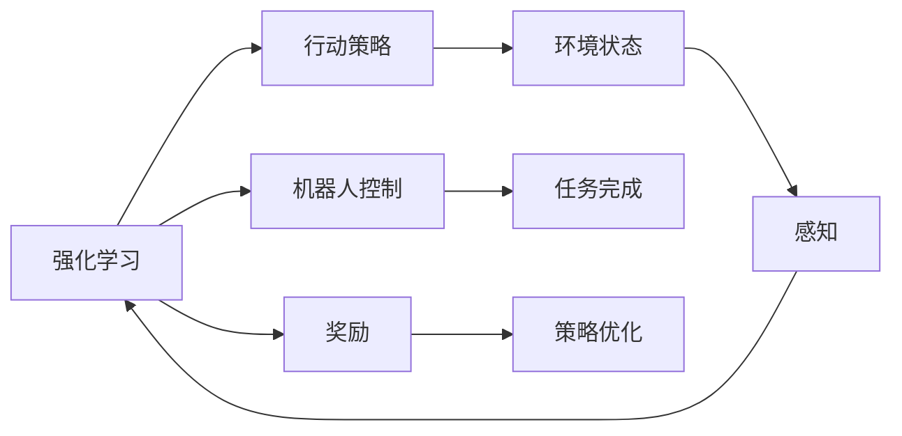

                 

# 强化学习在机器人控制中的应用

## 1. 背景介绍

强化学习（Reinforcement Learning, RL）作为一种机器学习方法，近年来在机器人控制领域逐渐成为主流。与传统的基于规则的机器人控制方法不同，强化学习允许机器人通过与环境交互，学习最优的行动策略，从而实现自主的决策和行动。这种自适应的能力，使强化学习在处理复杂环境、不确定性高、目标模糊的任务中表现出卓越的性能。本文将详细探讨强化学习在机器人控制中的应用，包括其核心概念、算法原理、具体操作步骤，以及实际应用场景和未来发展趋势。

## 2. 核心概念与联系

### 2.1 核心概念概述

为了更好地理解强化学习在机器人控制中的应用，我们首先介绍几个核心概念：

- 强化学习（Reinforcement Learning, RL）：一种通过智能体与环境的交互，学习最优行动策略的机器学习方法。智能体（Agent）通过观察环境状态，执行行动，并获得奖励，逐步优化行动策略。
- 机器人控制（Robot Control）：使机器人能够执行特定任务的过程，包括路径规划、避障、抓取、操作等。传统控制方法依赖于精确的模型和预设的规则，而强化学习则通过与环境交互，自主学习最优控制策略。
- 连续控制（Continuous Control）：当机器人需要连续的行动空间（如手臂位置、电机速度等）时，机器人控制问题通常转化为连续控制问题，其中行动空间的连续性增加了问题的复杂性。
- 离散控制（Discrete Control）：当机器人执行离散的、有限数目的动作时，如按键操作、开关状态等，问题可以被简化为离散控制问题，通常更容易求解。

### 2.2 核心概念联系

强化学习与机器人控制之间的联系可以通过以下Mermaid流程图来展示：



这个流程图展示了强化学习在机器人控制中的核心流程：

1. 强化学习系统通过感知环境状态，执行行动，并获得环境反馈的奖励。
2. 通过观察行动和奖励的互动，系统逐步优化行动策略，实现任务完成。
3. 环境状态感知和行动执行通过机器人控制算法实现。

这种自适应的控制方式，使强化学习能够灵活应对各种复杂环境，并在没有明确规则的情况下，实现高效的自主控制。

## 3. 核心算法原理 & 具体操作步骤

### 3.1 算法原理概述

强化学习的核心目标是学习一个策略 $\pi(a|s)$，该策略能够在给定环境状态 $s$ 下，选择最优的行动 $a$。数学上，我们可以使用概率密度函数 $\pi(a|s)$ 来描述这一关系。

强化学习通常遵循以下四个基本要素：

1. **环境状态**：机器人控制问题中的环境状态可以是连续的（如手臂位置）或离散的（如开关状态）。
2. **行动空间**：机器人可执行的行动集合，可以是连续的（如电机速度）或离散的（如按键操作）。
3. **奖励函数**：衡量行动对环境的积极影响，通常为正数，鼓励有益的行动，反之亦然。
4. **策略优化**：通过与环境的交互，智能体逐步优化策略 $\pi(a|s)$，以最大化预期累计奖励。

### 3.2 算法步骤详解

强化学习在机器人控制中的应用，通常包括以下几个关键步骤：

1. **状态空间定义**：根据机器人控制任务，定义环境状态空间，如关节位置、速度等。
2. **行动空间定义**：根据机器人控制任务，定义机器人可执行的行动空间，如电机速度、方向等。
3. **奖励函数设计**：设计奖励函数，衡量每个行动对环境的积极影响，如抓取成功、避障等。
4. **策略初始化**：初始化一个行动策略，如随机策略、固定策略等。
5. **环境交互**：智能体与环境交互，执行行动，观察状态，接收奖励。
6. **策略优化**：通过与环境的交互，逐步优化策略，最大化预期累计奖励。
7. **结果评估**：评估优化后的策略，检查是否满足任务要求。

### 3.3 算法优缺点

强化学习在机器人控制中的优势：

1. **自适应能力强**：能够处理环境不确定性高、目标模糊的任务。
2. **可扩展性好**：可以处理复杂的多机器人系统，实现协同控制。
3. **鲁棒性好**：能够适应环境的变化和扰动，具备一定程度的鲁棒性。

但强化学习也存在一些缺点：

1. **计算复杂度高**：在处理连续控制和复杂环境时，计算量较大，需要高效的算法优化。
2. **探索与利用的平衡**：需要平衡探索新行动和利用已知策略，避免过早陷入局部最优。
3. **样本效率低**：需要大量的环境交互样本才能学习到有效的策略，在实际应用中成本较高。
4. **可解释性差**：强化学习模型通常缺乏可解释性，难以理解决策过程和逻辑。

### 3.4 算法应用领域

强化学习在机器人控制中的应用广泛，包括：

- 工业机器人路径规划：通过强化学习优化机器人的运动路径，提高生产效率和安全性。
- 服务机器人导航：在复杂环境中，通过强化学习使机器人自主导航，避开障碍物，完成任务。
- 人形机器人控制：通过强化学习使机器人实现平衡、行走等复杂动作，实现自主行为。
- 协作机器人协作：通过强化学习优化多机器人的协同控制，实现复杂的任务协作。
- 无人机控制：通过强化学习优化无人机的飞行路径和动作，实现自主避障和目标跟踪。

## 4. 数学模型和公式 & 详细讲解 & 举例说明

### 4.1 数学模型构建

强化学习的数学模型可以概括为以下四个关键要素：

- 状态空间 $S$：机器人控制问题中的环境状态集合。
- 行动空间 $A$：机器人可执行的行动集合。
- 奖励函数 $R(s,a)$：衡量每个行动对环境的积极影响，通常为正数。
- 策略 $\pi(a|s)$：在给定状态 $s$ 下，选择行动 $a$ 的概率密度函数。

### 4.2 公式推导过程

以连续控制问题为例，考虑一个带有折扣因子 $\gamma$ 的马尔可夫决策过程（Markov Decision Process, MDP）。问题可以表述为：

$$
\max_{\pi} \mathbb{E}_{\pi} \left[ \sum_{t=0}^{\infty} \gamma^t R(s_t,a_t) \right]
$$

其中，$s_t$ 和 $a_t$ 分别表示 $t$ 时刻的环境状态和行动，$R(s_t,a_t)$ 表示 $t$ 时刻的奖励，$\pi$ 表示策略。

该问题的优化目标是最大化预期的累计奖励，即求解最优策略 $\pi^*$。

### 4.3 案例分析与讲解

以机器人抓取任务为例，定义状态空间为手臂位置 $(s_x,s_y,s_z)$，行动空间为电机速度 $(a_x,a_y,a_z)$。设奖励函数 $R(s,a)$ 为抓取成功时的奖励 $+1$，其他情况奖励为 $0$。

假设机器人初始策略为随机策略，通过与环境交互，逐步优化策略。在每个时间步 $t$，观察状态 $s_t$，执行行动 $a_t$，获得奖励 $R(s_t,a_t)$，并根据动作和奖励，更新策略。

以蒙特卡罗方法为例，每次迭代随机选择一个状态 $s$，执行 $k$ 次行动 $a$，统计累计奖励 $G$，并更新策略：

$$
\pi(a|s) \leftarrow \pi(a|s) \cdot \frac{G}{R(s,a)}
$$

重复上述过程，直至策略收敛。

## 5. 项目实践：代码实例和详细解释说明

### 5.1 开发环境搭建

在进行强化学习项目实践前，我们需要准备好开发环境。以下是使用Python进行OpenAI Gym进行机器人控制实验的环境配置流程：

1. 安装Anaconda：从官网下载并安装Anaconda，用于创建独立的Python环境。

2. 创建并激活虚拟环境：
```bash
conda create -n reinforcement-env python=3.8 
conda activate reinforcement-env
```

3. 安装必要的依赖：
```bash
pip install gym numpy gym[robotics] matplotlib jupyter notebook ipython
```

4. 安装OpenAI Gym：
```bash
pip install gym
```

完成上述步骤后，即可在`reinforcement-env`环境中开始强化学习项目实践。

### 5.2 源代码详细实现

以下是一个基于OpenAI Gym的简单机器人控制实验代码：

```python
import gym
import numpy as np
import matplotlib.pyplot as plt

env = gym.make('Reacher-v1')
state_dim = env.observation_space.shape[0]
action_dim = env.action_space.shape[0]
gamma = 0.99

# 初始化策略参数
policy = np.zeros((state_dim, action_dim))
for i in range(state_dim):
    for j in range(action_dim):
        policy[i, j] = 0.01

# 定义状态-行动-奖励函数
def state_action_reward(state, action):
    return env.render(mode='human'), env.step(action)[2]

# 蒙特卡罗策略优化
for episode in range(1000):
    state = env.reset()
    done = False
    episode_reward = 0
    while not done:
        action = np.random.randint(0, action_dim)
        next_state, reward, done, _ = state_action_reward(state, action)
        policy[state] = policy[state] * reward
        state = next_state
        episode_reward += reward
    print(f"Episode {episode} reward: {episode_reward}")

# 绘制策略图
fig, ax = plt.subplots()
ax.imshow(policy, cmap='viridis')
ax.set_title('Optimized Policy')
plt.show()
```

### 5.3 代码解读与分析

让我们再详细解读一下关键代码的实现细节：

**OpenAI Gym环境**：
- `make('Reacher-v1')`：创建OpenAI Gym中的Reacher环境，用于机器人控制实验。

**状态和行动空间**：
- `state_dim` 和 `action_dim`：获取环境的状态和行动空间的维度，用于定义策略参数。

**蒙特卡罗策略优化**：
- 每次迭代随机选择一个状态 $s$，执行 $k$ 次行动 $a$，统计累计奖励 $G$，并更新策略。
- `state_action_reward` 函数：定义状态-行动-奖励函数，返回当前状态、行动和奖励。

**结果可视化**：
- 通过 `imshow` 函数绘制优化后的策略矩阵，显示每个状态对应的行动概率。

可以看到，上述代码实现了简单的蒙特卡罗方法来优化策略。在实际应用中，还可以通过Q-learning、SARSA、Deep Q-learning等算法进一步提升策略的优化效果。

## 6. 实际应用场景

### 6.1 工业机器人路径规划

在工业生产中，机器人需要执行复杂的路径规划任务，如搬运、焊接等。通过强化学习，机器人可以自主学习最优的路径规划策略，提高生产效率和安全性。

### 6.2 服务机器人导航

在家庭、酒店、医院等环境中，服务机器人需要自主导航，避开障碍物，完成任务。通过强化学习，服务机器人可以学习到复杂环境的导航策略，提升用户体验。

### 6.3 人形机器人控制

人形机器人在平衡、行走等复杂动作的执行上，具有较高的难度。通过强化学习，机器人可以自主学习最优的行动策略，实现自主行为。

### 6.4 无人机控制

无人机在飞行、避障、目标跟踪等任务中，需要快速做出决策。通过强化学习，无人机可以学习到最优的飞行路径和行动策略，提升飞行安全和任务完成率。

### 6.5 协作机器人协作

多机器人协同控制是近年来机器人控制的热点研究方向。通过强化学习，机器人可以实现复杂的协作任务，如协作搬运、装配等，提高生产效率。

## 7. 工具和资源推荐

### 7.1 学习资源推荐

为了帮助开发者系统掌握强化学习在机器人控制中的应用，这里推荐一些优质的学习资源：

1. 《强化学习：算法与实现》：书籍详细介绍了强化学习的基本概念、算法和应用，是学习强化学习的经典教材。
2. CS294T《机器人学习》：斯坦福大学开设的机器人学习课程，涵盖了机器人控制、强化学习等多个方面，是机器人学习的重要参考资料。
3. 《Hands-On Reinforcement Learning with Python》：书籍介绍了Python中的强化学习库，包括Gym、TensorFlow等，是学习Python强化学习的实用指南。
4. DeepMind博客：DeepMind官方博客提供了大量的强化学习论文和实验结果，是了解最新强化学习进展的好去处。
5. OpenAI Gym官网：OpenAI Gym提供了丰富的环境和算法实现，是进行机器人控制实验的常用工具。

通过对这些资源的学习实践，相信你一定能够快速掌握强化学习在机器人控制中的应用，并用于解决实际的机器人控制问题。

### 7.2 开发工具推荐

高效的开发离不开优秀的工具支持。以下是几款用于机器人控制实验的常用工具：

1. OpenAI Gym：提供了丰富的环境和算法实现，是进行机器人控制实验的常用工具。
2. TensorFlow：由Google主导开发的深度学习框架，生产部署方便，适合大规模工程应用。
3. PyTorch：基于Python的开源深度学习框架，灵活的计算图，适合快速迭代研究。
4. Matplotlib：Python的绘图库，用于绘制策略图和结果图。
5. Jupyter Notebook：交互式的编程环境，适合进行实时调试和可视化。

合理利用这些工具，可以显著提升机器人控制实验的开发效率，加快创新迭代的步伐。

### 7.3 相关论文推荐

强化学习在机器人控制中的应用源于学界的持续研究。以下是几篇奠基性的相关论文，推荐阅读：

1. DeepMind AlphaGo论文：展示了强化学习在复杂棋类游戏中的卓越表现，推动了强化学习在计算机视觉和游戏AI领域的应用。
2. RoboND Curriculum：机器人学习社区推出的机器人学习课程，涵盖了多个机器人控制算法，是学习机器人控制的重要资源。
3. Sutton和Barto的《强化学习》：书籍详细介绍了强化学习的基本概念、算法和应用，是学习强化学习的经典教材。
4. DeepMind OpenAI Gym论文：介绍了Gym环境的设计和应用，是进行机器人控制实验的常用工具。
5. Real-Time Reinforcement Learning in Robotics：IEEE机器人自动化杂志上发表的文章，总结了强化学习在机器人控制中的研究进展。

这些论文代表了大语言模型微调技术的发展脉络。通过学习这些前沿成果，可以帮助研究者把握学科前进方向，激发更多的创新灵感。

## 8. 总结：未来发展趋势与挑战

### 8.1 总结

本文对强化学习在机器人控制中的应用进行了全面系统的介绍。首先阐述了强化学习的基本概念和原理，明确了其在机器人控制中的独特价值。其次，从原理到实践，详细讲解了强化学习的核心步骤，给出了机器人控制实验的完整代码实例。同时，本文还广泛探讨了强化学习在工业机器人路径规划、服务机器人导航、人形机器人控制等多个领域的应用前景，展示了强化学习范式的巨大潜力。此外，本文精选了强化学习的各类学习资源，力求为读者提供全方位的技术指引。

通过本文的系统梳理，可以看到，强化学习在机器人控制中的应用，正在成为机器人控制的重要范式，极大地拓展了机器人的应用边界，催生了更多的落地场景。受益于强化学习的自我优化能力，机器人能够自主适应各种复杂环境，完成复杂的任务。未来，伴随强化学习技术的不断演进，相信机器人将进一步提高自主性和智能化水平，成为人类生活和工作中不可或缺的伙伴。

### 8.2 未来发展趋势

展望未来，强化学习在机器人控制中的应用将呈现以下几个发展趋势：

1. **自适应能力增强**：随着强化学习算法的发展，机器人将具备更强的自适应能力，能够在更复杂的环境中自主完成任务。
2. **多模态融合**：未来的机器人将融合视觉、听觉、触觉等多种传感器数据，实现更全面的感知和理解。
3. **多智能体协作**：多机器人协同控制将成为机器人控制的重要方向，增强团队协作能力，实现更复杂的任务。
4. **深度强化学习**：深度强化学习将使机器人能够处理更复杂的状态空间和行动空间，提升智能水平。
5. **元学习**：通过元学习，机器人能够快速适应新任务，提升迁移学习能力，加速任务完成。

这些趋势凸显了强化学习在机器人控制中的广阔前景。这些方向的探索发展，必将进一步提升机器人的自主性和智能化水平，推动机器人技术的进一步普及和应用。

### 8.3 面临的挑战

尽管强化学习在机器人控制中的应用已经取得了显著进展，但在迈向更加智能化、普适化应用的过程中，仍面临诸多挑战：

1. **环境复杂性**：现实环境中的不确定性和复杂性，使得强化学习模型难以处理，需要更多的感知和规划算法支持。
2. **数据稀缺性**：机器人控制任务通常需要大量的环境数据进行训练，但获取高质量的环境数据成本较高，难以覆盖所有可能情况。
3. **安全性与伦理**：强化学习模型可能学习到有害行为，导致安全问题。如何设计安全的强化学习算法，保证机器人的决策安全可靠，是重要的研究方向。
4. **计算资源限制**：大规模强化学习模型的训练和推理需要大量计算资源，现有的硬件环境难以满足需求，需要优化算法和设备。
5. **实时性要求高**：机器人控制任务通常需要实时决策和执行，如何设计高效的算法，保证决策的实时性和准确性，是重要的研究课题。

解决这些挑战，将是大规模强化学习在机器人控制中成功应用的关键。

### 8.4 未来突破

面对强化学习在机器人控制中所面临的挑战，未来的研究需要在以下几个方面寻求新的突破：

1. **感知与规划的融合**：将感知与规划算法与强化学习算法结合，提升机器人对环境的感知和理解能力。
2. **多模态数据融合**：融合视觉、听觉、触觉等多种传感器数据，提升机器人对环境的感知能力。
3. **安全与伦理约束**：设计安全的强化学习算法，确保机器人的决策行为符合人类的伦理和道德规范。
4. **计算资源优化**：优化强化学习算法的计算图，减少计算资源消耗，提升算法效率。
5. **实时决策优化**：设计高效的实时决策算法，提升机器人的实时决策能力。

这些研究方向的探索，必将引领强化学习在机器人控制中迈向更高的台阶，为构建安全、可靠、智能化的机器人系统铺平道路。面向未来，强化学习需要与其他人工智能技术进行更深入的融合，共同推动机器人技术的进步。只有勇于创新、敢于突破，才能不断拓展机器人控制的边界，让机器人更好地服务于人类社会。

## 9. 附录：常见问题与解答

**Q1：强化学习是否适用于所有机器人控制任务？**

A: 强化学习在处理复杂环境、不确定性高、目标模糊的任务中表现出色，但在处理规则明确、结构化的任务时，传统的基于规则的控制器更为适用。对于这些任务，可以考虑将强化学习作为辅助决策手段，与传统控制器结合使用。

**Q2：如何选择强化学习算法？**

A: 选择强化学习算法时，需要考虑任务的性质和环境特点。如果任务是离散状态和行动，可以考虑Q-learning、SARSA等算法。如果任务是连续状态和行动，可以考虑Deep Q-learning、Actor-Critic等算法。同时，还需要考虑算法的计算复杂度、样本效率等因素。

**Q3：强化学习算法是否需要大量的环境数据？**

A: 强化学习需要大量的环境数据进行训练，但可以通过数据增强、模型迁移学习等技术，在数据稀缺的情况下提升学习效果。在实际应用中，可以采用半监督学习、主动学习等方法，减少对大量数据的依赖。

**Q4：如何优化强化学习算法的计算资源消耗？**

A: 优化强化学习算法的计算资源消耗，可以通过以下方法：
1. 使用模型压缩、稀疏化等技术，减小模型参数量。
2. 设计高效的算法，如基于深度学习的Q-learning算法，提升样本效率。
3. 使用分布式训练，提升计算资源利用率。
4. 优化计算图，减少前向和反向传播的计算量。

这些方法可以显著降低强化学习算法的计算资源消耗，提升算法的效率和可扩展性。

**Q5：强化学习在机器人控制中的应用前景如何？**

A: 强化学习在机器人控制中的应用前景广阔。随着强化学习算法的不断演进，机器人将具备更强的自主性和智能化水平，能够在复杂环境中自主完成任务，推动机器人技术的进一步普及和应用。未来，伴随机器人技术的不断进步，强化学习将在机器人控制中发挥更加重要的作用，成为机器人技术的重要驱动力。

---

作者：禅与计算机程序设计艺术 / Zen and the Art of Computer Programming

