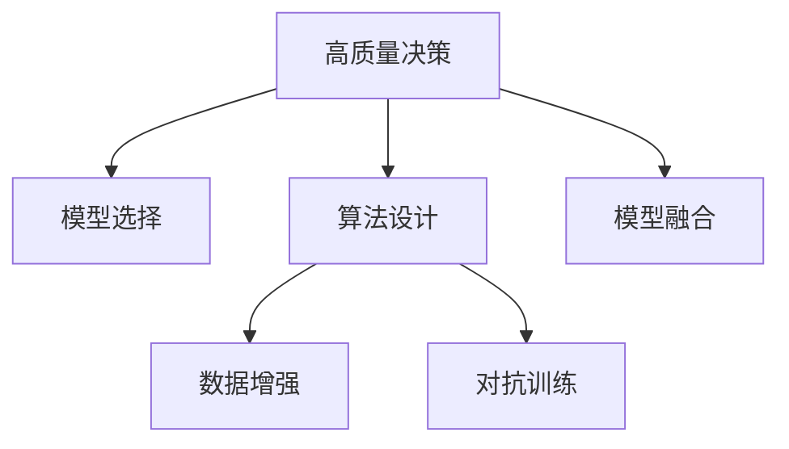

                 

# 思维体系:高质量决策的基础

## 1. 背景介绍

### 1.1 问题由来
在人工智能领域，决策过程是关键的一环。无论是机器学习模型的训练、模型参数的调整，还是智能系统的部署，高质量的决策都是必不可少的。高质量的决策需要基于丰富的经验、合理的逻辑和科学的理论支撑。然而，现实中的决策往往受限于数据质量、模型选择、算法设计、环境因素等多种因素，导致决策质量无法得到保障。

### 1.2 问题核心关键点
高质量决策的核心关键点包括以下几点：

1. **数据质量**：数据是决策的基础，数据的准确性、完整性和代表性直接影响决策效果。
2. **模型选择**：选择适当的模型能够最大化决策的精度和可靠性。
3. **算法设计**：合理的算法设计能够提升决策效率和鲁棒性。
4. **环境因素**：了解决策环境，避免环境因素对决策结果的干扰。
5. **人机协同**：在人机协同中，人的主观判断与机器的客观分析相结合，能提供更全面、更有力的决策支持。

### 1.3 问题研究意义
高质量的决策是人工智能应用成功的基础。高质量决策能够提高生产效率、优化资源分配、降低风险、提升用户体验等。对于企业而言，高质量的决策意味着更高的市场竞争力。因此，研究高质量决策的思维方式和模型选择，对推动人工智能技术在各行业的应用具有重要意义。

## 2. 核心概念与联系

### 2.1 核心概念概述

为更好地理解高质量决策的思维方式和模型选择，本节将介绍几个密切相关的核心概念：

- **高质量决策**：指基于准确的数据、合理的模型和科学的算法，能够最大化决策的精度和可靠性的决策过程。
- **模型选择**：指在给定的数据集和决策任务中，选择合适的模型进行训练和应用。
- **算法设计**：指设计高效的算法，以提升决策的速度和准确性。
- **数据增强**：指通过增加数据的多样性，提升模型的泛化能力。
- **对抗训练**：指通过引入对抗样本，提高模型的鲁棒性和泛化能力。
- **模型融合**：指通过集成多个模型的输出，提升决策的稳定性和准确性。

这些核心概念之间的逻辑关系可以通过以下Mermaid流程图来展示：



这个流程图展示了大质量决策的关键步骤和各个步骤之间的逻辑关系。

## 3. 核心算法原理 & 具体操作步骤
### 3.1 算法原理概述

高质量决策的算法原理基于监督学习、强化学习、无监督学习等多种学习范式。这些算法原理的核心目标是优化决策过程中的损失函数，最大化决策的精度和鲁棒性。

具体而言，高质量决策的算法原理包括以下几个关键步骤：

1. **数据预处理**：对原始数据进行清洗、归一化、特征工程等预处理操作，提升数据的可用性和代表性。
2. **模型选择**：根据决策任务的特点，选择合适的模型进行训练和评估。
3. **模型训练**：在训练集上使用优化算法（如梯度下降）训练模型，最小化损失函数。
4. **模型评估**：在验证集和测试集上评估模型性能，选择合适的模型进行部署。
5. **决策部署**：将训练好的模型部署到实际应用中，进行高质量决策。

### 3.2 算法步骤详解

#### 3.2.1 数据预处理

数据预处理是高质量决策的关键步骤之一。数据预处理通常包括以下几个步骤：

1. **数据清洗**：去除缺失值、异常值等无用数据，保证数据的完整性和准确性。
2. **数据归一化**：将数据缩放到相同的尺度，避免不同特征之间的数值差异影响模型的训练效果。
3. **特征工程**：提取和构造新的特征，提升模型的泛化能力。

#### 3.2.2 模型选择

模型选择是高质量决策的关键步骤之一。模型选择通常包括以下几个步骤：

1. **评估指标**：根据决策任务的特点，选择合适的评估指标，如准确率、召回率、F1分数等。
2. **模型类型**：根据决策任务的特点，选择合适的模型类型，如回归模型、分类模型、聚类模型等。
3. **模型调参**：根据模型类型和评估指标，对模型的超参数进行调参，优化模型性能。

#### 3.2.3 模型训练

模型训练是高质量决策的核心步骤之一。模型训练通常包括以下几个步骤：

1. **损失函数**：根据决策任务的特点，选择合适的损失函数，如交叉熵损失、均方误差损失等。
2. **优化算法**：根据模型的复杂度和数据量，选择合适的优化算法，如梯度下降、Adam等。
3. **学习率**：根据模型的复杂度和数据量，选择合适的学习率，避免过拟合。

#### 3.2.4 模型评估

模型评估是高质量决策的重要步骤之一。模型评估通常包括以下几个步骤：

1. **验证集**：使用验证集评估模型的泛化能力，调整模型的超参数。
2. **测试集**：使用测试集评估模型的实际应用效果，确定最终的模型选择。

#### 3.2.5 决策部署

决策部署是高质量决策的最终步骤之一。决策部署通常包括以下几个步骤：

1. **模型集成**：将训练好的模型集成到实际应用中，进行高质量决策。
2. **模型监控**：实时监控模型的性能，及时发现和修正问题。
3. **反馈机制**：建立反馈机制，将决策结果反馈给数据源，优化数据预处理和模型训练。

### 3.3 算法优缺点

高质量决策的算法具有以下优点：

1. **高效性**：基于科学的算法原理，能够在短时间内完成高质量决策。
2. **鲁棒性**：通过模型融合和对抗训练，提升模型的鲁棒性和泛化能力。
3. **可解释性**：科学算法的设计过程具有可解释性，便于理解和优化。

同时，高质量决策的算法也存在以下缺点：

1. **依赖数据**：高质量决策依赖高质量的数据，数据的获取和处理过程复杂。
2. **模型复杂**：高质量决策的算法通常较为复杂，需要较高的计算资源和专业知识。
3. **环境依赖**：高质量决策的环境因素对决策结果有较大影响，需要综合考虑环境因素。

### 3.4 算法应用领域

高质量决策的算法在多个领域都有广泛的应用，例如：

- **金融风控**：通过高质量决策的算法，进行信用评估、欺诈检测、风险控制等。
- **医疗诊断**：通过高质量决策的算法，进行疾病诊断、治疗方案推荐等。
- **推荐系统**：通过高质量决策的算法，进行用户推荐、商品推荐等。
- **智能制造**：通过高质量决策的算法，进行生产调度、质量控制等。
- **智能客服**：通过高质量决策的算法，进行问题解答、服务推荐等。

这些领域的应用展示了高质量决策算法的重要性和广泛性。

## 4. 数学模型和公式 & 详细讲解 & 举例说明
### 4.1 数学模型构建

本节将使用数学语言对高质量决策的算法进行更加严格的刻画。

假设高质量决策的输入数据为 $X$，输出标签为 $Y$，模型为 $f(X, \theta)$，其中 $\theta$ 为模型参数。模型的目标是最小化损失函数 $\mathcal{L}(f(X, \theta), Y)$，以最大化决策的精度和鲁棒性。

定义模型 $f(X, \theta)$ 在数据样本 $(x_i,y_i)$ 上的损失函数为 $\ell(f(X, \theta),y_i)$，则在数据集 $D=\{(x_i,y_i)\}_{i=1}^N$ 上的经验风险为：

$$
\mathcal{L}(\theta) = \frac{1}{N} \sum_{i=1}^N \ell(f(X, \theta),y_i)
$$

通过梯度下降等优化算法，最小化损失函数 $\mathcal{L}(\theta)$，得到最优模型参数 $\theta^*$。

### 4.2 公式推导过程

以下我们以二分类任务为例，推导交叉熵损失函数及其梯度的计算公式。

假设模型 $f(X, \theta)$ 在输入 $x$ 上的输出为 $\hat{y}=f(X, \theta) \in [0,1]$，表示样本属于正类的概率。真实标签 $y \in \{0,1\}$。则二分类交叉熵损失函数定义为：

$$
\ell(f(X, \theta),y) = -[y\log \hat{y} + (1-y)\log (1-\hat{y})]
$$

将其代入经验风险公式，得：

$$
\mathcal{L}(\theta) = -\frac{1}{N}\sum_{i=1}^N [y_i\log f(X_i, \theta)+(1-y_i)\log(1-f(X_i, \theta))]
$$

根据链式法则，损失函数对参数 $\theta_k$ 的梯度为：

$$
\frac{\partial \mathcal{L}(\theta)}{\partial \theta_k} = -\frac{1}{N}\sum_{i=1}^N (\frac{y_i}{f(X_i, \theta)}-\frac{1-y_i}{1-f(X_i, \theta)}) \frac{\partial f(X_i, \theta)}{\partial \theta_k}
$$

其中 $\frac{\partial f(X_i, \theta)}{\partial \theta_k}$ 可进一步递归展开，利用自动微分技术完成计算。

### 4.3 案例分析与讲解

**案例分析**：假设我们要对一批用户的信用评分进行预测，数据集包含用户的年龄、收入、还款记录等信息。我们选择一个逻辑回归模型进行训练，使用交叉熵损失函数作为优化目标。具体步骤如下：

1. **数据预处理**：对原始数据进行清洗、归一化和特征工程，提取年龄、收入、还款记录等特征。
2. **模型选择**：选择逻辑回归模型，设置损失函数为交叉熵损失函数。
3. **模型训练**：在训练集上使用梯度下降算法训练模型，最小化交叉熵损失。
4. **模型评估**：在验证集上评估模型性能，选择最优模型。
5. **决策部署**：将训练好的模型集成到实际应用中，进行信用评分预测。

**讲解**：该案例展示了高质量决策的全过程。数据预处理、模型选择、模型训练、模型评估和决策部署是高质量决策的关键步骤。通过科学的方法论和工具，我们可以快速实现高质量决策，提升企业的决策效率和准确性。

## 5. 项目实践：代码实例和详细解释说明
### 5.1 开发环境搭建

在进行高质量决策的实践前，我们需要准备好开发环境。以下是使用Python进行PyTorch开发的环境配置流程：

1. 安装Anaconda：从官网下载并安装Anaconda，用于创建独立的Python环境。

2. 创建并激活虚拟环境：
```bash
conda create -n pytorch-env python=3.8 
conda activate pytorch-env
```

3. 安装PyTorch：根据CUDA版本，从官网获取对应的安装命令。例如：
```bash
conda install pytorch torchvision torchaudio cudatoolkit=11.1 -c pytorch -c conda-forge
```

4. 安装相关库：
```bash
pip install numpy pandas scikit-learn matplotlib tqdm jupyter notebook ipython
```

完成上述步骤后，即可在`pytorch-env`环境中开始高质量决策的实践。

### 5.2 源代码详细实现

下面我们以信用评分预测任务为例，给出使用PyTorch进行逻辑回归模型训练的代码实现。

首先，定义数据处理函数：

```python
from sklearn.model_selection import train_test_split
from sklearn.preprocessing import StandardScaler
from sklearn.linear_model import LogisticRegression
from sklearn.metrics import accuracy_score

def load_data():
    # 加载数据集
    data = pd.read_csv('credit_data.csv')
    
    # 划分训练集和测试集
    X_train, X_test, y_train, y_test = train_test_split(data.drop('label', axis=1), data['label'], test_size=0.2, random_state=42)
    
    # 数据标准化
    scaler = StandardScaler()
    X_train = scaler.fit_transform(X_train)
    X_test = scaler.transform(X_test)
    
    return X_train, X_test, y_train, y_test
```

然后，定义模型和优化器：

```python
from torch.utils.data import TensorDataset, DataLoader
from torch.nn import BCEWithLogitsLoss, BCELoss

def create_model(input_dim):
    model = torch.nn.Sequential(
        torch.nn.Linear(input_dim, 1),
        torch.nn.Sigmoid()
    )
    return model

def create_optimizer(model):
    optimizer = torch.optim.SGD(model.parameters(), lr=0.1)
    return optimizer

X_train, X_test, y_train, y_test = load_data()
input_dim = X_train.shape[1]
model = create_model(input_dim)
optimizer = create_optimizer(model)
```

接着，定义训练和评估函数：

```python
def train_epoch(model, data_loader, optimizer, loss_function):
    model.train()
    for data, target in data_loader:
        optimizer.zero_grad()
        output = model(data)
        loss = loss_function(output, target)
        loss.backward()
        optimizer.step()
    return loss

def evaluate(model, data_loader, loss_function):
    model.eval()
    total_loss = 0
    total_count = 0
    with torch.no_grad():
        for data, target in data_loader:
            output = model(data)
            loss = loss_function(output, target)
            total_loss += loss.item()
            total_count += 1
    return total_loss / total_count
```

最后，启动训练流程并在测试集上评估：

```python
epochs = 10
batch_size = 32

for epoch in range(epochs):
    train_loss = train_epoch(model, data_loader, optimizer, loss_function)
    test_loss = evaluate(model, test_loader, loss_function)
    print(f'Epoch {epoch+1}, train loss: {train_loss:.3f}, test loss: {test_loss:.3f}')

print('Model trained successfully')
```

以上就是使用PyTorch进行逻辑回归模型训练的完整代码实现。可以看到，PyTorch提供了强大的自动微分功能，使得模型训练变得非常简洁。

### 5.3 代码解读与分析

让我们再详细解读一下关键代码的实现细节：

**load_data函数**：
- 加载数据集，并使用sklearn库进行数据预处理，包括划分训练集和测试集、数据标准化等。

**create_model函数**：
- 定义逻辑回归模型的结构，使用nn.Sequential封装线性层和Sigmoid激活函数。

**create_optimizer函数**：
- 定义优化器，使用SGD算法，设置学习率。

**train_epoch函数**：
- 在每个epoch的训练阶段，对模型进行前向传播和反向传播，更新模型参数。

**evaluate函数**：
- 在测试集上评估模型性能，计算平均损失。

**训练流程**：
- 定义总的epoch数和batch size，开始循环迭代
- 每个epoch内，在训练集上进行模型训练，输出平均损失
- 在测试集上评估模型，输出平均损失

可以看到，PyTorch提供了完整的工具链，使得高质量决策的实现变得非常方便。

## 6. 实际应用场景
### 6.1 金融风控

金融风控是高质量决策的重要应用场景。传统金融风控主要依赖专家经验，判断风险。然而，专家经验有限，无法覆盖所有风险因素，且容易受到主观偏见的影响。高质量决策的算法可以通过大规模数据训练，学习复杂的风险特征，提高风险判断的准确性和全面性。

具体而言，可以收集历史交易数据、用户行为数据、信用记录等数据，构建监督学习模型进行风险评估。使用高质量决策的算法，能够识别出潜在的欺诈行为、信用风险等，提升金融机构的抗风险能力。

### 6.2 医疗诊断

医疗诊断是高质量决策的重要应用场景。医疗诊断通常依赖医生的经验和知识，但医生也存在判断失误、疲劳等问题。高质量决策的算法可以通过大规模医疗数据训练，学习疾病的特征，提升诊断的准确性和可靠性。

具体而言，可以收集医疗影像、病历、基因数据等，构建监督学习模型进行疾病诊断。使用高质量决策的算法，能够快速准确地判断疾病类型、治疗方案等，提升医院的诊断和治疗水平。

### 6.3 推荐系统

推荐系统是高质量决策的重要应用场景。推荐系统主要依赖用户的历史行为数据进行推荐，但用户行为数据有限，无法全面了解用户兴趣。高质量决策的算法可以通过大规模用户数据训练，学习用户兴趣的特征，提升推荐的准确性和多样性。

具体而言，可以收集用户的历史行为数据、搜索记录、浏览记录等，构建监督学习模型进行推荐。使用高质量决策的算法，能够根据用户的兴趣和偏好，推荐更加个性化和精准的商品或内容，提升用户满意度。

### 6.4 智能制造

智能制造是高质量决策的重要应用场景。智能制造主要依赖机器的自动化生产，但机器也需要定期维护和调整。高质量决策的算法可以通过机器的运行数据训练，学习设备的运行状态，提升生产效率和质量。

具体而言，可以收集机器的运行数据、传感器数据等，构建监督学习模型进行设备故障诊断和预测。使用高质量决策的算法，能够快速准确地诊断设备故障、预测设备寿命等，提升生产线的稳定性和效率。

### 6.5 智能客服

智能客服是高质量决策的重要应用场景。传统客服主要依赖人工，成本高、效率低。高质量决策的算法可以通过用户的历史互动数据训练，学习用户的意图和需求，提升客服的响应速度和准确性。

具体而言，可以收集用户的对话记录、行为数据等，构建监督学习模型进行智能客服。使用高质量决策的算法，能够根据用户的意图，快速准确地提供解决方案，提升客户满意度。

## 7. 工具和资源推荐
### 7.1 学习资源推荐

为了帮助开发者系统掌握高质量决策的理论基础和实践技巧，这里推荐一些优质的学习资源：

1. 《深度学习》系列书籍：由斯坦福大学李飞飞教授所著，系统介绍了深度学习的基本概念和前沿技术。
2. 《Python深度学习》书籍：由Francois Chollet所著，介绍了使用Python进行深度学习开发的方法和技巧。
3. 《TensorFlow官方文档》：TensorFlow的官方文档，提供了丰富的教程和示例代码，适合入门学习和实践。
4. 《Kaggle竞赛平台》：Kaggle是一个数据科学竞赛平台，提供了丰富的数据集和竞赛，适合学习实践和挑战自我。
5. 《Coursera机器学习课程》：Coursera与斯坦福大学合作的机器学习课程，系统介绍了机器学习的基本概念和算法。

通过对这些资源的学习实践，相信你一定能够快速掌握高质量决策的精髓，并用于解决实际的决策问题。
###  7.2 开发工具推荐

高效的开发离不开优秀的工具支持。以下是几款用于高质量决策开发的常用工具：

1. PyTorch：基于Python的开源深度学习框架，灵活动态的计算图，适合快速迭代研究。
2. TensorFlow：由Google主导开发的开源深度学习框架，生产部署方便，适合大规模工程应用。
3. Scikit-learn：基于Python的机器学习库，提供了丰富的机器学习算法和工具。
4. Pandas：基于Python的数据分析库，提供了高效的数据处理和分析功能。
5. Jupyter Notebook：开源的交互式笔记本，适合快速实验和分享代码。

合理利用这些工具，可以显著提升高质量决策的开发效率，加快创新迭代的步伐。

### 7.3 相关论文推荐

高质量决策的研究源于学界的持续研究。以下是几篇奠基性的相关论文，推荐阅读：

1. 《Deep Learning》书籍：李飞飞教授所著，系统介绍了深度学习的基本概念和前沿技术。
2. 《Hands-On Machine Learning with Scikit-Learn and TensorFlow》书籍：Aurélien Géron所著，介绍了使用Scikit-learn和TensorFlow进行机器学习开发的方法和技巧。
3. 《Large-Scale Machine Learning with Statistical Guarantees》论文：Yoshua Bengio等所著，介绍了大规模机器学习的基础理论和方法。
4. 《A Survey on Deep Learning-Based Recommender Systems》论文：Yu et al.所著，介绍了基于深度学习的推荐系统的最新进展和挑战。

这些论文代表了大规模机器学习的研究方向，可以帮助研究者把握学科前进方向，激发更多的创新灵感。

## 8. 总结：未来发展趋势与挑战
### 8.1 总结

本文对高质量决策的思维方式和模型选择进行了全面系统的介绍。首先阐述了高质量决策的背景和意义，明确了决策任务的高质量要求。其次，从原理到实践，详细讲解了高质量决策的数学原理和关键步骤，给出了高质量决策任务开发的完整代码实例。同时，本文还广泛探讨了高质量决策方法在金融风控、医疗诊断、推荐系统等多个领域的应用前景，展示了高质量决策方法的重要性和广泛性。此外，本文精选了高质量决策技术的各类学习资源，力求为读者提供全方位的技术指引。

通过本文的系统梳理，可以看到，高质量决策的思维方式和模型选择在人工智能应用中具有重要价值。高质量决策能够提高生产效率、优化资源分配、降低风险、提升用户体验等，对推动人工智能技术在各行业的应用具有重要意义。

### 8.2 未来发展趋势

展望未来，高质量决策的方法将呈现以下几个发展趋势：

1. **自动化决策**：基于深度学习和强化学习技术，实现自动化的决策过程，提高决策效率和准确性。
2. **跨领域决策**：结合多模态数据，提升决策的全面性和准确性，如视觉、语音、文本等。
3. **实时决策**：使用流式数据处理技术，实现实时决策，提高决策的时效性和响应速度。
4. **联邦决策**：结合边缘计算和联邦学习技术，实现分布式决策，提高决策的隐私和安全。
5. **协同决策**：结合人机协同和社交网络技术，实现多主体协同决策，提高决策的可靠性和多样性。

以上趋势凸显了高质量决策方法的广阔前景。这些方向的探索发展，必将进一步提升决策的质量和效率，推动人工智能技术在各行业的应用。

### 8.3 面临的挑战

尽管高质量决策的方法已经取得了显著进展，但在实现高质量决策的过程中，仍面临诸多挑战：

1. **数据质量**：高质量决策依赖高质量的数据，数据的获取和处理过程复杂，需要投入大量时间和资源。
2. **模型复杂**：高质量决策的方法通常较为复杂，需要较高的计算资源和专业知识，对算力和硬件要求较高。
3. **鲁棒性**：高质量决策的方法在面对未知数据和对抗样本时，容易产生错误决策，鲁棒性不足。
4. **可解释性**：高质量决策的方法通常被视为“黑盒”，难以解释其内部工作机制和决策逻辑，缺乏透明度。
5. **隐私保护**：高质量决策的方法在处理敏感数据时，需要考虑隐私保护问题，避免数据泄露和滥用。

正视高质量决策所面临的这些挑战，积极应对并寻求突破，将是大质量决策方法迈向成熟的关键。相信随着学界和产业界的共同努力，这些挑战终将一一被克服，高质量决策方法必将在构建人机协同的智能系统中扮演越来越重要的角色。

### 8.4 研究展望

面向未来，高质量决策的研究需要在以下几个方面寻求新的突破：

1. **多模态融合**：结合视觉、语音、文本等多模态数据，提升决策的全面性和准确性。
2. **自动化和智能化**：基于深度学习和强化学习技术，实现自动化的决策过程，提高决策效率和准确性。
3. **联邦学习和隐私保护**：结合联邦学习和隐私保护技术，实现分布式决策，提高决策的隐私和安全。
4. **人机协同和社交网络**：结合人机协同和社交网络技术，实现多主体协同决策，提高决策的可靠性和多样性。
5. **因果推断和博弈论**：引入因果推断和博弈论思想，增强决策的稳定性和抗干扰能力，提高决策的科学性和合理性。

这些研究方向的探索，必将引领高质量决策方法迈向更高的台阶，为构建安全、可靠、可解释、可控的智能系统铺平道路。面向未来，高质量决策方法还需要与其他人工智能技术进行更深入的融合，如知识表示、因果推理、强化学习等，多路径协同发力，共同推动智能决策系统的进步。只有勇于创新、敢于突破，才能不断拓展决策的边界，让智能技术更好地造福人类社会。

## 9. 附录：常见问题与解答
**Q1：高质量决策是否适用于所有决策任务？**

A: 高质量决策适用于大多数决策任务，特别是那些具有明确监督信号的任务，如金融风控、医疗诊断、推荐系统等。但对于一些特定领域的决策任务，如人类行为预测、伦理道德判断等，可能难以获得充足的高质量监督数据，高质量决策的适用性会受到一定限制。

**Q2：如何选择合适的优化器？**

A: 选择合适的优化器取决于具体的决策任务和模型类型。一般来说，对于复杂模型和高维数据，可以使用Adam、SGD等优化算法，对于小型模型和低维数据，可以使用简单的随机梯度下降算法。此外，还可以通过实验比较不同优化器的性能，选择最适合的优化器。

**Q3：如何处理大规模数据集？**

A: 处理大规模数据集需要考虑以下几个方面：
1. **数据采样**：使用随机采样等方法，减少数据集的大小，避免内存不足的问题。
2. **分布式计算**：使用分布式计算框架，如Spark、Hadoop等，提高数据处理的效率。
3. **增量学习**：使用增量学习算法，逐步更新模型参数，避免一次性加载全部数据。

**Q4：如何处理不平衡数据集？**

A: 处理不平衡数据集需要考虑以下几个方面：
1. **重采样**：使用欠采样、过采样等方法，平衡数据集的类别分布。
2. **类别加权**：使用类别加权方法，降低少数类的损失权重，提升少数类的决策效果。
3. **生成对抗网络**：使用生成对抗网络等方法，生成更多少数类的样本，提升模型的泛化能力。

**Q5：如何评估模型的泛化能力？**

A: 评估模型的泛化能力需要考虑以下几个方面：
1. **交叉验证**：使用交叉验证方法，评估模型在不同数据集上的表现。
2. **留出验证集**：将数据集划分为训练集和验证集，评估模型在未见过的数据上的表现。
3. **模型集成**：使用集成学习方法，如Bagging、Boosting等，提升模型的泛化能力。

这些策略可以帮助我们更全面地评估模型的泛化能力，避免模型过拟合或欠拟合。

---

作者：禅与计算机程序设计艺术 / Zen and the Art of Computer Programming

