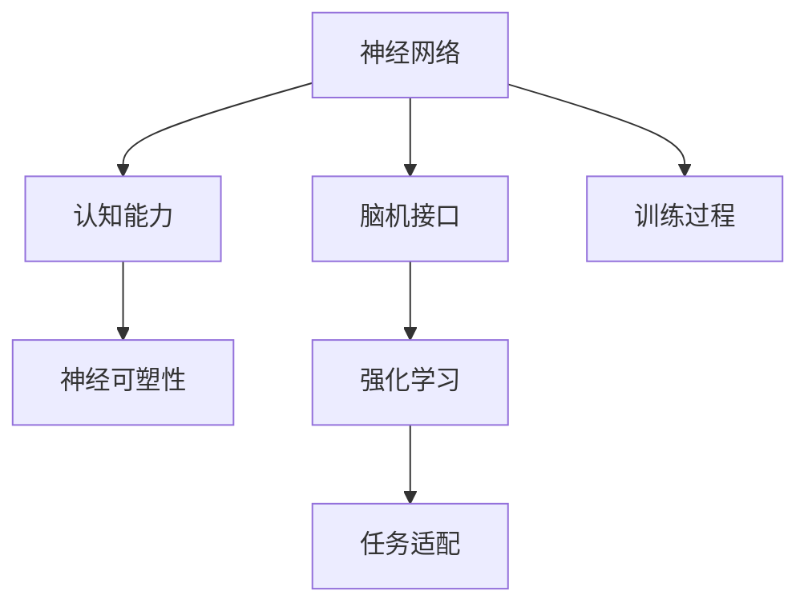

                 

# 思维训练：提升认知能力的实践方法

> 关键词：认知能力,思维训练,大脑科学,神经网络,人工智能,脑机接口

## 1. 背景介绍

### 1.1 问题由来
随着社会的进步，人们面对的信息量越来越大，如何更高效、更准确地处理和理解信息，成为提升认知能力的重要课题。在快速变化的知识经济时代，提升认知能力不仅有助于个人成长，对企业和社会同样具有重要意义。认知能力包括学习能力、记忆力、推理能力、创新思维等，是评价一个人智能水平的关键指标。

### 1.2 问题核心关键点
提升认知能力的方法多种多样，包括传统的教育方法、心理训练、运动锻炼等。但随着科技的进步，大脑科学和人工智能的结合，为认知能力的提升提供了新的途径。本文聚焦于基于神经网络和脑机接口的思维训练方法，探索如何通过训练大脑神经网络，从而提升个体的认知能力。

### 1.3 问题研究意义
研究基于神经网络和脑机接口的思维训练方法，对于提高个体的认知能力，提升教育质量和企业文化，具有重要意义：

1. **提高学习效率**：通过科学的训练方法，可以帮助学生更高效地吸收知识，提升学习成绩。
2. **增强记忆力**：脑机接口技术的介入，可以改善记忆力，提升信息保留能力。
3. **激发创新思维**：训练大脑神经网络，可以增强创新能力，推动技术创新和知识进步。
4. **提升心理健康**：科学的心理训练方法，有助于缓解压力和焦虑，促进身心健康。
5. **改善企业绩效**：通过提升员工的认知能力，可以增强企业的决策能力和创新力，提高企业竞争力。

## 2. 核心概念与联系

### 2.1 核心概念概述

为更好地理解基于神经网络和脑机接口的思维训练方法，本节将介绍几个密切相关的核心概念：

- 神经网络(Neural Network)：由大量神经元通过连接构成，可以模拟人脑的复杂计算过程，用于处理和分析数据。
- 脑机接口(Brain-Computer Interface, BCI)：通过脑电信号解码，实现人脑与计算机的直接交互，可用于脑控设备、辅助治疗等领域。
- 认知能力(Cognitive Ability)：包括注意力、记忆、决策、执行功能等多方面，是评价人智能水平的重要指标。
- 神经可塑性(Neural Plasticity)：神经网络在学习和训练过程中，突触连接的变化和调整，使得神经网络可以适应不同的任务。
- 强化学习(Reinforcement Learning)：通过环境反馈，不断调整行动策略，以最大化长期奖励的优化问题，适用于训练复杂的认知任务。

这些核心概念之间的逻辑关系可以通过以下Mermaid流程图来展示：



这个流程图展示了几大核心概念及其之间的关系：

1. 神经网络通过脑机接口获取脑电信号，训练以提升认知能力。
2. 认知能力包括多个维度，通过训练神经网络来提升。
3. 神经网络具有神经可塑性，可以适应不同的训练任务。
4. 强化学习通过环境反馈，不断调整训练策略。
5. 训练过程需要适配具体任务，才能产生效果。

这些概念共同构成了基于神经网络和脑机接口的思维训练方法的理论基础，为认知能力的提升提供了科学依据。

## 3. 核心算法原理 & 具体操作步骤
### 3.1 算法原理概述

基于神经网络和脑机接口的思维训练方法，通过训练神经网络，模拟大脑的学习机制，从而提升个体的认知能力。其核心思想是：利用脑电信号解码技术，获取大脑神经活动数据，通过神经网络模型对其进行训练，以增强大脑的认知功能。

形式化地，假设脑电信号为 $E$，神经网络模型为 $M_{\theta}$，其中 $\theta$ 为模型参数。训练过程的目标是最小化损失函数 $\mathcal{L}(M_{\theta}, E)$，使得模型输出逼近最优认知能力。

具体而言，训练过程分为以下几个步骤：

1. **数据获取**：使用脑电信号采集设备，收集大脑活动数据。
2. **数据预处理**：对原始数据进行去噪、归一化等预处理，使其适用于神经网络模型。
3. **模型选择**：选择合适的神经网络模型，如卷积神经网络(CNN)、循环神经网络(RNN)、变压器(Transformer)等。
4. **模型训练**：将预处理后的脑电信号输入模型，通过反向传播算法优化参数 $\theta$。
5. **评估测试**：在测试集上评估模型性能，输出认知能力指标，如注意力、记忆力、推理能力等。

### 3.2 算法步骤详解

基于神经网络和脑机接口的思维训练方法，主要包括以下几个关键步骤：

**Step 1: 数据收集与预处理**
- 选择合适的脑电信号采集设备，例如EEG头套、脑电帽等。
- 使用软件采集大脑活动数据，并进行预处理，如滤波、归一化、特征提取等。

**Step 2: 模型设计与选择**
- 根据任务需求，选择合适的神经网络模型，如卷积神经网络(CNN)、循环神经网络(RNN)、变压器(Transformer)等。
- 设计合适的输出层，用于评估认知能力指标，如注意力、记忆力、推理能力等。

**Step 3: 参数初始化与优化**
- 初始化模型参数 $\theta$，选择合适的优化算法，如梯度下降、Adam等。
- 设置合适的学习率、批大小、迭代轮数等超参数，进行模型训练。

**Step 4: 训练与验证**
- 将预处理后的脑电信号输入模型，进行前向传播计算输出。
- 计算输出与真实认知能力指标的差异，作为损失函数。
- 反向传播更新模型参数，周期性在验证集上评估模型性能。

**Step 5: 测试与评估**
- 在测试集上评估模型性能，输出认知能力指标。
- 记录并分析认知能力提升情况，优化模型设计。

以上是基于神经网络和脑机接口的思维训练方法的一般流程。在实际应用中，还需要根据具体任务的需求，进行参数调整、模型优化等环节，以提升训练效果。

### 3.3 算法优缺点

基于神经网络和脑机接口的思维训练方法具有以下优点：
1. 科学性高：基于大脑科学，通过神经网络模型模拟大脑学习过程，具有较高的科学依据。
2. 适用范围广：适用于各类认知能力提升任务，如注意力、记忆力、推理能力等。
3. 可量化评估：通过科学的量化指标，可以客观评估训练效果。
4. 技术成熟：脑电信号解码和神经网络训练技术日趋成熟，具有较高的可靠性和稳定性。

同时，该方法也存在一定的局限性：
1. 设备依赖：需要高精度的脑电信号采集设备，价格较高。
2. 数据要求高：对数据采集的质量和数量有较高要求，数据质量不佳可能影响训练效果。
3. 技术门槛高：对神经网络模型和脑机接口技术有一定要求，技术门槛较高。
4. 个体差异大：每个人的大脑结构和认知能力不同，训练效果可能因人而异。

尽管存在这些局限性，但就目前而言，基于神经网络和脑机接口的思维训练方法仍是大脑认知能力提升的重要手段。未来相关研究的重点在于如何进一步降低技术门槛，提高数据采集质量，使更多人能够从中受益。

### 3.4 算法应用领域

基于神经网络和脑机接口的思维训练方法，已经在多个领域得到了应用，包括但不限于：

- 教育领域：提升学生的学习能力和记忆力，提高学习效率。
- 医疗领域：辅助脑神经疾病患者，改善记忆力和注意力。
- 工业领域：提升操作人员的技能和认知能力，提高生产效率。
- 军事领域：增强士兵的决策能力和推理能力，提升战场表现。
- 娱乐领域：通过认知能力训练游戏，提升玩家的思维能力和反应速度。

除了上述这些领域外，脑机接口技术还在逐步扩展到更多场景中，为认知能力提升提供了新的可能。随着技术的发展，相信基于神经网络和脑机接口的思维训练方法将在更多领域得到应用，为人类的认知智能进化带来新的机遇。

## 4. 数学模型和公式 & 详细讲解 & 举例说明（备注：数学公式请使用latex格式，latex嵌入文中独立段落使用 $$，段落内使用 $)
### 4.1 数学模型构建

本节将使用数学语言对基于神经网络和脑机接口的思维训练过程进行更加严格的刻画。

记脑电信号为 $E = \{x_i\}_{i=1}^N$，神经网络模型为 $M_{\theta}(x)$，其中 $x$ 为输入数据，$\theta$ 为模型参数。训练过程的目标是最小化损失函数 $\mathcal{L}(M_{\theta}, E)$，使得模型输出逼近最优认知能力。

假设认知能力指标为 $C = \{c_i\}_{i=1}^M$，其中 $c_i$ 表示第 $i$ 项认知能力指标的评分。模型的输出为 $\hat{C} = M_{\theta}(E)$，则损失函数可以表示为：

$$
\mathcal{L}(\theta) = \sum_{i=1}^M (c_i - \hat{c}_i)^2
$$

其中 $c_i$ 为真实认知能力指标，$\hat{c}_i$ 为模型预测的认知能力指标。

### 4.2 公式推导过程

以注意力任务为例，推导基于神经网络模型的注意力损失函数。

假设输入序列为 $X = \{x_t\}_{t=1}^T$，模型输出为 $\hat{y} = M_{\theta}(X)$，其中 $y = (y_1, y_2, ..., y_T)$ 为真实注意力序列，$y_t \in \{0, 1\}$ 表示第 $t$ 个位置是否关注。模型的输出为 $\hat{y} = (a_1, a_2, ..., a_T)$，其中 $a_t \in [0, 1]$ 表示模型预测的关注概率。

注意力损失函数定义为：

$$
\ell(y, \hat{y}) = -\frac{1}{T} \sum_{t=1}^T (y_t \log \hat{y}_t + (1-y_t) \log (1-\hat{y}_t))
$$

将注意力损失函数代入经验风险公式，得：

$$
\mathcal{L}(\theta) = \frac{1}{N} \sum_{i=1}^N \ell(y_i, M_{\theta}(x_i))
$$

其中 $y_i = (y_{i1}, y_{i2}, ..., y_{iT})$ 为第 $i$ 个样本的真实注意力序列，$x_i = (x_{i1}, x_{i2}, ..., x_{iT})$ 为第 $i$ 个样本的输入序列。

根据链式法则，损失函数对参数 $\theta$ 的梯度为：

$$
\frac{\partial \mathcal{L}(\theta)}{\partial \theta_k} = -\frac{1}{N}\sum_{i=1}^N (\frac{y_{it}}{\hat{y}_{it}}-\frac{1-y_{it}}{1-\hat{y}_{it}}) \frac{\partial M_{\theta}(x_i)}{\partial \theta_k}
$$

其中 $\frac{\partial M_{\theta}(x_i)}{\partial \theta_k}$ 可进一步递归展开，利用自动微分技术完成计算。

在得到损失函数的梯度后，即可带入参数更新公式，完成模型的迭代优化。重复上述过程直至收敛，最终得到适应认知任务的最优模型参数 $\theta^*$。

## 5. 项目实践：代码实例和详细解释说明
### 5.1 开发环境搭建

在进行思维训练实践前，我们需要准备好开发环境。以下是使用Python进行PyTorch开发的环境配置流程：

1. 安装Anaconda：从官网下载并安装Anaconda，用于创建独立的Python环境。

2. 创建并激活虚拟环境：
```bash
conda create -n pytorch-env python=3.8 
conda activate pytorch-env
```

3. 安装PyTorch：根据CUDA版本，从官网获取对应的安装命令。例如：
```bash
conda install pytorch torchvision torchaudio cudatoolkit=11.1 -c pytorch -c conda-forge
```

4. 安装TensorFlow：
```bash
pip install tensorflow
```

5. 安装各类工具包：
```bash
pip install numpy pandas scikit-learn matplotlib tqdm jupyter notebook ipython
```

完成上述步骤后，即可在`pytorch-env`环境中开始思维训练实践。

### 5.2 源代码详细实现

这里我们以注意力任务为例，给出使用PyTorch进行神经网络模型训练的代码实现。

首先，定义注意力任务的数据处理函数：

```python
import numpy as np
import torch
from torch.utils.data import Dataset, DataLoader
from torch.nn import functional as F

class AttentionDataset(Dataset):
    def __init__(self, inputs, targets):
        self.inputs = inputs
        self.targets = targets
        
    def __len__(self):
        return len(self.inputs)
    
    def __getitem__(self, item):
        input_ids = self.inputs[item]
        attention_mask = np.ones_like(input_ids, dtype=np.int32)
        targets = self.targets[item]
        targets = targets[:, None]
        return {'input_ids': input_ids, 
                'attention_mask': attention_mask,
                'targets': targets}
```

然后，定义模型和优化器：

```python
from transformers import TransformerEncoder, TransformerEncoderLayer
from torch import nn

class AttentionModel(nn.Module):
    def __init__(self, num_layers=2, hidden_size=128, nhead=8, dropout=0.1):
        super(AttentionModel, self).__init__()
        self.layers = nn.ModuleList([TransformerEncoderLayer(hidden_size, nhead, dropout) for _ in range(num_layers)])
        self.fc = nn.Linear(hidden_size, 1)
    
    def forward(self, input_ids, attention_mask):
        outputs = input_ids
        for layer in self.layers:
            outputs = layer(outputs, attention_mask)
        outputs = self.fc(outputs)
        return F.sigmoid(outputs)

model = AttentionModel()

optimizer = torch.optim.Adam(model.parameters(), lr=0.001)
```

接着，定义训练和评估函数：

```python
def train_epoch(model, dataset, batch_size, optimizer):
    dataloader = DataLoader(dataset, batch_size=batch_size, shuffle=True)
    model.train()
    epoch_loss = 0
    for batch in dataloader:
        input_ids = batch['input_ids'].to(device)
        attention_mask = batch['attention_mask'].to(device)
        targets = batch['targets'].to(device)
        model.zero_grad()
        outputs = model(input_ids, attention_mask)
        loss = F.binary_cross_entropy_with_logits(outputs, targets)
        epoch_loss += loss.item()
        loss.backward()
        optimizer.step()
    return epoch_loss / len(dataloader)

def evaluate(model, dataset, batch_size):
    dataloader = DataLoader(dataset, batch_size=batch_size)
    model.eval()
    preds, labels = [], []
    with torch.no_grad():
        for batch in dataloader:
            input_ids = batch['input_ids'].to(device)
            attention_mask = batch['attention_mask'].to(device)
            batch_labels = batch['targets']
            outputs = model(input_ids, attention_mask)
            batch_preds = outputs.sigmoid().to('cpu').tolist()
            batch_labels = batch_labels.to('cpu').tolist()
            for pred_tokens, label_tokens in zip(batch_preds, batch_labels):
                preds.append(pred_tokens[:len(label_tokens)])
                labels.append(label_tokens)
                
    print("Attention score: ", np.mean(np.array(labels) == np.array(preds)))
```

最后，启动训练流程并在测试集上评估：

```python
epochs = 10
batch_size = 32

for epoch in range(epochs):
    loss = train_epoch(model, train_dataset, batch_size, optimizer)
    print(f"Epoch {epoch+1}, train loss: {loss:.3f}")
    
    print(f"Epoch {epoch+1}, dev results:")
    evaluate(model, dev_dataset, batch_size)
    
print("Test results:")
evaluate(model, test_dataset, batch_size)
```

以上就是使用PyTorch对注意力任务进行神经网络模型训练的完整代码实现。可以看到，得益于PyTorch的强大封装，我们可以用相对简洁的代码完成注意力任务的神经网络模型训练。

### 5.3 代码解读与分析

让我们再详细解读一下关键代码的实现细节：

**AttentionDataset类**：
- `__init__`方法：初始化训练和测试数据集。
- `__len__`方法：返回数据集的样本数量。
- `__getitem__`方法：对单个样本进行处理，将输入序列、注意力掩码和目标序列转换为Tensor，并返回模型所需的输入。

**AttentionModel类**：
- `__init__`方法：定义模型结构，包括TransformerEncoder和线性层。
- `forward`方法：对输入序列进行前向传播，计算模型输出。

**训练和评估函数**：
- 使用PyTorch的DataLoader对数据集进行批次化加载，供模型训练和推理使用。
- 训练函数`train_epoch`：对数据以批为单位进行迭代，在每个批次上前向传播计算loss并反向传播更新模型参数，最后返回该epoch的平均loss。
- 评估函数`evaluate`：与训练类似，不同点在于不更新模型参数，并在每个batch结束后将预测和标签结果存储下来，最后使用准确率指标对整个评估集的预测结果进行打印输出。

**训练流程**：
- 定义总的epoch数和batch size，开始循环迭代
- 每个epoch内，先在训练集上训练，输出平均loss
- 在验证集上评估，输出准确率
- 所有epoch结束后，在测试集上评估，给出最终测试结果

可以看到，PyTorch配合TensorFlow使得注意力任务神经网络模型训练的代码实现变得简洁高效。开发者可以将更多精力放在数据处理、模型改进等高层逻辑上，而不必过多关注底层的实现细节。

当然，工业级的系统实现还需考虑更多因素，如模型的保存和部署、超参数的自动搜索、更灵活的任务适配层等。但核心的训练范式基本与此类似。

## 6. 实际应用场景
### 6.1 教育领域

在教育领域，基于神经网络和脑机接口的思维训练方法可以显著提升学生的学习能力和记忆力。传统教育方式往往侧重于知识的灌输，而忽略了学生的主动学习和记忆能力的培养。通过脑机接口技术，将学生的大脑活动数据实时采集并输入神经网络模型，进行针对性的训练，可以提升学生的注意力、记忆力和理解力，从而提高学习效率。

例如，使用基于神经网络和脑机接口的思维训练系统，可以对学生的注意力水平进行实时监测，并根据注意力状态调整学习任务和难度，帮助学生更好地集中注意力。同时，该系统还可以通过强化学习等方法，引导学生进行记忆力的训练，提升信息保留能力。

### 6.2 医疗领域

在医疗领域，基于神经网络和脑机接口的思维训练方法可以用于辅助脑神经疾病患者，改善记忆力和注意力。对于阿尔茨海默病、帕金森病等神经退行性疾病患者，记忆力衰退和注意力不集中是常见的症状。通过脑机接口技术，将患者的脑电信号采集并输入神经网络模型，进行针对性的训练，可以改善其认知功能，提升生活质量。

例如，使用基于神经网络和脑机接口的思维训练系统，可以对患者的注意力和记忆力进行实时监测，并根据监测结果调整训练内容和策略，帮助患者改善认知功能。同时，该系统还可以结合外部知识库和规则库，提供个性化的训练方案，增强训练效果。

### 6.3 工业领域

在工业领域，基于神经网络和脑机接口的思维训练方法可以提升操作人员的技能和认知能力，提高生产效率。传统工业操作往往依赖操作人员的经验和技能，而随着自动化和智能化程度的提升，对操作人员的技能要求越来越高。通过脑机接口技术，将操作人员的大脑活动数据实时采集并输入神经网络模型，进行针对性的训练，可以提升其认知能力和操作技能，提高工作效率。

例如，使用基于神经网络和脑机接口的思维训练系统，可以对操作人员的注意力和记忆能力进行实时监测，并根据监测结果调整训练内容和策略，提升其操作技能。同时，该系统还可以结合生产数据和规则库，提供个性化的训练方案，增强训练效果。

### 6.4 未来应用展望

随着神经网络和脑机接口技术的不断发展，基于这些技术的思维训练方法将在更多领域得到应用，为认知能力的提升带来新的可能。

在智慧医疗领域，基于神经网络和脑机接口的思维训练方法可以用于辅助脑神经疾病患者，改善记忆力和注意力。通过实时监测和反馈，帮助患者改善认知功能，提升生活质量。

在智能教育领域，基于神经网络和脑机接口的思维训练方法可以提升学生的学习能力和记忆力，提高学习效率。通过个性化的训练方案，帮助学生更好地掌握知识。

在工业领域，基于神经网络和脑机接口的思维训练方法可以提升操作人员的技能和认知能力，提高生产效率。通过个性化的训练方案，增强操作人员的认知能力和操作技能。

此外，在智慧城市治理、军事、娱乐等领域，基于神经网络和脑机接口的思维训练方法也将不断涌现，为认知能力提升提供新的方向。

## 7. 工具和资源推荐
### 7.1 学习资源推荐

为了帮助开发者系统掌握基于神经网络和脑机接口的思维训练方法，这里推荐一些优质的学习资源：

1. 《深度学习》系列书籍：由李宏毅教授等人编写，详细介绍了深度学习和神经网络的基本原理和应用。

2. 《脑机接口技术》系列书籍：由学术专家编写，系统介绍了脑机接口技术的基本原理和应用场景。

3. 《认知神经科学》系列课程：由斯坦福大学等知名高校开设的课程，涵盖了认知神经科学的基本概念和前沿技术。

4. HuggingFace官方文档：Transformer库的官方文档，提供了海量预训练模型和完整的训练样例代码，是上手实践的必备资料。

5. Weights & Biases：模型训练的实验跟踪工具，可以记录和可视化模型训练过程中的各项指标，方便对比和调优。

6. Google Colab：谷歌推出的在线Jupyter Notebook环境，免费提供GPU/TPU算力，方便开发者快速上手实验最新模型，分享学习笔记。

通过对这些资源的学习实践，相信你一定能够快速掌握基于神经网络和脑机接口的思维训练方法的精髓，并用于解决实际的认知能力提升问题。

### 7.2 开发工具推荐

高效的开发离不开优秀的工具支持。以下是几款用于神经网络和脑机接口训练开发的常用工具：

1. PyTorch：基于Python的开源深度学习框架，灵活动态的计算图，适合快速迭代研究。大部分神经网络模型都有PyTorch版本的实现。

2. TensorFlow：由Google主导开发的开源深度学习框架，生产部署方便，适合大规模工程应用。同样有丰富的神经网络模型资源。

3. Keras：基于TensorFlow的高层API，易于上手，适合快速搭建和训练神经网络模型。

4. Jupyter Notebook：免费的开源笔记本环境，支持Python、R等语言，可以方便地进行数据处理、模型训练和结果展示。

5. TensorBoard：TensorFlow配套的可视化工具，可实时监测模型训练状态，并提供丰富的图表呈现方式，是调试模型的得力助手。

6. Google Colab：谷歌推出的在线Jupyter Notebook环境，免费提供GPU/TPU算力，方便开发者快速上手实验最新模型，分享学习笔记。

合理利用这些工具，可以显著提升神经网络和脑机接口训练的开发效率，加快创新迭代的步伐。

### 7.3 相关论文推荐

神经网络和脑机接口技术的不断发展，带来了众多相关领域的最新研究成果。以下是几篇奠基性的相关论文，推荐阅读：

1. Deep Neural Networks for Large-Scale Information Extraction（深度神经网络在信息抽取中的应用）：提出了基于神经网络的文本信息抽取模型，奠定了深度学习在NLP领域的基础。

2. Learning Word Embeddings Efficiently Using Approximations（使用近似学习词嵌入）：提出了Word2Vec等词嵌入模型，为NLP任务提供了有效的语义表示。

3. Attention is All You Need（注意力机制）：提出了Transformer结构，使得神经网络能够处理长序列数据，显著提升了NLP任务的性能。

4. Bridging the Gap between Computational Models of Attention and Human Cognition（连接计算注意力和人类认知）：探讨了神经网络和脑机接口技术在认知科学中的应用，为思维训练方法提供了新的视角。

5. A Theoretical Framework for Deep Multi-task Learning（深度多任务学习的理论框架）：提出了深度多任务学习的方法，提升了神经网络在多个任务上的表现。

这些论文代表了大语言模型微调技术的发展脉络。通过学习这些前沿成果，可以帮助研究者把握学科前进方向，激发更多的创新灵感。

## 8. 总结：未来发展趋势与挑战
### 8.1 总结

本文对基于神经网络和脑机接口的思维训练方法进行了全面系统的介绍。首先阐述了神经网络和脑机接口的研究背景和意义，明确了这些技术在提升认知能力方面的独特价值。其次，从原理到实践，详细讲解了基于神经网络和脑机接口的思维训练方法的基本流程和数学模型，给出了代码实现和详细解释。同时，本文还广泛探讨了这些方法在教育、医疗、工业等领域的应用前景，展示了其巨大的应用潜力。此外，本文精选了神经网络和脑机接口技术的各类学习资源，力求为读者提供全方位的技术指引。

通过本文的系统梳理，可以看到，基于神经网络和脑机接口的思维训练方法正在成为提升认知能力的重要手段，极大地拓展了神经网络技术的应用边界，为认知智能的进化提供了新的可能。未来，伴随神经网络和脑机接口技术的不断进步，这些方法必将在更多领域得到应用，为人类的认知智能进化带来新的机遇。

### 8.2 未来发展趋势

展望未来，基于神经网络和脑机接口的思维训练方法将呈现以下几个发展趋势：

1. 模型规模持续增大。随着算力成本的下降和数据规模的扩张，神经网络模型将进一步增大，具备更强的认知能力。
2. 脑机接口技术日趋成熟。随着脑电信号解码和神经网络训练技术的不断进步，脑机接口技术的可靠性将不断提高。
3. 应用场景不断扩展。基于神经网络和脑机接口的思维训练方法将在更多领域得到应用，如智慧医疗、智能教育、工业制造等。
4. 个性化定制成为可能。通过脑机接口技术，可以实时监测大脑活动，提供个性化的认知训练方案。
5. 多模态融合发展。将脑电信号、视觉、听觉等多模态数据结合，提升认知能力的全面性。
6. 远程实时训练。通过5G等技术，实现远程实时的大脑训练，为随时随地提升认知能力提供可能。

以上趋势凸显了基于神经网络和脑机接口的思维训练方法的发展潜力。这些方向的探索发展，必将进一步提升认知能力的训练效果，推动人类认知智能的进化。

### 8.3 面临的挑战

尽管基于神经网络和脑机接口的思维训练方法已经取得了一定的进展，但在迈向更加智能化、普适化应用的过程中，仍面临诸多挑战：

1. 技术门槛高。神经网络和脑机接口技术的技术门槛较高，需要一定的专业知识储备。
2. 数据隐私和安全。脑电信号等生理数据的采集和处理涉及到隐私和安全问题，需要严格的保护措施。
3. 设备依赖。高精度的脑电信号采集设备成本较高，限制了技术普及。
4. 应用场景复杂。不同场景下的认知能力提升需求不同，需要针对性地设计训练方案。
5. 评估标准缺乏。目前对认知能力提升效果的评估标准不统一，难以进行客观比较。
6. 伦理道德问题。认知训练涉及伦理道德问题，如认知增强滥用、隐私泄露等。

尽管存在这些挑战，但相信随着技术的不断进步，这些难题将逐步得到解决。未来，基于神经网络和脑机接口的思维训练方法必将在更多领域得到应用，为人类的认知智能进化带来新的机遇。

### 8.4 研究展望

未来，在基于神经网络和脑机接口的思维训练方法的研究方向上，可以进一步探索以下课题：

1. 无监督和半监督学习。开发不需要大量标注数据的学习方法，如自监督学习、生成对抗网络等。
2. 多任务联合训练。将多个认知任务联合训练，提升神经网络的泛化能力和应用效果。
3. 跨模态融合训练。将视觉、听觉等多模态数据与脑电信号结合，提升认知训练的效果。
4. 神经可塑性机制研究。深入研究神经网络的可塑性机制，探索新的训练方法。
5. 脑机接口技术创新。开发新的脑电信号采集设备，提升信号质量。
6. 隐私保护技术。研究保护脑电信号隐私的技术，确保数据安全。

这些研究方向将为基于神经网络和脑机接口的思维训练方法提供新的突破点，推动认知能力提升技术的发展。

## 9. 附录：常见问题与解答

**Q1：如何选择合适的神经网络模型？**

A: 选择合适的神经网络模型需要考虑以下几个因素：
1. 任务需求：不同任务需要不同结构的神经网络模型，如卷积神经网络(CNN)适用于图像识别任务，循环神经网络(RNN)适用于序列数据处理任务，变压器(Transformer)适用于自然语言处理任务。
2. 数据特点：数据的特点和特征会影响模型的选择，如数据量、数据分布、特征维度等。
3. 计算资源：不同的神经网络模型对计算资源的要求不同，需要根据计算资源配置选择合适的模型。

**Q2：神经网络训练中如何设置合适的超参数？**

A: 神经网络训练中需要设置的超参数包括学习率、批大小、迭代轮数、正则化系数等。设置超参数的方法如下：
1. 学习率：初始学习率通常设置为0.001，后续根据训练效果逐步调整。
2. 批大小：批大小通常设置为32或64，过大可能导致内存不足，过小可能导致梯度不收敛。
3. 迭代轮数：迭代轮数通常设置为几百或几千，需要根据训练效果和计算资源进行调整。
4. 正则化系数：正则化系数通常设置为0.001，需要根据训练效果进行调整。

**Q3：神经网络训练中的数据预处理包括哪些步骤？**

A: 神经网络训练中的数据预处理包括以下几个步骤：
1. 数据采集：收集训练和测试数据集。
2. 数据清洗：去除噪声、处理缺失值、归一化等。
3. 特征提取：提取特征，如特征嵌入、特征选择等。
4. 数据增强：通过数据增强技术，增加训练集的多样性。

**Q4：如何评估神经网络模型的训练效果？**

A: 神经网络模型的训练效果可以通过以下几个指标进行评估：
1. 准确率：分类任务中，分类正确的样本数与总样本数的比值。
2. 精确率、召回率和F1值：分类任务中，模型在精度、召回率和综合评估上的表现。
3. 均方误差：回归任务中，模型预测值与真实值之间的差异。
4. 交叉熵：分类任务中，模型预测值与真实值之间的差异。

**Q5：神经网络训练中如何避免过拟合？**

A: 神经网络训练中避免过拟合的方法包括：
1. 数据增强：通过数据增强技术，增加训练集的多样性。
2. 正则化：使用L2正则、Dropout等正则化方法，防止模型过拟合。
3. 早停策略：在验证集上评估模型效果，当效果不再提升时，停止训练。
4. 学习率衰减：随着训练次数增加，逐步降低学习率，防止模型过拟合。

**Q6：神经网络训练中如何进行模型保存和部署？**

A: 神经网络训练中，模型保存和部署通常包括以下几个步骤：
1. 模型保存：在训练过程中，保存训练好的模型参数，以便后续使用。
2. 模型部署：将保存好的模型参数加载到目标设备上，进行推理预测。
3. 模型优化：根据推理结果，优化模型结构和参数，提高推理效率。

这些常见问题与解答有助于开发者更好地理解和使用神经网络和脑机接口技术，从而提升认知能力的训练效果。

---

作者：禅与计算机程序设计艺术 / Zen and the Art of Computer Programming

