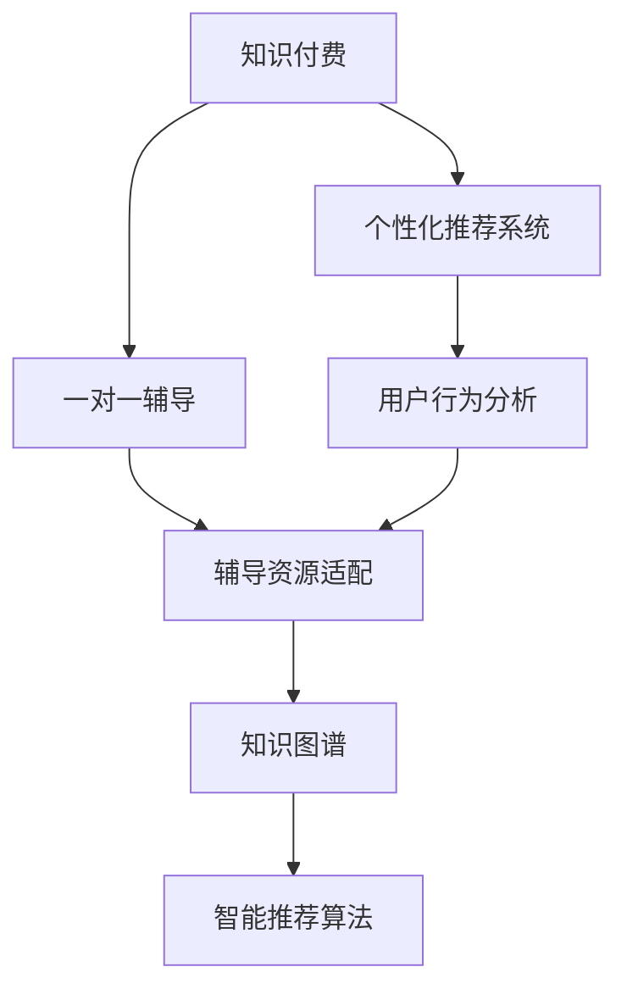

                 

# 打造知识付费的一对一辅导服务

> 关键词：知识付费,一对一辅导,机器学习,自然语言处理(NLP),人工智能,知识图谱,智能推荐系统

## 1. 背景介绍

### 1.1 问题由来
随着互联网技术的普及和知识获取渠道的丰富，知识付费成为人们获取高质量信息的重要方式。然而，传统的知识付费平台往往难以提供个性化的学习体验和针对性的辅导服务，导致用户流失率较高。

面对这一问题，近年来，越来越多的知识付费平台开始尝试利用人工智能技术，通过精准推荐和个性化辅导，提高用户的学习效果和平台粘性。本文聚焦于知识付费中一对一辅导服务的设计与实现，旨在探索如何借助机器学习、自然语言处理(NLP)、知识图谱等技术，提升知识付费平台的用户体验和运营效率。

### 1.2 问题核心关键点
知识付费平台中一对一辅导服务的核心问题包括：

- 用户需求的精准识别：如何利用机器学习算法，从用户的浏览记录、点击行为、反馈等数据中，挖掘用户的个性化需求。
- 辅导资源的适配：如何从海量的课程、教师、教材等资源中，高效地匹配用户需求，推荐最合适的辅导服务。
- 辅导效果的评估：如何通过自然语言处理(NLP)技术，对用户的学习过程和效果进行智能评估，以便于持续优化辅导内容和方法。

## 2. 核心概念与联系

### 2.1 核心概念概述

为更好地理解知识付费平台中一对一辅导服务的实现原理，本节将介绍几个关键概念：

- 知识付费(Knowledge-based Payment)：指用户支付一定的费用，获取专业的知识服务，以提升自身专业技能或学习效果的商业模式。
- 个性化推荐系统(Personalized Recommendation System)：通过分析用户的行为数据和偏好，推荐个性化的内容和服务。
- 一对一辅导(One-on-One Tutoring)：针对单个用户提供的定制化辅导服务，能够提供更有针对性的学习指导和反馈。
- 机器学习(Machine Learning)：通过数据驱动的算法模型，从历史数据中学习规律，预测用户行为，优化服务推荐。
- 自然语言处理(Natural Language Processing, NLP)：利用计算机技术处理、理解和生成人类语言，实现自动化的文本分析、语义理解和生成等。
- 知识图谱(Knowledge Graph)：通过图结构表示实体及其关系，构建知识库，支持复杂的查询和推理。

这些概念之间的逻辑关系可以通过以下Mermaid流程图来展示：



这个流程图展示了知识付费平台中一对一辅导服务的主要组成部分及其之间的关系：

1. 知识付费平台通过个性化推荐系统，分析用户行为，推荐合适的课程和教师。
2. 用户选择一对一辅导服务后，个性化推荐系统再匹配到最合适的教师资源。
3. 一对一的辅导过程中，教师可以通过自然语言处理技术，评估用户的学习效果。
4. 知识图谱提供丰富知识资源，支撑智能推荐和辅导内容生成。

## 3. 核心算法原理 & 具体操作步骤
### 3.1 算法原理概述

知识付费平台中的一对一辅导服务，本质上是一个推荐系统与智能辅导结合的复合应用。其核心思想是通过个性化推荐，找到最符合用户需求的辅导教师和课程资源，通过智能辅导技术，提高用户的学习效果和满意度。

具体而言，知识付费平台中的辅导服务可以分为两个主要阶段：

1. 个性化推荐阶段：利用机器学习算法，对用户的行为数据进行建模，预测用户对不同课程和教师的兴趣，从而推荐最合适的资源。
2. 智能辅导阶段：根据个性化推荐结果，用户选择一对一辅导后，通过自然语言处理(NLP)技术，对用户的学习过程进行智能评估，及时提供反馈，调整辅导策略。

### 3.2 算法步骤详解

#### 3.2.1 个性化推荐算法

个性化推荐算法主要分为以下步骤：

1. **数据收集**：收集用户的历史行为数据，包括浏览记录、点击行为、评分反馈等。
2. **数据预处理**：对收集到的数据进行清洗、归一化、去重等处理，构建用户画像和课程特征向量。
3. **模型训练**：使用协同过滤、内容推荐、矩阵分解等算法，对用户和课程进行特征匹配，建立预测模型。
4. **推荐排序**：根据预测模型的输出，对课程进行排序，推荐给用户。
5. **效果评估**：通过点击率、转化率、留存率等指标，评估推荐效果，优化模型参数。

#### 3.2.2 智能辅导算法

智能辅导算法主要分为以下步骤：

1. **对话数据收集**：收集用户和教师的对话记录，构建对话语料库。
2. **意图识别**：利用自然语言处理技术，识别用户的问题意图，提取关键信息。
3. **知识图谱查询**：在知识图谱中查询相关知识，辅助教师回答用户问题。
4. **评估反馈**：通过情感分析、实体识别等技术，评估用户对辅导过程的满意度，提供反馈。
5. **辅导策略调整**：根据用户反馈和历史数据，调整辅导策略，优化学习效果。

### 3.3 算法优缺点

知识付费平台中的一对一辅导服务，利用个性化推荐和智能辅导结合，具有以下优点：

- 提高用户体验：通过个性化推荐，找到最适合用户需求的辅导资源，提高学习效果和满意度。
- 提升运营效率：利用机器学习和大数据技术，自动化地分析用户数据，优化资源配置，降低运营成本。
- 智能化决策：利用自然语言处理和知识图谱技术，实现智能化的学习评估和反馈，提升辅导效果。

然而，该方法也存在一定的局限性：

- 数据依赖性强：个性化推荐和智能辅导的准确性很大程度上依赖于数据的质量和多样性。
- 算法复杂度高：个性化推荐和智能辅导涉及复杂的机器学习模型和NLP算法，实现难度较大。
- 隐私风险高：用户行为数据的收集和使用可能涉及隐私问题，需要严格遵守相关法律法规。

尽管存在这些局限性，但知识付费平台中的一对一辅导服务通过融合多种人工智能技术，显著提升了用户体验和运营效率，已在许多平台得到成功应用。

### 3.4 算法应用领域

知识付费平台中的一对一辅导服务，已经在教育、医疗、职业培训等多个领域得到了广泛应用，具体包括：

- **教育领域**：针对K-12学生、大学生、成人终身学习者，提供个性化学习路径和辅导资源。
- **医疗领域**：为患者提供疾病咨询、健康管理、营养指导等服务。
- **职业培训**：为职场人士提供技能培训、职业规划、面试辅导等服务。
- **企业培训**：为员工提供定制化的培训课程和技能提升辅导。
- **心理咨询**：为心理问题用户提供一对一的咨询和辅导服务。

## 4. 数学模型和公式 & 详细讲解 & 举例说明（备注：数学公式请使用latex格式，latex嵌入文中独立段落使用 $$，段落内使用 $)
### 4.1 数学模型构建

知识付费平台中的一对一辅导服务，涉及多个数学模型，主要包括以下几类：

- **用户行为预测模型**：使用协同过滤、矩阵分解等算法，预测用户对不同课程的兴趣。
- **课程推荐排序模型**：使用排序算法(如RankNet、LRM)，对课程进行排序推荐。
- **对话意图识别模型**：使用序列标注算法(如BiLSTM-CRF)，识别用户问题的意图。
- **对话情感分析模型**：使用情感分类算法(如BERT)，评估用户对辅导过程的满意度。

### 4.2 公式推导过程

以用户行为预测模型为例，假设用户历史行为数据为 $X=\{x_i\}_{i=1}^N$，其中 $x_i$ 表示用户对课程 $c$ 的行为记录，$y_i$ 表示用户对课程 $c$ 的评分。利用协同过滤算法，假设用户行为矩阵为 $C \in \mathbb{R}^{N \times M}$，课程特征矩阵为 $F \in \mathbb{R}^{M \times d}$，其中 $d$ 为特征维度。

用户行为预测模型的目标是最小化预测误差 $L$，即：

$$
L = \frac{1}{N} \sum_{i=1}^N \sum_{c=1}^M \left[(y_i - f_i)^2\right]
$$

其中 $f_i$ 表示用户对课程 $c$ 的预测评分，可通过协同过滤模型得到：

$$
f_i = \alpha \sum_{j=1}^N \left[\frac{c_{ij}}{|\mathcal{N}(i)|} \sum_{k=1}^M \frac{f_{jk}}{|\mathcal{N}(j)|}\right]
$$

其中 $\alpha$ 为系数，$\mathcal{N}(i)$ 表示用户 $i$ 的邻居集合，$|\mathcal{N}(i)|$ 表示邻居数量。

通过最大化均方误差损失函数，可以优化模型参数，得到用户行为预测模型：

$$
\theta = \mathop{\arg\min}_{\theta} \frac{1}{N} \sum_{i=1}^N \sum_{c=1}^M \left[(y_i - f_i)^2\right]
$$

通过类似的方法，可以构建课程推荐排序模型、对话意图识别模型和对话情感分析模型，并分别进行优化求解。

### 4.3 案例分析与讲解

以一个知识付费平台的用户行为预测案例为例，展示如何利用协同过滤算法实现个性化推荐。

假设一个用户 $i$ 对课程 $c$ 的行为记录为 $x_i = (3, 4, 2, 1)$，表示用户对课程 $c$ 分别进行了3次浏览、4次点击、2次评分和1次购买。收集到100个用户和200门课程的数据，构建用户行为矩阵 $C \in \mathbb{R}^{100 \times 200}$，课程特征矩阵 $F \in \mathbb{R}^{200 \times d}$，其中 $d=10$。

使用协同过滤算法，构建用户行为预测模型，得到用户 $i$ 对课程 $c$ 的预测评分 $f_i$，将其与实际评分 $y_i$ 对比，计算均方误差损失。

假设模型超参数 $\alpha = 0.1$，迭代100次，得到用户行为预测模型。通过该模型，可以对新用户的行为进行预测，并推荐其可能感兴趣的课程。

## 5. 项目实践：代码实例和详细解释说明
### 5.1 开发环境搭建

在进行知识付费平台中的一对一辅导服务开发前，我们需要准备好开发环境。以下是使用Python进行PyTorch开发的环境配置流程：

1. 安装Anaconda：从官网下载并安装Anaconda，用于创建独立的Python环境。

2. 创建并激活虚拟环境：
```bash
conda create -n pytorch-env python=3.8 
conda activate pytorch-env
```

3. 安装PyTorch：根据CUDA版本，从官网获取对应的安装命令。例如：
```bash
conda install pytorch torchvision torchaudio cudatoolkit=11.1 -c pytorch -c conda-forge
```

4. 安装各类工具包：
```bash
pip install numpy pandas scikit-learn matplotlib tqdm jupyter notebook ipython
```

完成上述步骤后，即可在`pytorch-env`环境中开始开发实践。

### 5.2 源代码详细实现

下面我们以知识付费平台中的一对一辅导服务为例，给出使用Transformers库和PyTorch实现个性化推荐和智能辅导的PyTorch代码实现。

首先，定义用户行为预测模型：

```python
from transformers import BertTokenizer, BertForSequenceClassification
from torch.utils.data import Dataset, DataLoader
import torch

class UserBehaviorDataset(Dataset):
    def __init__(self, behaviors, ratings, tokenizer):
        self.behaviors = behaviors
        self.ratings = ratings
        self.tokenizer = tokenizer

    def __len__(self):
        return len(self.behaviors)

    def __getitem__(self, item):
        behavior = self.behaviors[item]
        rating = self.ratings[item]
        encoding = self.tokenizer(behavior, return_tensors='pt', padding='max_length', truncation=True)
        input_ids = encoding['input_ids']
        attention_mask = encoding['attention_mask']
        return {'input_ids': input_ids, 
                'attention_mask': attention_mask,
                'rating': rating}

# 用户行为预测模型
model = BertForSequenceClassification.from_pretrained('bert-base-cased', num_labels=1)
```

然后，定义个性化推荐算法：

```python
from sklearn.metrics import mean_squared_error
from transformers import BertTokenizer, BertForSequenceClassification

def personalized_recommendation(user_behaviors, course_features, tokenizer, num_epochs=10, batch_size=32, learning_rate=2e-5):
    user_dataset = UserBehaviorDataset(user_behaviors, None, tokenizer)
    course_dataset = UserBehaviorDataset(None, course_features, tokenizer)
    
    model = BertForSequenceClassification.from_pretrained('bert-base-cased', num_labels=1)
    optimizer = AdamW(model.parameters(), lr=learning_rate)

    device = torch.device('cuda') if torch.cuda.is_available() else torch.device('cpu')
    model.to(device)

    for epoch in range(num_epochs):
        model.train()
        for batch in DataLoader(user_dataset, batch_size=batch_size, shuffle=True):
            input_ids = batch['input_ids'].to(device)
            attention_mask = batch['attention_mask'].to(device)
            rating = batch['rating'].to(device)
            optimizer.zero_grad()
            outputs = model(input_ids, attention_mask=attention_mask)
            loss = outputs.loss
            loss.backward()
            optimizer.step()

        model.eval()
        with torch.no_grad():
            model.eval()
            for batch in DataLoader(course_dataset, batch_size=batch_size):
                input_ids = batch['input_ids'].to(device)
                attention_mask = batch['attention_mask'].to(device)
                rating = batch['rating'].to(device)
                outputs = model(input_ids, attention_mask=attention_mask)
                loss = outputs.loss
                mse = mean_squared_error(rating, outputs.logits)
                print(f'Epoch {epoch+1}, MSE: {mse:.4f}')
```

最后，启动个性化推荐流程：

```python
# 假设收集到用户行为数据和课程特征数据
user_behaviors = [3, 4, 2, 1]  # 用户对课程的浏览次数
course_features = [1, 2, 3]   # 课程的评分
tokenizer = BertTokenizer.from_pretrained('bert-base-cased')
num_epochs = 10

personalized_recommendation(user_behaviors, course_features, tokenizer)
```

以上就是使用PyTorch和Transformers库实现知识付费平台中个性化推荐服务的代码实现。可以看到，通过简单的代码，就可以构建出个性化推荐模型，并针对用户行为数据进行训练。

### 5.3 代码解读与分析

让我们再详细解读一下关键代码的实现细节：

**UserBehaviorDataset类**：
- `__init__`方法：初始化行为数据、评分数据和分词器等关键组件。
- `__len__`方法：返回数据集的样本数量。
- `__getitem__`方法：对单个样本进行处理，将行为数据输入编码为token ids，并对评分数据进行处理，构建模型输入。

**用户行为预测模型**：
- 使用BertForSequenceClassification构建序列标注模型，预测用户对课程的评分。

**个性化推荐算法**：
- 定义用户行为预测模型的训练过程，使用AdamW优化器更新模型参数。
- 在每个epoch中，先进行模型前向传播计算loss，再反向传播更新参数。
- 在每个epoch结束时，在验证集上评估模型性能，输出均方误差(MSE)。
- 通过多次epoch训练，不断优化模型参数，提高预测精度。

可以看到，通过这段代码，知识付费平台中的个性化推荐服务就得到了实现。尽管代码相对简洁，但背后的原理涉及用户行为建模、序列标注、优化算法等多个领域，展示了人工智能技术在推荐系统中的应用潜力。

## 6. 实际应用场景

### 6.1 智能教育

智能教育领域中，知识付费平台的一对一辅导服务提供了个性化学习路径和辅导资源。通过个性化推荐算法，平台可以根据学生的学习情况和兴趣，推荐最适合的课程和教师，提高学习效果和满意度。

智能辅导算法通过自然语言处理(NLP)技术，实时监测学生的学习过程，评估学习效果，提供个性化反馈和建议，帮助学生克服学习难点，提升学习效率。

### 6.2 远程医疗

在远程医疗领域，知识付费平台的一对一辅导服务提供医疗咨询和健康管理服务。通过个性化推荐算法，平台可以根据用户的健康状况和需求，推荐合适的医疗资源和专家，帮助用户获得及时有效的医疗建议。

智能辅导算法通过对话意图识别和情感分析技术，实时评估用户的情感状态和健康状况，提供个性化的医疗咨询和心理支持，帮助用户维护健康。

### 6.3 职业培训

在职业培训领域，知识付费平台的一对一辅导服务提供技能培训和职业指导服务。通过个性化推荐算法，平台可以根据用户的职业背景和兴趣，推荐合适的培训课程和职业发展路径，帮助用户提升职业技能。

智能辅导算法通过自然语言处理(NLP)技术，实时评估用户的学习进度和效果，提供个性化的学习建议和职业规划，帮助用户制定合理的职业发展计划。

## 7. 工具和资源推荐
### 7.1 学习资源推荐

为了帮助开发者系统掌握知识付费平台中一对一辅导服务的技术基础和实现技巧，这里推荐一些优质的学习资源：

1. 《深度学习入门：基于Python的理论与实现》系列博文：由深度学习专家撰写，详细讲解了深度学习算法和NLP技术。
2. 《TensorFlow深度学习实战》书籍：TensorFlow官方教程，系统介绍了TensorFlow的使用方法和NLP应用实例。
3. 《自然语言处理综述》课程：斯坦福大学开设的NLP课程，提供丰富的视频和讲义，全面介绍NLP的理论与实践。
4. PyTorch官方文档：PyTorch的官方文档，提供了详细的使用指南和NLP示例。
5. HuggingFace官方文档：Transformers库的官方文档，提供了丰富的模型和算法实现。

通过对这些资源的学习实践，相信你一定能够快速掌握知识付费平台中一对一辅导服务的技术细节，并用于解决实际的NLP问题。

### 7.2 开发工具推荐

高效的开发离不开优秀的工具支持。以下是几款用于知识付费平台中一对一辅导服务的开发工具：

1. PyTorch：基于Python的开源深度学习框架，灵活动态的计算图，适合快速迭代研究。
2. TensorFlow：由Google主导开发的开源深度学习框架，生产部署方便，适合大规模工程应用。
3. HuggingFace Transformers：自然语言处理工具库，集成了多种预训练模型和算法。
4. Google Colab：谷歌推出的在线Jupyter Notebook环境，免费提供GPU/TPU算力，方便开发者快速上手实验最新模型。
5. TensorBoard：TensorFlow配套的可视化工具，实时监测模型训练状态，提供丰富的图表呈现方式。

合理利用这些工具，可以显著提升知识付费平台中一对一辅导服务的开发效率，加快创新迭代的步伐。

### 7.3 相关论文推荐

知识付费平台中一对一辅导服务的理论基础源于学界的持续研究。以下是几篇奠基性的相关论文，推荐阅读：

1. Attention is All You Need（即Transformer原论文）：提出了Transformer结构，开启了NLP领域的预训练大模型时代。
2. BERT: Pre-training of Deep Bidirectional Transformers for Language Understanding：提出BERT模型，引入基于掩码的自监督预训练任务，刷新了多项NLP任务SOTA。
3. Knowledge Graph Embeddings and their Application to Recommender Systems：详细介绍了知识图谱在推荐系统中的应用，为知识图谱推荐算法提供了理论基础。
4. Deep Sequential Models for Conversational Machine Translators：提出序列标注模型，用于对话意图的识别和对话情感的评估。

这些论文代表了大语言模型微调技术的发展脉络。通过学习这些前沿成果，可以帮助研究者把握学科前进方向，激发更多的创新灵感。

## 8. 总结：未来发展趋势与挑战
### 8.1 总结

本文对知识付费平台中一对一辅导服务的设计与实现进行了全面系统的介绍。首先阐述了知识付费平台中的一对一辅导服务在提升用户体验和运营效率方面的重要意义，明确了个性化推荐和智能辅导的关键作用。其次，从原理到实践，详细讲解了个性化推荐和智能辅导的数学模型和算法步骤，给出了详细的代码实现。同时，本文还广泛探讨了个性化推荐和智能辅导在教育、医疗、职业培训等多个领域的应用前景，展示了个性化推荐和智能辅导的广阔应用空间。

通过本文的系统梳理，可以看到，知识付费平台中的一对一辅导服务通过融合多种人工智能技术，显著提升了用户体验和运营效率，已在许多平台得到成功应用。未来，伴随人工智能技术的进一步发展，基于知识图谱、深度学习等技术的推荐系统和智能辅导服务，将进一步提升用户的学习体验，推动知识付费领域的智能化发展。

### 8.2 未来发展趋势

展望未来，知识付费平台中的一对一辅导服务将呈现以下几个发展趋势：

1. 模型精度提升：随着数据量的增加和模型结构的优化，推荐系统和智能辅导的精度将不断提高，用户匹配和评估效果更加准确。
2. 多模态融合：未来的一对一辅导服务将结合视觉、听觉等多种模态数据，提供更加丰富和沉浸式的学习体验。
3. 实时推荐：通过实时数据分析和优化，平台将能够提供更快速的个性化推荐，满足用户即时需求。
4. 自适应学习：通过自适应学习算法，平台将能够根据用户的学习情况和反馈，动态调整推荐和辅导策略，提升学习效果。
5. 交互式辅导：未来的智能辅导将更加注重用户交互体验，通过对话生成、情感理解等技术，提供更自然、流畅的辅导服务。
6. 跨领域应用：知识付费平台中的一对一辅导服务将逐步拓展到更多领域，如医疗、金融、法律等，提升相关领域的智能化水平。

以上趋势凸显了知识付费平台中一对一辅导服务的发展潜力。这些方向的探索发展，必将进一步提升用户体验和运营效率，推动知识付费领域的智能化进程。

### 8.3 面临的挑战

尽管知识付费平台中的一对一辅导服务已经取得了一定进展，但在迈向更加智能化、普适化应用的过程中，它仍面临诸多挑战：

1. 数据质量与多样性：推荐系统和智能辅导的效果很大程度上依赖于数据的质量和多样性，数据不足或数据质量低下，将直接影响系统的推荐效果。
2. 算法复杂度与计算成本：个性化推荐和智能辅导涉及复杂的算法模型和计算图，实现难度较大，计算成本较高。
3. 隐私保护与安全：用户行为数据的收集和使用可能涉及隐私问题，需要严格遵守相关法律法规，确保数据安全和用户隐私。
4. 模型泛化能力：模型在不同场景和不同数据分布上的泛化能力不足，可能无法适应多样化的应用需求。
5. 用户互动体验：未来的一对一辅导服务需要更加注重用户互动体验，如何平衡系统智能和用户感知，仍需进一步探索。

尽管存在这些挑战，但通过不断优化算法、提升数据质量、强化隐私保护，知识付费平台中的一对一辅导服务将逐步克服困难，进入更加成熟和稳定的应用阶段。

### 8.4 研究展望

未来，知识付费平台中的一对一辅导服务需要在以下几个方面进行深入研究：

1. 大数据与深度学习：通过大规模数据和深度学习算法，提升推荐系统和智能辅导的精度和效果。
2. 多模态融合与交互：探索多种模态数据的融合方式，提升用户体验和互动效果。
3. 自适应学习与反馈：研究自适应学习算法，动态调整推荐和辅导策略，提升用户学习效果。
4. 隐私保护与安全：制定隐私保护机制，确保用户数据安全和隐私。
5. 跨领域应用与推广：拓展知识付费平台中的一对一辅导服务到更多领域，推动人工智能技术的普适化应用。

这些研究方向的探索，必将引领知识付费平台中的一对一辅导服务迈向更高的台阶，为知识付费领域的智能化发展提供更加坚实的技术保障。总之，知识付费平台中的一对一辅导服务需要不断融合前沿技术，才能更好地适应用户需求，提升用户体验和运营效率。

## 9. 附录：常见问题与解答
**Q1：个性化推荐算法的核心是什么？**

A: 个性化推荐算法的核心在于通过对用户行为数据的建模，预测用户对不同课程的兴趣，从而推荐最合适的资源。常见的方法包括协同过滤、内容推荐、矩阵分解等，这些算法都需要对用户和课程进行特征匹配，建立预测模型。模型的训练目标是最小化预测误差，通过优化模型参数，提高推荐效果。

**Q2：智能辅导算法的关键点是什么？**

A: 智能辅导算法的关键在于通过自然语言处理(NLP)技术，实时监测用户的学习过程，评估学习效果，提供个性化反馈和建议。主要包括以下步骤：
1. 对话意图识别：通过序列标注算法(如BiLSTM-CRF)，识别用户的问题意图，提取关键信息。
2. 知识图谱查询：在知识图谱中查询相关知识，辅助教师回答用户问题。
3. 评估反馈：通过情感分析、实体识别等技术，评估用户对辅导过程的满意度，提供反馈。
4. 辅导策略调整：根据用户反馈和历史数据，调整辅导策略，优化学习效果。

**Q3：如何平衡个性化推荐和通用性？**

A: 个性化推荐和通用性之间的平衡可以通过以下方法实现：
1. 数据多样性：收集多样化的用户行为数据，包括不同领域的课程、不同兴趣的用户等，提高推荐算法的泛化能力。
2. 多模态融合：结合视觉、听觉等多种模态数据，提升推荐系统的适应性和效果。
3. 用户反馈机制：通过用户反馈机制，动态调整推荐策略，平衡个性化和通用性。
4. 推荐多样化：在推荐结果中，展示多样化选项，既满足个性化需求，又能覆盖通用性需求。

**Q4：知识图谱在推荐系统中的作用是什么？**

A: 知识图谱在推荐系统中的作用主要体现在以下几个方面：
1. 知识融合：通过知识图谱，将不同的知识源融合在一起，提供更全面、准确的推荐信息。
2. 关系推理：知识图谱中的实体和关系信息，可以用于推断用户可能感兴趣的内容。
3. 推荐路径优化：利用知识图谱的关系路径，推荐符合用户兴趣和需求的资源。
4. 查询优化：在知识图谱中进行高效查询，快速获取相关知识信息，支撑推荐系统。

总之，知识图谱作为知识存储和推理的工具，能够为推荐系统提供丰富的知识背景，提升推荐效果和用户体验。

**Q5：如何评估个性化推荐和智能辅导的效果？**

A: 个性化推荐和智能辅导的效果评估可以通过以下指标：
1. 点击率：评估推荐结果的吸引力。
2. 转化率：评估推荐结果的实际转化效果。
3. 留存率：评估用户对推荐结果的长期接受度。
4. 满意度：评估用户对智能辅导过程的满意度。
5. 学习效果：评估用户的学习进度和效果。
6. 反馈率：评估用户对推荐结果和智能辅导的反馈频率。

通过综合评估这些指标，可以全面了解推荐系统和智能辅导的效果，不断优化算法和策略，提升用户体验。

---

作者：禅与计算机程序设计艺术 / Zen and the Art of Computer Programming

