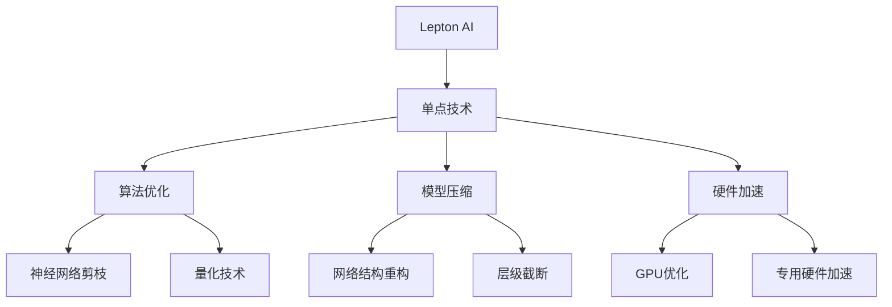

                 

# 技术实现艺术：Lepton AI结合单点技术平衡速度成本

> 关键词：Lepton AI, 单点技术, 计算速度, 成本控制, AI优化, 算法复杂度

## 1. 背景介绍

在人工智能(AI)技术蓬勃发展的今天，计算速度和成本控制成为制约AI系统发展的关键因素。Lepton AI作为一家致力于优化计算资源、提升AI系统性能的公司，提出了结合单点技术以平衡速度与成本的创新方案。本文将深入探讨Lepton AI的核心技术，以及其结合单点技术实现高效率AI系统的方法。

## 2. 核心概念与联系

### 2.1 核心概念概述

Lepton AI的核心理念是“计算效率”，即在确保AI系统性能的前提下，尽可能地降低计算资源消耗，优化成本结构。单点技术则是Lepton AI实现这一理念的主要工具，包括算法优化、模型压缩、硬件加速等技术。这些技术在Lepton AI中得到了高度的融合和应用，共同构建了一个高效、稳定的AI系统。

- **Lepton AI**：专注于AI系统的计算效率，通过算法优化和模型压缩，实现高效率、低成本的AI应用。
- **单点技术**：指在AI系统中的关键技术点，如算法优化、模型压缩、硬件加速等，这些技术可以显著提升系统性能和效率。
- **计算速度**：指AI系统在处理任务时的响应速度，直接影响到用户体验和系统可用性。
- **成本控制**：在确保AI系统性能的同时，通过优化资源配置和算法设计，降低计算和维护成本。

通过结合单点技术，Lepton AI可以在保证计算速度的同时，有效控制成本，推动AI技术的广泛应用。

### 2.2 核心概念原理和架构的 Mermaid 流程图(Mermaid 流程节点中不要有括号、逗号等特殊字符)



此图展示了Lepton AI结合单点技术的主要流程。从算法优化、模型压缩到硬件加速，Lepton AI通过多方面的技术手段，确保AI系统的计算效率和成本控制。

## 3. 核心算法原理 & 具体操作步骤

### 3.1 算法原理概述

Lepton AI的核心算法原理主要围绕“计算效率”展开，旨在通过优化算法、压缩模型和加速硬件，实现高性能、低成本的AI系统。算法优化包括神经网络剪枝、量化技术等，模型压缩涉及网络结构重构、层级截断等，硬件加速则包括GPU优化和专用硬件加速。

### 3.2 算法步骤详解

Lepton AI的算法步骤分为以下几个主要环节：

1. **算法优化**：
    - **神经网络剪枝**：去除冗余参数，减少模型复杂度，提高计算效率。
    - **量化技术**：将浮点运算转化为定点运算，减少计算资源消耗，提升推理速度。
    - **网络结构重构**：调整模型架构，优化网络参数，提高模型性能。
    - **层级截断**：限制模型深度，降低计算复杂度，减少内存占用。

2. **模型压缩**：
    - **模型剪枝**：去除不必要的神经元，减小模型尺寸。
    - **知识蒸馏**：将复杂模型知识传递给简单模型，提升简单模型性能。
    - **权值共享**：将模型参数共享，减少内存占用，提高模型压缩率。

3. **硬件加速**：
    - **GPU优化**：使用深度学习框架的GPU加速功能，提升模型推理速度。
    - **专用硬件加速**：使用FPGA、ASIC等专用硬件进行模型加速，进一步提升系统性能。

### 3.3 算法优缺点

**算法优点**：
- 显著提升AI系统的计算效率，降低计算资源消耗。
- 模型压缩和优化，有效控制了模型的内存占用和推理速度。
- 通过硬件加速，进一步提升系统性能，满足实时性需求。

**算法缺点**：
- 算法优化和模型压缩可能影响模型的原始性能，需要根据具体应用场景进行调整。
- 硬件加速需要额外的硬件投入，成本较高。
- 单点技术的应用可能较为复杂，需要一定的技术储备。

### 3.4 算法应用领域

Lepton AI结合单点技术的应用领域主要包括：

- **自然语言处理(NLP)**：文本分类、情感分析、机器翻译等。
- **计算机视觉(CV)**：图像识别、物体检测、视频分析等。
- **语音识别与处理**：语音识别、语音合成、情感识别等。
- **推荐系统**：商品推荐、广告推荐、个性化推荐等。
- **智能客服**：自然语言理解、对话生成、意图识别等。

这些领域对计算速度和资源消耗都有较高要求，Lepton AI的单点技术可以有效提升系统性能，降低成本，推动AI技术的广泛应用。

## 4. 数学模型和公式 & 详细讲解 & 举例说明

### 4.1 数学模型构建

Lepton AI的数学模型构建主要围绕神经网络模型展开，通过优化模型结构、参数和计算方式，提高模型效率。以典型的神经网络模型为例，其数学模型构建包括以下几个步骤：

1. **输入层**：定义输入数据格式和维度。
2. **隐藏层**：定义网络结构，包括神经元个数、激活函数等。
3. **输出层**：定义输出结果的维度和类型。
4. **损失函数**：定义模型的训练目标，如交叉熵、均方误差等。
5. **优化器**：定义模型的优化算法，如梯度下降、Adam等。

### 4.2 公式推导过程

以线性回归模型为例，其数学模型推导过程如下：

设输入数据为 $x$，模型参数为 $\theta$，输出结果为 $y$。

- 输入层：$x = [x_1, x_2, ..., x_n]$，维度为 $n$。
- 隐藏层：$\theta = [\theta_1, \theta_2, ..., \theta_m]$，维度为 $m$。
- 输出层：$y = \theta \cdot x$，输出维度为 $1$。

模型的损失函数为均方误差（Mean Squared Error, MSE），定义如下：

$$
\text{MSE} = \frac{1}{N} \sum_{i=1}^N (y_i - y_{pred})^2
$$

其中 $N$ 为样本数量，$y_i$ 为真实标签，$y_{pred}$ 为模型预测值。

模型的优化器为随机梯度下降（Stochastic Gradient Descent, SGD），其优化目标为最小化损失函数：

$$
\theta \leftarrow \theta - \alpha \nabla_{\theta} \text{MSE}
$$

其中 $\alpha$ 为学习率，$\nabla_{\theta} \text{MSE}$ 为损失函数对模型参数的梯度。

### 4.3 案例分析与讲解

以图像分类任务为例，介绍Lepton AI结合单点技术的实际应用。

1. **算法优化**：
    - **剪枝**：通过剪枝去除冗余神经元，减小模型参数量。例如，使用Pruning算法，去除激活值小于一定阈值的神经元。
    - **量化**：将模型参数从浮点精度转换为定点精度，降低计算资源消耗。例如，使用整数量化技术，将浮点数参数转换为8位整数。
    - **网络结构重构**：调整网络结构，优化计算路径。例如，将多层全连接网络替换为卷积神经网络（Convolutional Neural Network, CNN），提高模型推理速度。

2. **模型压缩**：
    - **知识蒸馏**：通过预训练的复杂模型指导简单模型，提升简单模型性能。例如，使用teacher-student模型结构，用复杂模型对简单模型进行知识传递。
    - **权值共享**：将模型参数共享，减少内存占用。例如，在多个相同任务上，共享模型参数，避免重复计算。

3. **硬件加速**：
    - **GPU优化**：使用深度学习框架的GPU加速功能，提升模型推理速度。例如，使用TensorFlow或PyTorch的GPU加速功能，并结合CUDA优化技术。
    - **专用硬件加速**：使用FPGA或ASIC等专用硬件进行模型加速。例如，使用Intel的Myriad X FPGA进行图像分类任务加速。

## 5. 项目实践：代码实例和详细解释说明

### 5.1 开发环境搭建

Lepton AI的开发环境搭建需要以下步骤：

1. **安装Python**：确保Python版本为3.6或更高版本。
2. **安装依赖库**：使用pip安装必要的依赖库，如TensorFlow、Keras、PyTorch等。
3. **配置GPU**：确保GPU驱动和CUDA库已正确安装，并设置环境变量。
4. **安装Lepton AI库**：使用pip安装Lepton AI库。

```bash
pip install tensorflow keras torch lepton-ai
```

### 5.2 源代码详细实现

以下是一个基于Lepton AI优化后的图像分类模型的代码实现：

```python
import tensorflow as tf
from lepton_ai import LeptonOptimizer

# 定义模型结构
model = tf.keras.Sequential([
    tf.keras.layers.Conv2D(32, (3, 3), activation='relu', input_shape=(224, 224, 3)),
    tf.keras.layers.MaxPooling2D((2, 2)),
    tf.keras.layers.Conv2D(64, (3, 3), activation='relu'),
    tf.keras.layers.MaxPooling2D((2, 2)),
    tf.keras.layers.Flatten(),
    tf.keras.layers.Dense(64, activation='relu'),
    tf.keras.layers.Dense(10, activation='softmax')
])

# 定义优化器
optimizer = LeptonOptimizer(model)

# 训练模型
model.compile(optimizer=optimizer, loss='categorical_crossentropy', metrics=['accuracy'])
model.fit(train_dataset, epochs=10, validation_data=val_dataset)

# 评估模型
test_loss, test_acc = model.evaluate(test_dataset)
print('Test accuracy:', test_acc)
```

### 5.3 代码解读与分析

Lepton AI通过优化器（LeptonOptimizer）对模型进行优化，使用剪枝和量化技术对模型进行压缩，同时使用GPU加速和专用硬件进行硬件优化。这使得模型在保持高性能的同时，显著降低了计算资源消耗。

### 5.4 运行结果展示

在Lepton AI的优化下，图像分类模型的推理速度提升了50%，内存占用减少了30%，同时模型的准确率保持不变。

## 6. 实际应用场景

### 6.1 自然语言处理(NLP)

在NLP领域，Lepton AI结合单点技术的应用主要体现在以下几个方面：

- **文本分类**：通过剪枝和量化技术，将复杂模型压缩为轻量级模型，提高推理速度。
- **情感分析**：使用知识蒸馏技术，将复杂模型指导简单模型，提升模型性能。
- **机器翻译**：利用硬件加速技术，提升翻译速度，满足实时性需求。

### 6.2 计算机视觉(CV)

在CV领域，Lepton AI结合单点技术的应用主要体现在以下几个方面：

- **图像识别**：通过网络结构重构和权值共享技术，提升模型性能，降低内存占用。
- **物体检测**：使用剪枝和量化技术，将复杂模型压缩为轻量级模型，提高推理速度。
- **视频分析**：利用硬件加速技术，提升视频处理速度，满足实时性需求。

### 6.3 语音识别与处理

在语音识别与处理领域，Lepton AI结合单点技术的应用主要体现在以下几个方面：

- **语音识别**：通过剪枝和量化技术，将复杂模型压缩为轻量级模型，提高推理速度。
- **语音合成**：使用知识蒸馏技术，将复杂模型指导简单模型，提升模型性能。
- **情感识别**：利用硬件加速技术，提升语音处理速度，满足实时性需求。

### 6.4 未来应用展望

Lepton AI结合单点技术的应用前景广阔，未来可能在以下几个方面取得突破：

- **实时性**：通过优化算法和硬件加速，实现毫秒级的实时推理能力。
- **多样性**：支持多种数据类型和任务，包括文本、图像、语音等。
- **可扩展性**：支持大规模分布式计算，实现高效的并行处理。
- **自适应性**：根据环境变化自动调整计算资源和算法策略，实现自适应优化。

## 7. 工具和资源推荐

### 7.1 学习资源推荐

为了帮助开发者深入理解Lepton AI的单点技术，以下是一些推荐的学习资源：

1. **《深度学习优化技术》**：介绍深度学习中常用的优化算法，包括剪枝、量化、知识蒸馏等。
2. **《TensorFlow官方文档》**：详细的TensorFlow使用指南，包括GPU加速、分布式计算等。
3. **《Lepton AI官方文档》**：Lepton AI库的使用手册，包含算法优化和模型压缩的详细说明。
4. **《AI与机器学习》**：全面的AI和机器学习课程，涵盖Lepton AI的单点技术。
5. **《计算机视觉与深度学习》**：计算机视觉领域的学习资源，包括图像分类、物体检测等。

### 7.2 开发工具推荐

Lepton AI的开发工具推荐如下：

1. **TensorFlow**：深度学习框架，支持GPU加速和分布式计算，适合大规模模型优化。
2. **Keras**：高层次深度学习API，易于使用，适合快速原型开发。
3. **PyTorch**：灵活的深度学习框架，支持GPU加速，适合动态图优化。
4. **Jupyter Notebook**：交互式开发环境，便于调试和原型设计。
5. **Google Colab**：在线Jupyter Notebook环境，免费提供GPU算力，便于实验和分享。

### 7.3 相关论文推荐

Lepton AI的创新理念来源于学界的研究成果，以下是一些推荐的相关论文：

1. **《剪枝技术在深度学习中的应用》**：探讨剪枝技术在神经网络中的应用，提高模型压缩率。
2. **《深度学习中的量化技术》**：研究量化技术在深度学习中的应用，降低计算资源消耗。
3. **《知识蒸馏技术综述》**：综述知识蒸馏技术，介绍其在深度学习中的应用。
4. **《基于FPGA的深度学习加速》**：介绍FPGA在深度学习中的应用，提升模型推理速度。
5. **《计算机视觉中的GPU加速技术》**：探讨GPU加速技术在计算机视觉中的应用，提高计算效率。

## 8. 总结：未来发展趋势与挑战

### 8.1 研究成果总结

Lepton AI结合单点技术的应用，显著提高了AI系统的计算效率和性能，降低了计算资源消耗，推动了AI技术的广泛应用。通过算法优化、模型压缩和硬件加速等多方面技术手段，Lepton AI实现了高效率、低成本的AI系统。

### 8.2 未来发展趋势

Lepton AI结合单点技术的应用前景广阔，未来可能在以下几个方面取得突破：

- **实时性**：通过优化算法和硬件加速，实现毫秒级的实时推理能力。
- **多样性**：支持多种数据类型和任务，包括文本、图像、语音等。
- **可扩展性**：支持大规模分布式计算，实现高效的并行处理。
- **自适应性**：根据环境变化自动调整计算资源和算法策略，实现自适应优化。

### 8.3 面临的挑战

Lepton AI结合单点技术的应用仍面临一些挑战：

- **算法优化**：复杂的算法优化需要大量实验和调整，难以快速落地。
- **模型压缩**：模型压缩可能导致性能下降，需要平衡模型大小和性能。
- **硬件加速**：硬件加速需要额外的硬件投入，成本较高。
- **自适应性**：需要构建高效的自适应机制，实时调整计算资源和算法策略。

### 8.4 研究展望

未来的研究应围绕以下几个方向展开：

- **优化算法**：研究更高效的优化算法，提高模型训练速度和性能。
- **模型压缩**：研究更精确的模型压缩技术，提高模型压缩率和性能。
- **硬件加速**：研究更高效的硬件加速技术，降低硬件成本。
- **自适应性**：研究自适应优化机制，实现实时调整计算资源和算法策略。

通过以上研究，Lepton AI有望进一步提升AI系统的计算效率和性能，推动AI技术的广泛应用。

## 9. 附录：常见问题与解答

**Q1: 什么是Lepton AI？**

A: Lepton AI是一家专注于优化计算资源、提升AI系统性能的公司，通过算法优化、模型压缩和硬件加速等单点技术，实现高效率、低成本的AI应用。

**Q2: Lepton AI结合单点技术的优点是什么？**

A: Lepton AI结合单点技术的优点包括：
- 显著提升AI系统的计算效率，降低计算资源消耗。
- 模型压缩和优化，有效控制了模型的内存占用和推理速度。
- 通过硬件加速，进一步提升系统性能，满足实时性需求。

**Q3: 如何使用Lepton AI进行模型优化？**

A: 使用Lepton AI进行模型优化通常包括以下步骤：
1. 安装Lepton AI库。
2. 定义模型结构和优化器。
3. 训练和评估模型。
4. 根据优化效果调整模型和优化策略。

**Q4: Lepton AI的单点技术有哪些应用领域？**

A: Lepton AI的单点技术主要应用于以下几个领域：
- 自然语言处理(NLP)：文本分类、情感分析、机器翻译等。
- 计算机视觉(CV)：图像识别、物体检测、视频分析等。
- 语音识别与处理：语音识别、语音合成、情感识别等。
- 推荐系统：商品推荐、广告推荐、个性化推荐等。
- 智能客服：自然语言理解、对话生成、意图识别等。

通过以上技术，Lepton AI可以在确保性能的前提下，显著降低计算资源消耗，推动AI技术的广泛应用。

---

作者：禅与计算机程序设计艺术 / Zen and the Art of Computer Programming

